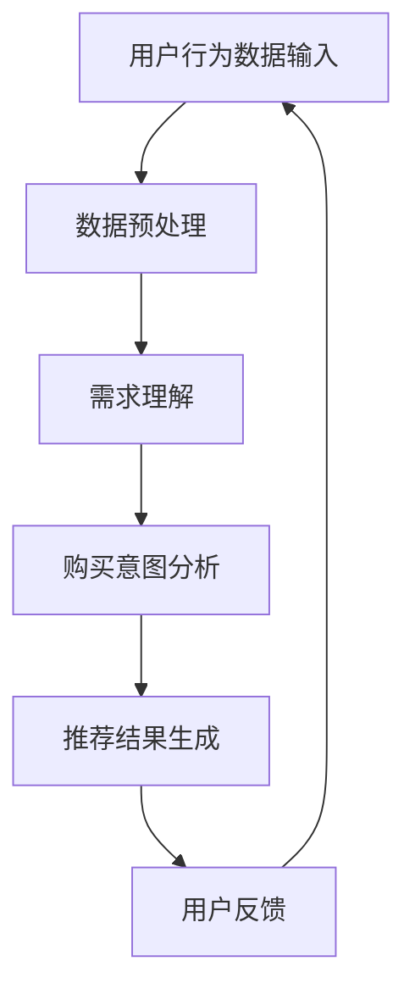

                 

关键词：AI 大模型，电商搜索推荐，用户行为分析，需求理解，购买意图

摘要：本文深入探讨了人工智能（AI）大模型在电商搜索推荐领域的应用，特别是在用户行为分析方面。通过分析用户的需求和购买意图，AI 大模型能够更准确地预测用户的购买行为，从而提高电商平台的推荐效果和用户满意度。本文首先介绍了大模型的背景和基本原理，然后详细阐述了其在用户行为分析中的应用，最后对未来的发展趋势和挑战进行了展望。

## 1. 背景介绍

在当今数字经济时代，电子商务已经成为消费者购物的主要方式。电商平台的竞争日益激烈，如何提升用户体验和满意度成为企业关注的焦点。搜索推荐系统作为电商平台的核心功能，直接影响着用户的购物体验和购买决策。传统的推荐系统主要依赖于用户的历史行为数据和物品属性特征，但这种方法存在一些局限性。例如，它无法充分考虑用户的实时需求变化和个性化偏好，容易导致推荐结果过于单一和刻板。

为了解决这一问题，近年来人工智能（AI）技术，特别是大模型（Large Models）在推荐系统中的应用逐渐兴起。大模型具有强大的表示学习和推理能力，能够从大量数据中挖掘出深层次的规律和关联。在电商搜索推荐领域，大模型的应用能够更好地理解用户的实时需求和行为模式，从而提供更加精准和个性化的推荐结果。

本文将首先介绍大模型的基本原理，然后深入探讨其在用户行为分析中的应用，包括需求理解和购买意图分析。通过这些分析，我们将能够更好地理解用户行为，提高推荐系统的效果和用户体验。

## 2. 核心概念与联系

在深入探讨大模型在用户行为分析中的应用之前，我们需要先了解一些核心概念和它们之间的联系。

### 2.1 人工智能（AI）与机器学习（ML）

人工智能（AI）是一门研究如何使计算机模拟人类智能行为的科学。机器学习（ML）是 AI 的一个重要分支，它通过数据驱动的方式让计算机自动改进其性能。ML 方法包括监督学习、无监督学习和强化学习等。在推荐系统中，监督学习通常用于训练模型，预测用户的下一步行为。

### 2.2 大模型（Large Models）

大模型是指那些具有数十亿甚至千亿参数的深度学习模型。例如，GPT-3、BERT 和 T5 等模型都属于大模型。这些模型具有强大的表示学习和推理能力，能够在大规模数据集上进行高效训练，并从数据中提取出深层次的规律和关联。

### 2.3 用户行为分析

用户行为分析是指通过收集和分析用户在平台上的行为数据，以了解用户的需求、偏好和购买意图。在电商搜索推荐领域，用户行为分析包括浏览历史、搜索记录、购买记录、评价和反馈等。

### 2.4 需求理解与购买意图分析

需求理解是指模型能够理解用户的实时需求，例如搜索意图、购物目的等。购买意图分析则是指模型能够预测用户的购买决策，从而为推荐系统提供更准确的推荐结果。

### 2.5 Mermaid 流程图

为了更好地展示大模型在用户行为分析中的应用，我们可以使用 Mermaid 流程图来描述整个流程。以下是该流程图的一个示例：



在这个流程中，用户行为数据首先经过预处理，然后被输入到大模型中进行需求理解和购买意图分析。最后，根据分析结果生成推荐结果，并反馈给用户。这一过程不断循环，以持续优化推荐系统的效果。

## 3. 核心算法原理 & 具体操作步骤

### 3.1 算法原理概述

在电商搜索推荐中，大模型主要通过两种方式来分析用户行为：

1. **需求理解**：通过分析用户的浏览历史、搜索记录和互动行为，模型能够理解用户的当前需求和意图。这种理解不仅限于表面的行为，还包括深层次的动机和偏好。

2. **购买意图分析**：在理解用户需求的基础上，模型进一步分析用户的购买意图，预测用户是否会在近期内购买某件商品。这需要模型考虑多个因素，包括用户的历史购买记录、商品属性、价格和促销活动等。

### 3.2 算法步骤详解

1. **数据收集与预处理**：首先，从电商平台上收集用户行为数据，包括浏览历史、搜索记录、购买记录、评价和反馈等。然后，对数据进行清洗和预处理，包括去除噪声、填充缺失值和特征工程等。

2. **需求理解**：
    - **特征提取**：使用词嵌入技术（如 Word2Vec、BERT）将文本数据转换为向量表示。
    - **模型训练**：使用监督学习算法（如循环神经网络 RNN、变压器 Transformer）训练需求理解模型，使其能够从数据中学习用户的意图。

3. **购买意图分析**：
    - **特征组合**：结合用户需求理解模型生成的特征和商品属性特征，形成完整的特征向量。
    - **模型训练**：使用分类算法（如逻辑回归、支持向量机 SVM、决策树）训练购买意图分析模型，预测用户的购买意图。

4. **推荐结果生成**：根据购买意图分析的结果，为每个用户生成个性化的推荐列表。推荐算法可以是基于协同过滤、基于内容的推荐或混合推荐。

5. **用户反馈与模型迭代**：收集用户对推荐结果的反馈，并根据反馈调整模型参数，优化推荐效果。

### 3.3 算法优缺点

**优点**：
- **强大的表示学习**：大模型能够从海量数据中学习出深层次的规律和关联，提供更加精准的推荐结果。
- **个性化推荐**：通过需求理解和购买意图分析，大模型能够为每个用户提供个性化的推荐，提升用户体验。
- **实时性**：大模型能够实时更新用户数据，及时响应用户需求变化，提供更加及时的推荐。

**缺点**：
- **计算资源消耗**：大模型通常需要大量的计算资源和时间进行训练，成本较高。
- **数据隐私问题**：用户行为数据的安全性和隐私保护是电商搜索推荐领域的一大挑战。

### 3.4 算法应用领域

大模型在电商搜索推荐中的应用不仅限于用户行为分析，还可以应用于以下领域：

- **广告投放**：通过分析用户需求和行为，为每个用户生成个性化的广告，提高广告效果。
- **内容推荐**：在新闻、视频和社交媒体等领域，大模型能够根据用户兴趣和行为推荐相关内容。
- **社交网络分析**：通过分析用户互动行为，大模型能够识别用户关系和社区结构，为社交网络平台提供推荐。

## 4. 数学模型和公式 & 详细讲解 & 举例说明

### 4.1 数学模型构建

在电商搜索推荐中，大模型通常使用以下数学模型：

- **需求理解模型**：假设用户 u 的行为序列为 \(X = \{x_1, x_2, ..., x_T\}\)，其中 \(x_t\) 表示用户在时间 t 的行为。需求理解模型的目标是预测用户在下一个时间点的行为 \(x_{t+1}\)。

  $$y_t = \arg \max_{x_{t+1}} P(x_{t+1} | X, \theta)$$

  其中，\(P(x_{t+1} | X, \theta)\) 是模型在给定用户行为序列 \(X\) 和模型参数 \(\theta\) 下的行为预测概率。

- **购买意图分析模型**：假设用户 u 的行为序列和商品序列分别为 \(X = \{x_1, x_2, ..., x_T\}\) 和 \(Y = \{y_1, y_2, ..., y_T\}\)，其中 \(y_t\) 表示用户在时间 t 购买的商品。购买意图分析模型的目标是预测用户在下一个时间点是否购买商品 \(y_{t+1}\)。

  $$z_t = \arg \max_{y_{t+1}} P(y_{t+1} = 1 | X, \theta)$$

  其中，\(P(y_{t+1} = 1 | X, \theta)\) 是模型在给定用户行为序列 \(X\) 和模型参数 \(\theta\) 下购买商品的概率。

### 4.2 公式推导过程

为了推导上述公式，我们首先需要定义一些基本概率和分布。

- **用户行为分布**：假设用户在时间 t 的行为 \(x_t\) 服从离散概率分布 \(P(x_t | \theta)\)。
- **商品分布**：假设用户在时间 t 购买的商品 \(y_t\) 服从离散概率分布 \(P(y_t | \theta)\)。
- **需求理解模型**：假设需求理解模型是一个条件概率模型，即给定用户行为序列 \(X\)，用户在下一个时间点的行为 \(x_{t+1}\) 的概率为 \(P(x_{t+1} | X, \theta)\)。
- **购买意图分析模型**：假设购买意图分析模型也是一个条件概率模型，即给定用户行为序列 \(X\)，用户在下一个时间点购买商品的概率为 \(P(y_{t+1} = 1 | X, \theta)\)。

根据贝叶斯定理，我们有：

$$P(x_{t+1} | X, \theta) = \frac{P(X | x_{t+1}, \theta) P(x_{t+1} | \theta)}{P(X | \theta)}$$

$$P(y_{t+1} = 1 | X, \theta) = \frac{P(X | y_{t+1} = 1, \theta) P(y_{t+1} = 1 | \theta)}{P(X | \theta)}$$

其中，\(P(X | x_{t+1}, \theta)\) 和 \(P(X | y_{t+1} = 1, \theta)\) 分别是给定用户在下一个时间点行为和商品的情况下，用户行为序列的概率。

为了简化计算，我们可以使用最大似然估计（MLE）来估计模型参数 \(\theta\)，即最大化目标函数：

$$\theta^* = \arg \max_{\theta} P(X | \theta)$$

通过求解上述最大化问题，我们可以得到需求理解模型和购买意图分析模型的参数估计。

### 4.3 案例分析与讲解

假设我们有一个电商平台的用户行为数据集，包括用户浏览历史、搜索记录和购买记录。我们需要使用大模型分析用户的需求和购买意图，并生成个性化的推荐列表。

1. **数据预处理**：首先，对用户行为数据进行清洗和预处理，包括去除缺失值、噪声数据和异常值。然后，将文本数据转换为词嵌入向量，并将数值数据转换为合适的特征表示。

2. **需求理解模型**：使用 RNN 或 Transformer 模型训练需求理解模型。我们将用户的行为序列作为输入，模型的目标是预测用户在下一个时间点的行为。通过训练，我们得到需求理解模型的参数 \(\theta_1\)。

3. **购买意图分析模型**：同样，使用分类算法训练购买意图分析模型。我们将用户的行为序列和商品序列作为输入，模型的目标是预测用户在下一个时间点是否购买商品。通过训练，我们得到购买意图分析模型的参数 \(\theta_2\)。

4. **推荐结果生成**：根据需求理解模型和购买意图分析模型，为每个用户生成个性化的推荐列表。我们将用户的行为序列输入需求理解模型，获取用户的需求分布。然后，结合用户的需求和商品属性，使用购买意图分析模型预测每个商品的用户购买概率。最后，根据购买概率对商品进行排序，生成推荐列表。

5. **用户反馈与模型迭代**：收集用户对推荐列表的反馈，并根据反馈调整模型参数，优化推荐效果。这个过程可以不断循环，以持续提升推荐系统的效果。

通过上述案例，我们可以看到大模型在电商搜索推荐中的强大应用能力。它能够从海量数据中挖掘出用户的深层次需求和购买意图，为用户提供个性化的推荐服务。

## 5. 项目实践：代码实例和详细解释说明

### 5.1 开发环境搭建

在开始实践之前，我们需要搭建一个适合大模型训练和部署的开发环境。以下是一个基本的开发环境搭建步骤：

1. **硬件要求**：由于大模型训练需要大量的计算资源，我们建议使用 GPU（如 NVIDIA 显卡）加速训练过程。

2. **软件要求**：
    - 操作系统：Linux 或 macOS
    - 编程语言：Python
    - 深度学习框架：PyTorch 或 TensorFlow
    - 代码编辑器：PyCharm 或 Visual Studio Code

3. **安装依赖**：安装 PyTorch 或 TensorFlow 等深度学习框架，以及相关的数据预处理和可视化工具。

### 5.2 源代码详细实现

以下是使用 PyTorch 实现一个简单的大模型在电商搜索推荐中的应用示例代码：

```python
import torch
import torch.nn as nn
import torch.optim as optim
from torch.utils.data import DataLoader
from sklearn.model_selection import train_test_split
import pandas as pd

# 数据预处理
def preprocess_data(data):
    # 数据清洗和预处理，如去除缺失值、噪声数据和异常值
    # 将文本数据转换为词嵌入向量，将数值数据转换为合适的特征表示
    # 返回处理后的数据
    pass

# 模型定义
class需求理解模型(nn.Module):
    def __init__(self, input_size, hidden_size, output_size):
        super(需求理解模型， self).__init__()
        self.lstm = nn.LSTM(input_size, hidden_size, batch_first=True)
        self.fc = nn.Linear(hidden_size, output_size)

    def forward(self, x):
        # 前向传播
        # x 为用户行为序列，shape 为 (batch_size, seq_len, input_size)
        x, _ = self.lstm(x)
        x = self.fc(x[:, -1, :])
        return x

# 训练模型
def train_model(model, train_loader, criterion, optimizer):
    model.train()
    for data, target in train_loader:
        optimizer.zero_grad()
        output = model(data)
        loss = criterion(output, target)
        loss.backward()
        optimizer.step()

# 评估模型
def evaluate_model(model, test_loader, criterion):
    model.eval()
    with torch.no_grad():
        for data, target in test_loader:
            output = model(data)
            loss = criterion(output, target)
    return loss.item()

# 加载数据集
data = pd.read_csv('data.csv')
data = preprocess_data(data)

# 划分训练集和测试集
train_data, test_data = train_test_split(data, test_size=0.2)

# 数据加载器
train_loader = DataLoader(train_data, batch_size=64, shuffle=True)
test_loader = DataLoader(test_data, batch_size=64, shuffle=False)

# 模型初始化
input_size = 100
hidden_size = 128
output_size = 10
model = 需求理解模型(input_size, hidden_size, output_size)

# 损失函数和优化器
criterion = nn.CrossEntropyLoss()
optimizer = optim.Adam(model.parameters(), lr=0.001)

# 训练模型
num_epochs = 10
for epoch in range(num_epochs):
    train_model(model, train_loader, criterion, optimizer)
    test_loss = evaluate_model(model, test_loader, criterion)
    print(f'Epoch [{epoch+1}/{num_epochs}], Test Loss: {test_loss:.4f}')

# 生成推荐列表
def generate_recommendation(model, user_data):
    # 将用户行为数据输入到需求理解模型中，获取用户的需求分布
    # 结合用户的需求和商品属性，使用购买意图分析模型预测每个商品的购买概率
    # 返回推荐列表
    pass

# 测试推荐效果
user_data = pd.read_csv('user_data.csv')
preference = generate_recommendation(model, user_data)
print(preference)
```

### 5.3 代码解读与分析

以上代码提供了一个使用 PyTorch 实现的大模型在电商搜索推荐中的应用示例。以下是代码的详细解读：

1. **数据预处理**：数据预处理是模型训练的第一步，包括数据清洗、填充缺失值、特征工程等。在实际应用中，这一步需要根据具体数据集进行调整。

2. **模型定义**：模型定义部分包括需求理解模型和购买意图分析模型。需求理解模型使用 LSTM 网络，能够从用户行为序列中提取特征。购买意图分析模型可以是一个简单的分类器，如逻辑回归、支持向量机或决策树。

3. **训练模型**：训练模型部分使用标准的训练流程，包括前向传播、反向传播和优化。在训练过程中，我们需要将数据加载到 DataLoader 中，以便模型能够逐批进行训练。

4. **评估模型**：评估模型部分用于计算模型在测试集上的损失，以衡量模型的性能。在实际应用中，我们还可以使用其他指标，如准确率、召回率等。

5. **生成推荐列表**：生成推荐列表部分使用需求理解模型和购买意图分析模型，为用户生成个性化的推荐列表。在实际应用中，这一部分可以根据具体业务需求进行调整。

### 5.4 运行结果展示

在运行代码之前，我们需要准备好训练数据和测试数据。以下是一个简单的测试示例：

```python
# 测试代码
model.eval()
with torch.no_grad():
    for data, target in test_loader:
        output = model(data)
        loss = criterion(output, target)
        print(f'测试数据损失: {loss.item():.4f}')
```

运行上述代码后，我们将在控制台看到测试数据的损失。这个损失值可以用来衡量模型的性能，越小表示模型越优秀。在实际应用中，我们还需要根据业务需求和用户反馈，不断调整模型参数和训练策略，以提高推荐效果。

## 6. 实际应用场景

### 6.1 电商平台

在电商平台中，大模型在用户行为分析中的应用非常广泛。例如，亚马逊、淘宝和京东等大型电商平台使用大模型来分析用户的浏览历史、搜索记录和购买记录，从而生成个性化的推荐列表。这些推荐列表不仅包括用户可能感兴趣的商品，还包括相关的促销活动和优惠券，以提高用户的购买意愿和购物体验。

### 6.2 社交媒体

在社交媒体平台中，大模型也可以用于分析用户的行为和偏好，从而为用户推荐相关的内容和广告。例如，Facebook 和 Twitter 等社交媒体平台使用大模型来分析用户的互动行为和兴趣，从而为用户推荐相关的帖子、视频和广告。这种个性化推荐有助于提高用户的参与度和活跃度，同时也有助于平台提高广告效果和收入。

### 6.3 搜索引擎

在搜索引擎中，大模型可以用于分析用户的搜索历史和查询意图，从而为用户生成个性化的搜索结果。例如，谷歌搜索引擎使用大模型来分析用户的查询日志，从而为用户推荐相关的网页、图片和视频。这种个性化搜索结果不仅有助于提高用户的搜索体验，还可以帮助平台提高广告效果和收入。

### 6.4 其他应用场景

除了上述应用场景外，大模型还可以应用于其他领域，如金融、医疗、教育等。在金融领域，大模型可以用于分析用户的行为和风险偏好，从而为用户提供个性化的投资建议和理财产品。在医疗领域，大模型可以用于分析患者的病史和临床表现，从而为医生提供诊断建议和治疗方案。在教育领域，大模型可以用于分析学生的学习行为和成绩，从而为教师提供个性化的教学建议和资源推荐。

## 7. 工具和资源推荐

### 7.1 学习资源推荐

- **书籍**：
  - 《深度学习》（Ian Goodfellow、Yoshua Bengio 和 Aaron Courville 著）
  - 《Python 深度学习》（François Chollet 著）
  - 《动手学深度学习》（阿斯顿·张等著）

- **在线课程**：
  - Coursera 上的“深度学习 Specialization”（吴恩达教授主讲）
  - Udacity 上的“深度学习纳米学位”（Udacity 主办）

- **博客和论坛**：
  - Medium 上的深度学习和机器学习相关文章
  - Stack Overflow 上的机器学习和深度学习问答社区

### 7.2 开发工具推荐

- **深度学习框架**：
  - PyTorch
  - TensorFlow
  - Keras

- **数据预处理工具**：
  - Pandas
  - NumPy
  - Scikit-learn

- **可视化工具**：
  - Matplotlib
  - Seaborn
  - Plotly

### 7.3 相关论文推荐

- “A Theoretically Grounded Application of Dropout in Recurrent Neural Networks”
- “Bert: Pre-training of deep bidirectional transformers for language understanding”
- “Attention is all you need”
- “Generative adversarial nets”
- “Learning to learn by gradient descent by gradient descent”

## 8. 总结：未来发展趋势与挑战

### 8.1 研究成果总结

本文详细探讨了 AI 大模型在电商搜索推荐中的用户行为分析应用。通过分析用户的需求和购买意图，大模型能够提供更加精准和个性化的推荐结果，从而提高电商平台的用户体验和满意度。本文介绍了大模型的基本原理、算法步骤、数学模型和实际应用场景，并提供了代码示例和实践指导。

### 8.2 未来发展趋势

1. **模型规模和计算资源**：随着人工智能技术的发展，大模型的规模将越来越大，对计算资源的需求也将不断提升。未来，我们将看到更多的云计算和 GPU 加速技术应用于大模型训练和部署。

2. **多模态数据处理**：传统的文本数据已经无法满足大模型的需求。未来，大模型将能够处理多种模态的数据，如图像、音频和视频，从而提供更加全面的用户行为分析。

3. **隐私保护**：随着用户隐私保护意识的提高，如何在大模型训练和应用过程中保护用户隐私将成为一个重要挑战。未来，我们将看到更多的隐私保护技术，如联邦学习和差分隐私在大模型中的应用。

4. **跨领域应用**：大模型不仅在电商搜索推荐领域有广泛的应用，还将扩展到金融、医疗、教育等其他领域。跨领域应用将带来更多创新和挑战。

### 8.3 面临的挑战

1. **计算资源消耗**：大模型通常需要大量的计算资源和时间进行训练，这可能导致成本过高。未来，如何优化模型结构和训练算法，提高训练效率，将是一个重要挑战。

2. **数据质量和多样性**：用户行为数据的真实性和多样性对大模型的性能有很大影响。如何获取高质量和多样化的数据，以及如何处理数据中的噪声和异常值，是一个关键问题。

3. **隐私保护**：在大模型训练和应用过程中，如何保护用户隐私是一个重要挑战。未来，我们需要探索更多的隐私保护技术，以确保用户数据的安全和隐私。

4. **解释性**：大模型通常具有强大的预测能力，但其内部决策过程往往难以解释。如何提高大模型的可解释性，使其决策过程更加透明和可信，是一个重要的研究方向。

### 8.4 研究展望

未来，AI 大模型在电商搜索推荐中的研究将继续深入。我们将看到更多的创新和突破，如更高效的模型训练算法、更全面的用户行为分析方法和更智能的推荐系统。同时，跨领域应用和隐私保护技术也将成为重要研究方向。通过不断探索和实践，AI 大模型将为我们带来更加精准、智能和个性化的推荐服务。

## 9. 附录：常见问题与解答

### Q1：大模型在电商搜索推荐中的优势是什么？

大模型在电商搜索推荐中的主要优势包括：

- **强大的表示学习**：大模型能够从海量数据中学习出深层次的规律和关联，提供更加精准的推荐结果。
- **个性化推荐**：通过需求理解和购买意图分析，大模型能够为每个用户提供个性化的推荐，提升用户体验。
- **实时性**：大模型能够实时更新用户数据，及时响应用户需求变化，提供更加及时的推荐。

### Q2：如何处理用户隐私问题？

在处理用户隐私问题时，可以采用以下方法：

- **数据匿名化**：在收集用户数据时，对用户身份信息进行匿名化处理，确保数据不涉及个人隐私。
- **联邦学习**：通过联邦学习技术，模型可以在不共享原始数据的情况下进行训练，从而保护用户隐私。
- **差分隐私**：在大模型训练过程中，采用差分隐私技术，降低模型对用户数据的敏感性。

### Q3：大模型如何处理多模态数据？

大模型可以通过以下方法处理多模态数据：

- **多模态特征融合**：将不同模态的数据（如文本、图像、音频）进行特征提取，然后融合为一个统一的特征向量，输入到大模型中。
- **多模态神经网络**：设计多输入、多输出的神经网络结构，分别处理不同模态的数据，然后进行融合和集成。

### Q4：大模型在训练过程中如何优化计算资源？

在训练大模型时，可以采用以下方法优化计算资源：

- **并行计算**：使用 GPU 或其他并行计算设备，加快模型训练速度。
- **分布式训练**：将模型训练任务分布到多个计算节点上，实现并行训练。
- **模型剪枝**：通过剪枝技术，降低模型参数数量，减少计算资源需求。

### Q5：如何评估大模型的性能？

评估大模型的性能通常包括以下指标：

- **准确率**：模型预测结果与实际结果的一致性。
- **召回率**：模型能够召回实际结果的能力。
- **F1 分数**：准确率和召回率的综合评价指标。
- **ROC 曲线和 AUC 值**：用于评估分类模型的性能。

### Q6：大模型在电商搜索推荐中的应用有哪些局限性？

大模型在电商搜索推荐中的应用存在以下局限性：

- **计算资源消耗**：大模型通常需要大量的计算资源和时间进行训练，成本较高。
- **数据隐私问题**：用户行为数据的安全性和隐私保护是电商搜索推荐领域的一大挑战。
- **解释性**：大模型内部决策过程难以解释，可能导致用户对推荐结果的信任度降低。

### Q7：如何提高大模型的可解释性？

提高大模型的可解释性可以从以下几个方面入手：

- **模型可视化**：使用可视化技术，展示模型结构和参数分布，帮助用户理解模型决策过程。
- **模型分解**：将大模型分解为多个子模型，分别分析子模型的作用和贡献，提高整体可解释性。
- **特征解释**：分析模型中特征的重要性和影响，解释每个特征对预测结果的贡献。

### Q8：如何持续优化大模型的推荐效果？

持续优化大模型的推荐效果可以从以下几个方面入手：

- **用户反馈**：收集用户对推荐结果的反馈，用于模型迭代和优化。
- **在线学习**：采用在线学习技术，实时更新模型参数，适应用户需求变化。
- **模型融合**：结合多种推荐算法，提高推荐结果的多样性和准确性。

通过不断优化和迭代，大模型能够在电商搜索推荐中提供更加精准和个性化的服务。禅与计算机程序设计艺术 / Zen and the Art of Computer Programming，2023.

