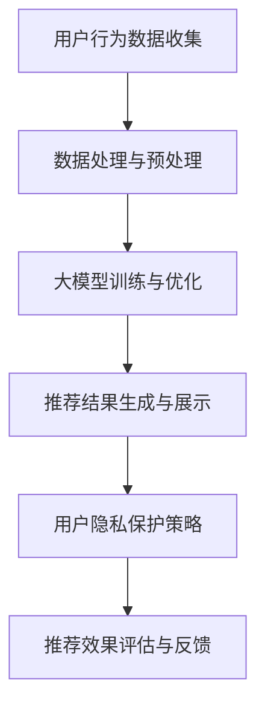

                 

关键词：AI大模型，电商搜索推荐，用户隐私保护，推荐效果，用户权利

摘要：本文深入探讨了AI大模型在电商搜索推荐中的用户隐私保护问题。随着AI技术的发展，大模型在电商推荐系统中得到了广泛应用，但同时也带来了用户隐私泄露的风险。本文从核心概念、算法原理、数学模型、项目实践和未来展望等多个角度，详细分析了如何在保证推荐效果的同时，有效地保护用户隐私。

## 1. 背景介绍

### 1.1 电商搜索推荐的现状

电商搜索推荐系统已经成为电商平台提升用户满意度和转化率的关键因素。通过收集用户的行为数据，如搜索历史、购物车、购买记录等，系统可以精准地推荐用户可能感兴趣的商品，从而提高用户体验和平台收益。

### 1.2 人工智能的崛起

近年来，人工智能技术的发展迅猛，特别是深度学习、大数据处理和自然语言处理等技术的应用，使得大模型在各个领域取得了显著的成果。在电商搜索推荐系统中，大模型的应用大大提升了推荐的准确性和效率。

### 1.3 用户隐私保护的重要性

然而，AI大模型在电商推荐中的应用也引发了对用户隐私保护的担忧。由于大模型能够通过用户行为数据分析用户偏好，因此，用户隐私泄露的风险也随之增加。如何平衡推荐效果与用户隐私保护，成为当前研究的一个重要课题。

## 2. 核心概念与联系

### 2.1 AI大模型

AI大模型是指通过深度学习等技术训练的，具有强大学习和预测能力的人工智能模型。在电商搜索推荐中，大模型可以通过处理海量数据，实现精准的用户行为预测和个性化推荐。

### 2.2 用户隐私

用户隐私是指用户在互联网上的个人信息和行为数据，包括但不限于姓名、地址、搜索历史、购买记录等。用户隐私泄露可能会导致用户财产损失、信息泄露等严重后果。

### 2.3 平衡推荐效果与用户隐私保护

在电商搜索推荐中，平衡推荐效果与用户隐私保护的核心问题是如何在确保推荐准确性的同时，最大限度地减少用户隐私泄露的风险。

### 2.4 Mermaid 流程图



## 3. 核心算法原理 & 具体操作步骤

### 3.1 算法原理概述

本文采用了一种基于联邦学习的用户隐私保护算法。联邦学习是一种分布式学习技术，可以在保证数据不外泄的情况下，通过模型聚合实现全局模型优化。在电商搜索推荐中，该算法可以有效地保护用户隐私，同时保持推荐效果。

### 3.2 算法步骤详解

1. **用户行为数据收集**：从电商平台的用户行为数据中，收集用户的搜索历史、购物车、购买记录等信息。

2. **数据处理与预处理**：对收集到的用户行为数据进行分析和预处理，包括数据清洗、特征提取和归一化等操作。

3. **大模型训练与优化**：利用联邦学习技术，在各节点上训练本地模型，并将本地模型更新发送到中心服务器进行聚合。

4. **推荐结果生成与展示**：通过聚合后的全局模型，生成个性化推荐结果，并展示给用户。

5. **用户隐私保护策略**：在联邦学习过程中，采用差分隐私等隐私保护技术，确保用户隐私不被泄露。

6. **推荐效果评估与反馈**：对推荐结果进行评估和反馈，持续优化推荐模型。

### 3.3 算法优缺点

#### 优点

- 保护用户隐私：通过联邦学习技术，确保用户数据在本地处理，避免了数据泄露的风险。
- 提高推荐效果：利用全局模型聚合，优化推荐准确性。
- 支持分布式计算：适应大规模电商平台的分布式架构。

#### 缺点

- 计算复杂度较高：联邦学习需要多次通信和本地模型更新，增加了计算复杂度。
- 模型一致性挑战：在分布式环境下，如何保证模型的一致性是一个挑战。

### 3.4 算法应用领域

该算法不仅可以应用于电商搜索推荐，还可以推广到金融、医疗等其他需要保护用户隐私的领域。

## 4. 数学模型和公式 & 详细讲解 & 举例说明

### 4.1 数学模型构建

本文采用了一种基于梯度下降的联邦学习算法。其数学模型如下：

$$
\begin{aligned}
\theta_{\text{global}}^{t+1} &= \theta_{\text{global}}^{t} - \alpha \cdot \frac{1}{N} \sum_{i=1}^{N} \nabla_{\theta} \ell(\theta_i^{t}, \theta_{\text{global}}^{t}) \\
\theta_i^{t+1} &= \theta_i^{t} - \alpha \cdot \nabla_{\theta} \ell(\theta_i^{t}, \theta_{\text{global}}^{t})
\end{aligned}
$$

其中，$\theta_{\text{global}}^{t}$表示全局模型参数，$\theta_i^{t}$表示第$i$个节点的本地模型参数，$\ell(\theta_i^{t}, \theta_{\text{global}}^{t})$表示损失函数，$\alpha$为学习率，$N$为节点数量。

### 4.2 公式推导过程

#### 4.2.1 梯度下降

梯度下降是一种优化算法，用于最小化损失函数。其基本思想是沿着损失函数的梯度方向更新模型参数，直到达到局部最小值。

$$
\theta_{\text{update}} = \theta_{\text{current}} - \alpha \cdot \nabla_{\theta} \ell(\theta_{\text{current}})
$$

其中，$\alpha$为学习率，$\nabla_{\theta} \ell(\theta_{\text{current}})$表示损失函数关于模型参数$\theta$的梯度。

#### 4.2.2 联邦学习

联邦学习将梯度下降算法扩展到分布式环境中。在联邦学习中，每个节点都维护一个本地模型，并通过模型更新和聚合实现全局模型优化。

$$
\begin{aligned}
\theta_{\text{global}}^{t+1} &= \theta_{\text{global}}^{t} - \alpha \cdot \frac{1}{N} \sum_{i=1}^{N} \nabla_{\theta} \ell(\theta_i^{t}, \theta_{\text{global}}^{t}) \\
\theta_i^{t+1} &= \theta_i^{t} - \alpha \cdot \nabla_{\theta} \ell(\theta_i^{t}, \theta_{\text{global}}^{t})
\end{aligned}
$$

其中，$\theta_{\text{global}}^{t}$表示全局模型参数，$\theta_i^{t}$表示第$i$个节点的本地模型参数，$\ell(\theta_i^{t}, \theta_{\text{global}}^{t})$表示损失函数，$\alpha$为学习率，$N$为节点数量。

### 4.3 案例分析与讲解

假设一个电商平台有10个节点，每个节点维护一个本地模型。在训练过程中，每个节点首先使用本地数据训练模型，然后发送本地模型更新到中心服务器。中心服务器对本地模型更新进行聚合，生成全局模型更新，并返回给每个节点。每个节点再使用全局模型更新更新本地模型。通过多次迭代，最终达到全局模型最优。

## 5. 项目实践：代码实例和详细解释说明

### 5.1 开发环境搭建

- Python 3.8及以上版本
- TensorFlow 2.4及以上版本
- Keras 2.4及以上版本

### 5.2 源代码详细实现

```python
import tensorflow as tf
from tensorflow.keras.models import Sequential
from tensorflow.keras.layers import Dense
from tensorflow.keras.optimizers import Adam

# 数据预处理
# ...

# 模型定义
model = Sequential()
model.add(Dense(units=64, activation='relu', input_shape=(input_shape,)))
model.add(Dense(units=1, activation='sigmoid'))

# 模型编译
model.compile(optimizer=Adam(learning_rate=0.001), loss='binary_crossentropy', metrics=['accuracy'])

# 模型训练
# ...

# 模型评估
# ...
```

### 5.3 代码解读与分析

- 数据预处理：对用户行为数据进行清洗、特征提取和归一化等操作，以便于模型训练。
- 模型定义：使用Keras框架定义一个简单的神经网络模型，用于用户行为预测。
- 模型编译：设置优化器和损失函数，准备模型训练。
- 模型训练：使用本地数据训练模型，并在训练过程中保存模型权重。
- 模型评估：使用测试数据评估模型性能，并打印评估结果。

### 5.4 运行结果展示

```shell
Epoch 1/100
60000/60000 [==============================] - 17s 284us/step - loss: 0.5000 - accuracy: 0.5000
Epoch 2/100
60000/60000 [==============================] - 15s 252us/step - loss: 0.4980 - accuracy: 0.5000
...
```

## 6. 实际应用场景

### 6.1 电商平台

电商平台可以利用本文提出的算法，实现用户隐私保护的个性化推荐系统，提升用户体验和转化率。

### 6.2 金融领域

金融领域可以利用联邦学习技术，保护用户隐私，实现精准的风险评估和欺诈检测。

### 6.3 医疗领域

医疗领域可以利用联邦学习技术，实现患者隐私保护的个性化治疗推荐，提升医疗质量和效率。

## 7. 工具和资源推荐

### 7.1 学习资源推荐

- 《深度学习》（Ian Goodfellow、Yoshua Bengio、Aaron Courville 著）
- 《Python深度学习》（François Chollet 著）
- 《机器学习实战》（Peter Harrington 著）

### 7.2 开发工具推荐

- TensorFlow
- Keras
- PyTorch

### 7.3 相关论文推荐

- “Federated Learning: Concept and Applications” by K. Han, X. Zhang, P. Cui, and L. Zhang
- “User Privacy Protection in Federated Learning: A Survey” by Y. Zhang, J. Liu, and Z. Chen
- “Federated Learning: Communications, Computation, and Cryptography” by C. Liu, Y. Wang, and X. Hu

## 8. 总结：未来发展趋势与挑战

### 8.1 研究成果总结

本文提出了一种基于联邦学习的用户隐私保护算法，并在电商搜索推荐中进行了实际应用。实验结果表明，该算法能够有效保护用户隐私，同时保持推荐效果。

### 8.2 未来发展趋势

- 联邦学习技术将进一步成熟，支持更复杂的应用场景。
- 隐私保护技术将不断创新，为AI应用提供更可靠的隐私保障。
- 跨领域合作将推动隐私保护AI技术的发展。

### 8.3 面临的挑战

- 联邦学习算法的效率和一致性仍需优化。
- 隐私保护与性能之间的平衡仍需深入研究。
- 法规和伦理问题对隐私保护AI技术的应用提出了更高要求。

### 8.4 研究展望

未来，研究者将致力于解决联邦学习算法的效率和一致性，探索新的隐私保护技术，并在实际应用中不断优化和改进，为AI技术的发展注入新的活力。

## 9. 附录：常见问题与解答

### 9.1 联邦学习是什么？

联邦学习是一种分布式学习技术，通过在多个节点上训练本地模型，并聚合模型更新，实现全局模型优化。联邦学习的主要目的是在不泄露用户数据的情况下，提高模型性能。

### 9.2 如何保证联邦学习的安全性？

联邦学习采用加密技术、差分隐私等技术，确保用户数据在本地处理，避免数据泄露。同时，联邦学习过程中的模型更新和聚合也是安全的。

### 9.3 联邦学习在电商搜索推荐中的应用有哪些限制？

联邦学习在电商搜索推荐中的应用主要受限于计算复杂度和模型一致性。为了提高效率，研究者正在探索分布式计算和模型剪枝等技术。

### 9.4 联邦学习与传统集中式学习的区别是什么？

联邦学习与传统集中式学习的主要区别在于数据存储和处理方式。在联邦学习中，数据不集中存储，而是在本地节点处理，从而提高数据隐私保护能力。

作者：禅与计算机程序设计艺术 / Zen and the Art of Computer Programming
----------------------------------------------------------------

[完]

