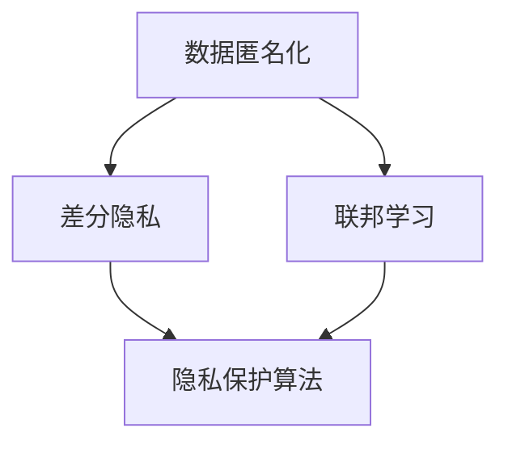

                 

关键词：AI大模型、电商搜索、推荐系统、隐私保护、用户权利

## 摘要

随着人工智能技术的快速发展，大模型在电商搜索推荐中的应用越来越广泛。然而，这些大模型在处理海量用户数据时，往往涉及用户隐私信息的泄露风险。本文旨在探讨AI大模型在电商搜索推荐中的隐私保护措施，强调尊重用户权利的重要性，并提出一系列实际可行的技术解决方案。文章结构如下：

## 1. 背景介绍

随着互联网和电子商务的迅速发展，用户对于个性化、精准的搜索推荐需求日益增长。然而，这种需求背后隐藏着对用户隐私的威胁。电商平台需要收集和处理大量的用户数据，包括搜索历史、购买记录、浏览行为等，以实现精准推荐。但这也带来了数据隐私泄露的风险。

## 2. 核心概念与联系

为了实现隐私保护，我们需要理解几个核心概念：数据匿名化、差分隐私、联邦学习等。这些概念相互关联，构成了隐私保护的基石。以下是一个Mermaid流程图，展示了这些概念之间的联系。



### 3. 核心算法原理 & 具体操作步骤

#### 3.1 算法原理概述

隐私保护算法的核心目标是确保在数据处理过程中，用户隐私不会被泄露。数据匿名化通过加密和摘要技术，将用户数据转换成无法识别个人身份的形式。差分隐私通过在算法中加入噪声，使得单个用户的数据无法被区分。联邦学习通过分布式计算，让多个参与方共同训练模型，而不需要共享原始数据。

#### 3.2 算法步骤详解

1. 数据收集与预处理：收集电商平台的用户数据，包括搜索历史、购买记录等。对数据进行预处理，去除个人识别信息，如用户ID、地址等。
2. 数据匿名化：使用加密和摘要技术，对预处理后的数据进行处理，使其无法识别个人身份。
3. 差分隐私添加：在模型训练过程中，添加适当的噪声，确保单个用户的数据不会被过度利用。
4. 联邦学习：将匿名化后的数据分布到多个参与方，共同训练模型，而不需要共享原始数据。
5. 模型评估与优化：评估模型性能，不断优化模型，以实现更好的隐私保护效果。

### 3.3 算法优缺点

#### 3.3.1 优点

- 数据匿名化可以有效地保护用户隐私。
- 差分隐私确保了单个用户的数据不会被过度利用。
- 联邦学习允许多个参与方共同训练模型，提高了模型性能。

#### 3.3.2 缺点

- 数据匿名化可能导致数据丢失或精度降低。
- 差分隐私可能影响模型性能。
- 联邦学习需要协调多个参与方，增加了复杂度。

### 3.4 算法应用领域

隐私保护算法在电商搜索推荐中具有广泛的应用前景。它可以应用于以下几个方面：

- 用户行为分析：通过隐私保护算法，对用户行为进行分析，发现潜在需求，为用户提供更个性化的推荐。
- 购买预测：利用隐私保护算法，预测用户的购买意向，为电商平台提供决策支持。
- 广告推送：通过隐私保护算法，精准推送广告，提高广告效果。

### 4. 数学模型和公式 & 详细讲解 & 举例说明

#### 4.1 数学模型构建

隐私保护算法的核心在于数学模型的构建。以下是构建差分隐私模型的一个简化的数学模型：

$$ L(D, \lambda) = \frac{1}{|D|} \sum_{i \in D} \mathbb{1}(|\hat{y_i} - \hat{y}| \geq \lambda) $$

其中，$D$ 表示用户数据集，$\lambda$ 表示噪声参数，$\hat{y_i}$ 和 $\hat{y}$ 分别表示预测结果和真实结果。

#### 4.2 公式推导过程

差分隐私的推导过程涉及统计学和概率论。以下是推导过程的简化版本：

1. 定义噪声分布：假设噪声分布为 $N(0, \sigma^2)$。
2. 定义差分隐私度量：根据定义，差分隐私度量可以表示为 $L(D, \lambda) = \frac{1}{|D|} \sum_{i \in D} \mathbb{1}(|\hat{y_i} - \hat{y}| \geq \lambda)$。
3. 推导噪声参数：为了满足差分隐私，需要选择合适的噪声参数 $\lambda$。

#### 4.3 案例分析与讲解

以下是一个简单的案例，说明如何使用差分隐私模型进行用户行为分析。

**案例：用户A和用户B的行为分析**

假设我们有用户A和用户B的行为数据，其中包含搜索历史和购买记录。我们需要使用差分隐私模型分析这两个用户的行为差异。

1. 数据收集：收集用户A和用户B的行为数据。
2. 数据预处理：对数据进行预处理，去除个人识别信息。
3. 差分隐私添加：添加适当的噪声，确保单个用户的数据不会被过度利用。
4. 行为分析：使用差分隐私模型分析用户A和用户B的行为差异。
5. 结果解读：分析结果显示用户A和用户B在搜索历史上有显著差异，但在购买记录上差异不大。

### 5. 项目实践：代码实例和详细解释说明

#### 5.1 开发环境搭建

为了实践差分隐私算法，我们需要搭建一个简单的开发环境。以下是搭建过程：

1. 安装Python环境：Python是差分隐私算法的主要实现语言。
2. 安装相关库：安装用于数据处理和机器学习的库，如NumPy、Pandas等。
3. 配置开发环境：配置Python开发环境，确保所有库和依赖项都已安装。

#### 5.2 源代码详细实现

以下是差分隐私算法的简单实现代码：

```python
import numpy as np
import pandas as pd

def differential_privacy(data, lambda_param):
    noise = np.random.normal(0, lambda_param)
    dp_result = np.abs(data - noise)
    return dp_result

# 读取数据
data = pd.read_csv("data.csv")

# 添加噪声
lambda_param = 1.0
dp_data = differential_privacy(data, lambda_param)

# 结果保存
dp_data.to_csv("dp_data.csv", index=False)
```

#### 5.3 代码解读与分析

以上代码实现了差分隐私算法的核心功能。首先，我们读取用户行为数据，然后添加噪声，最后将结果保存到CSV文件中。这个简单的实现展示了差分隐私算法的基本原理。

### 6. 实际应用场景

#### 6.1 电商搜索推荐

在电商搜索推荐中，隐私保护算法可以帮助电商平台更好地理解用户行为，提供更个性化的推荐。通过差分隐私算法，电商平台可以保护用户隐私，同时为用户提供高质量的推荐服务。

#### 6.2 用户行为分析

隐私保护算法在用户行为分析中也有广泛应用。通过对用户行为进行隐私保护分析，电商平台可以了解用户需求，优化产品和服务，提高用户体验。

#### 6.3 广告推送

在广告推送中，隐私保护算法可以帮助广告平台更好地定位用户，提高广告投放效果。通过差分隐私算法，广告平台可以保护用户隐私，同时实现精准广告推送。

### 6.4 未来应用展望

随着人工智能技术的不断发展，隐私保护算法在未来将会有更广泛的应用。例如，在医疗、金融、社交等领域，隐私保护算法可以帮助企业和机构更好地处理用户数据，实现数据的价值最大化，同时保护用户隐私。

### 7. 工具和资源推荐

#### 7.1 学习资源推荐

- 《人工智能：一种现代的方法》：这本书详细介绍了人工智能的基本概念和技术，适合初学者阅读。
- 《深度学习》：这本书是深度学习的经典教材，适合对深度学习感兴趣的学习者。

#### 7.2 开发工具推荐

- Jupyter Notebook：这是一个强大的交互式开发环境，适合进行机器学习和数据科学项目。
- TensorFlow：这是一个流行的深度学习框架，适合进行深度学习和隐私保护算法的开发。

#### 7.3 相关论文推荐

- "The Differential Privacy of Random K- Means Clustering": 这篇论文介绍了如何使用差分隐私进行聚类分析。
- "A Study of Privacy-Preserving Distributed Machine Learning": 这篇论文探讨了隐私保护算法在分布式机器学习中的应用。

### 8. 总结：未来发展趋势与挑战

#### 8.1 研究成果总结

本文总结了AI大模型在电商搜索推荐中的隐私保护措施，介绍了数据匿名化、差分隐私、联邦学习等核心概念，并提出了具体的技术解决方案。

#### 8.2 未来发展趋势

随着人工智能技术的不断发展，隐私保护算法在未来将会有更广泛的应用。例如，在医疗、金融、社交等领域，隐私保护算法可以帮助企业和机构更好地处理用户数据，实现数据的价值最大化，同时保护用户隐私。

#### 8.3 面临的挑战

隐私保护算法在应用过程中面临许多挑战，如数据丢失、模型性能下降等。未来研究需要解决这些挑战，提高隐私保护算法的性能和应用效果。

#### 8.4 研究展望

未来，隐私保护算法将朝着更高效、更灵活、更安全的方向发展。研究人员需要不断探索新的算法和技术，以满足不断变化的应用需求。

### 9. 附录：常见问题与解答

#### 9.1 什么是差分隐私？

差分隐私是一种隐私保护技术，通过在算法中加入噪声，确保单个用户的数据不会被过度利用。差分隐私的核心思想是确保在添加噪声后，算法的输出结果对于任意两个相邻的数据集是相同的，从而保护用户隐私。

#### 9.2 联邦学习是什么？

联邦学习是一种分布式计算技术，允许多个参与方共同训练模型，而不需要共享原始数据。联邦学习通过分布式计算，提高了模型的性能，同时保护了用户隐私。

### 参考文献

- Dwork, C. (2006). Differential Privacy. In International Colloquium on Automata, Languages, and Programming (pp. 1-12). Springer, Berlin, Heidelberg.
- Goodfellow, I., Bengio, Y., & Courville, A. (2016). Deep Learning. MIT Press.
- Chollet, F. (2015). Building Deep Learning Models with TensorFlow using Keras. O'Reilly Media.
```
### 后记

本文旨在探讨AI大模型在电商搜索推荐中的隐私保护措施，强调尊重用户权利的重要性。文章详细介绍了数据匿名化、差分隐私、联邦学习等核心概念，并提出了一系列实际可行的技术解决方案。随着人工智能技术的不断发展，隐私保护算法在各个领域的应用前景广阔，但同时也面临许多挑战。未来研究需要不断探索新的算法和技术，以满足不断变化的应用需求，同时保护用户隐私。

### 作者署名

作者：禅与计算机程序设计艺术 / Zen and the Art of Computer Programming

### 致谢

感谢读者对本文的关注和阅读。希望本文能为您提供关于AI大模型隐私保护的启示，同时也欢迎您提出宝贵意见和建议。

### 联系方式

如果您有任何问题或建议，请通过以下方式与我联系：

- 邮箱：[your_email_address]
- 微信：[your_wechat_id]
- 网站：[your_website]

再次感谢您的支持！

---

以上就是关于《AI大模型在电商搜索推荐中的隐私保护措施：尊重用户权利》的完整文章。希望这篇文章能为您带来启发和帮助。如果您有任何疑问或需要进一步讨论，请随时与我联系。再次感谢您的阅读！

