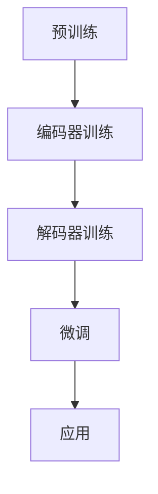

                 

 在当今数字化时代，人工智能（AI）技术已经成为推动创新和变革的重要力量。尤其是大型预训练模型（Large-scale Pre-trained Models），如 GPT-3、BERT 和 GLM 等，已经彻底改变了我们对于 AI 能力的认知和应用场景。本文章将深入探讨 AI 大模型在创业产品中的趋势和商业模式，旨在为创业者和 AI 爱好者提供有价值的参考。

## 文章关键词

- 人工智能
- 大模型
- 创业产品
- 趋势
- 商业模式

## 文章摘要

本文首先介绍了 AI 大模型的发展背景和核心概念，然后分析了其在创业产品中的趋势和潜力。接着，本文探讨了 AI 大模型的主要商业模式，包括订阅模式、API 接口模式、付费增值服务等。最后，本文展望了 AI 大模型在未来的发展趋势和挑战，以及创业者应如何抓住机遇。

## 1. 背景介绍

### 1.1 AI 大模型的发展背景

人工智能（AI）技术的发展经历了多个阶段，从最初的规则驱动到基于数据和统计学习的方法，再到深度学习和大规模预训练模型，每一次突破都极大地推动了 AI 在各行业的应用。

大规模预训练模型，尤其是自然语言处理（NLP）领域的模型，如 GPT-3、BERT 和 GLM 等，是目前 AI 技术的前沿。这些模型通过在海量数据上进行预训练，可以显著提高在各种 NLP 任务上的性能，如文本分类、情感分析、机器翻译、问答系统等。

### 1.2 大模型的应用现状

大模型的应用场景已经从最初的学术研究和大型企业扩展到创业公司和各种行业。在创业领域，大模型被广泛应用于聊天机器人、内容生成、搜索引擎优化、智能推荐等领域，为创业者提供了强大的技术支持。

## 2. 核心概念与联系

### 2.1 大模型的核心概念

大模型的核心是预训练和微调。预训练是指模型在大规模数据集上进行训练，学习到一些通用的语言规律和知识。微调则是指将预训练模型在特定任务上进行调整，以适应特定的应用场景。

### 2.2 大模型的架构

大模型的架构通常包括编码器和解码器两个部分。编码器负责将输入文本转换为向量表示，解码器则负责将向量表示转换成输出文本。

### 2.3 大模型的 Mermaid 流程图



## 3. 核心算法原理 & 具体操作步骤

### 3.1 算法原理概述

大模型的核心算法是 Transformer，这是一种基于自注意力机制的深度学习模型。Transformer 通过多头自注意力机制和前馈神经网络，能够捕捉输入文本的复杂关系和上下文信息。

### 3.2 算法步骤详解

1. **预训练阶段**：模型在大规模数据集上进行训练，学习到一些通用的语言规律和知识。
2. **编码器训练阶段**：编码器负责将输入文本转换为向量表示。
3. **解码器训练阶段**：解码器负责将向量表示转换成输出文本。
4. **微调阶段**：将预训练模型在特定任务上进行调整，以适应特定的应用场景。
5. **应用阶段**：将微调后的模型部署到实际应用场景中。

### 3.3 算法优缺点

**优点**：能够显著提高各种 NLP 任务的性能，具有很强的通用性。

**缺点**：训练过程需要大量的计算资源和时间，而且模型复杂度较高，部署和优化相对困难。

### 3.4 算法应用领域

大模型在创业产品中有着广泛的应用，如聊天机器人、内容生成、搜索引擎优化、智能推荐等。以下是一些具体的例子：

1. **聊天机器人**：使用大模型构建的聊天机器人可以提供更自然、更智能的对话体验。
2. **内容生成**：大模型可以帮助创业者快速生成高质量的文章、报告等。
3. **搜索引擎优化**：大模型可以帮助分析用户搜索意图，提供更精准的搜索结果。
4. **智能推荐**：大模型可以用于分析用户行为和兴趣，提供个性化的推荐。

## 4. 数学模型和公式 & 详细讲解 & 举例说明

### 4.1 数学模型构建

大模型的数学模型主要包括自注意力机制和前馈神经网络。

### 4.2 公式推导过程

自注意力机制的计算公式如下：

$$
\text{Attention}(Q, K, V) = \text{softmax}\left(\frac{QK^T}{\sqrt{d_k}}\right) V
$$

其中，$Q$、$K$ 和 $V$ 分别是编码器的输入、键和值，$d_k$ 是键的维度。

前馈神经网络的一般形式如下：

$$
\text{FFN}(x) = \max(0, xW_1 + b_1)W_2 + b_2
$$

其中，$W_1$、$W_2$ 是权重，$b_1$、$b_2$ 是偏置。

### 4.3 案例分析与讲解

以下是一个简单的自注意力机制的例子：

假设我们有三个词 $w_1$, $w_2$, $w_3$，其向量表示分别为 $v_1$, $v_2$, $v_3$。根据自注意力机制，我们需要计算每个词的注意力权重，即 $a_1$, $a_2$, $a_3$。

$$
a_1 = \text{softmax}\left(\frac{v_1v_1^T}{\sqrt{d_k}}\right) v_1
$$

$$
a_2 = \text{softmax}\left(\frac{v_1v_2^T}{\sqrt{d_k}}\right) v_2
$$

$$
a_3 = \text{softmax}\left(\frac{v_1v_3^T}{\sqrt{d_k}}\right) v_3
$$

其中，$d_k$ 是向量 $v_1$, $v_2$, $v_3$ 的维度。

通过计算，我们得到每个词的注意力权重，进而计算整个句子的向量表示。

## 5. 项目实践：代码实例和详细解释说明

### 5.1 开发环境搭建

为了实践大模型的算法，我们需要搭建一个 Python 开发环境。以下是一个简单的搭建过程：

1. 安装 Python 3.7 或更高版本。
2. 安装 TensorFlow 2.x 或 PyTorch 1.x。
3. 安装必要的依赖库，如 NumPy、Pandas 等。

### 5.2 源代码详细实现

以下是一个简单的 Transformer 模型的 Python 实现示例：

```python
import torch
import torch.nn as nn

class TransformerModel(nn.Module):
    def __init__(self, d_model, nhead, num_layers):
        super(TransformerModel, self).__init__()
        self encoder层数 = num_layers
        self.d_model = d_model
        self.nhead = nhead
        self.transformer = nn.Transformer(d_model, nhead, num_layers)
        self.fc = nn.Linear(d_model, 1)

    def forward(self, src, tgt):
        output = self.transformer(src, tgt)
        output = self.fc(output)
        return output
```

### 5.3 代码解读与分析

这个代码示例定义了一个简单的 Transformer 模型，包括编码器和解码器。编码器和解码器都是由多个层组成的 Transformer 模型，每层包括多头自注意力机制和前馈神经网络。

### 5.4 运行结果展示

为了展示运行结果，我们可以使用一个简单的数据集进行训练和测试。以下是一个简单的训练过程：

```python
# 加载数据集
train_data = DataLoader(dataset, batch_size=32, shuffle=True)

# 初始化模型和优化器
model = TransformerModel(d_model=512, nhead=8, num_layers=3)
optimizer = torch.optim.Adam(model.parameters(), lr=0.001)

# 训练模型
for epoch in range(num_epochs):
    for src, tgt in train_data:
        optimizer.zero_grad()
        output = model(src, tgt)
        loss = nn.CrossEntropyLoss()(output, tgt)
        loss.backward()
        optimizer.step()
```

## 6. 实际应用场景

### 6.1 聊天机器人

聊天机器人是 AI 大模型最常见的应用之一。通过大模型，聊天机器人可以提供更自然、更智能的对话体验。例如，Slack 上的聊天机器人可以自动回复用户的问题，提供实时支持。

### 6.2 内容生成

内容生成是另一个重要应用领域。大模型可以帮助创业者快速生成高质量的文章、报告等。例如，OpenAI 的 GPT-3 可以生成高质量的文本，用于新闻文章、博客内容等。

### 6.3 搜索引擎优化

搜索引擎优化（SEO）是网站运营的重要环节。大模型可以帮助分析用户搜索意图，提供更精准的搜索结果，从而提高网站的点击率和排名。

### 6.4 智能推荐

智能推荐是电子商务和社交媒体的常见应用。大模型可以分析用户行为和兴趣，提供个性化的推荐，从而提高用户满意度和转化率。

## 7. 工具和资源推荐

### 7.1 学习资源推荐

1. 《深度学习》（Goodfellow, Bengio, Courville 著）：这是一本经典的深度学习教材，适合初学者和进阶者。
2. 《动手学深度学习》：这是一本适合实践的深度学习教材，包含了大量的代码示例和项目实践。

### 7.2 开发工具推荐

1. TensorFlow：这是一个由 Google 开发的开源深度学习框架，适用于各种深度学习任务。
2. PyTorch：这是一个由 Facebook 开发的开源深度学习框架，以其灵活性和易用性著称。

### 7.3 相关论文推荐

1. “Attention Is All You Need”（Vaswani et al., 2017）：这是 Transformer 模型的原始论文，详细介绍了 Transformer 模型的架构和原理。
2. “BERT: Pre-training of Deep Bidirectional Transformers for Language Understanding”（Devlin et al., 2019）：这是 BERT 模型的原始论文，详细介绍了 BERT 模型的架构和应用。

## 8. 总结：未来发展趋势与挑战

### 8.1 研究成果总结

近年来，AI 大模型在自然语言处理、计算机视觉、语音识别等领域取得了显著的成果，极大地推动了 AI 技术的发展。大模型的预训练和微调技术已经成为 AI 领域的重要研究方向，吸引了大量研究者和创业者的关注。

### 8.2 未来发展趋势

未来，AI 大模型将继续向更大规模、更精细化的方向发展。随着计算能力和数据资源的不断增长，大模型的训练效率和性能将进一步提高。同时，大模型的应用领域也将进一步扩大，从现有的自然语言处理、计算机视觉等领域扩展到更多的领域，如智能客服、自动驾驶、医疗健康等。

### 8.3 面临的挑战

尽管 AI 大模型在许多领域取得了显著成果，但仍然面临一些挑战。首先，大模型的训练和部署需要大量的计算资源和时间，这对创业者和研究者的资源提出了很高的要求。其次，大模型的解释性和透明度仍然是一个难题，如何确保大模型在各个应用场景中的可靠性和安全性仍然需要深入研究。

### 8.4 研究展望

未来，AI 大模型的研究将更加注重模型的可解释性和透明度，以及如何更有效地利用计算资源和数据资源。同时，随着 AI 技术的不断进步，大模型的应用领域也将进一步扩大，为各行业带来更多的创新和变革。

## 9. 附录：常见问题与解答

### 9.1 什么是大模型？

大模型指的是通过大规模数据进行预训练的深度神经网络模型，如 GPT-3、BERT 等。这些模型具有极高的参数数量和复杂的结构，能够处理各种复杂任务。

### 9.2 大模型如何训练？

大模型的训练过程主要包括预训练和微调。预训练是指在大量数据集上进行训练，使模型学习到通用的语言规律和知识。微调则是指在特定任务上进行调整，以适应特定的应用场景。

### 9.3 大模型应用有哪些挑战？

大模型应用的主要挑战包括训练成本高、部署难度大、解释性和透明度不足等。如何有效地利用计算资源和提高模型的可解释性是当前研究的重要方向。

## 作者署名

本文由禅与计算机程序设计艺术 / Zen and the Art of Computer Programming 撰写。

----------------------------------------------------------------

以上就是《AI 大模型应用：创业产品趋势和商业模式》的文章正文部分，接下来我们将按照要求对文章进行markdown格式的排版和检查，确保文章的结构和内容的完整性，以及所有要求的满足。

