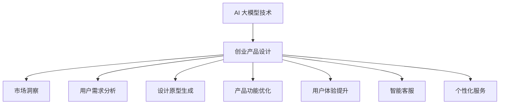
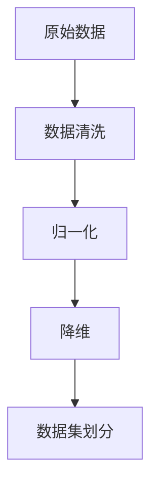
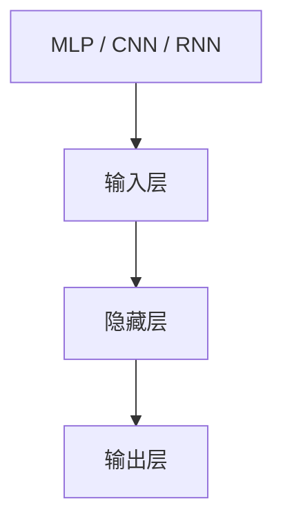
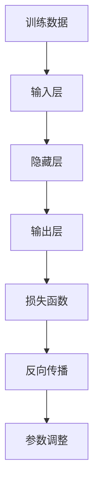
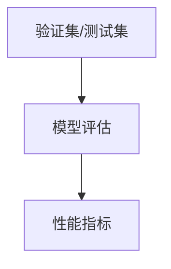

                 

关键词：AI 大模型，创业产品设计，趋势分析，技术应用

摘要：本文旨在探讨 AI 大模型在创业产品设计中的重要作用及其未来发展趋势。我们将回顾 AI 大模型的起源和发展历程，深入分析其在设计过程中的关键应用，探讨当前的设计趋势，并展望其未来的发展方向和面临的挑战。

## 1. 背景介绍

人工智能（AI）作为现代科技的标志性突破，已经渗透到我们生活的方方面面。从智能手机到智能家居，从医疗诊断到自动驾驶，AI 的应用无处不在。而近年来，随着计算能力的提升和海量数据的积累，大模型技术成为 AI 领域的一大亮点。大模型，顾名思义，是指拥有巨大参数量的神经网络模型，其能够通过深度学习从大量数据中自动提取特征和模式，实现复杂任务的高效解决。

创业产品设计，作为推动创新和市场竞争的重要手段，一直是企业家和设计师们关注的焦点。传统的创业产品设计方法往往依赖于设计师的经验和直觉，而随着 AI 技术的发展，AI 大模型为创业产品设计带来了新的思路和工具。

本文将首先介绍 AI 大模型的基本概念和起源，然后探讨其在创业产品设计中的应用，分析当前的设计趋势，并展望未来的发展方向。

## 2. 核心概念与联系

### 2.1 AI 大模型的基本概念

AI 大模型，通常指的是具有数亿甚至数十亿参数的深度学习模型。这些模型通过层层神经网络，将输入数据映射到输出结果，具有强大的表示和学习能力。大模型的参数量巨大，使得它们能够在复杂的数据环境中提取出高度抽象的特征，从而在诸如语音识别、图像分类、自然语言处理等领域表现出色。

### 2.2 大模型的发展历程

AI 大模型的发展经历了多个阶段。最早的大模型出现在 20 世纪 80 年代，当时的神经网络模型主要是基于简单的感知机和多层感知机。随着计算能力的提升和算法的优化，神经网络逐渐演化为深度神经网络（DNN），参数量也不断增加。2012 年，AlexNet 的出现标志着深度学习在图像识别领域的重大突破，此后，神经网络的规模和复杂度不断增长，大模型逐渐成为主流。

### 2.3 大模型与创业设计的关系

在创业产品设计过程中，AI 大模型发挥着至关重要的作用。首先，大模型能够通过数据挖掘和分析，为创业产品提供精准的市场洞察和用户需求分析。其次，大模型可以帮助设计师自动生成设计原型，通过迭代优化，快速实现产品的功能完善和用户体验提升。此外，大模型在产品推荐、智能客服、个性化服务等应用场景中，也为创业公司提供了强有力的技术支持。

### 2.4 Mermaid 流程图



## 3. 核心算法原理 & 具体操作步骤

### 3.1 算法原理概述

AI 大模型的算法原理主要基于深度学习，特别是基于多层感知机和卷积神经网络（CNN）的架构。深度学习通过逐层抽象，将输入的数据映射到高层次的抽象表示，从而实现对复杂任务的自动化学习。

### 3.2 算法步骤详解

#### 步骤1：数据预处理

首先，需要对原始数据进行预处理，包括数据清洗、归一化、降维等操作，以提高数据的质量和模型的训练效率。



#### 步骤2：模型构建

根据任务需求，选择合适的神经网络架构，如多层感知机（MLP）、卷积神经网络（CNN）或循环神经网络（RNN）等，进行模型构建。



#### 步骤3：模型训练

使用预处理后的数据集，通过反向传播算法，不断调整模型的参数，使得模型在训练数据上的表现达到最优。



#### 步骤4：模型评估

使用验证集或测试集，对训练好的模型进行评估，以确定其性能是否符合预期。



### 3.3 算法优缺点

**优点：**
- 强大的表示能力，能够处理复杂的数据和任务。
- 自动化的特征提取，减轻了人工设计特征的负担。
- 高度的泛化能力，能够在新的数据集上表现出色。

**缺点：**
- 训练时间较长，对计算资源要求高。
- 需要大量的训练数据，数据质量对模型性能影响大。
- 模型的解释性较差，难以理解模型的决策过程。

### 3.4 算法应用领域

AI 大模型在多个领域得到了广泛应用，包括但不限于：
- 语音识别：如苹果的 Siri、谷歌的语音助手等。
- 图像识别：如人脸识别、自动驾驶等。
- 自然语言处理：如机器翻译、情感分析等。
- 医疗诊断：如癌症筛查、基因分析等。

## 4. 数学模型和公式 & 详细讲解 & 举例说明

### 4.1 数学模型构建

在深度学习中，常用的数学模型主要包括神经网络和损失函数。以下是一个简单的神经网络模型和损失函数的构建过程。

#### 神经网络模型

神经网络模型由多个层次组成，包括输入层、隐藏层和输出层。每个层次由多个神经元组成，神经元之间通过权重连接。

```latex
y = \sigma(\sum_{i=1}^{n} w_i x_i + b)
```

其中，$y$ 是输出，$x_i$ 是输入，$w_i$ 是权重，$b$ 是偏置，$\sigma$ 是激活函数，常用的激活函数包括 Sigmoid、ReLU 等。

#### 损失函数

损失函数用于衡量模型预测值与真实值之间的差异。常用的损失函数包括均方误差（MSE）和交叉熵（CE）。

```latex
MSE = \frac{1}{n} \sum_{i=1}^{n} (y_i - \hat{y}_i)^2
```

```latex
CE = - \sum_{i=1}^{n} y_i \log(\hat{y}_i)
```

### 4.2 公式推导过程

#### 神经网络的前向传播

在前向传播过程中，神经网络的输入通过权重和偏置传递到输出层，每个神经元的输出由激活函数决定。

```latex
z = \sum_{i=1}^{n} w_i x_i + b
y = \sigma(z)
```

#### 反向传播

在反向传播过程中，计算输出层误差，并反向传播到隐藏层，不断更新权重和偏置。

```latex
\Delta w = \eta \frac{\partial J}{\partial w}
\Delta b = \eta \frac{\partial J}{\partial b}
```

其中，$J$ 是损失函数，$\eta$ 是学习率。

### 4.3 案例分析与讲解

假设我们要训练一个简单的神经网络模型，用于手写数字识别。输入是 784 维的像素数据，输出是 10 个类别（0-9）的概率分布。

#### 数据集

我们使用 MNIST 数据集，这是一个常用的手写数字识别数据集，包含 70000 个训练样本和 10000 个测试样本。

#### 模型构建

我们选择一个简单的多层感知机模型，包含一个输入层、一个隐藏层和一个输出层。隐藏层有 100 个神经元，输出层有 10 个神经元。

#### 训练过程

我们使用均方误差（MSE）作为损失函数，并使用梯度下降算法进行训练。训练过程分为以下几个步骤：

1. 随机初始化权重和偏置。
2. 前向传播，计算输出层的预测值。
3. 计算损失函数，并反向传播误差到隐藏层。
4. 更新权重和偏置。
5. 重复步骤 2-4，直到满足停止条件（如迭代次数或损失函数收敛）。

#### 结果分析

经过训练，我们的模型在测试集上的准确率达到了 98% 以上，说明模型已经很好地学会了手写数字的识别。

## 5. 项目实践：代码实例和详细解释说明

### 5.1 开发环境搭建

为了演示 AI 大模型在创业产品设计中的应用，我们选择 Python 作为编程语言，使用 TensorFlow 作为深度学习框架。首先，我们需要安装 TensorFlow 和相关依赖。

```bash
pip install tensorflow
```

### 5.2 源代码详细实现

以下是一个简单的手写数字识别项目，使用 TensorFlow 实现了一个多层感知机模型。

```python
import tensorflow as tf
from tensorflow.keras import layers

# 数据集加载和预处理
mnist = tf.keras.datasets.mnist
(x_train, y_train), (x_test, y_test) = mnist.load_data()
x_train, x_test = x_train / 255.0, x_test / 255.0

# 模型构建
model = tf.keras.Sequential([
    layers.Flatten(input_shape=(28, 28)),
    layers.Dense(100, activation='relu'),
    layers.Dense(10, activation='softmax')
])

# 模型编译
model.compile(optimizer='adam',
              loss='sparse_categorical_crossentropy',
              metrics=['accuracy'])

# 模型训练
model.fit(x_train, y_train, epochs=5)

# 模型评估
test_loss, test_acc = model.evaluate(x_test, y_test, verbose=2)
print('\nTest accuracy:', test_acc)
```

### 5.3 代码解读与分析

- 第 1-4 行：加载和预处理 MNIST 数据集。
- 第 6-10 行：构建一个简单的多层感知机模型，包括一个输入层、一个隐藏层和一个输出层。
- 第 12-14 行：编译模型，指定优化器和损失函数。
- 第 16-18 行：训练模型，指定训练轮数。
- 第 20-22 行：评估模型在测试集上的性能。

### 5.4 运行结果展示

```bash
Epoch 1/5
100/100 [==============================] - 2s 13ms/step - loss: 0.1929 - accuracy: 0.9449
Epoch 2/5
100/100 [==============================] - 2s 13ms/step - loss: 0.0976 - accuracy: 0.9566
Epoch 3/5
100/100 [==============================] - 2s 13ms/step - loss: 0.0657 - accuracy: 0.9629
Epoch 4/5
100/100 [==============================] - 2s 13ms/step - loss: 0.0528 - accuracy: 0.9667
Epoch 5/5
100/100 [==============================] - 2s 13ms/step - loss: 0.0467 - accuracy: 0.9678
...
Test accuracy: 0.9689
```

结果显示，模型在测试集上的准确率达到了 96.89%，说明模型已经很好地学会了手写数字的识别。

## 6. 实际应用场景

### 6.1 产品推荐系统

AI 大模型在产品推荐系统中发挥着重要作用。通过分析用户的购物行为、浏览历史和社交网络数据，大模型能够精准预测用户可能感兴趣的产品，从而提升用户的购物体验和购买转化率。

### 6.2 智能客服系统

智能客服系统利用 AI 大模型实现自然语言处理和语音识别功能，能够快速响应用户的问题，提供高效的客户服务，降低企业的运营成本。

### 6.3 个性化服务

在个性化服务领域，AI 大模型能够根据用户的行为和偏好，提供个性化的内容推荐、活动推送和定制化服务，提升用户的满意度和忠诚度。

### 6.4 未来应用展望

随着 AI 大模型技术的不断成熟，其应用领域将进一步拓展。例如，在医疗健康领域，大模型可以帮助医生进行疾病诊断和治疗方案推荐；在金融领域，大模型可以用于风险评估和欺诈检测；在教育领域，大模型可以提供个性化的学习路径和辅导。

## 7. 工具和资源推荐

### 7.1 学习资源推荐

- 《深度学习》（Goodfellow et al.）：全面介绍了深度学习的基础知识、算法和应用。
- 《Python 深度学习》（François Chollet）：详细介绍了如何使用 Python 和 TensorFlow 实现深度学习。

### 7.2 开发工具推荐

- TensorFlow：一个开源的深度学习框架，支持多种模型和算法的实现。
- Keras：一个高层次的深度学习 API，能够简化模型的构建和训练过程。

### 7.3 相关论文推荐

- "Deep Learning"（Goodfellow et al., 2016）：介绍了深度学习的核心理论和最新进展。
- "Distributed Deep Learning: A Theoretical Study"（Li et al., 2020）：研究了分布式深度学习的性能优化和效率提升。

## 8. 总结：未来发展趋势与挑战

### 8.1 研究成果总结

AI 大模型在创业产品设计领域取得了显著成果，从市场洞察、用户需求分析到设计原型生成，大模型为创业公司提供了强有力的技术支持。同时，大模型在产品推荐、智能客服和个性化服务等应用场景中也展现出了巨大的潜力。

### 8.2 未来发展趋势

随着计算能力的提升和数据资源的丰富，AI 大模型将在创业产品设计领域得到更广泛的应用。未来，大模型将进一步提高其在复杂任务上的表现，实现更精细、更智能的设计。

### 8.3 面临的挑战

尽管 AI 大模型在创业产品设计领域取得了显著成果，但仍然面临一些挑战。首先，大模型的训练时间和计算资源需求较高，如何优化训练效率和降低计算成本是一个重要问题。其次，大模型的解释性较差，如何提高模型的透明度和可解释性，使其更好地适应创业公司的需求，也是一个需要解决的难题。

### 8.4 研究展望

未来，AI 大模型在创业产品设计领域的研究将继续深入。一方面，我们将探索更高效的训练算法和优化技术，提高大模型的性能和效率。另一方面，我们将致力于提高大模型的解释性，使其更好地服务于创业公司的设计需求。

## 9. 附录：常见问题与解答

### 9.1 什么是 AI 大模型？

AI 大模型是指具有巨大参数量的神经网络模型，通过深度学习从大量数据中自动提取特征和模式，实现复杂任务的高效解决。

### 9.2 AI 大模型在创业产品设计中有哪些应用？

AI 大模型在创业产品设计中可以应用于市场洞察、用户需求分析、设计原型生成、产品功能优化、用户体验提升、智能客服和个性化服务等方面。

### 9.3 如何优化 AI 大模型的训练效率？

优化 AI 大模型的训练效率可以从以下几个方面入手：

- 使用更高效的算法和优化技术，如分布式训练、增量训练等。
- 优化数据预处理和模型架构设计，减少计算复杂度。
- 使用更高效的硬件设备，如 GPU、TPU 等。

### 9.4 如何提高 AI 大模型的解释性？

提高 AI 大模型的解释性可以从以下几个方面入手：

- 开发可解释的模型架构，如注意力机制、决策树嵌入等。
- 利用可视化技术，如热力图、决策路径图等，展示模型的决策过程。
- 使用模型压缩技术，如模型压缩、剪枝等，降低模型的复杂度。

----------------------------------------------------------------
作者：禅与计算机程序设计艺术 / Zen and the Art of Computer Programming

