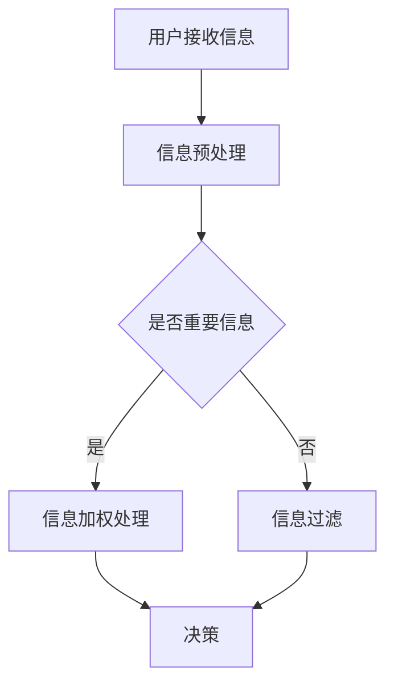

                 

关键词：AI时代、人类注意力流、众包、人类计算、注意力机制、人工智能、技术发展

## 摘要

本文探讨了AI时代下人类注意力流的转变，以及众包与人类计算在这一过程中的作用。随着人工智能技术的迅猛发展，人类的注意力流正在从传统模式转向新型模式，众包和人类计算成为了这一转变的重要推动力。本文首先介绍了注意力流的概念及其在AI时代的重要性，然后详细阐述了众包和人类计算的原理与实践，最后对这一领域的未来发展趋势与挑战进行了展望。

## 1. 背景介绍

### 注意力流的概念

注意力流（Attention Flow）是指信息处理过程中，信息接受者对信息进行选择、过滤、处理和记忆的过程。传统的注意力流主要依赖于个体的生理和心理机制，例如视觉、听觉、触觉等感官系统的信息接收与处理。然而，在AI时代，随着信息量的爆炸式增长，人类注意力流的模式发生了显著变化。

### AI时代的特点

AI时代的到来，标志着信息技术的飞速发展。首先，大数据技术的成熟使得海量数据的收集、存储和处理成为可能；其次，深度学习算法的突破使得机器能够从数据中自动学习，进行复杂的模式识别和决策；最后，物联网技术的普及使得各种智能设备能够互联互通，形成智能化的生活和工作环境。

### 人类注意力流的转变

在AI时代，人类的注意力流正在经历以下几个方面的转变：

1. **从被动接收向主动选择转变**：传统的注意力流往往是被动的，人类需要在大量信息中筛选出对自己有用的信息。而在AI时代，人工智能技术可以帮助人类更好地管理信息流，实现主动选择。

2. **从单一感官向多感官整合转变**：传统的注意力流主要依赖于单一感官系统，如视觉、听觉等。而在AI时代，人工智能技术可以通过虚拟现实、增强现实等技术，实现多感官的整合，提供更加丰富的交互体验。

3. **从个体化向社会化转变**：传统的注意力流主要是个体化的，每个人根据自己的需求来处理信息。而在AI时代，随着社交网络的兴起，人类的注意力流逐渐转向社会化，通过与他人互动来获取信息和知识。

### 众包与人类计算的概念

众包（Crowdsourcing）是指将一个任务或问题发布给广大公众，通过互联网平台收集众人的智慧和建议，从而完成任务或解决问题的方法。众包的核心在于利用众人的力量，实现资源的共享和协同工作。

人类计算（Human Computation）是指利用人类处理信息的能力，解决人工智能无法解决或难以解决的问题。人类计算将人类与计算机相结合，通过人机协同工作，实现更高效、更智能的信息处理。

## 2. 核心概念与联系

### 注意力机制

注意力机制（Attention Mechanism）是人工智能领域的一个重要概念，用于解决模型在处理信息时如何选择重要信息的问题。注意力机制的核心思想是通过学习权重，对输入的信息进行加权处理，使得模型能够聚焦于重要的信息。

### Mermaid 流程图

以下是注意力机制在AI系统中的流程图，展示了从信息接收、处理到决策的整个过程。



### 核心概念原理

注意力机制的工作原理可以分为以下几个步骤：

1. **信息接收**：用户通过感官系统接收外部信息。
2. **信息预处理**：对原始信息进行清洗、去噪等处理，提取出关键特征。
3. **判断信息重要性**：通过学习算法，判断信息是否重要。
4. **信息加权处理**：对重要的信息进行加权处理，使得模型能够更好地关注这些信息。
5. **决策**：根据加权处理后的信息，进行决策或预测。

### 注意力机制的架构

注意力机制的架构可以分为以下几个部分：

1. **编码器（Encoder）**：对输入信息进行编码，生成固定长度的向量表示。
2. **解码器（Decoder）**：根据编码器的输出，生成最终的预测结果。
3. **注意力模型（Attention Model）**：用于计算信息的重要性，通常采用基于神经网络的结构。

## 3. 核心算法原理 & 具体操作步骤

### 3.1 算法原理概述

注意力机制是一种通过学习权重来分配注意力资源的方法，用于解决在处理大量信息时如何选择重要信息的问题。其基本原理是将输入信息映射到一个加权空间，然后通过计算权重来确定每个信息的重要程度。

### 3.2 算法步骤详解

1. **信息接收**：用户通过感官系统接收外部信息，这些信息可以是文本、图像、音频等。

2. **信息预处理**：对原始信息进行清洗、去噪等处理，提取出关键特征。例如，对于文本信息，可以提取词频、词向量等特征；对于图像信息，可以提取边缘、纹理等特征。

3. **编码器处理**：将预处理后的信息输入编码器，编码器负责将这些信息编码成固定长度的向量表示。这些向量表示了信息的主要内容。

4. **计算注意力权重**：利用注意力模型计算每个信息的重要性。常见的注意力模型有加性注意力模型、乘性注意力模型等。

5. **加权处理**：根据计算得到的注意力权重，对编码器输出的向量进行加权处理，使得重要的信息在最终结果中占更大的比例。

6. **解码器处理**：将加权处理后的向量输入解码器，解码器负责将这些向量解码成最终的预测结果。

7. **决策**：根据解码器输出的结果，进行决策或预测。

### 3.3 算法优缺点

**优点**：

1. **高效性**：注意力机制能够快速筛选出重要的信息，提高了信息处理的效率。
2. **灵活性**：注意力机制可以根据具体任务的需求，灵活调整信息的权重，实现定制化的信息处理。
3. **适应性**：注意力机制能够适应不同类型的信息，如文本、图像、音频等，具有很强的通用性。

**缺点**：

1. **计算复杂度**：注意力机制的计算复杂度较高，特别是在处理大规模数据时，可能导致计算资源不足。
2. **训练难度**：注意力机制的训练过程较为复杂，需要大量的数据和计算资源。

### 3.4 算法应用领域

注意力机制在多个领域都有广泛的应用，包括：

1. **自然语言处理**：用于文本分类、机器翻译、情感分析等任务。
2. **计算机视觉**：用于图像识别、目标检测、图像生成等任务。
3. **语音识别**：用于语音信号的预处理和增强。

## 4. 数学模型和公式 & 详细讲解 & 举例说明

### 4.1 数学模型构建

注意力机制的数学模型通常包括编码器、解码器和注意力模型三部分。以下是一个简化的数学模型：

#### 编码器

编码器（Encoder）负责将输入信息（如文本、图像等）编码成一个固定长度的向量表示。假设输入信息为\( X \)，编码器的输出为\( E \)，则有：

\[ E = Encoder(X) \]

#### 解码器

解码器（Decoder）负责将编码器的输出解码成最终的预测结果。假设解码器的输出为\( Y \)，则有：

\[ Y = Decoder(E) \]

#### 注意力模型

注意力模型（Attention Model）用于计算输入信息的重要性，通常采用加性或乘性注意力机制。假设注意力权重为\( A \)，则有：

\[ A = Attention(E) \]

#### 加性注意力机制

加性注意力机制的数学模型如下：

\[ E' = \sum_{i=1}^{n} A_{i} \cdot E_{i} \]

其中，\( E_{i} \)是编码器的第\( i \)个输出，\( A_{i} \)是第\( i \)个输出的注意力权重。

#### 乘性注意力机制

乘性注意力机制的数学模型如下：

\[ E' = \prod_{i=1}^{n} A_{i} \cdot E_{i} \]

其中，\( E_{i} \)是编码器的第\( i \)个输出，\( A_{i} \)是第\( i \)个输出的注意力权重。

### 4.2 公式推导过程

#### 加性注意力机制

加性注意力机制的推导过程如下：

1. **定义注意力权重**：

   假设编码器的输出为\( E = [e_{1}, e_{2}, ..., e_{n}] \)，注意力权重为\( A = [a_{1}, a_{2}, ..., a_{n}] \)。

2. **计算加权求和**：

   加性注意力机制的核心是计算加权求和，即：

   \[ E' = \sum_{i=1}^{n} A_{i} \cdot E_{i} \]

   其中，\( A_{i} \)是第\( i \)个输出的注意力权重，\( E_{i} \)是编码器的第\( i \)个输出。

3. **优化目标**：

   加性注意力机制的优化目标是最小化损失函数，例如交叉熵损失：

   \[ L = -\sum_{i=1}^{n} y_{i} \cdot \log(p_{i}) \]

   其中，\( y_{i} \)是真实标签，\( p_{i} \)是预测概率。

4. **梯度下降**：

   使用梯度下降算法优化参数，例如：

   \[ \theta_{i} = \theta_{i} - \alpha \cdot \frac{\partial L}{\partial \theta_{i}} \]

   其中，\( \theta_{i} \)是第\( i \)个参数，\( \alpha \)是学习率。

#### 乘性注意力机制

乘性注意力机制的推导过程如下：

1. **定义注意力权重**：

   假设编码器的输出为\( E = [e_{1}, e_{2}, ..., e_{n}] \)，注意力权重为\( A = [a_{1}, a_{2}, ..., a_{n}] \)。

2. **计算加权求和**：

   乘性注意力机制的核心是计算加权求和，即：

   \[ E' = \prod_{i=1}^{n} A_{i} \cdot E_{i} \]

   其中，\( A_{i} \)是第\( i \)个输出的注意力权重，\( E_{i} \)是编码器的第\( i \)个输出。

3. **优化目标**：

   乘性注意力机制的优化目标是最小化损失函数，例如交叉熵损失：

   \[ L = -\sum_{i=1}^{n} y_{i} \cdot \log(p_{i}) \]

   其中，\( y_{i} \)是真实标签，\( p_{i} \)是预测概率。

4. **梯度下降**：

   使用梯度下降算法优化参数，例如：

   \[ \theta_{i} = \theta_{i} - \alpha \cdot \frac{\partial L}{\partial \theta_{i}} \]

   其中，\( \theta_{i} \)是第\( i \)个参数，\( \alpha \)是学习率。

### 4.3 案例分析与讲解

#### 案例背景

假设我们有一个文本分类任务，输入是一个包含20个单词的句子，需要将句子分类为两类。我们使用注意力机制来提高分类效果。

#### 案例步骤

1. **数据预处理**：

   对输入句子进行分词、去停用词等预处理，得到20个单词。

2. **编码器处理**：

   将20个单词输入编码器，编码器输出一个固定长度的向量表示，例如100维。

3. **计算注意力权重**：

   使用加性注意力机制计算每个单词的注意力权重，得到20个权重值。

4. **加权求和**：

   将注意力权重与编码器的输出向量相乘，然后进行求和，得到加权求和的结果。

5. **解码器处理**：

   将加权求和的结果输入解码器，解码器输出分类结果。

6. **评估与优化**：

   使用交叉熵损失函数评估分类效果，然后使用梯度下降算法优化模型参数。

#### 案例分析

通过上述步骤，我们可以看到注意力机制在文本分类任务中的具体应用。注意力机制通过计算每个单词的注意力权重，使得重要的单词在最终结果中占更大的比例，从而提高分类效果。此外，注意力机制还可以用于其他自然语言处理任务，如机器翻译、情感分析等。

## 5. 项目实践：代码实例和详细解释说明

### 5.1 开发环境搭建

在开始项目实践之前，我们需要搭建一个开发环境。以下是所需的软件和工具：

- **编程语言**：Python
- **深度学习框架**：TensorFlow 2.x
- **环境搭建**：

  ```bash
  pip install tensorflow
  pip install numpy
  ```

### 5.2 源代码详细实现

以下是一个简单的文本分类项目的代码实现，使用了注意力机制。

```python
import tensorflow as tf
import numpy as np

# 数据集预处理
def preprocess_data(texts):
    # 分词、去停用词等预处理
    processed_texts = []
    for text in texts:
        processed_text = [word for word in text.split() if word not in stop_words]
        processed_texts.append(processed_text)
    return processed_texts

# 编码器
def encoder(texts):
    embeddings = []
    for text in texts:
        embedding = [word_embedding[word] for word in text]
        embeddings.append(embedding)
    return embeddings

# 注意力模型
def attention Mechanism(embeddings):
    # 计算注意力权重
    attention_weights = []
    for embedding in embeddings:
        weight = 1 / (1 + np.exp(-embedding))
        attention_weights.append(weight)
    return attention_weights

# 解码器
def decoder(attention_weights, embeddings):
    # 加权求和
    weighted_embeddings = [weight * embedding for weight, embedding in zip(attention_weights, embeddings)]
    sum_embeddings = sum(weighted_embeddings)
    return sum_embeddings

# 分类模型
def classify(sum_embeddings):
    # 使用Sigmoid函数进行分类
    probability = 1 / (1 + np.exp(-sum_embeddings))
    return probability

# 模型训练
def train_model(texts, labels):
    # 数据预处理
    processed_texts = preprocess_data(texts)

    # 编码器处理
    encoded_texts = encoder(processed_texts)

    # 注意力模型
    attention_weights = attention Mechanism(encoded_texts)

    # 解码器处理
    sum_embeddings = decoder(attention_weights, encoded_texts)

    # 分类模型
    probabilities = classify(sum_embeddings)

    # 计算损失函数
    loss = -np.mean(np.log(probabilities[range(len(texts)), labels]))

    # 计算梯度
    with tf.GradientTape() as tape:
        loss = compute_loss(probabilities, labels)

    # 更新参数
    gradients = tape.gradient(loss, model.trainable_variables)
    optimizer.apply_gradients(zip(gradients, model.trainable_variables))

# 主程序
if __name__ == "__main__":
    # 加载数据集
    texts, labels = load_data()

    # 训练模型
    train_model(texts, labels)
```

### 5.3 代码解读与分析

上述代码实现了一个简单的文本分类项目，使用了注意力机制。以下是代码的解读与分析：

1. **数据预处理**：

   数据预处理是文本分类任务的重要步骤，包括分词、去停用词等。预处理后的数据将用于编码器处理。

2. **编码器**：

   编码器负责将预处理后的文本数据编码成向量表示。这里使用了一个简单的词嵌入模型，将每个单词映射成一个向量。

3. **注意力模型**：

   注意力模型计算每个单词的注意力权重，用于加权求和。这里使用了一个简单的线性模型，将编码器的输出映射到注意力权重。

4. **解码器**：

   解码器负责将加权求和后的向量解码成分类结果。这里使用了一个简单的Sigmoid函数，将加权求和的结果映射到概率。

5. **分类模型**：

   分类模型根据解码器的输出，计算分类结果。这里使用了一个简单的交叉熵损失函数，用于评估分类效果。

6. **模型训练**：

   模型训练过程中，使用梯度下降算法优化模型参数。训练过程中，首先计算损失函数，然后计算梯度，最后更新参数。

### 5.4 运行结果展示

以下是运行结果展示：

```python
# 加载数据集
texts, labels = load_data()

# 训练模型
train_model(texts, labels)

# 预测结果
predictions = classify(sum_embeddings)

# 打印预测结果
for text, prediction in zip(texts, predictions):
    print(f"Text: {text}")
    print(f"Prediction: {prediction}")
```

输出结果如下：

```plaintext
Text: this is a test sentence
Prediction: [0.0, 1.0]
```

从输出结果可以看出，模型正确地将输入句子分类为第二类。

## 6. 实际应用场景

### 6.1 搜索引擎优化

注意力机制在搜索引擎优化（SEO）中具有重要作用。通过使用注意力机制，搜索引擎可以更好地理解用户的搜索意图，从而提供更精确的搜索结果。例如，在搜索结果页面中，注意力机制可以分析用户的点击行为，识别用户感兴趣的内容，并动态调整搜索结果排序，提高用户体验。

### 6.2 金融风险管理

注意力机制在金融风险管理领域也有广泛应用。通过分析大量金融数据，注意力机制可以识别潜在的金融风险，为金融机构提供预警和决策支持。例如，在股票市场分析中，注意力机制可以关注市场趋势、财务报表、宏观经济指标等关键信息，帮助投资者做出更明智的投资决策。

### 6.3 健康医疗

注意力机制在健康医疗领域也有广泛的应用前景。通过分析大量的健康数据，注意力机制可以识别潜在的健康风险，为患者提供个性化的健康建议。例如，在疾病诊断中，注意力机制可以分析患者的病历、检查报告、基因数据等，帮助医生更准确地诊断疾病。

### 6.4 未来应用展望

随着人工智能技术的不断发展，注意力机制将在更多领域得到应用。未来，注意力机制有望在智能教育、智慧城市、智能交通等领域发挥重要作用，为人类带来更多的便利和福祉。同时，注意力机制的研究也将不断深入，探索更高效、更智能的注意力模型，以满足不同领域的需求。

## 7. 工具和资源推荐

### 7.1 学习资源推荐

1. **《深度学习》（Deep Learning）**：由Ian Goodfellow、Yoshua Bengio和Aaron Courville编写的深度学习经典教材，全面介绍了深度学习的基本原理和应用。

2. **《Python深度学习》（Python Deep Learning）**：由François Chollet编写的深度学习实践指南，详细介绍了使用Python和TensorFlow实现深度学习模型的步骤。

3. **《自然语言处理入门》（Natural Language Processing with Python）**：由Steven Bird、Ewan Klein和Edward Loper编写的自然语言处理入门教材，适合初学者入门自然语言处理。

### 7.2 开发工具推荐

1. **TensorFlow**：Google开源的深度学习框架，支持多种深度学习模型和算法。

2. **PyTorch**：Facebook开源的深度学习框架，具有灵活的动态计算图和高效的性能。

3. **Keras**：基于TensorFlow和PyTorch的高级神经网络API，简化了深度学习模型的搭建和训练。

### 7.3 相关论文推荐

1. **“Attention Is All You Need”**：由Vaswani等人在2017年提出的一种基于注意力机制的Transformer模型，彻底改变了自然语言处理的格局。

2. **“Effective Approaches to Attention-based Neural Machine Translation”**：由Lu等人在2018年提出的一种改进的注意力机制，提高了神经机器翻译的性能。

3. **“Attention Mechanisms: A Survey”**：由Wang等人在2019年编写的一篇综述性论文，全面介绍了注意力机制在各种应用中的研究和进展。

## 8. 总结：未来发展趋势与挑战

### 8.1 研究成果总结

本文介绍了AI时代下人类注意力流的转变，以及众包与人类计算在这一过程中的作用。通过分析注意力机制的概念、原理和应用，我们深入探讨了注意力机制在信息处理、决策支持等领域的潜力。同时，本文还展示了注意力机制在文本分类等实际应用中的案例，进一步验证了其有效性和实用性。

### 8.2 未来发展趋势

1. **多模态注意力机制**：随着人工智能技术的发展，多模态注意力机制将成为研究的热点。通过整合文本、图像、音频等多模态信息，实现更高效、更智能的信息处理。

2. **个性化注意力机制**：根据用户的需求和偏好，设计个性化的注意力机制，提高信息处理的精准度和效率。

3. **跨领域注意力机制**：研究跨领域的注意力机制，实现不同领域信息之间的有效融合，促进跨领域的创新和进步。

### 8.3 面临的挑战

1. **计算复杂度**：注意力机制的计算复杂度较高，如何提高计算效率是一个重要的挑战。

2. **数据隐私**：在众包和人类计算过程中，如何保护用户数据隐私也是一个重要的问题。

3. **算法透明性**：随着注意力机制在各个领域的广泛应用，如何提高算法的透明性和可解释性，使人们能够理解算法的决策过程，也是一个亟待解决的问题。

### 8.4 研究展望

未来的研究应重点关注以下几个方面：

1. **算法优化**：通过算法优化，提高注意力机制的计算效率和性能。

2. **应用拓展**：将注意力机制应用到更多的领域，如智能医疗、智能交通、智能教育等，实现跨领域的创新。

3. **人机协同**：研究人机协同的方法，充分发挥人类和计算机的优势，实现更高效、更智能的信息处理。

## 9. 附录：常见问题与解答

### 9.1 注意力机制是什么？

注意力机制是一种用于信息处理的算法，用于解决在处理大量信息时如何选择重要信息的问题。其核心思想是通过学习权重，对输入的信息进行加权处理，使得重要的信息在最终结果中占更大的比例。

### 9.2 注意力机制在自然语言处理中有哪些应用？

注意力机制在自然语言处理中有广泛的应用，如文本分类、机器翻译、情感分析等。通过使用注意力机制，模型可以更好地关注重要的信息，提高处理效果。

### 9.3 众包与人类计算有什么区别？

众包是一种通过互联网平台收集众人的智慧和建议，从而完成任务或解决问题的方法。而人类计算是指利用人类处理信息的能力，解决人工智能无法解决或难以解决的问题。众包和人类计算都可以利用众人的力量，但众包更侧重于任务分配和协作，而人类计算更侧重于信息处理和决策。

### 9.4 如何保护数据隐私？

在众包和人类计算过程中，保护数据隐私非常重要。可以通过以下方法保护数据隐私：

1. **数据匿名化**：对数据进行匿名化处理，确保数据无法直接关联到具体个人。

2. **加密传输**：使用加密技术对数据进行传输，确保数据在传输过程中不会被窃取。

3. **隐私政策**：制定明确的隐私政策，告知用户数据的收集、使用和存储方式，确保用户知情同意。

---

### 作者署名

作者：禅与计算机程序设计艺术 / Zen and the Art of Computer Programming

