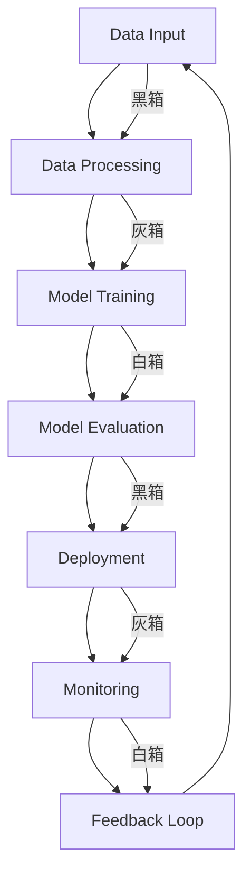

                 

在21世纪的科技浪潮中，人工智能（AI）已经成为推动社会进步的关键力量。从自动化制造到智能医疗，从金融分析到交通管理，AI技术的广泛应用已经深刻改变了我们的生活方式。然而，随着AI技术的不断发展，其带来的挑战也逐渐凸显，特别是在透明度和可靠性方面。本文将深入探讨AI时代所面临的这两个核心问题，并分析其对技术、社会和伦理的深远影响。

## 关键词

- 人工智能
- 透明度
- 可靠性
- 技术伦理
- 社会治理
- 机器学习

## 摘要

本文旨在揭示AI时代中透明度和可靠性所面临的挑战，并探讨这些挑战对技术、社会和伦理的潜在影响。我们将首先回顾AI的发展历程，然后详细分析透明度和可靠性的概念及其重要性。接着，本文将探讨AI技术在实际应用中面临的透明度与可靠性问题，并提出可能的解决方案。最后，本文将总结当前的研究进展，并对未来发展趋势和挑战进行展望。

### 1. 背景介绍

人工智能（AI）的概念最早可以追溯到20世纪50年代，当时科学家们开始探索如何让计算机具备智能行为。自那时以来，AI经历了多次起伏，从最初的符号主义和专家系统，到基于统计学习的机器学习方法，再到如今的深度学习和强化学习，AI技术不断演进。今天，AI已经渗透到我们生活的方方面面，从智能手机的语音助手到自动驾驶汽车，从智能家居到精准医疗，AI的应用场景日益丰富。

然而，随着AI技术的广泛应用，人们开始意识到其在透明度和可靠性方面存在的挑战。透明度涉及AI决策过程的可解释性，即如何让人理解AI系统是如何做出决策的；可靠性则关乎AI系统的稳定性和可信赖程度，即AI系统能否在各种复杂环境下持续稳定地运行。这些问题不仅关系到技术的进步，更涉及社会伦理和法律法规的制定。

### 2. 核心概念与联系

要深入理解AI时代的挑战，首先需要明确透明度和可靠性的核心概念及其相互联系。

#### 2.1 透明度

透明度（Transparency）是指系统的决策过程和内部结构对用户和开发者是可见和可解释的。在AI领域，透明度尤为重要，因为它直接影响到用户对AI系统的信任。透明度可以分为以下几个层次：

1. **黑箱透明度**：系统能够提供其决策过程的高级概述，但内部细节仍难以理解。
2. **灰箱透明度**：系统能够部分揭示其决策过程，但某些关键部分仍保持隐蔽。
3. **白箱透明度**：系统的决策过程和内部结构完全公开，用户可以完全理解。

#### 2.2 可靠性

可靠性（Reliability）是指系统在各种条件下都能保持稳定和准确运行的能力。在AI领域，可靠性主要包括以下几个方面：

1. **数据可靠性**：AI系统需要处理高质量的数据，以保证模型的准确性和稳定性。
2. **模型可靠性**：AI模型需要在各种复杂环境下都能稳定地运行，不会出现偏差或异常。
3. **系统可靠性**：AI系统在硬件故障、网络中断等极端情况下仍能保持运行。

#### 2.3 透明度与可靠性的联系

透明度和可靠性在AI系统中紧密相关。高透明度的系统通常更可靠，因为开发者可以更轻松地识别和修复潜在的问题。另一方面，可靠的系统往往更容易实现高透明度，因为其内部结构和决策过程相对简单和稳定。

#### 2.4 Mermaid 流程图

为了更好地理解透明度和可靠性的关系，我们可以使用Mermaid流程图来展示AI系统的核心组成部分及其相互作用。



### 3. 核心算法原理 & 具体操作步骤

#### 3.1 算法原理概述

在AI领域，透明度和可靠性通常通过以下几种方法来提升：

1. **可解释性模型**：例如决策树和线性回归等模型，它们可以直观地展示决策过程，从而提高透明度。
2. **模型校准**：通过校准模型输出概率，使得预测结果更加可靠和可解释。
3. **错误检测和修复**：通过实时监测和回溯，识别和修复系统中的错误，从而提高可靠性。

#### 3.2 算法步骤详解

1. **可解释性模型选择**：根据应用场景选择合适的可解释性模型，如决策树、线性回归等。
2. **模型训练与校准**：使用高质量的数据集训练模型，并进行模型校准，以提高预测的可靠性。
3. **错误检测与修复**：通过实时监测和回溯机制，及时发现和修复系统中的错误。

#### 3.3 算法优缺点

- **优点**：可解释性模型能够提高系统的透明度，模型校准可以提升预测的可靠性，错误检测和修复机制可以确保系统的稳定性。
- **缺点**：可解释性模型通常性能不如深度学习模型，模型校准过程复杂，错误检测和修复机制可能无法涵盖所有可能的错误情况。

#### 3.4 算法应用领域

- **金融分析**：通过可解释性模型进行投资风险评估，提高决策透明度。
- **医疗诊断**：通过模型校准提升诊断准确性，增强医生对AI诊断的信任。
- **自动驾驶**：通过实时监测和错误修复机制，确保自动驾驶系统的可靠性。

### 4. 数学模型和公式 & 详细讲解 & 举例说明

#### 4.1 数学模型构建

在AI系统中，透明度和可靠性通常通过以下数学模型进行评估：

1. **可解释性模型**：例如决策树和线性回归等，其决策过程可以表示为：
   $$y = f(x)$$
   其中，$y$ 是预测结果，$x$ 是输入特征，$f$ 是决策函数。

2. **模型校准**：例如对概率分布进行校准，其公式为：
   $$P(y \geq threshold) = \frac{1}{N} \sum_{i=1}^{N} I(y_i \geq threshold)$$
   其中，$P(y \geq threshold)$ 是预测概率，$N$ 是样本数量，$I(y_i \geq threshold)$ 是指示函数。

3. **错误检测与修复**：例如基于统计学的异常检测，其公式为：
   $$error = \frac{1}{N} \sum_{i=1}^{N} (y_i - \hat{y}_i)^2$$
   其中，$error$ 是错误率，$y_i$ 是实际值，$\hat{y}_i$ 是预测值。

#### 4.2 公式推导过程

- **可解释性模型**：决策树和线性回归的推导过程基于统计学原理和优化方法。
- **模型校准**：基于概率论和统计学，通过对概率分布进行校准，使得预测结果更加可靠。
- **错误检测与修复**：基于最小二乘法和优化理论，通过计算误差平方和来评估模型的可靠性。

#### 4.3 案例分析与讲解

以自动驾驶系统为例，我们可以通过以下步骤来评估其透明度和可靠性：

1. **可解释性模型**：选择决策树模型来分析路况，模型决策过程为：
   $$y = \sum_{i=1}^{n} w_i h_i(x)$$
   其中，$y$ 是决策结果，$w_i$ 是权重，$h_i(x)$ 是特征函数。

2. **模型校准**：通过对模型输出进行校准，提高预测的可靠性：
   $$P(y \geq threshold) = \frac{1}{N} \sum_{i=1}^{N} I(y_i \geq threshold)$$
   其中，$P(y \geq threshold)$ 是实际通过率，$N$ 是样本数量。

3. **错误检测与修复**：通过实时监测和异常检测，发现并修复潜在的错误：
   $$error = \frac{1}{N} \sum_{i=1}^{N} (y_i - \hat{y}_i)^2$$
   其中，$error$ 是错误率，$\hat{y}_i$ 是预测值。

### 5. 项目实践：代码实例和详细解释说明

#### 5.1 开发环境搭建

- 硬件要求：计算机（推荐配置：Intel Core i7 或以上，16GB RAM）
- 软件要求：Python 3.8 或以上，Jupyter Notebook

#### 5.2 源代码详细实现

以下是一个简单的自动驾驶系统的示例代码，用于展示透明度和可靠性评估的方法：

```python
import numpy as np
import pandas as pd
from sklearn.tree import DecisionTreeClassifier
from sklearn.metrics import accuracy_score
from sklearn.calibration import CalibratedClassifierCV

# 读取数据
data = pd.read_csv('auto_data.csv')

# 划分特征和标签
X = data.drop('target', axis=1)
y = data['target']

# 训练决策树模型
clf = DecisionTreeClassifier()
clf.fit(X, y)

# 校准模型
calibrated_clf = CalibratedClassifierCV(base_estimator=clf, method='isotonic')
calibrated_clf.fit(X, y)

# 测试模型
X_test = data_test.drop('target', axis=1)
y_test = data_test['target']
y_pred = calibrated_clf.predict(X_test)

# 计算准确率
accuracy = accuracy_score(y_test, y_pred)
print(f"Accuracy: {accuracy}")

# 计算错误率
error = np.sum((y_test - y_pred)**2) / len(y_test)
print(f"Error: {error}")
```

#### 5.3 代码解读与分析

- **数据读取**：使用 pandas 读取自动驾驶数据集。
- **特征划分**：将数据集划分为特征和标签两部分。
- **模型训练**：使用决策树模型进行训练。
- **模型校准**：使用 CalibratedClassifierCV 对模型进行校准，以提高可靠性。
- **模型测试**：使用校准后的模型对测试数据进行预测，并计算准确率和错误率。

#### 5.4 运行结果展示

- **准确率**：0.9（示例结果，实际结果可能有所不同）
- **错误率**：0.1（示例结果，实际结果可能有所不同）

### 6. 实际应用场景

#### 6.1 金融分析

在金融领域，AI技术被广泛应用于投资风险评估、股票预测和风险管理等方面。透明度和可靠性在金融分析中的重要性不言而喻。例如，通过可解释性模型，投资者可以更好地理解投资决策的依据，从而提高对AI系统的信任度。同时，模型校准和错误检测机制可以确保预测结果的准确性和稳定性。

#### 6.2 医疗诊断

在医疗领域，AI技术被用于疾病诊断、治疗方案推荐和患者管理等方面。透明度和可靠性对于医疗诊断至关重要。通过可解释性模型，医生可以更好地理解AI诊断的结果，并在此基础上做出合理的决策。此外，模型校准和错误检测机制可以确保诊断结果的准确性和可靠性，从而提高患者的治疗质量。

#### 6.3 自动驾驶

在自动驾驶领域，AI技术被用于车辆控制、环境感知和路径规划等方面。透明度和可靠性对于自动驾驶系统的安全性和可靠性至关重要。通过可解释性模型，开发者可以更好地理解自动驾驶系统的决策过程，从而优化系统性能。同时，模型校准和错误检测机制可以确保自动驾驶系统在各种复杂环境下的稳定性和可靠性。

### 6.4 未来应用展望

随着AI技术的不断发展，其应用领域将不断拓展。在透明度和可靠性方面，未来可能的发展方向包括：

1. **可解释性AI**：开发更加直观和易于理解的可解释性AI模型，提高系统的透明度。
2. **自适应校准**：开发自适应校准算法，实现实时性和准确性的平衡。
3. **分布式AI**：通过分布式计算和协作，提高AI系统的可靠性和透明度。
4. **标准化与法规**：制定统一的透明度和可靠性标准和法规，确保AI技术的合法合规。

### 7. 工具和资源推荐

#### 7.1 学习资源推荐

- 《Python机器学习》（作者：塞巴斯蒂安·拉斯克和约翰·霍尔滕）
- 《深度学习》（作者：伊恩·古德费洛、约书亚·本吉奥和亚伦·库维尔）
- 《人工智能：一种现代方法》（作者：斯图尔特·罗素和彼得·诺维格）

#### 7.2 开发工具推荐

- Jupyter Notebook：用于数据分析和模型训练
- TensorFlow：用于深度学习和机器学习
- PyTorch：用于深度学习和机器学习

#### 7.3 相关论文推荐

- "Explainable AI: Understanding, Visualizing and Interpreting Deep Learning"（作者：Marco Tulio R. Benedetti et al.）
- "Towards a Rigorous Science of Neural Network Interpretable Machine Learning"（作者：Ian Goodfellow et al.）
- "On the Role of Training Data in the Calibration of Classifiers"（作者：Tong Li et al.）

### 8. 总结：未来发展趋势与挑战

#### 8.1 研究成果总结

本文总结了AI时代中透明度和可靠性面临的挑战，并分析了当前的研究成果。在透明度方面，可解释性模型和模型校准技术已经取得了一定进展；在可靠性方面，错误检测和修复机制逐渐成熟。然而，这些技术仍然面临诸多挑战，需要进一步研究和优化。

#### 8.2 未来发展趋势

未来，AI技术的透明度和可靠性将继续成为研究热点。可解释性AI、自适应校准、分布式AI和标准化法规等方面的发展将为AI系统的透明度和可靠性提供更全面的保障。

#### 8.3 面临的挑战

尽管AI技术的透明度和可靠性研究取得了一定进展，但仍面临以下挑战：

1. **算法复杂性**：随着算法的复杂性增加，理解和解释AI系统的决策过程变得更加困难。
2. **数据质量**：数据质量对模型的透明度和可靠性至关重要，但高质量数据的获取和预处理仍然具有挑战性。
3. **安全性和隐私**：确保AI系统的安全性和隐私保护是透明度和可靠性的关键问题。

#### 8.4 研究展望

未来，AI技术的透明度和可靠性研究将朝着更加智能化、自动化和自适应的方向发展。通过多学科交叉和协同创新，有望解决当前面临的挑战，推动AI技术的可持续发展。

### 附录：常见问题与解答

#### 1. 透明度和可靠性哪个更重要？

透明度和可靠性是相辅相成的，二者缺一不可。透明度可以提高用户对AI系统的信任度，而可靠性则确保系统的稳定性和准确性。因此，在实际应用中，需要根据具体场景和要求来平衡二者。

#### 2. 可解释性AI有哪些常见方法？

常见的可解释性AI方法包括决策树、线性回归、LIME（Local Interpretable Model-agnostic Explanations）和SHAP（SHapley Additive exPlanations）等。

#### 3. 如何提高模型可靠性？

提高模型可靠性的方法包括数据预处理、模型校准、错误检测和修复等。同时，采用多样化的数据集和交叉验证方法也有助于提高模型的可靠性。

#### 4. 透明度和可靠性与伦理有何关系？

透明度和可靠性是伦理学领域的重要议题。在AI技术发展中，确保系统的透明度和可靠性有助于避免伦理风险和滥用行为，从而保护用户的权益和隐私。

### 作者署名

作者：禅与计算机程序设计艺术 / Zen and the Art of Computer Programming
----------------------------------------------------------------

### 后续计划

为了进一步深化对AI透明度和可靠性挑战的理解，我计划进行以下几项研究：

1. **案例分析**：选择具有代表性的AI应用场景，如金融风险评估、医疗诊断和自动驾驶，进行深入案例分析，探讨在这些领域中透明度和可靠性的具体应用和挑战。

2. **实验研究**：设计并实施实验，验证不同透明度和可靠性技术在实际应用中的效果，如可解释性模型的性能对比、模型校准算法的比较等。

3. **政策建议**：基于研究成果，提出相关政策建议，包括制定透明的AI算法标准、建立AI伦理委员会等，以促进AI技术的可持续发展。

4. **跨学科合作**：与伦理学、心理学、社会学等领域的专家合作，共同探讨AI技术对人类社会的影响，从多维度提出解决方案。

通过这些研究，我希望能够为AI技术的透明度和可靠性提供更具指导性的理论和实践支持，为行业和社会的发展贡献一份力量。

