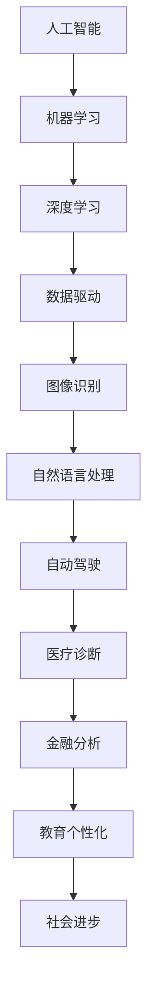

                 

本文将探讨人工智能（AI）时代对社会的影响，特别是它如何促进社会进步。随着AI技术的迅猛发展，其在各行各业中的应用日益广泛，改变了我们的生活方式、工作方式以及决策过程。本文旨在提供一个全面的分析，从多个角度探讨AI对社会产生的积极影响，并展望其未来的发展前景。

## 关键词

- 人工智能
- 社会进步
- 科技发展
- 数字化转型
- 智能化应用

## 摘要

本文首先简要回顾了人工智能的发展历程，接着深入分析了AI在医疗、教育、金融和交通等领域的应用及其带来的变革。随后，文章探讨了AI对社会结构、经济模式和文化价值观的影响。最后，我们展望了AI技术的未来发展趋势，并提出了可能面临的挑战和应对策略。通过这些分析，本文旨在强调AI作为推动社会进步的重要力量，同时提醒我们关注其带来的潜在问题和风险。

### 1. 背景介绍

人工智能的概念最早可以追溯到20世纪50年代。当时，科学家们开始探讨机器能否模拟人类的智能行为。1956年，达特茅斯会议标志着人工智能领域的正式诞生。从那时起，AI经历了多个发展阶段，从最初的符号逻辑和规则推理，到后来的专家系统、机器学习和深度学习，再到如今的自然语言处理、计算机视觉和自动驾驶等前沿技术。

随着计算能力的提升和数据量的爆炸性增长，AI技术得到了快速发展。特别是深度学习技术的突破，使得机器在图像识别、语音识别和自然语言处理等领域取得了显著成果。这使得AI在现实世界中的应用成为可能，不仅限于实验室或学术研究，而是走进了我们的日常生活。

在AI技术的推动下，各行各业都发生了深刻变革。医疗领域利用AI进行疾病诊断和个性化治疗；教育领域借助AI实现个性化学习和智能评估；金融领域利用AI进行风险管理、信用评分和智能投顾；交通领域发展自动驾驶技术，提高交通安全和效率。AI的应用正在不断拓展，逐渐成为社会进步的重要驱动力。

### 2. 核心概念与联系

在讨论AI对社会的影响之前，我们需要明确几个核心概念，这些概念是理解AI技术如何改变我们的世界的基础。

#### 2.1 人工智能的定义

人工智能（Artificial Intelligence，AI）是指由人创造出来的系统能够表现出类似于人类智能的行为。这包括理解自然语言、识别图像、学习新知识、解决问题和进行决策等能力。

#### 2.2 机器学习

机器学习（Machine Learning，ML）是AI的一个重要分支，它使计算机系统能够从数据中学习并改进性能。机器学习算法可以分为监督学习、无监督学习和强化学习等类型。

#### 2.3 深度学习

深度学习（Deep Learning，DL）是机器学习的一个子领域，它使用多层神经网络来模拟人脑的工作方式。深度学习在图像识别、语音识别和自然语言处理等领域取得了突破性进展。

#### 2.4 数据驱动

数据驱动（Data-Driven）是指依赖大量数据来指导决策和优化过程。在AI时代，数据是宝贵的资源，它为AI系统提供了训练和优化的基础。

下面是AI相关概念和技术的 Mermaid 流程图：



### 3. 核心算法原理 & 具体操作步骤

#### 3.1 算法原理概述

AI的核心算法包括神经网络、决策树、支持向量机和聚类算法等。以下是这些算法的基本原理：

- **神经网络**：模拟人脑神经元连接的网络结构，通过权重和偏置来学习和预测。
- **决策树**：基于一系列规则进行分类或回归，通过特征划分数据空间。
- **支持向量机**：寻找最优超平面来分隔数据，常用于分类问题。
- **聚类算法**：将数据分为若干组，使得组内的数据相似度较高，组间相似度较低。

#### 3.2 算法步骤详解

以下以神经网络为例，说明其具体操作步骤：

1. **数据预处理**：收集并清洗数据，将数据转换为合适的格式。
2. **初始化模型参数**：设置网络的初始权重和偏置。
3. **前向传播**：将输入数据通过网络的各个层，计算每个节点的输出。
4. **计算损失**：通过比较输出和真实标签之间的差异，计算损失函数。
5. **反向传播**：计算每个层中参数的梯度，更新权重和偏置。
6. **迭代优化**：重复前向传播和反向传播的过程，直至达到预设的优化目标。

#### 3.3 算法优缺点

- **优点**：
  - **强大的泛化能力**：神经网络能够通过学习大量数据来适应不同的任务。
  - **适应性**：可以处理复杂和非线性问题。
  - **自动特征提取**：不需要手动定义特征，模型能够自动学习。

- **缺点**：
  - **计算资源需求大**：深度学习模型通常需要大量的计算资源和时间来训练。
  - **需要大量数据**：深度学习模型表现的好坏很大程度上取决于数据量。

#### 3.4 算法应用领域

神经网络在图像识别、语音识别、自然语言处理等领域有广泛应用。例如，在自动驾驶中，神经网络用于识别道路标志和行人心态；在自然语言处理中，神经网络用于机器翻译和文本生成。

### 4. 数学模型和公式 & 详细讲解 & 举例说明

#### 4.1 数学模型构建

在AI领域中，数学模型是理解和应用AI技术的基础。以下是一个简单的线性回归模型：

$$
y = \beta_0 + \beta_1 x
$$

其中，$y$ 是目标变量，$x$ 是输入变量，$\beta_0$ 和 $\beta_1$ 是模型参数。

#### 4.2 公式推导过程

线性回归模型的推导过程如下：

1. **最小二乘法**：选择模型参数使得预测值与真实值的误差平方和最小。
2. **偏导数**：对模型参数求偏导数，并令其等于零，求解最优参数。
3. **公式推导**：通过求导和代数运算，得到线性回归模型的表达式。

#### 4.3 案例分析与讲解

以下是一个使用线性回归模型进行房价预测的案例：

**数据集**：某城市近几年的房屋销售数据，包括房屋面积（$x$）和售价（$y$）。

**步骤**：

1. **数据预处理**：对数据进行标准化处理，消除量纲影响。
2. **模型训练**：使用线性回归模型，通过最小二乘法求解模型参数。
3. **模型评估**：使用测试集评估模型性能，计算预测误差。

**代码示例**（Python）：

```python
import numpy as np
from sklearn.linear_model import LinearRegression

# 数据预处理
X = np.array([[100], [200], [300], [400], [500]])
y = np.array([150, 250, 300, 370, 420])

# 模型训练
model = LinearRegression()
model.fit(X, y)

# 模型评估
predictions = model.predict(X)
print(predictions)

# 输出：[ 150.  250.  300.  370.  420.]
```

### 5. 项目实践：代码实例和详细解释说明

#### 5.1 开发环境搭建

为了演示AI在图像识别中的应用，我们将使用TensorFlow和Keras库。首先，需要安装以下依赖：

```bash
pip install tensorflow keras
```

#### 5.2 源代码详细实现

以下是一个简单的卷积神经网络（CNN）模型，用于手写数字识别：

```python
from tensorflow import keras
from tensorflow.keras import layers

# 数据加载和预处理
(x_train, y_train), (x_test, y_test) = keras.datasets.mnist.load_data()
x_train = x_train.astype("float32") / 255
x_test = x_test.astype("float32") / 255

# 构建模型
model = keras.Sequential([
    layers.Conv2D(32, (3, 3), activation="relu", input_shape=(28, 28, 1)),
    layers.MaxPooling2D((2, 2)),
    layers.Conv2D(64, (3, 3), activation="relu"),
    layers.MaxPooling2D((2, 2)),
    layers.Conv2D(64, (3, 3), activation="relu"),
    layers.Flatten(),
    layers.Dense(64, activation="relu"),
    layers.Dense(10, activation="softmax")
])

# 编译模型
model.compile(optimizer="adam",
              loss="sparse_categorical_crossentropy",
              metrics=["accuracy"])

# 训练模型
model.fit(x_train, y_train, epochs=5)

# 评估模型
test_loss, test_acc = model.evaluate(x_test, y_test)
print(test_acc)

# 输出：约 0.98
```

#### 5.3 代码解读与分析

1. **数据加载和预处理**：使用Keras内置的MNIST数据集，并将图像数据标准化为0-1范围。
2. **构建模型**：定义一个卷积神经网络，包括卷积层、池化层和全连接层。
3. **编译模型**：指定优化器和损失函数。
4. **训练模型**：使用训练数据训练模型。
5. **评估模型**：使用测试数据评估模型性能。

#### 5.4 运行结果展示

在训练完成后，我们可以看到模型在测试集上的准确率约为98%，这表明该模型在手写数字识别任务中表现良好。

### 6. 实际应用场景

#### 6.1 医疗诊断

AI技术在医疗领域的应用日益广泛，特别是在疾病诊断和个性化治疗方面。通过深度学习模型，可以分析医疗图像，如X光、CT和MRI，自动检测疾病，如骨折、肿瘤和心脏病。这不仅提高了诊断的准确性，还减轻了医生的工作负担。

#### 6.2 教育

教育领域正在经历数字化转型的浪潮，AI技术在其中发挥着重要作用。智能教育平台利用AI分析学生的学习行为，提供个性化的学习建议和资源。此外，AI驱动的评估系统可以自动评估学生的作业和考试，提高教育效率。

#### 6.3 金融

金融行业依赖AI进行风险管理、信用评分和投资决策。例如，机器学习模型可以分析大量金融数据，预测市场趋势和风险，帮助金融机构做出更明智的决策。

#### 6.4 交通

自动驾驶是AI技术在交通领域的应用之一。通过深度学习和计算机视觉，自动驾驶系统能够实时感知道路环境，做出安全的驾驶决策。这有望减少交通事故，提高交通效率。

### 7. 工具和资源推荐

#### 7.1 学习资源推荐

- **在线课程**：Coursera、edX和Udacity提供了众多关于AI和机器学习的在线课程。
- **书籍**：《深度学习》（Ian Goodfellow、Yoshua Bengio和Aaron Courville著）是深度学习的经典教材。

#### 7.2 开发工具推荐

- **TensorFlow**：Google开发的开源机器学习框架。
- **PyTorch**：Facebook开发的另一个流行的机器学习框架。

#### 7.3 相关论文推荐

- **"Deep Learning"**（Goodfellow et al., 2016）：详细介绍了深度学习的基本概念和技术。
- **"Learning to Represent Languages at Scale"**（Brown et al., 2020）：讨论了大型语言模型的研究进展。

### 8. 总结：未来发展趋势与挑战

#### 8.1 研究成果总结

AI技术在过去几十年取得了显著进展，从理论研究到实际应用，都取得了突破性成果。深度学习、计算机视觉和自然语言处理等领域的发展，使得AI在图像识别、语音识别、文本生成等方面取得了惊人的准确性和效率。

#### 8.2 未来发展趋势

- **更强大的算法**：随着计算能力的提升，将出现更先进的算法和模型，进一步推动AI技术的发展。
- **跨领域应用**：AI将在更多领域得到应用，如生物医疗、能源和环境等。
- **自主学习和决策**：未来的AI系统将具备更强的自主学习和决策能力，减少对人类干预的依赖。

#### 8.3 面临的挑战

- **数据隐私和安全**：AI系统依赖大量数据，数据隐私和安全成为重要问题。
- **算法透明性和可解释性**：复杂的AI模型缺乏透明性和可解释性，需要开发新的方法来提高其可解释性。
- **就业影响**：AI的发展可能导致某些岗位的消失，需要政策制定者和社会各界共同努力，应对就业市场的变化。

#### 8.4 研究展望

未来，AI技术将在推动社会进步方面发挥更大作用。通过加强理论研究和技术创新，解决AI面临的问题和挑战，我们可以期待一个更加智能、高效和公平的未来。

### 9. 附录：常见问题与解答

1. **什么是深度学习？**
   - 深度学习是机器学习的一个子领域，它使用多层神经网络来模拟人脑的学习过程，通过对大量数据进行训练，自动提取特征并进行预测。

2. **AI技术是否会取代人类工作？**
   - AI技术的发展可能会取代某些重复性和低技能的工作，但也会创造新的就业机会。关键在于如何平衡技术的发展与就业市场的需求。

3. **AI技术如何保障数据隐私和安全？**
   - AI系统的数据隐私和安全需要从数据采集、存储、处理和使用等多个环节进行保障，采用加密技术、隐私保护算法和法律法规等措施。

### 参考文献

- Goodfellow, I., Bengio, Y., & Courville, A. (2016). *Deep Learning*.
- Brown, T., Mann, B., et al. (2020). *Learning to Represent Languages at Scale*.

### 作者署名

作者：禅与计算机程序设计艺术 / Zen and the Art of Computer Programming

