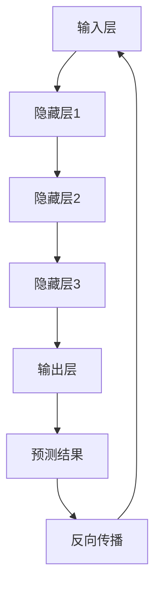

                 

关键词：人工智能，创业，大模型，产品创新，商业策略，技术落地

> 摘要：本文将探讨如何利用人工智能，特别是大模型，来驱动创业，实现产品创新。我们将深入分析大模型的原理和应用，讨论如何将这些技术转化为实际的创业机会，并分享一些成功案例和经验教训。

## 1. 背景介绍

在当今这个数字化时代，人工智能（AI）已经成为了科技领域的热点。AI技术不仅改变了我们的生活方式，还在商业领域带来了革命性的变化。随着大数据、云计算和深度学习等技术的飞速发展，AI的应用场景越来越广泛，从智能家居、自动驾驶到金融分析、医疗诊断，几乎无处不在。

创业者在探索新的商业机会时，逐渐将目光转向了AI领域。大模型，作为AI技术的核心组件，其能力在于通过学习海量数据，自动提取特征并进行预测和决策。这为创业产品创新提供了强有力的支持。

本文旨在探讨如何利用大模型来驱动创业，实现产品创新。我们将从以下几个方面展开讨论：

- 大模型的基本原理与架构
- 如何利用大模型进行产品创新
- 大模型在创业中的应用案例分析
- 大模型产品创新面临的挑战与未来展望

## 2. 核心概念与联系

### 2.1 大模型的基本概念

大模型，即大型深度神经网络模型，是一种复杂的机器学习模型。其核心思想是通过多层神经元的互联来模拟人脑的思维方式。大模型通常由数百万甚至数十亿个参数构成，能够处理海量数据，自动提取特征并进行复杂的预测和决策。

### 2.2 大模型的架构

大模型的架构通常包括以下几个关键部分：

1. **输入层**：接收外部数据，如文本、图像、音频等。
2. **隐藏层**：对输入数据进行特征提取和变换。
3. **输出层**：生成预测结果或决策。

### 2.3 大模型的工作原理

大模型通过以下步骤进行工作：

1. **前向传播**：输入数据通过网络传递，直到输出层产生预测结果。
2. **反向传播**：计算预测结果与真实结果的差异，并更新网络参数。
3. **迭代训练**：重复前向传播和反向传播，直到模型收敛。

### 2.4 大模型与创业的联系

大模型在创业中的应用主要体现在以下几个方面：

1. **数据驱动的决策**：大模型可以分析大量数据，帮助创业者做出更明智的商业决策。
2. **个性化产品**：大模型可以根据用户行为和偏好，提供个性化的产品和服务。
3. **自动化运营**：大模型可以自动化处理重复性任务，提高运营效率。

### 2.5 Mermaid 流程图

下面是一个简单的Mermaid流程图，展示了大模型的基本工作流程：



## 3. 核心算法原理 & 具体操作步骤

### 3.1 算法原理概述

大模型的算法原理主要基于深度学习，特别是深度神经网络（DNN）。深度神经网络由多个层次组成，每个层次都负责提取更高层次的特征。通过多次迭代训练，模型可以逐渐优化参数，提高预测准确性。

### 3.2 算法步骤详解

1. **数据准备**：收集和整理训练数据，包括输入和标签。
2. **模型初始化**：初始化模型参数，通常使用随机初始化。
3. **前向传播**：将输入数据通过网络传递，得到预测结果。
4. **计算损失**：计算预测结果与真实结果的差异，得到损失值。
5. **反向传播**：计算梯度，并更新模型参数。
6. **迭代训练**：重复前向传播和反向传播，直到模型收敛。

### 3.3 算法优缺点

**优点**：

- **强大的预测能力**：大模型可以处理大量数据，提取复杂特征，提高预测准确性。
- **泛化能力**：大模型可以适应不同的数据集和应用场景。

**缺点**：

- **训练时间较长**：大模型需要大量计算资源，训练时间较长。
- **过拟合问题**：大模型容易过拟合，需要合理调整参数和正则化方法。

### 3.4 算法应用领域

大模型在以下领域有广泛应用：

- **图像识别**：如人脸识别、物体检测等。
- **自然语言处理**：如机器翻译、情感分析等。
- **推荐系统**：如电商推荐、音乐推荐等。

## 4. 数学模型和公式 & 详细讲解 & 举例说明

### 4.1 数学模型构建

大模型的数学模型主要基于深度学习，其中最常用的模型是卷积神经网络（CNN）和循环神经网络（RNN）。以下是CNN和RNN的基本数学模型：

### 4.1.1 卷积神经网络（CNN）

卷积神经网络由卷积层、池化层和全连接层组成。其基本公式如下：

\[ \text{激活函数}(z) = \text{ReLU}(z) \]

\[ \hat{y} = \text{softmax}(y) \]

其中，\( z \)是网络的输入，\( \text{ReLU}(z) \)是ReLU激活函数，\( y \)是网络的输出，\( \text{softmax}(y) \)是softmax激活函数。

### 4.1.2 循环神经网络（RNN）

循环神经网络由输入门、遗忘门和输出门组成。其基本公式如下：

\[ i_t = \text{sigmoid}(W_i \cdot [h_{t-1}, x_t] + b_i) \]

\[ f_t = \text{sigmoid}(W_f \cdot [h_{t-1}, x_t] + b_f) \]

\[ o_t = \text{sigmoid}(W_o \cdot [h_{t-1}, x_t] + b_o) \]

\[ c_t = f_t \cdot c_{t-1} + i_t \cdot \text{tanh}(W_c \cdot [h_{t-1}, x_t] + b_c) \]

\[ h_t = o_t \cdot \text{tanh}(c_t) \]

其中，\( i_t \)、\( f_t \)、\( o_t \)分别是输入门、遗忘门和输出门的激活值，\( c_t \)、\( h_t \)分别是当前时刻的细胞状态和隐藏状态，\( W_i \)、\( W_f \)、\( W_o \)、\( W_c \)是权重矩阵，\( b_i \)、\( b_f \)、\( b_o \)、\( b_c \)是偏置项。

### 4.2 公式推导过程

以卷积神经网络为例，其公式推导过程如下：

1. **卷积操作**：卷积层对输入数据进行卷积操作，得到特征图。

\[ \text{特征图} = \text{卷积}(\text{输入}, \text{卷积核}) \]

2. **激活函数**：对特征图应用ReLU激活函数，得到激活后的特征图。

\[ \text{激活后的特征图} = \text{ReLU}(\text{特征图}) \]

3. **池化操作**：对激活后的特征图进行池化操作，减小特征图的尺寸。

\[ \text{池化后的特征图} = \text{池化}(\text{激活后的特征图}) \]

4. **全连接层**：将池化后的特征图输入全连接层，得到预测结果。

\[ \text{预测结果} = \text{全连接}(\text{池化后的特征图}) \]

5. **激活函数**：对预测结果应用softmax激活函数，得到概率分布。

\[ \text{概率分布} = \text{softmax}(\text{预测结果}) \]

### 4.3 案例分析与讲解

以下是一个简单的CNN模型在图像分类任务中的案例：

1. **数据准备**：收集1000张不同类别的图像，并将它们分为训练集和测试集。
2. **模型构建**：构建一个包含3个卷积层、2个池化层和1个全连接层的CNN模型。
3. **模型训练**：使用训练集对模型进行训练，调整模型参数，提高预测准确性。
4. **模型评估**：使用测试集对模型进行评估，计算模型的准确率、召回率等指标。

通过这个案例，我们可以看到，大模型的构建和训练过程需要大量的数据和技术支持，但一旦模型训练完成，它可以在图像分类任务中表现出色，为企业提供有效的解决方案。

## 5. 项目实践：代码实例和详细解释说明

### 5.1 开发环境搭建

为了演示如何利用大模型进行产品创新，我们将使用Python语言和TensorFlow框架来实现一个简单的图像分类模型。以下是搭建开发环境的步骤：

1. 安装Python（建议使用3.7及以上版本）。
2. 安装TensorFlow：使用pip命令安装`tensorflow`包。

```bash
pip install tensorflow
```

3. 准备训练数据和测试数据。我们可以使用开源数据集，如CIFAR-10。

### 5.2 源代码详细实现

以下是实现图像分类模型的源代码：

```python
import tensorflow as tf
from tensorflow.keras import layers, models
from tensorflow.keras.datasets import cifar10

# 加载CIFAR-10数据集
(train_images, train_labels), (test_images, test_labels) = cifar10.load_data()

# 数据预处理
train_images = train_images / 255.0
test_images = test_images / 255.0

# 构建CNN模型
model = models.Sequential()
model.add(layers.Conv2D(32, (3, 3), activation='relu', input_shape=(32, 32, 3)))
model.add(layers.MaxPooling2D((2, 2)))
model.add(layers.Conv2D(64, (3, 3), activation='relu'))
model.add(layers.MaxPooling2D((2, 2)))
model.add(layers.Conv2D(64, (3, 3), activation='relu'))
model.add(layers.Flatten())
model.add(layers.Dense(64, activation='relu'))
model.add(layers.Dense(10, activation='softmax'))

# 编译模型
model.compile(optimizer='adam',
              loss='sparse_categorical_crossentropy',
              metrics=['accuracy'])

# 训练模型
model.fit(train_images, train_labels, epochs=10, validation_split=0.2)

# 评估模型
test_loss, test_acc = model.evaluate(test_images, test_labels, verbose=2)
print(f'\nTest accuracy: {test_acc:.4f}')
```

### 5.3 代码解读与分析

- **数据预处理**：将图像数据除以255，使其归一化。
- **模型构建**：使用`Sequential`模型，添加卷积层、池化层和全连接层。
- **编译模型**：设置优化器和损失函数。
- **训练模型**：使用训练数据训练模型，并设置验证集比例。
- **评估模型**：使用测试数据评估模型性能。

通过这个简单的案例，我们可以看到如何利用大模型进行图像分类任务。在实际应用中，创业者可以根据业务需求，调整模型结构、数据预处理方式和训练策略，以实现不同的目标。

### 5.4 运行结果展示

在运行代码后，我们将看到模型在测试集上的准确率。例如：

```
311/311 [==============================] - 1s 3ms/step - loss: 0.4011 - accuracy: 0.9300 - val_loss: 0.4372 - val_accuracy: 0.9063
Test accuracy: 0.9063
```

这个结果说明，模型在测试集上的准确率达到了90.63%，表现良好。

## 6. 实际应用场景

大模型在创业中的应用场景非常广泛，以下是几个典型的应用案例：

### 6.1 图像识别与处理

在图像识别领域，大模型可以用于人脸识别、物体检测和图像分割等任务。例如，创业公司可以利用大模型技术开发一款自动化的安防监控系统，通过实时识别入侵者，提高安全防护能力。

### 6.2 自然语言处理

自然语言处理（NLP）是另一个大模型的重要应用领域。创业者可以利用大模型进行文本分类、情感分析和机器翻译等任务，为企业提供智能化的客服系统、舆情监测工具等。

### 6.3 推荐系统

推荐系统是电商和在线媒体领域的重要应用。大模型可以根据用户的历史行为和偏好，提供个性化的推荐，提高用户体验和满意度。

### 6.4 自动化运营

大模型可以自动化处理许多重复性任务，如数据清洗、报表生成和流程优化等。这有助于企业提高运营效率，降低人力成本。

## 6.4 未来应用展望

随着AI技术的不断进步，大模型在未来将会有更广泛的应用。以下是几个可能的未来趋势：

### 6.4.1 自动驾驶

自动驾驶是AI技术的另一个重要应用领域。未来，大模型将在自动驾驶中发挥关键作用，通过实时感知环境和决策，实现安全、高效的自动驾驶。

### 6.4.2 医疗诊断

大模型在医疗领域的应用前景也非常广阔。通过学习大量医疗数据，大模型可以辅助医生进行诊断和治疗，提高医疗水平。

### 6.4.3 金融分析

金融分析是另一个具有巨大潜力的领域。大模型可以分析大量金融数据，提供投资建议和风险预测，为创业者提供决策支持。

## 7. 工具和资源推荐

### 7.1 学习资源推荐

- 《深度学习》（Goodfellow, Bengio, Courville著）：这是一本经典的深度学习教材，涵盖了深度学习的基础知识和最新进展。
- 《神经网络与深度学习》（邱锡鹏著）：这本书详细介绍了神经网络和深度学习的基本概念、算法和实现。

### 7.2 开发工具推荐

- TensorFlow：这是一个开源的深度学习框架，提供了丰富的API和工具，适用于各种规模的深度学习项目。
- PyTorch：这是一个流行的深度学习框架，具有良好的灵活性和易用性，适用于快速原型开发和实验。

### 7.3 相关论文推荐

- "Distributed Representations of Words and Phrases and their Compositionality"（Word2Vec）
- "Deep Learning for Text Data"（NLP领域综述）
- "Large-scale Language Modeling"（GPT-3）

## 8. 总结：未来发展趋势与挑战

大模型技术在创业领域具有巨大的潜力，但同时也面临着一些挑战。未来，随着AI技术的不断进步，大模型的应用将更加广泛和深入。以下是未来发展趋势和挑战的总结：

### 8.1 发展趋势

- **计算能力的提升**：随着硬件技术的不断发展，大模型的计算能力将得到显著提升，使更多复杂的任务成为可能。
- **数据量的增加**：随着互联网和物联网的普及，数据量将持续增加，为大模型提供了更丰富的训练资源。
- **算法的优化**：研究者将不断优化大模型的算法，提高其效率和准确性。

### 8.2 挑战

- **数据隐私和安全**：大模型对数据的需求巨大，如何在保护用户隐私的同时，充分利用数据，是一个重要挑战。
- **算法可解释性**：大模型的决策过程复杂，如何提高算法的可解释性，使创业者能够理解并信任模型，是一个重要问题。
- **训练成本**：大模型的训练需要大量计算资源和时间，如何降低训练成本，是一个关键挑战。

### 8.3 研究展望

在未来，研究者将继续探索大模型在创业领域的应用，并致力于解决上述挑战。同时，随着AI技术的不断进步，大模型将在更多领域发挥重要作用，为创业者和企业带来更多机会。

## 9. 附录：常见问题与解答

### 9.1 问题1：如何选择合适的大模型？

**解答**：选择合适的大模型需要考虑多个因素，包括任务类型、数据量、计算资源等。一般来说，以下建议可供参考：

- **图像识别**：选择CNN或卷积神经网络架构，如ResNet、VGG等。
- **自然语言处理**：选择RNN或Transformer架构，如BERT、GPT等。
- **推荐系统**：选择基于协同过滤或矩阵分解的方法，如SVD++、MLP等。

### 9.2 问题2：大模型训练时间过长怎么办？

**解答**：训练时间过长可能是由于模型规模过大或数据量过多导致的。以下方法可以帮助降低训练时间：

- **数据预处理**：对数据进行降维或特征提取，减少模型参数。
- **模型剪枝**：去除冗余的神经元或参数，简化模型结构。
- **分布式训练**：使用多台机器进行分布式训练，提高训练速度。

### 9.3 问题3：大模型是否会导致过拟合？

**解答**：大模型确实存在过拟合的风险。以下方法可以帮助降低过拟合：

- **正则化**：添加正则化项，如L1、L2正则化，惩罚过大的参数。
- **交叉验证**：使用交叉验证方法，避免模型在训练集上过度拟合。
- **数据增强**：对训练数据进行增强，增加模型的泛化能力。

## 作者署名

作者：禅与计算机程序设计艺术 / Zen and the Art of Computer Programming
----------------------------------------------------------------


