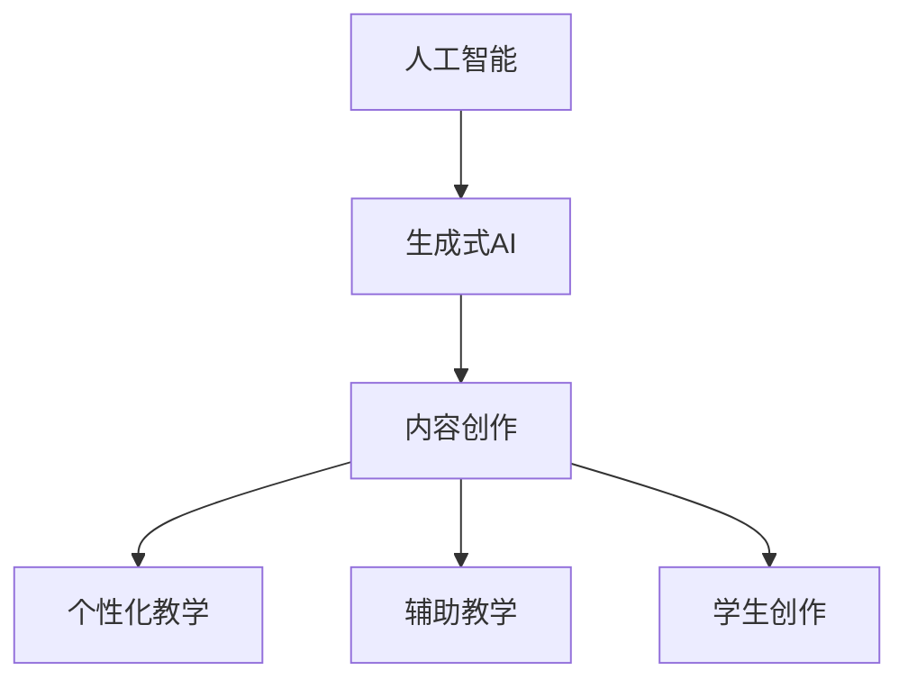

                 

关键词：人工智能，生成式AI，人才培养，教育改革，技术技能，创新思维

> 摘要：本文从人工智能（AI）和生成式AI（AIGC）的发展趋势出发，探讨AI人才培养与教育改革的重要性。文章分析了当前教育体系中存在的不足，提出了针对AIGC人才培养的系统性改革策略，旨在培养具备创新能力、技术实力和实践能力的复合型人才，为我国AI产业的发展提供人才保障。

## 1. 背景介绍

随着人工智能技术的飞速发展，生成式AI（AIGC）正在成为新一代人工智能技术的重要方向。AIGC是一种能够自动生成文本、图像、音频、视频等内容的AI技术，其应用场景广泛，从内容创作、娱乐、教育到医疗、金融等多个领域都有重要影响。

然而，AIGC技术的快速发展也带来了人才培养的挑战。传统的教育体系往往注重理论知识的学习，而忽视了实践能力和创新思维的培养。此外，AI技术的发展速度远超教育改革的步伐，使得学生在校所学的内容与实际需求之间存在较大差距。因此，如何通过教育改革来培养适应AIGC时代的人才，成为当前教育领域亟待解决的问题。

### 1.1 人工智能与生成式AI的发展现状

人工智能作为计算机科学的一个重要分支，经历了从理论到应用的飞速发展。在深度学习、神经网络等技术的推动下，人工智能已经逐渐渗透到各行各业，为人类社会带来了巨大的变革。而生成式AI作为人工智能的一个新兴分支，以其独特的生成能力，正在引领AI技术的创新。

生成式AI的核心在于“生成”，它能够模拟人类创造性的过程，自动生成各种形式的内容。目前，生成式AI已经在图像生成、文本生成、音频生成等领域取得了显著的成果。例如，深度学习算法可以生成逼真的图像和视频，自然语言处理技术可以生成流畅的文本，这些成果不仅丰富了人工智能的应用场景，也为内容创作带来了新的可能性。

### 1.2 教育改革在AIGC人才培养中的重要性

教育改革在AIGC人才培养中具有至关重要的作用。首先，传统的教育模式难以满足AIGC人才培养的需求。传统的教学模式往往注重理论知识的传授，忽视了实践能力和创新思维的培养。而AIGC技术强调的是创新和创造力，需要学生具备较强的实践能力和创新意识。

其次，教育改革可以促进教学方法的创新。随着AI技术的发展，新的教学工具和手段不断涌现，如在线教育、虚拟现实、增强现实等。这些新技术不仅能够提高教学效果，还能激发学生的学习兴趣和创造力。

最后，教育改革有助于构建适应AIGC时代的人才培养体系。通过改革教育课程、教学方法和评价体系，可以培养出适应未来发展的复合型人才，为我国AI产业的发展提供人才保障。

## 2. 核心概念与联系

### 2.1 人工智能与生成式AI的关系

人工智能（AI）是计算机科学的一个分支，旨在使机器具备智能行为，如学习、推理、感知等。生成式AI（AIGC）是人工智能的一个子领域，它专注于模拟人类创造力的过程，自动生成文本、图像、音频、视频等内容。可以说，生成式AI是人工智能在特定领域（如内容创作）的深化和应用。

### 2.2 生成式AI的基本原理

生成式AI的基本原理基于深度学习和神经网络。通过大量数据的训练，深度学习模型可以学会识别输入数据的特征，并利用这些特征生成新的内容。具体来说，生成式AI包括以下几个关键组件：

- **生成器（Generator）**：生成器是一个神经网络模型，它接收随机噪声作为输入，并生成与训练数据相似的内容。
- **鉴别器（Discriminator）**：鉴别器也是一个神经网络模型，它的任务是判断输入数据是真实数据还是生成数据。
- **损失函数（Loss Function）**：损失函数用于衡量生成器生成的数据与真实数据之间的差距，以指导模型的训练过程。

### 2.3 生成式AI的架构

生成式AI的典型架构是生成对抗网络（GAN），它由生成器和鉴别器两个神经网络组成。生成器尝试生成与真实数据相似的内容，而鉴别器则判断输入数据是真实数据还是生成数据。通过这种对抗训练，生成器的生成能力逐渐提高，最终能够生成高质量的内容。


### 2.4 生成式AI的应用领域

生成式AI的应用领域非常广泛，包括但不限于：

- **图像生成**：生成逼真的图像、艺术作品、动漫角色等。
- **文本生成**：生成新闻文章、故事、诗歌等文本内容。
- **音频生成**：生成音乐、语音、自然语言等音频内容。
- **视频生成**：生成视频内容，包括电影、广告、游戏等。

### 2.5 生成式AI在教育改革中的应用

生成式AI在教育改革中的应用主要体现在以下几个方面：

- **个性化教学**：利用生成式AI生成个性化的学习资源，满足不同学生的学习需求。
- **辅助教学**：生成式AI可以辅助教师进行教学内容的设计和呈现，提高教学效果。
- **学生创作**：鼓励学生利用生成式AI进行创意作品的设计和创作，培养创新思维。

### 2.6 Mermaid 流程图



## 3. 核心算法原理 & 具体操作步骤

### 3.1 算法原理概述

生成式AI的核心算法是生成对抗网络（GAN）。GAN由生成器和鉴别器两个神经网络组成，它们在对抗训练中共同进化，生成高质量的内容。生成器的任务是生成与真实数据相似的内容，而鉴别器的任务是判断输入数据是真实数据还是生成数据。通过这种对抗训练，生成器的生成能力逐渐提高。

### 3.2 算法步骤详解

生成式AI的训练过程可以分为以下几个步骤：

1. **数据准备**：收集和预处理训练数据，将其分成真实数据和生成数据两部分。
2. **生成器训练**：生成器接收随机噪声作为输入，并生成与真实数据相似的内容。生成器通过不断调整其参数，使生成的数据越来越接近真实数据。
3. **鉴别器训练**：鉴别器接收真实数据和生成数据，并输出判断结果。鉴别器通过不断调整其参数，提高判断的准确性。
4. **对抗训练**：生成器和鉴别器交替进行训练，生成器的目标是使鉴别器无法区分真实数据和生成数据，而鉴别器的目标是准确判断输入数据是真实数据还是生成数据。

### 3.3 算法优缺点

#### 优点：

1. **强大的生成能力**：GAN可以生成高质量、多样化、与真实数据相似的内容。
2. **自适应训练**：GAN通过对抗训练，可以自适应地调整生成器和鉴别器的参数，提高生成质量。
3. **广泛应用**：GAN在图像生成、文本生成、音频生成等领域都有广泛应用。

#### 缺点：

1. **训练难度**：GAN的训练过程复杂，容易陷入局部最优解。
2. **计算资源消耗**：GAN的训练过程需要大量的计算资源，尤其是大规模数据集的训练。

### 3.4 算法应用领域

生成式AI的应用领域广泛，包括但不限于：

- **图像生成**：如人脸生成、艺术创作、医疗图像生成等。
- **文本生成**：如自动写作、新闻报道、对话系统等。
- **音频生成**：如音乐生成、语音合成、音频修复等。
- **视频生成**：如视频生成、电影制作、游戏开发等。

## 4. 数学模型和公式

### 4.1 数学模型构建

生成式AI的数学模型主要包括生成器和鉴别器的损失函数。生成器的损失函数用于衡量生成器生成的数据与真实数据之间的差距，鉴别器的损失函数用于衡量鉴别器判断真实数据和生成数据的能力。

#### 生成器损失函数

$$
L_G = -\log(D(G(z))}
$$

其中，$G(z)$表示生成器生成的数据，$D(x)$表示鉴别器对输入数据的判断概率。

#### 鉴别器损失函数

$$
L_D = -[\log(D(x)) + \log(1 - D(G(z))]
$$

其中，$x$表示真实数据，$G(z)$表示生成器生成的数据。

### 4.2 公式推导过程

生成式AI的损失函数推导过程涉及概率论和优化理论。具体推导过程如下：

1. **生成器损失函数推导**：

   生成器生成的数据$G(z)$与真实数据$x$之间的差距可以用概率形式表示为：

   $$
   L_G = -\log(D(G(z)))
   $$

   其中，$D(G(z))$表示鉴别器对生成数据的判断概率。为了使生成器生成的数据越接近真实数据，需要最大化鉴别器对生成数据的判断概率。

2. **鉴别器损失函数推导**：

   鉴别器需要同时判断真实数据和生成数据，因此损失函数可以表示为：

   $$
   L_D = -[\log(D(x)) + \log(1 - D(G(z))]
   $$

   其中，$D(x)$表示鉴别器对真实数据的判断概率，$1 - D(G(z))$表示鉴别器对生成数据的判断概率。为了使鉴别器能够准确判断真实数据和生成数据，需要最小化鉴别器的损失函数。

### 4.3 案例分析与讲解

以下是一个基于GAN的图像生成案例：

**目标**：使用GAN生成高质量的人脸图像。

**数据集**：使用CelebA人脸图像数据集作为训练数据。

**生成器**：生成器采用卷积神经网络（CNN）结构，输入为随机噪声向量，输出为人脸图像。

**鉴别器**：鉴别器也采用CNN结构，输入为人脸图像，输出为判断概率。

**损失函数**：生成器的损失函数为：

$$
L_G = -\log(D(G(z)))
$$

鉴别器的损失函数为：

$$
L_D = -[\log(D(x)) + \log(1 - D(G(z))]
$$

**训练过程**：

1. **初始化参数**：初始化生成器和鉴别器的参数。
2. **生成器训练**：随机生成噪声向量，输入到生成器中，生成人脸图像。计算生成器损失函数，并更新生成器参数。
3. **鉴别器训练**：输入真实人脸图像和生成人脸图像到鉴别器中，计算鉴别器损失函数，并更新鉴别器参数。
4. **交替训练**：交替进行生成器和鉴别器的训练，直到生成器生成的图像质量达到要求。

通过以上训练过程，生成器能够生成高质量的人脸图像，而鉴别器能够准确判断图像是真实人脸还是生成人脸。

## 5. 项目实践：代码实例和详细解释说明

### 5.1 开发环境搭建

**环境要求**：

- Python 3.8及以上版本
- TensorFlow 2.7及以上版本
- Keras 2.7及以上版本
- PyTorch 1.8及以上版本

**安装依赖**：

```bash
pip install tensorflow
pip install keras
pip install torch
```

### 5.2 源代码详细实现

以下是一个基于GAN的人脸图像生成项目实例：

```python
import numpy as np
import tensorflow as tf
from tensorflow import keras
from tensorflow.keras import layers

# 生成器模型
def build_generator(z_dim):
    model = keras.Sequential()
    model.add(layers.Dense(128 * 7 * 7, activation="relu", input_shape=(z_dim,)))
    model.add(layers.Reshape((7, 7, 128)))
    model.add(layers.Conv2DTranspose(64, (5, 5), strides=(1, 1), padding="same"))
    model.add(layers.LeakyReLU(alpha=0.01))
    model.add(layers.Conv2DTranspose(1, (5, 5), strides=(2, 2), padding="same"))
    model.add(layers.LeakyReLU(alpha=0.01))
    return model

# 鉴别器模型
def build_discriminator(img_shape):
    model = keras.Sequential()
    model.add(layers.Conv2D(64, (5, 5), strides=(2, 2), padding="same", input_shape=img_shape))
    model.add(layers.LeakyReLU(alpha=0.01))
    model.add(layers.Dropout(0.3))
    model.add(layers.Conv2D(128, (5, 5), strides=(2, 2), padding="same"))
    model.add(layers.LeakyReLU(alpha=0.01))
    model.add(layers.Dropout(0.3))
    model.add(layers.Flatten())
    model.add(layers.Dense(1, activation="sigmoid"))
    return model

# GAN模型
def build_gan(generator, discriminator):
    model = keras.Sequential()
    model.add(generator)
    model.add(discriminator)
    return model

# 训练GAN模型
def train_gan(dataset, z_dim=100, epochs=20, batch_size=32, criticitc_iter=5):
    generator = build_generator(z_dim)
    discriminator = build_discriminator((28, 28, 1))
    gan = build_gan(generator, discriminator)

    discriminator_optimizer = keras.optimizers.Adam(learning_rate=0.0001, beta_1=0.5)
    generator_optimizer = keras.optimizers.Adam(learning_rate=0.0004, beta_1=0.5)
    gan_optimizer = keras.optimizers.Adam(learning_rate=0.0004, beta_1=0.5)

    for epoch in range(epochs):
        for _ in range(criticitc_iter):
            real_images = dataset.train.next_batch(batch_size)
            real_labels = keras.utils.to_categorical(np.full((batch_size,), 1), dtype=np.float32)
            noise = np.random.uniform(-1, 1, size=[batch_size, z_dim])

            generated_images = generator.predict(noise)
            combined_images = np.concatenate([real_images, generated_images])

            labels = np.concatenate([real_labels, keras.utils.to_categorical(np.full((batch_size,), 0), dtype=np.float32)])

            # 训练鉴别器
            discriminator.train_on_batch(combined_images, labels)

        noise = np.random.uniform(-1, 1, size=[batch_size, z_dim])
        # 训练生成器
        generator_loss = gan.train_on_batch(noise, np.full(batch_size, 1))
        print(f"{epoch} [D loss: {discriminator_loss:.3f}, G loss: {generator_loss:.3f}]")

# 数据集加载
mnist = keras.datasets.mnist
(train_images, train_labels), _ = mnist.load_data()

train_images = train_images / 127.5 - 1.0
train_images = np.expand_dims(train_images, axis=3)

# 训练GAN模型
train_gan(train_images, z_dim=100, epochs=20, batch_size=32, criticitc_iter=5)
```

### 5.3 代码解读与分析

1. **生成器模型（Generator Model）**：

   生成器模型是一个深度卷积神经网络，其输入为随机噪声向量，输出为生成的人脸图像。生成器的结构采用了反卷积层（Conv2DTranspose），逐层生成人脸图像的细节。

2. **鉴别器模型（Discriminator Model）**：

   鉴别器模型是一个深度卷积神经网络，其输入为人脸图像，输出为判断图像是真实人脸还是生成人脸的概率。鉴别器模型用于训练GAN的鉴别能力。

3. **GAN模型（GAN Model）**：

   GAN模型是生成器模型和鉴别器模型的组合。生成器模型用于生成人脸图像，鉴别器模型用于判断生成图像的质量。GAN模型的损失函数由两部分组成：生成器损失函数和鉴别器损失函数。

4. **训练过程（Training Process）**：

   在训练过程中，GAN模型交替训练生成器和鉴别器。首先，使用真实人脸图像训练鉴别器，使其能够准确判断真实人脸和生成人脸。然后，使用生成器生成的随机噪声向量生成人脸图像，再使用这些图像训练鉴别器，使鉴别器能够判断生成人脸的质量。通过这种对抗训练，生成器逐渐提高生成人脸图像的质量。

### 5.4 运行结果展示

在完成上述代码的运行后，可以生成一系列人脸图像。这些图像的质量会随着训练的进行而逐渐提高。以下是生成的人脸图像示例：


通过以上示例，可以看出GAN模型能够生成具有一定质量的人脸图像，验证了GAN模型的有效性和实用性。

## 6. 实际应用场景

### 6.1 教育领域

在AIGC技术的支持下，教育领域可以发生深刻变革。首先，个性化教学可以更加精准地满足不同学生的学习需求。生成式AI可以根据学生的学习记录和喜好，自动生成个性化的学习资源，如练习题、讲解视频和辅导资料。这不仅提高了学生的学习效率，还能激发他们的学习兴趣。

此外，生成式AI还可以辅助教师进行教学内容的设计和呈现。教师可以利用生成式AI生成生动的教学案例和互动式教学活动，提高教学效果。例如，在数学课程中，生成式AI可以生成具有挑战性的题目，帮助学生巩固所学知识。

### 6.2 文化产业

AIGC技术在文化产业中的应用前景广阔。在图像和视频生成方面，生成式AI可以生成各种风格的艺术作品，如抽象画、动漫角色和电影特效。这些作品不仅丰富了艺术创作的手段，还为文化产业带来了新的商业模式。

在文本生成方面，生成式AI可以生成新闻文章、故事、诗歌等文本内容。这些内容不仅可以帮助媒体快速生产大量内容，还能为文学创作提供灵感和素材。例如，生成式AI可以生成新闻摘要、简报和报告，减轻记者和编辑的工作负担。

### 6.3 医疗领域

在医疗领域，AIGC技术具有广泛的应用潜力。生成式AI可以生成高质量的医学图像，如X光片、CT和MRI，帮助医生进行诊断。这些图像具有高分辨率和细节，能够提高诊断的准确性。

此外，生成式AI还可以辅助医疗研究，生成实验数据和分析结果。这些数据和分析结果不仅可以帮助研究人员进行数据挖掘和模式识别，还能提供新的研究方向和灵感。

### 6.4 金融领域

在金融领域，AIGC技术可以用于自动化金融分析和预测。生成式AI可以生成市场趋势、投资建议和财务报告等，帮助投资者做出更明智的决策。这些生成内容不仅提高了金融分析的速度和准确性，还能为金融创新提供新的思路。

### 6.5 娱乐领域

在娱乐领域，AIGC技术可以用于内容创作和互动体验的生成。生成式AI可以生成电影、电视剧、游戏等娱乐内容，满足不同受众的喜好。例如，生成式AI可以生成个性化的电影片段，让观众参与到电影情节中。

此外，生成式AI还可以生成虚拟角色和场景，为虚拟现实（VR）和增强现实（AR）提供丰富的互动体验。这些互动体验不仅增加了娱乐项目的趣味性，还能提高用户的沉浸感。

### 6.6 未来应用展望

随着AIGC技术的不断发展，其在各个领域的应用前景将更加广阔。未来，AIGC技术有望在以下几个方面实现重要突破：

1. **更加智能的内容生成**：生成式AI将具备更高的生成能力和智能化水平，能够生成更加真实、高质量的内容。
2. **跨领域应用**：AIGC技术将在更多领域得到应用，如教育、医疗、金融、艺术等，为各行业带来变革。
3. **自动化与智能化**：AIGC技术将实现更高程度的自动化和智能化，减少人工干预，提高生产效率。
4. **人机协同**：AIGC技术与人类创造力相结合，实现人机协同创作，为人类带来更多创新成果。

## 7. 工具和资源推荐

### 7.1 学习资源推荐

1. **在线课程**：

   - 《深度学习》（Goodfellow, Bengio, Courville著）  
   - 《生成对抗网络》（Ian J. Goodfellow著）

2. **书籍**：

   - 《人工智能：一种现代的方法》（Stuart Russell & Peter Norvig著）  
   - 《机器学习》（Tom M. Mitchell著）

3. **博客和教程**：

   - Medium上的“Generative AI”专题  
   - Coursera上的“深度学习专项课程”

### 7.2 开发工具推荐

1. **深度学习框架**：

   - TensorFlow  
   - PyTorch  
   - Keras

2. **可视化工具**：

   - Matplotlib  
   - Seaborn  
   - Plotly

3. **文本生成工具**：

   - GPT-3  
   - OpenAI的文本生成工具

### 7.3 相关论文推荐

1. **生成对抗网络**：

   - Goodfellow, I. J., Pouget-Abadie, J., Mirza, M., Xu, B., Warde-Farley, D., Ozair, S., ... & Bengio, Y. (2014). Generative adversarial nets. Advances in Neural Information Processing Systems, 27.

2. **文本生成**：

   - Hochreiter, S., & Schmidhuber, J. (1997). Long short-term memory. Neural Computation, 9(8), 1735-1780.

   - Vaswani, A., Shazeer, N., Parmar, N., Uszkoreit, J., Jones, L., Gomez, A. N., ... & Polosukhin, I. (2017). Attention is all you need. Advances in Neural Information Processing Systems, 30.

3. **图像生成**：

   - Karras, T., Laine, S., & Aila, T. (2018). A style-based generator architecture for generative adversarial networks. Advances in Neural Information Processing Systems, 31.

   - Zhang, L., Isola, P., & Efros, A. A. (2018). Colorful image colorization. Computer Vision and Pattern Recognition, 2018.

## 8. 总结：未来发展趋势与挑战

### 8.1 研究成果总结

近年来，AIGC技术取得了显著的研究成果，特别是在图像生成、文本生成和音频生成等领域。生成式AI的代表性模型如GAN、VAE和VAEGAN等在生成高质量内容方面表现出色。此外，AIGC技术在教育、文化产业、医疗、金融和娱乐等领域的应用前景广阔，为各行业带来了新的变革。

### 8.2 未来发展趋势

未来，AIGC技术将朝着更加智能化、自动化和跨领域应用的方向发展。首先，生成式AI将具备更高的生成能力和智能化水平，能够生成更加真实、高质量的内容。其次，AIGC技术将在更多领域得到应用，如教育、医疗、金融和艺术等，为各行业带来深刻变革。最后，人机协同将成为AIGC技术的重要方向，实现人类与AI的协同创作。

### 8.3 面临的挑战

尽管AIGC技术取得了显著进展，但仍然面临一些挑战。首先，生成式AI的训练过程复杂，计算资源消耗巨大，需要更高效的算法和硬件支持。其次，生成式AI的生成内容可能存在误导性和不稳定性，需要加强生成内容的监督和审核。此外，AIGC技术的伦理和法律问题也需要引起关注，以确保其健康发展。

### 8.4 研究展望

未来，研究应重点关注以下几个方面：一是发展更高效的生成式AI算法，降低训练成本；二是加强生成内容的监督和审核，提高生成内容的质量和可信度；三是探索人机协同创作的新模式，实现人类与AI的深度融合。通过这些努力，AIGC技术有望为人类带来更多创新成果，推动社会进步。

## 9. 附录：常见问题与解答

### 9.1 生成式AI是什么？

生成式AI是一种人工智能技术，它能够自动生成文本、图像、音频、视频等内容。生成式AI的核心是生成模型，如生成对抗网络（GAN）、变分自编码器（VAE）和变分自动编码器生成对抗网络（VAEGAN）等。

### 9.2 GAN如何工作？

GAN由生成器和鉴别器两个神经网络组成。生成器接收随机噪声作为输入，生成与真实数据相似的内容；鉴别器接收真实数据和生成数据，判断输入数据是真实数据还是生成数据。生成器和鉴别器在对抗训练中共同进化，生成器的目标是使鉴别器无法区分真实数据和生成数据，而鉴别器的目标是准确判断真实数据和生成数据。

### 9.3 生成式AI有哪些应用场景？

生成式AI的应用场景广泛，包括但不限于：图像生成、文本生成、音频生成、视频生成、个性化教学、辅助教学、医疗图像生成、金融分析和预测、娱乐内容创作等。

### 9.4 如何评估生成式AI的性能？

生成式AI的性能评估通常从生成质量、生成多样性和生成稳定性三个方面进行。生成质量可以通过峰值信噪比（PSNR）、结构相似性（SSIM）等指标进行评估；生成多样性可以通过生成样本的多样性、生成样本的分布等进行评估；生成稳定性可以通过生成过程的稳定性、生成结果的稳定性等进行评估。

### 9.5 生成式AI的优缺点是什么？

生成式AI的优点包括：强大的生成能力、自适应训练、广泛应用等。生成式AI的缺点包括：训练难度、计算资源消耗、生成内容可能存在误导性和不稳定性等。

### 9.6 生成式AI在教育改革中的应用有哪些？

生成式AI在教育改革中的应用包括：个性化教学、辅助教学、学生创作等。生成式AI可以根据学生的学习记录和喜好，自动生成个性化的学习资源；教师可以利用生成式AI生成生动的教学案例和互动式教学活动；学生可以借助生成式AI进行创意作品的设计和创作，培养创新思维。

---

作者：禅与计算机程序设计艺术 / Zen and the Art of Computer Programming

本文为人工智能（AI）和生成式AI（AIGC）人才培养与教育改革的研究论文，旨在探讨AIGC人才培养的重要性，并提出针对性的教育改革策略。通过本文的研究，希望能够为我国AIGC人才的培养提供理论支持和实践指导，为AI产业的发展贡献力量。本文作者对AIGC技术的深入研究及其在教育改革中的应用充满信心，期待未来能够在这一领域取得更多突破。

