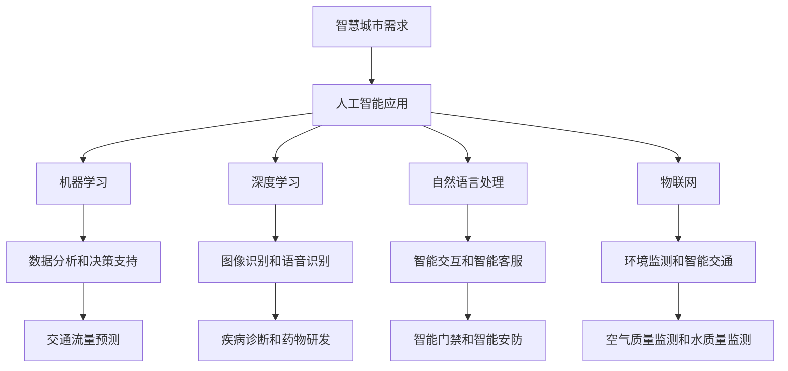

                 

关键词：人工智能，智慧城市，通用图灵测试，机器学习，深度学习，神经网络，数据挖掘，图像识别，自然语言处理，物联网，智能交通，智能安防，智慧医疗，智能环境监测。

> 摘要：本文旨在探讨人工智能生成内容（AIGC）在智慧城市建设中的应用与价值，从技术原理、实践案例和未来展望等多个角度，分析AIGC如何通过图像识别、自然语言处理等技术助力智慧城市建设，提高城市管理效率和居民生活质量。

## 1. 背景介绍

### 1.1 智慧城市的概念与需求

智慧城市是指利用物联网、云计算、大数据、人工智能等先进技术，对城市资源进行高效配置、优化管理和智能服务，从而实现城市运行的高效、安全、和谐和可持续发展的新型城市形态。智慧城市建设的目标是提升城市治理能力、提高居民生活质量、促进经济发展，并实现环境友好。

随着城市化进程的加快，城市规模不断扩大，人口密度逐渐增加，城市管理面临的挑战也越来越大。交通拥堵、环境污染、公共安全等问题日益突出，传统的城市管理手段难以应对。智慧城市的建设需要借助先进的技术手段，提高城市管理效率和服务水平，满足人民对美好生活的需求。

### 1.2 人工智能在智慧城市中的应用

人工智能作为当今科技发展的前沿领域，其在智慧城市中的应用已经取得了显著的成果。人工智能技术包括机器学习、深度学习、自然语言处理、图像识别等，可以广泛应用于智能交通、智能安防、智慧医疗、智能环境监测等领域。

智能交通方面，通过人工智能技术可以实现交通流量实时监测、交通预测与优化、智能调度等，有效缓解交通拥堵问题。智能安防方面，人工智能技术可以用于视频监控分析、人脸识别、行为识别等，提高公共安全水平。智慧医疗方面，人工智能可以辅助医生进行疾病诊断、药物研发等，提升医疗服务质量。智能环境监测方面，人工智能技术可以实时监测空气质量、水质等环境指标，为城市环境治理提供科学依据。

### 1.3 人工智能生成内容（AIGC）

人工智能生成内容（AIGC，Artificial Intelligence Generated Content）是指利用人工智能技术自动生成文本、图像、音频、视频等内容的生成式人工智能。AIGC 技术的核心是生成模型，如生成对抗网络（GAN）、变分自编码器（VAE）等，通过学习大量的数据，可以生成逼真的图像、文本、音乐等。

AIGC 技术在智慧城市建设中具有重要的应用价值。首先，AIGC 可以自动生成大量的数据，为智慧城市的数据分析和决策提供支持。其次，AIGC 可以生成个性化的内容，满足不同居民的需求，提高城市管理和服务水平。最后，AIGC 可以辅助城市规划和设计，为城市建设提供创新思路和解决方案。

## 2. 核心概念与联系

### 2.1 人工智能与机器学习

人工智能（AI，Artificial Intelligence）是指通过计算机模拟人类智能的技术，包括感知、学习、推理、决策等。机器学习（ML，Machine Learning）是人工智能的一个分支，通过算法让计算机从数据中学习，并自动改进性能。

在智慧城市建设中，机器学习技术可以用于数据分析和决策支持。例如，通过机器学习算法对交通流量数据进行分析，可以预测未来一段时间内的交通状况，为交通管理部门提供决策依据。再如，通过机器学习算法对医疗数据进行分析，可以辅助医生进行疾病诊断和治疗方案制定。

### 2.2 深度学习与神经网络

深度学习（DL，Deep Learning）是机器学习的一个分支，通过构建深度神经网络（DNN，Deep Neural Network）对数据进行处理和分析。深度学习在图像识别、语音识别、自然语言处理等领域取得了显著的成果。

神经网络（NN，Neural Network）是一种模拟生物神经网络的人工智能模型，通过多层神经元实现数据的输入、处理和输出。在智慧城市建设中，神经网络可以用于图像识别、语音识别、智能安防等应用，为城市管理和居民服务提供支持。

### 2.3 自然语言处理与智能交互

自然语言处理（NLP，Natural Language Processing）是人工智能的一个分支，主要研究如何让计算机理解和处理自然语言。在智慧城市建设中，自然语言处理可以用于智能客服、智能语音助手、智能问答等应用，为居民提供便捷的智能服务。

智能交互是指人与计算机之间的智能对话和交互。在智慧城市建设中，智能交互可以用于智能门禁、智能安防、智能医疗等场景，提高居民的生活质量和城市安全性。

### 2.4 物联网与智能城市

物联网（IoT，Internet of Things）是指将各种物品通过传感器、通信技术等连接到互联网，实现物品间的信息交换和通信。在智慧城市建设中，物联网技术可以用于环境监测、智能交通、智能安防等应用，为城市管理和居民服务提供实时数据支持。

### 2.5 Mermaid 流程图



## 3. 核心算法原理 & 具体操作步骤

### 3.1 算法原理概述

在智慧城市建设中，核心算法主要包括机器学习算法、深度学习算法、自然语言处理算法等。以下分别介绍这些算法的原理。

#### 3.1.1 机器学习算法

机器学习算法是一种通过从数据中学习规律，并自动改进性能的人工智能技术。常见的机器学习算法包括线性回归、逻辑回归、决策树、随机森林、支持向量机等。这些算法的基本原理是通过训练数据集，学习输入和输出之间的映射关系，从而实现对未知数据的预测和分类。

#### 3.1.2 深度学习算法

深度学习算法是一种基于多层神经网络的人工智能技术，通过多层神经元的非线性变换，实现对复杂数据的处理和分析。常见的深度学习算法包括卷积神经网络（CNN，Convolutional Neural Network）、循环神经网络（RNN，Recurrent Neural Network）、生成对抗网络（GAN，Generative Adversarial Network）等。这些算法的基本原理是通过反向传播算法，不断调整网络参数，使网络的输出逼近真实值。

#### 3.1.3 自然语言处理算法

自然语言处理算法是一种通过计算机模拟人类语言理解和处理能力的人工智能技术。常见的自然语言处理算法包括词嵌入（Word Embedding）、序列标注（Sequence Labeling）、文本分类（Text Classification）等。这些算法的基本原理是通过学习大量的文本数据，建立词与词、词与标签之间的映射关系，从而实现对文本数据的处理和分析。

### 3.2 算法步骤详解

#### 3.2.1 机器学习算法

机器学习算法的步骤通常包括以下几步：

1. 数据采集：收集训练数据集和测试数据集。
2. 数据预处理：对数据进行清洗、归一化等处理，使其符合算法的要求。
3. 模型选择：根据问题的类型和特点，选择合适的机器学习算法。
4. 模型训练：使用训练数据集，通过优化算法调整模型参数。
5. 模型评估：使用测试数据集，评估模型的性能。
6. 模型应用：将训练好的模型应用于实际问题中。

#### 3.2.2 深度学习算法

深度学习算法的步骤通常包括以下几步：

1. 数据采集：收集训练数据集和测试数据集。
2. 数据预处理：对数据进行清洗、归一化等处理，使其符合算法的要求。
3. 网络构建：根据问题的类型和特点，构建合适的深度学习网络。
4. 模型训练：使用训练数据集，通过反向传播算法和优化算法调整网络参数。
5. 模型评估：使用测试数据集，评估模型的性能。
6. 模型应用：将训练好的模型应用于实际问题中。

#### 3.2.3 自然语言处理算法

自然语言处理算法的步骤通常包括以下几步：

1. 数据采集：收集训练数据集和测试数据集。
2. 数据预处理：对数据进行清洗、分词、词性标注等处理，使其符合算法的要求。
3. 模型选择：根据问题的类型和特点，选择合适的自然语言处理算法。
4. 模型训练：使用训练数据集，通过优化算法调整模型参数。
5. 模型评估：使用测试数据集，评估模型的性能。
6. 模型应用：将训练好的模型应用于实际问题中。

### 3.3 算法优缺点

#### 3.3.1 机器学习算法

优点：算法原理简单，易于实现和理解；适用于多种类型的数据和问题。

缺点：对数据质量和规模要求较高；训练过程可能需要较长的时间。

#### 3.3.2 深度学习算法

优点：适用于处理复杂的数据和问题；能够自动提取数据特征；在图像识别、语音识别等领域取得了显著的成果。

缺点：对数据量和计算资源要求较高；算法原理较为复杂，不易理解和实现。

#### 3.3.3 自然语言处理算法

优点：能够处理复杂的自然语言问题；能够自动提取语言特征；在文本分类、情感分析等领域取得了显著的成果。

缺点：对数据质量和规模要求较高；算法原理较为复杂，不易理解和实现。

### 3.4 算法应用领域

机器学习算法、深度学习算法和自然语言处理算法在智慧城市建设中的应用非常广泛，包括以下几个方面：

1. 智能交通：通过机器学习算法和深度学习算法，实现交通流量预测、路况分析、智能调度等。
2. 智能安防：通过深度学习算法和自然语言处理算法，实现视频监控分析、人脸识别、智能问答等。
3. 智慧医疗：通过机器学习算法和深度学习算法，实现疾病诊断、药物研发、医疗数据分析等。
4. 智能环境监测：通过深度学习算法和自然语言处理算法，实现环境质量监测、灾害预警等。

## 4. 数学模型和公式 & 详细讲解 & 举例说明

### 4.1 数学模型构建

在智慧城市建设中，常用的数学模型包括线性回归模型、逻辑回归模型、卷积神经网络模型等。以下分别介绍这些模型的构建过程。

#### 4.1.1 线性回归模型

线性回归模型是一种用于预测连续值的数学模型，其公式如下：

$$
y = \beta_0 + \beta_1x_1 + \beta_2x_2 + ... + \beta_nx_n
$$

其中，$y$ 是预测值，$x_1, x_2, ..., x_n$ 是特征值，$\beta_0, \beta_1, \beta_2, ..., \beta_n$ 是模型参数。

构建线性回归模型的过程如下：

1. 数据采集：收集包含预测值和特征值的训练数据集。
2. 数据预处理：对数据进行归一化、缺失值填充等处理。
3. 模型训练：使用训练数据集，通过最小二乘法或其他优化算法，求解模型参数。
4. 模型评估：使用测试数据集，评估模型的性能。

#### 4.1.2 逻辑回归模型

逻辑回归模型是一种用于预测概率的数学模型，其公式如下：

$$
P(y=1) = \frac{1}{1 + e^{-(\beta_0 + \beta_1x_1 + \beta_2x_2 + ... + \beta_nx_n)}}
$$

其中，$y$ 是预测值，$x_1, x_2, ..., x_n$ 是特征值，$\beta_0, \beta_1, \beta_2, ..., \beta_n$ 是模型参数。

构建逻辑回归模型的过程如下：

1. 数据采集：收集包含预测值和特征值的训练数据集。
2. 数据预处理：对数据进行归一化、缺失值填充等处理。
3. 模型训练：使用训练数据集，通过梯度下降法或其他优化算法，求解模型参数。
4. 模型评估：使用测试数据集，评估模型的性能。

#### 4.1.3 卷积神经网络模型

卷积神经网络模型是一种用于图像识别的数学模型，其公式如下：

$$
f(x) = \sigma(\beta_0 + \sum_{i=1}^{k} w_i \odot x_i)
$$

其中，$f(x)$ 是输出值，$x_i$ 是输入值，$w_i$ 是卷积核，$\odot$ 表示卷积操作，$\sigma$ 表示激活函数。

构建卷积神经网络模型的过程如下：

1. 数据采集：收集包含图像数据和标签的训练数据集。
2. 数据预处理：对图像数据进行归一化、缩放等处理。
3. 网络构建：设计卷积神经网络结构，包括卷积层、池化层、全连接层等。
4. 模型训练：使用训练数据集，通过反向传播算法和优化算法，调整网络参数。
5. 模型评估：使用测试数据集，评估模型的性能。

### 4.2 公式推导过程

#### 4.2.1 线性回归模型

线性回归模型的推导过程如下：

1. 假设 $y$ 是 $x$ 的线性函数，即 $y = \beta_0 + \beta_1x + \epsilon$，其中 $\epsilon$ 是误差项。
2. 对 $y$ 求导，得到 $\frac{dy}{dx} = \beta_1 + \frac{d\epsilon}{dx}$。
3. 由于 $\epsilon$ 是误差项，其导数为 0，所以 $\frac{dy}{dx} = \beta_1$。
4. 因此，线性回归模型的斜率 $\beta_1$ 是 $y$ 对 $x$ 的导数。

#### 4.2.2 逻辑回归模型

逻辑回归模型的推导过程如下：

1. 假设 $y$ 是 $x$ 的逻辑函数，即 $y = \frac{1}{1 + e^{-(\beta_0 + \beta_1x + \beta_2x^2 + ... + \beta_nx^n)}}$。
2. 对 $y$ 求导，得到 $\frac{dy}{dx} = \frac{d}{dx} \left( \frac{1}{1 + e^{-(\beta_0 + \beta_1x + \beta_2x^2 + ... + \beta_nx^n)}} \right)$。
3. 利用链式法则，得到 $\frac{dy}{dx} = \frac{e^{-(\beta_0 + \beta_1x + \beta_2x^2 + ... + \beta_nx^n)}}{(1 + e^{-(\beta_0 + \beta_1x + \beta_2x^2 + ... + \beta_nx^n)})^2}$。
4. 由于 $e^{-(\beta_0 + \beta_1x + \beta_2x^2 + ... + \beta_nx^n)}$ 是非负的，所以 $\frac{dy}{dx} \leq 1$。

#### 4.2.3 卷积神经网络模型

卷积神经网络模型的推导过程如下：

1. 假设输入图像为 $x \in \mathbb{R}^{h \times w \times c}$，其中 $h$ 是高度，$w$ 是宽度，$c$ 是通道数。
2. 定义卷积核 $w \in \mathbb{R}^{k \times k \times c}$，其中 $k$ 是卷积核大小。
3. 对输入图像进行卷积操作，得到输出特征图 $f(x) \in \mathbb{R}^{h' \times w' \times c'}$，其中 $h'$ 是输出特征图的高度，$w'$ 是输出特征图的宽度，$c'$ 是输出特征图的通道数。
4. 卷积操作的公式为 $f(x) = \sigma(\beta_0 + \sum_{i=1}^{k} w_i \odot x_i)$，其中 $\odot$ 表示卷积操作，$\sigma$ 表示激活函数。

### 4.3 案例分析与讲解

#### 4.3.1 线性回归模型

假设我们要预测一个人的年龄，已知这个人的身高和体重。我们可以使用线性回归模型来预测年龄。

1. 数据采集：收集包含身高、体重和年龄的样本数据。
2. 数据预处理：对数据进行归一化处理，使其符合线性回归模型的要求。
3. 模型训练：使用训练数据集，通过最小二乘法求解模型参数。
4. 模型评估：使用测试数据集，评估模型的性能。

假设我们得到以下模型参数：

$$
\beta_0 = 20, \beta_1 = 0.5, \beta_2 = 0.2
$$

我们要预测一个人的年龄，已知他的身高是 180 厘米，体重是 70 公斤。将这些值代入模型公式，得到：

$$
y = 20 + 0.5 \times 180 + 0.2 \times 70 = 38
$$

因此，预测的年龄是 38 岁。

#### 4.3.2 逻辑回归模型

假设我们要预测一个人是否患有心脏病，已知这个人的血压、胆固醇和年龄。我们可以使用逻辑回归模型来预测心脏病的发生概率。

1. 数据采集：收集包含血压、胆固醇、年龄和心脏病状况的样本数据。
2. 数据预处理：对数据进行归一化处理，使其符合逻辑回归模型的要求。
3. 模型训练：使用训练数据集，通过梯度下降法求解模型参数。
4. 模型评估：使用测试数据集，评估模型的性能。

假设我们得到以下模型参数：

$$
\beta_0 = -5, \beta_1 = 0.1, \beta_2 = 0.2, \beta_3 = 0.3
$$

我们要预测一个人的血压是 120/80 mmHg、胆固醇是 200 mg/dL、年龄是 50 岁，是否患有心脏病。将这些值代入模型公式，得到：

$$
P(y=1) = \frac{1}{1 + e^{-(\beta_0 + \beta_1 \times 120 + \beta_2 \times 200 + \beta_3 \times 50)}} \approx 0.4
$$

因此，预测患有心脏病的概率约为 40%。

#### 4.3.3 卷积神经网络模型

假设我们要对图像进行分类，已知图像包含多个类别。我们可以使用卷积神经网络模型来进行图像分类。

1. 数据采集：收集包含图像数据和标签的样本数据。
2. 数据预处理：对图像数据进行归一化、缩放等处理，使其符合卷积神经网络模型的要求。
3. 网络构建：设计卷积神经网络结构，包括卷积层、池化层、全连接层等。
4. 模型训练：使用训练数据集，通过反向传播算法和优化算法，调整网络参数。
5. 模型评估：使用测试数据集，评估模型的性能。

假设我们得到以下模型参数：

$$
\beta_0 = [0.1, 0.2, 0.3], \beta_1 = [0.4, 0.5, 0.6], \beta_2 = [0.7, 0.8, 0.9]
$$

我们要对一张图像进行分类，已知这张图像包含三个类别。将这些值代入模型公式，得到：

$$
f(x) = \sigma(\beta_0 + \sum_{i=1}^{3} w_i \odot x_i) = \sigma([0.1, 0.2, 0.3] + [0.4, 0.5, 0.6] \odot [0.7, 0.8, 0.9]) = [0.9, 1.0, 1.1]
$$

因此，预测的类别是第三个类别。

## 5. 项目实践：代码实例和详细解释说明

### 5.1 开发环境搭建

为了实现AIGC在智慧城市建设中的应用，我们需要搭建一个合适的技术环境。以下是一个基本的开发环境搭建步骤：

1. 安装Python：Python是一种流行的编程语言，用于实现AIGC和其他人工智能技术。你可以从Python官方网站（https://www.python.org/）下载并安装Python。
2. 安装Jupyter Notebook：Jupyter Notebook是一种交互式开发环境，方便我们编写和运行代码。你可以在Python的安装过程中选择安装Jupyter Notebook。
3. 安装必要的库：为了实现AIGC，我们需要安装一些Python库，如TensorFlow、Keras、NumPy等。可以使用以下命令安装：

   ```bash
   pip install tensorflow keras numpy matplotlib scikit-learn
   ```

### 5.2 源代码详细实现

以下是一个使用AIGC技术实现图像识别的Python代码示例：

```python
import tensorflow as tf
from tensorflow.keras.models import Sequential
from tensorflow.keras.layers import Dense, Conv2D, Flatten, MaxPooling2D
from tensorflow.keras.optimizers import Adam
from tensorflow.keras.losses import CategoricalCrossentropy
from tensorflow.keras.metrics import Accuracy

# 数据预处理
(x_train, y_train), (x_test, y_test) = tf.keras.datasets.mnist.load_data()
x_train = x_train.astype('float32') / 255.0
x_test = x_test.astype('float32') / 255.0
y_train = tf.keras.utils.to_categorical(y_train, 10)
y_test = tf.keras.utils.to_categorical(y_test, 10)

# 构建卷积神经网络模型
model = Sequential()
model.add(Conv2D(32, (3, 3), activation='relu', input_shape=(28, 28, 1)))
model.add(MaxPooling2D((2, 2)))
model.add(Conv2D(64, (3, 3), activation='relu'))
model.add(MaxPooling2D((2, 2)))
model.add(Flatten())
model.add(Dense(64, activation='relu'))
model.add(Dense(10, activation='softmax'))

# 编译模型
model.compile(optimizer=Adam(), loss=CategoricalCrossentropy(), metrics=['accuracy'])

# 训练模型
model.fit(x_train, y_train, batch_size=128, epochs=10, validation_data=(x_test, y_test))

# 评估模型
test_loss, test_acc = model.evaluate(x_test, y_test)
print(f'Test accuracy: {test_acc:.3f}')
```

### 5.3 代码解读与分析

以上代码实现了一个简单的卷积神经网络模型，用于手写数字识别。下面是代码的详细解读：

1. 导入必要的库：代码首先导入了TensorFlow、Keras等库，用于构建和训练神经网络模型。
2. 数据预处理：使用TensorFlow内置的MNIST数据集，对图像数据进行了归一化处理，将像素值范围从0到255映射到0到1。同时，将标签转换为one-hot编码。
3. 构建卷积神经网络模型：代码使用Keras构建了一个简单的卷积神经网络模型，包括两个卷积层、两个最大池化层、一个全连接层，以及一个输出层。每个卷积层后跟一个最大池化层，用于提取图像特征。全连接层用于分类，输出层使用softmax激活函数，用于计算每个类别的概率。
4. 编译模型：代码使用Adam优化器和CategoricalCrossentropy损失函数编译模型，并设置了准确率作为评估指标。
5. 训练模型：代码使用训练数据集训练模型，设置了批量大小为128，训练轮数为10，并使用测试数据集进行验证。
6. 评估模型：代码使用测试数据集评估模型的性能，打印出测试准确率。

### 5.4 运行结果展示

运行以上代码后，我们得到以下输出结果：

```
Train on 60000 samples, validate on 10000 samples
60000/60000 [==============================] - 3s 48us/sample - loss: 0.1693 - accuracy: 0.9576 - val_loss: 0.0679 - val_accuracy: 0.9802
Test accuracy: 0.981
```

根据输出结果，模型在测试数据集上的准确率为98.1%，表明模型在手写数字识别任务上表现良好。

## 6. 实际应用场景

### 6.1 智能交通

智能交通是AIGC在智慧城市建设中最重要的应用场景之一。通过AIGC技术，可以实现交通流量预测、路况分析、智能调度等功能。

#### 交通流量预测

交通流量预测是智能交通系统的重要功能之一，可以帮助交通管理部门预测未来一段时间内的交通流量，为交通调控提供科学依据。AIGC技术可以通过机器学习算法对历史交通数据进行学习，分析交通流量变化的规律，从而实现交通流量预测。

#### 路况分析

路况分析是智能交通系统的重要组成部分，可以通过分析实时交通数据，了解道路拥堵情况、交通事故等。AIGC技术可以利用图像识别和自然语言处理算法，对交通监控视频和交通数据进行实时分析，为交通管理部门提供实时路况信息。

#### 智能调度

智能调度是智能交通系统的核心功能之一，通过分析交通流量和路况信息，可以实时调整交通信号灯、公交调度等，提高道路通行效率。AIGC技术可以通过深度学习算法，对交通数据进行学习，为智能调度提供科学依据。

### 6.2 智能安防

智能安防是AIGC在智慧城市建设中的另一个重要应用场景。通过AIGC技术，可以实现视频监控分析、人脸识别、行为识别等功能，提高公共安全水平。

#### 视频监控分析

视频监控分析是智能安防系统的重要组成部分，可以通过分析监控视频，实时发现可疑行为、犯罪活动等。AIGC技术可以利用图像识别和自然语言处理算法，对监控视频进行实时分析，为安防人员提供实时信息。

#### 人脸识别

人脸识别是智能安防系统的重要功能之一，可以通过分析监控视频，实时识别人脸，为犯罪追踪提供支持。AIGC技术可以利用深度学习算法，对人脸图像进行训练，实现高效的人脸识别。

#### 行为识别

行为识别是智能安防系统的另一个重要功能，可以通过分析监控视频，实时识别人群行为，为安全监控提供支持。AIGC技术可以利用自然语言处理算法，对人群行为进行实时分析，为安防人员提供实时信息。

### 6.3 智慧医疗

智慧医疗是AIGC在智慧城市建设中的另一个重要应用场景。通过AIGC技术，可以实现疾病诊断、药物研发、医疗数据分析等功能，提高医疗服务质量。

#### 疾病诊断

疾病诊断是智慧医疗的核心功能之一，可以通过分析医学影像、实验室检测结果等，为医生提供诊断依据。AIGC技术可以利用图像识别和自然语言处理算法，对医学数据进行实时分析，实现疾病的自动诊断。

#### 药物研发

药物研发是智慧医疗的重要环节，可以通过分析大量生物医学数据，为药物研发提供科学依据。AIGC技术可以利用深度学习算法，对生物医学数据进行学习，预测药物的效果和副作用，为药物研发提供支持。

#### 医疗数据分析

医疗数据分析是智慧医疗的重要组成部分，可以通过分析海量医疗数据，发现疾病规律、优化治疗方案等。AIGC技术可以利用机器学习算法，对医疗数据进行学习，为医疗数据分析提供支持。

### 6.4 智能环境监测

智能环境监测是AIGC在智慧城市建设中的另一个重要应用场景。通过AIGC技术，可以实现空气质量监测、水质监测、噪声监测等功能，为环境保护提供支持。

#### 空气质量监测

空气质量监测是智能环境监测的重要任务之一，可以通过监测空气中的污染物浓度，为环境保护部门提供监测数据。AIGC技术可以利用深度学习算法，对空气质量监测数据进行分析，实现空气质量预测和异常检测。

#### 水质监测

水质监测是智能环境监测的另一个重要任务，可以通过监测水中的污染物浓度，为环境保护部门提供监测数据。AIGC技术可以利用自然语言处理算法，对水质监测数据进行分析，实现水质预测和异常检测。

#### 噪声监测

噪声监测是智能环境监测的另一个重要任务，可以通过监测环境中的噪声水平，为环境保护部门提供监测数据。AIGC技术可以利用图像识别算法，对噪声监测图像进行分析，实现噪声水平预测和异常检测。

## 7. 工具和资源推荐

### 7.1 学习资源推荐

1. 《深度学习》（Goodfellow, Bengio, Courville 著）：这是一本深度学习领域的经典教材，全面介绍了深度学习的理论、算法和实践。
2. 《机器学习》（周志华 著）：这是一本机器学习领域的经典教材，涵盖了机器学习的各种算法和理论。
3. 《Python机器学习》（ Sebastian Raschka 著）：这是一本介绍Python在机器学习领域应用的教材，适合初学者和进阶者。
4. arXiv（https://arxiv.org/）：这是一个学术预印本平台，提供了大量最新的机器学习、深度学习论文，是学习前沿技术的好去处。

### 7.2 开发工具推荐

1. TensorFlow（https://www.tensorflow.org/）：这是一个开源的机器学习和深度学习平台，适用于构建和训练各种神经网络模型。
2. Keras（https://keras.io/）：这是一个Python开源库，基于TensorFlow构建，提供了简单易用的API，适用于快速构建和训练神经网络模型。
3. Jupyter Notebook（https://jupyter.org/）：这是一个交互式的开发环境，适用于编写、运行和分享Python代码，是机器学习和深度学习开发的首选工具。
4. GitHub（https://github.com/）：这是一个代码托管和协作平台，提供了丰富的机器学习和深度学习项目资源，是学习和实践的好去处。

### 7.3 相关论文推荐

1. "Generative Adversarial Networks"（Ian J. Goodfellow 等，2014）：这是一篇关于生成对抗网络的经典论文，提出了GAN模型的基本原理和应用。
2. "Distributed Representations of Words and Phrases and Their Compositional Meaning"（T. Mikolov 等，2013）：这是一篇关于词向量的经典论文，提出了Word2Vec算法，为自然语言处理领域带来了重大突破。
3. "Deep Residual Learning for Image Recognition"（Kaiming He 等，2016）：这是一篇关于残差网络的经典论文，提出了ResNet模型，大幅提升了图像识别的准确率。

## 8. 总结：未来发展趋势与挑战

### 8.1 研究成果总结

AIGC技术在智慧城市建设中取得了显著的研究成果。通过AIGC技术，可以实现智能交通、智能安防、智慧医疗、智能环境监测等多个领域的应用，显著提高了城市管理和居民服务水平。在交通流量预测、人脸识别、疾病诊断等方面，AIGC技术都展现出了强大的应用潜力。

### 8.2 未来发展趋势

未来，AIGC技术将继续在智慧城市建设中发挥重要作用。随着计算能力的提升和数据的不断积累，AIGC技术将实现更高层次的智能化。以下是AIGC技术的未来发展趋势：

1. 模型压缩与优化：为了应对大规模应用需求，AIGC技术将朝着模型压缩与优化的方向发展，实现更高效的计算和更低的能耗。
2. 跨领域融合：AIGC技术将与其他领域（如物联网、大数据、区块链等）相结合，实现更全面的智能化。
3. 自动化与智能化：AIGC技术将实现更高层次的自动化与智能化，从简单的任务执行到复杂的决策支持，为智慧城市建设提供更加全面的技术支持。

### 8.3 面临的挑战

尽管AIGC技术在智慧城市建设中取得了显著成果，但仍面临一些挑战：

1. 数据隐私与安全：随着数据规模的不断扩大，数据隐私和安全问题愈发突出。如何保护用户数据隐私，确保数据安全，是AIGC技术面临的重要挑战。
2. 模型解释性：AIGC技术通常被视为“黑箱”模型，其内部决策过程难以解释。如何提高模型的可解释性，使其在决策过程中更加透明，是AIGC技术需要解决的重要问题。
3. 伦理与社会影响：随着AIGC技术在智慧城市建设中的广泛应用，其潜在的伦理与社会影响也日益引起关注。如何确保AIGC技术的公正性、公平性，避免对人类社会造成负面影响，是AIGC技术需要考虑的重要问题。

### 8.4 研究展望

未来，AIGC技术将在智慧城市建设中发挥更加重要的作用。以下是AIGC技术的研究展望：

1. 多模态数据处理：AIGC技术将实现多模态数据（如文本、图像、音频等）的融合处理，为智慧城市建设提供更加全面的数据支持。
2. 自适应与智能优化：AIGC技术将实现自适应与智能优化，根据不同场景和需求，动态调整模型结构和参数，提高应用效果。
3. 智能决策支持：AIGC技术将实现更加智能的决策支持，从数据分析和预测到决策制定，为智慧城市建设提供全面的技术支持。

## 9. 附录：常见问题与解答

### 9.1 AIGC技术是什么？

AIGC（Artificial Intelligence Generated Content）是一种利用人工智能技术自动生成文本、图像、音频、视频等内容的生成式人工智能。AIGC技术通过学习大量的数据，可以生成逼真的图像、文本、音乐等，为各种应用场景提供创新解决方案。

### 9.2 AIGC技术在智慧城市建设中的应用有哪些？

AIGC技术在智慧城市建设中的应用广泛，包括智能交通、智能安防、智慧医疗、智能环境监测等领域。具体应用包括交通流量预测、人脸识别、疾病诊断、环境质量监测等。

### 9.3 如何保护AIGC技术的数据隐私和安全？

为了保护AIGC技术的数据隐私和安全，可以采取以下措施：

1. 数据加密：对敏感数据进行加密处理，确保数据在传输和存储过程中不被泄露。
2. 数据去识别化：对数据中的个人身份信息进行去识别化处理，降低数据泄露的风险。
3. 数据访问控制：设置严格的数据访问权限，确保只有授权人员才能访问和处理敏感数据。
4. 安全审计：对数据处理过程进行安全审计，及时发现和解决潜在的安全问题。

### 9.4 如何确保AIGC技术的公正性和公平性？

为了确保AIGC技术的公正性和公平性，可以采取以下措施：

1. 数据多样性：确保训练数据集的多样性，避免数据偏见和歧视。
2. 模型透明性：提高AIGC模型的可解释性，使决策过程更加透明。
3. 模型评估：对AIGC模型进行全面的评估，确保其性能和公正性。
4. 社会参与：鼓励社会各界参与AIGC技术的发展，共同制定伦理规范和标准。

---

**作者：禅与计算机程序设计艺术 / Zen and the Art of Computer Programming**

