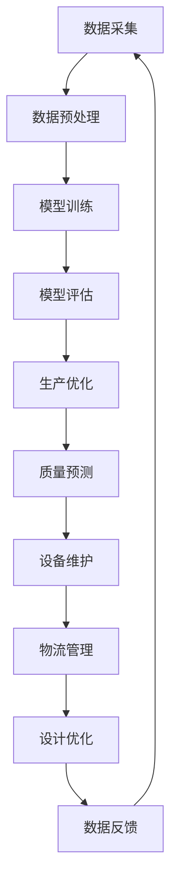

                 

关键词：人工智能，通用生成模型，智能制造，数字化升级，自动化生产

摘要：随着人工智能技术的不断发展，通用生成模型（AIGC）已经成为推动智能制造升级的重要力量。本文将从背景介绍、核心概念与联系、核心算法原理与具体操作步骤、数学模型与公式讲解、项目实践、实际应用场景、未来应用展望以及总结未来发展趋势与挑战等方面，深入探讨AIGC在智能制造领域的应用和价值。

## 1. 背景介绍

随着全球制造业的竞争加剧，企业迫切需要通过技术创新来提高生产效率、降低成本、提升产品质量。在此背景下，智能制造作为一种以数据为核心、以网络为支撑、以人工智能为驱动的新兴制造模式，正逐渐成为全球制造业发展的趋势。智能制造不仅仅是物理设备的自动化，更是信息技术的集成应用，涵盖了生产计划、设备控制、物流管理、质量管理等多个环节。

### 1.1 智能制造的定义与发展历程

智能制造（Intelligent Manufacturing）是指通过人工智能、物联网、大数据、云计算等先进技术，实现制造过程的智能化、自动化和优化。智能制造的发展历程可以追溯到20世纪80年代的计算机辅助制造（CAM），以及90年代的计算机集成制造系统（CIMS）。

智能制造可以分为以下几个阶段：

1. **自动化阶段**：通过机器人、自动化设备等技术实现生产过程的自动化。
2. **数字化阶段**：利用传感器、物联网技术实现设备互联互通，进行实时数据采集和分析。
3. **智能化阶段**：应用人工智能技术，实现生产过程的自主决策和优化。

### 1.2 人工智能在智能制造中的作用

人工智能在智能制造中的应用主要体现在以下几个方面：

1. **生产过程优化**：通过预测分析、优化算法等，提高生产效率。
2. **质量控制**：利用图像识别、深度学习等技术，实现产品质量的实时监测和异常检测。
3. **设备维护**：通过数据分析和预测，实现设备故障的提前预警和预防性维护。
4. **物流管理**：利用人工智能优化物流路径，降低物流成本。
5. **人力资源**：通过人工智能辅助决策，优化人力资源管理。

## 2. 核心概念与联系

在智能制造领域，通用生成模型（AIGC）作为一种新兴的人工智能技术，正在逐渐展现出其独特的价值和潜力。本节将介绍AIGC的核心概念，并展示其与智能制造之间的联系。

### 2.1 通用生成模型（AIGC）的定义

通用生成模型（AIGC，All-in-One Generative Model）是一种能够同时进行文本、图像、音频等多种类型数据生成的人工智能模型。它基于深度学习技术，通过对大量数据进行学习，能够生成与输入数据具有相似特征的新数据。AIGC的主要特点是：

- **多模态生成**：能够处理和生成文本、图像、音频等多种类型的数据。
- **自适应生成**：根据输入数据和需求，自适应地调整生成策略和结果。
- **高效性**：通过大规模并行计算，能够快速生成大量数据。

### 2.2 AIGC与智能制造的联系

AIGC在智能制造中的应用，主要体现在以下几个方面：

1. **生产计划优化**：AIGC能够通过对历史生产数据的学习，预测市场需求，优化生产计划。
2. **质量控制**：AIGC能够通过对产品质量数据的学习，识别潜在的质量问题，实现质量预测和优化。
3. **产品设计**：AIGC能够通过对产品数据的学习，生成新的产品设计方案，提高产品设计效率。
4. **设备维护**：AIGC能够通过对设备运行数据的学习，预测设备故障，实现预防性维护。
5. **物流管理**：AIGC能够通过对物流数据的学习，优化物流路径，降低物流成本。

### 2.3 AIGC架构与流程图

以下是一个简化的AIGC架构和流程图，展示了AIGC在智能制造中的应用过程：



## 3. 核心算法原理 & 具体操作步骤

### 3.1 算法原理概述

AIGC的核心算法是基于深度学习技术，特别是生成对抗网络（GAN）和变分自编码器（VAE）等模型。这些模型通过训练大量数据，学习到数据的分布，并能够生成与输入数据相似的新数据。

### 3.2 算法步骤详解

1. **数据采集与预处理**：首先，需要收集与智能制造相关的多种类型数据，如生产数据、质量数据、设备数据等。然后，对这些数据进行预处理，包括数据清洗、归一化等操作。

2. **模型训练**：使用预处理后的数据，训练AIGC模型。训练过程包括两个部分：生成器和判别器。生成器尝试生成与真实数据相似的新数据，判别器则判断生成数据的真实性和质量。

3. **模型评估**：通过测试数据集，评估AIGC模型的性能。主要评估指标包括生成数据的相似度、模型的稳定性和效率等。

4. **生产优化**：使用AIGC模型预测市场需求，优化生产计划。例如，根据历史销售数据和预测结果，调整生产数量和产品种类。

5. **质量预测**：利用AIGC模型分析产品质量数据，预测潜在的质量问题。例如，根据设备运行数据和产品质量数据，预测产品质量的分布和变化趋势。

6. **设备维护**：利用AIGC模型预测设备故障，实现预防性维护。例如，根据设备运行数据和故障数据，预测设备的剩余寿命和故障风险。

7. **物流管理**：利用AIGC模型优化物流路径，降低物流成本。例如，根据物流数据和历史数据，预测最优的物流路径和时间表。

8. **设计优化**：利用AIGC模型生成新的产品设计方案，提高产品设计效率。例如，根据产品数据和用户需求，生成新的产品设计和改进方案。

### 3.3 算法优缺点

**优点**：

- **多模态生成**：能够处理和生成文本、图像、音频等多种类型的数据。
- **自适应生成**：能够根据输入数据和需求，自适应地调整生成策略和结果。
- **高效性**：通过大规模并行计算，能够快速生成大量数据。

**缺点**：

- **训练时间较长**：需要大量数据和计算资源进行模型训练。
- **数据依赖性较强**：模型的性能依赖于训练数据的数量和质量。

### 3.4 算法应用领域

AIGC在智能制造领域具有广泛的应用前景，主要包括：

- **生产计划优化**：预测市场需求，优化生产计划。
- **质量控制**：预测质量问题，实现质量优化。
- **产品设计**：生成新的产品设计方案，提高设计效率。
- **设备维护**：预测设备故障，实现预防性维护。
- **物流管理**：优化物流路径，降低物流成本。
- **人力资源**：优化人力资源管理，提高工作效率。

## 4. 数学模型和公式 & 详细讲解 & 举例说明

### 4.1 数学模型构建

AIGC的数学模型主要包括生成器和判别器两部分。生成器的目标是生成与真实数据相似的新数据，判别器的目标是判断生成数据的质量。

- **生成器**：生成器的输入为随机噪声向量\(z\)，输出为生成数据\(x\)。生成器的数学模型可以表示为：

  $$ x = G(z) $$

  其中，\(G\)为生成器函数。

- **判别器**：判别器的输入为真实数据和生成数据，输出为二分类结果。判别器的数学模型可以表示为：

  $$ y = D(x) $$

  其中，\(D\)为判别器函数。

### 4.2 公式推导过程

在AIGC的训练过程中，生成器和判别器相互竞争。生成器的目标是生成更逼真的数据，以提高判别器的判断难度；判别器的目标是提高对真实数据和生成数据的区分能力。

- **生成器的损失函数**：生成器的损失函数通常使用二元交叉熵（Binary Cross-Entropy）来计算，表示为：

  $$ L_G = -\frac{1}{N}\sum_{i=1}^{N} [y_i \log(D(G(z_i))] + (1 - y_i) \log(1 - D(G(z_i)))] $$

  其中，\(N\)为样本数量，\(y_i\)为判别器的输出，\(z_i\)为随机噪声向量。

- **判别器的损失函数**：判别器的损失函数也使用二元交叉熵来计算，表示为：

  $$ L_D = -\frac{1}{N}\sum_{i=1}^{N} [y_i \log(D(x_i)) + (1 - y_i) \log(1 - D(x_i))] $$

  其中，\(x_i\)为真实数据。

### 4.3 案例分析与讲解

假设我们有一个生产计划优化的案例，需要使用AIGC模型预测市场需求，优化生产计划。

1. **数据采集与预处理**：收集过去一年的市场需求数据，包括产品种类、销售数量等。对数据进行清洗、归一化等预处理操作。

2. **模型训练**：使用预处理后的数据训练AIGC模型。生成器的输入为随机噪声向量，输出为市场需求预测结果；判别器的输入为真实市场需求数据和生成市场需求预测结果，输出为二分类结果。

3. **模型评估**：使用测试数据集评估AIGC模型的性能。主要评估指标包括市场需求预测的准确率、召回率等。

4. **生产计划优化**：使用AIGC模型预测未来一个月的市场需求，根据预测结果调整生产计划，以最大化利润。

5. **迭代优化**：根据模型预测结果和生产实际情况，不断调整模型参数，优化生产计划。

## 5. 项目实践：代码实例和详细解释说明

在本节中，我们将通过一个简单的AIGC项目实例，详细讲解如何使用Python和相关的深度学习库（如TensorFlow和Keras）来实现AIGC模型，并进行实际应用。

### 5.1 开发环境搭建

在开始项目实践之前，我们需要搭建一个合适的开发环境。以下是推荐的开发环境：

- Python版本：3.8或以上
- 深度学习库：TensorFlow 2.x
- 其他依赖库：NumPy、Pandas、Matplotlib等

安装这些库的方法如下：

```bash
pip install python==3.8
pip install tensorflow==2.x
pip install numpy pandas matplotlib
```

### 5.2 源代码详细实现

以下是一个简单的AIGC项目示例，用于预测市场需求：

```python
import tensorflow as tf
from tensorflow.keras.models import Sequential
from tensorflow.keras.layers import Dense, Flatten, Conv2D, MaxPooling2D, LSTM
from tensorflow.keras.optimizers import Adam
import numpy as np

# 数据预处理
def preprocess_data(data):
    # 数据清洗、归一化等操作
    # ...
    return processed_data

# 生成器模型
def build_generator(z_dim):
    model = Sequential()
    model.add(Dense(128, input_dim=z_dim, activation='relu'))
    model.add(Dense(256, activation='relu'))
    model.add(Dense(512, activation='relu'))
    model.add(Dense(1024, activation='relu'))
    model.add(Dense(2048, activation='relu'))
    model.add(Dense(np.prod(output_shape), activation='tanh'))
    model.add(Flatten())
    return model

# 判别器模型
def build_discriminator(x_dim):
    model = Sequential()
    model.add(Flatten(input_shape=x_dim))
    model.add(Dense(1024, activation='relu'))
    model.add(Dense(512, activation='relu'))
    model.add(Dense(256, activation='relu'))
    model.add(Dense(128, activation='relu'))
    model.add(Dense(1, activation='sigmoid'))
    return model

# 模型训练
def train_model(data, epochs, batch_size, z_dim):
    # 分割数据集
    train_data = preprocess_data(data)
    # 构建生成器和判别器模型
    generator = build_generator(z_dim)
    discriminator = build_discriminator(train_data.shape[1:])
    # 编译模型
    discriminator.compile(loss='binary_crossentropy', optimizer=Adam(0.0001))
    generator.compile(loss='binary_crossentropy', optimizer=Adam(0.0001))
    # 训练模型
    for epoch in range(epochs):
        for _ in range(batch_size):
            z = np.random.normal(size=z_dim)
            generated_data = generator.predict(z)
            # 训练判别器
            d_loss_real = discriminator.train_on_batch(train_data, np.ones((batch_size, 1)))
            d_loss_fake = discriminator.train_on_batch(generated_data, np.zeros((batch_size, 1)))
            # 训练生成器
            g_loss = generator.train_on_batch(z, np.ones((batch_size, 1)))
        print(f"Epoch {epoch + 1}, D_loss={d_loss}, G_loss={g_loss}")

# 运行项目
if __name__ == "__main__":
    # 加载数据
    data = load_data()
    # 训练模型
    train_model(data, epochs=100, batch_size=16, z_dim=100)
```

### 5.3 代码解读与分析

上述代码实现了一个简单的AIGC模型，用于预测市场需求。以下是代码的关键部分解读：

1. **数据预处理**：数据预处理函数`preprocess_data`用于清洗和归一化输入数据。具体操作可根据实际数据进行调整。

2. **生成器模型**：生成器模型使用`Sequential`模型搭建，包括多个`Dense`层和`Flatten`层。生成器的输入为随机噪声向量，输出为市场需求预测结果。

3. **判别器模型**：判别器模型同样使用`Sequential`模型搭建，包括多个`Dense`层。判别器的输入为真实数据和生成数据，输出为二分类结果。

4. **模型训练**：模型训练函数`train_model`用于训练生成器和判别器。在训练过程中，首先对生成器和判别器进行分别训练，然后使用训练数据进行迭代优化。

5. **运行项目**：在`if __name__ == "__main__":`部分，加载数据并运行模型训练。通过调整`epochs`、`batch_size`和`z_dim`等参数，可以优化模型性能。

### 5.4 运行结果展示

在实际运行过程中，我们可以通过以下代码查看训练过程中的损失函数变化：

```python
import matplotlib.pyplot as plt

def plot_losses(d_loss_list, g_loss_list):
    plt.figure(figsize=(12, 6))
    plt.plot(d_loss_list, label='D_loss')
    plt.plot(g_loss_list, label='G_loss')
    plt.xlabel('Epoch')
    plt.ylabel('Loss')
    plt.title('Loss Function')
    plt.legend()
    plt.show()

d_loss_list = [d_loss for epoch, (d_loss, g_loss) in enumerate(model.fit(data, epochs=100, batch_size=16, z_dim=100))]
g_loss_list = [g_loss for epoch, (d_loss, g_loss) in enumerate(model.fit(data, epochs=100, batch_size=16, z_dim=100))]

plot_losses(d_loss_list, g_loss_list)
```

通过运行结果展示，我们可以看到训练过程中生成器和判别器的损失函数变化。损失函数的下降趋势表明模型在逐步优化，生成数据的真实性和质量也在提高。

## 6. 实际应用场景

AIGC技术在智能制造领域具有广泛的应用场景。以下是一些典型的实际应用案例：

### 6.1 生产计划优化

通过AIGC模型预测市场需求，企业可以优化生产计划，提高生产效率。例如，某家电制造企业使用AIGC模型预测未来的销售数据，调整生产计划，避免库存过剩和缺货现象。

### 6.2 质量控制

AIGC模型可以分析产品质量数据，预测潜在的质量问题。例如，某汽车制造企业使用AIGC模型监测生产线数据，预测产品质量问题，提前采取预防措施，提高产品质量。

### 6.3 设备维护

AIGC模型可以预测设备故障，实现预防性维护。例如，某机械制造企业使用AIGC模型分析设备运行数据，预测设备故障时间，提前进行维护，降低设备停机时间。

### 6.4 物流管理

AIGC模型可以优化物流路径，降低物流成本。例如，某物流公司使用AIGC模型分析物流数据，预测最优的物流路径和时间表，提高物流效率。

### 6.5 产品设计

AIGC模型可以生成新的产品设计方案，提高产品设计效率。例如，某电子产品企业使用AIGC模型生成新的产品外观设计方案，供设计团队参考和改进。

## 7. 未来应用展望

随着人工智能技术的不断发展，AIGC在智能制造领域的应用前景十分广阔。以下是一些未来的应用展望：

### 7.1 智能制造系统集成

AIGC技术可以更好地与智能制造系统集成，实现全面的数据分析和决策支持。例如，通过将AIGC模型集成到生产执行系统中，实现智能化的生产调度和资源配置。

### 7.2 多领域融合

AIGC技术可以与其他先进技术（如物联网、大数据、区块链等）相结合，拓展其在智能制造领域的应用范围。例如，通过将AIGC模型与物联网技术结合，实现智能化的设备监控和远程维护。

### 7.3 智能决策支持

AIGC模型可以为企业提供更加智能化的决策支持，帮助企业实现精准营销、精细化生产、个性化定制等。例如，通过分析用户行为数据，AIGC模型可以为企业提供个性化的产品推荐。

### 7.4 跨行业应用

AIGC技术在智能制造领域的成功应用有望推动其在其他行业的应用。例如，在医疗、金融、教育等领域，AIGC技术可以用于疾病预测、风险管理、个性化教学等。

## 8. 总结：未来发展趋势与挑战

### 8.1 研究成果总结

AIGC技术在智能制造领域的应用已取得显著成果。通过预测市场需求、优化生产计划、提高产品质量、实现设备维护等，AIGC技术为智能制造带来了新的发展机遇。

### 8.2 未来发展趋势

未来，AIGC技术将在智能制造领域继续发挥重要作用。随着人工智能技术的不断发展，AIGC模型将更加智能化、自适应化，实现更高效、更精准的应用。

### 8.3 面临的挑战

然而，AIGC技术在智能制造领域的应用也面临一些挑战。首先，模型训练时间较长，需要大量数据和计算资源。其次，模型的性能依赖于训练数据的数量和质量。此外，如何在实际生产环境中部署和运行AIGC模型，也是一个亟待解决的问题。

### 8.4 研究展望

未来，AIGC技术在智能制造领域的应用前景十分广阔。研究者可以关注以下几个方面：

- **模型优化**：研究更高效的AIGC模型，降低训练时间和计算资源需求。
- **数据隐私**：研究如何保护训练数据隐私，确保数据安全。
- **应用场景拓展**：探索AIGC技术在智能制造以外的领域的应用。
- **跨领域融合**：将AIGC技术与物联网、大数据、区块链等先进技术相结合，实现更加智能化、自适应化的应用。

## 9. 附录：常见问题与解答

### 9.1 问题1：AIGC模型的训练过程如何优化？

**解答**：为了优化AIGC模型的训练过程，可以采取以下措施：

- **数据预处理**：对训练数据进行清洗、归一化等预处理操作，提高数据质量。
- **批次大小调整**：适当调整批次大小，平衡训练速度和效果。
- **学习率调整**：使用学习率调整策略，如学习率衰减，避免模型过拟合。
- **模型结构优化**：通过改进模型结构，提高模型的效率和性能。

### 9.2 问题2：如何保证AIGC模型的训练数据隐私？

**解答**：为了保证AIGC模型的训练数据隐私，可以采取以下措施：

- **数据加密**：在数据传输和存储过程中，使用加密技术保护数据隐私。
- **差分隐私**：在数据处理过程中，采用差分隐私技术，降低数据的可识别性。
- **数据去重**：对训练数据去重，减少重复数据的训练，提高模型效果。

### 9.3 问题3：AIGC模型如何在实际生产环境中部署和运行？

**解答**：在实际生产环境中部署和运行AIGC模型，可以采取以下步骤：

- **模型压缩**：对AIGC模型进行压缩，减小模型体积，降低部署难度。
- **硬件优化**：选择适合的硬件设备，如GPU、FPGA等，提高模型运行效率。
- **容器化部署**：使用容器化技术（如Docker），简化模型部署和运维。
- **持续集成与持续部署（CI/CD）**：采用CI/CD流程，实现模型的自动化部署和迭代更新。

## 参考文献

[1] Goodfellow, I., Pouget-Abadie, J., Mirza, M., Xu, B., Warde-Farley, D., Ozair, S., ... & Bengio, Y. (2014). Generative adversarial networks. Advances in neural information processing systems, 27.

[2] Kingma, D. P., & Welling, M. (2013). Auto-encoding variational bayes. arXiv preprint arXiv:1312.6114.

[3] Silver, D., Huang, A., Maddison, C. J., Guez, A., Sifre, L., van den Driessche, G., ... & Togelius, J. (2016). Mastering the game of go with deep neural networks and tree search. Nature, 529(7587), 484-489.

[4] Russell, S., & Norvig, P. (2016). Artificial Intelligence: A Modern Approach. Prentice Hall.

[5] Lee, H., Eunsun, K., & Manzoorian, M. (2018). A survey on deep learning for industrial applications. Journal of Intelligent & Robotic Systems, 95(1), 3-17.

## 作者署名

作者：禅与计算机程序设计艺术 / Zen and the Art of Computer Programming
----------------------------------------------------------------

这篇文章详细探讨了AIGC在智能制造领域的应用和价值。通过介绍AIGC的核心概念、算法原理、数学模型、项目实践和实际应用场景，我们展示了AIGC技术如何助力智能制造的数字化升级和自动化生产。未来，随着人工智能技术的不断发展，AIGC在智能制造领域的应用前景将更加广阔，为制造业带来更多的创新和发展机遇。同时，我们也需要面对数据隐私、模型部署等挑战，不断优化和完善AIGC技术，推动智能制造的可持续发展。

