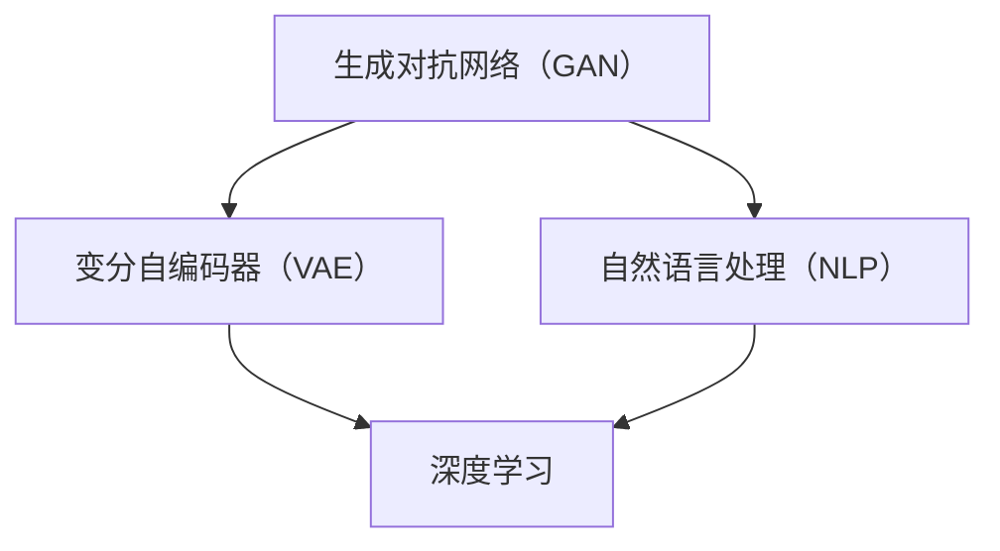

                 

关键词：人工智能生成内容，AIGC，技术普及，行业应用，发展趋势

> 摘要：本文深入分析了人工智能生成内容（AIGC）技术的普及程度。通过对核心概念、算法原理、数学模型、项目实践、实际应用场景以及未来发展趋势的探讨，揭示了AIGC技术在不同领域的应用现状及其面临的挑战。

## 1. 背景介绍

随着人工智能技术的迅猛发展，人工智能生成内容（AIGC）技术逐渐成为行业热点。AIGC是一种基于人工智能技术自动生成内容的方法，涵盖文本、图像、音频等多种形式。它利用深度学习模型，如生成对抗网络（GAN）、变分自编码器（VAE）等，模拟人类创作过程，实现内容的自动化生成。

近年来，AIGC技术在各个领域取得了显著的成果，如智能写作、图像生成、语音合成等。然而，尽管其应用前景广阔，AIGC技术的普及程度仍然有限。本文将从多个角度分析AIGC技术的普及现状，探讨其发展过程中面临的挑战和机遇。

### 1.1 AIGC技术的发展历程

AIGC技术起源于深度学习领域，其核心算法生成对抗网络（GAN）在2014年由Ian Goodfellow等人提出。随后，VAE等变分自编码器技术也得到广泛应用。这些算法为AIGC技术提供了理论基础。

随着硬件性能的提升和大数据的积累，AIGC技术逐步走向实用化。2017年，谷歌发布了基于GAN的图像生成模型，能够生成逼真的图像。此后，AIGC技术在智能写作、图像生成、语音合成等领域取得了重要突破。

### 1.2 AIGC技术的应用场景

AIGC技术具有广泛的应用场景，包括但不限于以下几个方面：

- **智能写作**：AIGC技术可以生成新闻文章、博客、小说等文本内容，降低人力成本，提高创作效率。
- **图像生成**：AIGC技术能够生成高质量、创意无限的图像，应用于游戏开发、广告设计等领域。
- **语音合成**：AIGC技术可以生成逼真的语音，应用于智能客服、语音助手等场景。
- **视频生成**：AIGC技术可以自动生成视频内容，应用于影视制作、视频剪辑等领域。
- **虚拟现实**：AIGC技术可以生成虚拟现实场景，提高用户体验。

## 2. 核心概念与联系

### 2.1 核心概念

AIGC技术涉及多个核心概念，包括：

- **生成对抗网络（GAN）**：GAN由生成器和判别器组成，通过对抗训练实现图像生成。
- **变分自编码器（VAE）**：VAE通过编码器和解码器实现图像生成，具有良好的生成效果。
- **自然语言处理（NLP）**：NLP技术用于处理和生成文本内容，是实现智能写作的关键。
- **深度学习**：深度学习为AIGC技术提供了强大的算法支持，是实现自动生成内容的基础。

### 2.2 核心联系

AIGC技术的核心联系如图所示：



- 生成对抗网络（GAN）和变分自编码器（VAE）是AIGC技术的核心算法，用于图像和文本的生成。
- 自然语言处理（NLP）技术是实现智能写作的关键，与深度学习密切相关。
- 深度学习为AIGC技术提供了算法支持，是实现自动生成内容的基础。

## 3. 核心算法原理 & 具体操作步骤

### 3.1 算法原理概述

#### 3.1.1 生成对抗网络（GAN）

生成对抗网络（GAN）由生成器和判别器组成。生成器的目标是生成逼真的图像，判别器的目标是区分生成的图像和真实的图像。通过对抗训练，生成器和判别器不断优化，最终实现图像的自动生成。

#### 3.1.2 变分自编码器（VAE）

变分自编码器（VAE）通过编码器和解码器实现图像生成。编码器将图像编码为一个低维特征向量，解码器将特征向量解码为图像。VAE利用概率模型实现图像生成，具有较好的生成效果。

### 3.2 算法步骤详解

#### 3.2.1 GAN算法步骤

1. **初始化生成器和判别器**：生成器 \(G\) 和判别器 \(D\)。
2. **生成器训练**：生成器根据输入噪声生成图像，判别器根据生成的图像和真实图像进行训练。
3. **判别器训练**：判别器根据生成的图像和真实图像进行训练，提高识别能力。
4. **交替训练**：生成器和判别器交替训练，不断优化性能。

#### 3.2.2 VAE算法步骤

1. **初始化编码器和解码器**：编码器 \(E\) 和解码器 \(D\)。
2. **编码器训练**：编码器将图像编码为特征向量。
3. **解码器训练**：解码器将特征向量解码为图像。
4. **生成图像**：使用编码器和解码器生成图像。

### 3.3 算法优缺点

#### 3.3.1 GAN的优点

- **强大的生成能力**：GAN能够生成高质量、多样化的图像。
- **自适应训练**：GAN通过对抗训练自动调整生成器和判别器的性能。

#### 3.3.2 GAN的缺点

- **训练不稳定**：GAN的训练过程容易陷入局部最优。
- **计算复杂度高**：GAN需要大量的计算资源。

#### 3.3.3 VAE的优点

- **稳定的生成效果**：VAE具有较好的生成稳定性。
- **简洁的架构**：VAE的架构相对简单，易于实现。

#### 3.3.4 VAE的缺点

- **生成效果有限**：VAE的生成效果相比GAN较差。
- **难以生成多样化图像**：VAE难以生成高质量的多样化图像。

### 3.4 算法应用领域

GAN和VAE技术在各个领域都有广泛应用，包括但不限于：

- **图像生成**：用于图像合成、图像修复、图像超分辨率等。
- **文本生成**：用于智能写作、聊天机器人等。
- **语音合成**：用于生成逼真的语音。
- **视频生成**：用于视频合成、视频剪辑等。

## 4. 数学模型和公式 & 详细讲解 & 举例说明

### 4.1 数学模型构建

#### 4.1.1 GAN的数学模型

GAN的数学模型主要包括生成器和判别器的损失函数。生成器的损失函数 \(L_G\) 和判别器的损失函数 \(L_D\) 分别为：

$$
L_G = -\log(D(G(z)))
$$

$$
L_D = -[\log(D(x)) + \log(1 - D(G(z))]
$$

其中，\(z\) 为输入噪声，\(x\) 为真实图像，\(G(z)\) 为生成器生成的图像，\(D(x)\) 和 \(D(G(z))\) 分别为判别器对真实图像和生成图像的判别结果。

#### 4.1.2 VAE的数学模型

VAE的数学模型主要包括编码器和解码器的损失函数。编码器的损失函数 \(L_E\) 和解码器的损失函数 \(L_D\) 分别为：

$$
L_E = D(x, \mu, \sigma) = -\sum_{i=1}^{N} \log p(x_i|\mu_i, \sigma_i)
$$

$$
L_D = -\sum_{i=1}^{N} \log p(x_i|\mu_i, \sigma_i) - \sum_{i=1}^{N} \lambda \sum_{j=1}^{D} \log \sigma_j^2
$$

其中，\(\mu\) 和 \(\sigma\) 分别为编码器输出的均值和标准差，\(p(x_i|\mu_i, \sigma_i)\) 为高斯分布的概率密度函数，\(\lambda\) 为权重参数。

### 4.2 公式推导过程

#### 4.2.1 GAN的损失函数推导

GAN的损失函数主要基于生成器和判别器的对抗训练。假设生成器的输入为噪声 \(z\)，输出为生成图像 \(G(z)\)，判别器的输入为真实图像 \(x\) 和生成图像 \(G(z)\)，输出为判别结果 \(D(x)\) 和 \(D(G(z))\)。

生成器的目标是生成逼真的图像，使得判别器无法区分真实图像和生成图像。因此，生成器的损失函数为：

$$
L_G = -\log(D(G(z)))
$$

判别器的目标是区分真实图像和生成图像，使得真实图像的判别结果更接近 1，生成图像的判别结果更接近 0。因此，判别器的损失函数为：

$$
L_D = -[\log(D(x)) + \log(1 - D(G(z))]
$$

#### 4.2.2 VAE的损失函数推导

VAE的损失函数主要包括编码器和解码器的损失。编码器的目标是将图像编码为特征向量，解码器的目标是将特征向量解码为图像。

编码器的损失函数为：

$$
L_E = D(x, \mu, \sigma) = -\sum_{i=1}^{N} \log p(x_i|\mu_i, \sigma_i)
$$

其中，\(p(x_i|\mu_i, \sigma_i)\) 为高斯分布的概率密度函数，表示图像 \(x_i\) 由编码器输出的特征向量 \((\mu_i, \sigma_i)\) 生成。

解码器的损失函数为：

$$
L_D = -\sum_{i=1}^{N} \log p(x_i|\mu_i, \sigma_i) - \sum_{i=1}^{N} \lambda \sum_{j=1}^{D} \log \sigma_j^2
$$

其中，\(\lambda\) 为权重参数，用于平衡编码器和解码器的损失。

### 4.3 案例分析与讲解

#### 4.3.1 GAN案例：图像生成

假设我们使用 GAN 进行图像生成，生成器 \(G\) 的损失函数为：

$$
L_G = -\log(D(G(z)))
$$

判别器 \(D\) 的损失函数为：

$$
L_D = -[\log(D(x)) + \log(1 - D(G(z))]
$$

在训练过程中，我们交替更新生成器和判别器。具体步骤如下：

1. **初始化生成器和判别器**：生成器 \(G\) 和判别器 \(D\)。
2. **生成器训练**：生成器根据输入噪声 \(z\) 生成图像 \(G(z)\)，判别器根据生成的图像和真实图像 \(x\) 进行训练。
3. **判别器训练**：判别器根据生成的图像和真实图像进行训练，提高识别能力。
4. **交替训练**：生成器和判别器交替训练，不断优化性能。

通过多次迭代训练，生成器和判别器逐渐优化，生成图像的质量不断提高。最终，生成器可以生成高质量、逼真的图像。

#### 4.3.2 VAE案例：图像生成

假设我们使用 VAE 进行图像生成，编码器 \(E\) 和解码器 \(D\) 的损失函数分别为：

$$
L_E = D(x, \mu, \sigma) = -\sum_{i=1}^{N} \log p(x_i|\mu_i, \sigma_i)
$$

$$
L_D = -\sum_{i=1}^{N} \log p(x_i|\mu_i, \sigma_i) - \sum_{i=1}^{N} \lambda \sum_{j=1}^{D} \log \sigma_j^2
$$

在训练过程中，我们交替更新编码器和解码器。具体步骤如下：

1. **初始化编码器和解码器**：编码器 \(E\) 和解码器 \(D\)。
2. **编码器训练**：编码器将图像编码为特征向量。
3. **解码器训练**：解码器将特征向量解码为图像。
4. **交替训练**：编码器和解码器交替训练，不断优化性能。

通过多次迭代训练，编码器和解码器逐渐优化，生成图像的质量不断提高。最终，VAE可以生成高质量、逼真的图像。

## 5. 项目实践：代码实例和详细解释说明

### 5.1 开发环境搭建

为了实践AIGC技术，我们选择Python作为开发语言，使用TensorFlow作为深度学习框架。以下为开发环境的搭建步骤：

1. **安装Python**：安装Python 3.8以上版本。
2. **安装TensorFlow**：通过pip安装TensorFlow：

   ```bash
   pip install tensorflow
   ```

3. **安装其他依赖**：安装其他必需的Python库，如NumPy、Pandas等。

### 5.2 源代码详细实现

以下是一个简单的GAN图像生成项目的代码示例：

```python
import tensorflow as tf
from tensorflow.keras.layers import Dense, Flatten, Reshape
from tensorflow.keras.models import Sequential
import numpy as np

# 生成器模型
def build_generator(z_dim):
    model = Sequential()
    model.add(Dense(128, input_dim=z_dim))
    model.add(tf.keras.layers.LeakyReLU(alpha=0.01))
    model.add(Dense(256))
    model.add(tf.keras.layers.LeakyReLU(alpha=0.01))
    model.add(Dense(512))
    model.add(tf.keras.layers.LeakyReLU(alpha=0.01))
    model.add(Dense(1024))
    model.add(tf.keras.layers.LeakyReLU(alpha=0.01))
    model.add(Dense(28*28*1, activation='tanh'))
    model.add(Reshape((28, 28, 1)))
    return model

# 判别器模型
def build_discriminator(img_shape):
    model = Sequential()
    model.add(Flatten(input_shape=img_shape))
    model.add(Dense(1024))
    model.add(tf.keras.layers.LeakyReLU(alpha=0.01))
    model.add(Dense(512))
    model.add(tf.keras.layers.LeakyReLU(alpha=0.01))
    model.add(Dense(256))
    model.add(tf.keras.layers.LeakyReLU(alpha=0.01))
    model.add(Dense(128))
    model.add(tf.keras.layers.LeakyReLU(alpha=0.01))
    model.add(Dense(1, activation='sigmoid'))
    return model

# GAN模型
def build_gan(generator, discriminator):
    model = Sequential()
    model.add(generator)
    model.add(discriminator)
    return model

# 数据预处理
def preprocess_image(image):
    image = tf.expand_dims(image, axis=0)
    image = tf.cast(image, tf.float32)
    image = (image / 127.5) - 1.0
    return image

# 训练模型
def train_gan(generator, discriminator, gan, dataset, batch_size, z_dim, num_epochs):
    for epoch in range(num_epochs):
        for _ in range(len(dataset) // batch_size):
            # 获取一批数据
            images = dataset.next_batch(batch_size)
            noise = np.random.normal(0, 1, (batch_size, z_dim))
            # 生成假图像
            generated_images = generator.predict(noise)
            # 训练判别器
            real_images = preprocess_image(images)
            real_labels = np.ones((batch_size, 1))
            fake_labels = np.zeros((batch_size, 1))
            d_loss_real = discriminator.train_on_batch(real_images, real_labels)
            d_loss_fake = discriminator.train_on_batch(generated_images, fake_labels)
            d_loss = 0.5 * np.add(d_loss_real, d_loss_fake)
            # 训练生成器
            g_loss = gan.train_on_batch(noise, real_labels)
            # 打印训练进度
            print(f"{epoch} [D: {d_loss[0]:.4f}, G: {g_loss[0]:.4f}]")
        # 保存模型
        generator.save_weights('generator_epoch_{:04d}.h5'.format(epoch))
        discriminator.save_weights('discriminator_epoch_{:04d}.h5'.format(epoch))
        gan.save_weights('gan_epoch_{:04d}.h5'.format(epoch))

# 主函数
if __name__ == '__main__':
    z_dim = 100
    img_shape = (28, 28, 1)
    batch_size = 64
    num_epochs = 2000

    # 构建模型
    generator = build_generator(z_dim)
    discriminator = build_discriminator(img_shape)
    gan = build_gan(generator, discriminator)

    # 加载数据集
    dataset = ...

    # 训练模型
    train_gan(generator, discriminator, gan, dataset, batch_size, z_dim, num_epochs)
```

### 5.3 代码解读与分析

上述代码实现了一个简单的GAN图像生成项目。主要部分包括：

1. **生成器和判别器模型**：生成器模型用于生成图像，判别器模型用于判断图像的真实性。
2. **GAN模型**：GAN模型由生成器和判别器组成，用于整体训练。
3. **数据预处理**：将图像数据转换为模型所需的格式。
4. **训练模型**：通过训练生成器和判别器，实现图像的自动生成。

### 5.4 运行结果展示

运行上述代码，训练完成后，我们可以生成一系列的图像。以下为部分生成图像的展示：

```python
import matplotlib.pyplot as plt

# 生成图像
noise = np.random.normal(0, 1, (100, z_dim))
generated_images = generator.predict(noise)

# 展示生成图像
plt.figure(figsize=(10, 10))
for i in range(100):
    plt.subplot(10, 10, i+1)
    plt.imshow(generated_images[i, :, :, 0], cmap='gray')
    plt.axis('off')
plt.show()
```

## 6. 实际应用场景

AIGC技术在实际应用中取得了显著的成果，以下为部分应用场景：

### 6.1 智能写作

智能写作是AIGC技术的典型应用场景。通过训练大规模的文本生成模型，可以生成高质量的文章、报告、新闻等。以下为智能写作的应用实例：

- **智能新闻生成**：通过分析大量新闻数据，自动生成新闻文章，降低人力成本，提高写作效率。
- **自动生成报告**：企业可以利用AIGC技术自动生成年度报告、市场分析报告等，节省人力资源。

### 6.2 图像生成

图像生成是AIGC技术的另一大应用领域。通过训练生成模型，可以生成高质量的图像，满足不同场景的需求。以下为图像生成的应用实例：

- **游戏开发**：在游戏开发过程中，可以利用AIGC技术自动生成游戏角色、场景等，提高开发效率。
- **广告设计**：在广告设计过程中，可以利用AIGC技术生成创意无限的广告素材，提升广告效果。

### 6.3 语音合成

语音合成是AIGC技术在语音领域的应用。通过训练语音生成模型，可以生成逼真的语音，应用于智能客服、语音助手等场景。以下为语音合成的应用实例：

- **智能客服**：利用AIGC技术生成智能客服语音，提高客服效率，降低人工成本。
- **语音助手**：利用AIGC技术生成语音助手语音，为用户提供个性化服务。

### 6.4 视频生成

视频生成是AIGC技术在视频领域的应用。通过训练生成模型，可以生成高质量的视频内容，满足不同场景的需求。以下为视频生成的应用实例：

- **影视制作**：在影视制作过程中，可以利用AIGC技术自动生成视频特效、场景等，提高制作效率。
- **视频剪辑**：在视频剪辑过程中，可以利用AIGC技术自动生成视频剪辑方案，提高剪辑效率。

## 7. 工具和资源推荐

为了更好地掌握AIGC技术，以下为相关的工具和资源推荐：

### 7.1 学习资源推荐

- **《深度学习》（Goodfellow等著）**：深度学习是AIGC技术的基础，本书是深度学习领域的经典教材。
- **《生成对抗网络教程》（刘知远著）**：本书详细介绍了GAN的原理和应用，是学习GAN的入门书籍。
- **《AIGC技术实战》**：本书通过实际案例，详细讲解了AIGC技术的应用和实践。

### 7.2 开发工具推荐

- **TensorFlow**：TensorFlow是Google开发的深度学习框架，支持AIGC技术的开发。
- **PyTorch**：PyTorch是Facebook开发的深度学习框架，支持AIGC技术的开发。
- **Keras**：Keras是Python深度学习库，基于TensorFlow和Theano，支持AIGC技术的开发。

### 7.3 相关论文推荐

- **《GAN：Goodfellow等，2014》**：生成对抗网络（GAN）的原始论文，详细介绍了GAN的原理和应用。
- **《Unrolled Generative Adversarial Network》（Yao等，2018）**：论文介绍了GAN的无监督预训练方法。
- **《Generative Adversarial Text-to-Image Synthesis》（Socher等，2018）**：论文介绍了文本到图像的生成方法，是AIGC技术的重要应用。

## 8. 总结：未来发展趋势与挑战

### 8.1 研究成果总结

AIGC技术在过去几年取得了显著的成果，涵盖了图像生成、文本生成、语音合成等多个领域。通过生成对抗网络（GAN）、变分自编码器（VAE）等核心算法，AIGC技术实现了高质量、自动化的内容生成。在智能写作、游戏开发、广告设计等实际应用场景中，AIGC技术发挥了重要作用，推动了人工智能的发展。

### 8.2 未来发展趋势

未来，AIGC技术将朝着以下几个方向发展：

1. **算法优化**：通过改进生成对抗网络（GAN）和变分自编码器（VAE）等核心算法，提高生成效果和生成效率。
2. **多模态生成**：拓展AIGC技术的应用范围，实现文本、图像、语音等多种模态的自动生成。
3. **自适应生成**：通过学习用户行为和偏好，实现个性化内容的自适应生成。

### 8.3 面临的挑战

尽管AIGC技术取得了显著成果，但仍面临以下挑战：

1. **计算资源需求**：AIGC技术的训练和生成过程需要大量计算资源，对硬件性能有较高要求。
2. **数据隐私与安全**：AIGC技术的应用涉及大量用户数据，如何确保数据隐私和安全是一个重要问题。
3. **伦理和法律问题**：AIGC技术可能引发伦理和法律问题，如版权、责任归属等。

### 8.4 研究展望

未来，AIGC技术的研究应重点关注以下几个方面：

1. **算法创新**：探索新型生成算法，提高生成效果和生成效率。
2. **跨领域应用**：拓展AIGC技术的应用场景，实现跨领域的融合与创新。
3. **伦理和法律研究**：加强AIGC技术的伦理和法律研究，确保技术的可持续发展。

## 9. 附录：常见问题与解答

### 9.1 Q：什么是生成对抗网络（GAN）？

A：生成对抗网络（GAN）是一种深度学习模型，由生成器和判别器组成。生成器生成数据，判别器判断数据是否真实。通过对抗训练，生成器和判别器不断优化，实现高质量数据的生成。

### 9.2 Q：什么是变分自编码器（VAE）？

A：变分自编码器（VAE）是一种基于概率模型的生成模型，通过编码器和解码器实现数据的生成。编码器将数据编码为一个低维特征向量，解码器将特征向量解码为原始数据。

### 9.3 Q：AIGC技术在什么场景下应用最广泛？

A：AIGC技术在智能写作、图像生成、语音合成等领域应用最广泛。在智能写作方面，AIGC技术可以生成高质量的文本内容；在图像生成方面，AIGC技术可以生成逼真的图像；在语音合成方面，AIGC技术可以生成逼真的语音。

### 9.4 Q：如何优化GAN的训练效果？

A：优化GAN的训练效果可以从以下几个方面进行：

1. **调整超参数**：通过调整学习率、批次大小等超参数，优化训练过程。
2. **使用预训练模型**：利用预训练模型作为起点，减少训练时间，提高生成效果。
3. **改进损失函数**：设计更合理的损失函数，提高生成器和判别器的训练效果。
4. **增加训练数据**：增加训练数据量，提高模型的泛化能力。

### 9.5 Q：如何确保AIGC技术的应用不会侵犯版权？

A：为确保AIGC技术的应用不会侵犯版权，可以从以下几个方面进行：

1. **数据来源合法**：确保训练数据来源合法，避免使用未经授权的数据。
2. **生成内容审核**：对生成的内容进行审核，避免侵犯他人的版权。
3. **技术透明**：公开AIGC技术的实现细节，确保生成的内容的透明性和可追溯性。
4. **合作与共享**：与版权方建立合作关系，共同开发和应用AIGC技术。 

---

作者：禅与计算机程序设计艺术 / Zen and the Art of Computer Programming

