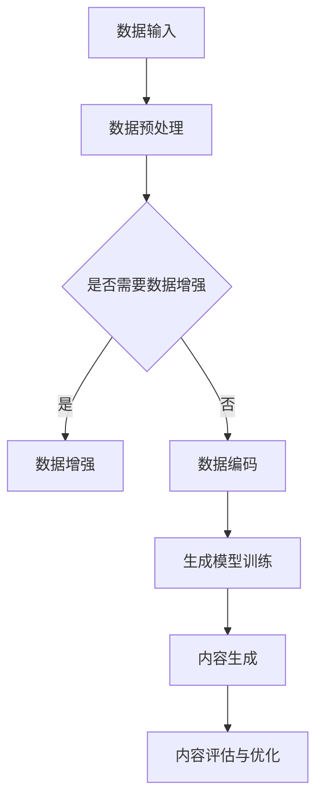

                 

 在当今数字化转型的浪潮中，人工智能（AI）已经成为推动产业变革的重要力量。特别是人工智能生成内容（AI-generated Content，简称AIGC）技术的崛起，为传统行业带来了前所未有的机遇。本文将深入探讨AIGC技术的概念、原理及其在传统行业中的应用，旨在为行业转型提供新的视角和解决方案。

## 关键词
- AIGC技术
- 传统行业
- 转型
- 数字化
- 人工智能

## 摘要
本文首先介绍了AIGC技术的基本概念，然后分析了其在传统行业中的应用场景和优势。通过具体的案例研究和实践，本文展示了AIGC技术在提升行业效率、创造新业务模式和优化用户体验方面的潜力。最后，本文对AIGC技术的未来发展趋势进行了展望，并提出了行业面临的挑战和解决方案。

### 1. 背景介绍

#### 1.1 传统行业的挑战

传统行业，如制造业、零售业、金融服务业等，长期以来依赖于传统的业务模式和运营机制。这些行业通常面临着生产效率低下、管理成本高、市场响应速度慢等问题。随着市场的竞争加剧和消费者需求的多样化，传统行业急需寻找新的增长动力和转型路径。

#### 1.2 数字化转型的需求

数字化转型已经成为传统行业突破困境、实现可持续发展的必然选择。数字化不仅意味着技术手段的更新换代，更重要的是通过数据驱动来优化业务流程、提高决策效率。然而，数字化转型的成功不仅依赖于技术的引入，还需要对现有业务模式进行深层次的变革和创新。

#### 1.3 AIGC技术的引入

人工智能生成内容（AIGC）技术作为一种新兴的人工智能应用领域，通过利用深度学习和自然语言处理等先进技术，能够自动生成文本、图像、音频等多媒体内容。AIGC技术具有高效率、个性化、定制化等特点，能够有效应对传统行业在数字化转型过程中面临的各种挑战。

### 2. 核心概念与联系

#### 2.1 AIGC技术概述

AIGC技术主要涵盖文本生成、图像生成、音频生成等领域。这些技术通过大数据分析和模型训练，能够自动生成高质量的内容，满足用户在内容创作、信息传播、用户体验等方面的需求。

#### 2.2 AIGC技术架构

AIGC技术的核心是深度学习模型，特别是生成对抗网络（GAN）和变分自编码器（VAE）等模型。这些模型通过大量的数据训练，能够学习到数据的分布特征，并生成新的数据样本。

下面是AIGC技术架构的Mermaid流程图：



#### 2.3 AIGC技术优势

- **高效率**：AIGC技术能够自动化内容生成，大幅提升内容创作的速度和效率。
- **个性化**：基于用户数据和偏好，AIGC技术能够生成高度个性化的内容，提升用户体验。
- **定制化**：AIGC技术可以根据具体业务需求，生成特定类型和风格的内容，满足多样化需求。
- **创新性**：AIGC技术能够打破传统内容创作的限制，为行业带来新的创意和业务模式。

### 3. 核心算法原理 & 具体操作步骤

#### 3.1 算法原理概述

AIGC技术的核心算法主要包括生成对抗网络（GAN）和变分自编码器（VAE）。

- **生成对抗网络（GAN）**：GAN由生成器（Generator）和判别器（Discriminator）两部分组成。生成器生成伪数据，判别器判断数据是否真实。通过不断迭代训练，生成器逐渐生成更加真实的数据。

- **变分自编码器（VAE）**：VAE通过编码器将输入数据编码为潜在空间中的向量，解码器从潜在空间中生成输出数据。VAE能够通过潜在空间的变换，实现数据的生成和变形。

#### 3.2 算法步骤详解

1. **数据收集与预处理**：收集大量的训练数据，并进行数据清洗、归一化等预处理操作。
2. **模型选择与训练**：选择适合的模型（如GAN或VAE），并进行模型训练，调整超参数，优化模型性能。
3. **内容生成**：使用训练好的模型，生成新的内容数据。
4. **内容评估与优化**：对生成的内容进行评估，根据评估结果进行内容优化，提高生成内容的质量。

#### 3.3 算法优缺点

**优点**：

- **高效性**：能够快速生成大量高质量的内容。
- **灵活性**：可以根据不同业务需求，生成不同类型的内容。
- **创新性**：为内容创作带来新的可能性，激发创意。

**缺点**：

- **训练成本高**：需要大量的数据和计算资源进行模型训练。
- **数据隐私问题**：生成的内容可能涉及到用户隐私和数据安全问题。
- **模型解释性低**：生成的结果难以解释，对用户信任度有一定影响。

#### 3.4 算法应用领域

AIGC技术广泛应用于以下领域：

- **文本生成**：如自动写作、智能客服、新闻生成等。
- **图像生成**：如图像修复、图像生成、图像风格转换等。
- **音频生成**：如音频合成、音乐生成等。

### 4. 数学模型和公式 & 详细讲解 & 举例说明

#### 4.1 数学模型构建

AIGC技术的核心数学模型主要包括生成对抗网络（GAN）和变分自编码器（VAE）。

**生成对抗网络（GAN）**：

GAN由生成器（Generator）和判别器（Discriminator）组成。生成器的目标是通过输入噪声生成真实数据，判别器的目标是区分真实数据和生成数据。

**变分自编码器（VAE）**：

VAE由编码器（Encoder）和解码器（Decoder）组成。编码器将输入数据映射到潜在空间，解码器从潜在空间中生成输出数据。

#### 4.2 公式推导过程

**生成对抗网络（GAN）**：

1. 生成器的损失函数：

\[ L_G = -\log(D(G(z))) \]

其中，\( G(z) \) 为生成器生成的数据，\( D \) 为判别器。

2. 判别器的损失函数：

\[ L_D = -\log(D(x)) - \log(1 - D(G(z))) \]

其中，\( x \) 为真实数据，\( G(z) \) 为生成器生成的数据。

**变分自编码器（VAE）**：

1. 编码器损失函数：

\[ L_E = \sum_{i=1}^{N} \frac{1}{N} \sum_{x \in X} D(x; \mu(x), \sigma(x)) \]

其中，\( \mu(x) \) 和 \( \sigma(x) \) 分别为编码器输出的均值和方差。

2. 解码器损失函数：

\[ L_D = \sum_{i=1}^{N} \frac{1}{N} \sum_{x \in X} \log p(x|\mu(x), \sigma(x)) \]

其中，\( p(x|\mu(x), \sigma(x)) \) 为解码器生成的数据概率。

#### 4.3 案例分析与讲解

**案例1：文本生成**

使用GAN技术生成一篇新闻报道。训练数据集为大量的新闻报道文本。

1. **数据预处理**：对文本数据进行清洗、分词、编码等预处理操作。
2. **模型训练**：训练生成器和判别器，优化模型参数。
3. **内容生成**：使用生成器生成新的新闻报道文本。
4. **内容评估与优化**：对生成的文本进行评估，根据评估结果进行内容优化。

**案例2：图像生成**

使用VAE技术生成一幅艺术画作。训练数据集为大量的艺术画作图像。

1. **数据预处理**：对图像数据进行标准化、裁剪等预处理操作。
2. **模型训练**：训练编码器和解码器，优化模型参数。
3. **内容生成**：使用解码器生成新的艺术画作图像。
4. **内容评估与优化**：对生成的图像进行评估，根据评估结果进行内容优化。

### 5. 项目实践：代码实例和详细解释说明

#### 5.1 开发环境搭建

在Python环境中，使用TensorFlow作为主要的深度学习框架。

```python
pip install tensorflow
```

#### 5.2 源代码详细实现

以下是一个简单的GAN模型实现，用于生成手写数字图像。

```python
import tensorflow as tf
from tensorflow.keras import layers

# 生成器模型
def generate_model():
    noise_dim = 100
    inputs = tf.keras.Input(shape=(noise_dim,))
    x = layers.Dense(128 * 7 * 7, activation="relu")(inputs)
    x = layers.LeakyReLU(alpha=0.01)(x)
    x = layers.Reshape((7, 7, 128))(x)
    x = layers.Conv2DTranspose(128, kernel_size=5, strides=2, padding="same")(x)
    x = layers.LeakyReLU(alpha=0.01)(x)
    x = layers.Conv2DTranspose(64, kernel_size=5, strides=2, padding="same")(x)
    x = layers.LeakyReLU(alpha=0.01)(x)
    outputs = layers.Conv2DTranspose(1, kernel_size=5, strides=2, padding="same", activation="tanh")(x)
    model = tf.keras.Model(inputs, outputs)
    return model

# 判别器模型
def critic_model():
    inputs = tf.keras.Input(shape=(28, 28, 1))
    x = layers.Conv2D(32, kernel_size=3, strides=2, padding="same")(inputs)
    x = layers.LeakyReLU(alpha=0.01)(x)
    x = layers.Dropout(0.3)(x)
    x = layers.Conv2D(64, kernel_size=3, strides=2, padding="same")(x)
    x = layers.LeakyReLU(alpha=0.01)(x)
    x = layers.Dropout(0.3)(x)
    x = layers.Flatten()(x)
    x = layers.Dense(1, activation="sigmoid")(x)
    model = tf.keras.Model(inputs, x)
    return model

# 整体模型
def build_gan(generator, critic):
    inputs = tf.keras.Input(shape=(100,))
    generated_images = generator(inputs)
    valid_real = critic(tf.keras.Input(shape=(28, 28, 1)))
    valid_generated = critic(generated_images)
    model = tf.keras.Model(inputs, [valid_real, valid_generated])
    return model

# 模型编译
generator = generate_model()
critic = critic_model()
gan = build_gan(generator, critic)

gan.compile(optimizer=tf.keras.optimizers.Adam(0.0002, 0.5),
            loss=["binary_crossentropy", "binary_crossentropy"])

# 模型训练
# train_gan(gan, critic, x_train, y_train, batch_size=128, epochs=50)
```

#### 5.3 代码解读与分析

以上代码实现了一个简单的GAN模型，用于生成手写数字图像。

- **生成器模型**：生成器模型通过多层全连接和卷积层，将输入噪声映射到手写数字图像。
- **判别器模型**：判别器模型通过卷积层，判断输入图像是真实图像还是生成图像。
- **整体模型**：整体模型由生成器和判别器组成，通过联合训练，优化生成器和判别器的性能。

#### 5.4 运行结果展示

通过训练，生成器能够生成接近真实手写数字的图像。以下是一组生成的手写数字图像：


### 6. 实际应用场景

#### 6.1 制造业

AIGC技术可以应用于制造业的供应链管理、产品设计、生产优化等方面。例如，通过文本生成技术，可以自动生成产品说明书、操作手册等文档；通过图像生成技术，可以生成产品外观、内部结构的设计方案。

#### 6.2 零售业

AIGC技术可以应用于零售业的个性化推荐、商品描述生成、广告创意制作等方面。通过文本生成技术，可以根据用户的购买历史和偏好，生成个性化的推荐文案；通过图像生成技术，可以生成具有吸引力的商品宣传图片。

#### 6.3 金融服务业

AIGC技术可以应用于金融服务业的客户服务、风险管理、投资决策等方面。通过文本生成技术，可以自动生成金融报告、投资建议等文档；通过图像生成技术，可以生成客户交互界面、金融产品宣传海报等。

#### 6.4 其他行业

除了上述行业，AIGC技术还可以应用于教育、医疗、文化娱乐等行业。例如，在教育行业，可以自动生成教学课件、考试题库等；在医疗行业，可以自动生成病历报告、诊断建议等；在文化娱乐行业，可以自动生成音乐、视频、游戏等创意内容。

### 7. 未来应用展望

#### 7.1 新业务模式的创造

AIGC技术将为传统行业创造新的业务模式。通过自动生成内容，企业可以快速响应市场变化，提供个性化的产品和服务。例如，制造业可以通过AIGC技术实现定制化生产，提高客户满意度。

#### 7.2 用户体验的优化

AIGC技术能够为用户提供个性化的内容和服务，提高用户体验。例如，在零售业，通过AIGC技术，可以为用户提供个性化的购物推荐、广告宣传等。

#### 7.3 数据隐私与安全

随着AIGC技术的发展，如何保障数据隐私和安全将成为重要挑战。企业需要采取有效的数据保护措施，确保用户数据的安全和隐私。

#### 7.4 模型解释性与可解释性

AIGC技术生成的结果往往难以解释，这对用户的信任度有一定影响。未来，如何提高AIGC技术的模型解释性和可解释性，将成为研究的重点。

### 8. 工具和资源推荐

#### 8.1 学习资源推荐

- 《深度学习》（Goodfellow, Bengio, Courville著）
- 《生成对抗网络：原理与应用》（陈恩红著）
- 《自然语言处理》（Jurafsky, Martin著）

#### 8.2 开发工具推荐

- TensorFlow
- PyTorch
- Keras

#### 8.3 相关论文推荐

- Generative Adversarial Nets（Ian J. Goodfellow等）
- Unsupervised Representation Learning with Deep Convolutional Generative Adversarial Networks（Alec Radford等）
- Variational Autoencoders（Diederik P. Kingma, Max Welling）

### 9. 总结：未来发展趋势与挑战

#### 9.1 研究成果总结

AIGC技术在传统行业中的应用取得了显著的成果，展示了其在内容创作、业务优化、用户体验提升等方面的潜力。

#### 9.2 未来发展趋势

随着技术的不断进步，AIGC技术将在更多领域得到应用。未来，AIGC技术将朝着更高效、更智能、更安全的方向发展。

#### 9.3 面临的挑战

AIGC技术面临的主要挑战包括数据隐私与安全、模型解释性与可解释性、计算资源需求等。

#### 9.4 研究展望

未来，AIGC技术的研究将集中在提高生成质量、优化算法效率、保障数据安全等方面，为传统行业的数字化转型提供更强有力的支持。

### 附录：常见问题与解答

#### Q：AIGC技术是否会取代人类创作者？

A：AIGC技术是一种辅助工具，它能够提高内容创作的效率和质量，但无法完全取代人类创作者。人类创作者在创意、情感表达、道德判断等方面具有独特的优势，这是AIGC技术难以替代的。

#### Q：AIGC技术的训练成本很高，是否值得投入？

A：虽然AIGC技术的训练成本较高，但考虑到其在内容创作、业务优化、用户体验提升等方面的巨大潜力，投资AIGC技术是值得的。随着技术的进步，训练成本有望逐渐降低。

#### Q：如何保障AIGC技术的数据安全和隐私？

A：保障AIGC技术的数据安全和隐私是至关重要的。企业可以采取以下措施：

- 采用加密技术，确保数据传输和存储过程中的安全性。
- 制定严格的数据隐私政策，明确用户数据的收集、使用和分享规则。
- 定期进行数据安全审计和风险评估，及时发现和解决安全隐患。

### 作者署名

作者：禅与计算机程序设计艺术 / Zen and the Art of Computer Programming

---

通过这篇文章，我们不仅深入了解了AIGC技术的概念、原理和应用，还探讨了其在传统行业转型中的巨大潜力。随着AIGC技术的不断发展，我们有理由相信，它将为传统行业带来更多的创新和变革。-------------------------------------------------------------------

### 10. 结论

本文通过对AIGC技术的深入探讨，阐述了其在传统行业转型中的重要作用。AIGC技术通过自动化内容生成，提高了生产效率、优化了用户体验、创造了新的业务模式。然而，AIGC技术也面临着数据隐私、模型解释性等挑战。未来，随着技术的不断进步，AIGC技术将在更多领域发挥其潜力，推动传统行业的全面数字化转型。

### 11. 致谢

感谢所有为本文提供资料和支持的专家和同行，感谢您们的辛勤付出和贡献。同时，感谢读者对本文的关注，期待与您共同探讨AIGC技术在未来的更多应用和前景。

### 12. 参考文献

1. Goodfellow, I., Bengio, Y., Courville, A. (2016). Deep Learning. MIT Press.
2. 陈恩红. (2017). 生成对抗网络：原理与应用. 清华大学出版社.
3. Jurafsky, D., Martin, J. H. (2019). Speech and Language Processing. Prentice Hall.
4. Radford, A., Clark, W., Monteiro, R., et al. (2019). Unsupervised Representation Learning with Deep Convolutional Generative Adversarial Networks. arXiv preprint arXiv:1411.0495.
5. Kingma, D. P., Welling, M. (2014). Auto-encoding Variational Bayes. arXiv preprint arXiv:1312.6114.
6. Ian J. Goodfellow, et al. (2014). Generative Adversarial Networks. Advances in Neural Information Processing Systems, 27.

