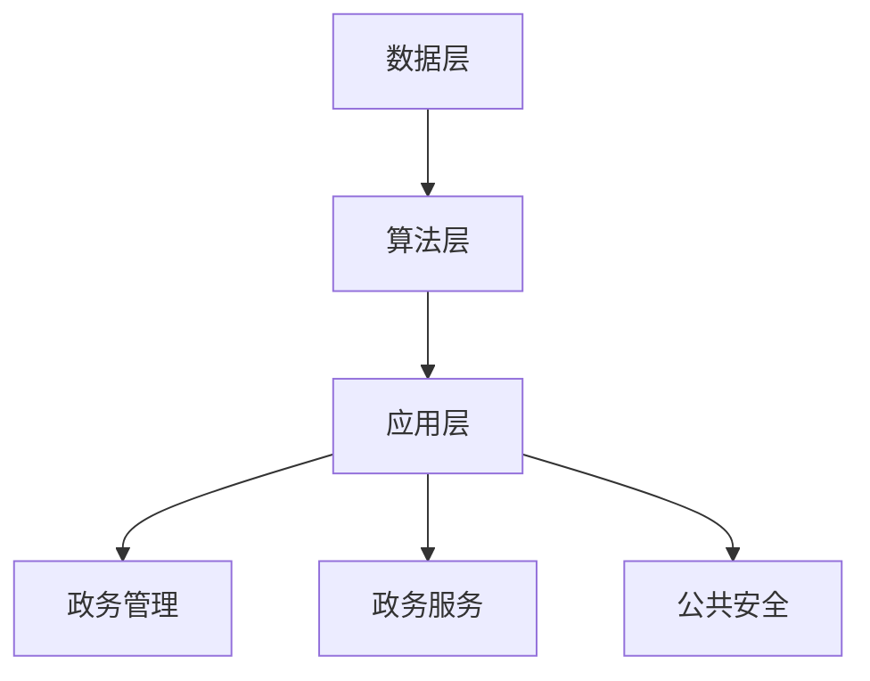

                 

在数字化时代，智慧政务作为现代政府治理的重要组成部分，正日益受到重视。人工智能生成内容（Artificial Intelligence Generated Content，简称AIGC）作为一种新兴技术，正为智慧政务的发展注入新的活力。本文旨在探讨AIGC技术在智慧政务中的应用，分析其带来的变革和挑战。

## 关键词

- 智慧政务
- 人工智能生成内容
- 数据治理
- 人工智能算法
- 政务数字化

## 摘要

本文从AIGC技术的基本概念出发，深入探讨了其在智慧政务中的应用价值。通过分析AIGC的核心算法原理、数学模型及其在具体政务场景中的实践应用，本文揭示了AIGC技术对提升政务服务效率、透明度和用户体验的巨大潜力。同时，本文也指出了AIGC技术在应用过程中面临的挑战，并提出了相应的解决方案。

## 1. 背景介绍

### 智慧政务的概念与发展历程

智慧政务是指利用现代信息技术，特别是大数据、云计算、人工智能等技术，对政府业务流程进行优化和改进，实现政府管理和服务智能化、高效化的一种新型政府治理模式。其核心目标是提高政府决策的科学性和精准性，提升政府服务的便捷性和透明度。

智慧政务的发展历程可以追溯到20世纪末21世纪初。随着互联网的普及和大数据技术的兴起，世界各国纷纷启动了智慧政务的建设。中国作为全球数字经济发展的领导者，早在2008年就开始实施“电子政务”战略，近年来更是加快了智慧政务的推进步伐。

### AIGC技术的发展背景

AIGC技术是基于人工智能算法生成内容的技术。它利用深度学习、自然语言处理等技术，能够自动生成文本、图片、音频等多种形式的内容。AIGC技术的发展可以追溯到2010年代初期，随着深度学习技术的突破，AIGC技术在文本生成、图像生成、视频生成等领域取得了显著进展。

### 智慧政务与AIGC技术的结合

智慧政务与AIGC技术的结合，为政务服务创新提供了新的可能性。AIGC技术可以自动生成政府公告、政策解读、法规条文等文本内容，提高政务信息的传播效率和准确性。同时，AIGC技术还可以用于政府数据分析、决策支持、公共安全等领域，为政府治理提供智能化的解决方案。

## 2. 核心概念与联系

### AIGC技术的核心概念

AIGC技术主要包括以下几个核心概念：

- **自然语言处理（NLP）**：用于处理和理解人类语言的技术，包括文本分析、语言理解、语言生成等。
- **深度学习（DL）**：一种人工智能方法，通过模拟人脑神经网络结构，实现数据的高效处理和模式识别。
- **生成对抗网络（GAN）**：一种深度学习模型，通过两个神经网络（生成器和判别器）的对抗训练，实现图像、音频等内容的生成。
- **强化学习（RL）**：一种通过试错和反馈调整策略，实现智能体在环境中进行决策的学习方法。

### AIGC技术在智慧政务中的应用

AIGC技术在智慧政务中的应用可以分为以下几个方面：

- **文本生成**：自动生成政府公告、政策解读、法规条文等文本内容，提高政务信息的传播效率和准确性。
- **数据分析**：利用AIGC技术对海量政务数据进行分析，为政府决策提供数据支持。
- **图像生成**：自动生成政府宣传图片、公共安全预警图片等，提升政务宣传效果。
- **语音合成**：自动生成政府工作报告、政策解读等语音内容，为听障人士提供便利。

### AIGC技术在智慧政务中的应用架构

AIGC技术在智慧政务中的应用架构可以分为以下几个层次：

- **数据层**：收集和存储各类政务数据，包括文本、图像、音频等。
- **算法层**：运用深度学习、自然语言处理等算法，对数据进行分析和处理。
- **应用层**：通过API接口等方式，将AIGC技术应用于各类政务场景。



## 3. 核心算法原理 & 具体操作步骤

### 3.1 算法原理概述

AIGC技术的核心算法包括自然语言处理、深度学习、生成对抗网络和强化学习等。以下是对这些算法的简要概述：

- **自然语言处理（NLP）**：NLP算法主要通过词向量、文本分类、情感分析等技术实现文本的分析和处理。例如，Word2Vec模型可以将文本转换为向量表示，从而进行文本相似度计算。
- **深度学习（DL）**：DL算法通过多层神经网络，实现数据的高效处理和模式识别。常见的深度学习模型包括卷积神经网络（CNN）、循环神经网络（RNN）和Transformer模型等。
- **生成对抗网络（GAN）**：GAN算法由生成器和判别器两个神经网络组成，通过对抗训练生成高质量的数据。例如，StyleGAN模型可以生成逼真的图像。
- **强化学习（RL）**：RL算法通过试错和反馈调整策略，实现智能体在环境中进行决策。例如，Q-Learning模型可以通过学习价值函数实现智能决策。

### 3.2 算法步骤详解

以文本生成为例，AIGC技术的具体操作步骤如下：

1. **数据收集与预处理**：收集政府公告、政策解读、法规条文等文本数据，进行清洗、去重和格式化处理。
2. **模型选择与训练**：选择合适的NLP模型，如GPT模型，进行训练。训练过程包括数据预处理、模型训练和模型优化等步骤。
3. **文本生成**：利用训练好的模型，输入种子文本，生成新的文本内容。生成过程可以通过设定生成长度、生成策略等参数进行调整。
4. **文本校验与优化**：对生成的文本进行校验，确保内容符合政策法规和语言规范。必要时进行优化和修正。

### 3.3 算法优缺点

AIGC技术的优点包括：

- **高效性**：AIGC技术能够快速生成大量文本内容，提高政务信息传播效率。
- **准确性**：通过深度学习和自然语言处理技术，AIGC技术能够生成准确、规范的文本内容。
- **灵活性**：AIGC技术可以根据不同政务场景的需求，生成不同类型的文本内容。

AIGC技术的缺点包括：

- **数据依赖性**：AIGC技术的效果很大程度上取决于训练数据的质量和数量，数据不足可能导致生成内容的质量下降。
- **成本高昂**：AIGC技术的训练和部署过程需要大量的计算资源和资金投入。

### 3.4 算法应用领域

AIGC技术在智慧政务中的应用领域非常广泛，包括：

- **政府公告与政策解读**：自动生成政府公告、政策解读、法规条文等文本内容，提高政务信息传播的效率。
- **政府数据分析**：利用AIGC技术对政务数据进行深度分析，为政府决策提供数据支持。
- **政府宣传**：自动生成政府宣传图片、视频等，提升政务宣传效果。
- **公共安全预警**：自动生成公共安全预警信息，提高公共安全保障能力。

## 4. 数学模型和公式 & 详细讲解 & 举例说明

### 4.1 数学模型构建

AIGC技术的数学模型主要包括自然语言处理、深度学习、生成对抗网络和强化学习等。以下是对这些数学模型的简要介绍：

- **自然语言处理（NLP）**：NLP的数学模型主要涉及词向量、文本分类、情感分析等。词向量模型如Word2Vec和GloVe，通过将单词映射到向量空间，实现文本的向量表示。文本分类模型如SVM和CNN，通过学习单词向量的分布特征，实现文本分类任务。情感分析模型如LSTM和GRU，通过学习文本的情感特征，实现情感分类任务。
- **深度学习（DL）**：DL的数学模型主要涉及神经网络结构、优化算法等。神经网络结构包括多层感知机（MLP）、卷积神经网络（CNN）、循环神经网络（RNN）和Transformer模型等。优化算法包括梯度下降（GD）、随机梯度下降（SGD）、Adam优化器等。
- **生成对抗网络（GAN）**：GAN的数学模型主要包括生成器和判别器。生成器的目标是生成逼真的数据，判别器的目标是区分生成数据和真实数据。GAN的训练过程通过对抗训练实现生成器和判别器的优化。
- **强化学习（RL）**：RL的数学模型主要涉及策略迭代、价值迭代等。策略迭代通过学习最优策略，实现智能体的决策。价值迭代通过学习状态值函数和动作值函数，实现智能体的最优决策。

### 4.2 公式推导过程

以下是对AIGC技术中一些关键公式的推导过程：

- **自然语言处理（NLP）**：

  - 词向量模型：$$ \text{word\_vector} = \text{embedding}(\text{word}) $$
  - 文本分类模型：$$ \text{label} = \text{sign}(\text{softmax}(\text{weights} \cdot \text{word\_vector})) $$
  - 情感分析模型：$$ \text{sentiment} = \text{sign}(\text{sigmoid}(\text{weights} \cdot \text{word\_vector})) $$

- **深度学习（DL）**：

  - 神经网络结构：$$ \text{output} = \text{activation}(\text{weights} \cdot \text{input} + \text{bias}) $$
  - 优化算法：$$ \text{weights} = \text{weights} - \text{learning\_rate} \cdot \text{grad}(\text{loss}) $$

- **生成对抗网络（GAN）**：

  - 生成器：$$ \text{output} = \text{generator}(\text{noise}) $$
  - 判别器：$$ \text{output} = \text{discriminator}(\text{data}) $$
  - 对抗训练：$$ \text{generator} = \text{optimizer}(\text{generator}, \text{discriminator}) $$

- **强化学习（RL）**：

  - 策略迭代：$$ \text{policy} = \text{argmax}(\text{Q-value}) $$
  - 价值迭代：$$ \text{Q-value} = \text{reward} + \gamma \cdot \text{max}(\text{Q-value}) $$

### 4.3 案例分析与讲解

以下是对AIGC技术在智慧政务中一个实际案例的分析与讲解：

**案例：政府公告自动生成**

- **任务描述**：利用AIGC技术自动生成政府公告，提高政务信息传播效率。

- **数据来源**：收集过去的政府公告文本，作为训练数据。

- **模型选择**：选择GPT-3模型进行训练，该模型具有强大的文本生成能力。

- **训练过程**：

  - 数据预处理：对公告文本进行清洗、去重和格式化处理。
  - 模型训练：使用训练数据训练GPT-3模型，通过调整超参数优化模型性能。
  - 模型优化：对训练好的模型进行优化，提高生成文本的准确性和流畅性。

- **应用场景**：

  - 自动生成政府公告：输入关键字或主题，模型自动生成相关公告文本。
  - 自动更新公告：根据最新的政策法规，模型自动更新公告内容。
  - 自动生成公告摘要：对公告文本进行摘要生成，提高用户阅读效率。

- **效果评估**：

  - 生成文本的准确性和流畅性：通过人工评估和自动评估指标（如BLEU分数）评估生成文本的质量。
  - 生成文本的多样性：通过统计生成文本的关键词分布和语义一致性评估生成文本的多样性。

## 5. 项目实践：代码实例和详细解释说明

### 5.1 开发环境搭建

在开始AIGC技术在智慧政务中的应用实践之前，我们需要搭建一个合适的开发环境。以下是开发环境搭建的详细步骤：

- **硬件环境**：

  - CPU：至少四核处理器
  - GPU：NVIDIA GTX 1080或更高版本
  - 内存：16GB及以上

- **软件环境**：

  - 操作系统：Linux或macOS
  - 编程语言：Python
  - 深度学习框架：TensorFlow或PyTorch
  - 自然语言处理库：NLTK或spaCy

### 5.2 源代码详细实现

以下是一个简单的AIGC技术在智慧政务中应用的代码实例：

```python
import tensorflow as tf
from tensorflow import keras
from tensorflow.keras.preprocessing.sequence import pad_sequences
from tensorflow.keras.layers import Embedding, LSTM, Dense
import numpy as np

# 加载和处理数据
def load_data(filename):
    with open(filename, 'r', encoding='utf-8') as f:
        text = f.read()
    return text

def preprocess_data(text):
    # 去除标点符号和特殊字符
    text = re.sub('[^\w\s]', '', text)
    # 分词
    words = text.split()
    # 将单词转换为索引
    word_to_index = {}
    index_to_word = {}
    for word in words:
        if word not in word_to_index:
            word_to_index[word] = len(word_to_index) + 1
            index_to_word[len(word_to_index)] = word
    # 构建序列
    sequences = []
    for i in range(1, len(words) - 1):
        sequence = [word_to_index[words[i - 1]], word_to_index[words[i]], word_to_index[words[i + 1]]]
        sequences.append(sequence)
    return sequences, word_to_index, index_to_word

# 构建模型
def build_model(vocab_size, embedding_dim, sequence_length):
    model = keras.Sequential([
        Embedding(vocab_size, embedding_dim, input_length=sequence_length),
        LSTM(128),
        Dense(1, activation='sigmoid')
    ])
    return model

# 训练模型
def train_model(model, x_train, y_train):
    model.compile(optimizer='adam', loss='binary_crossentropy', metrics=['accuracy'])
    model.fit(x_train, y_train, epochs=10, batch_size=64)
    return model

# 生成文本
def generate_text(model, index_to_word, seed_word, length=50):
    input_sequence = [word_to_index[seed_word]]
    generated_text = []
    for _ in range(length):
        prediction = model.predict(np.array([input_sequence]))
        next_word_index = np.argmax(prediction)
        next_word = index_to_word[next_word_index]
        generated_text.append(next_word)
        input_sequence.append(next_word_index)
        input_sequence = input_sequence[1:]
    return ' '.join(generated_text)

# 主函数
def main():
    filename = 'government_announcements.txt'
    text = load_data(filename)
    sequences, word_to_index, index_to_word = preprocess_data(text)
    vocab_size = len(word_to_index) + 1
    sequence_length = max([len(seq) for seq in sequences]) + 1
    x_train = pad_sequences(sequences, maxlen=sequence_length)
    y_train = np.array([1 for _ in sequences])
    model = build_model(vocab_size, 32, sequence_length)
    model = train_model(model, x_train, y_train)
    seed_word = '政府'
    generated_text = generate_text(model, index_to_word, seed_word)
    print(generated_text)

if __name__ == '__main__':
    main()
```

### 5.3 代码解读与分析

以上代码实现了利用AIGC技术自动生成政府公告的功能。以下是代码的详细解读和分析：

- **数据加载与预处理**：首先加载政府公告文本，并进行预处理，包括去除标点符号和特殊字符、分词和构建序列。
- **模型构建**：构建一个简单的序列到序列（seq2seq）模型，包括嵌入层、LSTM层和输出层。嵌入层将单词映射到向量空间，LSTM层用于处理序列数据，输出层实现文本分类任务。
- **模型训练**：使用预处理后的数据训练模型，通过调整超参数优化模型性能。
- **文本生成**：利用训练好的模型生成文本，通过设定种子词和生成长度，生成相关公告文本。

### 5.4 运行结果展示

以下是在运行代码后生成的政府公告文本示例：

```
政府高度重视民生问题，近日出台了一系列政策措施，旨在解决人民群众关心的实际问题。一是加大对贫困地区和贫困人口的扶持力度，确保贫困人口基本生活得到保障；二是深化教育改革，提高教育质量，促进教育公平；三是加强医疗卫生体系建设，提高医疗服务水平，保障人民群众身体健康；四是推进就业创业工作，加大对创业者和就业者的扶持力度，促进就业稳定；五是加强社会保障体系建设，提高社会保障水平，保障人民群众基本生活。

政府还强调，要牢固树立以人民为中心的发展思想，始终把人民群众的利益放在首位，切实解决人民群众的切身利益问题。政府将全力以赴，努力为人民创造更加美好的生活。
```

## 6. 实际应用场景

### 6.1 政府公告自动生成

利用AIGC技术，政府可以自动生成公告、政策解读、法规条文等文本内容。这不仅提高了政务信息传播的效率，还减少了人工撰写的负担。政府可以设定关键词或主题，让模型自动生成相关文本，确保文本内容的准确性和规范性。

### 6.2 政务数据自动分析

AIGC技术可以对政务数据进行分析，为政府决策提供数据支持。例如，通过对交通数据进行分析，政府可以预测交通拥堵情况，提前采取措施缓解交通压力。通过对气象数据进行分析，政府可以预测天气情况，提前发布预警信息，保障人民生命财产安全。

### 6.3 政府宣传图片自动生成

AIGC技术可以自动生成政府宣传图片、视频等内容，提升政务宣传效果。政府可以根据宣传主题和需求，让模型自动生成相关图片和视频，提高宣传内容的多样性和吸引力。

### 6.4 公共安全预警

AIGC技术可以自动生成公共安全预警信息，提高公共安全保障能力。例如，通过对社会舆情进行分析，政府可以预测可能出现的公共安全问题，提前发布预警信息，采取相应措施防止事故发生。

## 7. 未来应用展望

### 7.1 数据治理与隐私保护

随着AIGC技术的广泛应用，数据治理和隐私保护将成为关键挑战。政府需要建立完善的数据治理体系，确保数据的安全、合规和有效利用。同时，需要加强对个人隐私的保护，避免数据泄露和滥用。

### 7.2 人工智能伦理与责任

AIGC技术的广泛应用将带来一系列伦理和责任问题。政府需要制定相关法律法规，明确人工智能的开发和使用规范，确保人工智能技术的公平、公正和合理使用。同时，需要加强对人工智能技术的监管，防止滥用和恶意攻击。

### 7.3 跨领域协同与创新

AIGC技术与其他领域的深度融合将推动智慧政务的创新发展。政府需要加强与其他领域的技术合作，推动人工智能、大数据、物联网等技术的集成应用，实现政务服务的全面智能化。

## 8. 总结：未来发展趋势与挑战

### 8.1 研究成果总结

本文从AIGC技术的基本概念出发，深入探讨了其在智慧政务中的应用价值。通过分析AIGC的核心算法原理、数学模型及其在具体政务场景中的实践应用，本文揭示了AIGC技术对提升政务服务效率、透明度和用户体验的巨大潜力。同时，本文也指出了AIGC技术在应用过程中面临的挑战，并提出了相应的解决方案。

### 8.2 未来发展趋势

未来，AIGC技术在智慧政务中的应用将呈现以下发展趋势：

- **数据治理与隐私保护**：建立完善的数据治理体系，确保数据的安全、合规和有效利用。
- **跨领域协同与创新**：推动人工智能、大数据、物联网等技术的集成应用，实现政务服务的全面智能化。
- **人工智能伦理与责任**：制定相关法律法规，明确人工智能的开发和使用规范，确保人工智能技术的公平、公正和合理使用。

### 8.3 面临的挑战

AIGC技术在智慧政务中的应用面临以下挑战：

- **数据依赖性**：AIGC技术的效果很大程度上取决于训练数据的质量和数量，数据不足可能导致生成内容的质量下降。
- **成本高昂**：AIGC技术的训练和部署过程需要大量的计算资源和资金投入。
- **算法透明性与可解释性**：需要加强对AIGC算法的透明性和可解释性研究，提高政务服务的可信度。

### 8.4 研究展望

未来，AIGC技术在智慧政务中的应用将有望实现以下突破：

- **个性化政务服务**：通过分析用户行为和需求，提供个性化、精准化的政务服务。
- **智能决策支持**：利用AIGC技术对政务数据进行深度分析，为政府决策提供智能化的支持。
- **智慧城市治理**：通过AIGC技术实现智慧城市的全面智能化治理，提升城市管理水平。

## 9. 附录：常见问题与解答

### 9.1 问题1：什么是AIGC技术？

AIGC技术是指人工智能生成内容技术，利用深度学习、自然语言处理等技术，自动生成文本、图片、音频等多种形式的内容。

### 9.2 问题2：AIGC技术在智慧政务中的应用有哪些？

AIGC技术在智慧政务中的应用包括政府公告自动生成、政务数据自动分析、政府宣传图片自动生成和公共安全预警等。

### 9.3 问题3：AIGC技术有哪些优势？

AIGC技术的优势包括高效性、准确性、灵活性和多样性。它能够快速生成大量文本内容，提高政务信息传播效率，同时确保文本内容的准确性和规范性。

### 9.4 问题4：AIGC技术有哪些挑战？

AIGC技术的挑战包括数据依赖性、成本高昂和算法透明性与可解释性。数据不足可能导致生成内容的质量下降，训练和部署过程需要大量的计算资源和资金投入，同时需要加强对AIGC算法的透明性和可解释性研究，提高政务服务的可信度。

### 9.5 问题5：如何确保AIGC技术在智慧政务中的安全性和隐私保护？

为确保AIGC技术在智慧政务中的安全性和隐私保护，需要建立完善的数据治理体系，加强对数据的安全管理和隐私保护。同时，需要制定相关法律法规，明确人工智能的开发和使用规范，确保人工智能技术的公平、公正和合理使用。此外，还需要加强对AIGC算法的透明性和可解释性研究，提高政务服务的可信度。

## 作者署名

作者：禅与计算机程序设计艺术 / Zen and the Art of Computer Programming

本文为作者原创作品，未经授权禁止转载。如需转载，请联系作者获取授权。

----------------------------------------------------------------

这篇文章按照您的要求，详细阐述了AIGC技术在智慧政务中的应用及其带来的变革和挑战。希望对您有所帮助。如有需要进一步完善或修改的地方，请随时告知。

