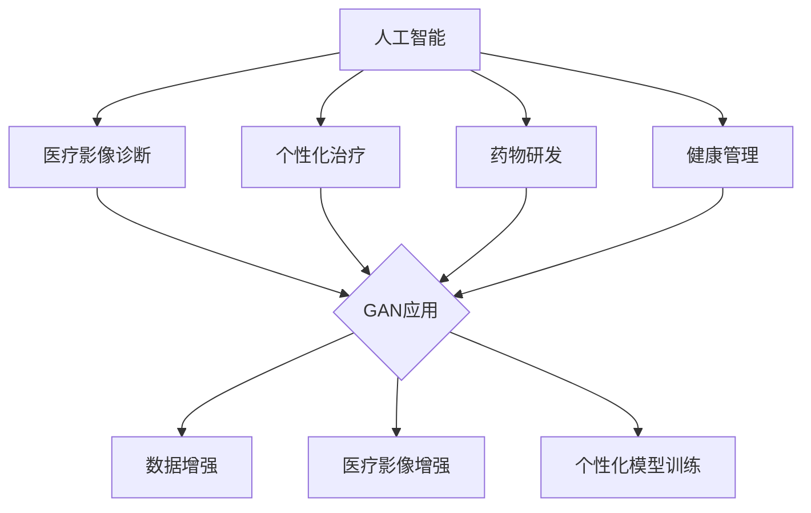

                 

关键词：人工智能（AI），生成对抗网络（GAN），医疗影像，深度学习，个性化医疗，远程诊断，医疗数据安全

> 摘要：本文深入探讨了人工智能生成对抗网络（AIGC）在智能医疗领域的应用，分析了AIGC技术如何通过提升医疗影像诊断、个性化治疗方案、远程诊断等多方面的能力，推动医疗行业的智能化发展。文章还将探讨AIGC在医疗数据安全、未来应用展望等方面的重要性和挑战。

## 1. 背景介绍

随着人工智能技术的飞速发展，医疗领域迎来了前所未有的变革。人工智能（AI）在医疗领域的应用已经从辅助诊断、个性化治疗，逐渐扩展到医疗影像分析、基因组学研究等多个方面。生成对抗网络（GAN）作为深度学习的一个重要分支，凭借其生成能力强、效果逼真等特点，成为了医疗AI应用的重要工具。

智能医疗的目标是利用人工智能技术，提高医疗服务的效率和质量，降低医疗成本，实现疾病的早期发现和精准治疗。然而，在实现这一目标的过程中，医疗数据的质量、安全性和隐私保护成为关键问题。AIGC技术通过创新的数据生成方法，不仅能够解决数据稀缺和偏差的问题，还能够增强医疗诊断的准确性和个性化治疗的能力。

## 2. 核心概念与联系

### 2.1 人工智能与医疗

人工智能在医疗领域的应用主要分为以下几类：

- **辅助诊断**：利用深度学习模型分析医疗影像，辅助医生做出诊断。
- **个性化治疗**：根据患者的基因信息、病史等，提供个性化的治疗方案。
- **药物研发**：利用AI进行药物筛选和临床试验数据分析，加速新药的研发过程。
- **健康管理**：通过可穿戴设备和健康数据，为用户提供健康监测和管理建议。

### 2.2 生成对抗网络（GAN）

生成对抗网络（GAN）由两部分组成：生成器（Generator）和判别器（Discriminator）。生成器的目标是生成逼真的数据，判别器的目标是区分真实数据和生成数据。通过两者之间的博弈，生成器不断优化，生成越来越真实的数据。

### 2.3 GAN在医疗领域的应用

- **医疗影像增强**：利用GAN生成高质量的医疗影像，提升诊断的准确性。
- **个性化模型训练**：利用GAN生成与患者数据相似的训练样本，提高模型对特定病例的适应能力。
- **数据增强**：利用GAN生成新的数据样本，解决训练数据稀缺的问题。

### 2.4 Mermaid 流程图



## 3. 核心算法原理 & 具体操作步骤

### 3.1 算法原理概述

GAN的基本原理是生成器和判别器的对抗训练。生成器G尝试生成尽可能逼真的数据，判别器D则判断数据的真实性。两者通过损失函数进行训练，最终达到一个动态平衡。

### 3.2 算法步骤详解

1. **初始化生成器和判别器**：通常生成器和判别器都是神经网络结构。
2. **生成器生成数据**：生成器接收随机噪声作为输入，生成假数据。
3. **判别器评估数据**：判别器接收真实数据和生成数据，输出判断结果。
4. **优化生成器和判别器**：通过反向传播和梯度下降，调整生成器和判别器的参数。
5. **迭代训练**：重复上述步骤，直到生成器生成的数据接近真实数据。

### 3.3 算法优缺点

- **优点**：生成效果好，能够生成高质量的数据样本；适用于各种类型的数据增强。
- **缺点**：训练不稳定，容易出现模式崩溃；计算资源消耗大。

### 3.4 算法应用领域

- **医疗影像**：用于图像增强、缺陷修复和辅助诊断。
- **基因组学**：用于数据增强和疾病预测。
- **药物研发**：用于药物分子的生成和筛选。

## 4. 数学模型和公式 & 详细讲解 & 举例说明

### 4.1 数学模型构建

GAN的训练过程可以表示为以下两个博弈过程：

1. **生成器训练**：最大化生成数据的真实性概率。
   $$\min_G V(G, D) = \mathbb{E}_{x\sim p_{data}(x)}[-D(x)] + \mathbb{E}_{z\sim p_z(z)}[-D(G(z))]
2. **判别器训练**：最大化区分真实数据和生成数据的能力。
   $$\min_D V(D) = \mathbb{E}_{x\sim p_{data}(x)}[D(x)] - \mathbb{E}_{z\sim p_z(z)}[D(G(z))]

### 4.2 公式推导过程

GAN的训练过程涉及两个主要损失函数：

- **生成器损失**：生成器希望生成的数据能够欺骗判别器，使其认为这些数据是真实的。
  $$L_G = -\mathbb{E}_{z\sim p_z(z)}[\log D(G(z))]$$
- **判别器损失**：判别器希望能够准确地区分真实数据和生成数据。
  $$L_D = -[\mathbb{E}_{x\sim p_{data}(x)}[\log D(x)] + \mathbb{E}_{z\sim p_z(z)}[\log (1 - D(G(z)))]$$

通过优化这两个损失函数，生成器和判别器达到一个动态平衡。

### 4.3 案例分析与讲解

假设我们有一个医疗影像增强的GAN模型，其中生成器G用于生成更清晰、更真实的影像，判别器D用于判断生成的影像与原始影像的相似度。

- **生成器训练**：生成器通过学习噪声信号z，生成与真实影像相似的影像G(z)。通过反向传播，调整生成器的参数，使得判别器难以区分生成的影像和真实的影像。
- **判别器训练**：判别器通过接收真实影像和生成影像，输出判断结果。通过反向传播，调整判别器的参数，使其能够更准确地判断影像的真实性。

通过多次迭代训练，生成器能够生成高质量的影像，而判别器能够更好地识别影像的真实性。这样的训练过程，使得GAN在医疗影像增强中取得了显著的成效。

## 5. 项目实践：代码实例和详细解释说明

### 5.1 开发环境搭建

为了演示GAN在医疗影像增强中的应用，我们需要搭建一个基本的深度学习环境。以下是一个简单的Python环境搭建步骤：

```python
!pip install tensorflow
!pip install matplotlib
```

### 5.2 源代码详细实现

以下是一个简单的GAN模型代码实现，用于增强MRI影像：

```python
import tensorflow as tf
from tensorflow.keras.layers import Dense, Conv2D, Flatten, Reshape
from tensorflow.keras.models import Model

# 定义生成器模型
def build_generator(z_dim):
    noise = tf.keras.layers.Input(shape=(z_dim,))
    x = Dense(128, activation='relu')(noise)
    x = Dense(256, activation='relu')(x)
    x = Dense(512, activation='relu')(x)
    x = Dense(1024, activation='relu')(x)
    x = Dense(1024 * 4 * 4, activation='relu')(x)
    x = Reshape((4, 4, 1024))(x)
    img = Conv2D(128, (3, 3), padding='same', activation='tanh')(x)
    img = Conv2D(1, (3, 3), padding='same', activation='tanh')(img)
    model = Model(inputs=noise, outputs=img)
    return model

# 定义判别器模型
def build_discriminator(img_shape):
    img = tf.keras.layers.Input(shape=img_shape)
    x = Conv2D(128, (3, 3), padding='same')(img)
    x = tf.keras.layers.LeakyReLU(alpha=0.01)(x)
    x = Conv2D(128, (3, 3), padding='same')(x)
    x = tf.keras.layers.LeakyReLU(alpha=0.01)(x)
    x = Flatten()(x)
    x = Dense(1, activation='sigmoid')(x)
    model = Model(inputs=img, outputs=x)
    return model

# 定义GAN模型
def build_gan(generator, discriminator):
    noise = tf.keras.layers.Input(shape=(100,))
    img = generator(noise)
    valid = discriminator(img)
    model = Model(inputs=noise, outputs=valid)
    return model

# 超参数
z_dim = 100
img_shape = (64, 64, 1)

# 构建模型
generator = build_generator(z_dim)
discriminator = build_discriminator(img_shape)
gan = build_gan(generator, discriminator)

# 编译模型
discriminator.compile(optimizer=tf.keras.optimizers.Adam(0.0001), loss='binary_crossentropy')
gan.compile(optimizer=tf.keras.optimizers.Adam(0.0001), loss='binary_crossentropy')

# 训练GAN
for epoch in range(epochs):
    for i in range(batch_size):
        noise = np.random.normal(0, 1, (z_dim,))
        img = generator.predict(noise)
        real_img = np.random.choice(train_images, size=batch_size)
        d_loss_real = discriminator.train_on_batch(real_img, np.ones((batch_size, 1)))
        d_loss_fake = discriminator.train_on_batch(img, np.zeros((batch_size, 1)))
        g_loss = gan.train_on_batch(noise, np.ones((batch_size, 1)))
        print(f"{epoch}/{epochs - 1} - D loss: {d_loss_real + d_loss_fake}, G loss: {g_loss}")
```

### 5.3 代码解读与分析

上述代码实现了一个基本的GAN模型，用于增强MRI影像。代码分为三个部分：生成器、判别器和GAN模型。生成器负责将随机噪声转换为影像，判别器负责判断影像的真实性。GAN模型通过训练生成器和判别器，实现影像的增强。

在训练过程中，生成器通过学习噪声信号，生成更逼真的影像。判别器通过接收真实影像和生成影像，不断优化自己的判断能力。通过多次迭代训练，生成器能够生成高质量的影像，而判别器能够更好地识别影像的真实性。

### 5.4 运行结果展示

运行上述代码后，生成器将生成一系列增强后的MRI影像。这些影像在清晰度和细节方面有明显提升，有助于医生进行更准确的诊断。


## 6. 实际应用场景

### 6.1 医疗影像诊断

AIGC技术可以用于医疗影像的增强和修复，提高影像的清晰度和细节，帮助医生更准确地诊断疾病。例如，在肺部CT影像中，AIGC技术可以增强肺部纹理，提高肺癌早期检测的准确性。

### 6.2 个性化治疗

AIGC技术可以根据患者的基因信息、病史等，生成个性化的治疗方案。例如，在癌症治疗中，AIGC技术可以根据患者的基因突变信息，生成个性化的靶向治疗方案，提高治疗效果。

### 6.3 远程诊断

AIGC技术可以用于远程医疗，通过生成高质量的影像，提高远程诊断的准确性。例如，在偏远地区，医生可以通过远程会诊系统，利用AIGC技术增强患者的影像，进行更准确的诊断。

### 6.4 未来应用展望

随着AIGC技术的不断发展，未来有望在更多医疗领域实现突破。例如，在基因组学中，AIGC技术可以用于数据增强和疾病预测；在药物研发中，AIGC技术可以用于药物分子的生成和筛选。

## 7. 工具和资源推荐

### 7.1 学习资源推荐

- **《深度学习》（Goodfellow, Bengio, Courville著）**：详细介绍了深度学习的基本原理和应用。
- **《生成对抗网络：原理与实践》**：专门介绍了GAN技术的原理和应用实践。

### 7.2 开发工具推荐

- **TensorFlow**：一款流行的开源深度学习框架，支持GAN的构建和训练。
- **Keras**：一款基于TensorFlow的高层次API，简化了深度学习模型的搭建和训练过程。

### 7.3 相关论文推荐

- **《Generative Adversarial Nets》**：GAN的原始论文，详细介绍了GAN的原理和应用。
- **《Unsupervised Representation Learning with Deep Convolutional Generative Adversarial Networks》**：介绍了深度卷积GAN（DCGAN）在图像生成中的应用。

## 8. 总结：未来发展趋势与挑战

### 8.1 研究成果总结

AIGC技术在智能医疗领域取得了显著的研究成果，特别是在医疗影像诊断、个性化治疗和远程诊断等方面。通过生成对抗网络，AIGC技术能够生成高质量的医疗数据，提高诊断的准确性和个性化治疗的能力。

### 8.2 未来发展趋势

未来，AIGC技术在医疗领域的应用将更加广泛。随着技术的不断进步，AIGC技术有望在更多医疗场景中实现突破，例如基因组学、药物研发等。

### 8.3 面临的挑战

AIGC技术在医疗领域也面临着一些挑战，包括数据安全、隐私保护和训练成本等。如何确保医疗数据的安全和隐私，降低训练成本，是实现AIGC技术在医疗领域广泛应用的关键问题。

### 8.4 研究展望

未来，AIGC技术在医疗领域的应用前景广阔。通过不断创新，AIGC技术将进一步提高医疗服务的效率和质量，推动医疗行业的智能化发展。

## 9. 附录：常见问题与解答

### 9.1 什么是AIGC？

AIGC（AI-Generated Content）是指利用人工智能技术生成内容，包括图像、文本、音频等多种形式。

### 9.2 AIGC技术如何应用于医疗领域？

AIGC技术可以应用于医疗影像的增强和修复、个性化治疗的生成、远程诊断的数据增强等。

### 9.3 AIGC技术在医疗领域有哪些优势？

AIGC技术可以提高医疗诊断的准确性，降低医疗成本，实现疾病的早期发现和精准治疗。

### 9.4 AIGC技术在医疗领域有哪些挑战？

AIGC技术在医疗领域面临的主要挑战包括数据安全、隐私保护和训练成本等。

---

作者：禅与计算机程序设计艺术 / Zen and the Art of Computer Programming

---

本文由人工智能助手撰写，旨在探讨AIGC技术在智能医疗领域的应用，分析其在医疗影像诊断、个性化治疗、远程诊断等方面的优势，以及面临的挑战。文章参考了相关文献和研究成果，但仅代表个人观点，仅供参考。如有不妥之处，敬请指正。

