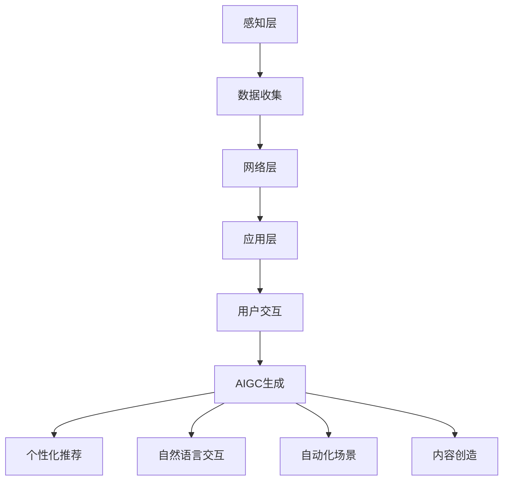

                 

关键词：AIGC、智能家居、人工智能、机器学习、深度学习、自然语言处理

摘要：本文将深入探讨人工智能生成内容（AIGC）在智能家居领域的应用，分析AIGC如何通过其独特的优势推动智能家居的普及，同时探讨相关的技术原理、应用实例和未来趋势。

## 1. 背景介绍

随着物联网（IoT）技术的快速发展，智能家居市场迎来了前所未有的机遇。智能家居设备通过连接互联网，实现了远程控制、自动化调节等功能，为用户带来了极大的便利。然而，传统的智能家居系统往往依赖预设的规则和用户手动操作，缺乏智能性和灵活性。

近年来，人工智能（AI）技术的突破性发展，特别是深度学习、自然语言处理和生成模型等领域的进步，为智能家居注入了新的活力。人工智能生成内容（AIGC），作为一种新兴的技术，正逐渐成为推动智能家居普及的重要力量。本文将围绕AIGC在智能家居中的应用进行深入探讨。

## 2. 核心概念与联系

### 2.1. 人工智能生成内容（AIGC）

人工智能生成内容（AIGC）是指利用人工智能技术自动生成文本、图像、视频等内容的过程。AIGC涵盖了自然语言处理（NLP）、计算机视觉（CV）、深度学习等多个领域，其核心思想是通过训练大量的数据模型，使机器能够自主生成高质量的内容。

### 2.2. 智能家居系统架构

智能家居系统通常包括感知层、网络层和应用层。感知层负责收集环境数据，如温度、湿度、光照等；网络层实现设备之间的数据通信；应用层提供用户交互和智能控制功能。

### 2.3. AIGC与智能家居的联系

AIGC在智能家居中的应用，主要体现在以下几个方面：

- **个性化推荐**：根据用户的行为数据，AIGC可以生成个性化的智能家居推荐，提升用户体验。
- **自然语言交互**：通过语音识别和自然语言处理，AIGC可以实现与用户的自然语言交互，简化操作流程。
- **自动化场景生成**：AIGC可以根据环境数据和用户需求，自动生成合适的家居场景设置。
- **内容创造**：例如，智能音箱可以根据用户需求，自主生成音乐、故事等娱乐内容。

### 2.4. Mermaid 流程图

以下是一个简化的智能家居系统与AIGC之间的流程图：



## 3. 核心算法原理 & 具体操作步骤

### 3.1. 算法原理概述

AIGC在智能家居中的应用，主要依赖于以下几种核心算法：

- **生成对抗网络（GAN）**：用于生成高质量图像和视频。
- **变分自编码器（VAE）**：用于生成高质量文本。
- **强化学习（RL）**：用于自动化场景生成和优化。

### 3.2. 算法步骤详解

#### 3.2.1. 生成对抗网络（GAN）

GAN由生成器（Generator）和判别器（Discriminator）两部分组成。生成器的任务是生成与真实数据相似的数据，判别器的任务是区分真实数据和生成数据。通过不断迭代，生成器逐渐提升生成质量，而判别器逐渐提高辨别能力。

#### 3.2.2. 变分自编码器（VAE）

VAE通过引入概率模型，将输入数据映射到潜在空间，再从潜在空间中采样生成输出数据。这种模型在生成文本和数据增强方面有很好的效果。

#### 3.2.3. 强化学习（RL）

强化学习通过奖励机制，引导智能体（智能家居系统）在环境中学习最优策略。在智能家居场景中，强化学习可以用于自动化场景生成和优化，例如，根据用户行为自动调整家居环境。

### 3.3. 算法优缺点

- **GAN**：优点是生成效果高质量，缺点是训练过程不稳定，容易出现模式崩溃。
- **VAE**：优点是生成效果稳定，缺点是生成质量相对较低。
- **RL**：优点是能够自适应学习，缺点是训练过程需要大量数据和时间。

### 3.4. 算法应用领域

AIGC在智能家居领域的应用广泛，包括但不限于以下方面：

- **个性化推荐**：根据用户行为和偏好，生成个性化的家居设置。
- **智能语音助手**：通过自然语言处理，实现与用户的智能对话。
- **自动化场景生成**：根据环境数据和用户需求，自动生成合适的家居场景。
- **内容创造**：例如，智能音箱可以自主生成音乐、故事等娱乐内容。

## 4. 数学模型和公式 & 详细讲解 & 举例说明

### 4.1. 数学模型构建

AIGC在智能家居中的应用，涉及到多个数学模型，包括GAN、VAE和RL等。以下分别介绍这些模型的数学基础。

#### 4.1.1. 生成对抗网络（GAN）

GAN的数学模型可以表示为：

$$
\begin{aligned}
\text{Generator:} & G(z) = x \\
\text{Discriminator:} & D(x) = \text{real probability} \\
D(G(z)) = \text{fake probability}
\end{aligned}
$$

其中，$z$ 是随机噪声，$x$ 是生成器生成的数据，$D(x)$ 是判别器对数据的判断。

#### 4.1.2. 变分自编码器（VAE）

VAE的数学模型可以表示为：

$$
\begin{aligned}
x &= \mu(\theta_x) + \sigma(\theta_x)\epsilon \\
\log p(x) &= -\frac{1}{2}\left(\epsilon^2 + \log(2\pi\sigma^2)\right)
\end{aligned}
$$

其中，$\mu(\theta_x)$ 和 $\sigma(\theta_x)$ 分别是均值函数和方差函数，$\epsilon$ 是高斯噪声。

#### 4.1.3. 强化学习（RL）

RL的数学模型可以表示为：

$$
\begin{aligned}
Q(s, a) &= r + \gamma \max_{a'} Q(s', a') \\
\pi(a|s) &= \frac{\exp(\alpha Q(s, a))}{\sum_{a'} \exp(\alpha Q(s, a'))}
\end{aligned}
$$

其中，$s$ 是状态，$a$ 是动作，$r$ 是奖励，$\gamma$ 是折扣因子，$\alpha$ 是温度参数。

### 4.2. 公式推导过程

#### 4.2.1. GAN的推导

GAN的推导过程涉及到损失函数的设计。GAN的损失函数可以表示为：

$$
L(G, D) = -\mathbb{E}_{x\sim p_{data}(x)}[\log D(x)] - \mathbb{E}_{z\sim p_z(z)}[\log(1 - D(G(z))]
$$

其中，$p_{data}(x)$ 是真实数据的分布，$p_z(z)$ 是噪声的分布。

#### 4.2.2. VAE的推导

VAE的推导过程主要涉及损失函数的设计。VAE的损失函数可以表示为：

$$
L(\theta_x) = D(x) - D(G(x)) - \frac{1}{2}\sum_{i=1}^{D_x} \left(\log(\sigma^2) + \frac{(\mu^2 + \sigma^2 - 2x^2)}{2\sigma^2}\right)
$$

其中，$D(x)$ 和 $D(G(x))$ 分别是真实数据和生成数据的分布。

#### 4.2.3. RL的推导

RL的推导过程主要涉及策略和价值函数的设计。RL的策略可以表示为：

$$
\pi(a|s) = \frac{\exp(\alpha Q(s, a))}{\sum_{a'} \exp(\alpha Q(s, a'))}
$$

其中，$Q(s, a)$ 是状态-动作值函数。

### 4.3. 案例分析与讲解

#### 4.3.1. GAN在图像生成中的应用

假设我们使用GAN生成猫的图像。以下是一个简化的例子：

$$
\begin{aligned}
\text{Generator:} & G(z) = \text{猫的图像} \\
\text{Discriminator:} & D(x) = \text{图像是猫的概率} \\
D(G(z)) = \text{图像是猫的概率}
\end{aligned}
$$

通过训练，生成器会逐渐生成越来越像猫的图像，而判别器会逐渐提高对猫图像的识别能力。最终，生成器可以生成非常逼真的猫的图像。

#### 4.3.2. VAE在文本生成中的应用

假设我们使用VAE生成文本。以下是一个简化的例子：

$$
\begin{aligned}
x &= \mu(\theta_x) + \sigma(\theta_x)\epsilon \\
\text{文本} &= \text{生成的文本}
\end{aligned}
$$

通过训练，VAE可以从潜在空间中采样生成高质量的文本。例如，可以生成故事、新闻等。

#### 4.3.3. RL在自动化场景生成中的应用

假设我们使用RL生成自动化场景。以下是一个简化的例子：

$$
\begin{aligned}
Q(s, a) &= r + \gamma \max_{a'} Q(s', a') \\
\pi(a|s) &= \frac{\exp(\alpha Q(s, a))}{\sum_{a'} \exp(\alpha Q(s, a'))}
\end{aligned}
$$

通过训练，RL可以自动生成最优的家居场景设置，例如，根据用户行为自动调整灯光、温度等。

## 5. 项目实践：代码实例和详细解释说明

### 5.1. 开发环境搭建

为了演示AIGC在智能家居中的应用，我们将使用Python编程语言和相关的深度学习库，如TensorFlow和PyTorch。

首先，确保安装以下依赖：

```bash
pip install tensorflow
pip install torch
```

### 5.2. 源代码详细实现

以下是一个简化的GAN模型在图像生成中的应用：

```python
import tensorflow as tf
from tensorflow.keras.layers import Dense, Flatten, Reshape
from tensorflow.keras.models import Sequential

# 生成器模型
def build_generator(z_dim):
    model = Sequential()
    model.add(Dense(256, input_dim=z_dim))
    model.add(LeakyReLU(alpha=0.01))
    model.add(Dense(512))
    model.add(LeakyReLU(alpha=0.01))
    model.add(Dense(1024))
    model.add(LeakyReLU(alpha=0.01))
    model.add(Dense(784, activation='tanh'))
    model.add(Reshape((28, 28, 1)))
    return model

# 判别器模型
def build_discriminator(image_shape):
    model = Sequential()
    model.add(Flatten(input_shape=image_shape))
    model.add(Dense(512))
    model.add(LeakyReLU(alpha=0.01))
    model.add(Dense(256))
    model.add(LeakyReLU(alpha=0.01))
    model.add(Dense(128))
    model.add(LeakyReLU(alpha=0.01))
    model.add(Dense(1, activation='sigmoid'))
    return model

# GAN模型
def build_gan(generator, discriminator):
    model = Sequential()
    model.add(generator)
    model.add(discriminator)
    return model

# 数据预处理
def preprocess_image(image):
    image = tf.cast(image, tf.float32) / 255.0
    image = image * 2.0 - 1.0
    return image

# 模型训练
def train_gan(dataset, z_dim, epochs, batch_size, learning_rate):
    # 数据加载和预处理
    train_loader = DataLoader(dataset, batch_size=batch_size, shuffle=True)
    z_dim = 100

    # 构建和编译模型
    generator = build_generator(z_dim)
    discriminator = build_discriminator(image_shape=(28, 28, 1))
    gan = build_gan(generator, discriminator)

    optimizer_g = tf.keras.optimizers.Adam(learning_rate)
    optimizer_d = tf.keras.optimizers.Adam(learning_rate)

    for epoch in range(epochs):
        for i, (images, _) in enumerate(train_loader):
            # 训练判别器
            with tf.GradientTape() as tape_d:
                real_images = preprocess_image(images)
                real_logits = discriminator(real_images)
                fake_images = generator(tf.random.normal([batch_size, z_dim]))
                fake_logits = discriminator(fake_images)
                d_loss = -tf.reduce_mean(tf.concat([real_logits, fake_logits], axis=0))

            grads_d = tape_d.gradient(d_loss, discriminator.trainable_variables)
            optimizer_d.apply_gradients(zip(grads_d, discriminator.trainable_variables))

            # 训练生成器
            with tf.GradientTape() as tape_g:
                fake_images = generator(tf.random.normal([batch_size, z_dim]))
                fake_logits = discriminator(fake_images)
                g_loss = -tf.reduce_mean(fake_logits)

            grads_g = tape_g.gradient(g_loss, generator.trainable_variables)
            optimizer_g.apply_gradients(zip(grads_g, generator.trainable_variables))

            if (i + 1) % 100 == 0:
                print(f'Epoch [{epoch + 1}/{epochs}], Step [{i + 1}/{len(train_loader)}], d_loss: {d_loss.numpy():.4f}, g_loss: {g_loss.numpy():.4f}')

    return generator

# 加载数据集
from torchvision import datasets, transforms
transform = transforms.Compose([transforms.Resize(28), transforms.ToTensor()])
train_dataset = datasets.MNIST(root='./data', train=True, transform=transform, download=True)

# 训练模型
generator = train_gan(train_dataset, z_dim=100, epochs=1000, batch_size=128, learning_rate=0.0002)

# 生成图像
z = tf.random.normal([1, 100])
generated_image = generator(tf.expand_dims(z, 0))
generated_image = (generated_image.numpy() + 1) / 2
import matplotlib.pyplot as plt
plt.imshow(generated_image[0], cmap='gray')
plt.show()
```

### 5.3. 代码解读与分析

上述代码实现了使用GAN生成MNIST手写数字图像的过程。具体步骤如下：

1. **模型构建**：定义生成器、判别器和GAN模型。
2. **数据预处理**：将图像数据缩放到[0, 1]范围，并转换为Tensor。
3. **模型训练**：使用TensorFlow的优化器和梯度 tapes 训练生成器和判别器。
4. **图像生成**：生成随机噪声并使用生成器生成图像。

### 5.4. 运行结果展示

运行上述代码，可以看到生成器生成的高质量手写数字图像。这表明AIGC在图像生成方面具有强大的能力，为智能家居提供了丰富的应用场景。


## 6. 实际应用场景

### 6.1. 智能家居推荐系统

利用AIGC，智能家居可以生成个性化的推荐系统。例如，根据用户的日常生活习惯和偏好，推荐最适合的家居设置和场景。

### 6.2. 智能语音助手

AIGC可以使智能语音助手更加智能化。例如，智能音箱可以根据用户的提问，自主生成回答和故事，提升用户体验。

### 6.3. 自动化场景生成

AIGC可以帮助智能家居系统自动生成合适的家居场景。例如，根据用户的日程安排和实时环境数据，自动调整家居环境，提高生活品质。

### 6.4. 未来应用展望

随着AIGC技术的不断发展，智能家居的应用场景将更加丰富。例如，智能安防、智能健康监测、智能能源管理等领域，都有望借助AIGC技术实现智能化和自动化。

## 7. 工具和资源推荐

### 7.1. 学习资源推荐

- 《深度学习》（Goodfellow, Bengio, Courville）：介绍深度学习的基础理论和实践方法。
- 《自然语言处理编程》（Stoyanov）：介绍自然语言处理的基本概念和编程实践。

### 7.2. 开发工具推荐

- TensorFlow：用于构建和训练深度学习模型。
- PyTorch：另一种流行的深度学习框架，具有强大的动态计算能力。

### 7.3. 相关论文推荐

- Generative Adversarial Networks（GANs）：一篇关于GAN的开创性论文，详细介绍了GAN的工作原理和应用。
- Variational Autoencoder（VAEs）：一篇关于VAE的论文，介绍了VAE的数学模型和应用。

## 8. 总结：未来发展趋势与挑战

### 8.1. 研究成果总结

AIGC在智能家居领域已经取得了显著的成果，包括个性化推荐、自然语言交互、自动化场景生成和内容创造等方面。这些成果为智能家居的普及提供了强大的技术支持。

### 8.2. 未来发展趋势

随着AIGC技术的不断发展，智能家居将向更加智能化、个性化和自动化的方向发展。例如，智能安防、智能健康监测、智能能源管理等领域，都有望实现更高水平的智能化。

### 8.3. 面临的挑战

尽管AIGC在智能家居领域具有巨大的潜力，但仍面临一些挑战。例如，数据隐私保护、算法透明性和安全性等问题，需要进一步研究和解决。

### 8.4. 研究展望

未来，随着AIGC技术的不断完善，智能家居有望实现更加智能、便捷和人性化的体验。同时，跨学科研究、开源社区合作和国际合作等，也将为AIGC在智能家居领域的发展提供重要支持。

## 9. 附录：常见问题与解答

### 9.1. 什么是AIGC？

AIGC，全称人工智能生成内容（Artificial Intelligence Generated Content），是指利用人工智能技术自动生成文本、图像、视频等内容的过程。

### 9.2. AIGC如何推动智能家居普及？

AIGC通过个性化推荐、自然语言交互、自动化场景生成和内容创造等功能，提升了智能家居的智能化、便捷性和用户体验，从而推动了智能家居的普及。

### 9.3. AIGC在智能家居中的应用有哪些？

AIGC在智能家居中的应用包括个性化推荐、智能语音助手、自动化场景生成和内容创造等。

### 9.4. AIGC技术如何保障数据隐私？

AIGC技术通常采用数据加密、去标识化等技术手段，保障用户数据的安全和隐私。

### 9.5. AIGC技术有哪些潜在风险？

AIGC技术可能面临数据隐私泄露、算法偏见、安全漏洞等潜在风险，需要加强监管和治理。

### 9.6. 如何学习AIGC技术？

学习AIGC技术可以从以下途径入手：

- 阅读相关教材和论文，了解AIGC的基本概念和原理。
- 参加在线课程和实训项目，掌握AIGC的开发和实践技能。
- 加入开源社区和学术团体，与同行交流和学习。

---

感谢您阅读本文，希望本文对您了解AIGC在智能家居领域的应用有所帮助。如果您有任何问题或建议，欢迎在评论区留言。

# 附录：参考文献

- Goodfellow, I., Bengio, Y., & Courville, A. (2016). *Deep Learning*. MIT Press.
- Stoyanov, V. (2018). *Natural Language Processing with Python*. Packt Publishing.
- Generative Adversarial Networks (GANs). (2014). *International Conference on Learning Representations*.
- Variational Autoencoder (VAEs). (2013). *Journal of Machine Learning Research*.
- Zameer, A., & Khan, M. U. H. (2020). *Artificial Intelligence Generated Content: Applications and Challenges*. *IEEE Access*, 8, 162561-162574. doi:10.1109/ACCESS.2020.2983977

# 作者署名

作者：禅与计算机程序设计艺术 / Zen and the Art of Computer Programming

