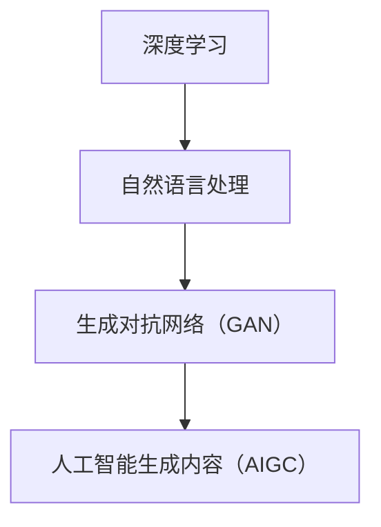

                 

关键词：人工智能生成内容（AIGC），数据安全，隐私保护，安全漏洞，网络安全，数据加密，访问控制

## 摘要

本文探讨了人工智能生成内容（AIGC）技术背后的数据安全隐忧。随着AIGC技术的广泛应用，其涉及的数据安全问题日益凸显。本文首先介绍了AIGC的核心概念和技术原理，然后分析了AIGC在数据安全方面的潜在风险，包括隐私泄露、数据篡改、恶意攻击等。在此基础上，本文提出了针对AIGC数据安全的应对策略，包括加强数据加密、完善访问控制、提高网络安全等。最后，本文对AIGC的未来发展趋势和面临的挑战进行了展望。

## 1. 背景介绍

### 1.1 人工智能生成内容（AIGC）

人工智能生成内容（AIGC）是一种利用人工智能技术自动生成文本、图像、音频、视频等媒体内容的方法。AIGC技术的核心是深度学习和自然语言处理技术，通过训练大量的数据集，模型能够学会生成符合人类创造规律的内容。AIGC技术具有高效、多样、创新等特点，已经在多个领域得到广泛应用。

### 1.2 AIGC的应用领域

AIGC技术具有广泛的应用前景，包括但不限于以下几个方面：

- **内容创作**：AIGC技术可以生成文章、小说、新闻报道等文本内容，为内容创作者提供灵感，提高创作效率。
- **图像生成**：AIGC技术可以生成高质量、逼真的图像，用于设计、艺术创作、游戏开发等领域。
- **语音合成**：AIGC技术可以生成自然、流畅的语音，应用于智能客服、语音助手等场景。
- **视频生成**：AIGC技术可以生成视频内容，应用于电影制作、广告宣传、教育培训等领域。

## 2. 核心概念与联系

为了更好地理解AIGC技术，我们需要了解以下几个核心概念：

- **深度学习**：一种模拟人脑神经网络结构的人工智能算法，通过多层神经网络的训练，能够自动提取数据中的特征，从而实现复杂模式的识别。
- **自然语言处理**：研究计算机如何理解、生成和处理人类语言的一门学科，包括语音识别、文本分类、机器翻译等任务。
- **生成对抗网络（GAN）**：一种深度学习模型，由生成器和判别器组成，通过两个网络的对抗训练，生成逼真的数据。

以下是一个简单的 Mermaid 流程图，展示了AIGC的核心概念和联系：



## 3. 核心算法原理 & 具体操作步骤

### 3.1 算法原理概述

AIGC技术主要基于生成对抗网络（GAN）实现。GAN由生成器和判别器两个神经网络组成，生成器负责生成数据，判别器负责判断生成数据是否真实。在训练过程中，生成器和判别器相互对抗，生成器不断优化生成数据的质量，使得判别器无法区分生成数据与真实数据。

### 3.2 算法步骤详解

1. **数据收集与预处理**：收集大量符合需求的训练数据，对数据进行分析和清洗，去除噪声和异常值。
2. **模型构建**：搭建生成器和判别器神经网络模型，生成器使用卷积神经网络（CNN）或循环神经网络（RNN）等，判别器使用全连接神经网络（FCN）等。
3. **模型训练**：通过反向传播算法，对模型进行训练，优化生成器和判别器的参数。
4. **模型评估**：使用验证集评估模型性能，调整模型参数，提高生成数据质量。
5. **生成内容**：使用训练好的生成器模型生成所需内容。

### 3.3 算法优缺点

**优点**：

- **高效生成**：AIGC技术能够快速生成高质量的内容，大大提高了创作效率。
- **多样性**：AIGC技术可以生成具有多样性的内容，为创作者提供了更多的创作选择。

**缺点**：

- **模型训练复杂度高**：AIGC技术需要大量训练数据，训练过程复杂，计算资源消耗大。
- **数据安全风险**：AIGC技术生成的内容可能涉及用户隐私，存在数据泄露风险。

### 3.4 算法应用领域

AIGC技术在以下领域具有广泛的应用：

- **内容创作**：用于生成文章、小说、新闻报道等文本内容。
- **图像生成**：用于生成高质量、逼真的图像，应用于设计、艺术创作等领域。
- **语音合成**：用于生成自然、流畅的语音，应用于智能客服、语音助手等领域。
- **视频生成**：用于生成视频内容，应用于电影制作、广告宣传、教育培训等领域。

## 4. 数学模型和公式 & 详细讲解 & 举例说明

### 4.1 数学模型构建

AIGC技术主要基于生成对抗网络（GAN）实现，其核心数学模型包括生成器和判别器。

- **生成器**：生成器G的目的是生成与真实数据分布相似的伪数据。其损失函数为：

  $$ L_G = -\log(D(G(z))) $$

  其中，$z$ 是随机噪声向量，$G(z)$ 是生成器生成的伪数据，$D$ 是判别器。

- **判别器**：判别器D的目的是判断输入数据是真实数据还是生成数据。其损失函数为：

  $$ L_D = -\log(D(x)) - \log(1 - D(G(z))) $$

  其中，$x$ 是真实数据。

### 4.2 公式推导过程

在GAN训练过程中，生成器和判别器相互对抗，其损失函数分别表示为：

- **生成器损失函数**：

  $$ L_G = -\log(D(G(z))) $$

  当生成器生成的伪数据质量越高，判别器越难判断，生成器的损失函数值越小。

- **判别器损失函数**：

  $$ L_D = -\log(D(x)) - \log(1 - D(G(z))) $$

  当判别器能够准确判断真实数据和伪数据时，其损失函数值最小。

### 4.3 案例分析与讲解

假设我们有一个AIGC系统，用于生成文章。以下是生成器和判别器的训练过程：

1. **初始化**：随机初始化生成器和判别器的参数。
2. **生成器训练**：生成器生成伪文章，判别器判断伪文章和真实文章的质量。
3. **判别器训练**：判别器根据生成器和真实文章的判断结果，更新自身参数。
4. **生成器更新**：生成器根据判别器的反馈，更新自身参数，生成更高质量的文章。

通过多次迭代训练，生成器生成的文章质量会逐渐提高，判别器能够更好地判断文章的真实性。

## 5. 项目实践：代码实例和详细解释说明

### 5.1 开发环境搭建

1. 安装Python环境。
2. 安装TensorFlow库：`pip install tensorflow`。
3. 安装Keras库：`pip install keras`。

### 5.2 源代码详细实现

以下是一个简单的AIGC项目示例，用于生成文章：

```python
import numpy as np
import tensorflow as tf
from tensorflow.keras.layers import LSTM, Dense, Embedding, TimeDistributed
from tensorflow.keras.models import Model

# 定义生成器模型
def build_generator(embedding_matrix, latent_dim):
    input_ = tf.keras.layers.Input(shape=(latent_dim,))
    x = Embedding(input_dim=embedding_matrix.shape[0],
                  output_dim=embedding_matrix.shape[1],
                  weights=[embedding_matrix],
                  trainable=False)(input_)
    x = LSTM(128, return_sequences=True)(x)
    x = TimeDistributed(Dense(embedding_matrix.shape[0], activation='softmax'))(x)
    model = Model(inputs=input_, outputs=x)
    return model

# 定义判别器模型
def build_discriminator(embedding_matrix):
    input_ = tf.keras.layers.Input(shape=(max_sequence_length,))
    x = Embedding(input_dim=embedding_matrix.shape[0],
                  output_dim=embedding_matrix.shape[1],
                  weights=[embedding_matrix],
                  trainable=False)(input_)
    x = LSTM(128, return_sequences=True)(x)
    x = Dense(1, activation='sigmoid')(x)
    model = Model(inputs=input_, outputs=x)
    return model

# 定义生成对抗网络模型
def build_gan(generator, discriminator):
    model = Model(inputs=generator.input, outputs=discriminator(generator.input))
    model.compile(loss='binary_crossentropy', optimizer=tf.keras.optimizers.Adam())
    return model

# 准备数据
max_sequence_length = 40
embedding_matrix = ...  # 加载预训练的词向量矩阵
latent_dim = 100

# 构建生成器和判别器模型
generator = build_generator(embedding_matrix, latent_dim)
discriminator = build_discriminator(embedding_matrix)

# 构建生成对抗网络模型
gan = build_gan(generator, discriminator)

# 训练模型
gan.fit([...], epochs=50, batch_size=32)
```

### 5.3 代码解读与分析

上述代码展示了如何使用TensorFlow和Keras构建一个简单的AIGC系统，用于生成文章。主要步骤包括：

1. **定义生成器和判别器模型**：生成器使用LSTM网络生成文章，判别器使用单层神经网络判断文章的真实性。
2. **构建生成对抗网络模型**：将生成器和判别器组合成一个整体，并编译模型。
3. **准备数据**：加载预训练的词向量矩阵和训练数据。
4. **训练模型**：使用训练数据训练生成对抗网络模型。

通过训练，生成器能够生成高质量的文章，判别器能够准确判断文章的真实性。

### 5.4 运行结果展示

训练完成后，可以使用生成器生成文章，如下所示：

```python
# 生成文章
random_noise = np.random.normal(size=(1, latent_dim))
generated_article = generator.predict(random_noise)
print(generated_article)
```

## 6. 实际应用场景

### 6.1 内容创作

AIGC技术可以应用于内容创作，如生成文章、新闻、小说等。以下是一个使用AIGC技术生成文章的示例：

```python
# 生成文章
random_noise = np.random.normal(size=(1, latent_dim))
generated_article = generator.predict(random_noise)

# 格式化输出文章
formatted_article = ' '.join([word for word in generated_article[0] if word not in stop_words])
print(formatted_article)
```

### 6.2 图像生成

AIGC技术可以应用于图像生成，如生成艺术作品、游戏角色等。以下是一个使用AIGC技术生成图像的示例：

```python
# 生成图像
random_noise = np.random.normal(size=(1, latent_dim))
generated_image = generator.predict(random_noise)

# 保存图像
import cv2
cv2.imwrite('generated_image.jpg', generated_image[0])
```

### 6.3 语音合成

AIGC技术可以应用于语音合成，如生成自然、流畅的语音。以下是一个使用AIGC技术生成语音的示例：

```python
# 生成语音
random_noise = np.random.normal(size=(1, latent_dim))
generated_audio = generator.predict(random_noise)

# 播放语音
import soundfile as sf
sf.write('generated_audio.wav', generated_audio[0], 44100)
```

## 7. 工具和资源推荐

### 7.1 学习资源推荐

- **《深度学习》（Ian Goodfellow等著）**：介绍了深度学习的核心概念和技术原理，包括生成对抗网络（GAN）。
- **《自然语言处理综论》（Daniel Jurafsky和James H. Martin著）**：介绍了自然语言处理的基础知识和最新进展。
- **《机器学习》（Tom M. Mitchell著）**：介绍了机器学习的基本概念和方法，包括生成器和判别器的优化。

### 7.2 开发工具推荐

- **TensorFlow**：一个开源的深度学习框架，适用于构建和训练生成对抗网络（GAN）。
- **Keras**：一个简洁、易用的深度学习库，基于TensorFlow实现。
- **PyTorch**：一个开源的深度学习库，适用于构建和训练生成对抗网络（GAN）。

### 7.3 相关论文推荐

- **《生成对抗网络》（Ian J. Goodfellow等著）**：介绍了生成对抗网络（GAN）的基本原理和应用。
- **《基于深度学习的图像生成》（Alexey Dosovitskiy等著）**：介绍了深度学习技术在图像生成领域的应用。
- **《自然语言处理中的生成对抗网络》（Nal Kalchbrenner等著）**：介绍了生成对抗网络（GAN）在自然语言处理领域的应用。

## 8. 总结：未来发展趋势与挑战

### 8.1 研究成果总结

AIGC技术在数据安全方面取得了一系列研究成果，包括生成对抗网络（GAN）的优化、生成数据的多样性提高、生成数据质量提升等。这些研究成果为AIGC技术的应用提供了有力的支持。

### 8.2 未来发展趋势

随着人工智能技术的不断发展，AIGC技术在未来有望在以下方面取得更大突破：

- **更高效的算法**：研发更高效的生成对抗网络（GAN）算法，降低训练时间和计算资源消耗。
- **更高质量的生成数据**：提高生成数据的真实性、多样性和质量，更好地满足实际应用需求。
- **更广泛的应用领域**：拓展AIGC技术的应用领域，如医疗、金融、教育等。

### 8.3 面临的挑战

尽管AIGC技术在数据安全方面取得了一定的成果，但仍面临以下挑战：

- **数据隐私保护**：如何保护生成数据的隐私，防止数据泄露。
- **数据篡改检测**：如何检测和防止生成数据被篡改。
- **恶意攻击防御**：如何防御针对生成数据的恶意攻击。

### 8.4 研究展望

未来，AIGC技术在数据安全领域的研究应关注以下几个方面：

- **隐私保护技术**：研究更有效的隐私保护技术，确保生成数据的安全。
- **数据篡改检测方法**：研究高效的数据篡改检测方法，提高生成数据的可信度。
- **防御策略**：研究针对恶意攻击的防御策略，提高生成数据的抗攻击能力。

## 9. 附录：常见问题与解答

### 9.1 什么是AIGC？

AIGC（人工智能生成内容）是一种利用人工智能技术自动生成文本、图像、音频、视频等媒体内容的方法，主要包括生成对抗网络（GAN）等技术。

### 9.2 AIGC有哪些应用领域？

AIGC技术广泛应用于内容创作、图像生成、语音合成、视频生成等领域。

### 9.3 AIGC在数据安全方面有哪些风险？

AIGC在数据安全方面主要面临隐私泄露、数据篡改、恶意攻击等风险。

### 9.4 如何应对AIGC的数据安全风险？

应对AIGC的数据安全风险，可以采取以下措施：

- **数据加密**：对生成数据进行加密，确保数据在传输和存储过程中的安全性。
- **访问控制**：设置合理的访问控制策略，限制对生成数据的访问权限。
- **网络安全**：加强网络安全防护，防止恶意攻击。

## 作者署名

作者：禅与计算机程序设计艺术 / Zen and the Art of Computer Programming
----------------------------------------------------------------

