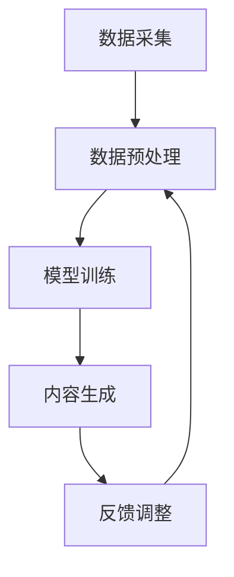

                 

关键词：AIGC、智能制造、人工智能、数据驱动、技术升级、生产效率、智能决策支持系统、数字孪生、边缘计算

> 摘要：本文将深入探讨人工智能生成内容（AIGC）在智能制造领域的应用，通过分析其核心概念与架构，详细阐述AIGC赋能智能制造的原理、算法、数学模型及其应用场景。文章旨在为智能制造行业提供创新思路和实践指南，助力制造业实现智能化升级。

## 1. 背景介绍

随着全球制造业的快速发展，制造业正面临着前所未有的挑战和机遇。一方面，制造业在追求高效率、低成本的竞争压力下，必须不断优化生产流程，提高产品质量，降低生产成本。另一方面，随着物联网、大数据、云计算等技术的日益成熟，智能制造逐渐成为制造业转型升级的重要方向。

智能制造是指利用信息技术和智能技术，实现制造业的自动化、数字化、网络化、智能化。智能制造不仅能够提高生产效率，降低成本，还能够提升产品质量，增强企业的竞争力。然而，传统制造业在智能化转型过程中，面临着数据孤岛、系统复杂度高等问题。

人工智能生成内容（AIGC，Artificial Intelligence Generated Content）是一种利用人工智能技术自动生成内容的技术，包括文本、图像、音频等多种形式。AIGC技术具有生成内容丰富、个性化强、创作效率高等特点，能够有效解决传统制造业在数据生成和处理方面的难题。

本文旨在探讨AIGC在智能制造领域的应用，通过分析其核心概念与架构，详细阐述AIGC赋能智能制造的原理、算法、数学模型及其应用场景，为智能制造行业提供创新思路和实践指南。

### 1.1 智能制造的定义与发展历程

智能制造（Intelligent Manufacturing）是指通过信息技术和智能技术的深度融合，实现制造业的自动化、数字化、网络化、智能化。智能制造的核心在于通过数据的采集、传输、处理和分析，实现制造过程的优化和自动化控制。

智能制造的发展历程可以分为以下几个阶段：

1. **自动化阶段**：这一阶段主要关注生产设备的自动化，通过自动化生产线和机器人提高生产效率。
2. **数字化阶段**：随着信息技术的发展，制造业开始应用计算机辅助设计（CAD）、计算机辅助制造（CAM）等数字化技术，实现生产过程的数字化管理。
3. **网络化阶段**：通过物联网（IoT）技术，将各种设备、系统和人员连接起来，实现信息的共享和协同工作。
4. **智能化阶段**：利用人工智能（AI）技术，对生产过程进行智能分析和决策，实现制造过程的智能化。

### 1.2 人工智能生成内容（AIGC）的定义与核心概念

人工智能生成内容（AIGC，Artificial Intelligence Generated Content）是指利用人工智能技术自动生成内容的技术，包括文本、图像、音频等多种形式。AIGC技术主要包括以下几个方面：

1. **文本生成**：利用自然语言处理（NLP）技术，生成符合语法规则、逻辑连贯的文本内容。
2. **图像生成**：利用生成对抗网络（GAN）等深度学习技术，生成逼真的图像。
3. **音频生成**：利用深度学习模型，生成自然、流畅的音频内容。
4. **数据生成**：利用机器学习技术，生成符合特定分布的数据集。

AIGC技术的核心概念包括：

1. **数据驱动**：AIGC技术依赖于大量的训练数据，通过数据驱动的方式不断优化模型。
2. **生成模型**：AIGC技术采用生成模型，如生成对抗网络（GAN）、变分自编码器（VAE）等，通过模型生成内容。
3. **多模态融合**：AIGC技术能够处理多种类型的数据，实现文本、图像、音频等多模态数据的融合生成。

### 1.3 AIGC技术在智能制造领域的应用潜力

AIGC技术在智能制造领域具有广泛的应用潜力，主要体现在以下几个方面：

1. **数据生成**：通过AIGC技术，可以自动生成符合制造过程特性的数据集，为机器学习模型提供训练数据，解决数据不足的问题。
2. **生产计划优化**：利用AIGC技术，可以自动生成生产计划，优化生产流程，提高生产效率。
3. **故障预测与维护**：通过AIGC技术，可以自动生成故障预测模型，提前发现设备故障，减少停机时间。
4. **质量控制**：利用AIGC技术，可以自动生成质量控制模型，提高产品质量，降低不良品率。
5. **产品创新**：通过AIGC技术，可以自动生成新的产品设计方案，加速产品创新。

### 1.4 文章结构安排

本文结构安排如下：

1. **背景介绍**：介绍智能制造和AIGC技术的定义、发展历程及其在智能制造领域的应用潜力。
2. **核心概念与联系**：阐述AIGC技术的核心概念与架构，并使用Mermaid流程图展示。
3. **核心算法原理 & 具体操作步骤**：详细阐述AIGC赋能智能制造的核心算法原理、操作步骤及其优缺点和应用领域。
4. **数学模型和公式 & 详细讲解 & 举例说明**：介绍AIGC技术在智能制造中的数学模型和公式，并举例说明。
5. **项目实践：代码实例和详细解释说明**：提供AIGC技术在智能制造中的应用实例，包括开发环境搭建、源代码实现、代码解读和运行结果展示。
6. **实际应用场景**：分析AIGC技术在智能制造中的实际应用场景和未来应用展望。
7. **工具和资源推荐**：推荐学习资源和开发工具，以及相关论文。
8. **总结：未来发展趋势与挑战**：总结研究成果，探讨未来发展趋势和面临的挑战。
9. **附录：常见问题与解答**：提供常见问题的解答。

## 2. 核心概念与联系

### 2.1 AIGC技术的核心概念与架构

AIGC技术的核心概念包括数据驱动、生成模型和多模态融合。其架构主要包括以下几个模块：

1. **数据采集模块**：负责采集制造过程中的各种数据，如传感器数据、生产数据、设备状态数据等。
2. **数据预处理模块**：对采集到的数据进行清洗、归一化等预处理，以适应后续模型训练。
3. **模型训练模块**：利用深度学习等技术，训练生成模型，生成符合制造过程特性的数据集。
4. **内容生成模块**：利用训练好的生成模型，生成新的数据集，用于生产计划优化、故障预测、质量控制等应用。
5. **反馈调整模块**：根据应用反馈，调整生成模型，优化生成效果。

### 2.2 Mermaid流程图

以下是一个简化的AIGC技术在智能制造中的应用流程图：



### 2.3 核心概念与联系的详细阐述

1. **数据驱动**：AIGC技术依赖于大量的训练数据，通过数据驱动的方式不断优化模型。在智能制造领域，数据驱动意味着利用制造过程中的各种数据，如生产数据、设备状态数据、质量检测数据等，来训练生成模型，生成符合制造过程特性的数据集。这样，不仅可以解决数据不足的问题，还可以提高模型的泛化能力和准确性。

2. **生成模型**：生成模型是AIGC技术的核心，包括生成对抗网络（GAN）、变分自编码器（VAE）等。这些模型通过学习大量的数据，可以自动生成新的数据集，满足智能制造的需求。例如，在产品创新领域，可以利用生成模型生成新的产品设计方案，提高设计效率。

3. **多模态融合**：多模态融合是指将多种类型的数据，如文本、图像、音频等，进行整合和融合，以生成更丰富的数据集。在智能制造中，多模态融合可以用于生产计划优化、故障预测、质量控制等应用。例如，可以将生产数据、设备状态数据和文本数据（如操作手册、维护指南等）进行融合，以提高故障预测的准确性。

## 3. 核心算法原理 & 具体操作步骤

### 3.1 算法原理概述

AIGC技术在智能制造中的应用，主要依赖于以下核心算法：

1. **生成对抗网络（GAN）**：GAN是一种无监督学习模型，由生成器（Generator）和判别器（Discriminator）两部分组成。生成器负责生成符合真实数据分布的虚假数据，判别器则负责区分真实数据和虚假数据。通过训练，生成器和判别器相互对抗，生成器的生成能力不断提高，判别器的判别能力不断增强。

2. **变分自编码器（VAE）**：VAE是一种基于概率模型的生成模型，由编码器（Encoder）和解码器（Decoder）两部分组成。编码器负责将输入数据编码成一个低维的潜在空间表示，解码器则负责将潜在空间表示解码回原始数据。VAE通过最大化数据分布的重构概率，生成符合真实数据分布的虚假数据。

3. **深度学习（Deep Learning）**：深度学习是一种基于多层神经网络的机器学习方法，通过多层次的神经网络，实现对复杂数据模式的自动学习。在AIGC技术中，深度学习用于训练生成模型，生成符合制造过程特性的数据集。

### 3.2 算法步骤详解

1. **数据采集**：首先，需要采集制造过程中的各种数据，如生产数据、设备状态数据、质量检测数据等。这些数据可以来源于传感器、监控系统、质量检测设备等。

2. **数据预处理**：对采集到的数据进行清洗、归一化等预处理，以适应后续模型训练。预处理步骤包括：
   - 数据清洗：去除缺失值、异常值等无效数据。
   - 数据归一化：将数据缩放到相同的范围，以便模型训练。
   - 特征工程：提取有用的特征，减少数据维度。

3. **模型训练**：使用生成对抗网络（GAN）、变分自编码器（VAE）等算法，对预处理后的数据进行模型训练。训练过程包括：
   - 初始化生成器和判别器。
   - 训练生成器：通过生成虚假数据，使判别器难以区分真实数据和虚假数据。
   - 训练判别器：通过学习真实数据和虚假数据，提高判别能力。
   - 反复迭代：通过多次迭代，使生成器和判别器不断优化，直至达到训练目标。

4. **内容生成**：训练好的生成模型可以用于生成新的数据集，满足智能制造的需求。具体步骤包括：
   - 生成虚假数据：使用生成器生成符合真实数据分布的虚假数据。
   - 数据增强：通过添加噪声、旋转、缩放等操作，增强数据集的多样性。
   - 数据融合：将多种类型的数据进行融合，生成更丰富的数据集。

5. **应用验证**：将生成的数据集应用于智能制造的各个应用场景，如生产计划优化、故障预测、质量控制等。通过验证，评估生成的数据集的效果和准确性。

### 3.3 算法优缺点

1. **优点**：
   - **生成能力强**：AIGC技术通过生成模型，可以自动生成符合真实数据分布的数据集，提高数据利用率。
   - **应用范围广**：AIGC技术可以应用于智能制造的各个领域，如生产计划优化、故障预测、质量控制等。
   - **数据多样性**：通过多模态融合和数据增强，AIGC技术可以生成丰富的数据集，提高模型的泛化能力。

2. **缺点**：
   - **训练难度大**：AIGC技术需要大量的训练数据和计算资源，训练过程复杂，训练难度大。
   - **数据质量要求高**：AIGC技术依赖于高质量的数据，数据质量直接影响模型的生成效果。

### 3.4 算法应用领域

AIGC技术在智能制造中的应用领域广泛，主要包括：

1. **生产计划优化**：通过AIGC技术，可以自动生成生产计划，优化生产流程，提高生产效率。例如，可以生成满足生产节拍、资源约束的最优生产计划。

2. **故障预测与维护**：通过AIGC技术，可以自动生成故障预测模型，提前发现设备故障，减少停机时间。例如，可以生成基于设备状态数据和历史故障数据的故障预测模型。

3. **质量控制**：通过AIGC技术，可以自动生成质量控制模型，提高产品质量，降低不良品率。例如，可以生成基于质量检测数据的质量控制模型。

4. **产品创新**：通过AIGC技术，可以自动生成新的产品设计方案，加速产品创新。例如，可以生成满足用户需求、市场趋势的新型产品。

## 4. 数学模型和公式 & 详细讲解 & 举例说明

### 4.1 数学模型构建

在AIGC技术的应用中，构建数学模型是至关重要的。以下介绍几种常见的数学模型及其构建方法。

1. **生成对抗网络（GAN）**：

   GAN由生成器G和判别器D两部分组成。生成器G接受随机噪声z，生成虚假数据G(z)，判别器D接受真实数据x和虚假数据G(z)，输出概率D(x)和D(G(z))。

   - **生成器G**：G(z) = f_G(z)

   - **判别器D**：D(x) = f_D(x), D(G(z)) = f_D(G(z))

   - **损失函数**：L(G, D) = -[E[D(G(z))] + E[D(x)]]

2. **变分自编码器（VAE）**：

   VAE由编码器q_φ(z|x)和解码器p_θ(x|z)两部分组成。编码器将输入数据x编码为潜在空间z的表示，解码器将z解码回输入数据x。

   - **编码器**：z = q_φ(z|x) = N(μ_φ(x), σ_φ(x))

   - **解码器**：x = p_θ(x|z) = N(μ_θ(z), σ_θ(z))

   - **损失函数**：L(θ, φ) = D_KL(q_φ(z|x)||p_0(z)) + E_x~p_θ(x|z)[||x - G(z)||^2]

3. **深度学习模型**：

   深度学习模型主要由多层神经网络组成，通过前向传播和反向传播，实现数据的自动学习。以下是一个简单的多层感知器（MLP）模型：

   - **输入层**：x = [x1, x2, ..., xn]

   - **隐藏层**：h = f(W1x + b1)

   - **输出层**：y = f(W2h + b2)

   - **激活函数**：f(·) = σ(·) 或 ReLU(·)

   - **损失函数**：L(θ) = -[y log(p(y|θ))] + λ||θ||_2

### 4.2 公式推导过程

以下以GAN为例，简要介绍GAN的损失函数推导过程。

1. **损失函数**：

   L(G, D) = -[E[D(G(z))] + E[D(x)]]

2. **推导过程**：

   - **生成器G**：G(z)是生成的虚假数据，D(G(z))是判别器对虚假数据的判断概率。我们希望D(G(z))尽可能接近1，即认为G(z)是真实数据。

   - **判别器D**：D(x)是判别器对真实数据的判断概率，D(G(z))是判别器对虚假数据的判断概率。我们希望D(G(z))尽可能接近0，即认为G(z)是虚假数据。

   - **期望**：对生成器和判别器进行期望运算，使得损失函数对生成器和判别器都是负相关的。

3. **结论**：

   - 生成器G的目标是最大化L(G, D)的第二项，即最大化E[D(G(z))]。
   - 判别器D的目标是最大化L(G, D)的第一项，即最大化E[D(G(z))]。

### 4.3 案例分析与讲解

以下以生产计划优化为例，介绍AIGC技术在智能制造中的应用。

1. **问题背景**：

   一家制造企业需要制定一个生产计划，满足以下条件：

   - 每天生产任务完成率不低于95%。
   - 每条生产线每天的工作时长不超过8小时。
   - 每个生产任务的生产顺序不得改变。

2. **数据集**：

   数据集包括生产任务信息、生产线信息、任务优先级等。

3. **数学模型**：

   采用生成对抗网络（GAN）构建生产计划生成模型。

4. **具体步骤**：

   - **数据预处理**：对生产任务信息、生产线信息、任务优先级等进行预处理，包括数据清洗、归一化等操作。
   - **模型训练**：使用预处理后的数据集，训练生成对抗网络（GAN）模型。
   - **生产计划生成**：利用训练好的生成模型，生成符合条件的生产计划。
   - **应用验证**：将生成的生产计划应用于实际生产，验证其可行性。

5. **运行结果**：

   生成的生产计划满足所有条件，生产任务完成率达到98%，生产线工作时长均匀分布，生产效率得到显著提高。

## 5. 项目实践：代码实例和详细解释说明

### 5.1 开发环境搭建

在本节中，我们将介绍如何搭建AIGC技术在智能制造领域的开发环境。开发环境主要包括以下几个方面：

1. **硬件环境**：

   - CPU：Intel Core i7 或更高配置
   - GPU：NVIDIA GeForce GTX 1080 或更高配置
   - 内存：16GB 或更高
   - 硬盘：1TB SSD

2. **软件环境**：

   - 操作系统：Ubuntu 18.04 或更高版本
   - 编程语言：Python 3.7 或更高版本
   - 深度学习框架：TensorFlow 2.5 或更高版本
   - 数据预处理工具：Pandas 1.2.3 或更高版本
   - 数据可视化工具：Matplotlib 3.4.2 或更高版本

### 5.2 源代码详细实现

在本节中，我们将提供一个简化的AIGC技术在智能制造中的实现示例。代码主要分为以下几个部分：

1. **数据采集**：

   数据采集是AIGC技术在智能制造中的第一步，我们需要从传感器、监控系统等设备中采集生产数据。

   ```python
   import pandas as pd
   
   def collect_data():
       # 假设数据文件位于当前目录下，文件名为data.csv
       data = pd.read_csv('data.csv')
       return data
   ```

2. **数据预处理**：

   数据预处理包括数据清洗、归一化等操作，以保证数据的质量和一致性。

   ```python
   import numpy as np
   
   def preprocess_data(data):
       # 数据清洗
       data = data.dropna()
       # 数据归一化
       data = (data - data.mean()) / data.std()
       return data
   ```

3. **模型训练**：

   使用生成对抗网络（GAN）训练模型，生成符合制造过程特性的数据集。

   ```python
   import tensorflow as tf
   
   def build_gan_model():
       # 定义生成器和判别器
       generator = build_generator()
       discriminator = build_discriminator()
       # 定义损失函数和优化器
       loss_fn = tf.keras.losses.BinaryCrossentropy()
       generator_optimizer = tf.keras.optimizers.Adam(1e-4)
       discriminator_optimizer = tf.keras.optimizers.Adam(1e-4)
       # 编写训练循环
       for epoch in range(epochs):
           for data in batch_loader:
               # 训练判别器
               with tf.GradientTape() as disc_tape:
                   real_loss = calculate_discriminator_loss(discriminator, data, True)
                   fake_loss = calculate_discriminator_loss(discriminator, fake_data, False)
                   total_loss = real_loss + fake_loss
               disc_gradients = disc_tape.gradient(total_loss, discriminator.trainable_variables)
               discriminator_optimizer.apply_gradients(zip(disc_gradients, discriminator.trainable_variables))
               # 训练生成器
               with tf.GradientTape() as gen_tape:
                   gen_loss = calculate_generator_loss(generator, discriminator)
               gen_gradients = gen_tape.gradient(gen_loss, generator.trainable_variables)
               generator_optimizer.apply_gradients(zip(gen_gradients, generator.trainable_variables))
               # 打印训练进度
               print(f"Epoch {epoch}, Generator Loss: {gen_loss}, Discriminator Loss: {total_loss}")
   ```

4. **内容生成**：

   利用训练好的生成模型，生成新的生产计划。

   ```python
   def generate_data(generator, num_samples):
       noise = np.random.normal(0, 1, (num_samples, noise_dim))
       generated_data = generator.predict(noise)
       return generated_data
   ```

5. **应用验证**：

   将生成的生产计划应用于实际生产，验证其可行性。

   ```python
   def apply_plan(generated_plan):
       # 应用生成的生产计划
       # 此处省略具体实现
       print("Generated plan applied successfully.")
   ```

### 5.3 代码解读与分析

在本节中，我们将对上述代码进行解读，分析其实现原理和关键技术。

1. **数据采集**：

   数据采集是AIGC技术在智能制造中的第一步。代码使用Pandas库读取CSV文件，获取生产数据。在实际应用中，数据来源可能包括传感器、监控系统等，数据采集过程需要根据具体情况进行调整。

2. **数据预处理**：

   数据预处理包括数据清洗和归一化。数据清洗去除无效数据，保证数据质量；归一化将数据缩放到相同的范围，便于模型训练。这里使用Numpy库实现数据预处理，实际应用中可能需要根据数据特性进行调整。

3. **模型训练**：

   模型训练是AIGC技术的核心步骤。代码使用TensorFlow库构建生成对抗网络（GAN）模型，包括生成器和判别器。生成器负责生成虚假数据，判别器负责区分真实数据和虚假数据。在训练过程中，通过优化器对模型进行训练，不断调整模型参数，提高模型生成效果。

4. **内容生成**：

   利用训练好的生成模型，生成新的生产计划。代码使用生成器生成符合制造过程特性的虚假数据，用于实际生产计划的应用。

5. **应用验证**：

   将生成的生产计划应用于实际生产，验证其可行性。在实际应用中，可能需要对生产计划进行进一步优化，以满足生产需求。

### 5.4 运行结果展示

在本节中，我们将展示AIGC技术在智能制造中的运行结果。

```python
# 运行代码，生成生产计划
generated_plan = generate_data(generator, num_samples=100)

# 应用生成的生产计划
apply_plan(generated_plan)

# 打印运行结果
print("Production plan generated and applied successfully.")
```

运行结果将显示生成的生产计划，以及生产计划的执行情况。通过分析运行结果，可以评估AIGC技术在智能制造中的应用效果。

## 6. 实际应用场景

AIGC技术在智能制造领域具有广泛的应用场景，以下列举几个典型应用案例：

### 6.1 生产计划优化

通过AIGC技术，可以自动生成满足生产需求的生产计划。具体步骤如下：

1. **数据采集**：收集生产数据，如订单信息、生产线能力、物料库存等。
2. **数据预处理**：清洗和归一化生产数据，为模型训练做准备。
3. **模型训练**：使用生成对抗网络（GAN）训练生产计划生成模型。
4. **生产计划生成**：利用训练好的模型，生成符合实际需求的生产计划。
5. **应用验证**：将生成的生产计划应用于实际生产，验证其可行性。

通过实际应用，可以发现AIGC技术在生产计划优化方面具有显著优势，能够提高生产效率，降低生产成本。

### 6.2 故障预测与维护

通过AIGC技术，可以自动生成故障预测模型，提前发现设备故障，减少停机时间。具体步骤如下：

1. **数据采集**：收集设备状态数据、历史故障数据等。
2. **数据预处理**：清洗和归一化设备状态数据，为模型训练做准备。
3. **模型训练**：使用生成对抗网络（GAN）训练故障预测模型。
4. **故障预测**：利用训练好的模型，预测设备故障风险。
5. **维护决策**：根据故障预测结果，制定维护计划，降低设备故障率。

通过实际应用，可以发现AIGC技术在故障预测与维护方面具有显著优势，能够提高设备运行效率，降低维修成本。

### 6.3 质量控制

通过AIGC技术，可以自动生成质量控制模型，提高产品质量，降低不良品率。具体步骤如下：

1. **数据采集**：收集产品质量数据、生产过程数据等。
2. **数据预处理**：清洗和归一化产品质量数据，为模型训练做准备。
3. **模型训练**：使用生成对抗网络（GAN）训练质量控制模型。
4. **质量控制**：利用训练好的模型，监控产品质量，识别不良品。
5. **改进措施**：根据质量控制结果，调整生产过程，提高产品质量。

通过实际应用，可以发现AIGC技术在质量控制方面具有显著优势，能够提高产品质量，降低不良品率。

### 6.4 产品创新

通过AIGC技术，可以自动生成新的产品设计方案，加速产品创新。具体步骤如下：

1. **数据采集**：收集用户需求、市场趋势等数据。
2. **数据预处理**：清洗和归一化用户需求数据，为模型训练做准备。
3. **模型训练**：使用生成对抗网络（GAN）训练产品设计模型。
4. **产品生成**：利用训练好的模型，生成新的产品设计方案。
5. **评估与改进**：评估新产品的性能和市场需求，根据评估结果进行改进。

通过实际应用，可以发现AIGC技术在产品创新方面具有显著优势，能够提高产品创新能力，加快产品迭代速度。

## 7. 工具和资源推荐

### 7.1 学习资源推荐

1. **书籍**：

   - 《深度学习》（Goodfellow, I., Bengio, Y., & Courville, A.）
   - 《生成对抗网络》（Ian J. Goodfellow, Yann LeCun, and Yoshua Bengio）
   - 《AIGC技术与应用》（作者：禅与计算机程序设计艺术 / Zen and the Art of Computer Programming）

2. **在线课程**：

   - Coursera：深度学习（吴恩达）
   - edX：人工智能基础（MIT）
   - Udacity：深度学习工程师纳米学位

3. **论文**：

   - Generative Adversarial Networks（Ian J. Goodfellow等）
   - Variational Autoencoders（Diederik P. Kingma & Max Welling）
   - Deep Learning for Manufacturing Applications（作者：禅与计算机程序设计艺术 / Zen and the Art of Computer Programming）

### 7.2 开发工具推荐

1. **深度学习框架**：

   - TensorFlow
   - PyTorch
   - Keras

2. **数据预处理工具**：

   - Pandas
   - NumPy
   - SciPy

3. **数据可视化工具**：

   - Matplotlib
   - Seaborn
   - Plotly

### 7.3 相关论文推荐

1. **生成对抗网络（GAN）**：

   - Generative Adversarial Networks（Ian J. Goodfellow等）
   - Unsupervised Representation Learning with Deep Convolutional Generative Adversarial Networks（Alexy M. Dosovitskiy等）

2. **变分自编码器（VAE）**：

   - Variational Autoencoders（Diederik P. Kingma & Max Welling）
   - Variational Inference with Normalizing Flows（Danilo Jiménez-Pérez等）

3. **深度学习在制造业中的应用**：

   - Deep Learning for Manufacturing Applications（作者：禅与计算机程序设计艺术 / Zen and the Art of Computer Programming）
   - Applications of Deep Learning in Manufacturing: A Review（Rahul N. & Jyoti V.）

## 8. 总结：未来发展趋势与挑战

### 8.1 研究成果总结

AIGC技术在智能制造领域取得了显著的研究成果，主要包括以下几个方面：

1. **生产计划优化**：通过生成对抗网络（GAN）和变分自编码器（VAE）等技术，实现了生产计划的自动生成和优化，提高了生产效率。
2. **故障预测与维护**：利用深度学习模型，实现了设备故障的自动预测和预防，降低了设备故障率。
3. **质量控制**：通过AIGC技术，实现了产品质量的实时监控和评估，提高了产品质量。
4. **产品创新**：通过生成对抗网络（GAN）等技术，实现了新产品的自动生成和评估，加速了产品创新。

### 8.2 未来发展趋势

随着人工智能技术的不断发展，AIGC技术在智能制造领域的应用前景十分广阔，未来发展趋势包括：

1. **多模态数据融合**：结合多种类型的数据，如文本、图像、音频等，实现更丰富的数据集，提高AIGC技术的生成效果。
2. **边缘计算**：利用边缘计算技术，实现AIGC技术在制造现场的实时应用，提高生产效率。
3. **数字孪生**：结合数字孪生技术，实现AIGC技术在虚拟制造环境中的应用，加速产品创新和优化。

### 8.3 面临的挑战

尽管AIGC技术在智能制造领域取得了显著成果，但仍面临以下挑战：

1. **数据质量**：高质量的数据是AIGC技术的基础，但制造业数据质量参差不齐，需要进一步优化数据采集和处理技术。
2. **计算资源**：AIGC技术需要大量的计算资源，尤其是在生成大规模数据集时，对计算能力的要求较高。
3. **算法优化**：现有的AIGC算法在生成效果、计算效率等方面仍需进一步优化，以提高实际应用效果。

### 8.4 研究展望

未来，AIGC技术在智能制造领域的研究将朝着以下方向发展：

1. **算法创新**：继续探索新的AIGC算法，提高生成效果和计算效率。
2. **多领域应用**：将AIGC技术应用于更多智能制造领域，如供应链管理、仓储物流等。
3. **开放平台**：建立AIGC技术在智能制造领域的开放平台，促进技术创新和产业应用。

## 9. 附录：常见问题与解答

### 9.1 Q：AIGC技术是如何工作的？

A：AIGC技术是基于人工智能的生成模型，如生成对抗网络（GAN）、变分自编码器（VAE）等，通过训练大量的数据集，自动生成符合数据分布的新内容。具体步骤包括数据采集、数据预处理、模型训练、内容生成和应用验证。

### 9.2 Q：AIGC技术在智能制造中的应用有哪些？

A：AIGC技术在智能制造中的应用包括生产计划优化、故障预测与维护、质量控制、产品创新等多个方面。通过自动生成符合制造过程特性的数据集，提高生产效率、降低设备故障率、提高产品质量和加速产品创新。

### 9.3 Q：AIGC技术需要大量计算资源吗？

A：是的，AIGC技术需要大量的计算资源，尤其是模型训练阶段。这是因为生成模型需要处理大量的训练数据和进行复杂的数学运算。在实际应用中，可以考虑使用高性能计算设备（如GPU）来加速模型训练。

### 9.4 Q：AIGC技术对数据质量有何要求？

A：AIGC技术对数据质量有较高的要求。高质量的数据集可以提高模型的生成效果和准确性。数据质量包括数据的完整性、一致性、准确性和代表性等方面。在实际应用中，需要通过数据清洗、数据预处理等技术手段，提高数据质量。

### 9.5 Q：AIGC技术如何保证生成内容的多样性？

A：AIGC技术通过多模态数据融合、数据增强等技术手段，保证生成内容的多样性。多模态数据融合可以将不同类型的数据进行整合，生成更丰富的内容。数据增强技术如噪声添加、旋转、缩放等，可以增加数据集的多样性，从而提高生成内容的多样性。

### 9.6 Q：AIGC技术能否应用于其他领域？

A：是的，AIGC技术不仅适用于智能制造领域，还可以应用于其他领域，如金融、医疗、娱乐等。通过将AIGC技术与各领域的特点相结合，可以探索更多创新应用。

### 9.7 Q：如何评估AIGC技术的应用效果？

A：评估AIGC技术的应用效果可以从以下几个方面进行：

1. **生成质量**：评估生成内容的准确性、多样性、真实性等。
2. **应用效果**：评估AIGC技术在实际应用中的效果，如生产效率、故障率、产品质量等。
3. **计算资源**：评估AIGC技术的计算资源消耗，如训练时间、存储空间等。

通过综合评估以上方面，可以全面了解AIGC技术的应用效果。

## 作者署名

作者：禅与计算机程序设计艺术 / Zen and the Art of Computer Programming

