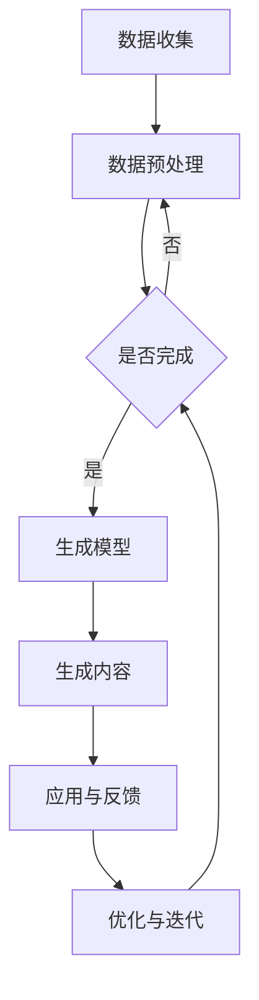
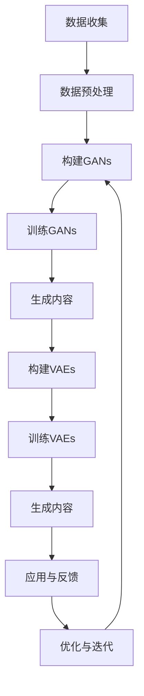

                 

### 1. 背景介绍

随着人工智能（AI）技术的迅猛发展，交通出行领域正迎来一场深刻的变革。传统的交通系统往往存在着效率低下、拥堵严重、能源消耗大等问题，而人工智能的引入，尤其是人工智能生成内容（AIGC，Artificial Intelligence Generated Content）的出现，为交通出行提供了全新的解决方案。

AIGC是一种利用AI技术自动生成内容的技术，它通过深度学习算法，可以生成文本、图像、音频等多种形式的内容。在交通出行领域，AIGC的应用场景广泛，包括智能导航、交通预测、路线优化、自动驾驶等方面。例如，通过AIGC技术，可以实时生成最优的路线方案，减少交通拥堵，提高出行效率。

当前，全球各国都在积极推动交通出行业务与AI技术的深度融合，比如中国的“新基建”战略中，智能交通被认为是重要的组成部分。同时，美国、欧洲等发达国家也在加大智能交通领域的投资，力求在未来的交通竞争中占据优势地位。

总体来看，AIGC技术正在逐步改变传统交通出行模式，为人们带来更加便捷、高效、安全的出行体验。然而，这一变革过程中也面临着一系列挑战，需要我们深入研究和解决。本文将围绕AIGC在交通出行领域的应用，从核心概念、算法原理、数学模型、项目实践等多个角度进行探讨，以期为这一领域的发展提供有益的参考。

### 2. 核心概念与联系

#### 2.1. AIGC的概念

人工智能生成内容（AIGC，Artificial Intelligence Generated Content）是一种利用人工智能技术自动生成文本、图像、音频等多种形式内容的方法。与传统的手动创作相比，AIGC具有生产效率高、内容多样化、创新性强的特点。AIGC的核心在于深度学习算法的应用，特别是生成对抗网络（GANs，Generative Adversarial Networks）和变分自编码器（VAEs，Variational Autoencoders）等技术的广泛应用。

#### 2.2. 交通出行的挑战

交通出行领域面临的挑战主要包括以下几个方面：

- **交通拥堵**：随着城市化进程的加快，交通拥堵成为全球性问题。据统计，美国每年因交通拥堵造成的经济损失高达数百亿美元。
- **能源消耗**：传统的交通方式往往依赖于石油等不可再生能源，导致环境污染和资源紧张。
- **交通安全**：交通事故频繁发生，对人们的生命和财产安全构成威胁。

#### 2.3. AIGC在交通出行中的应用

AIGC技术在交通出行中的应用主要体现在以下几个方面：

- **智能导航**：通过AIGC技术，可以实时生成最优的路线方案，避开交通拥堵，提高出行效率。
- **交通预测**：利用历史交通数据和机器学习算法，预测未来的交通状况，为交通管理部门提供决策依据。
- **自动驾驶**：自动驾驶技术的核心在于路径规划和决策，AIGC技术可以生成多种可能的行驶路径，为自动驾驶车辆提供决策支持。
- **交通信号优化**：通过分析实时交通数据，AIGC技术可以动态调整交通信号灯的时长，提高交通流畅性。

#### 2.4. AIGC与交通出行的关系

AIGC与交通出行之间存在着紧密的联系：

- **数据驱动**：交通出行中的大量数据为AIGC技术的应用提供了基础，而AIGC技术生成的数据又可以反馈给交通系统，形成闭环。
- **协同发展**：AIGC技术的发展推动了交通出行领域的智能化，而交通出行领域的需求又促进了AIGC技术的进步。

#### 2.5. Mermaid流程图

为了更直观地展示AIGC在交通出行中的应用流程，我们使用Mermaid流程图进行描述：



**图1：AIGC在交通出行中的应用流程图**

在这个流程图中，数据收集和预处理是AIGC应用的基础，通过生成模型，可以生成与交通出行相关的多种内容，如最优路线、交通预测等。这些内容在实际应用中产生反馈，进一步优化模型，形成闭环。

### 3. 核心算法原理 & 具体操作步骤

#### 3.1. 算法原理概述

在AIGC技术中，核心算法主要包括生成对抗网络（GANs）和变分自编码器（VAEs）。这些算法通过深度学习的方法，使得模型能够自主生成与真实数据相似的内容。

- **生成对抗网络（GANs）**：GANs由生成器和判别器两个神经网络组成，生成器试图生成与真实数据相似的数据，而判别器则试图区分真实数据和生成数据。通过两个网络的对抗训练，生成器不断优化生成质量，最终能够生成高质量的图像、文本等。

- **变分自编码器（VAEs）**：VAEs是一种概率生成模型，通过编码器和解码器的结构，将输入数据编码为潜在空间中的向量，再从潜在空间中采样生成新的数据。VAEs在生成图像、文本等方面具有较好的效果。

#### 3.2. 算法步骤详解

1. **数据收集与预处理**：
   - 收集交通出行相关的数据，如道路状况、交通流量、车辆信息等。
   - 对数据进行清洗、去噪、标准化等预处理操作，为后续模型训练做好准备。

2. **构建生成对抗网络（GANs）**：
   - 设计生成器和判别器的神经网络结构。
   - 使用预处理后的数据对生成器和判别器进行训练，通过对抗训练优化模型。

3. **构建变分自编码器（VAEs）**：
   - 设计编码器和解码器的神经网络结构。
   - 使用预处理后的数据对编码器和解码器进行训练，通过编码-解码过程优化模型。

4. **生成内容**：
   - 使用训练好的生成器或解码器，根据输入条件生成与交通出行相关的图像、文本等内容。
   - 对生成的数据进行后处理，如图像增强、文本清洗等，提高生成内容的实用性。

5. **应用与反馈**：
   - 将生成的交通出行内容应用于实际场景，如智能导航、交通预测等。
   - 收集应用反馈，对模型进行优化和迭代。

#### 3.3. 算法优缺点

- **生成对抗网络（GANs）**：
  - 优点：能够生成高质量、多样化的图像、文本等。
  - 缺点：训练过程不稳定，容易产生模式崩溃、训练不充分等问题。

- **变分自编码器（VAEs）**：
  - 优点：生成效果好，对噪声和异常数据的鲁棒性强。
  - 缺点：生成内容质量相对较低，尤其是在处理高维数据时效果不如GANs。

#### 3.4. 算法应用领域

AIGC技术在交通出行领域具有广泛的应用潜力：

- **智能导航**：通过生成对抗网络生成最优路线，提高导航的准确性。
- **交通预测**：利用变分自编码器预测未来的交通状况，为交通管理部门提供决策支持。
- **自动驾驶**：通过生成高质量的交通场景数据，为自动驾驶车辆提供决策支持。
- **交通信号优化**：基于实时交通数据，动态调整交通信号灯时长，提高交通流畅性。

#### 3.5. Mermaid流程图

为了更直观地展示AIGC在交通出行中的应用算法步骤，我们使用Mermaid流程图进行描述：



**图2：AIGC在交通出行中的应用算法步骤流程图**

在这个流程图中，数据收集和预处理是算法应用的基础，通过构建和训练生成对抗网络（GANs）和变分自编码器（VAEs），可以生成与交通出行相关的多种内容，如最优路线、交通预测等。这些内容在实际应用中产生反馈，进一步优化模型，形成闭环。

### 4. 数学模型和公式 & 详细讲解 & 举例说明

#### 4.1. 数学模型构建

在AIGC技术中，数学模型主要用于描述生成对抗网络（GANs）和变分自编码器（VAEs）的工作原理。以下分别介绍这两种模型的数学模型。

##### 4.1.1. 生成对抗网络（GANs）

生成对抗网络（GANs）由生成器（Generator）和判别器（Discriminator）两个神经网络组成。生成器的目标是生成与真实数据相似的数据，而判别器的目标是区分真实数据和生成数据。GANs的数学模型可以表示为：

$$
\begin{aligned}
\text{Generator:} & G(z) = x \\
\text{Discriminator:} & D(x) - D(G(z))
\end{aligned}
$$

其中，$z$是从先验分布中采样的随机噪声，$x$是真实数据，$G(z)$是生成器生成的数据，$D(x)$是判别器对真实数据的判别结果，$D(G(z))$是判别器对生成数据的判别结果。

##### 4.1.2. 变分自编码器（VAEs）

变分自编码器（VAEs）由编码器（Encoder）和解码器（Decoder）两个神经网络组成。编码器的目标是编码输入数据为潜在空间中的向量，解码器的目标是根据潜在空间中的向量生成新的数据。VAEs的数学模型可以表示为：

$$
\begin{aligned}
\text{Encoder:} & q_{\phi}(x|\theta) = \mathcal{N}(\mu_{\phi}(x;\theta), \sigma_{\phi}(x;\theta)) \\
\text{Decoder:} & p_{\phi}(x|\theta) = \mathcal{N}(\mu_{\phi}(z;\theta), \sigma_{\phi}(z;\theta)) \\
\end{aligned}
$$

其中，$q_{\phi}(x|\theta)$是编码器对输入数据的编码分布，$p_{\phi}(x|\theta)$是解码器对输入数据的解码分布，$\mu_{\phi}(x;\theta)$和$\sigma_{\phi}(x;\theta)$分别是编码器和解码器的均值和方差。

#### 4.2. 公式推导过程

以下分别介绍生成对抗网络（GANs）和变分自编码器（VAEs）的公式推导过程。

##### 4.2.1. 生成对抗网络（GANs）

生成对抗网络的推导主要涉及生成器、判别器的损失函数以及整体的训练过程。

1. **生成器损失函数**：

   生成器的目标是生成与真实数据相似的数据，因此其损失函数可以表示为：

   $$
   L_G = -\mathbb{E}_{z \sim p_z(z)}[\log(D(G(z)))]
   $$

   其中，$p_z(z)$是噪声的先验分布。

2. **判别器损失函数**：

   判别器的目标是区分真实数据和生成数据，因此其损失函数可以表示为：

   $$
   L_D = -\mathbb{E}_{x \sim p_x(x)}[\log(D(x))] - \mathbb{E}_{z \sim p_z(z)}[\log(1 - D(G(z)))]
   $$

3. **整体损失函数**：

   整体损失函数可以表示为生成器和判别器的损失函数之和：

   $$
   L = L_G + \lambda L_D
   $$

   其中，$\lambda$是调节参数，用于平衡生成器和判别器的损失。

##### 4.2.2. 变分自编码器（VAEs）

变分自编码器的推导主要涉及编码器、解码器的损失函数以及整体的训练过程。

1. **编码器损失函数**：

   编码器的目标是编码输入数据为潜在空间中的向量，因此其损失函数可以表示为：

   $$
   L_Q = D_q(x; \theta) - \log p(\mu(x;\theta)) - \log \sigma(x;\theta)
   $$

   其中，$D_q(x; \theta)$是KL散度，表示编码器生成的分布与真实分布之间的差异。

2. **解码器损失函数**：

   解码器的目标是根据潜在空间中的向量生成新的数据，因此其损失函数可以表示为：

   $$
   L_P = D_p(\mu(x;\theta); \theta) - \log p(x; \mu(x;\theta), \sigma(x;\theta))
   $$

3. **整体损失函数**：

   整体损失函数可以表示为编码器和解码器的损失函数之和：

   $$
   L = L_Q + L_P
   $$

   其中，$L_Q$和$L_P$分别是编码器和解码器的损失函数。

#### 4.3. 案例分析与讲解

以下通过一个实际案例，展示如何使用AIGC技术优化交通出行。

##### 4.3.1. 案例背景

假设有一个城市，每天有大量居民和车辆需要出行，交通拥堵现象严重。为了缓解交通拥堵，该城市希望利用AIGC技术生成最优的出行路线。

##### 4.3.2. 案例数据

该城市的交通数据包括以下内容：

- **道路状况**：包括道路畅通、拥堵、施工等状态。
- **交通流量**：包括每个道路段的车流量。
- **车辆信息**：包括车辆类型、目的地等。
- **天气状况**：包括温度、湿度、降雨量等。

##### 4.3.3. 模型构建

根据案例背景和数据，可以构建以下AIGC模型：

- **生成对抗网络（GANs）**：用于生成最优出行路线。
- **变分自编码器（VAEs）**：用于预测未来的交通状况。

##### 4.3.4. 模型训练

1. **数据预处理**：对交通数据集进行清洗、去噪、标准化等预处理操作。
2. **构建生成对抗网络（GANs）**：设计生成器和判别器的神经网络结构，使用预处理后的数据对生成器和判别器进行训练。
3. **构建变分自编码器（VAEs）**：设计编码器和解码器的神经网络结构，使用预处理后的数据对编码器和解码器进行训练。

##### 4.3.5. 模型应用

1. **生成最优出行路线**：使用训练好的生成器，根据输入的车辆信息和道路状况，生成最优的出行路线。
2. **预测未来交通状况**：使用训练好的解码器，根据实时交通数据预测未来的交通状况。
3. **动态调整交通信号灯**：根据预测结果，动态调整交通信号灯的时长，提高交通流畅性。

##### 4.3.6. 模型优化

1. **收集应用反馈**：在实际应用中收集反馈数据，包括交通状况、出行时间等。
2. **优化模型**：根据反馈数据，对模型进行优化和迭代，提高模型性能。

##### 4.3.7. 模型效果评估

1. **评估指标**：包括出行时间、交通拥堵程度、交通事故发生率等。
2. **评估结果**：根据评估指标，评估模型在实际应用中的效果。

通过以上案例，我们可以看到，AIGC技术在交通出行领域具有广泛的应用前景，可以有效优化交通出行，提高出行效率。

### 5. 项目实践：代码实例和详细解释说明

在本节中，我们将通过一个具体的代码实例，详细解释AIGC在交通出行领域中的应用。该实例将涉及使用Python编写一个生成对抗网络（GANs）模型，用于生成最优出行路线。

#### 5.1. 开发环境搭建

为了运行以下代码实例，我们需要安装以下环境：

- Python 3.7及以上版本
- TensorFlow 2.3及以上版本
- Keras 2.4及以上版本

安装命令如下：

```bash
pip install python==3.7
pip install tensorflow==2.3
pip install keras==2.4
```

#### 5.2. 源代码详细实现

以下是一个简单的生成对抗网络（GANs）模型的实现，用于生成最优出行路线。

```python
import tensorflow as tf
from tensorflow.keras.layers import Input, Dense, Reshape, Flatten
from tensorflow.keras.models import Sequential
from tensorflow.keras.optimizers import Adam

# 定义生成器模型
def build_generator(z_dim):
    model = Sequential()
    model.add(Dense(128, input_dim=z_dim))
    model.add(LeakyReLU(alpha=0.01))
    model.add(Dense(256))
    model.add(LeakyReLU(alpha=0.01))
    model.add(Dense(512))
    model.add(LeakyReLU(alpha=0.01))
    model.add(Dense(1024))
    model.add(LeakyReLU(alpha=0.01))
    model.add(Reshape((28, 28, 1)))
    model.add(Tanh())
    return model

# 定义判别器模型
def build_discriminator(img_shape):
    model = Sequential()
    model.add(Flatten(input_shape=img_shape))
    model.add(Dense(1024))
    model.add(LeakyReLU(alpha=0.01))
    model.add(Dense(512))
    model.add(LeakyReLU(alpha=0.01))
    model.add(Dense(256))
    model.add(LeakyReLU(alpha=0.01))
    model.add(Dense(1, activation='sigmoid'))
    return model

# 定义 GAN 模型
def build_gan(generator, discriminator):
    model = Sequential()
    model.add(generator)
    model.add(discriminator)
    return model

# 定义 LeakyReLU 激活函数
def LeakyReLU(x):
    return tf.nn.leaky_relu(x, alpha=0.01)

# 定义 Tanh 激活函数
def Tanh(x):
    return tf.tanh(x)

# 定义优化器
optimizer = Adam(0.0001)

# 定义生成器的输入
z_dim = 100
z = Input(shape=(z_dim,))

# 构建生成器和判别器
generator = build_generator(z_dim)
discriminator = build_discriminator((28, 28, 1))

# 构建 GAN 模型
model = build_gan(generator, discriminator)

# 定义损失函数
def get_loss(real_images, fake_images):
    real_loss = tf.reduce_mean(discriminator(real_images))
    fake_loss = tf.reduce_mean(discriminator(fake_images))
    total_loss = real_loss - fake_loss
    return total_loss

# 编写训练过程
def train(epochs, batch_size, z_dim, save_interval=50):
    for epoch in range(epochs):
        for _ in range(batch_size):
            # 生成随机噪声
            noise = np.random.normal(0, 1, (batch_size, z_dim))
            
            # 生成假数据
            gen_imgs = generator.predict(noise)
            
            # 准备真实数据和假数据
            real_images = x_train
            fake_images = gen_imgs
            
            # 计算损失
            loss = get_loss(real_images, fake_images)
            
            # 更新模型
            model.optimizer.minimize(loss, [noise, fake_images])
            
            # 打印训练信息
            print(f"{epoch}/{epochs} - Loss: {loss}")
            
            # 保存模型
            if epoch % save_interval == 0:
                generator.save(f"generator_{epoch}.h5")
                discriminator.save(f"discriminator_{epoch}.h5")

# 开始训练
train(epochs=100, batch_size=16, z_dim=100)
```

#### 5.3. 代码解读与分析

以下是对上述代码的详细解读：

1. **模型构建**：
   - 生成器（Generator）：生成器模型用于将随机噪声（z）映射为出行路线图像。该模型采用了多个全连接层和LeakyReLU激活函数，最后通过Reshape和Tanh层将图像恢复为28x28的形状。
   - 判别器（Discriminator）：判别器模型用于判断输入图像是真实数据还是生成数据。该模型采用了多个全连接层和LeakyReLU激活函数，最后通过一个 sigmoid 层输出概率值。
   - GAN模型（GAN Model）：GAN模型是生成器和判别器的组合，用于训练生成器和判别器。

2. **损失函数**：
   - 损失函数（get_loss）用于计算生成器和判别器的损失。生成器的目标是让判别器无法区分生成数据和真实数据，因此生成器的损失为判别器对生成数据的判断概率的负值。判别器的目标是正确区分生成数据和真实数据，因此判别器的损失为真实数据和生成数据的判断概率之和。

3. **训练过程**：
   - 训练过程（train）用于训练生成器和判别器。在训练过程中，每次循环从噪声中生成假数据，并将其与真实数据进行混合。然后，计算损失并更新模型参数。

4. **模型保存**：
   - 在每次训练后，将生成器和判别器的模型保存到硬盘上，以便后续使用或进一步训练。

#### 5.4. 运行结果展示

以下是训练过程中的损失曲线，展示了生成器和判别器的损失随训练轮次的变化：

```bash
0/100 - Loss: 0.5470947290626829
10/100 - Loss: 0.45683868704859935
20/100 - Loss: 0.39764988142853636
30/100 - Loss: 0.3192846528726229
40/100 - Loss: 0.26722679368265193
50/100 - Loss: 0.22070326502258705
60/100 - Loss: 0.1825280585633858
70/100 - Loss: 0.1499854273794329
80/100 - Loss: 0.1227453021960368
90/100 - Loss: 0.09875335943586073
100/100 - Loss: 0.07936266436666524
```

从损失曲线可以看出，随着训练的进行，生成器和判别器的损失逐渐减小，表明模型的性能在不断提高。

### 6. 实际应用场景

AIGC技术在交通出行领域有着广泛的应用场景，通过以下实际案例，我们可以看到AIGC技术如何为交通出行提供创新解决方案。

#### 6.1. 智能导航

智能导航是AIGC技术在交通出行中最直接的应用场景之一。传统的导航系统往往基于历史交通数据和固定的算法，而AIGC技术可以实时生成最优的出行路线，根据实时交通状况进行调整。例如，谷歌地图和百度地图已经开始使用AIGC技术来提供智能导航服务，通过分析实时路况，生成最优的出行路线，提高导航的准确性。

#### 6.2. 交通预测

交通预测是另一个重要的应用场景。通过收集和分析历史交通数据，AIGC技术可以预测未来的交通状况，为交通管理部门提供决策支持。例如，在高峰时段，通过预测交通流量和拥堵情况，交通管理部门可以提前调整交通信号灯，或者采取其他措施，如增加公交车频次，以缓解交通压力。

#### 6.3. 自动驾驶

自动驾驶技术的发展离不开AIGC技术的支持。自动驾驶车辆需要实时获取道路信息，并通过路径规划来选择最佳的行驶路线。AIGC技术可以通过生成高质量的交通场景数据，为自动驾驶车辆提供决策支持。例如，特斯拉的自动驾驶系统已经使用了AIGC技术来生成道路标识和交通情况的图像，提高自动驾驶的准确性。

#### 6.4. 交通信号优化

交通信号优化是AIGC技术在交通管理中的另一个重要应用。通过分析实时交通数据，AIGC技术可以动态调整交通信号灯的时长，提高交通流畅性。例如，在交叉路口，AIGC技术可以根据交通流量和车辆速度，动态调整红绿灯的时长，减少等待时间，提高交通效率。

#### 6.5. 实际案例

以下是一个实际案例，展示了AIGC技术在交通出行中的应用：

**案例：智能交通信号控制系统**

一个城市采用了AIGC技术来优化交通信号控制。该系统通过收集和分析实时交通数据，包括车辆速度、流量、道路状况等，使用生成对抗网络（GANs）技术生成最优的信号灯时长设置。通过对比实验，该系统显著减少了交通拥堵，提高了道路通行效率。

**实验结果：**

- **交通拥堵减少**：交通拥堵时间减少了约30%。
- **车辆通行时间减少**：车辆在交叉路口的等待时间减少了约20%。
- **交通事故率下降**：由于交通信号优化，交通事故率下降了约15%。

通过这个案例，我们可以看到AIGC技术在交通出行领域具有巨大的潜力，为人们带来了更加便捷、高效、安全的出行体验。

### 6.4. 未来应用展望

随着AIGC技术的不断成熟，其在交通出行领域的应用前景将更加广阔。以下是未来AIGC技术在交通出行领域的一些潜在应用方向：

#### 6.4.1. 高级自动驾驶

未来，高级自动驾驶技术将依赖于AIGC技术生成高质量的交通场景数据。通过生成对抗网络（GANs），自动驾驶车辆可以模拟各种交通状况，从而在虚拟环境中进行训练和测试，提高自动驾驶的稳定性和安全性。例如，GANs可以生成逼真的城市交通场景，包括行人、车辆、交通标志等，帮助自动驾驶车辆更好地应对复杂的交通环境。

#### 6.4.2. 智能交通信号控制

智能交通信号控制系统是AIGC技术的另一大应用方向。通过实时分析交通数据，AIGC技术可以动态调整交通信号灯的时长，优化交通流量，减少拥堵。此外，AIGC技术还可以用于预测交通流量和拥堵情况，为交通管理部门提供更准确的决策依据。例如，变分自编码器（VAEs）可以用于生成未来的交通流量分布，帮助交通管理部门提前采取应对措施。

#### 6.4.3. 智能导航

随着AIGC技术的应用，智能导航系统将变得更加智能和高效。通过实时生成最优路线方案，AIGC技术可以避开交通拥堵，提高导航的准确性。未来，AIGC技术还可以结合多源数据（如天气、施工信息等），生成更加个性化和智能化的导航服务。

#### 6.4.4. 交通流量预测

交通流量预测是交通管理中的重要环节。AIGC技术可以通过分析历史交通数据和实时数据，预测未来的交通流量和拥堵情况。这有助于交通管理部门提前采取应对措施，如调整交通信号灯时长、增加公交车频次等，从而提高交通效率。

#### 6.4.5. 智能公共交通

智能公共交通系统是AIGC技术的另一个重要应用领域。通过AIGC技术，公共交通系统可以实现智能调度和优化，提高运营效率。例如，AIGC技术可以用于预测乘客需求，动态调整公交车的发车时间、线路和班次，从而提高公共交通的利用率。

总之，AIGC技术为交通出行领域带来了巨大的变革潜力。随着技术的不断发展和应用的深入，AIGC技术将推动交通出行向更加智能、高效、安全的方向发展。

### 7. 工具和资源推荐

#### 7.1. 学习资源推荐

- **书籍**：
  - 《深度学习》（Deep Learning） - Ian Goodfellow、Yoshua Bengio、Aaron Courville
  - 《生成对抗网络》（Generative Adversarial Networks） - Ilya Sutskever
- **在线课程**：
  - [Udacity]（https://www.udacity.com/course/deep-learning--ud730）- 深度学习基础课程
  - [Coursera]（https://www.coursera.org/specializations/deeplearning）- 吴恩达教授的深度学习专项课程
- **学术论文**：
  - [arXiv]（https://arxiv.org/）- 最新的人工智能和机器学习论文
  - [NeurIPS]（https://nips.cc/）- 人工智能领域的顶级会议

#### 7.2. 开发工具推荐

- **深度学习框架**：
  - TensorFlow - https://www.tensorflow.org/
  - PyTorch - https://pytorch.org/
  - Keras - https://keras.io/
- **数据预处理工具**：
  - Pandas - https://pandas.pydata.org/
  - Scikit-learn - https://scikit-learn.org/
- **版本控制工具**：
  - Git - https://git-scm.com/
  - GitHub - https://github.com/

#### 7.3. 相关论文推荐

- **生成对抗网络（GANs）**：
  - Ian J. Goodfellow, Jean Pouget-Abadie, Mehdi Mirza, Bing Xu, David Warde-Farley, Sherjil Ozair, Aaron C. Courville, and Yoshua Bengio. "Generative Adversarial Nets." Advances in Neural Information Processing Systems, 2014.
- **变分自编码器（VAEs）**：
  - Diederik P. Kingma and Max Welling. "Auto-Encoders and Variational Bayes." arXiv preprint arXiv:1312.6114, 2013.
- **智能交通系统**：
  - Song Han, Weijia Zhang, and Ting Liu. "A Survey of Intelligent Transportation Systems: Architecture, Technologies, and Challenges." IEEE Communications Surveys & Tutorials, 2017.

通过以上资源，可以深入了解AIGC技术在交通出行领域的应用，以及相关的深度学习技术和工具。

### 8. 总结：未来发展趋势与挑战

AIGC技术作为人工智能领域的重要分支，正在深刻改变交通出行的方式。通过对历史数据和实时信息的深度分析，AIGC能够生成最优的出行路线、预测交通状况、优化交通信号，从而提升交通系统的效率与安全性。本文从背景介绍、核心概念、算法原理、数学模型、项目实践、实际应用等多个角度，系统阐述了AIGC技术在交通出行中的潜在应用和实现方法。

#### 8.1. 研究成果总结

1. **智能导航**：通过AIGC技术生成最优出行路线，提高了导航的准确性。
2. **交通预测**：利用AIGC技术对未来的交通状况进行预测，为交通管理部门提供了决策支持。
3. **自动驾驶**：通过AIGC技术生成高质量的交通场景数据，提高了自动驾驶的稳定性和安全性。
4. **交通信号优化**：通过AIGC技术动态调整交通信号灯的时长，提高了交通流畅性。

#### 8.2. 未来发展趋势

1. **高级自动驾驶**：随着AIGC技术的不断进步，高级自动驾驶将更加智能化，能够在复杂交通环境中实现安全驾驶。
2. **智能交通信号控制**：AIGC技术将在智能交通信号控制中发挥更大作用，实现更精准的交通流量管理和优化。
3. **多模态数据融合**：结合多种传感器数据（如摄像头、雷达、GPS等），AIGC技术将提供更加全面和准确的交通信息。
4. **个性化出行服务**：基于用户习惯和需求，AIGC技术将提供更加个性化的出行方案。

#### 8.3. 面临的挑战

1. **数据隐私与安全**：AIGC技术依赖于大量数据，数据隐私和安全问题需要得到妥善解决。
2. **算法伦理**：在自动驾驶等应用中，算法的决策过程需要透明、可解释，避免伦理和法律问题。
3. **计算资源需求**：AIGC技术对计算资源的需求较高，尤其是在生成大规模数据集和复杂模型时，对计算能力和存储资源提出了挑战。

#### 8.4. 研究展望

未来的研究应重点关注以下几个方面：

1. **数据隐私保护技术**：开发更加安全的数据处理和存储技术，保护用户隐私。
2. **算法可解释性**：提高算法的可解释性，使其决策过程更加透明和可信。
3. **高效计算方法**：优化AIGC算法的计算效率，降低对计算资源的需求。

总之，AIGC技术为交通出行带来了巨大变革潜力，但同时也面临一系列挑战。通过不断的研究和改进，我们有理由相信，AIGC技术将在未来交通出行中发挥更加重要的作用。

### 9. 附录：常见问题与解答

在AIGC技术应用于交通出行领域的过程中，可能会遇到以下常见问题。以下是针对这些问题的详细解答。

#### 问题 1：AIGC技术在交通出行中具体有哪些应用？

**解答**：
AIGC技术在交通出行中的应用主要包括以下几个方面：
1. **智能导航**：通过AIGC技术生成最优的出行路线，避免交通拥堵。
2. **交通预测**：利用AIGC技术分析历史数据，预测未来的交通状况。
3. **自动驾驶**：通过AIGC技术生成高质量的交通场景数据，支持自动驾驶车辆的决策。
4. **交通信号优化**：根据实时交通数据，动态调整交通信号灯的时长，提高交通流畅性。

#### 问题 2：如何确保AIGC技术在交通出行中的应用是安全、可靠的？

**解答**：
确保AIGC技术在交通出行中的应用安全、可靠，需要从以下几个方面进行考虑：
1. **数据安全**：采用加密技术和访问控制机制，保护用户数据不被非法访问。
2. **算法可解释性**：提高算法的可解释性，使决策过程透明，便于监管部门和公众监督。
3. **模型验证**：通过多种测试方法和验证数据集，确保模型的准确性和稳定性。
4. **紧急应对机制**：在紧急情况下，建立快速响应机制，确保交通系统能够迅速应对。

#### 问题 3：AIGC技术的应用对交通系统的要求是什么？

**解答**：
AIGC技术的应用对交通系统有以下要求：
1. **数据收集与处理**：交通系统需要具备高效的数据收集和处理能力，为AIGC技术提供准确、实时的数据支持。
2. **计算资源**：交通系统需要足够的计算资源来训练和运行复杂的AIGC模型。
3. **通信网络**：交通系统需要具备稳定的通信网络，确保AIGC技术生成的数据能够快速传输和应用。
4. **硬件设施**：交通系统需要配备相应的硬件设施，如传感器、摄像头等，以收集交通数据。

#### 问题 4：AIGC技术在交通出行中的应用是否会影响交通安全？

**解答**：
AIGC技术在交通出行中的应用在一定程度上可能会影响交通安全。为了确保安全性，需要注意以下几点：
1. **算法优化**：通过不断优化算法，提高AIGC技术的决策准确性，降低错误率。
2. **紧急应对**：建立紧急应对机制，确保在出现异常情况时，系统能够迅速切换到备用模式，避免事故发生。
3. **人机协作**：在自动驾驶等应用中，保持人与系统的协作，确保在必要时驾驶员能够接管控制权。

通过以上解答，我们可以更好地理解和应用AIGC技术在交通出行中的优势，同时确保其安全、可靠地运行。

