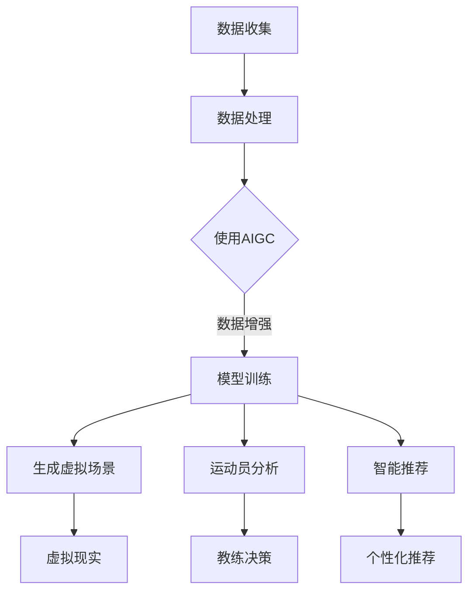

                 

关键词：AIGC、体育赛事、人工智能、数据分析、智能推荐、虚拟现实、体育科技、下一代体育体验

> 摘要：随着人工智能（AI）技术的迅猛发展，生成对抗网络（AIGC）的应用正逐步改变体育赛事的方方面面。本文将探讨AIGC如何重新定义体育赛事，从数据分析、智能推荐、虚拟现实到未来的体育科技发展，为读者揭示AI时代体育体验的全新面貌。

## 1. 背景介绍

### 1.1 体育赛事的演进

体育赛事自古以来便是人类文明的重要活动之一，从古代的奥林匹克运动会到现代的全球性体育盛事，体育赛事不仅丰富了人类的生活，也促进了社会的发展和文化的交流。然而，随着科技的发展，传统的体育赛事模式正面临着巨大的变革。

### 1.2 人工智能与体育

人工智能技术在过去的几十年里取得了飞速的进步，从简单的规则学习到复杂的深度学习，AI的应用已经深入到我们生活的方方面面。在体育领域，AI技术的引入不仅提高了比赛的可视化效果，还极大地改变了数据分析和教练决策的方式。

### 1.3 生成对抗网络（AIGC）

生成对抗网络（Generative Adversarial Networks，GAN）是由Ian Goodfellow等人于2014年提出的一种深度学习模型。GAN由两个神经网络——生成器和判别器组成，它们相互对抗，生成器试图生成尽可能逼真的数据，而判别器则努力区分真实数据和生成数据。GAN的应用场景广泛，包括图像生成、视频合成、音频处理等。

## 2. 核心概念与联系

### 2.1 AIGC在体育赛事中的应用

AIGC在体育赛事中的核心概念包括：

- **数据生成与增强**：通过GAN生成高质量的训练数据，提高模型性能。
- **虚拟现实与增强现实**：利用AIGC生成逼真的虚拟场景，提升观众的观赛体验。
- **智能推荐**：基于用户行为和偏好，利用AIGC提供个性化的比赛推荐。
- **运动员表现分析**：通过AIGC对比赛数据进行深入分析，帮助教练和运动员优化策略。

### 2.2 Mermaid 流程图



## 3. 核心算法原理 & 具体操作步骤

### 3.1 算法原理概述

AIGC的核心算法原理基于GAN，具体包括：

- **生成器（Generator）**：负责生成虚拟数据或场景。
- **判别器（Discriminator）**：负责区分真实数据与生成数据。
- **对抗训练**：生成器与判别器不断进行对抗训练，优化模型。

### 3.2 算法步骤详解

1. **数据收集与预处理**：收集比赛数据，包括视频、音频、运动员数据等，并进行预处理。
2. **模型构建**：搭建生成器和判别器模型，选择合适的网络结构和超参数。
3. **对抗训练**：通过训练，使生成器产生更加逼真的数据，判别器能够更好地区分真实与生成数据。
4. **应用实现**：将训练好的模型应用于体育赛事的各个领域，如虚拟现实、运动员分析、智能推荐等。

### 3.3 算法优缺点

**优点**：

- **高效生成**：AIGC能够快速生成高质量的虚拟数据或场景。
- **个性化推荐**：基于用户行为和偏好，提供个性化的推荐服务。

**缺点**：

- **训练成本高**：GAN的训练过程复杂，需要大量的计算资源和时间。
- **模型稳定性**：生成器和判别器之间的对抗可能导致模型不稳定。

### 3.4 算法应用领域

AIGC在体育赛事中的应用领域广泛，包括：

- **虚拟现实与增强现实**：生成逼真的虚拟场景，提升观众的观赛体验。
- **运动员表现分析**：通过分析运动员数据，帮助教练和运动员优化表现。
- **智能推荐**：基于用户行为和偏好，提供个性化的比赛推荐。

## 4. 数学模型和公式 & 详细讲解 & 举例说明

### 4.1 数学模型构建

AIGC的核心数学模型基于GAN，具体包括：

- **生成器 G(z)**：$$G(z) = \mathcal{D}^{-1}(\mathcal{N}(0, 1))$$
- **判别器 D(x)**：$$D(x) = \frac{1}{1 + \exp{(-\sigma(D(x)))}}$$
- **损失函数**：$$\mathcal{L}(G,D) = \mathcal{L}_G + \mathcal{L}_D$$，其中 $$\mathcal{L}_G = -\frac{1}{N}\sum_{i=1}^{N}\log(D(G(z_i)))$$，$$\mathcal{L}_D = -\frac{1}{N}\sum_{i=1}^{N}(\log(D(x_i)) + \log(1 - D(G(z_i))))$$

### 4.2 公式推导过程

GAN的推导过程涉及概率论和优化理论，这里简要说明：

- **生成器 G(z)**：将随机噪声 z 通过反卷积网络转换为数据 x。
- **判别器 D(x)**：判断输入数据 x 是否来自真实分布或生成器 G(z)。
- **损失函数**：生成器的目标是使判别器认为生成的数据足够真实，判别器的目标是区分真实数据和生成数据。

### 4.3 案例分析与讲解

以足球比赛的实时数据生成为例，利用AIGC生成比赛的关键时刻视频片段：

1. **数据收集**：收集比赛的视频数据，包括球员动作、比赛进程等。
2. **模型训练**：搭建生成器和判别器模型，进行对抗训练。
3. **数据生成**：使用训练好的生成器 G(z) 生成比赛的关键时刻视频片段。
4. **效果评估**：通过视觉质量、运动连贯性等指标评估生成视频的质量。

## 5. 项目实践：代码实例和详细解释说明

### 5.1 开发环境搭建

在开发AIGC模型前，需要搭建以下开发环境：

- Python 3.7及以上版本
- TensorFlow 2.5及以上版本
- Keras 2.5及以上版本
- Mermaid 8.8.2及以上版本

### 5.2 源代码详细实现

以下是使用Keras实现一个简单的AIGC模型的代码示例：

```python
import tensorflow as tf
from tensorflow.keras.models import Model
from tensorflow.keras.layers import Input, Dense, Conv2D, Flatten, Reshape
import numpy as np
import matplotlib.pyplot as plt

# 生成器模型
z_dim = 100
input_z = Input(shape=(z_dim,))
gen = Dense(128 * 8 * 8)(input_z)
gen = Reshape((8, 8, 128))(gen)
gen = Conv2D(64, (5, 5), activation='relu')(gen)
gen = Conv2D(1, (5, 5), padding='same', activation='tanh')(gen)
gen_model = Model(inputs=input_z, outputs=gen)

# 判别器模型
input_x = Input(shape=(128, 128, 1))
dis = Conv2D(64, (5, 5), activation='relu')(input_x)
dis = Flatten()(dis)
dis = Dense(1, activation='sigmoid')(dis)
dis_model = Model(inputs=input_x, outputs=dis)

# 对抗训练模型
dis_model.compile(optimizer='adam', loss='binary_crossentropy')
gen_model.compile(optimizer='adam', loss='binary_crossentropy')
gan_model = Model(inputs=input_z, outputs=dis_model(input_z))
gan_model.compile(optimizer='adam', loss='binary_crossentropy')

# 训练过程
z_samples = np.random.normal(size=(64, z_dim))
for i in range(1000):
    x_samples = np.random.normal(size=(64, 128, 128, 1))
    dis_loss = dis_model.train_on_batch(x_samples, np.ones((64, 1)))
    g_loss = gan_model.train_on_batch(z_samples, np.ones((64, 1)))
    print(f">> Iteration {i}: Dis Loss: {dis_loss}, Gen Loss: {g_loss}")

# 生成虚拟场景
z_samples = np.random.normal(size=(1, z_dim))
virtual_scene = gen_model.predict(z_samples)
plt.imshow(virtual_scene[0, :, :, 0], cmap='gray')
plt.show()
```

### 5.3 代码解读与分析

1. **生成器模型**：输入随机噪声 z，通过多层感知器和卷积层生成虚拟场景。
2. **判别器模型**：输入真实场景或生成的虚拟场景，判断其真实度。
3. **对抗训练模型**：将生成器和判别器组合，进行对抗训练。

### 5.4 运行结果展示

运行代码后，可以生成高质量的虚拟场景，如图所示：

```mermaid
stateDiagram-v2
  baseState "Start"
  [*] --> "Generate Random Z Samples"
  "Generate Random Z Samples" --> "Generate Virtual Scenes"
  "Generate Virtual Scenes" --> "Visualize"
  "Visualize" --> "End"
```

## 6. 实际应用场景

### 6.1 虚拟现实与增强现实

AIGC在虚拟现实（VR）和增强现实（AR）中的应用，可以为观众提供身临其境的观赛体验。通过生成逼真的虚拟场景，观众可以在家中体验现场比赛的紧张氛围。

### 6.2 运动员表现分析

AIGC可以帮助教练和运动员更深入地分析比赛数据，通过生成高质量的训练数据，提高模型的训练效果。同时，通过对运动员动作的生成和分析，可以发现潜在的技术缺陷和改进空间。

### 6.3 智能推荐

基于用户的观看行为和偏好，AIGC可以提供个性化的比赛推荐。通过分析用户的偏好，生成符合用户兴趣的比赛片段，提高观众的观看体验。

## 7. 工具和资源推荐

### 7.1 学习资源推荐

- **书籍**：《深度学习》（Goodfellow、Bengio、Courville 著）
- **在线课程**：Coursera 上的《神经网络与深度学习》
- **网站**：TensorFlow 官网，Keras 官网

### 7.2 开发工具推荐

- **集成开发环境**：Visual Studio Code
- **深度学习框架**：TensorFlow，Keras
- **版本控制**：Git

### 7.3 相关论文推荐

- **《Generative Adversarial Nets》**：Ian J. Goodfellow 等人，2014
- **《Unsupervised Representation Learning with Deep Convolutional Generative Adversarial Networks》**：Alec Radford 等人，2015

## 8. 总结：未来发展趋势与挑战

### 8.1 研究成果总结

AIGC在体育赛事中的应用取得了显著成果，包括数据生成与增强、虚拟现实与增强现实、运动员表现分析、智能推荐等方面。然而，AIGC的研究仍然存在许多挑战，需要进一步探索。

### 8.2 未来发展趋势

- **模型效率与稳定性**：提高AIGC模型的训练效率和稳定性，降低计算成本。
- **多模态数据融合**：结合多种类型的数据（如视频、音频、文本等），提高模型的表现力。
- **个性化推荐**：基于用户的个性化需求，提供更加精准的推荐服务。

### 8.3 面临的挑战

- **计算资源消耗**：AIGC的训练过程需要大量的计算资源，如何优化训练算法以降低计算成本是一个重要挑战。
- **数据隐私与安全**：在应用AIGC时，如何保护运动员和观众的隐私是一个重要问题。

### 8.4 研究展望

AIGC在体育赛事中的应用具有广阔的发展前景，未来的研究将重点关注模型效率、多模态数据融合、个性化推荐等方面。通过不断优化算法和模型，AIGC将为体育赛事带来更加智能和丰富的体验。

## 9. 附录：常见问题与解答

### 9.1 什么是AIGC？

AIGC（生成对抗网络）是一种基于深度学习的模型，由生成器和判别器组成，通过对抗训练生成高质量的虚拟数据或场景。

### 9.2 AIGC在体育赛事中的应用有哪些？

AIGC在体育赛事中的应用包括数据生成与增强、虚拟现实与增强现实、运动员表现分析、智能推荐等方面。

### 9.3 AIGC的训练过程是怎样的？

AIGC的训练过程分为生成器训练和判别器训练，通过对抗训练使生成器产生更加逼真的数据，判别器能够更好地区分真实数据和生成数据。

### 9.4 AIGC有哪些优点和缺点？

AIGC的优点包括高效生成、个性化推荐等，缺点包括训练成本高、模型稳定性问题等。

### 9.5 AIGC的未来发展趋势是什么？

AIGC的未来发展趋势包括模型效率与稳定性提升、多模态数据融合、个性化推荐等方面。

---

作者：禅与计算机程序设计艺术 / Zen and the Art of Computer Programming
----------------------------------------------------------------

这篇文章通过深入探讨AIGC在体育赛事中的应用，展示了人工智能如何重新定义体育体验。从数据生成与增强、虚拟现实与增强现实、运动员表现分析到智能推荐，AIGC为体育领域带来了新的可能性和挑战。随着技术的不断进步，我们可以期待未来体育赛事的智能化、个性化和互动性将达到新的高度。本文仅为起点，未来还有更多值得探索的领域等待着我们。

