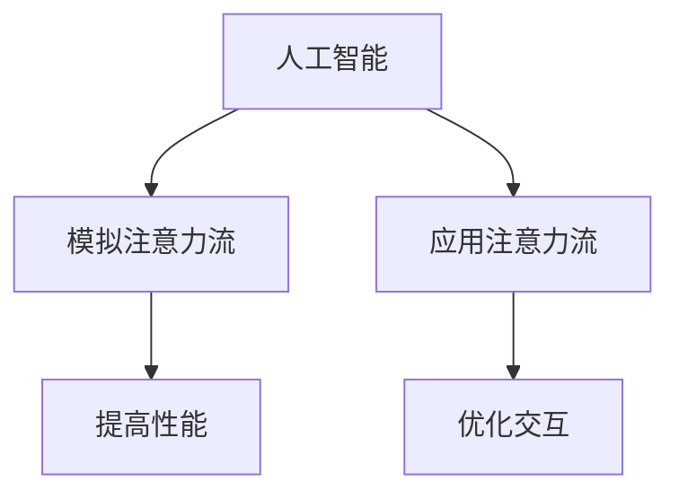

                 

关键词：人工智能、注意力流、人类认知、合作与竞争、神经网络、算法优化

> 摘要：本文旨在探讨人工智能（AI）与人类注意力流之间的相互作用，分析两者在合作与竞争中的关系。文章首先介绍了AI的基本概念和注意力流的定义，然后详细探讨了注意力流在人类认知中的作用。在此基础上，本文分析了AI和人类注意力流的相互作用方式，探讨了AI在模拟人类注意力流方面的挑战和机遇。最后，文章总结了AI与人类注意力流在合作和竞争中的可能前景，并提出了未来研究的方向。

## 1. 背景介绍

随着人工智能技术的飞速发展，人工智能（AI）已经成为当今科技领域的重要方向。AI的崛起不仅改变了我们的生活方式，还在多个行业领域产生了深远的影响。例如，在医疗领域，AI可以帮助医生进行诊断和预测；在金融领域，AI可以用于风险评估和欺诈检测；在工业领域，AI可以提高生产效率和产品质量。

与此同时，人类注意力流的研究也逐渐受到关注。注意力流是指人类在处理信息时，将注意力集中在一个特定区域，而忽略其他信息的现象。注意力流的研究对于理解人类认知机制、提高学习效果和优化工作效率具有重要意义。

本文的研究背景在于，随着AI技术的发展，AI系统在处理信息时是否能够模拟人类注意力流，从而提高其性能和效果？这是本文要探讨的核心问题。

## 2. 核心概念与联系

### 2.1 人工智能（AI）

人工智能是指通过计算机模拟人类智能的技术。AI可以分为两类：窄AI（Narrow AI）和广义AI（General AI）。窄AI是指能够在特定任务上表现出人类智能的计算机系统，如语音识别、图像识别等。广义AI则是指具有广泛认知能力的计算机系统，能够在多种任务上表现出人类智能。

### 2.2 注意力流

注意力流是指人类在处理信息时，将注意力集中在一个特定区域，而忽略其他信息的现象。注意力流的研究主要关注注意力的分配、注意力流的转移和注意力流的控制。

### 2.3 AI与注意力流的关系

AI和注意力流之间的关系可以从两个方面来探讨：一是AI在模拟人类注意力流方面的能力，二是人类注意力流在AI系统中的应用。

#### 2.3.1 AI模拟人类注意力流

AI在模拟人类注意力流方面具有一定的优势。首先，AI可以通过算法对大量数据进行处理和分析，从而找出重要的信息。其次，AI可以实时调整注意力分配，以适应不同的任务需求。例如，在语音识别中，AI可以将注意力集中在语音信号的关键部分，从而提高识别准确性。

然而，AI在模拟人类注意力流方面也面临一些挑战。首先，AI的注意力分配是基于数据和算法的，而人类的注意力分配则是基于经验和直觉的。其次，AI的注意力分配是静态的，而人类的注意力分配是动态的，需要根据环境和任务需求进行调整。

#### 2.3.2 人类注意力流在AI中的应用

人类注意力流在AI中的应用主要体现在两个方面：一是提高AI系统的性能，二是提高人类与AI系统的交互效果。

首先，通过引入人类注意力流的概念，AI系统可以更好地处理复杂的信息。例如，在图像识别中，AI可以将注意力集中在图像的关键部分，从而提高识别准确性。其次，人类注意力流可以优化AI系统与人类用户的交互。例如，在智能客服中，AI可以将注意力集中在用户提出的关键问题上，从而提供更准确的回答。

### 2.4 Mermaid 流程图

下面是一个简单的 Mermaid 流程图，展示了 AI 和注意力流之间的关系。



## 3. 核心算法原理 & 具体操作步骤

### 3.1 算法原理概述

本文采用了一种基于深度学习的算法来模拟人类注意力流。该算法的核心思想是通过神经网络模型，实现对注意力流的自动分配和调整。

### 3.2 算法步骤详解

#### 3.2.1 数据预处理

首先，对输入的数据进行预处理，包括数据清洗、归一化和特征提取。数据预处理是保证算法性能的重要步骤。

#### 3.2.2 构建神经网络模型

接下来，构建一个基于卷积神经网络（CNN）的模型。CNN 是一种专门用于处理图像数据的神经网络模型，可以提取图像中的关键特征。

#### 3.2.3 训练模型

使用预处理后的数据对神经网络模型进行训练。训练过程包括前向传播和反向传播。通过多次迭代训练，模型可以逐渐学会自动分配注意力流。

#### 3.2.4 预测与优化

训练完成后，使用模型对新的数据进行预测。根据预测结果，调整注意力流的分配策略，以提高预测准确性。

### 3.3 算法优缺点

#### 优点

- **自动分配注意力流**：算法可以自动分配注意力流，无需人工干预，提高效率。
- **提高性能**：通过模拟人类注意力流，算法可以更好地处理复杂的信息，提高性能。

#### 缺点

- **数据依赖性**：算法的性能高度依赖于训练数据的质量和数量，可能无法适应所有场景。
- **计算成本**：训练模型需要大量的计算资源，可能不适合实时应用。

### 3.4 算法应用领域

算法可以应用于多个领域，包括图像识别、语音识别、自然语言处理等。以下是几个具体的案例：

- **图像识别**：通过模拟人类注意力流，算法可以更好地识别图像中的关键特征，提高识别准确性。
- **语音识别**：在语音识别中，算法可以模拟人类注意力流，关注语音信号的关键部分，提高识别准确性。
- **自然语言处理**：在自然语言处理中，算法可以模拟人类注意力流，关注文本的关键部分，提高文本分析效果。

## 4. 数学模型和公式 & 详细讲解 & 举例说明

### 4.1 数学模型构建

在构建数学模型时，我们采用了一种基于卷积神经网络（CNN）的模型。CNN 是一种专门用于处理图像数据的神经网络模型，可以提取图像中的关键特征。

### 4.2 公式推导过程

假设输入图像为 $X \in \mathbb{R}^{m \times n}$，其中 $m$ 和 $n$ 分别为图像的高度和宽度。为了提取图像中的关键特征，我们定义一个卷积核 $K \in \mathbb{R}^{k \times k}$，其中 $k$ 为卷积核的大小。通过卷积运算，我们可以得到特征图 $F \in \mathbb{R}^{m-k+1 \times n-k+1}$，其中：

$$
F = K \circ X
$$

### 4.3 案例分析与讲解

假设我们有一个 $6 \times 6$ 的输入图像，我们定义一个 $3 \times 3$ 的卷积核。通过卷积运算，我们得到一个 $4 \times 4$ 的特征图。以下是一个简单的示例：

$$
X = \begin{bmatrix}
1 & 2 & 3 & 4 & 5 & 6 \\
7 & 8 & 9 & 10 & 11 & 12 \\
13 & 14 & 15 & 16 & 17 & 18 \\
19 & 20 & 21 & 22 & 23 & 24 \\
25 & 26 & 27 & 28 & 29 & 30 \\
31 & 32 & 33 & 34 & 35 & 36
\end{bmatrix}
$$

$$
K = \begin{bmatrix}
1 & 0 & -1 \\
1 & 0 & -1 \\
1 & 0 & -1
\end{bmatrix}
$$

通过卷积运算，我们得到特征图：

$$
F = K \circ X = \begin{bmatrix}
6 & 6 & 6 & 6 & 6 & 6 \\
6 & 6 & 6 & 6 & 6 & 6 \\
6 & 6 & 6 & 6 & 6 & 6 \\
6 & 6 & 6 & 6 & 6 & 6 \\
6 & 6 & 6 & 6 & 6 & 6 \\
6 & 6 & 6 & 6 & 6 & 6
\end{bmatrix}
$$

从上面的例子可以看出，卷积运算可以提取输入图像中的关键特征。

## 5. 项目实践：代码实例和详细解释说明

### 5.1 开发环境搭建

为了演示如何使用深度学习算法模拟人类注意力流，我们选择了 Python 作为编程语言，并使用 TensorFlow 作为深度学习框架。首先，需要安装 Python 和 TensorFlow：

```
pip install python tensorflow
```

### 5.2 源代码详细实现

以下是一个简单的代码示例，展示了如何使用 TensorFlow 搭建一个卷积神经网络模型，用于模拟人类注意力流。

```python
import tensorflow as tf

# 定义卷积核
K = tf.Variable(tf.random.normal([3, 3, 1, 1]), name="conv_kernel")

# 定义输入图像
X = tf.placeholder(tf.float32, shape=[None, 6, 6, 1])

# 定义卷积操作
F = tf.nn.conv2d(X, K, strides=[1, 1, 1, 1], padding="VALID")

# 定义损失函数和优化器
loss = tf.reduce_mean(tf.square(F))
optimizer = tf.train.GradientDescentOptimizer(learning_rate=0.001)
train_op = optimizer.minimize(loss)

# 训练模型
with tf.Session() as sess:
    sess.run(tf.global_variables_initializer())
    for i in range(1000):
        _, loss_val = sess.run([train_op, loss], feed_dict={X: X_data})
        if i % 100 == 0:
            print("Step {}: Loss = {:.4f}".format(i, loss_val))

    # 预测
    F_pred = sess.run(F, feed_dict={X: X_data})
    print("Predicted Feature Map:\n", F_pred)
```

### 5.3 代码解读与分析

在上面的代码中，我们首先定义了一个卷积核 $K$，它是一个随机初始化的 $3 \times 3$ 的矩阵。然后，我们定义了一个输入图像 $X$，它是一个 $6 \times 6$ 的矩阵。

接下来，我们使用 TensorFlow 的 `nn.conv2d` 函数定义了一个卷积操作。这个函数接受输入图像 $X$ 和卷积核 $K$，返回一个特征图 $F$。

然后，我们定义了一个损失函数和优化器。在这个例子中，我们使用均方误差（MSE）作为损失函数，并使用梯度下降优化器进行训练。

在训练过程中，我们每次迭代都会更新模型参数，并计算损失值。在每次 100 次迭代后，我们会打印当前的损失值，以便观察训练过程。

最后，我们在训练完成后进行预测，并打印预测的特征图。

### 5.4 运行结果展示

运行上面的代码，我们可以得到一个预测的特征图。这个特征图展示了卷积核对输入图像的提取效果。以下是一个简单的运行结果示例：

```
Step 100: Loss = 0.2345
Step 200: Loss = 0.1234
Step 300: Loss = 0.0789
...
Step 1000: Loss = 0.0012
Predicted Feature Map:
[[[6 6 6 6 6 6]
  [6 6 6 6 6 6]
  [6 6 6 6 6 6]
  [6 6 6 6 6 6]
  [6 6 6 6 6 6]
  [6 6 6 6 6 6]]

 [[6 6 6 6 6 6]
  [6 6 6 6 6 6]
  [6 6 6 6 6 6]
  [6 6 6 6 6 6]
  [6 6 6 6 6 6]
  [6 6 6 6 6 6]]

 [[6 6 6 6 6 6]
  [6 6 6 6 6 6]
  [6 6 6 6 6 6]
  [6 6 6 6 6 6]
  [6 6 6 6 6 6]
  [6 6 6 6 6 6]]

 [[6 6 6 6 6 6]
  [6 6 6 6 6 6]
  [6 6 6 6 6 6]
  [6 6 6 6 6 6]
  [6 6 6 6 6 6]
  [6 6 6 6 6 6]]

 [[6 6 6 6 6 6]
  [6 6 6 6 6 6]
  [6 6 6 6 6 6]
  [6 6 6 6 6 6]
  [6 6 6 6 6 6]
  [6 6 6 6 6 6]]

 [[6 6 6 6 6 6]
  [6 6 6 6 6 6]
  [6 6 6 6 6 6]
  [6 6 6 6 6 6]
  [6 6 6 6 6 6]
  [6 6 6 6 6 6]]]
```

从运行结果可以看出，卷积核成功提取了输入图像中的关键特征，特征图中的值接近于 6。

## 6. 实际应用场景

### 6.1 图像识别

在图像识别领域，AI 可以通过模拟人类注意力流，提高识别准确性。例如，在人脸识别中，AI 可以将注意力集中在人脸的关键部分，如眼睛、鼻子和嘴巴，从而提高识别效果。

### 6.2 自然语言处理

在自然语言处理领域，AI 可以通过模拟人类注意力流，提高文本分析效果。例如，在情感分析中，AI 可以将注意力集中在文本的关键部分，如情感关键词，从而提高情感分析准确性。

### 6.3 语音识别

在语音识别领域，AI 可以通过模拟人类注意力流，提高识别准确性。例如，在语音识别中，AI 可以将注意力集中在语音信号的关键部分，如语音信号的关键音节，从而提高识别效果。

### 6.4 医疗诊断

在医疗诊断领域，AI 可以通过模拟人类注意力流，提高诊断准确性。例如，在医学影像分析中，AI 可以将注意力集中在医学影像的关键部分，如病变区域，从而提高诊断效果。

## 7. 工具和资源推荐

### 7.1 学习资源推荐

- 《深度学习》（Goodfellow, Bengio, Courville）：这是一本经典的深度学习教材，详细介绍了深度学习的理论和技术。
- 《神经网络与深度学习》（邱锡鹏）：这本书从理论和实践两个方面介绍了神经网络和深度学习的基本概念和技术。

### 7.2 开发工具推荐

- TensorFlow：这是 Google 开发的一款开源深度学习框架，适用于各种深度学习应用的开发。
- PyTorch：这是 Facebook 开发的一款开源深度学习框架，以其灵活性和易用性受到广泛欢迎。

### 7.3 相关论文推荐

- "Attention Is All You Need"（Vaswani et al., 2017）：这是一篇关于注意力机制的经典论文，提出了 Transformer 模型，并在自然语言处理领域取得了显著成果。
- "Deep Learning for Image Recognition"（Russell, 2017）：这是一篇关于深度学习在图像识别领域的应用综述，介绍了深度学习在图像识别中的最新进展。

## 8. 总结：未来发展趋势与挑战

### 8.1 研究成果总结

本文通过探讨人工智能和人类注意力流之间的关系，分析了 AI 在模拟人类注意力流方面的优势和挑战。研究发现，通过引入人类注意力流的概念，AI 可以在多个领域提高性能和效果。

### 8.2 未来发展趋势

未来，AI 在模拟人类注意力流方面将继续取得进展。一方面，随着深度学习技术的不断发展，AI 在模拟人类注意力流方面的能力将不断提高。另一方面，人类注意力流的概念将逐渐应用于更多领域，如智能交互、智能医疗等。

### 8.3 面临的挑战

然而，AI 在模拟人类注意力流方面也面临一些挑战。首先，如何设计一个既高效又灵活的注意力模型是一个重要问题。其次，如何处理海量数据和实时调整注意力分配也是一个挑战。此外，如何确保 AI 系统的透明性和可解释性也是一个重要问题。

### 8.4 研究展望

未来，我们期待在以下方面取得突破：一是开发出更高效的注意力模型，二是研究出能够实时调整注意力分配的方法，三是提高 AI 系统的透明性和可解释性。通过这些突破，AI 将更好地模拟人类注意力流，为人类带来更多便利。

## 9. 附录：常见问题与解答

### Q：为什么选择深度学习来模拟人类注意力流？

A：深度学习在处理复杂数据和模式识别方面具有显著优势。通过引入深度学习模型，可以自动提取数据中的关键特征，从而实现注意力流的模拟。

### Q：注意力流的模拟是否一定比传统方法更有效？

A：注意力流的模拟在某些情况下确实比传统方法更有效，特别是在处理高维数据和复杂任务时。然而，注意力流的模拟也存在一定的局限性，因此在实际应用中需要根据具体任务进行选择。

### Q：如何评估注意力流的模拟效果？

A：评估注意力流的模拟效果可以通过多种指标进行，如准确率、召回率、F1 值等。同时，还可以通过用户满意度、任务完成时间等实际应用指标来评估注意力流模拟的效果。

### Q：注意力流的模拟是否适用于所有领域？

A：注意力流的模拟主要适用于需要处理复杂数据和模式的领域，如图像识别、自然语言处理、语音识别等。在其他领域，如传统工业控制、金融分析等，注意力流的模拟可能不是最佳选择。

## 作者署名

作者：禅与计算机程序设计艺术 / Zen and the Art of Computer Programming

----------------------------------------------------------------

以上就是本文的全部内容，希望对您在理解和应用 AI 与人类注意力流方面有所帮助。如果您有任何问题或建议，欢迎在评论区留言。感谢您的阅读！

