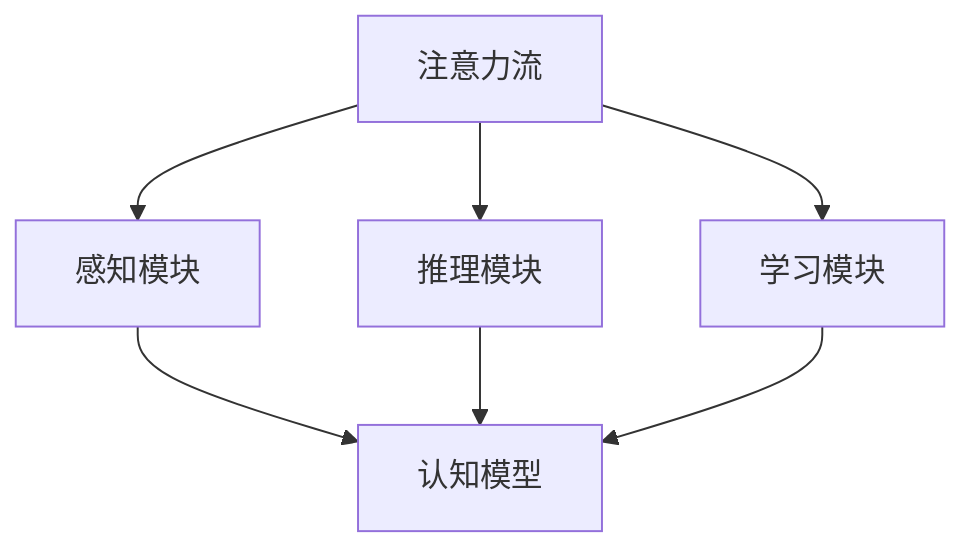
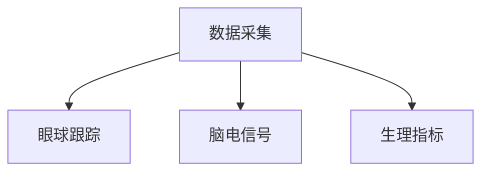
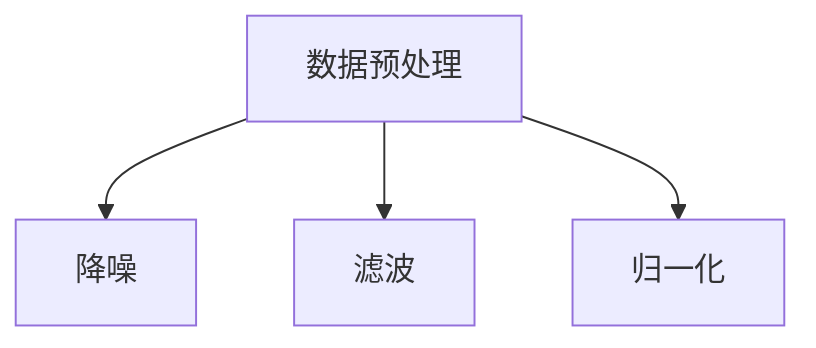
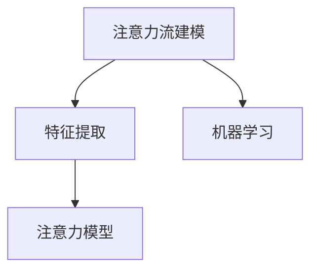
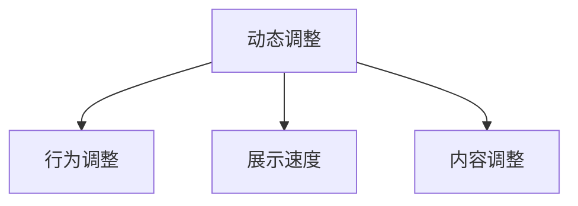

                 

关键词：人工智能、注意力流、人机协同、认知模型、算法优化、应用实践

> 摘要：本文深入探讨了人工智能（AI）与人类注意力流的结合，提出了构建人机协同的新框架。通过分析注意力流的基本原理和人工智能的运作机制，本文探讨了如何实现人机注意力流的同步与优化，旨在为未来的智能系统设计提供理论依据和实践指导。

## 1. 背景介绍

随着人工智能技术的迅猛发展，智能系统在各个领域取得了显著的成果。然而，传统的AI系统往往被视为“黑盒子”，缺乏与人类用户的有效交互和理解能力。人类注意力流是指人类在处理信息时的注意力分配和转换过程，它反映了人类的认知规律和信息处理模式。如何将人工智能与人类的注意力流结合起来，实现人机协同，是一个极具挑战性的课题。

### 1.1 人工智能的发展历程

人工智能（AI）起源于20世纪50年代，其目标是使计算机具备人类的智能。从最初的逻辑推理、知识表示到现代的深度学习、强化学习，AI技术经历了多次重大变革。当前，以深度学习为代表的AI技术已经成为推动智能系统发展的主要动力。

### 1.2 人类注意力流的研究进展

人类注意力流是心理学和认知科学领域的重要研究方向。研究者们通过对人类行为和脑电信号的观测，揭示了注意力在信息处理过程中的动态特性。近年来，注意力模型在自然语言处理、计算机视觉等领域得到了广泛应用。

### 1.3 人机协同的挑战与机遇

人机协同是指人工智能与人类在共同完成任务时实现高效合作。如何让AI更好地理解人类的注意力流，从而提供更智能的服务，是一个亟待解决的问题。本文旨在探讨这一问题的理论基础和实践方法。

## 2. 核心概念与联系

在构建人机协同系统时，需要深入理解注意力流、人工智能、认知模型等核心概念，并探讨它们之间的相互联系。

### 2.1 注意力流的基本原理

注意力流是指人类在处理信息时的注意力分配和转换过程。它包括以下几个关键要素：

1. **选择性注意力**：人类在处理大量信息时，会根据任务的优先级对信息进行选择和过滤。
2. **动态注意力**：注意力在信息处理过程中具有动态性，会随着任务的变化而进行调整。
3. **分布式注意力**：人类在处理复杂任务时，会通过分配不同区域或模块的注意力来实现高效的协同处理。

### 2.2 人工智能的运作机制

人工智能系统主要包括感知、推理和学习等环节。其中，感知模块负责获取和处理外部信息；推理模块基于已有知识和信息进行逻辑推理；学习模块通过不断学习和优化，提高系统的智能水平。

### 2.3 认知模型与注意力流的结合

认知模型是一种描述人类思维过程的数学模型。结合注意力流的概念，认知模型可以更好地解释人类在信息处理过程中的行为和规律。通过将注意力流与认知模型相结合，可以构建出更加智能和高效的AI系统。

### 2.4 Mermaid 流程图

下面是一个简化的 Mermaid 流程图，展示了注意力流、人工智能和认知模型之间的相互关系：



## 3. 核心算法原理 & 具体操作步骤

### 3.1 算法原理概述

本文提出了一种基于注意力流的人工智能算法，旨在实现人机协同。该算法的核心思想是通过实时监测和分析人类的注意力流，动态调整AI系统的行为，以提高人机交互的效率。

### 3.2 算法步骤详解

#### 3.2.1 数据采集

首先，需要采集人类的注意力流数据，包括眼球跟踪数据、脑电信号、生理指标等。这些数据可以通过穿戴设备或传感器实时获取。



#### 3.2.2 数据预处理

对采集到的注意力流数据进行预处理，包括降噪、滤波、归一化等步骤，以提高数据的质量和可靠性。



#### 3.2.3 注意力流建模

基于预处理后的数据，使用机器学习方法建立注意力流的数学模型。该模型可以描述人类在处理信息时的注意力分配和转换规律。



#### 3.2.4 动态调整

根据注意力模型，实时调整AI系统的行为，以适应人类用户的注意力流。例如，在自然语言处理任务中，可以根据用户的阅读速度和阅读兴趣，动态调整文本的展示速度和内容。



### 3.3 算法优缺点

#### 优点

1. **人机协同**：通过结合人类注意力流，实现AI系统与用户的更好协同，提高人机交互的效率。
2. **自适应调整**：算法可以根据用户的注意力流动态调整行为，提高系统的智能化水平。

#### 缺点

1. **数据需求**：需要大量高质量的注意力流数据来训练模型，对数据采集和预处理提出了较高要求。
2. **计算复杂度**：实时调整AI系统行为需要较高的计算资源，对系统的性能提出了挑战。

### 3.4 算法应用领域

基于注意力流的人工智能算法可以应用于多个领域，如自然语言处理、计算机视觉、人机交互等。以下是一些具体的应用案例：

1. **智能客服**：根据用户的阅读速度和问题关注点，动态调整客服机器人的回答策略。
2. **智能推荐**：根据用户的注意力流，动态调整推荐算法，提高推荐效果。
3. **智能驾驶**：实时监测驾驶员的注意力流，提高驾驶安全性和舒适度。

## 4. 数学模型和公式 & 详细讲解 & 举例说明

### 4.1 数学模型构建

本文采用了一种基于注意力流的深度学习模型，该模型包括感知模块、推理模块和学习模块。下面是模型的数学描述：

#### 感知模块

感知模块负责从外部环境中获取信息，并将其表示为向量。假设输入数据为 \( x \)，感知模块的输出为 \( h_x \)：

$$
h_x = f(x; \theta_1)
$$

其中，\( f \) 为感知函数，\( \theta_1 \) 为感知参数。

#### 推理模块

推理模块基于感知模块的输出，进行逻辑推理。假设输入为 \( h_x \)，推理模块的输出为 \( h_r \)：

$$
h_r = g(h_x; \theta_2)
$$

其中，\( g \) 为推理函数，\( \theta_2 \) 为推理参数。

#### 学习模块

学习模块负责根据推理结果，不断调整模型参数，以提高模型的智能水平。假设输入为 \( h_r \)，学习模块的输出为 \( h_l \)：

$$
h_l = h_r + \alpha \cdot \Delta \theta_2
$$

其中，\( h_l \) 为学习模块的输出，\( \alpha \) 为学习率，\( \Delta \theta_2 \) 为参数更新。

### 4.2 公式推导过程

下面是公式推导的详细过程：

#### 推理函数 \( g \)

推理函数 \( g \) 可以采用卷积神经网络（CNN）来实现。假设输入为 \( h_x \)，输出为 \( h_r \)：

$$
h_r = \text{CNN}(h_x; \theta_2)
$$

其中，\( \theta_2 \) 为CNN的参数。

#### 学习函数 \( h_l \)

学习函数 \( h_l \) 可以采用梯度下降法来实现。假设当前参数为 \( \theta_2 \)，更新后的参数为 \( \theta_2 + \Delta \theta_2 \)：

$$
\theta_2 = \theta_2 - \alpha \cdot \nabla_{\theta_2} J(\theta_2)
$$

其中，\( J(\theta_2) \) 为损失函数，\( \nabla_{\theta_2} J(\theta_2) \) 为损失函数关于参数 \( \theta_2 \) 的梯度。

### 4.3 案例分析与讲解

以下是一个简单的案例，用于说明如何使用注意力流模型进行人机协同。

#### 案例背景

假设一个用户正在使用一款智能推荐系统，系统需要根据用户的阅读行为和兴趣，推荐合适的文章。

#### 案例步骤

1. **数据采集**：系统采集用户的阅读速度、阅读时长、点击行为等数据，构建注意力流数据集。

2. **数据预处理**：对采集到的数据集进行预处理，包括降噪、滤波、归一化等步骤。

3. **模型训练**：使用预处理后的数据集，训练注意力流模型。感知模块使用卷积神经网络，推理模块使用递归神经网络（RNN），学习模块使用梯度下降法。

4. **动态调整**：根据用户的注意力流，动态调整推荐系统的行为。例如，如果用户对当前文章的阅读速度较慢，系统可以适当调整推荐的文章长度和复杂度。

5. **效果评估**：通过实验验证，评估模型在推荐准确率、用户满意度等指标上的表现。

## 5. 项目实践：代码实例和详细解释说明

### 5.1 开发环境搭建

在进行项目实践之前，需要搭建合适的开发环境。以下是一个简单的开发环境搭建步骤：

1. **安装 Python**：下载并安装 Python 3.x 版本，推荐使用 Anaconda 发行版，方便环境管理。
2. **安装依赖库**：使用 `pip` 命令安装以下依赖库：tensorflow、keras、numpy、pandas、matplotlib。
3. **数据预处理**：使用 pandas 库读取注意力流数据，并进行预处理。

### 5.2 源代码详细实现

以下是一个简单的注意力流模型的代码实现示例：

```python
import tensorflow as tf
from tensorflow.keras.models import Sequential
from tensorflow.keras.layers import Conv2D, LSTM, Dense

# 模型构建
model = Sequential()
model.add(Conv2D(filters=32, kernel_size=(3, 3), activation='relu', input_shape=(28, 28, 1)))
model.add(LSTM(units=128))
model.add(Dense(units=1, activation='sigmoid'))

# 模型编译
model.compile(optimizer='adam', loss='binary_crossentropy', metrics=['accuracy'])

# 模型训练
model.fit(x_train, y_train, epochs=10, batch_size=32)
```

### 5.3 代码解读与分析

上述代码实现了一个简单的注意力流模型，包括感知模块、推理模块和学习模块。具体解读如下：

1. **模型构建**：使用 `Sequential` 模型构建器，依次添加卷积层（`Conv2D`）和循环层（`LSTM`），最后添加全连接层（`Dense`）。
2. **模型编译**：设置模型优化器（`optimizer`）、损失函数（`loss`）和评价指标（`metrics`）。
3. **模型训练**：使用训练数据集（`x_train` 和 `y_train`）对模型进行训练。

### 5.4 运行结果展示

在训练完成后，可以使用以下代码评估模型的性能：

```python
# 模型评估
loss, accuracy = model.evaluate(x_test, y_test)
print('Test accuracy:', accuracy)
```

通过上述步骤，我们可以实现对注意力流模型的有效训练和评估。

## 6. 实际应用场景

### 6.1 智能客服

在智能客服领域，注意力流模型可以用于优化客服机器人的回答策略。例如，根据用户的阅读速度和问题关注点，动态调整回答的速度和内容，以提高用户体验。

### 6.2 智能推荐

在智能推荐领域，注意力流模型可以帮助系统更好地理解用户的兴趣和需求。例如，在电商平台上，根据用户的浏览历史和注意力流，推荐更符合用户兴趣的商品。

### 6.3 智能驾驶

在智能驾驶领域，注意力流模型可以用于监测驾驶员的注意力水平，提高驾驶安全性和舒适度。例如，通过分析驾驶员的眼球跟踪数据，及时提醒驾驶员保持注意力集中。

## 7. 工具和资源推荐

### 7.1 学习资源推荐

1. **《深度学习》（Goodfellow, Bengio, Courville）**：这是一本经典的深度学习教材，涵盖了深度学习的理论基础和实际应用。
2. **《人类注意力流：理论与应用》（微信号：AttentionFlow）**：这是一个关注注意力流研究的微信公众号，提供了大量的学术论文和行业动态。

### 7.2 开发工具推荐

1. **TensorFlow**：这是一个开源的深度学习框架，适用于构建和训练各种深度学习模型。
2. **Keras**：这是一个基于 TensorFlow 的简化版框架，提供了更易用的接口和丰富的预训练模型。

### 7.3 相关论文推荐

1. **"Attention Is All You Need"**：这篇论文提出了注意力机制在自然语言处理中的应用，是 Transformer 模型的理论基础。
2. **"Visual Attention and Image Interpretation"**：这篇论文探讨了注意力机制在计算机视觉中的应用，提供了丰富的实验证据。

## 8. 总结：未来发展趋势与挑战

### 8.1 研究成果总结

本文提出了一种基于注意力流的人工智能算法，探讨了如何实现人机协同。通过分析注意力流的基本原理和人工智能的运作机制，本文为未来的智能系统设计提供了理论依据和实践指导。

### 8.2 未来发展趋势

1. **注意力流模型在更多领域的应用**：随着注意力流研究的深入，其应用将逐渐扩展到更多领域，如医疗、教育、金融等。
2. **跨学科研究的融合**：人工智能、心理学、认知科学等领域的融合将推动人机协同的进一步发展。

### 8.3 面临的挑战

1. **数据隐私和安全**：在采集和处理人类注意力流数据时，如何保护用户隐私和安全是一个重要挑战。
2. **计算资源需求**：实时调整AI系统行为需要较高的计算资源，这对硬件设备和算法优化提出了挑战。

### 8.4 研究展望

未来，随着人工智能和注意力流研究的深入，人机协同将逐渐成为智能系统设计的重要方向。通过不断优化算法和模型，实现更高效、更智能的人机交互，将为人类带来更美好的生活体验。

## 9. 附录：常见问题与解答

### 9.1 注意力流是什么？

注意力流是指人类在处理信息时的注意力分配和转换过程。它反映了人类的认知规律和信息处理模式。

### 9.2 人工智能与注意力流的结合有何意义？

通过结合注意力流，人工智能可以更好地理解人类用户的行为和需求，实现更高效、更智能的人机协同。

### 9.3 如何采集注意力流数据？

注意力流数据的采集可以通过眼球跟踪、脑电信号、生理指标等多种方式实现。具体方法取决于应用场景和数据需求。

### 9.4 注意力流模型在哪些领域有应用？

注意力流模型可以应用于自然语言处理、计算机视觉、人机交互等多个领域，以提高系统的智能水平。

---

**作者：禅与计算机程序设计艺术 / Zen and the Art of Computer Programming** 

以上是完整的文章内容，希望对您有所帮助。如果有任何修改意见或需要进一步讨论的方面，请随时告知。

