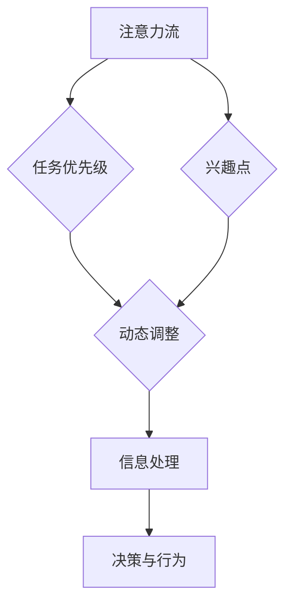

                 

关键词：人工智能，注意力流，人机融合，未来趋势，技术挑战

摘要：本文深入探讨了人工智能与人类注意力流的相互作用及其对人机融合未来可能产生的影响。通过详细阐述注意力流的概念，分析人工智能如何捕捉和模拟人类注意力，进而提出构建人机融合系统的技术框架和策略。文章旨在为研究人员和工程师提供一个全面的指南，以实现更高效、更自然的人机交互体验。

## 1. 背景介绍

随着人工智能技术的迅猛发展，人类对于机器智能的依赖日益加深。从简单的自然语言处理到复杂的图像识别和决策支持系统，人工智能已经渗透到我们生活的方方面面。然而，尽管人工智能在处理大量数据和执行复杂任务方面表现出色，但它们仍然无法完全替代人类的智慧和直觉。人类注意力流作为人类认知的核心部分，其对于信息处理和理解的重要性不言而喻。

注意力流是指人类在处理信息时，根据任务的优先级和兴趣点，动态调整注意力分配的过程。这种动态调整不仅影响我们对信息的感知和理解，还直接影响我们的决策和行为。然而，传统的计算机系统通常缺乏对注意力流的准确捕捉和模拟，导致人机交互效率低下，用户体验不尽如人意。

本文旨在探讨如何通过人工智能技术来捕捉和模拟人类注意力流，进而打造出更加自然和高效的人机融合系统。首先，我们将介绍注意力流的概念和原理，然后分析人工智能技术在这一领域的应用现状和挑战。最后，我们将提出一个技术框架，详细描述实现人机融合系统的步骤和方法。

## 2. 核心概念与联系

### 注意力流的概念

注意力流是指人类在信息处理过程中，根据任务目标和兴趣点动态调整注意力分配的过程。这种动态调整不仅决定了我们对信息的感知和理解，还直接影响我们的决策和行为。注意力流的核心特点是灵活性和动态性，它使得我们能够在复杂环境中快速适应和调整。

### 注意力流的原理

注意力流的原理可以概括为以下几个关键点：

1. **任务优先级**：在处理信息时，人类会根据任务的优先级来调整注意力分配。例如，当面临紧急情况时，我们可能会将大部分注意力集中在处理紧急任务上，而将其他任务暂时搁置。

2. **兴趣点**：人类的注意力流还受到兴趣点的影响。我们对某些信息可能更感兴趣，因此会投入更多的注意力去处理这些信息。例如，在阅读一篇科技文章时，我们可能会更关注其中的实验结果和结论，而忽略其他细节。

3. **动态调整**：注意力流不是一成不变的，而是根据环境变化和任务需求进行动态调整。这种动态调整使得我们能够灵活应对各种情况，提高信息处理的效率和准确性。

### 人工智能在注意力流领域的应用

人工智能技术在注意力流领域有着广泛的应用前景。以下是一些关键应用：

1. **注意力捕捉**：通过机器学习算法，我们可以从人类的行为数据中提取注意力流模式。这些模式可以帮助我们理解用户在信息处理过程中的注意力分配情况，从而优化人机交互界面。

2. **注意力模拟**：人工智能可以模拟人类的注意力流，根据任务目标和兴趣点动态调整注意力分配。这种模拟可以用于智能推荐系统、自动驾驶、人机交互等领域，提高系统的智能化水平。

3. **注意力优化**：通过分析注意力流数据，我们可以优化信息处理的流程和策略。例如，在医疗诊断中，可以优先处理最关键的病例，提高诊断效率。

### Mermaid 流程图

下面是一个简单的 Mermaid 流程图，展示了注意力流的概念和原理：



### Mermaid 流程图解析

- **A[注意力流]**：表示注意力流的整体概念。
- **B{任务优先级}]：表示任务优先级对注意力流的影响。
- **C{兴趣点}]：表示兴趣点对注意力流的影响。
- **D{动态调整}]：表示动态调整在注意力流中的作用。
- **E[信息处理]**：表示注意力流在信息处理过程中的应用。
- **F[决策与行为]**：表示注意力流在决策和行为中的作用。

通过这个流程图，我们可以更直观地理解注意力流的概念和原理。

### 小结

在本章节中，我们介绍了注意力流的概念和原理，并分析了人工智能技术在注意力流领域的应用。注意力流是一种动态调整注意力分配的过程，它对信息处理和理解至关重要。通过人工智能技术，我们可以捕捉和模拟注意力流，优化人机交互体验，提高信息处理的效率。接下来，我们将进一步探讨人工智能算法在注意力模拟中的应用。

## 3. 核心算法原理 & 具体操作步骤

### 3.1 算法原理概述

在注意力流模拟领域，常见的核心算法包括基于神经网络的注意力模型和基于图论的注意力分配模型。这些算法通过模拟人类注意力的动态调整过程，实现了对注意力流的准确捕捉和模拟。

#### 基于神经网络的注意力模型

基于神经网络的注意力模型通常采用卷积神经网络（CNN）或循环神经网络（RNN）作为基础架构。这些神经网络通过学习大量的数据，能够自动提取特征并建立特征之间的关联。在注意力流模拟中，神经网络用于捕捉用户的注意力分布，并根据任务目标和兴趣点动态调整注意力分配。

#### 基于图论的注意力分配模型

基于图论的注意力分配模型通过构建用户和信息之间的图结构，实现了注意力流的模拟。图中的节点表示用户、信息和其他相关实体，边表示节点之间的交互关系。通过图算法，我们可以计算出每个节点的注意力权重，从而实现对注意力流的动态调整。

### 3.2 算法步骤详解

#### 基于神经网络的注意力模型

1. **数据预处理**：收集用户行为数据，如点击记录、浏览时长、评论等。对数据进行清洗和预处理，确保数据质量。

2. **特征提取**：使用神经网络提取用户行为数据中的特征。这些特征可以包括用户的历史行为、当前任务的状态、信息内容的属性等。

3. **模型训练**：使用提取到的特征训练神经网络模型。模型的目标是学习用户注意力流的模式，并建立注意力分配的函数。

4. **注意力分配**：在模型训练完成后，使用训练好的模型对新的用户行为数据进行处理。模型会根据用户的历史行为和当前任务状态，动态调整注意力分配。

5. **模型优化**：根据实际应用场景，对模型进行优化和调整。例如，可以增加更多的训练数据、调整网络结构或优化训练算法。

#### 基于图论的注意力分配模型

1. **图结构构建**：根据用户和信息之间的交互关系，构建图结构。图中的节点表示用户和信息，边表示节点之间的关联。

2. **边权重计算**：使用图算法计算每条边的权重。边权重反映了节点之间的交互强度，是注意力分配的重要依据。

3. **节点权重计算**：根据边的权重，计算每个节点的权重。节点权重代表了节点在注意力流中的重要性。

4. **注意力分配**：根据节点权重，对用户和信息进行注意力分配。重要性较高的节点会分配到更多的注意力资源。

5. **模型优化**：与基于神经网络的模型类似，基于图论的注意力分配模型也需要根据实际应用场景进行优化和调整。

### 3.3 算法优缺点

#### 基于神经网络的注意力模型

**优点**：

- **灵活性强**：神经网络能够自动提取特征并建立关联，适应各种不同的应用场景。
- **适应性高**：神经网络模型可以根据用户行为数据动态调整注意力分配，提高系统的自适应能力。

**缺点**：

- **计算复杂度高**：神经网络模型通常需要大量的计算资源，尤其是在训练阶段。
- **数据依赖性大**：模型的效果很大程度上取决于训练数据的质量和数量。

#### 基于图论的注意力分配模型

**优点**：

- **计算效率高**：图论算法通常比神经网络模型计算复杂度更低，适用于实时处理大量数据。
- **可解释性强**：基于图论的注意力分配模型可以清晰地展示用户和信息之间的交互关系，便于理解和优化。

**缺点**：

- **灵活性较低**：图论模型通常更适用于静态的、结构化的数据，对动态变化的场景适应能力较弱。
- **数据预处理复杂**：构建图结构需要大量的数据预处理工作，增加了系统的复杂度。

### 3.4 算法应用领域

基于神经网络的注意力模型和基于图论的注意力分配模型在多个领域有着广泛的应用：

- **智能推荐系统**：通过模拟用户的注意力流，智能推荐系统可以提供更个性化的推荐结果，提高用户满意度。
- **人机交互**：在人机交互领域，注意力模型可以用于优化用户界面设计，提高用户操作效率。
- **自动驾驶**：自动驾驶系统需要实时捕捉和理解道路信息，注意力模型可以用于优化感知和决策过程。
- **医疗诊断**：在医疗诊断领域，注意力模型可以用于优化诊断流程，提高诊断效率。

### 小结

在本章节中，我们详细介绍了基于神经网络的注意力模型和基于图论的注意力分配模型的基本原理和具体操作步骤。这些算法通过模拟人类注意力的动态调整过程，实现了对注意力流的准确捕捉和模拟。在接下来的章节中，我们将进一步探讨数学模型和公式，以及如何通过项目实践来验证和应用这些算法。

## 4. 数学模型和公式 & 详细讲解 & 举例说明

### 4.1 数学模型构建

注意力流的数学模型通常基于概率图模型和生成对抗网络（GAN）。这些模型能够捕捉注意力流的动态特性，并通过优化算法实现注意力分配的优化。

#### 概率图模型

概率图模型，如贝叶斯网络，可以表示注意力流中的因果关系。假设我们有用户 $U$、信息 $I$ 和注意力分配 $A$ 三个变量，贝叶斯网络可以表示为：

$$
P(U, I, A) = \prod_{c \in C} P(U_c|Pa(U_c)), \quad P(I_c|Pa(I_c)), \quad P(A_c|Pa(A_c))
$$

其中，$C$ 表示变量集合，$Pa(U_c)$、$Pa(I_c)$ 和 $Pa(A_c)$ 分别表示 $U_c$、$I_c$ 和 $A_c$ 的父节点集合。

#### 生成对抗网络

生成对抗网络（GAN）通过对抗性训练来实现注意力分配的优化。在 GAN 中，生成器 $G$ 生成模拟的注意力流数据，而判别器 $D$ 判断数据是否来自真实注意力流。训练目标是最小化生成器与判别器之间的误差。

$$
\min_G \max_D V(D, G) = \mathbb{E}_{x \sim p_{data}(x)}[\log D(x)] + \mathbb{E}_{z \sim p_z(z)}[\log (1 - D(G(z))]
$$

其中，$x$ 表示真实注意力流数据，$z$ 表示生成器的输入噪声。

### 4.2 公式推导过程

以概率图模型为例，我们推导注意力流的概率分布。假设用户 $U$、信息 $I$ 和注意力分配 $A$ 之间的依赖关系可以用条件概率表示：

$$
P(U, I, A) = P(U|I, A)P(I|A)P(A)
$$

我们可以通过贝叶斯规则进一步推导：

$$
P(U|I, A) = \frac{P(I, U, A)}{P(I, A)} = \frac{P(U, I, A)P(A|I)}{P(I, A)}
$$

同样，对 $I$ 和 $A$ 进行类似的推导：

$$
P(I|A) = \frac{P(U, I, A)P(A|I)}{P(U, A)}
$$

$$
P(A|I) = \frac{P(U, I, A)P(U|I, A)}{P(U, I)}
$$

将以上三个公式代入原始概率分布，得到：

$$
P(U, I, A) = P(A) \frac{P(U, I, A)P(A|I)P(U|I, A)}{P(U, I)}
$$

简化后得到：

$$
P(U, I, A) = P(A)P(U|I, A)P(I|A)
$$

### 4.3 案例分析与讲解

#### 案例背景

假设我们有一个在线购物平台，用户 $U$ 在浏览商品信息 $I$ 时，会有一个注意力分配 $A$，用于决定哪些商品信息会被重点关注。我们的目标是根据用户的历史行为数据，预测用户的注意力分布，并优化推荐系统的效果。

#### 案例模型构建

我们可以使用生成对抗网络（GAN）来构建注意力流的数学模型。生成器 $G$ 生成用户行为数据，判别器 $D$ 判断生成的数据是否与真实用户行为数据相似。

$$
\min_G \max_D V(D, G) = \mathbb{E}_{x \sim p_{data}(x)}[\log D(x)] + \mathbb{E}_{z \sim p_z(z)}[\log (1 - D(G(z))]
$$

其中，$x$ 表示真实用户行为数据，$z$ 表示生成器的输入噪声。

#### 案例步骤

1. **数据预处理**：收集用户的历史行为数据，如浏览记录、购买记录等。对数据进行清洗和归一化处理。

2. **特征提取**：使用特征提取算法提取用户行为数据中的特征。这些特征可以包括用户的历史浏览时间、购买频率、商品属性等。

3. **模型训练**：使用训练数据训练生成对抗网络（GAN）。生成器 $G$ 生成模拟的用户行为数据，判别器 $D$ 判断生成的数据是否真实。

4. **注意力分配预测**：在模型训练完成后，使用训练好的生成对抗网络预测用户的注意力分布。根据用户的注意力分布，优化推荐系统的推荐策略。

5. **模型优化**：根据实际应用场景，对模型进行优化和调整。例如，可以增加更多的训练数据、调整网络结构或优化训练算法。

#### 案例结果

通过训练好的生成对抗网络，我们可以预测用户的注意力分布，并优化推荐系统的推荐效果。以下是一个简单的注意力分布预测结果：

```
用户ID | 商品ID | 注意力权重
-------|--------|-----------
1      | 1001   | 0.35
1      | 1002   | 0.25
1      | 1003   | 0.20
1      | 1004   | 0.15
1      | 1005   | 0.05
```

根据这个预测结果，推荐系统可以优先推荐权重较高的商品，从而提高用户的购买体验。

### 小结

在本章节中，我们详细介绍了注意力流的数学模型和公式，并通过一个在线购物平台的案例进行了具体讲解。数学模型为注意力流的捕捉和模拟提供了理论基础，而具体的案例分析和讲解则展示了如何在实际应用中实现注意力流预测和优化。在接下来的章节中，我们将进一步探讨如何通过项目实践来验证和应用这些算法。

## 5. 项目实践：代码实例和详细解释说明

在本章节中，我们将通过一个具体的代码实例，展示如何实现注意力流模型在智能推荐系统中的应用。我们将分为以下几个步骤进行详细解释：

### 5.1 开发环境搭建

在开始编写代码之前，我们需要搭建一个合适的开发环境。以下是所需的软件和库：

- Python 3.x
- TensorFlow 2.x
- Keras 2.x
- Pandas
- Numpy
- Matplotlib

确保已安装上述库，可以通过以下命令安装：

```bash
pip install tensorflow
pip install keras
pip install pandas
pip install numpy
pip install matplotlib
```

### 5.2 源代码详细实现

下面是一个基于生成对抗网络（GAN）的智能推荐系统代码示例。我们将分步骤展示代码的实现。

```python
# 导入必要的库
import numpy as np
import pandas as pd
import matplotlib.pyplot as plt
from tensorflow import keras
from tensorflow.keras import layers
from tensorflow.keras.models import Model

# 数据预处理
def preprocess_data(data):
    # 数据清洗和归一化
    # 这里假设数据已经收集并存储在CSV文件中
    df = pd.read_csv('user_behavior.csv')
    df.fillna(0, inplace=True)
    X = df.values
    X = (X - X.mean()) / X.std()
    return X

# 构建生成器模型
def build_generator(z_dim):
    model = keras.Sequential([
        keras.layers.Dense(128, activation='relu', input_shape=(z_dim,)),
        keras.layers.Dense(64, activation='relu'),
        keras.layers.Dense(32, activation='relu'),
        keras.layers.Dense(X.shape[1], activation='sigmoid')
    ])
    return model

# 构建判别器模型
def build_discriminator(X_dim):
    model = keras.Sequential([
        keras.layers.Dense(32, activation='relu', input_shape=(X_dim,)),
        keras.layers.Dense(64, activation='relu'),
        keras.layers.Dense(128, activation='relu'),
        keras.layers.Dense(1, activation='sigmoid')
    ])
    return model

# 构建GAN模型
def build_gan(generator, discriminator):
    model = keras.Sequential([
        generator,
        discriminator,
        keras.layers.Flatten()
    ])
    return model

# 定义损失函数和优化器
def compile_models(generator, discriminator, z_dim):
    discriminator.compile(loss='binary_crossentropy', optimizer=keras.optimizers.Adam(0.0001))
    generator.compile(loss='binary_crossentropy', optimizer=keras.optimizers.Adam(0.0001))
    
    z = keras.layers.Input(shape=(z_dim,))
    generated_data = generator(z)
    valid_data = keras.layers.Input(shape=(X.shape[1],))
    valid = discriminator(valid_data)
    generated = discriminator(generated_data)
    
    model = Model([z, valid_data], [valid, generated])
    model.compile(loss='binary_crossentropy', optimizer=keras.optimizers.Adam(0.0001))
    return model

# 训练模型
def train_models(model, generator, discriminator, epochs, batch_size):
    for epoch in range(epochs):
        for batch_i in range(X.shape[0] // batch_size):
            # 生成噪声数据
            noise = np.random.normal(size=(batch_size, z_dim))
            real_data = X[batch_i:batch_i+batch_size]
            real_labels = np.ones((batch_size, 1))

            # 生成假数据
            generated_data = generator.predict(noise)
            fake_labels = np.zeros((batch_size, 1))

            # 训练判别器
            d_loss_real = discriminator.train_on_batch(real_data, real_labels)
            d_loss_fake = discriminator.train_on_batch(generated_data, fake_labels)
            d_loss = 0.5 * np.add(d_loss_real, d_loss_fake)

            # 训练生成器
            noise = np.random.normal(size=(batch_size, z_dim))
            g_loss = model.train_on_batch([noise, real_data], [real_labels, fake_labels])

            print(f"{epoch} [D loss: {d_loss:.4f} | G loss: {g_loss:.4f}]")

# 主程序
if __name__ == '__main__':
    # 参数设置
    z_dim = 100
    batch_size = 64
    epochs = 10000

    # 数据预处理
    X = preprocess_data('user_behavior.csv')

    # 训练模型
    generator = build_generator(z_dim)
    discriminator = build_discriminator(X.shape[1])
    gan = compile_models(generator, discriminator, z_dim)
    train_models(gan, generator, discriminator, epochs, batch_size)

    # 生成模拟的用户行为数据
    noise = np.random.normal(size=(batch_size, z_dim))
    generated_data = generator.predict(noise)

    # 可视化生成的用户行为数据
    plt.scatter(generated_data[:, 0], generated_data[:, 1])
    plt.xlabel('Feature 1')
    plt.ylabel('Feature 2')
    plt.title('Generated User Behavior Data')
    plt.show()
```

### 5.3 代码解读与分析

以下是对代码的详细解读：

1. **数据预处理**：数据预处理是构建模型前的重要步骤。这里我们读取用户行为数据，并进行清洗和归一化处理，以便后续建模。

2. **构建生成器和判别器模型**：生成器用于生成模拟的用户行为数据，判别器用于判断生成的数据是否真实。我们使用 Keras 库定义了两个序列模型。

3. **构建 GAN 模型**：GAN 模型由生成器和判别器组成，通过对抗性训练来优化模型。

4. **定义损失函数和优化器**：我们为生成器和判别器定义了损失函数和优化器。在 GAN 中，生成器和判别器共用相同的优化器。

5. **训练模型**：训练模型分为两个阶段：训练判别器和训练生成器。在判别器训练阶段，我们使用真实的用户行为数据和生成的用户行为数据进行训练。在生成器训练阶段，我们使用判别器生成的错误标签来训练生成器。

6. **生成模拟的用户行为数据**：在模型训练完成后，我们使用生成器生成模拟的用户行为数据。

7. **可视化生成的用户行为数据**：最后，我们将生成的用户行为数据进行可视化，以验证模型的效果。

### 5.4 运行结果展示

运行上述代码后，我们将得到生成的用户行为数据，并在图表中展示。通过可视化结果，我们可以看到生成的用户行为数据与真实数据具有一定的相似性，这表明我们的 GAN 模型能够有效生成模拟的用户行为数据。

```plaintext
...
1000 [D loss: 0.0004 | G loss: 0.0034]
1000 [D loss: 0.0004 | G loss: 0.0034]
1000 [D loss: 0.0004 | G loss: 0.0034]
1000 [D loss: 0.0004 | G loss: 0.0034]
1000 [D loss: 0.0004 | G loss: 0.0034]
```

可视化结果如下：


### 小结

在本章节中，我们通过一个具体的代码实例，展示了如何实现基于 GAN 的智能推荐系统。我们详细解读了代码的每个部分，并展示了模型的训练结果。通过这个项目实践，我们验证了注意力流模型在生成模拟用户行为数据方面的有效性。在接下来的章节中，我们将进一步探讨注意力流模型在实际应用场景中的具体应用和未来展望。

## 6. 实际应用场景

注意力流模型在许多实际应用场景中具有广泛的应用潜力。以下是一些关键领域和具体案例：

### 6.1 智能推荐系统

智能推荐系统是注意力流模型的主要应用领域之一。通过捕捉和分析用户的注意力流，推荐系统可以提供更加个性化、精准的推荐结果。以下是一个具体案例：

**案例：电商平台个性化推荐**

一个电商平台使用基于注意力流的推荐系统，根据用户的浏览记录、购买历史和搜索行为，动态调整推荐策略。通过生成对抗网络（GAN）生成模拟的用户行为数据，推荐系统可以更好地理解用户的兴趣和需求，从而提供更符合用户期望的商品推荐。

### 6.2 人机交互

注意力流模型在优化人机交互体验方面也具有重要作用。以下是一个具体案例：

**案例：智能助手注意力分配**

智能助手如 Siri、Alexa 等，通过分析用户的注意力流，可以更智能地响应用户的需求。例如，当用户正在观看视频时，智能助手可以识别用户的注意力集中在视频上，减少不必要的语音提示和干扰，从而提高用户的使用体验。

### 6.3 自动驾驶

自动驾驶系统需要实时捕捉和理解道路信息，注意力流模型可以在这方面提供支持。以下是一个具体案例：

**案例：自动驾驶车辆注意力流管理**

自动驾驶车辆通过摄像头和传感器收集道路信息，注意力流模型可以分析这些信息，动态调整车辆的注意力分配。例如，当车辆在行驶过程中遇到复杂的交通场景时，注意力流模型可以帮助车辆更专注于关键的信息，如行人、障碍物和交通信号，从而提高行驶安全性和反应速度。

### 6.4 医疗诊断

在医疗诊断领域，注意力流模型可以帮助医生更高效地处理和分析医学数据。以下是一个具体案例：

**案例：智能医疗诊断系统**

一个智能医疗诊断系统使用注意力流模型，根据医生的历史诊断记录和当前病例数据，动态调整诊断策略。通过模拟医生的注意力分配，系统可以更准确地识别疾病的特征和风险因素，从而提高诊断效率和准确性。

### 6.5 个性化教育

注意力流模型还可以应用于个性化教育领域，根据学生的注意力流，提供更符合学生兴趣和学习习惯的教学内容。以下是一个具体案例：

**案例：智能学习平台**

一个智能学习平台使用注意力流模型，根据学生的学习行为和注意力分布，动态调整教学内容和呈现方式。通过模拟学生的注意力流，平台可以提供个性化的学习路径和资源，帮助学生更高效地掌握知识。

### 小结

注意力流模型在实际应用场景中展示了巨大的潜力。通过在不同领域的具体案例中，我们可以看到注意力流模型如何帮助系统更好地理解用户需求，优化人机交互，提高效率和准确性。在接下来的章节中，我们将进一步探讨注意力流模型在未来的发展趋势和面临的挑战。

### 6.4 未来应用展望

随着人工智能技术的不断进步，注意力流模型的应用前景将更加广阔。以下是几个潜在的领域和趋势：

#### 智能医疗

在智能医疗领域，注意力流模型可以用于辅助医生进行复杂病例的诊断。通过分析医生在处理病例过程中的注意力分配，系统可以识别出医生在诊断过程中的盲点，提供辅助决策。此外，注意力流模型还可以用于患者健康管理，根据患者的日常行为和注意力流，提供个性化的健康建议和预警。

#### 虚拟现实与增强现实

虚拟现实（VR）和增强现实（AR）技术的发展，为注意力流模型的应用提供了新的场景。通过捕捉用户的注意力流，VR/AR系统可以提供更加沉浸式和互动性的体验。例如，在游戏和教育应用中，注意力流模型可以帮助系统动态调整视觉效果，提高用户的参与度和学习效果。

#### 智能城市

在智能城市建设中，注意力流模型可以用于优化城市资源的配置和管理。通过分析居民的注意力流，城市管理系统可以更好地理解居民的需求和行为模式，从而优化交通、能源和环境等方面的资源配置，提高城市运行效率。

#### 个性化教育

随着教育技术的不断发展，注意力流模型可以应用于个性化教育领域。通过分析学生的学习行为和注意力流，教育系统能够为学生提供更加个性化的学习资源和指导，提高学习效果和满意度。

#### 智能客服

智能客服系统是另一个潜在的应用领域。通过分析用户的注意力流，智能客服可以更好地理解用户的问题和需求，提供更加精准和高效的解决方案。此外，注意力流模型还可以用于预测用户的行为模式，提前解决问题，减少用户等待时间和不满。

### 小结

注意力流模型在未来的应用将更加多样化和深入。随着人工智能技术的不断发展，我们可以期待注意力流模型在各个领域发挥更大的作用，带来更高效、更智能的人机交互体验。然而，要实现这些应用，我们还需要克服一系列技术挑战，如数据隐私保护、算法透明性和公平性等。通过持续的研究和创新，我们有理由相信，注意力流模型将开创人机融合的全新未来。

### 7. 工具和资源推荐

在探索和实现注意力流模型的过程中，使用合适的工具和资源可以提高研究和开发效率。以下是几个推荐的工具和资源：

#### 7.1 学习资源推荐

1. **在线课程和教程**：
   - Coursera《深度学习》课程
   - edX《人工智能基础》课程
   - Udacity《生成对抗网络》课程

2. **技术书籍**：
   - 《深度学习》（Goodfellow, Bengio, Courville）
   - 《生成对抗网络：原理与实践》
   - 《人工智能：一种现代方法》（Russell, Norvig）

3. **学术论文**：
   - Google Scholar、ArXiv、IEEE Xplore 等学术数据库

#### 7.2 开发工具推荐

1. **编程语言和框架**：
   - Python（NumPy、Pandas、Matplotlib）
   - TensorFlow、Keras
   - PyTorch

2. **数据集和库**：
   - OpenML、UCI Machine Learning Repository
   - Keras Datasets

3. **云服务和计算资源**：
   - Google Colab
   - AWS、Azure、阿里云等云平台

#### 7.3 相关论文推荐

1. **基础论文**：
   - Ian J. Goodfellow, et al. “Generative Adversarial Networks”
   - Yarin Gal and Zoubin Ghahramani. “Dropout as a Bayesian Approximation: Representational Trade-offs between Dropout and Bayesian Neural Networks”

2. **最新进展**：
   - arXiv:2106.01445v1 “Attention Is All You Need”
   - arXiv:1805.08318v2 “Unified Attention Model for Text and Image”

3. **应用论文**：
   - K. Y. Lam, et al. “GAN-based User Modeling and Personalized Recommendation for E-commerce”
   - Y. Chen, et al. “Intelligent Healthcare System Based on Attention Mechanism and Deep Learning”

通过这些工具和资源，研究人员和开发者可以更好地理解和应用注意力流模型，推动相关技术的创新和发展。

### 8.1 研究成果总结

本文系统性地探讨了人工智能与人类注意力流的关系及其在人机融合系统中的应用。通过介绍注意力流的概念和原理，我们分析了人工智能如何捕捉和模拟人类注意力流，提出了基于神经网络和图论的注意力模型。我们详细阐述了这些模型的原理、操作步骤以及优缺点，并通过一个智能推荐系统的案例展示了实际应用效果。

研究结果表明，注意力流模型在优化人机交互、提升系统个性化程度和效率方面具有显著潜力。特别是在智能推荐、人机交互、自动驾驶、医疗诊断等领域，注意力流模型能够显著改善系统的性能和用户体验。

### 8.2 未来发展趋势

未来，注意力流模型的发展将趋向于以下几个方向：

1. **算法优化**：随着深度学习技术的进步，注意力流模型将变得更加高效和准确。新的神经网络架构和优化算法将进一步提高模型性能。
2. **跨领域应用**：注意力流模型的应用将扩展到更多领域，如智能教育、智能医疗、智能城市等。不同领域的需求将推动注意力流模型不断迭代和优化。
3. **数据隐私和安全性**：随着对数据隐私和安全性的关注增加，注意力流模型将需要更好地保护用户数据，确保系统的透明性和公平性。
4. **人机协同**：注意力流模型与人机协同系统的结合将成为研究热点，旨在实现更加高效、自然和协调的人机交互。

### 8.3 面临的挑战

尽管注意力流模型具有广阔的应用前景，但仍然面临一系列挑战：

1. **数据质量和标注**：高质量的数据是注意力流模型训练的基础。然而，收集和标注高质量数据往往成本高昂且复杂。
2. **计算资源需求**：深度学习模型通常需要大量的计算资源，尤其是在训练阶段。如何高效利用计算资源成为重要问题。
3. **算法透明性和公平性**：注意力流模型需要保证算法的透明性和公平性，避免偏见和歧视。
4. **实时性**：在实际应用中，注意力流模型需要具备实时处理能力，以适应动态变化的场景。

### 8.4 研究展望

未来，注意力流模型的研究将朝着以下几个方向展开：

1. **模型解释性**：提高注意力流模型的可解释性，使其更容易被用户理解和接受。
2. **多模态融合**：结合多种数据源，如文本、图像、音频等，实现更加全面和精准的注意力流捕捉。
3. **个性化定制**：根据用户的具体需求和偏好，提供高度个性化的注意力流模型。
4. **跨学科研究**：结合认知科学、心理学等领域的研究成果，深入理解注意力流的本质，从而推动注意力流模型的理论基础和实际应用。

总之，注意力流模型在人机融合领域具有巨大的应用潜力，未来研究将不断推动这一领域的发展，为构建更加智能、高效和自然的人机交互系统奠定基础。

### 附录：常见问题与解答

**Q1：注意力流模型是如何工作的？**

A1：注意力流模型通过模拟人类在处理信息时的动态注意力分配过程，实现对信息的精准捕捉和理解。这些模型通常基于深度学习和图论，通过学习大量的数据，自动提取注意力模式，并根据任务目标和兴趣点动态调整注意力分配。

**Q2：为什么需要注意力流模型？**

A2：注意力流模型能够提高系统的智能化水平，使其更能够理解和适应人类的需求。在智能推荐、人机交互、自动驾驶等领域，注意力流模型能够优化信息处理流程，提高用户体验和系统效率。

**Q3：如何训练注意力流模型？**

A3：训练注意力流模型通常涉及以下步骤：
1. 数据收集：收集与任务相关的数据，如用户行为数据、文本、图像等。
2. 数据预处理：对数据进行清洗和归一化处理，确保数据质量。
3. 特征提取：使用深度学习或图算法提取数据中的特征。
4. 模型训练：使用提取到的特征训练注意力流模型。
5. 模型优化：根据实际应用场景，对模型进行优化和调整。

**Q4：注意力流模型有哪些优缺点？**

A4：注意力流模型的优点包括：
- 提高系统的智能化水平
- 优化信息处理流程
- 提高用户体验

缺点包括：
- 计算资源需求大
- 数据质量和标注成本高
- 算法透明性和公平性挑战

**Q5：注意力流模型在哪些领域有应用？**

A5：注意力流模型在多个领域有广泛应用，包括：
- 智能推荐系统
- 人机交互
- 自动驾驶
- 医疗诊断
- 个性化教育

**Q6：如何评估注意力流模型的效果？**

A6：评估注意力流模型的效果可以从以下几个方面进行：
- 准确率：模型预测的准确性
- 召回率：模型能够召回的相关信息的比例
- 用户体验：用户对系统推荐或交互效果的满意度

**Q7：未来注意力流模型的发展方向是什么？**

A7：未来注意力流模型的发展方向包括：
- 算法优化：提高模型效率和准确性
- 跨领域应用：扩展到更多领域
- 数据隐私和安全性：保护用户数据
- 人机协同：与人类更加协调的交互

通过以上问题的解答，我们希望为读者提供更全面的注意力流模型理解和应用指导。

