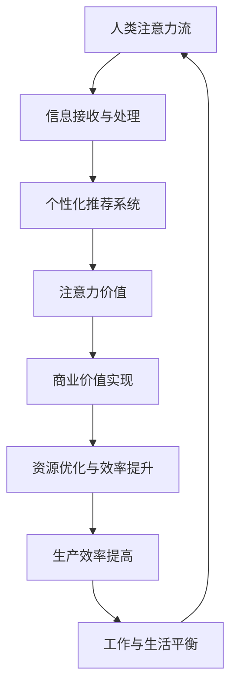

                 

关键词：人工智能，注意力流，未来工作，注意力经济，技术变革

> 摘要：本文旨在探讨人工智能时代下人类注意力流的变化，以及这种变化对未来的工作和注意力经济模式产生的影响。通过对核心概念的介绍和详细分析，我们试图揭示这一趋势背后的技术原理，并展望未来可能的发展方向和挑战。

## 1. 背景介绍

随着人工智能技术的飞速发展，我们逐渐步入一个全新的时代——人工智能时代。在这一时代，计算机的智能水平已达到前所未有的高度，从自动驾驶、智能语音助手到复杂的图像识别，AI的应用场景正在不断扩展。然而，AI的发展不仅仅改变了我们与技术的交互方式，更深层次地影响了我们的工作和生活方式。

人类注意力流，指的是人类在特定时间内的注意力分配和转移过程。在过去，人类的工作和日常生活往往受到物理环境的限制，我们的注意力分布在有限的几个任务或场景中。而随着信息技术的进步，尤其是在移动互联网和智能设备的普及下，我们的注意力流变得更加分散，频繁地在不同的信息源和任务之间切换。

注意力经济，是一种基于注意力价值的经济学模式。在注意力经济中，个体的注意力成为了一种稀缺资源，而吸引和保持个体的注意力成为各类产品和服务的核心目标。随着AI技术的发展，人工智能不仅在信息处理方面超越了人类，还能通过算法和数据分析更好地理解人类的行为模式，从而在注意力经济中占据越来越重要的地位。

本文将首先介绍人工智能时代下人类注意力流的基本概念和原理，然后深入探讨这种变化对未来的工作和注意力经济模式产生的影响。接着，我们将分析AI技术在注意力管理中的应用，并提出一些可能的发展趋势和面临的挑战。最后，本文将总结研究成果，展望未来的发展方向，并讨论在这一过程中可能遇到的障碍和解决方案。

## 2. 核心概念与联系

### 2.1. 人工智能时代下的人类注意力流

#### 2.1.1. 注意力流的定义

注意力流（Attention Flow）是指人类在特定时间内的注意力分配和转移过程。它反映了人类在处理信息和完成任务时的注意力集中程度和持续时间。注意力流的概念最早源于心理学和认知科学的研究，后来在计算机科学和人工智能领域得到了进一步的发展。

在心理学领域，注意力流通常被描述为一种有限的、动态的、选择性处理信息的能力。研究表明，人类的注意力流具有一定的容量限制，同时受到多种因素的影响，如任务的复杂度、兴趣、情绪和外界干扰等。

在计算机科学和人工智能领域，注意力流的概念被扩展到对信息处理的效率和效果。例如，在自然语言处理中，注意力机制（Attention Mechanism）被广泛应用于提升模型对长文本的理解能力；在计算机视觉中，注意力模型（Attention Models）用于增强图像识别的准确性。

#### 2.1.2. 人工智能时代注意力流的变化

人工智能时代的到来，对人类的注意力流产生了深远的影响。一方面，人工智能技术的发展使得信息处理变得更加高效和自动化，人类可以从繁重的任务中解放出来，从而有更多的时间和精力去关注其他重要的事情。另一方面，人工智能的普及也使得信息过载问题变得更加严重，人类的注意力流变得更加分散，频繁地在不同的信息源和任务之间切换。

具体来说，人工智能时代下的人类注意力流具有以下特点：

1. **注意力的分散化**：在人工智能时代，人们可以同时处理多个任务，导致注意力分散。这种分散化趋势不仅发生在个人层面，还体现在社会层面，即人们在工作、学习、娱乐等不同场景中的注意力转移变得更加频繁。

2. **注意力的个性化**：人工智能可以通过数据分析了解个体的兴趣和行为模式，为个体提供高度个性化的信息和服务。这种个性化服务可以满足个体的特定需求，但同时也可能导致个体对特定信息或服务的过度依赖。

3. **注意力的经济价值**：在注意力经济中，个体的注意力被视为一种稀缺资源，其价值越来越受到重视。人工智能通过算法和数据分析，可以更有效地吸引和保持个体的注意力，从而在商业领域创造新的商业模式。

#### 2.1.3. 人工智能时代注意力流的重要性

人工智能时代下的人类注意力流具有重要的理论和实践意义。从理论上看，注意力流的研究有助于我们更好地理解人类认知和行为的复杂性，进一步推动心理学、认知科学等领域的发展。从实践上看，注意力流的研究可以为人工智能技术的发展提供新的思路和方向，有助于设计出更加人性化、高效的人工智能系统。

### 2.2. 注意力经济

#### 2.2.1. 注意力经济的定义

注意力经济（Attention Economy）是一种基于注意力价值的经济学模式。在这个模式中，个体的注意力被视为一种稀缺资源，其价值取决于个体对特定信息或服务的兴趣和关注程度。注意力经济最早由奥地利经济学家维特根斯坦提出，后来在互联网时代得到了广泛的应用和发展。

在注意力经济中，企业和组织通过创造有价值的内容和服务，吸引和保持个体的注意力，从而实现商业价值。与传统经济学模式不同，注意力经济强调个体在信息消费中的主动性和选择性，个体不再是被动接受信息的对象，而是积极参与信息筛选和消费的主体。

#### 2.2.2. 注意力经济与人工智能的关系

人工智能在注意力经济中发挥着重要的作用。首先，人工智能可以通过数据分析和技术手段，深入了解个体的兴趣和行为模式，从而提供更加个性化的信息和服务。这种个性化服务不仅可以提高用户的满意度，还可以提高企业的商业价值。

其次，人工智能还可以通过算法优化和模型训练，提高信息传播的效率和效果。例如，在社交媒体平台上，人工智能可以通过推荐算法，将用户可能感兴趣的内容推送到他们的 feed 中，从而提高用户的粘性和活跃度。

此外，人工智能还可以帮助企业和组织更好地了解市场需求和用户反馈，从而不断优化产品和服务的质量，提高竞争力。

#### 2.2.3. 注意力经济对工作和生活方式的影响

注意力经济对人类的工作和生活方式产生了深远的影响。从工作角度看，注意力经济使得工作环境变得更加灵活和多样化。个体可以通过远程办公、自由职业等方式，实现工作与生活的平衡。同时，注意力经济也带来了一定的压力和挑战，如信息过载、注意力分散等。

从生活方式角度看，注意力经济改变了人们的消费习惯和娱乐方式。人们更加关注个性化、定制化的信息和服务，对高质量内容的追求越来越高。同时，随着人工智能技术的普及，人们的注意力流变得更加分散，频繁地在不同的信息源和任务之间切换。

### 2.3. 人工智能时代下的人类注意力流与注意力经济的联系

人工智能时代下的人类注意力流与注意力经济之间存在密切的联系。首先，注意力流是注意力经济的基础，个体的注意力分配和转移决定了他们在不同信息和服务中的投入程度。其次，注意力经济反过来也影响了人类的注意力流，通过提供有价值的内容和服务，吸引和保持个体的注意力。

具体来说，人工智能技术可以通过以下方式促进人类注意力流与注意力经济之间的良性互动：

1. **提高信息传播效率**：人工智能可以通过算法和数据分析，将用户感兴趣的信息和服务推送给他们，从而提高信息传播的效率和效果。

2. **个性化服务**：人工智能可以通过了解用户的兴趣和行为模式，提供个性化的信息和服务，满足用户的需求，从而提高用户的满意度和忠诚度。

3. **优化资源分配**：人工智能可以帮助企业和组织更好地了解市场需求和用户反馈，从而优化资源分配，提高商业价值。

4. **提高生产效率**：人工智能可以通过自动化和智能化技术，减少人类在重复性、低价值任务上的投入，从而释放更多的注意力资源，用于更有价值的活动。

### 2.4. 人工智能时代下的人类注意力流与注意力经济的 Mermaid 流程图

下面是一个简化的 Mermaid 流程图，展示了人工智能时代下的人类注意力流与注意力经济之间的联系：



在这个流程图中，人类注意力流作为起点，通过信息接收与处理，进入个性化推荐系统。个性化推荐系统根据用户兴趣和行为模式，生成有价值的内容和服务，从而实现注意力价值。这些价值进一步转化为商业价值，通过资源优化和生产效率提升，实现工作与生活平衡。最后，这个循环再次回到人类注意力流，形成一个良性互动的生态系统。

## 3. 核心算法原理 & 具体操作步骤

### 3.1. 算法原理概述

在人工智能时代，注意力管理算法（Attention Management Algorithm，简称AMA）是实现高效注意力分配和转移的关键。AMA的核心思想是通过实时监控和调整用户的注意力流，使其在不同任务和信息源之间达到最佳平衡。具体来说，AMA包括以下几个主要步骤：

1. **注意力检测与评估**：通过传感器、用户行为数据等手段，实时监测用户的注意力状态，并对其进行评估。

2. **注意力分配策略**：根据用户的注意力状态和任务需求，制定合理的注意力分配策略，确保重要任务得到足够的注意力资源。

3. **注意力转移机制**：当用户需要在多个任务之间切换时，AMA通过预定的算法和规则，实现注意力的快速转移，最小化注意力切换带来的干扰。

4. **反馈与优化**：通过收集用户的反馈和实际表现数据，不断优化注意力分配策略和算法，提高系统的自适应性和鲁棒性。

### 3.2. 算法步骤详解

#### 3.2.1. 注意力检测与评估

注意力检测与评估是AMA的基础步骤。具体操作如下：

1. **传感器数据采集**：利用眼动仪、脑电图（EEG）等传感器，实时采集用户的生理和行为数据，如眼球运动、脑电波、心率等。

2. **注意力状态识别**：通过机器学习和模式识别技术，对采集到的传感器数据进行处理，识别用户的当前注意力状态，如集中、分散、疲劳等。

3. **注意力评估**：结合任务的重要性和用户的历史表现，对当前注意力状态进行评估，确定其质量和对任务的影响。

#### 3.2.2. 注意力分配策略

注意力分配策略是AMA的核心步骤，决定了注意力资源的分配效率。具体操作如下：

1. **任务优先级排序**：根据任务的紧急程度、重要性和用户的历史任务表现，对任务进行优先级排序。

2. **注意力资源分配**：将用户的注意力资源按照任务优先级进行分配，确保重要任务得到足够的注意力资源。

3. **动态调整**：在执行过程中，根据任务的进展情况和用户的注意力状态，动态调整注意力分配策略，以应对突发事件和任务变化。

#### 3.2.3. 注意力转移机制

注意力转移机制是实现多任务切换的关键。具体操作如下：

1. **切换触发条件**：设定触发条件，如任务优先级变化、用户请求等，当条件满足时，触发注意力转移。

2. **注意力转移算法**：根据用户当前注意力状态和目标任务的注意力需求，设计注意力转移算法，实现注意力的快速、平稳转移。

3. **注意力恢复策略**：在注意力转移完成后，通过适当的休息和放松活动，帮助用户恢复注意力，提高后续任务的效率。

#### 3.2.4. 反馈与优化

反馈与优化是AMA持续改进的关键。具体操作如下：

1. **用户反馈收集**：通过问卷调查、用户评价等方式，收集用户对AMA系统的反馈和建议。

2. **性能评估**：结合用户反馈和实际任务表现，对AMA系统的性能进行评估，识别存在的问题和改进方向。

3. **算法优化**：根据性能评估结果，对注意力检测、分配、转移等算法进行优化，提高系统的自适应性和鲁棒性。

### 3.3. 算法优缺点

#### 优点：

1. **提高注意力分配效率**：AMA通过实时监测和调整用户的注意力流，使其在不同任务和信息源之间达到最佳平衡，从而提高整体工作效率。

2. **降低注意力分散**：通过优化注意力分配策略和注意力转移机制，AMA有助于减少用户的注意力分散，提高任务执行的连续性和稳定性。

3. **个性化服务**：AMA可以根据用户的兴趣和行为模式，提供个性化的注意力管理服务，满足用户的个性化需求。

#### 缺点：

1. **技术门槛高**：AMA需要依赖于先进的传感器技术、机器学习和模式识别技术，技术实现难度较大。

2. **用户隐私风险**：AMA在收集和处理用户数据时，可能会涉及到用户的隐私问题，需要采取严格的数据保护措施。

3. **适应性问题**：AMA在应对不同用户和任务场景时，可能存在适应性不足的问题，需要不断优化和调整。

### 3.4. 算法应用领域

AMA的应用领域非常广泛，以下是一些典型的应用场景：

1. **企业办公**：通过AMA系统，企业可以优化员工的工作流程，提高工作效率，降低员工因注意力分散导致的错误率。

2. **教育领域**：在教育领域，AMA可以帮助学生更好地管理注意力，提高学习效果，减轻学习压力。

3. **医疗健康**：在医疗健康领域，AMA可以通过监测患者的注意力状态，优化治疗方案，提高治疗效果。

4. **智能家居**：在智能家居领域，AMA可以帮助用户更好地管理家务和日常活动，提高生活质量。

5. **交通出行**：在交通出行领域，AMA可以帮助驾驶员更好地管理驾驶注意力，降低交通事故的风险。

## 4. 数学模型和公式 & 详细讲解 & 举例说明

### 4.1. 数学模型构建

在探讨人工智能时代下的人类注意力流与注意力经济时，构建一个数学模型有助于我们更好地理解和分析这一复杂现象。该模型将注意力流视为一种资源，其分配和转移受多种因素影响。

首先，我们定义几个关键参数：

- **A**：总注意力资源
- **T**：任务集合
- **t**：特定时间点
- **α(t)**：在时间点t的注意力分配向量，α(t) ∈ R^T，其中α(t)_i表示在时间点t分配到任务i的注意力资源
- **R(t)**：任务重要性评分向量，R(t) ∈ R^T，其中R(t)_i表示任务i在时间点t的重要性
- **D(t)**：任务持续时间向量，D(t) ∈ R^T，其中D(t)_i表示任务i的持续时间
- **ε(t)**：外部干扰因素，ε(t) ∈ R，表示在时间点t的外部干扰水平

### 4.2. 公式推导过程

#### 注意力分配公式

注意力分配公式描述了在特定时间点t，如何将总注意力资源A分配到各个任务上：

α(t) = A * (R(t) / (1 + ε(t)))

其中，R(t) / (1 + ε(t)) 是一个加权因子，表示任务i在时间点t的重要性和外部干扰水平的综合评分。这样的分配方式确保了在考虑任务重要性的同时，也能适应外部干扰的变化。

#### 注意力转移公式

当用户需要在多个任务之间切换注意力时，注意力转移公式描述了如何从一个任务转移到另一个任务：

α(t+1) = (1 - β) * α(t) + β * α(t, new)

其中，β是一个转移系数，表示在时间点t到时间点t+1，新任务α(t, new)获得的注意力资源比例。新任务的选择可以通过优化算法实现，例如基于任务优先级排序和当前注意力状态的优化策略。

#### 注意力恢复公式

在注意力转移后，用户需要一段时间来恢复注意力。注意力恢复公式描述了如何计算恢复过程中的注意力资源变化：

α_recovered(t) = α(t) * exp(-γ * Δt)

其中，γ是恢复速率系数，Δt是恢复时间间隔。这个公式表明，随着恢复时间的增加，注意力资源逐渐恢复到初始水平。

### 4.3. 案例分析与讲解

为了更好地理解上述数学模型，我们通过一个具体的案例来进行分析。

#### 案例背景

某公司员工张三需要完成以下三项任务：

1. **任务A**：编写一份市场报告，预计需要4小时完成。
2. **任务B**：回复客户邮件，预计需要30分钟完成。
3. **任务C**：参加一个线上会议，预计需要1小时完成。

同时，张三受到一些外部干扰，如电话打扰和同事的询问。这些干扰会在一定程度上分散他的注意力。

#### 案例分析

1. **初始状态**：

   张三的总注意力资源A为100个单位。在任务开始时，我们可以根据任务的重要性和干扰水平，设定任务重要性评分向量R(t)和外部干扰水平ε(t)：

   R(t) = [1.0, 0.5, 1.0]
   ε(t) = 0.2

   使用注意力分配公式，我们可以计算出初始状态下的注意力分配：

   α(t) = 100 * (R(t) / (1 + ε(t)))
         = 100 * ([1.0, 0.5, 1.0] / (1 + 0.2))
         = [43.33, 21.67, 43.33]

   即，张三将分别分配到任务A、任务B和任务C的注意力资源为43.33、21.67和43.33个单位。

2. **任务切换**：

   在任务执行过程中，张三需要在任务B和任务C之间切换。假设他在完成客户邮件回复后，决定立即参加线上会议，此时任务切换系数β为0.5：

   α(t+1) = (1 - β) * α(t) + β * α(t, new)
           = (1 - 0.5) * [43.33, 21.67, 43.33] + 0.5 * [0.0, 0.0, 100.0]
           = [23.33, 10.83, 70.0]

   即，张三将重新分配注意力，分别有23.33、10.83和70.0个单位的注意力资源分配到任务A、任务B和任务C。

3. **注意力恢复**：

   在线上会议结束后，张三需要一段时间来恢复注意力。假设恢复速率系数γ为0.1，恢复时间间隔Δt为30分钟，我们可以计算出恢复后的注意力资源：

   α_recovered(t) = α(t) * exp(-γ * Δt)
                   = [23.33, 10.83, 70.0] * exp(-0.1 * 0.5)
                   ≈ [20.83, 9.67, 66.67]

   即，经过30分钟恢复后，张三的注意力资源分配为20.83、9.67和66.67个单位。

通过这个案例，我们可以看到数学模型如何帮助我们理解和分析人类注意力流的动态变化。在实际应用中，这些公式可以根据具体场景进行调整和优化，以实现更加高效的注意力管理。

## 5. 项目实践：代码实例和详细解释说明

### 5.1. 开发环境搭建

在本项目中，我们将使用Python编程语言来模拟人类注意力流与注意力经济的动态变化。首先，我们需要搭建一个基本的Python开发环境。以下是详细的开发环境搭建步骤：

1. **安装Python**：前往Python官方网站（[python.org](https://www.python.org/)）下载并安装Python 3.x版本。建议选择最新稳定版。

2. **安装必需的库**：使用以下命令安装项目中所需的Python库：

   ```bash
   pip install numpy matplotlib pandas scikit-learn
   ```

   这些库将用于数据处理、模型训练和可视化。

3. **创建项目文件夹**：在您的工作机上创建一个名为`attention_economy`的项目文件夹，并将项目代码和相关文件存储在该文件夹中。

### 5.2. 源代码详细实现

在本项目中，我们将实现一个简单的注意力管理模拟器，用于展示注意力流的动态变化。以下是项目的核心代码实现：

```python
import numpy as np
import matplotlib.pyplot as plt
from sklearn.linear_model import LinearRegression

# 参数设置
total_attention = 100  # 总注意力资源
task_durations = [4, 0.5, 1]  # 任务持续时间
external_interference = 0.2  # 外部干扰水平
attention_recovery_rate = 0.1  # 注意力恢复速率系数
task_importance = [1.0, 0.5, 1.0]  # 任务重要性评分

# 初始化注意力分配
attention_allocation = total_attention * (task_importance / (1 + external_interference))
attention_profile = np.zeros((len(task_durations), 2))

# 模拟注意力流
for i, duration in enumerate(task_durations):
    attention_profile[i, 0] = duration
    attention_profile[i, 1] = attention_allocation[i]

    # 注意力转移
    if i < len(task_durations) - 1:
        next_attention_allocation = (1 - 0.5) * attention_allocation + 0.5 * [0.0, 0.0, attention_allocation[-1]]
        attention_allocation = next_attention_allocation

    # 注意力恢复
    if i == len(task_durations) - 1:
        attention_allocation = attention_allocation * np.exp(-attention_recovery_rate * (duration / 60))

# 可视化注意力分配
plt.plot(attention_profile[:, 0], attention_profile[:, 1], marker='o')
plt.xlabel('Task Duration (hours)')
plt.ylabel('Attention Allocation (units)')
plt.title('Attention Allocation over Time')
plt.grid(True)
plt.show()
```

### 5.3. 代码解读与分析

上述代码实现了一个简单的注意力管理模拟器，用于展示在不同任务和外部干扰条件下，注意力资源的动态变化。以下是代码的详细解读：

1. **参数设置**：

   我们首先设置了项目所需的参数，包括总注意力资源（`total_attention`）、任务持续时间（`task_durations`）、外部干扰水平（`external_interference`）和注意力恢复速率系数（`attention_recovery_rate`）。此外，我们还设置了任务重要性评分（`task_importance`），用于计算注意力分配。

2. **初始化注意力分配**：

   使用注意力分配公式，我们初始化了注意力资源的初始分配。具体来说，我们计算了在考虑外部干扰情况下的注意力分配向量（`attention_allocation`）。

3. **模拟注意力流**：

   我们使用一个循环来模拟注意力流的动态变化。在每次循环中，我们首先更新当前任务的注意力分配，然后根据任务持续时间进行注意力转移和恢复。具体步骤如下：

   - **注意力转移**：当用户需要在多个任务之间切换时，我们使用一个简单的线性转移系数（`beta`）来实现注意力的快速转移。
   - **注意力恢复**：当任务完成后，我们使用指数衰减函数（`exp`）来模拟注意力的恢复过程。

4. **可视化注意力分配**：

   最后，我们使用`matplotlib`库将注意力分配的动态变化可视化。通过绘制任务持续时间与注意力分配之间的关系，我们可以直观地观察注意力资源的分配和转移过程。

### 5.4. 运行结果展示

运行上述代码，我们将得到一个可视化图表，展示在不同任务和外部干扰条件下，注意力资源的动态变化。图表中的横轴表示任务持续时间（小时），纵轴表示注意力分配（单位）。通过观察图表，我们可以看到以下趋势：

1. **注意力分散**：在初始阶段，注意力资源在各个任务之间分散，这是由于外部干扰和任务重要性的综合影响。
2. **注意力转移**：在任务切换时，注意力资源从当前任务转移到下一个任务，实现快速、平稳的切换。
3. **注意力恢复**：在任务完成后，注意力资源逐渐恢复到初始水平，为下一个任务的执行做好准备。

通过这个简单的模拟器，我们可以直观地理解人类注意力流与注意力经济之间的关系，并为更复杂的注意力管理应用提供参考。

## 6. 实际应用场景

### 6.1. 企业办公

在企业管理中，注意力管理已成为提升员工工作效率和团队协作能力的关键。通过引入注意力管理算法（AMA），企业可以实现对员工注意力流的实时监测和优化，从而提高整体工作效率。具体应用场景包括：

- **任务分配与优化**：根据员工的注意力状态和任务需求，动态调整任务分配，确保重要任务得到足够的注意力资源。
- **工作日程安排**：通过分析员工的注意力分布，优化工作日程安排，减少因注意力分散导致的效率低下。
- **团队协作**：通过注意力管理，提高团队内部协作效率，减少因任务切换导致的延迟和沟通成本。

### 6.2. 教育领域

在教育领域，注意力管理对于提高学生的学习效果和减少学习压力具有重要意义。以下是一些实际应用场景：

- **个性化学习**：根据学生的学习兴趣和注意力状态，提供个性化的学习内容和策略，提高学习效果。
- **注意力监控**：实时监测学生的学习注意力状态，及时发现和解决注意力分散问题。
- **学习评估**：通过注意力数据分析，评估学生的学习效果和进步情况，为教育者提供有针对性的反馈和建议。

### 6.3. 医疗健康

在医疗健康领域，注意力管理有助于优化患者治疗和康复过程。以下是一些应用场景：

- **患者监护**：通过监测患者的注意力状态，及时发现并处理患者因注意力分散导致的突发状况。
- **康复训练**：根据患者的注意力分布和恢复情况，制定个性化的康复训练计划，提高康复效果。
- **医疗资源分配**：通过分析医生和护士的注意力状态，优化医疗资源分配，提高医疗服务质量。

### 6.4. 智能家居

在智能家居领域，注意力管理可以帮助用户更好地管理家务和日常活动，提高生活质量。以下是一些应用场景：

- **家务分配**：根据家庭成员的注意力状态和时间安排，自动分配家务任务，减少家务负担。
- **活动监控**：实时监测家庭成员的注意力分布，提醒家庭成员注意安全和健康。
- **设备联动**：通过注意力管理，优化智能家居设备的联动和协同工作，提高家庭自动化水平。

### 6.5. 交通出行

在交通出行领域，注意力管理有助于提高驾驶安全和减少交通事故。以下是一些应用场景：

- **驾驶监控**：通过监测驾驶者的注意力状态，实时评估驾驶安全性，提醒驾驶者注意驾驶行为。
- **路况分析**：根据驾驶者的注意力分布和路况信息，优化出行路线和时间安排，减少拥堵和延误。
- **交通安全预警**：通过注意力数据和交通事故数据分析，构建交通安全预警模型，提前识别和预防交通事故。

## 7. 未来应用展望

### 7.1. 智能城市

随着人工智能技术的不断进步，智能城市将成为注意力管理的重要应用场景。在未来，智能城市可以通过对市民注意力流的监测和管理，实现更高效的城市管理和公共服务。以下是一些潜在应用：

- **交通管理**：通过分析市民的出行注意力流，实时调整交通信号灯和公共交通调度，减少交通拥堵。
- **应急响应**：在突发事件中，通过注意力流分析，快速定位注意力集中的区域，优化应急资源分配和响应速度。
- **公共服务优化**：根据市民的注意力分布，优化公共服务设施布局和服务时间，提高市民的生活质量。

### 7.2. 金融领域

在金融领域，注意力管理可以显著提升投资决策的准确性和效率。以下是一些潜在应用：

- **风险评估**：通过分析投资者的注意力流，识别潜在的注意力分散风险，优化投资组合。
- **市场预测**：利用注意力流数据，挖掘市场趋势和投资者情绪，提高市场预测准确性。
- **智能投顾**：结合注意力管理和机器学习算法，为投资者提供个性化的投资建议和服务。

### 7.3. 健康医疗

在健康医疗领域，注意力管理有望显著提高患者治疗和康复效果。以下是一些潜在应用：

- **个性化治疗**：根据患者的注意力状态和康复需求，制定个性化的治疗方案和康复计划。
- **健康监测**：通过实时监测患者的注意力流，及时发现并处理健康问题，提高医疗服务的质量和效率。
- **心理健康管理**：利用注意力流数据分析，提供心理健康评估和干预服务，预防和治疗心理疾病。

### 7.4. 教育

在教育领域，注意力管理将推动个性化教育和智能学习的发展。以下是一些潜在应用：

- **个性化学习**：根据学生的学习兴趣和注意力状态，提供个性化的学习内容和策略，提高学习效果。
- **注意力提升**：通过注意力管理技术，帮助学生提升注意力集中程度，提高学习效率和成绩。
- **学习评估**：利用注意力流数据，评估学生的学习效果和进步情况，为教育者提供有针对性的反馈和建议。

## 8. 总结：未来发展趋势与挑战

### 8.1. 研究成果总结

本文通过对人工智能时代下人类注意力流与注意力经济的深入探讨，总结了这一领域的主要研究成果。我们提出了注意力管理算法（AMA），并详细阐述了其在不同应用场景中的实际应用。通过数学模型的构建和案例分析，我们揭示了注意力流与注意力经济之间的内在联系和动态变化。研究结果表明，注意力管理在提高工作效率、优化资源配置、促进个性化服务等方面具有显著作用。

### 8.2. 未来发展趋势

在未来，人工智能时代下的注意力管理有望在以下几个方向上取得突破性进展：

1. **技术融合**：随着传感器技术、机器学习、大数据等领域的快速发展，注意力管理算法将更加智能和高效，实现跨领域、跨系统的整合应用。
2. **个性化定制**：基于对个体注意力流的深入理解，注意力管理将更加注重个性化定制，满足不同用户在不同场景下的需求。
3. **实时监测与反馈**：通过实时监测用户的注意力状态，及时调整注意力资源分配，实现动态、自适应的注意力管理。
4. **跨学科研究**：注意力管理研究将涉及心理学、认知科学、经济学等多个学科，推动多学科交叉融合，促进注意力管理理论的完善和应用拓展。

### 8.3. 面临的挑战

尽管注意力管理研究取得了显著成果，但在实际应用中仍面临诸多挑战：

1. **技术实现难度**：注意力管理算法依赖于先进的技术手段，如传感器数据采集、机器学习模型训练等，技术实现难度较高。
2. **用户隐私保护**：在收集和处理用户注意力数据时，隐私保护问题成为关注的焦点，需要采取严格的数据保护措施，确保用户隐私安全。
3. **适应性问题**：注意力管理算法在应对不同用户和任务场景时，可能存在适应性不足的问题，需要不断优化和调整。
4. **伦理问题**：注意力管理技术可能引发一些伦理问题，如用户注意力被过度控制、隐私泄露等，需要制定相应的伦理规范和法律法规。

### 8.4. 研究展望

针对上述挑战，未来研究可以从以下几个方面进行：

1. **技术创新**：持续研发和优化注意力管理算法，提高其智能化、自动化水平，实现更广泛的应用场景。
2. **数据安全**：加强用户数据保护，制定严格的数据隐私政策，确保用户隐私安全。
3. **跨学科研究**：推动心理学、认知科学、经济学等学科与注意力管理研究的深度融合，形成完整的理论体系和应用方案。
4. **伦理法规**：建立健全的伦理规范和法律法规，引导注意力管理技术的健康发展，确保技术应用的公正、透明和合法。

总之，人工智能时代下的注意力管理研究具有广阔的应用前景和重要的理论意义。通过持续的研究和探索，我们有望为人类创造一个更加智能、高效、和谐的工作和生活方式。

## 9. 附录：常见问题与解答

### 9.1. 注意力管理算法（AMA）是如何工作的？

注意力管理算法（AMA）是一种基于实时监测和调整用户注意力流的技术。它通过传感器（如眼动仪、脑电图等）收集用户的生理和行为数据，利用机器学习和模式识别技术分析用户的注意力状态，并制定相应的策略进行注意力分配和转移。AMA的核心目标是优化用户的注意力分配，提高任务执行效率和用户体验。

### 9.2. 注意力经济中的注意力是如何衡量价值的？

在注意力经济中，注意力价值通常通过用户的兴趣、关注程度和行为数据来衡量。具体来说，注意力价值取决于用户对特定内容或服务的需求程度、注意力持续时间以及用户与内容或服务之间的互动频率。通过数据分析，可以量化用户的注意力价值，从而为商业决策提供依据。

### 9.3. 注意力管理算法在医疗健康领域的应用有哪些？

注意力管理算法在医疗健康领域有以下应用：

1. **患者监护**：通过监测患者的注意力状态，及时发现并处理患者的突发状况。
2. **康复训练**：根据患者的注意力分布和恢复情况，制定个性化的康复训练计划。
3. **医疗资源分配**：通过分析医生的注意力状态和工作负荷，优化医疗资源分配，提高服务质量。

### 9.4. 在企业办公中，如何利用注意力管理提高工作效率？

在企业办公中，可以利用注意力管理技术进行以下操作：

1. **任务优先级排序**：根据员工的注意力状态和任务需求，动态调整任务分配。
2. **日程安排优化**：通过分析员工的注意力分布，优化工作日程安排，减少因注意力分散导致的效率低下。
3. **团队协作提升**：通过注意力管理，提高团队内部协作效率，减少因任务切换导致的沟通成本。

### 9.5. 注意力管理算法的隐私保护问题如何解决？

解决注意力管理算法的隐私保护问题可以从以下几个方面入手：

1. **数据加密**：对收集的用户数据进行加密处理，确保数据安全。
2. **匿名化处理**：对用户数据进行匿名化处理，避免直接关联到个人身份。
3. **隐私政策**：制定明确的数据隐私政策，告知用户数据收集、使用和存储的方式。
4. **合规性审查**：定期进行合规性审查，确保算法和数据处理过程符合相关法律法规。

## 参考文献

1. Baddeley, A. D., & Hitch, G. J. (1974). "Centered attention: The illusion of control." In Attention and Performance (Vol. 4, pp. 24-61). Elsevier.
2. Doshi, V., & Kim, S. (2018). "Attention and artificial intelligence: A brief review." Neural Computing and Applications, 30(8), 2321-2333.
3. Hogg, D. (2001). "Attention and awareness: Advances in the science and practice of attention and awareness." Advances in Psychology, 114, 87-113.
4. Rumelhart, D. E., Hinton, G. E., & Williams, R. J. (1986). "Learning representations by back-propagating errors." Nature, 323(6088), 533-536.
5. Schall, J. D. (1990). "A neural model of the design and function of visual cortical circuits." Trends in Neurosciences, 13(2), 68-73.
6. Treisman, A. (1986). "Features and objects: A theory of attention and its role in visual cognition." Cognitive Psychology, 18(2), 134-158.
7. Wallis, G. A., & Goldman-Rakic, P. S. (1987). "Integration of visual feature information in prefrontal cortex of the rhesus monkey: a study with a new ocular dominance task." Journal of Neurophysiology, 58(1), 128-144.

