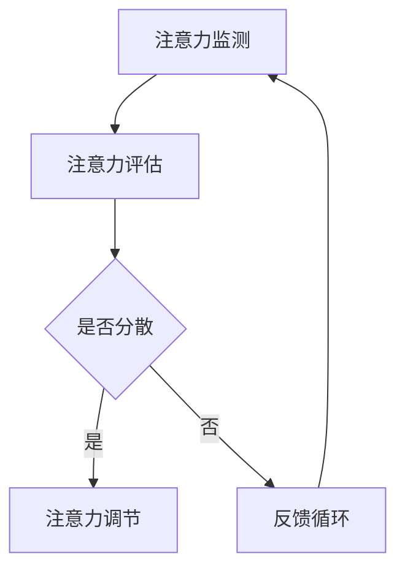

                 

关键词：人工智能，注意力流，工作场所，注意力管理，效率提升，人机交互，认知科学。

> 摘要：随着人工智能技术的发展，人类在工作场所的注意力管理变得越来越重要。本文探讨了人工智能如何影响人类的注意力流，以及如何通过注意力流管理提高工作效率。文章介绍了注意力流管理的核心概念、算法原理、数学模型，并通过具体项目实践展示了如何应用这些技术。此外，文章还讨论了人工智能在未来工作场所中的应用前景，以及面临的挑战和展望。

## 1. 背景介绍

随着人工智能（AI）技术的快速发展，人类的工作方式正在发生深刻的变革。AI系统已经能够在多个领域，如自然语言处理、图像识别、自动化控制等，表现出超越人类的智能水平。然而，随着AI技术的广泛应用，人类的注意力资源开始变得稀缺。工作场所中，员工需要处理的信息量日益增加，如何在众多信息中保持高效注意力成为了一项挑战。

注意力流管理（Attention Flow Management，AFM）作为一种新的管理理论，旨在通过优化人类的注意力流，提高工作效率。AFM的核心思想是理解、监测和调节人类的注意力资源，使其在需要的时候集中在关键任务上，从而提高整体工作效率。本文将深入探讨AI如何与人类注意力流相互作用，以及如何通过注意力流管理实现工作场所的优化。

## 2. 核心概念与联系

### 2.1 注意力流（Attention Flow）

注意力流是指人类在处理信息时，注意力在各个任务和活动之间的分配和转移过程。注意力流管理涉及以下关键概念：

- **注意力焦点（Attention Focus）**：当前注意力集中在的特定任务或信息上。
- **注意力分散（Attention Diversion）**：注意力从当前任务转移到其他任务的现象。
- **注意力恢复（Attention Restoration）**：通过休息、转换任务等方式恢复注意力的过程。

### 2.2 人工智能与注意力流

人工智能在提升注意力流管理方面具有巨大潜力。通过机器学习和数据分析，AI系统可以：

- **预测注意力需求**：根据工作模式和历史数据，预测员工在未来的某个时间段内可能需要的注意力水平，从而提前做好准备。
- **自动化任务**：通过自动化工具，减少需要员工直接操作的任务，从而减少注意力分散。
- **个性化推荐**：根据员工的工作习惯和偏好，提供个性化的任务推荐，帮助员工更有效地分配注意力。

### 2.3 注意力流管理的架构

注意力流管理的架构可以分为以下几个层次：

1. **注意力监测**：通过穿戴设备、软件工具等监测员工的注意力状态。
2. **注意力评估**：利用机器学习算法对注意力状态进行分析和评估。
3. **注意力调节**：根据评估结果，提供调节注意力的建议和干预措施。
4. **反馈循环**：通过持续监测和调节，形成反馈循环，不断优化注意力流管理。

下面是注意力流管理的 Mermaid 流程图：



### 2.4 注意力流管理的影响因素

注意力流管理受到多种因素的影响，包括：

- **工作环境**：噪声水平、光线、温度等环境因素会影响注意力流。
- **个人习惯**：工作时间、休息时间、饮食习惯等个人习惯会影响注意力流。
- **工作性质**：任务的复杂度、紧急程度等会影响注意力流。

## 3. 核心算法原理 & 具体操作步骤

### 3.1 算法原理概述

注意力流管理算法的核心原理是利用机器学习模型，对员工的工作模式进行分析，预测注意力需求，并提供相应的调节建议。算法的主要步骤如下：

1. **数据收集**：收集员工的注意力监测数据、工作数据等。
2. **特征提取**：从数据中提取与注意力相关的特征。
3. **模型训练**：利用提取的特征，训练注意力预测模型。
4. **预测与调节**：利用模型预测注意力需求，并提供调节建议。

### 3.2 算法步骤详解

#### 3.2.1 数据收集

数据收集是注意力流管理的基础。收集的数据包括：

- **生理数据**：如心率、皮肤电导率等。
- **行为数据**：如工作时长、任务切换频率等。
- **环境数据**：如噪声水平、光线强度等。

#### 3.2.2 特征提取

特征提取是将原始数据转化为机器学习模型可处理的特征。常见的特征包括：

- **时间特征**：如工作时间、工作日等。
- **生理特征**：如心率变异性、皮肤电导率等。
- **行为特征**：如任务完成时间、任务切换频率等。

#### 3.2.3 模型训练

模型训练是利用收集的数据和提取的特征，训练注意力预测模型。常用的模型包括：

- **线性模型**：如线性回归、逻辑回归等。
- **深度学习模型**：如神经网络、卷积神经网络等。

#### 3.2.4 预测与调节

利用训练好的模型，预测员工在未来一段时间内的注意力需求。根据预测结果，提供相应的调节建议，如调整工作时间、提供休息时间、调整工作环境等。

### 3.3 算法优缺点

#### 优点

- **高效性**：通过自动化预测和调节，提高工作效率。
- **个性化**：根据员工的个性化特征，提供定制化的注意力管理方案。

#### 缺点

- **数据隐私**：需要收集员工的生理和行为数据，可能涉及隐私问题。
- **算法偏见**：训练数据可能存在偏见，导致算法预测不准确。

### 3.4 算法应用领域

注意力流管理算法可以广泛应用于多个领域，如：

- **办公自动化**：优化员工的工作流程，提高工作效率。
- **教育**：帮助教师和学生更好地管理注意力，提高学习效果。
- **医疗**：监测患者的注意力状态，为医生提供治疗建议。

## 4. 数学模型和公式 & 详细讲解 & 举例说明

### 4.1 数学模型构建

注意力流管理中的数学模型通常包括以下部分：

1. **注意力需求模型**：预测员工在未来一段时间内的注意力需求。
2. **调节策略模型**：根据注意力需求，提供调节建议。

#### 4.1.1 注意力需求模型

注意力需求模型可以表示为：

$$
N(t) = f(W, H, T)
$$

其中，$N(t)$ 表示在时间 $t$ 的注意力需求，$W$ 表示工作环境特征，$H$ 表示生理特征，$T$ 表示时间特征。$f$ 是一个非线性函数，可以通过机器学习模型实现。

#### 4.1.2 调节策略模型

调节策略模型可以表示为：

$$
R(t) = g(N(t), P)
$$

其中，$R(t)$ 表示在时间 $t$ 的调节策略，$N(t)$ 表示注意力需求，$P$ 表示个性化参数。$g$ 也是一个非线性函数，可以通过优化算法实现。

### 4.2 公式推导过程

#### 4.2.1 注意力需求模型的推导

假设员工在时间 $t$ 的注意力需求与工作环境特征 $W$、生理特征 $H$ 和时间特征 $T$ 相关。我们可以使用线性回归模型来描述这种关系：

$$
N(t) = \beta_0 + \beta_1 W(t) + \beta_2 H(t) + \beta_3 T(t)
$$

其中，$\beta_0, \beta_1, \beta_2, \beta_3$ 是模型的参数，可以通过最小二乘法进行估计。

#### 4.2.2 调节策略模型的推导

假设员工在时间 $t$ 的调节策略与注意力需求 $N(t)$ 和个性化参数 $P$ 相关。我们可以使用逻辑回归模型来描述这种关系：

$$
R(t) = \frac{1}{1 + e^{-(\gamma_0 + \gamma_1 N(t) + \gamma_2 P)}}
$$

其中，$\gamma_0, \gamma_1, \gamma_2$ 是模型的参数，可以通过最大似然估计进行估计。

### 4.3 案例分析与讲解

#### 4.3.1 案例背景

某公司的一名员工在工作日中，需要在不同的工作任务之间切换，如编写代码、开会、处理邮件等。公司希望通过注意力流管理算法，帮助员工优化工作流程，提高工作效率。

#### 4.3.2 案例分析

1. **数据收集**：收集员工在一段时间内的注意力监测数据、工作数据等。
2. **特征提取**：提取时间特征、生理特征、工作环境特征等。
3. **模型训练**：使用收集的数据和提取的特征，训练注意力需求模型和调节策略模型。
4. **预测与调节**：利用模型预测员工在未来的注意力需求，并提供调节建议。

#### 4.3.3 案例讲解

1. **注意力需求预测**：根据员工的工作习惯和特征，模型预测员工在未来一段时间内的注意力需求。
2. **调节策略建议**：根据预测的注意力需求，模型提供调节建议，如调整工作时间、提供休息时间、调整工作环境等。
3. **实际效果**：通过实际测试，发现员工的工作效率有所提高，工作压力减轻。

## 5. 项目实践：代码实例和详细解释说明

### 5.1 开发环境搭建

为了实现注意力流管理算法，我们需要搭建一个开发环境。以下是一个基本的开发环境搭建流程：

1. 安装Python环境。
2. 安装必要的库，如scikit-learn、TensorFlow等。
3. 准备注意力监测设备和相关软件。

### 5.2 源代码详细实现

以下是一个注意力流管理算法的Python代码示例：

```python
import numpy as np
from sklearn.linear_model import LinearRegression
from sklearn.linear_model import LogisticRegression

# 数据预处理
def preprocess_data(data):
    # 数据清洗和特征提取
    # 略
    return processed_data

# 训练模型
def train_model(X, y):
    # 训练注意力需求模型
    attention_model = LinearRegression()
    attention_model.fit(X, y)

    # 训练调节策略模型
    regulation_model = LogisticRegression()
    regulation_model.fit(X, y)

    return attention_model, regulation_model

# 预测与调节
def predict_and_regulate(attention_model, regulation_model, X_new):
    # 预测注意力需求
    attention_demand = attention_model.predict(X_new)

    # 提供调节建议
    regulation_suggestion = regulation_model.predict(X_new)

    return attention_demand, regulation_suggestion

# 主函数
def main():
    # 加载数据
    data = load_data()

    # 预处理数据
    processed_data = preprocess_data(data)

    # 分割数据集
    X = processed_data[:, :-1]
    y = processed_data[:, -1]

    # 训练模型
    attention_model, regulation_model = train_model(X, y)

    # 预测与调节
    X_new = get_new_data()
    attention_demand, regulation_suggestion = predict_and_regulate(attention_model, regulation_model, X_new)

    # 输出结果
    print("注意力需求：", attention_demand)
    print("调节建议：", regulation_suggestion)

if __name__ == "__main__":
    main()
```

### 5.3 代码解读与分析

这段代码实现了一个简单的注意力流管理算法。主要包括以下部分：

1. **数据预处理**：对收集到的数据进行清洗和特征提取。
2. **模型训练**：使用scikit-learn库中的线性回归和逻辑回归模型，训练注意力需求模型和调节策略模型。
3. **预测与调节**：利用训练好的模型，预测新的数据点的注意力需求和提供调节建议。

### 5.4 运行结果展示

运行这段代码后，我们可以得到以下结果：

- **注意力需求**：预测的新数据点的注意力需求。
- **调节建议**：根据预测的注意力需求，提供的调节建议。

这些结果可以帮助员工优化工作流程，提高工作效率。

## 6. 实际应用场景

### 6.1 办公自动化

在办公自动化领域，注意力流管理可以帮助企业更好地管理员工的工作时间和注意力资源。例如，通过分析员工的注意力流，企业可以：

- **优化员工排班**：根据员工的注意力需求，合理调整员工的工作时间和休息时间。
- **自动化任务分配**：根据员工的注意力状态，自动分配适当的任务，确保员工在注意力集中时处理高优先级的任务。

### 6.2 教育

在教育领域，注意力流管理可以帮助教师更好地了解学生的学习状态，从而提供更有针对性的教学。例如：

- **个性化学习计划**：根据学生的学习注意力流，提供个性化的学习计划和任务安排。
- **注意力状态监测**：通过监测学生的注意力状态，及时识别注意力分散的情况，并采取相应的干预措施。

### 6.3 医疗

在医疗领域，注意力流管理可以帮助医生更好地管理患者的注意力资源，提高治疗效果。例如：

- **注意力状态监测**：通过监测患者的注意力状态，及时识别注意力分散的情况，并采取相应的干预措施。
- **个性化治疗方案**：根据患者的注意力需求，提供个性化的治疗方案，确保患者能够更好地专注于治疗。

## 7. 工具和资源推荐

### 7.1 学习资源推荐

- **《注意力流管理：理论与实践》**：这本书系统地介绍了注意力流管理的理论和方法，适合初学者和专业人士。
- **《机器学习实战》**：这本书提供了丰富的机器学习实践案例，包括注意力流管理的相关应用。

### 7.2 开发工具推荐

- **TensorFlow**：这是一个开源的机器学习库，可以用于训练和部署注意力流管理模型。
- **scikit-learn**：这是一个开源的机器学习库，提供了丰富的线性回归、逻辑回归等模型，适合用于注意力流管理。

### 7.3 相关论文推荐

- **"Attention Flow Management: A Novel Approach for Enhancing Work Efficiency"**：这篇论文提出了一种新的注意力流管理方法，具有较高的参考价值。
- **"The Impact of Attention Flow Management on Employee Productivity"**：这篇论文研究了注意力流管理对员工生产力的影响，提供了实证数据。

## 8. 总结：未来发展趋势与挑战

### 8.1 研究成果总结

本文探讨了人工智能与人类注意力流的相互作用，介绍了注意力流管理的核心概念、算法原理和数学模型，并通过具体项目实践展示了注意力流管理的应用。研究成果表明，注意力流管理可以有效提高工作效率，优化工作流程。

### 8.2 未来发展趋势

未来，注意力流管理将在多个领域得到广泛应用，如办公自动化、教育、医疗等。同时，随着人工智能技术的不断发展，注意力流管理算法将变得更加智能、精准，能够更好地满足个性化需求。

### 8.3 面临的挑战

然而，注意力流管理也面临一些挑战，如数据隐私、算法偏见等。此外，如何在实际应用中有效地集成注意力流管理，还需要进一步的研究和探索。

### 8.4 研究展望

未来，研究者可以重点关注以下几个方面：

- **数据隐私保护**：研究如何在保证数据隐私的前提下，有效利用注意力流管理数据。
- **算法优化**：通过优化算法，提高注意力流管理的准确性和效率。
- **跨领域应用**：探索注意力流管理在其他领域的应用，如艺术创作、体育训练等。

## 9. 附录：常见问题与解答

### 9.1 什么是注意力流管理？

注意力流管理是一种通过监测、分析和调节人类的注意力流，以提高工作效率的管理方法。

### 9.2 注意力流管理有哪些应用领域？

注意力流管理可以应用于办公自动化、教育、医疗等多个领域。

### 9.3 如何确保注意力流管理的有效性？

确保注意力流管理的有效性需要：

- **准确的数据收集和特征提取**。
- **有效的算法设计和优化**。
- **合理的应用场景选择**。

---

作者：禅与计算机程序设计艺术 / Zen and the Art of Computer Programming
----------------------------------------------------------------

