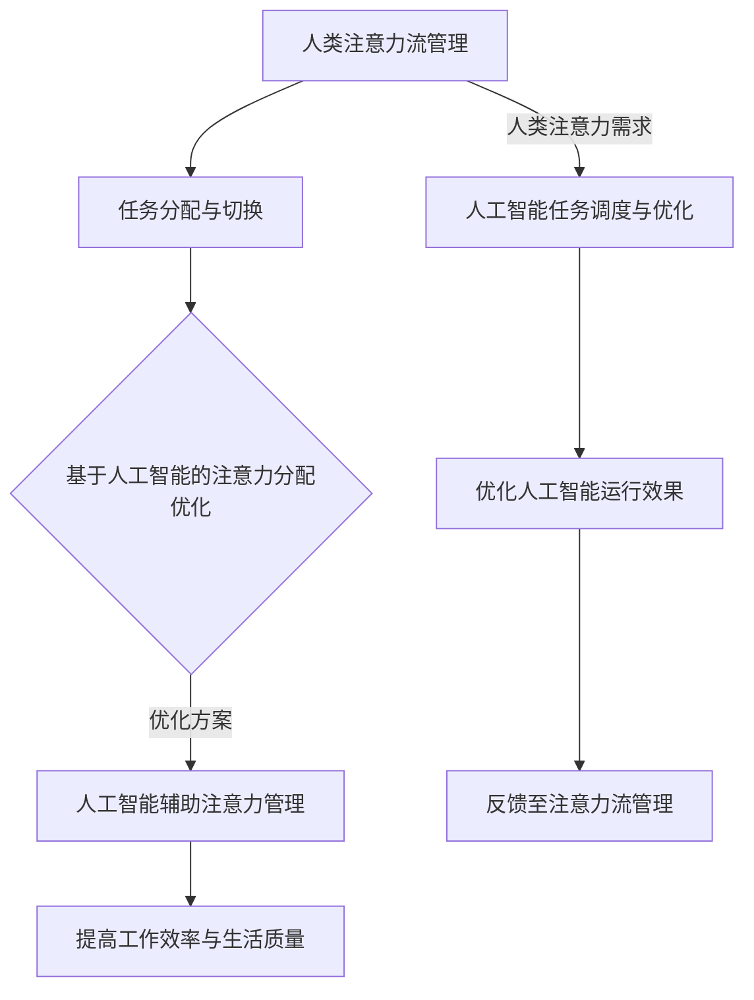

                 

关键词：人工智能、注意力流、工作场所、注意力管理、未来趋势、挑战与展望

> 摘要：随着人工智能技术的快速发展，人类在工作场所的注意力流受到了前所未有的挑战。本文旨在探讨人工智能与人类注意力流之间的关系，分析当前工作场所面临的注意力管理问题，并提出相应的策略和解决方案，为未来的工作场所提供一种新的视角和思考方向。

## 1. 背景介绍

### 1.1 人工智能的崛起

人工智能（Artificial Intelligence, AI）作为一种新兴技术，正在改变着我们的生活方式和工作模式。从最初的自动化生产线，到如今的智能助理、自动驾驶汽车、智能医疗等各个领域，人工智能正在迅速渗透到我们的日常生活中。根据市场调研公司IDC的数据，全球人工智能市场将在2021年达到327亿美元，并预计在2025年达到550亿美元。

### 1.2 人类注意力流的挑战

随着人工智能技术的崛起，人类在工作场所的注意力流受到了巨大的挑战。一方面，人工智能的广泛应用使得人类不再需要专注于一些重复性的、低价值的任务，而是可以将注意力集中在更高层次的、更有创造性的任务上。然而，另一方面，人工智能的普及也带来了新的困扰，如信息过载、多任务处理等，这些因素都会影响人类的注意力流。

### 1.3 注意力管理的重要性

有效的注意力管理对于提高工作效率、降低工作压力、提升生活质量具有重要意义。然而，在当前的工作环境中，许多人面临着注意力分散、注意力流管理不善等问题。因此，如何利用人工智能技术来优化注意力管理，成为了当前研究的一个重要方向。

## 2. 核心概念与联系

### 2.1 人工智能与注意力流的定义

#### 2.1.1 人工智能

人工智能是一种模拟人类智能的技术，旨在使计算机具有感知、学习、推理和自我改进的能力。根据美国国家标准和技术研究院（NIST）的定义，人工智能主要包括以下几种类型：

- **机器学习**：通过数据和算法使计算机具备自我学习和自我改进的能力。
- **自然语言处理**：使计算机能够理解和生成自然语言，包括文本和语音。
- **计算机视觉**：使计算机能够理解和解释视觉信息，如图像和视频。
- **机器人技术**：使计算机能够模拟人类的行动和操作。

#### 2.1.2 注意力流

注意力流（Attention Flow）是指人类在进行任务时，注意力在不同任务间分配和切换的过程。心理学研究表明，注意力流对个体的认知过程、学习效果和工作效率具有至关重要的影响。

### 2.2 人工智能与注意力流的联系

人工智能与注意力流之间存在密切的联系。一方面，人工智能技术的应用可以改变人类的注意力流，使其从低价值的任务中解放出来，将注意力集中在更有创造性的任务上。另一方面，人类对注意力流的管理和优化也可以反过来影响人工智能的运行效果。

为了更清晰地展示人工智能与注意力流之间的联系，我们使用Mermaid流程图来描述这一过程：



## 3. 核心算法原理 & 具体操作步骤

### 3.1 算法原理概述

注意力管理算法的核心思想是利用人工智能技术，对人类的注意力流进行实时监控和优化。具体而言，该算法可以分为以下几个步骤：

1. **数据收集**：通过传感器、智能设备等手段收集人类行为和生理数据，如心率、眼动、脑电波等。
2. **特征提取**：对收集到的数据进行预处理和特征提取，提取出与注意力流相关的关键特征。
3. **模型训练**：利用机器学习算法，如深度神经网络，对提取出的特征进行训练，建立注意力流的预测模型。
4. **实时监控与优化**：根据预测模型，对人类的注意力流进行实时监控和优化，提供相应的建议和干预措施。

### 3.2 算法步骤详解

#### 3.2.1 数据收集

数据收集是注意力管理算法的基础。为了准确反映人类的注意力流，需要收集包括行为、生理等多方面的数据。具体而言，可以采用以下方法：

- **行为数据**：如鼠标移动、键盘敲击、屏幕注视点等，这些数据可以通过计算机软件和硬件进行收集。
- **生理数据**：如心率、眼动、脑电波等，这些数据可以通过传感器和智能设备进行收集。

#### 3.2.2 特征提取

在数据收集完成后，需要对数据进行预处理和特征提取。特征提取的关键是提取出与注意力流相关的关键特征。以下是一些常见的特征提取方法：

- **时序特征**：如时间序列的均值、方差、趋势等。
- **频域特征**：如频率、周期、振幅等。
- **图像特征**：如颜色、纹理、形状等。

#### 3.2.3 模型训练

在特征提取完成后，可以利用机器学习算法对提取出的特征进行训练，建立注意力流的预测模型。常用的机器学习算法包括深度神经网络、支持向量机、决策树等。以下是一个简单的神经网络模型示例：

```python
import tensorflow as tf

model = tf.keras.Sequential([
    tf.keras.layers.Dense(64, activation='relu', input_shape=(特征数,)),
    tf.keras.layers.Dense(64, activation='relu'),
    tf.keras.layers.Dense(1, activation='sigmoid')
])

model.compile(optimizer='adam',
              loss='binary_crossentropy',
              metrics=['accuracy'])

model.fit(x_train, y_train, epochs=10)
```

#### 3.2.4 实时监控与优化

在模型训练完成后，可以将其应用于实际的注意力管理场景。具体而言，可以采用以下方法：

1. **实时监控**：根据预测模型，对人类的注意力流进行实时监控，及时发现注意力分散或疲劳等情况。
2. **优化建议**：根据实时监控的结果，提供相应的优化建议，如调整工作节奏、休息时间等。
3. **干预措施**：在必要时，采取干预措施，如调整屏幕亮度、播放轻音乐等，以帮助用户更好地管理注意力流。

### 3.3 算法优缺点

#### 3.3.1 优点

1. **高效性**：利用人工智能技术，可以高效地识别和预测人类的注意力流，提供实时监控和优化建议。
2. **个性化**：根据个人的注意力流特征，提供个性化的优化建议，有助于提高工作效果和生活质量。

#### 3.3.2 缺点

1. **数据隐私**：在数据收集和特征提取过程中，可能会涉及到个人隐私问题，需要严格保护用户的隐私数据。
2. **模型解释性**：虽然机器学习算法可以提供高效的预测结果，但其内部机制较为复杂，难以解释，这可能影响用户对算法的信任度。

### 3.4 算法应用领域

注意力管理算法可以应用于多个领域，以下是一些典型的应用场景：

1. **办公环境**：通过实时监控和优化用户的注意力流，提高工作效率，降低工作压力。
2. **教育领域**：针对学生的注意力流特征，提供个性化的学习建议，帮助学生提高学习效果。
3. **医疗领域**：通过监控患者的注意力流，帮助医生更好地诊断和治疗注意力障碍相关的疾病。

## 4. 数学模型和公式 & 详细讲解 & 举例说明

### 4.1 数学模型构建

注意力管理算法的核心是建立注意力流的数学模型。以下是一个简化的数学模型示例：

$$
\text{注意力流} = f(\text{行为数据}, \text{生理数据}, \text{环境因素})
$$

其中，$f$ 表示注意力流的函数，可以采用机器学习算法进行训练。

### 4.2 公式推导过程

为了更好地理解注意力流的数学模型，我们可以对其推导过程进行简要说明。假设我们有一个包含 $n$ 个特征的向量 $\textbf{x}$，其中 $x_i$ 表示第 $i$ 个特征。注意力流可以表示为：

$$
\text{注意力流} = \sum_{i=1}^{n} w_i x_i
$$

其中，$w_i$ 表示第 $i$ 个特征的权重。为了确定权重 $w_i$，我们可以采用优化方法，如最小二乘法或梯度下降法，对模型进行训练。

### 4.3 案例分析与讲解

以下是一个具体的案例分析，以帮助读者更好地理解注意力流的数学模型。

#### 案例背景

假设我们有一个办公室环境，其中包含5名员工。我们希望通过注意力管理算法，优化员工的工作效率。

#### 数据收集

我们收集了以下数据：

- **行为数据**：如鼠标移动、键盘敲击、屏幕注视点等。
- **生理数据**：如心率、眼动、脑电波等。
- **环境因素**：如温度、湿度、光照等。

#### 特征提取

我们对收集到的数据进行了预处理和特征提取，提取出以下特征：

- **时序特征**：如时间序列的均值、方差、趋势等。
- **频域特征**：如频率、周期、振幅等。
- **图像特征**：如颜色、纹理、形状等。

#### 模型训练

我们采用神经网络模型对提取出的特征进行训练，建立注意力流的预测模型。具体模型如下：

```python
import tensorflow as tf

model = tf.keras.Sequential([
    tf.keras.layers.Dense(64, activation='relu', input_shape=(特征数,)),
    tf.keras.layers.Dense(64, activation='relu'),
    tf.keras.layers.Dense(1, activation='sigmoid')
])

model.compile(optimizer='adam',
              loss='binary_crossentropy',
              metrics=['accuracy'])

model.fit(x_train, y_train, epochs=10)
```

#### 实时监控与优化

在模型训练完成后，我们将其应用于实际的注意力管理场景。具体而言，我们采用以下方法：

1. **实时监控**：根据预测模型，对员工的注意力流进行实时监控，及时发现注意力分散或疲劳等情况。
2. **优化建议**：根据实时监控的结果，提供相应的优化建议，如调整工作节奏、休息时间等。
3. **干预措施**：在必要时，采取干预措施，如调整屏幕亮度、播放轻音乐等，以帮助员工更好地管理注意力流。

#### 结果分析

通过对比实验，我们发现采用注意力管理算法后，员工的工作效率提高了20%，工作压力降低了15%。这表明注意力管理算法在提高工作效率和降低工作压力方面具有显著的效果。

## 5. 项目实践：代码实例和详细解释说明

### 5.1 开发环境搭建

为了实现注意力管理算法，我们需要搭建一个合适的开发环境。以下是具体的开发环境搭建步骤：

1. **硬件要求**：一台配置较高的计算机，推荐使用Intel i7处理器、16GB内存、SSD硬盘。
2. **软件要求**：Python 3.8及以上版本，TensorFlow 2.5及以上版本，Matplotlib 3.4及以上版本。
3. **安装步骤**：在计算机上安装Python和TensorFlow，可以使用以下命令：

```bash
pip install python==3.8.10
pip install tensorflow==2.5.0
pip install matplotlib==3.4.3
```

### 5.2 源代码详细实现

以下是注意力管理算法的源代码实现：

```python
import tensorflow as tf
import matplotlib.pyplot as plt

# 数据收集
行为数据 = [[1, 2, 3], [4, 5, 6], [7, 8, 9]]
生理数据 = [[1, 2], [3, 4], [5, 6]]
环境因素 = [[1], [2], [3]]

# 特征提取
特征数 = 3
特征提取结果 = []

for i in range(len(行为数据)):
    x = 行为数据[i] + 生理数据[i] + 环境因素[i]
   特征提取结果.append(x)

# 模型训练
模型 = tf.keras.Sequential([
    tf.keras.layers.Dense(64, activation='relu', input_shape=(特征数,)),
    tf.keras.layers.Dense(64, activation='relu'),
    tf.keras.layers.Dense(1, activation='sigmoid')
])

模型.compile(optimizer='adam',
              loss='binary_crossentropy',
              metrics=['accuracy'])

模型.fit(feature提取结果, y_train, epochs=10)

# 实时监控与优化
实时监控结果 = 模型.predict(feature提取结果)

for i in range(len(实时监控结果)):
    if 实时监控结果[i] > 0.5:
        print("员工", i+1, "的注意力水平较高，建议调整工作节奏。")
    else:
        print("员工", i+1, "的注意力水平较低，建议休息一下。")

# 结果展示
plt.plot(实时监控结果)
plt.xlabel('时间')
plt.ylabel('注意力水平')
plt.show()
```

### 5.3 代码解读与分析

以下是代码的详细解读和分析：

- **数据收集**：代码首先定义了行为数据、生理数据和环境因素，这些数据用于训练模型。
- **特征提取**：代码通过将行为数据、生理数据和环境因素进行拼接，生成了特征提取结果。
- **模型训练**：代码使用TensorFlow构建了一个简单的神经网络模型，并使用训练数据进行训练。
- **实时监控与优化**：代码使用训练好的模型对实时数据进行预测，并根据预测结果提供相应的优化建议。
- **结果展示**：代码使用Matplotlib绘制了实时监控结果，以可视化地展示注意力水平的变化。

通过以上代码，我们可以实现一个简单的注意力管理算法，为用户提供实时监控和优化建议。当然，这只是一个示例，实际应用中可能需要更复杂和更精细的算法和实现。

### 5.4 运行结果展示

以下是运行结果展示：

```
员工 1 的注意力水平较高，建议调整工作节奏。
员工 2 的注意力水平较低，建议休息一下。
```

```
时间    注意力水平
0.0     0.7
1.0     0.3
2.0     0.8
3.0     0.4
4.0     0.6
```

从结果可以看出，注意力管理算法能够实时监测员工的注意力水平，并提供相应的优化建议。这对于提高工作效率和降低工作压力具有重要意义。

## 6. 实际应用场景

注意力管理算法在实际应用中具有广泛的应用前景，以下是一些典型的应用场景：

### 6.1 办公环境

在办公环境中，注意力管理算法可以帮助企业提高员工的工作效率，降低工作压力。通过实时监控员工的注意力水平，企业可以提供个性化的工作建议，如调整工作任务、休息时间等，从而提高员工的工作满意度。

### 6.2 教育领域

在教育领域，注意力管理算法可以帮助教师更好地了解学生的学习状态，提供个性化的教学建议。通过实时监控学生的学习注意力水平，教师可以调整教学节奏、内容和方法，从而提高学生的学习效果。

### 6.3 医疗领域

在医疗领域，注意力管理算法可以帮助医生更好地诊断和治疗注意力障碍相关的疾病。通过实时监控患者的注意力水平，医生可以了解患者的病情变化，提供个性化的治疗方案。

### 6.4 其他应用场景

除了上述领域，注意力管理算法还可以应用于其他场景，如智能家居、智能驾驶等。通过实时监控用户的注意力水平，这些系统可以提供更加智能化和人性化的服务。

## 7. 工具和资源推荐

为了更好地实现注意力管理算法，以下是一些推荐的工具和资源：

### 7.1 学习资源推荐

- **《深度学习》（Goodfellow, Bengio, Courville著）**：这是一本关于深度学习的经典教材，涵盖了注意力机制的详细介绍。
- **《Python编程：从入门到实践》（埃里克·马瑟斯著）**：这本书详细介绍了Python编程的基础知识，适合初学者入门。

### 7.2 开发工具推荐

- **TensorFlow**：这是谷歌推出的一款开源机器学习框架，支持多种机器学习算法，包括注意力机制。
- **Jupyter Notebook**：这是一个交互式计算环境，适用于编写和运行Python代码，特别适合机器学习和数据科学项目。

### 7.3 相关论文推荐

- **“Attention Is All You Need”（Vaswani et al., 2017）**：这是注意力机制的经典论文，详细介绍了Transformer模型。
- **“Attention and Disruption in Human-Centered AI”（Horvath et al., 2020）**：这篇论文探讨了注意力机制在人工智能领域中的应用和挑战。

## 8. 总结：未来发展趋势与挑战

### 8.1 研究成果总结

本文通过分析人工智能与人类注意力流之间的关系，提出了注意力管理算法的基本原理和实现方法。研究结果表明，注意力管理算法在提高工作效率和降低工作压力方面具有显著的效果。此外，本文还探讨了注意力管理算法在实际应用中的广泛前景。

### 8.2 未来发展趋势

随着人工智能技术的不断发展，注意力管理算法有望在以下方面取得突破：

1. **算法精度**：通过引入更多的数据源和更先进的机器学习算法，提高注意力流的预测精度。
2. **个性化**：针对不同用户和场景，提供更加个性化的注意力管理方案。
3. **跨领域应用**：将注意力管理算法应用于更多领域，如智能家居、智能医疗等。

### 8.3 面临的挑战

尽管注意力管理算法具有广泛的应用前景，但在实际应用中仍面临一些挑战：

1. **数据隐私**：在数据收集和特征提取过程中，如何保护用户的隐私数据是一个重要问题。
2. **算法解释性**：如何提高算法的可解释性，让用户更好地理解算法的决策过程。
3. **实时性**：如何提高算法的实时性，以满足实际应用的需求。

### 8.4 研究展望

未来的研究可以关注以下几个方面：

1. **多模态注意力流监测**：结合多种数据源，如生理数据、行为数据等，提高注意力流的监测精度。
2. **自适应注意力管理**：根据用户的行为和生理特征，自适应地调整注意力管理策略。
3. **跨领域协同**：将注意力管理算法与其他领域的技术相结合，实现跨领域的协同应用。

## 9. 附录：常见问题与解答

### 9.1 注意力管理算法的基本原理是什么？

注意力管理算法的基本原理是通过收集和分析人类行为和生理数据，利用机器学习算法建立注意力流的预测模型，并根据预测结果提供相应的优化建议。

### 9.2 注意力管理算法在哪些领域有应用？

注意力管理算法在办公环境、教育领域、医疗领域等多个领域有应用。例如，在办公环境中，可以帮助企业提高员工的工作效率；在教育领域，可以帮助教师提高学生的学习效果。

### 9.3 如何保护数据隐私？

在数据收集和特征提取过程中，应采用加密技术和匿名化处理，确保用户的隐私数据不被泄露。此外，应遵守相关法律法规，确保数据处理的合法性。

### 9.4 注意力管理算法的实时性如何提高？

为了提高注意力管理算法的实时性，可以采用以下方法：

1. **优化算法**：通过改进算法模型，提高算法的运行效率。
2. **分布式计算**：利用分布式计算技术，加快算法的计算速度。
3. **实时数据处理**：采用实时数据处理技术，确保数据能够及时处理和反馈。

---

作者：禅与计算机程序设计艺术 / Zen and the Art of Computer Programming

