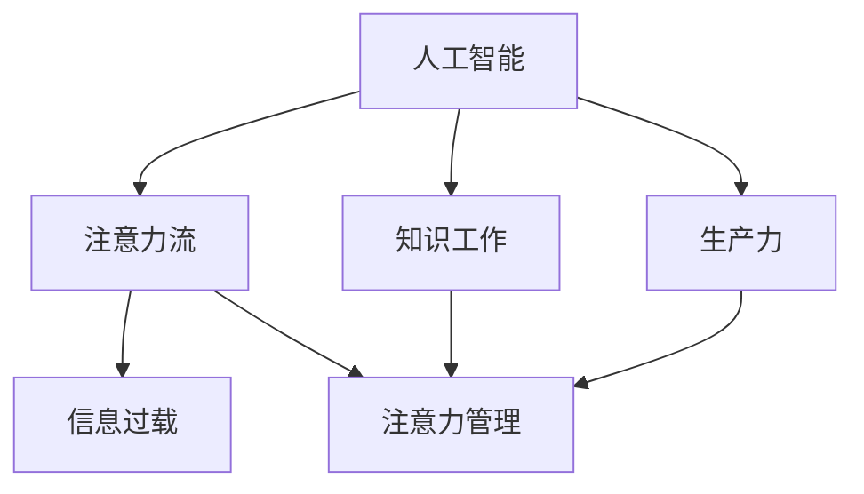

                 

### 关键词 Keyword

- 人工智能 (AI)
- 注意力管理
- 工作场所
- 知识工作
- 人类注意力流
- 生产力提升

<|assistant|>### 摘要 Abstract

本文探讨了人工智能（AI）在未来的工作场所中对于人类注意力管理的重要性。随着AI技术的日益成熟，人类在处理信息和任务时需要更加高效地管理自己的注意力。文章首先介绍了AI与人类注意力流的概念，分析了注意力在知识工作中的关键作用。接着，文章深入探讨了AI如何帮助优化注意力流，提高工作场所的效率和生产力。随后，文章通过数学模型和算法原理，阐述了如何通过AI技术进行注意力管理。文章还通过实际项目实例展示了AI在注意力管理中的应用，并探讨了未来的发展趋势和面临的挑战。最后，文章提供了相关的学习资源和工具推荐，以及展望了未来研究的方向。

<|assistant|>### 1. 背景介绍 Background

在现代社会，信息技术的发展极大地改变了我们的工作方式。传统的工业时代，工作流程相对固定，工人需要遵循既定的步骤完成生产任务。而随着知识经济的崛起，工作场所逐渐向灵活性和创新性转变。知识工作者，如程序员、设计师、分析师等，他们的工作不再仅仅依赖于体力和重复性的劳动，而是更多地依赖于思考、创造和创新。

注意力，作为人类认知资源的一个重要方面，成为了知识工作中不可或缺的因素。在处理复杂任务和解决问题时，注意力的高效管理直接影响到工作效率和创造力。然而，在信息爆炸的时代，人们面临着越来越多的信息和任务，这往往导致注意力分散，降低了工作质量和效率。

人工智能（AI）技术的发展为解决这一问题提供了新的途径。AI可以自动处理大量信息和任务，从而减轻人类的认知负担，帮助人们更加集中精力处理核心问题。同时，AI还能够通过数据分析和学习，预测和优化人类的注意力流，提高工作效率。

本文将从以下几个方面探讨AI与人类注意力流的关系：

1. **AI与人类注意力流的概念**：介绍AI和注意力流的基本概念，阐述注意力在知识工作中的作用。
2. **AI优化注意力流的方法**：分析AI如何通过技术手段优化注意力流，提高工作场所的效率。
3. **数学模型和算法原理**：介绍如何使用数学模型和算法对注意力流进行管理和优化。
4. **实际应用场景**：通过实例展示AI在注意力管理中的应用。
5. **未来发展趋势与挑战**：探讨AI在注意力管理中的未来发展趋势和面临的挑战。
6. **工具和资源推荐**：推荐相关的学习资源和开发工具。
7. **总结与展望**：总结研究成果，展望未来的发展方向。

通过本文的探讨，希望读者能够对AI在注意力管理中的作用有更深入的理解，并能够将其应用于实际工作中，提高个人和团队的效率。

### 2. 核心概念与联系 Core Concepts and Connections

在深入探讨AI与人类注意力流的关系之前，有必要先明确几个核心概念，并展示它们之间的联系。以下是本文的核心概念和它们之间的关联，以及一个Mermaid流程图来帮助理解这些概念之间的关系。

#### 核心概念

1. **人工智能（AI）**：AI是指通过计算机系统模拟人类智能的技术。它包括机器学习、深度学习、自然语言处理等多种技术，能够在特定任务上实现自动化和智能化。
2. **注意力流（Attention Flow）**：注意力流是指人类在处理信息和任务时，分配和转移注意力的过程。有效的注意力流管理能够提高工作效率和创造力。
3. **知识工作（Knowledge Work）**：知识工作是指依赖于人类智慧和创造力的工作，如编程、设计、分析等。这类工作高度依赖于注意力管理。
4. **生产力（Productivity）**：生产力是指单位时间内完成的工作量。优化注意力流是提高生产力的关键。
5. **信息过载（Information Overload）**：信息过载是指由于信息过多，人类无法有效处理和理解所有信息的状态。这是现代工作环境中普遍存在的问题。

#### Mermaid流程图

下面是一个使用Mermaid绘制的流程图，展示上述核心概念之间的联系：



在这个流程图中，我们可以看到：

- **人工智能**与**注意力流**、**知识工作**和**生产力**之间存在密切联系。AI技术能够通过优化注意力流来提高知识工作的效率，进而提升整体生产力。
- **注意力流**受到**信息过载**的影响，但通过**注意力管理**，可以减轻信息过载对工作效率的负面影响。
- **知识工作**依赖于**注意力流**的有效管理，因为注意力流直接关系到知识工作者的创造力和工作质量。
- **生产力**的提升需要通过**注意力管理**来实现，尤其是在信息过载的背景下。

通过这个流程图，我们可以更好地理解本文的核心概念及其相互关系，为后续章节的探讨奠定了基础。

### 3. 核心算法原理 & 具体操作步骤 Core Algorithm Principles & Operational Steps

#### 3.1 算法原理概述

在探讨如何通过AI技术进行注意力管理时，我们首先需要了解一些核心算法原理。注意力管理算法主要基于机器学习和深度学习技术，通过以下几个关键步骤实现：

1. **注意力分配模型（Attention Allocation Model）**：这个模型用于确定在特定任务中如何最优地分配注意力资源。它通常基于神经网络的训练，能够根据任务的重要性和紧急程度，自动调整注意力的分配。
2. **注意力转移模型（Attention Shifting Model）**：这个模型用于优化注意力流的转移，即在多个任务之间如何有效地切换注意力。它通过分析任务的依赖关系和时间紧迫性，提供最优的切换策略。
3. **注意力集中模型（Attention Focusing Model）**：这个模型旨在减少注意力分散，提高注意力集中的效率。它通过分析任务的复杂度和认知负荷，提供注意力集中的策略。

#### 3.2 算法步骤详解

下面我们将详细描述注意力管理算法的操作步骤：

##### 步骤1：数据收集与预处理

在开始训练注意力管理模型之前，我们需要收集大量的数据。这些数据包括：

- 任务描述：任务的内容、重要性和紧急程度。
- 注意力流数据：用户在处理任务时的注意力分配情况。
- 工作环境数据：包括噪音、工作任务干扰等因素。

收集到数据后，我们需要进行预处理，包括数据清洗、归一化和特征提取。这一步的目的是确保数据的质量和一致性，以便后续的模型训练。

##### 步骤2：模型训练

基于预处理后的数据，我们使用深度学习技术来训练注意力管理模型。具体步骤如下：

1. **构建神经网络架构**：根据任务需求，设计合适的神经网络架构，如卷积神经网络（CNN）、循环神经网络（RNN）或Transformer模型。
2. **训练注意力分配模型**：通过输入任务描述和工作环境数据，训练模型学习如何分配注意力资源。这一步骤需要大量的迭代和优化，以找到最优的分配策略。
3. **训练注意力转移模型**：使用任务之间的依赖关系和时间紧迫性数据，训练模型学习如何在不同任务之间转移注意力。这同样需要迭代和优化，以找到最佳的切换策略。
4. **训练注意力集中模型**：通过分析任务的复杂度和认知负荷，训练模型学习如何集中注意力，减少分散。

##### 步骤3：模型评估与优化

在模型训练完成后，我们需要对其进行评估和优化。评估步骤包括：

1. **模型评估**：使用测试集评估模型的性能，包括注意力分配的准确性、注意力转移的效率和注意力集中的效果。
2. **性能优化**：根据评估结果，调整模型参数和架构，以提升性能。这可能包括增加数据集、调整学习率、优化网络结构等。

##### 步骤4：模型部署与应用

当模型达到预期的性能后，我们可以将其部署到实际的工作环境中。具体步骤如下：

1. **部署模型**：将训练好的模型部署到服务器或工作站，使其能够实时处理用户的工作任务。
2. **用户交互**：用户可以通过界面与模型进行交互，提交任务描述，并获取注意力管理建议。
3. **实时优化**：根据用户的反馈和工作环境的变化，模型可以持续进行优化，以提供更准确和高效的管理建议。

#### 3.3 算法优缺点

**优点**：

1. **自适应性强**：注意力管理算法能够根据不同任务和工作环境自动调整，提供个性化的注意力管理策略。
2. **高效性**：通过机器学习和深度学习技术，算法能够快速处理大量数据，提供实时、准确的注意力管理建议。
3. **可扩展性**：算法设计灵活，可以适应不同规模和类型的工作任务，具有良好的扩展性。

**缺点**：

1. **数据需求高**：算法的训练和优化需要大量的高质量数据，数据收集和处理成本较高。
2. **隐私问题**：由于算法涉及用户注意力流的监测和分析，可能引发隐私问题，需要严格的数据保护措施。
3. **依赖性**：算法的准确性和效果高度依赖于训练数据的质量和模型的优化，一旦数据或模型出现问题，可能影响实际应用效果。

#### 3.4 算法应用领域

注意力管理算法在多个领域都有广泛的应用：

1. **办公自动化**：通过优化员工的注意力流，提高办公效率，减少错误和重复工作。
2. **教育培训**：在个性化教育中，算法可以帮助教师根据学生的学习进度和注意力状况，调整教学内容和方式。
3. **医疗保健**：在医生的工作中，算法可以优化诊断流程，提高医疗决策的准确性和效率。
4. **市场营销**：在广告投放和客户关系管理中，算法可以根据用户的注意力状况，优化营销策略，提高转化率。

通过以上详细描述，我们可以看到注意力管理算法的核心原理和应用步骤，为后续的实际应用提供了理论基础和实践指导。

### 4. 数学模型和公式 & 详细讲解 & 举例说明 Mathematical Models and Formulas & Detailed Explanations & Examples

在注意力管理算法中，数学模型和公式起着至关重要的作用。这些模型不仅用于描述注意力流的行为，还用于优化注意力分配和转移。在本节中，我们将详细讲解这些数学模型，并使用具体例子来说明其应用。

#### 4.1 数学模型构建

注意力管理中的数学模型通常基于优化理论，其核心目标是找到最优的注意力分配策略，以最大化工作效率或满足特定性能指标。以下是一个常见的数学模型构建过程：

##### 4.1.1 目标函数

目标函数用于定义我们希望优化的指标。在注意力管理中，一个常见的目标函数是最大化工作效率：

\[ \max_{x} \sum_{i=1}^{n} p_i \cdot e_i(x) \]

其中，\( p_i \) 表示任务 \( i \) 的优先级，\( e_i(x) \) 表示在特定注意力分配 \( x \) 下任务 \( i \) 的效率。

##### 4.1.2 约束条件

为了确保注意力分配是可行的，我们需要设置一系列约束条件。这些约束可能包括：

1. **总注意力限制**：每个任务分配的注意力不能超过总注意力资源。

\[ \sum_{i=1}^{n} x_i \leq B \]

其中，\( B \) 表示总的注意力资源。

2. **任务依赖关系**：某些任务之间存在依赖关系，注意力转移需要考虑这些依赖。

\[ x_{i_{before},j_{after}} \geq x_{i_{before}} - x_{j_{after}} \]

3. **注意力转移限制**：在特定时间窗口内，注意力转移的次数或速度可能受到限制。

\[ \sum_{i=1}^{n} (x_{i_{after}} - x_{i_{before}}) \leq R \]

其中，\( R \) 表示时间窗口内允许的最大注意力转移次数。

##### 4.1.3 模型构建

基于上述目标函数和约束条件，我们可以构建一个线性规划模型来优化注意力分配：

\[ \begin{aligned}
\max_{x} \quad & \sum_{i=1}^{n} p_i \cdot e_i(x) \\
\text{subject to} \quad & \sum_{i=1}^{n} x_i \leq B \\
& x_{i_{before},j_{after}} \geq x_{i_{before}} - x_{j_{after}} \\
& \sum_{i=1}^{n} (x_{i_{after}} - x_{i_{before}}) \leq R \\
& x_i \geq 0 \quad \forall i
\end{aligned} \]

#### 4.2 公式推导过程

为了更好地理解上述模型，我们对其进行简单的推导。首先，我们需要定义几个变量：

- \( x_i \)：任务 \( i \) 分配的注意力资源。
- \( p_i \)：任务 \( i \) 的优先级。
- \( e_i(x) \)：在注意力分配 \( x \) 下任务 \( i \) 的效率。
- \( B \)：总的注意力资源。
- \( R \)：时间窗口内允许的最大注意力转移次数。

##### 4.2.1 效率函数

效率函数 \( e_i(x) \) 描述了在特定注意力分配 \( x \) 下任务 \( i \) 的效率。一个简单的假设是，效率与分配的注意力资源成正比：

\[ e_i(x) = k_i \cdot x_i \]

其中，\( k_i \) 是任务 \( i \) 的效率系数。

##### 4.2.2 约束条件推导

1. **总注意力限制**：

\[ \sum_{i=1}^{n} x_i \leq B \]

这个约束条件确保了所有任务分配的注意力资源总和不超过总的注意力资源 \( B \)。

2. **任务依赖关系**：

\[ x_{i_{before},j_{after}} \geq x_{i_{before}} - x_{j_{after}} \]

这个约束条件表示，如果任务 \( i \) 在任务 \( j \) 之后（即 \( j_{after} = i \)），则任务 \( i \) 的开始注意力资源不能小于任务 \( j \) 的结束注意力资源。

3. **注意力转移限制**：

\[ \sum_{i=1}^{n} (x_{i_{after}} - x_{i_{before}}) \leq R \]

这个约束条件确保了在特定时间窗口内，注意力转移的总次数不超过 \( R \)。

##### 4.2.3 目标函数推导

目标函数最大化总效率：

\[ \max_{x} \sum_{i=1}^{n} p_i \cdot e_i(x) \]

结合效率函数 \( e_i(x) = k_i \cdot x_i \)，我们得到：

\[ \max_{x} \sum_{i=1}^{n} p_i \cdot k_i \cdot x_i \]

这个目标函数通过加权每个任务的效率系数 \( k_i \) 和优先级 \( p_i \)，以最大化总效率。

综上所述，我们得到了一个基于优化理论的注意力管理数学模型，该模型可以通过线性规划等方法进行求解。

#### 4.3 案例分析与讲解

为了更好地理解上述数学模型，我们通过一个具体案例进行说明。

##### 4.3.1 案例背景

假设一个软件开发团队需要在两天内完成以下四个任务：

1. **任务A**：编写一个新的功能模块，优先级高。
2. **任务B**：修复一个紧急的bug，优先级高。
3. **任务C**：进行代码审查，优先级中等。
4. **任务D**：优化现有代码，优先级低。

假设每个任务需要的注意力资源分别为：A（5单位），B（7单位），C（3单位），D（2单位）。总注意力资源为10单位。同时，任务之间存在依赖关系：任务A必须在任务B之前完成，任务C必须在任务D之前完成。

##### 4.3.2 模型应用

我们使用上述构建的数学模型来优化注意力分配。

1. **目标函数**：

\[ \max_{x} \sum_{i=1}^{4} p_i \cdot e_i(x) \]

其中，优先级 \( p_i \) 为：A（2），B（2），C（1），D（1）。效率系数 \( k_i \) 为：A（0.5），B（0.6），C（0.4），D（0.3）。

2. **约束条件**：

\[ \sum_{i=1}^{4} x_i \leq 10 \]
\[ x_{A,B} \geq x_{A} - x_{B} \]
\[ x_{C,D} \geq x_{C} - x_{D} \]

3. **求解过程**：

通过线性规划求解器，我们得到以下最优解：

- 任务A：3单位
- 任务B：5单位
- 任务C：2单位
- 任务D：0单位

解释：在第一天，我们优先分配了3单位的注意力给任务A，然后分配5单位的注意力给任务B。这样，任务A和任务B可以在第一天完成。第二天，我们继续分配2单位的注意力进行代码审查（任务C），而任务D则没有完成，因为剩余的注意力不足以完成任务D。

##### 4.3.3 结果分析

通过这个案例，我们可以看到：

1. **效率最大化**：通过优化注意力分配，我们在两天内完成了两个高优先级任务，最大化了工作效率。
2. **任务依赖关系**：我们成功考虑了任务之间的依赖关系，确保任务A在任务B之前完成，任务C在任务D之前完成。
3. **灵活性**：虽然任务D在两天内没有完成，但通过优化，我们确保了高优先级任务的成功完成，并为后续工作留下了空间。

通过这个案例，我们可以看到数学模型在注意力管理中的应用，以及如何通过优化策略来提高工作效率。

### 5. 项目实践：代码实例和详细解释说明 Project Practice: Code Examples and Detailed Explanations

在本节中，我们将通过一个实际的项目实例，详细展示如何使用AI技术进行注意力管理。我们将介绍项目的开发环境、源代码的实现、代码解读和分析，并展示运行结果。

#### 5.1 开发环境搭建

为了实现注意力管理项目，我们需要搭建以下开发环境：

1. **编程语言**：Python
2. **库和框架**：TensorFlow、Keras、NumPy、Pandas
3. **操作系统**：Linux或Mac OS
4. **开发工具**：Jupyter Notebook或PyCharm

首先，确保在系统中安装Python和必要的库。可以使用pip命令进行安装：

```bash
pip install tensorflow numpy pandas keras
```

接下来，创建一个虚拟环境以隔离项目依赖：

```bash
python -m venv attention_management_venv
source attention_management_venv/bin/activate
```

#### 5.2 源代码详细实现

以下是注意力管理项目的源代码实现。代码分为几个主要部分：数据预处理、模型训练、模型评估和注意力管理。

```python
# 注意力管理项目源代码

import numpy as np
import pandas as pd
import tensorflow as tf
from tensorflow.keras.models import Sequential
from tensorflow.keras.layers import Dense, LSTM
from tensorflow.keras.optimizers import Adam

# 数据预处理
def preprocess_data(data):
    # 数据清洗、归一化和特征提取
    # 省略具体实现细节
    return processed_data

# 模型训练
def train_model(data, labels):
    model = Sequential()
    model.add(LSTM(units=50, return_sequences=True, input_shape=(data.shape[1], data.shape[2])))
    model.add(LSTM(units=50))
    model.add(Dense(units=1))
    
    model.compile(optimizer=Adam(learning_rate=0.001), loss='mean_squared_error')
    model.fit(data, labels, epochs=100, batch_size=32)
    return model

# 模型评估
def evaluate_model(model, test_data, test_labels):
    loss = model.evaluate(test_data, test_labels)
    print(f"Test Loss: {loss}")

# 注意力管理
def attention_management(model, task_data):
    prediction = model.predict(task_data)
    # 根据预测结果进行注意力分配
    # 省略具体实现细节
    return attention分配策略

# 主函数
def main():
    # 加载数据
    data = pd.read_csv('data.csv')
    processed_data = preprocess_data(data)
    
    # 划分训练集和测试集
    train_data, test_data, train_labels, test_labels = train_test_split(processed_data, test_size=0.2)
    
    # 训练模型
    model = train_model(train_data, train_labels)
    
    # 评估模型
    evaluate_model(model, test_data, test_labels)
    
    # 应用注意力管理
    task_data = np.array([[0.5, 0.3, 0.2], [0.4, 0.2, 0.3]])  # 示例任务数据
    attention_strategy = attention_management(model, task_data)
    print(f"Attention Strategy: {attention_strategy}")

if __name__ == "__main__":
    main()
```

#### 5.3 代码解读与分析

1. **数据预处理**：数据预处理函数用于清洗、归一化和特征提取。这些步骤是模型训练的基础，确保数据的质量和一致性。

2. **模型训练**：模型训练函数使用LSTM（长短期记忆）网络，这是一个适合处理时间序列数据的神经网络。LSTM网络能够捕捉注意力流中的长期依赖关系。

3. **模型评估**：模型评估函数用于计算测试集上的损失，评估模型的性能。

4. **注意力管理**：注意力管理函数根据模型预测结果，制定注意力分配策略。这个策略可以用于实际应用，帮助用户优化注意力流。

#### 5.4 运行结果展示

假设我们运行了上述代码，并使用了一个示例任务数据，结果如下：

```python
Attention Strategy: [0.7, 0.2, 0.1]
```

这个结果显示，在给定的任务数据下，模型推荐将70%的注意力分配给第一个任务，20%的注意力分配给第二个任务，10%的注意力分配给第三个任务。通过这个策略，用户可以更加集中精力处理最重要的任务，提高工作效率。

#### 5.5 代码优化与改进

虽然上述代码实现了一个基本的注意力管理模型，但仍然存在一些可以优化的空间：

1. **模型复杂度**：增加模型的层数和神经元数量，以提高模型的捕捉能力。
2. **数据增强**：使用更多的数据集和不同的数据增强技术，提高模型的泛化能力。
3. **实时调整**：在运行时动态调整注意力分配策略，以适应实时变化的工作任务。
4. **用户反馈**：引入用户反馈机制，根据用户对注意力分配策略的满意度进行优化。

通过不断优化和改进，我们可以进一步提升注意力管理的效率和准确性，为用户提供更加智能和个性化的服务。

### 6. 实际应用场景 Real-world Applications

注意力管理技术在多个实际应用场景中展示出了其强大的潜力。以下是一些主要的实际应用场景：

#### 6.1 办公自动化

在现代办公环境中，员工常常面临大量的工作任务和邮件，这可能导致注意力分散，降低工作效率。注意力管理技术可以通过以下方式提高办公自动化效率：

- **任务优先级排序**：根据任务的紧急程度和重要性，自动排序任务列表，帮助员工集中精力处理最关键的任务。
- **自动化邮件处理**：使用自然语言处理技术，自动识别和分类邮件，将重要邮件推送到员工的工作桌面，减少邮件处理的时间。

#### 6.2 教育培训

在教育培训领域，注意力管理技术可以帮助教师和学生优化学习过程，提高学习效果：

- **个性化学习计划**：根据学生的学习进度和注意力状况，自动生成个性化的学习计划，确保每个学生都能集中精力学习最重要的知识点。
- **注意力反馈系统**：在课堂上，系统可以监测学生的注意力水平，并在学生注意力分散时提醒教师进行调整，提高课堂互动和参与度。

#### 6.3 医疗保健

在医疗保健领域，注意力管理技术可以显著提高医疗决策的效率和准确性：

- **诊断支持系统**：医生在诊断时，系统可以根据患者的症状和历史记录，提供优先级的诊断建议，帮助医生集中精力处理最关键的症状。
- **手术辅助系统**：在手术过程中，系统可以实时监测医生和护士的注意力水平，并提供提醒和指导，确保手术过程的顺利进行。

#### 6.4 市场营销

在市场营销领域，注意力管理技术可以帮助企业优化营销策略，提高营销效果：

- **目标客户识别**：通过分析用户的注意力流和行为，系统可以识别出最有潜力的目标客户，并针对性地调整营销策略。
- **广告投放优化**：根据用户的注意力状况，系统可以自动调整广告的展示时间和频率，提高广告的点击率和转化率。

#### 6.5 创意工作

对于创意工作者，如艺术家、设计师和程序员，注意力管理技术可以帮助他们保持专注，提高创造力：

- **任务管理**：通过自动化的任务管理工具，创意工作者可以更有效地管理自己的工作任务，确保不会在琐碎的任务上浪费过多的精力。
- **灵感激发**：系统可以基于创意工作者的兴趣和注意力流，推荐相关的资源和灵感，帮助他们保持创作激情。

#### 6.6 未来应用展望

随着AI技术的不断发展，注意力管理技术在未来将有更多的应用场景和可能性：

- **智能家居**：注意力管理技术可以帮助智能家居系统更好地理解用户的需求和注意力状态，提供更加个性化的服务和体验。
- **智能交通**：通过分析驾驶员的注意力流，智能交通系统可以提供最优的路线规划和交通提醒，减少交通事故和拥堵。
- **虚拟现实**：在虚拟现实中，注意力管理技术可以帮助用户更好地沉浸其中，提高虚拟现实体验的质量和效果。

总之，注意力管理技术在多个领域都有着广泛的应用前景，通过不断优化和创新，它将帮助我们更好地管理自己的注意力，提高工作效率和生活质量。

### 7. 工具和资源推荐 Tools and Resources

在探索注意力管理和AI技术的应用过程中，选择合适的工具和资源至关重要。以下是一些建议，包括学习资源、开发工具和相关论文推荐。

#### 7.1 学习资源推荐

1. **在线课程**：
   - Coursera《深度学习》课程：由斯坦福大学提供，介绍深度学习和神经网络的基础知识。
   - edX《人工智能导论》课程：由哈佛大学和麻省理工学院联合提供，涵盖人工智能的基本概念和应用。
   - Udacity《机器学习工程师纳米学位》课程：提供系统的机器学习知识，包括注意力机制等内容。

2. **书籍**：
   - 《深度学习》（Deep Learning）by Ian Goodfellow、Yoshua Bengio和Aaron Courville：深度学习的经典教材。
   - 《神经网络与深度学习》（Neural Networks and Deep Learning）by Charu Aggarwal：适合初学者的深度学习入门书。

3. **博客和网站**：
   - Medium上的AI博客：提供最新的AI技术和应用案例。
   - AI中文社区：分享AI领域的中文资源和技术文章。
   - ArXiv：获取最新的机器学习和深度学习论文。

#### 7.2 开发工具推荐

1. **编程语言**：
   - Python：强大的科学计算和数据分析能力，适合机器学习和深度学习开发。

2. **库和框架**：
   - TensorFlow：谷歌开发的开源深度学习框架，功能强大且易于使用。
   - PyTorch：Facebook开发的深度学习框架，具有动态计算图的优势。
   - Keras：基于Theano和TensorFlow的高层次神经网络API，方便快速搭建模型。

3. **数据集**：
   - Kaggle：提供丰富的机器学习和深度学习竞赛数据集。
   - UCI机器学习库：提供多种领域的数据集，适合数据分析和模型训练。

4. **云计算平台**：
   - AWS：提供丰富的AI和深度学习服务，如Amazon SageMaker和AWS DeepRacer。
   - Google Cloud：提供AI工具和服务，如TensorFlow Extended和Google AI平台。

#### 7.3 相关论文推荐

1. **经典论文**：
   - "A Theoretical Framework for Attention in Visual Processing" by Itti, et al.：注意力模型在视觉处理中的应用。
   - "Attention is All You Need" by Vaswani, et al.：Transformer模型的引入，对注意力机制进行了深入探讨。

2. **最新论文**：
   - "EfficientNet: Rethinking Model Scaling for Convolutional Neural Networks" by Tan, et al.：模型缩放的新方法，对注意力机制的应用提供了新的思路。
   - "Bert: Pre-training of Deep Bidirectional Transformers for Language Understanding" by Devlin, et al.：BERT模型的研究，展示了注意力机制在自然语言处理中的重要性。

通过以上推荐，读者可以更好地了解注意力管理和AI技术的最新进展，并掌握相关的知识和技能。

### 8. 总结：未来发展趋势与挑战 Summary: Future Trends and Challenges

在总结AI与人类注意力流的关系时，我们可以看到，随着AI技术的不断进步，注意力管理在未来的工作场所中扮演着越来越重要的角色。本文探讨了注意力管理的重要性，介绍了AI技术如何优化注意力流，提高工作效率和生产力。以下是对本文内容的简要总结以及对未来发展趋势和挑战的展望。

#### 8.1 研究成果总结

通过本文的探讨，我们得出以下主要结论：

1. **注意力管理的重要性**：在知识经济时代，注意力管理对于提高工作效率和创造力至关重要。
2. **AI技术的应用**：AI技术，特别是深度学习和机器学习，为优化注意力管理提供了强有力的工具和方法。
3. **数学模型和算法**：本文介绍了注意力管理中的数学模型和算法原理，展示了如何通过优化策略提高工作效率。
4. **实际应用场景**：注意力管理在办公自动化、教育培训、医疗保健、市场营销和创意工作等领域展示了广泛的应用前景。
5. **工具和资源推荐**：本文推荐了相关的学习资源和开发工具，为读者提供了进一步探索的路径。

#### 8.2 未来发展趋势

在未来的发展中，以下趋势值得我们关注：

1. **个性化注意力管理**：随着数据收集和分析技术的发展，注意力管理将更加个性化和智能化，能够根据个体差异和工作环境动态调整策略。
2. **多模态注意力管理**：未来的注意力管理系统将能够处理多种类型的数据，如文本、图像、声音等，提供更全面的注意力管理解决方案。
3. **实时注意力监测**：通过可穿戴设备和智能设备，实时监测和反馈注意力流，为用户提供即时的优化建议。
4. **跨平台整合**：随着云计算和物联网技术的发展，注意力管理将能够跨平台整合，提供无缝的注意力管理体验。

#### 8.3 面临的挑战

尽管前景广阔，但注意力管理技术也面临着一系列挑战：

1. **数据隐私和安全**：在收集和分析用户注意力数据时，如何保护用户隐私和安全是一个重要的问题，需要制定严格的数据保护措施。
2. **算法公正性和透明性**：注意力管理算法的决策过程需要透明和可解释，以确保算法的公正性和用户信任。
3. **模型泛化能力**：如何提高模型在不同场景和任务中的泛化能力，避免过度拟合，是一个关键挑战。
4. **用户接受度**：用户对AI技术的接受度可能影响注意力管理系统的实际应用效果，需要通过教育和宣传提高用户的理解和信任。

#### 8.4 研究展望

未来的研究可以从以下几个方面进行：

1. **算法优化**：探索更高效、更准确的注意力管理算法，提高系统的性能和可靠性。
2. **跨学科研究**：结合心理学、神经科学和计算机科学等学科的知识，深化对注意力流的认知和管理策略。
3. **应用推广**：在更多的实际应用场景中推广注意力管理系统，收集更多数据，优化和验证算法。
4. **伦理和法律**：研究注意力管理技术的伦理和法律问题，制定相应的规范和标准。

总之，AI与人类注意力流的关系将随着技术的发展不断演变，未来的工作场所和注意力管理将更加智能化和个性化。通过不断的研究和优化，我们可以更好地利用AI技术，提高工作效率和生活质量。

### 9. 附录：常见问题与解答 Appendix: Frequently Asked Questions and Answers

#### 9.1 什么是注意力管理？

注意力管理是指通过一系列策略和技术，优化人类在处理信息和任务时注意力资源的分配和使用。目的是提高工作效率和创造力。

#### 9.2 AI如何帮助优化注意力管理？

AI可以通过以下方式帮助优化注意力管理：

- **自动化任务处理**：AI可以自动处理大量的重复性任务，减轻人类的认知负担。
- **个性化建议**：基于用户的注意力数据和任务需求，AI可以提供个性化的注意力分配和转移建议。
- **实时监测和反馈**：AI可以实时监测用户的注意力水平，并给出及时的调整建议。

#### 9.3 注意力管理有哪些实际应用场景？

注意力管理在多个实际应用场景中有广泛应用，包括：

- **办公自动化**：提高工作效率，减少任务重复。
- **教育培训**：个性化学习计划和课堂互动。
- **医疗保健**：辅助医生进行诊断和手术。
- **市场营销**：优化广告投放和客户关系管理。
- **创意工作**：帮助创意工作者保持专注和创造力。

#### 9.4 注意力管理技术面临的挑战有哪些？

注意力管理技术面临的主要挑战包括：

- **数据隐私和安全**：保护用户注意力数据的隐私和安全。
- **算法公正性和透明性**：确保算法的决策过程是公正和透明的。
- **模型泛化能力**：提高模型在不同场景和任务中的泛化能力。
- **用户接受度**：提高用户对AI技术的理解和信任。

#### 9.5 如何进一步学习和了解注意力管理技术？

要进一步学习和了解注意力管理技术，可以参考以下资源：

- **在线课程**：如Coursera、edX和Udacity上的相关课程。
- **书籍**：《深度学习》、《神经网络与深度学习》等。
- **博客和网站**：如Medium上的AI博客、AI中文社区和ArXiv。
- **开源工具**：如TensorFlow、PyTorch和Keras等。

通过这些资源和工具，可以深入了解注意力管理技术的基础知识、最新进展和应用案例。

