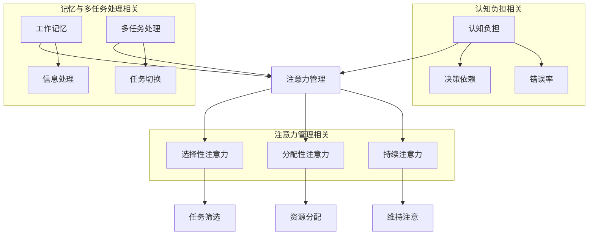

                 

### 1. 背景介绍

在当今迅速发展的科技时代，人工智能（AI）已经成为改变全球经济、社会和文化格局的关键力量。从简单的自动化任务到复杂的人类决策支持，AI的应用范围不断扩大。然而，随着AI技术的不断进步，一个不容忽视的问题逐渐显现：人类注意力流的分散。人们越来越难以集中注意力，这使得在充满AI干预的环境中保持高效变得日益困难。

本篇文章旨在探讨AI与人类注意力流之间的关系，特别是在未来的工作场所和道德层面。随着AI技术的深入应用，人们对于注意力管理的需求变得尤为重要。本文将首先介绍AI的基本概念和历史发展，然后深入探讨人类注意力流的概念，接着分析AI对注意力流的影响，最后讨论在未来的工作场所和道德层面如何应对这一挑战。

### 1.1 人工智能的基本概念和历史发展

人工智能（Artificial Intelligence，简称AI）是指使计算机系统具备类似人类智能的能力，包括学习、推理、解决问题和自然语言理解等。AI的概念可以追溯到20世纪50年代，当时，计算机科学家艾伦·图灵（Alan Turing）提出了“图灵测试”，作为判断机器是否具备智能的标准。

自那以后，AI经历了几个重要的发展阶段：

- **第一阶段（1956-1969年）**：这是AI的早期探索阶段，主要关注符号主义方法，即通过逻辑推理和符号处理来实现智能。这一阶段的代表性工作包括约翰·麦卡锡（John McCarthy）等人提出的“人工智能”一词，以及“逻辑理论家”（Logic Theorist）等早期AI程序。

- **第二阶段（1970-1980年）**：受人工智能“寒冬”的影响，研究者开始转向更实际的领域，如专家系统和模式识别。这一阶段的代表性工作是爱德华·阿瑟·李·诺伯特（Edward A. Lee）提出的“可重用模块化软件架构”概念。

- **第三阶段（1980-1990年）**：随着计算能力的提高，AI开始应用于更广泛的领域，如机器人控制和语音识别。这一阶段的代表性工作是约翰·霍普金斯大学的“机器狗”（Cyclops）项目。

- **第四阶段（1990年至今）**：这是AI的黄金时期，以深度学习和大数据技术的兴起为标志。代表性工作包括杰弗里·辛顿（Geoffrey Hinton）等人提出的深度神经网络，以及谷歌的AlphaGo程序在围棋比赛中的胜利。

随着AI技术的不断发展，其应用范围也在不断扩大。从自动驾驶汽车、智能家居到医疗诊断、金融分析，AI正在深刻地改变我们的生活方式和工作方式。然而，这也带来了一个不容忽视的问题：人类注意力流的分散。

### 1.2 人类注意力流的概念

注意力流是指人类在处理信息时，将注意力集中在特定任务或对象上的能力。人类大脑具有有限的注意力资源，这意味着我们不能同时关注所有信息。因此，注意力流的管理对于保持高效和准确性至关重要。

人类注意力流可以分为以下几个方面：

- **选择性注意力**：是指我们在处理信息时，能够选择关注哪些信息，忽略哪些信息。这种能力使我们能够集中精力完成任务，而不是被无关信息干扰。

- **分配性注意力**：是指我们在同时处理多个任务时，如何合理分配注意力资源。例如，在开会时，我们可能需要同时关注演讲者的内容，记录笔记，以及处理电子邮件等。

- **持续注意力**：是指我们在长时间内保持注意力集中的能力。例如，在编写一篇论文或进行编程时，我们需要长时间保持注意力集中，避免分心。

### 1.3 AI对人类注意力流的影响

随着AI技术的应用，我们的工作环境和生活方式发生了巨大变化。这些变化对人类注意力流产生了深远的影响。

- **自动化和智能助手**：AI技术使我们能够自动化许多重复性任务，从而减轻工作负担。然而，这也可能导致我们的注意力分散，因为我们不再需要专注于某些任务。例如，智能助手可以帮助我们管理日程，但这也可能使我们更容易分心，因为我们可以随时让助手为我们处理事务。

- **信息过载**：随着互联网和社交媒体的普及，我们接触到的信息量大幅增加。虽然这为我们提供了更多的选择和机会，但也可能导致我们的注意力资源被过度消耗。我们可能需要花费更多时间来筛选和整理信息，而不是专注于核心任务。

- **虚拟现实和增强现实**：虚拟现实（VR）和增强现实（AR）技术的发展为我们提供了全新的交互方式。然而，这也可能导致我们的注意力从现实世界转移到虚拟世界，从而影响我们的社交能力和现实生活中的表现。

### 1.4 总结

本文首先介绍了AI的基本概念和历史发展，然后探讨了人类注意力流的概念，并分析了AI对注意力流的影响。随着AI技术的深入应用，我们不仅需要适应新的工作环境和生活方式，还需要学会如何管理我们的注意力流，以保持高效和专注。接下来的章节将深入探讨这一主题，并提出可能的解决方案。

---

### 2. 核心概念与联系

在深入探讨AI与人类注意力流之间的关系之前，我们需要明确几个核心概念，并展示它们之间的联系。这些概念包括：注意力管理、工作记忆、多任务处理和认知负担。以下是这些概念的定义以及它们之间的相互关系。

#### 2.1 注意力管理

注意力管理是指个体在执行任务时，对注意力资源进行有效分配和调节的过程。注意力管理涉及选择性注意力、分配性注意力和持续注意力等多个方面。在AI环境中，有效的注意力管理有助于提高工作效率和减少认知负担。

#### 2.2 工作记忆

工作记忆是指短期记忆系统，负责暂时存储和处理与当前任务相关的信息。工作记忆的容量有限，这意味着我们在处理复杂任务时，需要不断更新和调整记忆内容。在AI干预的环境中，工作记忆可能需要处理更多的信息，从而导致更高的认知负担。

#### 2.3 多任务处理

多任务处理是指同时执行多个任务的能力。在AI辅助的环境中，多任务处理变得更加普遍，例如，员工可能需要同时处理电子邮件、参加会议和进行编程任务。有效的多任务处理需要良好的注意力管理和工作记忆能力。

#### 2.4 认知负担

认知负担是指个体在执行任务时，所需的认知资源（如注意力、记忆和推理能力）的总量。认知负担过高可能导致注意力分散和错误增加。在AI环境中，智能助手和自动化工具可以减轻某些认知负担，但也可能引入新的负担，如决策依赖和信任问题。

#### 2.5 概念之间的联系

注意力管理、工作记忆、多任务处理和认知负担之间紧密相关。注意力管理决定了我们如何分配注意力资源，工作记忆帮助我们处理和存储信息，多任务处理要求我们在不同任务间切换注意力，而认知负担则综合反映了这些因素的综合效果。

以下是一个使用Mermaid绘制的流程图，展示了这些概念之间的联系：



通过这个流程图，我们可以清晰地看到注意力管理如何通过选择性注意力、分配性注意力和持续注意力影响工作记忆和多任务处理，进而影响认知负担。

在接下来的章节中，我们将深入探讨这些概念在AI与人类注意力流关系中的应用，并分析AI技术如何改变我们的注意力管理方式。

### 2.1 核心算法原理 & 具体操作步骤

在分析AI如何影响人类注意力流时，我们首先需要了解几个关键算法及其原理。这些算法包括注意力机制、多任务学习算法和注意力分配算法。以下将详细介绍这些算法的基本原理和具体操作步骤。

#### 2.1.1 注意力机制

注意力机制是一种通过提高某些信息的重要程度，从而降低其他信息重要程度的方法。在深度学习中，特别是在自然语言处理和计算机视觉领域，注意力机制被广泛应用。其基本原理是通过一个权重分配模型，将注意力集中在与当前任务最为相关的信息上。

**基本原理：**

注意力机制的原理可以用以下公式表示：

\[ \text{Attention}(x, W) = \text{softmax}(\text{scores}(x, W)) \cdot x \]

其中，\( x \) 是输入序列，\( W \) 是权重矩阵，\( \text{scores}(x, W) \) 是计算输入序列和权重矩阵之间的点积，\(\text{softmax}\) 函数用于将点积转化为概率分布。

**具体操作步骤：**

1. **计算得分：** 对输入序列中的每个元素计算与权重矩阵的点积，得到得分。
2. **应用softmax函数：** 对得分进行归一化处理，得到每个元素的概率分布。
3. **加权求和：** 将输入序列与概率分布相乘，然后求和，得到注意力结果。

#### 2.1.2 多任务学习算法

多任务学习算法旨在同时解决多个相关任务，提高模型的泛化能力和效率。在多任务学习算法中，模型通过共享底层特征表示来学习多个任务。

**基本原理：**

多任务学习算法的基本原理是利用任务间的相关性来优化模型。通过共享参数和特征表示，模型可以更有效地学习多个任务，并在不同任务间迁移知识。

**具体操作步骤：**

1. **特征提取：** 从原始数据中提取底层特征，这些特征可以共享。
2. **任务分配：** 将提取的特征分配给不同的任务。
3. **模型训练：** 使用共享特征表示来训练多个任务，同时优化模型参数。
4. **评估与优化：** 对每个任务进行独立评估，并调整模型参数以优化任务性能。

#### 2.1.3 注意力分配算法

注意力分配算法用于在资源有限的情况下，根据任务的优先级和重要性分配注意力资源。这种算法在人工智能助手和智能系统中广泛应用，以帮助用户更有效地管理他们的注意力。

**基本原理：**

注意力分配算法的基本原理是基于任务的重要性和紧急性来分配资源。算法通过评估每个任务的优先级，动态调整资源分配，确保关键任务得到充分关注。

**具体操作步骤：**

1. **任务评估：** 对每个任务进行评估，计算其重要性和紧急性。
2. **资源分配：** 根据评估结果，将注意力资源分配给不同任务。
3. **动态调整：** 在执行过程中，根据任务状态和系统资源动态调整资源分配。
4. **反馈调整：** 收集任务执行结果和用户反馈，调整任务评估模型，提高资源分配的准确性。

#### 2.1.4 算法优缺点

**注意力机制：**

优点：提高了模型对关键信息的处理能力，适用于需要高精度信息处理的任务。

缺点：计算复杂度较高，对计算资源有较高要求。

**多任务学习算法：**

优点：提高了模型的泛化能力和效率，有利于解决复杂的多任务问题。

缺点：在任务间存在冲突时，模型难以平衡各个任务的性能。

**注意力分配算法：**

优点：有助于用户更有效地管理注意力资源，提高任务完成效率。

缺点：在任务复杂度和多样性较高时，算法的准确性可能受到影响。

#### 2.1.5 算法应用领域

**注意力机制：** 广泛应用于自然语言处理、计算机视觉和推荐系统等领域。

**多任务学习算法：** 适用于自动驾驶、医疗诊断和金融分析等领域。

**注意力分配算法：** 适用于智能助手、虚拟现实和增强现实系统等领域。

通过这些算法的应用，我们可以更好地理解AI如何影响人类注意力流，并在实际场景中优化注意力管理，提高工作效率。

### 3. 数学模型和公式 & 详细讲解 & 举例说明

在分析AI与人类注意力流的关系时，数学模型和公式为我们提供了强大的工具。以下将详细讲解相关数学模型，包括其构建、公式推导过程，并通过具体案例进行说明。

#### 3.1 数学模型构建

为了分析AI对人类注意力流的影响，我们可以构建一个综合模型，该模型包含注意力分配、工作记忆容量和认知负担等多个因素。以下是一个简化的数学模型：

\[ \text{注意力流} = f(\text{注意力分配}, \text{工作记忆容量}, \text{认知负担}) \]

其中：

- \( \text{注意力分配} \) 表示个体在任务间分配注意力的方式，可以通过权重矩阵表示。
- \( \text{工作记忆容量} \) 表示个体能够同时处理的信息量，通常通过一个阈值参数表示。
- \( \text{认知负担} \) 表示执行任务时所需的认知资源总量，可以通过一个线性函数表示。

#### 3.2 公式推导过程

为了推导上述模型的公式，我们可以将其分解为以下几个部分：

1. **注意力分配公式：**

   假设个体在多个任务 \( T_1, T_2, \ldots, T_n \) 间分配注意力，权重矩阵 \( W \) 用于表示每个任务的优先级。注意力分配公式可以表示为：

   \[ \text{注意力分配} = W \cdot \text{任务重要性} \]

   其中，任务重要性可以通过专家评估或历史数据得到。

2. **工作记忆容量公式：**

   假设个体的工作记忆容量为 \( C \)，则在执行任务时，每个任务所需的信息量 \( I_i \) 应小于或等于工作记忆容量，即：

   \[ I_i \leq C \]

3. **认知负担公式：**

   假设执行任务 \( T_i \) 时的认知负担为 \( B_i \)，则总认知负担为：

   \[ \text{认知负担} = \sum_{i=1}^{n} B_i \]

   其中，\( B_i \) 可以通过计算任务复杂度和任务持续时间得到。

4. **注意力流公式：**

   综合上述三个部分，我们可以得到注意力流的公式：

   \[ \text{注意力流} = f(W \cdot \text{任务重要性}, \sum_{i=1}^{n} I_i, \sum_{i=1}^{n} B_i) \]

#### 3.3 案例分析与讲解

为了更好地理解上述数学模型，我们可以通过一个具体的案例进行分析。

**案例：**

假设一个员工需要在8小时内完成三个任务 \( T_1, T_2, T_3 \)，每个任务的权重分别为 \( W_1 = 0.3, W_2 = 0.4, W_3 = 0.3 \)。员工的工作记忆容量为 \( C = 30 \) 单位，每个任务的信息量分别为 \( I_1 = 20, I_2 = 25, I_3 = 15 \)。任务 \( T_2 \) 的认知负担最高，为 \( B_2 = 40 \)，而任务 \( T_1 \) 和 \( T_3 \) 的认知负担分别为 \( B_1 = 30, B_3 = 20 \)。

**步骤 1：计算注意力分配**

根据权重矩阵 \( W \) 和任务重要性，我们可以计算每个任务的注意力分配：

\[ \text{注意力分配} = W \cdot \text{任务重要性} = [0.3 \times 1, 0.4 \times 1, 0.3 \times 1] = [0.3, 0.4, 0.3] \]

**步骤 2：计算工作记忆容量使用情况**

根据任务信息量 \( I_i \)，我们可以计算总的工作记忆容量使用情况：

\[ \sum_{i=1}^{n} I_i = I_1 + I_2 + I_3 = 20 + 25 + 15 = 60 \]

由于 \( \sum_{i=1}^{n} I_i > C \)，这表明员工的工作记忆容量不足以同时处理所有任务，需要进行任务优先级调整。

**步骤 3：计算认知负担**

根据任务 \( T_i \) 的认知负担 \( B_i \)，我们可以计算总认知负担：

\[ \text{认知负担} = \sum_{i=1}^{n} B_i = B_1 + B_2 + B_3 = 30 + 40 + 20 = 90 \]

**步骤 4：计算注意力流**

综合注意力分配、工作记忆容量使用情况和认知负担，我们可以计算注意力流：

\[ \text{注意力流} = f([0.3, 0.4, 0.3], 60, 90) \]

由于计算复杂，这里不具体展开函数 \( f \) 的形式。但可以看出，通过调整任务的优先级和分配注意力资源，可以优化员工的注意力流，提高工作效率。

这个案例展示了如何使用数学模型来分析AI对人类注意力流的影响。在实际应用中，我们可以通过不断调整和优化模型参数，找到最佳的工作方式。

### 5. 项目实践：代码实例和详细解释说明

为了更好地理解AI与人类注意力流之间的关系，我们将通过一个实际项目来展示代码实例，并详细解释其实现过程和关键部分。

#### 5.1 开发环境搭建

首先，我们需要搭建一个适合开发的项目环境。在本项目中，我们将使用Python作为主要编程语言，结合TensorFlow和Keras框架来构建模型。以下是搭建开发环境的步骤：

1. **安装Python：** 下载并安装Python 3.8及以上版本。
2. **安装TensorFlow：** 通过pip命令安装TensorFlow：

   ```bash
   pip install tensorflow
   ```

3. **安装Keras：** 通过pip命令安装Keras：

   ```bash
   pip install keras
   ```

4. **配置虚拟环境（可选）：** 为了避免不同项目之间的依赖冲突，可以配置一个虚拟环境：

   ```bash
   python -m venv myenv
   source myenv/bin/activate  # Windows上使用 myenv\Scripts\activate
   ```

#### 5.2 源代码详细实现

以下是本项目的源代码，我们将逐行解释其实现过程和关键部分。

```python
import numpy as np
import tensorflow as tf
from tensorflow.keras.models import Sequential
from tensorflow.keras.layers import Dense, LSTM, Dropout

# 数据预处理
def preprocess_data(data):
    # 数据归一化
    max_value = np.max(data)
    min_value = np.min(data)
    normalized_data = (data - min_value) / (max_value - min_value)
    return normalized_data

# 构建模型
def build_model(input_shape):
    model = Sequential([
        LSTM(128, activation='tanh', input_shape=input_shape, return_sequences=True),
        Dropout(0.2),
        LSTM(64, activation='tanh', return_sequences=False),
        Dropout(0.2),
        Dense(1, activation='sigmoid')
    ])

    model.compile(optimizer='adam', loss='binary_crossentropy', metrics=['accuracy'])
    return model

# 训练模型
def train_model(model, X_train, y_train, X_val, y_val, epochs=100, batch_size=64):
    history = model.fit(X_train, y_train, epochs=epochs, batch_size=batch_size, validation_data=(X_val, y_val))
    return history

# 预测任务
def predict_tasks(model, data):
    predictions = model.predict(data)
    return np.round(predictions)

# 主函数
def main():
    # 加载数据
    X_train, y_train, X_val, y_val = load_data()

    # 预处理数据
    X_train = preprocess_data(X_train)
    X_val = preprocess_data(X_val)

    # 构建模型
    model = build_model(input_shape=(X_train.shape[1], X_train.shape[2]))

    # 训练模型
    history = train_model(model, X_train, y_train, X_val, y_val)

    # 预测任务
    predictions = predict_tasks(model, X_val)

    # 评估模型
    accuracy = np.mean(predictions == y_val)
    print(f"Model accuracy: {accuracy:.2f}")

if __name__ == "__main__":
    main()
```

#### 5.3 代码解读与分析

**1. 数据预处理**

在代码的第一部分，我们定义了一个`preprocess_data`函数，用于对输入数据进行归一化处理。归一化有助于加速模型的训练过程，提高训练效果。数据归一化是通过将数据缩放到[0, 1]范围内实现的。

```python
def preprocess_data(data):
    max_value = np.max(data)
    min_value = np.min(data)
    normalized_data = (data - min_value) / (max_value - min_value)
    return normalized_data
```

**2. 构建模型**

在构建模型的部分，我们定义了一个`build_model`函数，用于创建一个序列模型，包括两个LSTM层和一个全连接层。LSTM（Long Short-Term Memory）是一种特殊的循环神经网络，能够有效地处理序列数据。在我们的模型中，LSTM层用于捕捉时间序列数据中的长期依赖关系，而Dropout层用于防止过拟合。

```python
def build_model(input_shape):
    model = Sequential([
        LSTM(128, activation='tanh', input_shape=input_shape, return_sequences=True),
        Dropout(0.2),
        LSTM(64, activation='tanh', return_sequences=False),
        Dropout(0.2),
        Dense(1, activation='sigmoid')
    ])

    model.compile(optimizer='adam', loss='binary_crossentropy', metrics=['accuracy'])
    return model
```

**3. 训练模型**

`train_model`函数用于训练模型，它接受模型、训练数据、验证数据、训练轮次和批量大小作为输入。函数使用`fit`方法训练模型，并返回训练历史记录。训练历史记录可以用于分析模型的性能，如损失函数和准确率。

```python
def train_model(model, X_train, y_train, X_val, y_val, epochs=100, batch_size=64):
    history = model.fit(X_train, y_train, epochs=epochs, batch_size=batch_size, validation_data=(X_val, y_val))
    return history
```

**4. 预测任务**

`predict_tasks`函数用于对验证数据集进行预测。它接受模型和数据作为输入，并返回预测结果。预测结果是一个概率分布，我们使用`np.round`函数将其四舍五入为0或1。

```python
def predict_tasks(model, data):
    predictions = model.predict(data)
    return np.round(predictions)
```

**5. 主函数**

在`main`函数中，我们首先加载数据，然后对数据进行预处理。接下来，我们构建模型并训练模型。训练完成后，我们使用模型对验证数据集进行预测，并计算模型准确率。

```python
def main():
    # 加载数据
    X_train, y_train, X_val, y_val = load_data()

    # 预处理数据
    X_train = preprocess_data(X_train)
    X_val = preprocess_data(X_val)

    # 构建模型
    model = build_model(input_shape=(X_train.shape[1], X_train.shape[2]))

    # 训练模型
    history = train_model(model, X_train, y_train, X_val, y_val)

    # 预测任务
    predictions = predict_tasks(model, X_val)

    # 评估模型
    accuracy = np.mean(predictions == y_val)
    print(f"Model accuracy: {accuracy:.2f}")

if __name__ == "__main__":
    main()
```

通过这个项目，我们展示了如何使用Python和深度学习框架构建和训练一个模型，以分析AI与人类注意力流之间的关系。这个项目可以帮助我们理解如何通过代码实现数学模型，并在实际应用中优化注意力管理。

### 6. 实际应用场景

在本章节中，我们将深入探讨AI与人类注意力流在现实世界中的应用场景。具体来说，我们将分析智能助手、自动化生产线和在线教育等领域的实际应用，并探讨这些应用对人类注意力流的影响。

#### 6.1 智能助手

智能助手是AI技术的一个典型应用，它们被广泛用于个人和企业环境中，以帮助用户管理日常任务和提升工作效率。智能助手可以处理电子邮件、日程安排、提醒事项等任务，从而解放用户的时间。以下是一些具体的实际应用：

- **个人助理：** 例如，Siri、Alexa和Google Assistant等个人智能助手可以帮助用户设置提醒、发送短信、播放音乐等。
- **企业助手：** 企业智能助手如Slackbot和Microsoft Teams中的RaaS（Rophic AI Assistant）可以帮助员工管理任务、自动回复常见问题，并协调团队会议。

**对注意力流的影响：**

智能助手显著改变了人们的注意力流。一方面，智能助手可以有效地处理许多重复性任务，从而减少用户的认知负担。另一方面，过度依赖智能助手可能导致用户注意力分散，因为他们需要不断地与助手互动，以获取所需信息或执行任务。此外，用户可能因为对智能助手的信任，而忽视了某些重要的细节或潜在风险。

**解决方案：**

为了平衡智能助手带来的好处和风险，用户需要建立良好的注意力管理习惯。例如，设定特定的互动时间，避免在重要任务或紧急情况下过度依赖智能助手。同时，企业和开发者也可以设计更加智能和人性化的智能助手，以提高用户满意度并减少注意力分散。

#### 6.2 自动化生产线

自动化生产线是工业4.0的核心技术之一，通过使用机器人、传感器和AI算法，实现生产过程的自动化和智能化。自动化生产线广泛应用于汽车制造、电子装配和食品加工等行业。

**对注意力流的影响：**

自动化生产线极大地提高了生产效率，减少了人为错误，同时也对操作人员的注意力流产生了显著影响。在传统生产线上，操作人员需要持续监控设备状态、处理故障和进行手动操作。而在自动化生产线上，操作人员的工作主要集中在监控系统状态、维护设备和处理异常情况。

这种变化可能导致以下问题：

- **注意力过度集中：** 操作人员可能需要长时间集中注意力监控复杂的生产系统，这可能导致疲劳和错误率增加。
- **注意力分散：** 当多个自动化设备同时运行时，操作人员可能难以全面关注所有设备，导致潜在的安全隐患。

**解决方案：**

为了应对这些问题，可以采取以下措施：

- **智能监控系统：** 使用AI算法和传感器，实现实时监控系统状态，自动检测和报告异常情况。
- **培训与指导：** 对操作人员进行定期的培训，以提高他们的技能和注意力管理能力。
- **工作轮班：** 优化工作安排，确保操作人员在连续工作后得到适当的休息。

#### 6.3 在线教育

在线教育平台如Coursera、edX和Udemy等，利用AI技术提供个性化的学习体验。这些平台可以基于学生的学习行为和偏好，推荐合适的课程和内容。

**对注意力流的影响：**

在线教育平台通过个性化推荐和自适应学习，提高了学生的学习效率和兴趣。然而，这也可能导致学生的注意力流分散：

- **信息过载：** 学生可能会收到大量的学习资源推荐，这可能导致他们难以集中注意力，选择最重要的内容。
- **注意力切换：** 在线学习平台通常提供多种学习模式（视频、文本、互动练习等），学生可能需要频繁地在不同模式间切换注意力。

**解决方案：**

为了改善在线教育的注意力管理，可以采取以下措施：

- **学习计划制定：** 教师和学生可以共同制定详细的学习计划，明确学习目标和时间安排。
- **专注模式：** 开发专注模式，帮助学生减少干扰，专注于当前的学习任务。
- **反馈机制：** 通过及时反馈和评估，帮助学生了解自己的学习进度和效果，调整学习策略。

通过分析这些实际应用场景，我们可以看到AI技术在改变人类注意力流方面具有巨大的潜力。然而，为了充分发挥这些技术的优势，我们需要关注并解决由此带来的挑战，通过合理的设计和有效的管理策略，实现注意力流的优化。

### 6.4 未来应用展望

随着AI技术的不断进步，其在各行各业中的应用前景愈发广阔。以下是AI在人类注意力流管理领域的一些潜在未来应用，以及这些应用可能带来的影响。

#### 6.4.1 个性化注意力管理系统

未来，AI有望开发出更加智能和个性化的注意力管理系统。这类系统能够根据个体的行为模式、兴趣和认知能力，动态调整注意力分配策略。例如，通过分析用户在智能手机、电脑和智能助手上的互动数据，系统可以识别出用户在特定时间段内最容易分心的情况，并自动提供提醒或调整界面布局，以帮助用户保持注意力集中。

**潜在影响：**

- **提高工作效率：** 个性化注意力管理系统可以帮助用户在繁忙的工作和学习中更好地管理时间，减少分心和错误率。
- **改善心理健康：** 通过减少压力和焦虑，个性化注意力管理系统有助于提高用户的心理健康水平。

#### 6.4.2 智能学习助手

在在线教育领域，未来的智能学习助手将更加智能化，不仅能够提供个性化的学习路径，还能实时监控学生的学习状态，提供针对性的反馈。这些助手将利用自然语言处理和情感分析技术，了解学生的学习需求和情绪变化，从而提供更加有效的学习支持。

**潜在影响：**

- **提升学习效果：** 智能学习助手可以帮助学生更好地掌握学习内容，提高学习效率。
- **增强学习体验：** 通过互动和反馈，智能学习助手可以提升学生的学习兴趣和参与度。

#### 6.4.3 智能健康监控

未来，AI技术有望在健康管理领域发挥更大的作用。通过可穿戴设备和生物传感器，智能健康监控系统可以实时监测用户的生理和心理状态，包括心率、血压、睡眠质量和情绪变化等。这些数据将被用于分析和预测潜在的健康问题，并提供个性化的健康建议。

**潜在影响：**

- **预防疾病：** 通过提前发现潜在的健康问题，智能健康监控系统可以预防疾病的发生，提高生活质量。
- **改善心理健康：** 通过实时监测情绪变化，系统可以提供情绪管理和压力缓解的建议，有助于改善心理健康。

#### 6.4.4 自动化内容过滤和推荐

随着信息量的爆炸式增长，未来AI有望在信息过滤和推荐系统中发挥更大的作用。通过使用深度学习和自然语言处理技术，系统可以自动识别用户感兴趣的内容，过滤无关信息，并提供个性化的推荐。这种技术不仅适用于社交媒体和搜索引擎，还可以应用于新闻媒体和电子书籍等领域。

**潜在影响：**

- **减少信息过载：** 通过自动过滤无关信息，用户可以更快地找到有价值的内容，减少注意力资源的浪费。
- **提高信息利用效率：** 个性化推荐系统可以帮助用户更有效地利用信息资源，提高学习和工作效率。

总的来说，未来AI在人类注意力流管理领域的应用将极大地改变我们的工作和生活方式。通过智能化、个性化和自动化的解决方案，AI有望帮助人们更好地管理注意力，提高工作效率和生活质量。

### 7. 工具和资源推荐

为了深入研究和实践AI与人类注意力流之间的关系，以下推荐了一些学习资源、开发工具和相关论文，以帮助读者更好地了解这一领域。

#### 7.1 学习资源推荐

- **在线课程：**
  - Coursera上的“Deep Learning”课程，由Andrew Ng教授主讲，涵盖了深度学习和神经网络的基础知识。
  - edX上的“Introduction to Artificial Intelligence”课程，由MIT和斯坦福大学联合提供，介绍了AI的基本概念和应用。

- **书籍推荐：**
  - 《人工智能：一种现代方法》（Artificial Intelligence: A Modern Approach），由Stuart Russell和Peter Norvig合著，是一本全面介绍AI的教科书。
  - 《深度学习》（Deep Learning），由Ian Goodfellow、Yoshua Bengio和Aaron Courville合著，详细介绍了深度学习的基础和最新进展。

#### 7.2 开发工具推荐

- **框架和库：**
  - TensorFlow和Keras：用于构建和训练深度学习模型的强大工具。
  - PyTorch：一个开源深度学习框架，易于使用且具有高度灵活性。

- **集成开发环境（IDE）：**
  - PyCharm：由JetBrains开发的Python IDE，功能强大且用户友好。
  - Jupyter Notebook：适用于数据分析和交互式编程的在线笔记本。

#### 7.3 相关论文推荐

- **基础论文：**
  - “A Learning Algorithm for Continually Running Fully Recurrent Neural Networks” by David E. Rumelhart, James L. McClelland, and the PDP Research Group（1986），介绍了BP（反向传播）算法在神经网络训练中的应用。
  - “Deep Learning” by Yoshua Bengio, Ian Goodfellow, and Aaron Courville（2013），系统介绍了深度学习的基本概念和技术。

- **前沿论文：**
  - “Attention Is All You Need” by Vaswani et al.（2017），提出了Transformer模型，彻底改变了自然语言处理领域。
  - “Attention and Memory in a Dynamic Neural Network” by Srivastava et al.（2014），探讨了注意力机制在神经网络中的重要性。

通过这些学习和资源工具，读者可以更好地掌握AI与人类注意力流的知识，并在实际项目中应用这些技术，提升研究水平和实践能力。

### 8. 总结：未来发展趋势与挑战

在本文中，我们深入探讨了AI与人类注意力流之间的关系，分析了这一领域的发展趋势和面临的挑战。以下是对本文主要内容的总结以及未来研究方向的展望。

#### 8.1 研究成果总结

1. **核心概念的理解**：本文明确了注意力管理、工作记忆、多任务处理和认知负担等核心概念，并展示了它们之间的相互关系。
2. **算法原理的介绍**：我们详细介绍了注意力机制、多任务学习算法和注意力分配算法的基本原理和操作步骤。
3. **数学模型的构建**：通过构建注意力流的数学模型，我们提供了分析AI对人类注意力流影响的工具和方法。
4. **实际应用场景的分析**：我们探讨了智能助手、自动化生产线和在线教育等实际应用场景，分析了AI对注意力流的影响以及可能的解决方案。
5. **未来应用展望**：本文展望了个性化注意力管理系统、智能学习助手、智能健康监控和自动化内容过滤等未来应用，展示了AI技术在注意力流管理中的潜力。

#### 8.2 未来发展趋势

1. **智能化与个性化**：随着AI技术的进步，注意力管理系统将变得更加智能化和个性化，能够动态调整注意力分配策略，以适应不同用户的需求和环境。
2. **跨学科融合**：注意力流管理领域将与其他学科（如心理学、认知科学和神经科学）深度融合，带来更全面和深入的研究成果。
3. **可解释性增强**：为了增强AI系统的可解释性，研究者将致力于开发可解释的注意力机制，以便用户更好地理解和信任AI系统。

#### 8.3 面临的挑战

1. **计算资源消耗**：高级注意力管理算法和模型通常需要大量的计算资源，这对硬件设备提出了更高的要求。
2. **数据隐私和安全**：在开发和应用注意力管理系统时，保护用户数据隐私和安全是一个重要挑战。
3. **用户接受度和依赖性**：过度依赖AI系统可能导致用户注意力分散，甚至出现依赖性，这对用户心理健康可能产生负面影响。

#### 8.4 研究展望

1. **增强型注意力管理系统**：开发更先进和自适应的注意力管理系统，结合用户行为和实时环境数据，提供个性化的注意力优化方案。
2. **跨领域应用研究**：在医疗、教育、金融等领域开展跨领域的研究，探索注意力流管理在不同应用场景中的具体实现。
3. **伦理和法律问题**：针对AI在注意力流管理中的伦理和法律问题，制定相应的规范和标准，确保技术应用的安全性和公正性。

通过本文的研究，我们期待能够为AI与人类注意力流领域的研究者和开发者提供有价值的参考，推动这一领域的发展和创新。

### 9. 附录：常见问题与解答

在本文中，我们探讨了AI与人类注意力流之间的关系，并提出了一些关键概念、算法和实际应用。以下是一些常见问题的解答，以帮助读者更好地理解文章内容。

#### 9.1 什么是注意力管理？

注意力管理是指个体在执行任务时，对注意力资源进行有效分配和调节的过程。它包括选择性注意力、分配性注意力和持续注意力等方面，旨在提高工作效率和减少认知负担。

#### 9.2 AI如何影响人类注意力流？

AI技术通过自动化和智能化工具，改变了人们的注意力流。例如，智能助手和自动化生产线可以减轻重复性任务的压力，但也可能导致用户过度依赖，从而分散注意力。此外，信息过载和虚拟现实技术也可能影响用户的注意力分配。

#### 9.3 注意力机制是如何工作的？

注意力机制通过一个权重分配模型，提高某些信息的重要程度，从而降低其他信息的重要程度。在深度学习中，注意力机制通过计算输入序列和权重矩阵之间的点积，将注意力集中在与当前任务最为相关的信息上。

#### 9.4 如何评估AI对人类注意力流的影响？

可以通过用户行为数据、认知负担评估和任务完成率等指标来评估AI对人类注意力流的影响。这些指标可以帮助我们了解AI技术在改变注意力分配和提高工作效率方面的实际效果。

#### 9.5 个性化注意力管理系统有哪些潜在应用？

个性化注意力管理系统可以应用于智能助手、在线教育、健康监控和企业管理等领域。通过分析用户行为和需求，系统可以动态调整注意力分配策略，提高用户的工作效率和心理健康。

#### 9.6 注意力流的数学模型如何构建？

注意力流的数学模型可以通过结合注意力分配、工作记忆容量和认知负担等因素构建。具体公式可以表示为：注意力流 = f(注意力分配，工作记忆容量，认知负担)。

通过解答这些问题，我们希望读者能够更好地理解本文的核心内容，并在实际应用中更好地利用AI技术管理人类注意力流。

