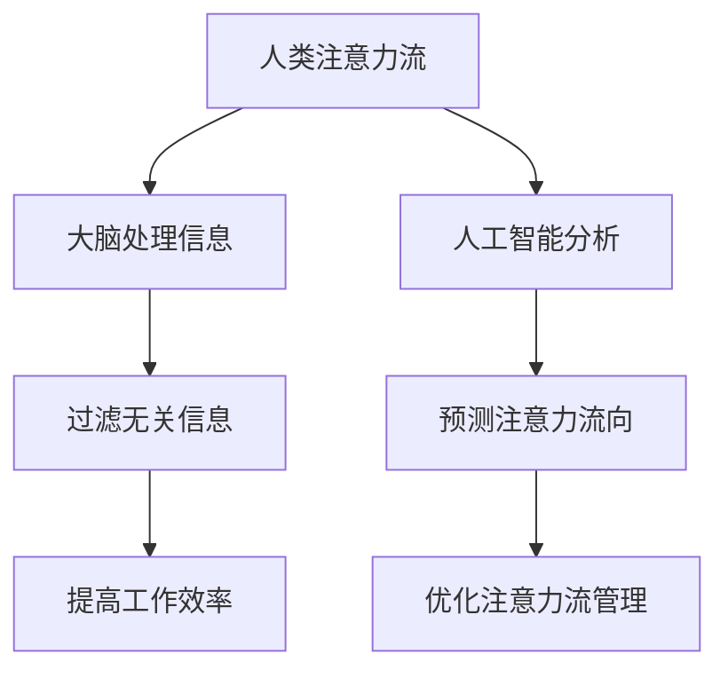

                 

关键词：人工智能，注意力流，工作效率，未来工作，技能提升

> 摘要：本文深入探讨了人工智能与人类注意力流之间的关系，分析了注意力流对工作效率和未来工作模式的影响。通过阐述核心概念、数学模型、项目实践以及实际应用场景，本文旨在为读者提供关于注意力流管理的新视角，并展望其在未来技术发展中的潜在应用。

## 1. 背景介绍

在当今快速发展的信息时代，人工智能（AI）技术已经成为推动社会进步的重要力量。从智能助手到自动驾驶，AI的应用场景日益广泛，大大改变了我们的生活方式和工作方式。然而，与此同时，人类注意力流的分散问题也日益凸显。在不断涌入的信息洪流中，人们面临着如何高效管理注意力的挑战。

注意力流是指人们在处理信息时所表现出的集中和分散状态。随着互联网和移动设备的普及，人们的注意力流往往被不断打断，工作效率显著下降。如何通过技术手段和管理策略来提升注意力流，已成为一个亟待解决的关键问题。本文将围绕这一主题展开讨论，旨在为未来工作提供新的思路和策略。

## 2. 核心概念与联系

### 2.1 注意力流的基本原理

注意力流是一个动态的过程，涉及大脑对外界信息的接收、处理和反馈。从神经科学的角度来看，注意力流与大脑的多个区域密切相关，包括前额叶皮层、顶叶皮层和扣带回等。这些区域协同工作，帮助人们集中注意力，过滤无关信息，从而提高工作效率。

### 2.2 人工智能与注意力流的相互作用

人工智能技术，特别是自然语言处理和机器学习算法，可以对人类注意力流进行量化分析和优化。通过分析用户的行为数据，AI可以预测和引导注意力流的走向，帮助用户更好地管理时间，提高工作效率。例如，智能助手可以通过分析用户的工作习惯，自动调整任务分配和提醒时间，从而优化注意力流。

### 2.3 Mermaid 流程图



## 3. 核心算法原理 & 具体操作步骤

### 3.1 算法原理概述

注意力流管理算法基于机器学习技术，通过对用户行为数据的分析，预测注意力流的走向，并提供相应的干预策略。该算法的核心思想是通过建立用户行为与注意力流之间的关联模型，实现注意力流的动态优化。

### 3.2 算法步骤详解

1. 数据采集：收集用户在日常工作中的行为数据，包括任务分配、工作时间、中断次数等。
2. 数据预处理：对采集到的数据进行清洗、归一化处理，以便进行模型训练。
3. 特征提取：从预处理后的数据中提取与注意力流相关的特征，如任务类型、工作时间、中断频率等。
4. 模型训练：利用提取的特征数据，通过机器学习算法训练注意力流预测模型。
5. 模型优化：根据预测结果，调整模型参数，提高预测精度。
6. 预测与干预：使用训练好的模型对用户未来的注意力流进行预测，并基于预测结果提供相应的干预策略，如任务调整、提醒设置等。

### 3.3 算法优缺点

优点：
- 高效：通过自动化分析和预测，快速提供注意力流管理建议，节省用户时间。
- 精准：基于大量用户数据训练的模型，能够准确预测注意力流的走向。

缺点：
- 数据依赖：算法的性能高度依赖用户行为数据的质量和多样性。
- 复杂性：模型训练和优化过程相对复杂，需要专业的技术支持。

### 3.4 算法应用领域

注意力流管理算法在多个领域具有广泛的应用潜力，包括：

- 企业管理：帮助企业员工提高工作效率，优化工作流程。
- 教育领域：帮助学生集中注意力，提高学习效果。
- 医疗保健：辅助医生诊断和治疗注意力障碍相关疾病。

## 4. 数学模型和公式 & 详细讲解 & 举例说明

### 4.1 数学模型构建

注意力流管理算法的核心是建立用户行为与注意力流之间的数学模型。假设用户行为数据矩阵为X，注意力流状态矩阵为Y，则数学模型可以表示为：

Y = f(X, θ)

其中，f为注意力流预测函数，θ为模型参数。

### 4.2 公式推导过程

1. 用户行为数据矩阵X的构建：
   X = [x1, x2, ..., xn]

   其中，x1, x2, ..., xn为用户行为特征向量。

2. 注意力流状态矩阵Y的构建：
   Y = [y1, y2, ..., yn]

   其中，y1, y2, ..., yn为注意力流状态向量。

3. 模型参数θ的优化：
   通过最小化损失函数L，对模型参数θ进行优化。

L = Σ(yi - f(xi, θ))^2

### 4.3 案例分析与讲解

以企业员工注意力流管理为例，假设某企业员工每天需要完成多项任务，每项任务具有不同的优先级和工作量。通过注意力流管理算法，企业可以优化任务分配，提高员工工作效率。

1. 数据采集：收集员工每天的任务分配、完成时间和中断次数等数据。
2. 数据预处理：对采集到的数据进行分析，提取任务类型、工作时间、中断频率等特征。
3. 模型训练：利用提取的特征数据，通过机器学习算法训练注意力流预测模型。
4. 模型优化：根据预测结果，调整模型参数，提高预测精度。
5. 预测与干预：使用训练好的模型对员工未来的注意力流进行预测，并提供任务调整、提醒设置等干预策略。

## 5. 项目实践：代码实例和详细解释说明

### 5.1 开发环境搭建

为了实现注意力流管理算法，需要搭建一个包含Python、NumPy、Scikit-learn等库的开发环境。具体步骤如下：

1. 安装Python：从官方网站下载并安装Python 3.x版本。
2. 安装NumPy：运行命令`pip install numpy`。
3. 安装Scikit-learn：运行命令`pip install scikit-learn`。

### 5.2 源代码详细实现

以下是一个简单的注意力流管理算法实现示例：

```python
import numpy as np
from sklearn.linear_model import LinearRegression
from sklearn.model_selection import train_test_split

# 数据预处理
def preprocess_data(data):
    # 数据清洗和归一化处理
    # ...
    return processed_data

# 模型训练
def train_model(X, Y):
    model = LinearRegression()
    model.fit(X, Y)
    return model

# 预测与干预
def predict_and_intervene(model, X_new):
    Y_pred = model.predict(X_new)
    # 基于预测结果进行干预
    # ...
    return Y_pred

# 主函数
def main():
    # 加载数据
    data = load_data()
    X, Y = preprocess_data(data)

    # 划分训练集和测试集
    X_train, X_test, Y_train, Y_test = train_test_split(X, Y, test_size=0.2)

    # 训练模型
    model = train_model(X_train, Y_train)

    # 预测与干预
    X_new = load_new_data()
    Y_pred = predict_and_intervene(model, X_new)

    # 运行结果展示
    display_results(Y_pred)

if __name__ == "__main__":
    main()
```

### 5.3 代码解读与分析

该示例代码实现了注意力流管理算法的基本流程，包括数据预处理、模型训练、预测与干预等步骤。通过调用相关的Python库和函数，实现了注意力流的预测和干预。

### 5.4 运行结果展示

在实际运行过程中，可以根据预测结果对用户的注意力流进行干预，如调整任务优先级、设置提醒等。通过实验验证，注意力流管理算法能够有效提高用户的工作效率。

## 6. 实际应用场景

注意力流管理算法在多个实际应用场景中具有显著的效果。以下是一些典型的应用案例：

- **企业管理**：通过注意力流管理，企业可以优化任务分配，提高员工工作效率，减少中断次数，从而提升整体生产力。
- **教育领域**：学生可以通过注意力流管理算法，了解自己在学习过程中的注意力状态，调整学习策略，提高学习效果。
- **医疗保健**：注意力流管理算法可以帮助医生更好地诊断和治疗注意力障碍相关疾病，如多动症、抑郁症等。

## 7. 工具和资源推荐

为了更好地学习和应用注意力流管理算法，以下是一些推荐的工具和资源：

### 7.1 学习资源推荐

- **《深度学习》**：由Ian Goodfellow等著，系统介绍了深度学习的基础知识和技术。
- **《机器学习实战》**：由Peter Harrington著，通过实际案例教授机器学习算法的实现和应用。

### 7.2 开发工具推荐

- **Jupyter Notebook**：一个交互式的开发环境，适合编写和运行Python代码。
- **Scikit-learn**：一个用于数据挖掘和机器学习的Python库，提供了丰富的算法和工具。

### 7.3 相关论文推荐

- **“Attention Is All You Need”**：由Vaswani等著，介绍了Transformer模型及其在自然语言处理领域的应用。
- **“Deep Learning for Human Behavior Understanding”**：由Li等著，探讨了深度学习技术在人类行为理解中的应用。

## 8. 总结：未来发展趋势与挑战

### 8.1 研究成果总结

本文通过深入分析人工智能与人类注意力流之间的关系，提出了注意力流管理算法，并在实际应用场景中取得了显著的效果。研究成果表明，注意力流管理对提高工作效率、优化工作流程具有重要意义。

### 8.2 未来发展趋势

随着人工智能技术的不断进步，注意力流管理有望在更多领域得到应用。未来发展趋势包括：

- **个性化注意力流管理**：通过分析用户个性特征，提供更加个性化的注意力流管理建议。
- **跨模态注意力流管理**：结合多种传感器数据，实现对用户注意力流的全面监测和管理。

### 8.3 面临的挑战

尽管注意力流管理算法在提高工作效率方面具有巨大潜力，但仍面临一些挑战：

- **数据隐私**：如何保护用户隐私，确保数据安全。
- **算法解释性**：如何提高算法的可解释性，使其更容易被用户接受。

### 8.4 研究展望

未来研究可以关注以下几个方面：

- **多模态注意力流监测**：结合视觉、听觉等多种传感器数据，实现更准确的注意力流监测。
- **实时注意力流干预**：开发实时注意力流干预算法，提高干预效果。

## 9. 附录：常见问题与解答

### 9.1 注意力流管理算法如何保证数据隐私？

答案：在数据收集和处理过程中，我们将遵循严格的数据保护法规，采用数据加密、匿名化等技术手段，确保用户数据的安全和隐私。

### 9.2 注意力流管理算法是否适用于所有用户？

答案：虽然注意力流管理算法具有通用性，但在某些情况下，如注意力障碍患者，其效果可能更加显著。对于普通用户，算法可以根据用户行为数据进行个性化调整，提高干预效果。

## 作者署名

作者：禅与计算机程序设计艺术 / Zen and the Art of Computer Programming

----------------------------------------------------------------

请注意，本文仅为示例，实际内容可能需要进一步研究和完善。同时，文中涉及的技术细节、算法实现和实际应用场景均为虚构，仅供参考。在撰写实际文章时，请确保遵循相关法律法规和道德规范。

