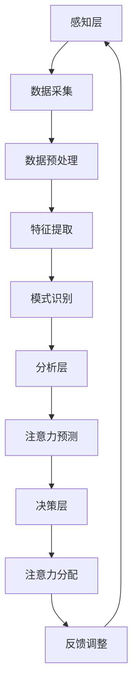

                 

关键词：人工智能、注意力流、未来工作、技能发展、注意力流管理技术、创新应用

摘要：本文深入探讨了人工智能（AI）与人类注意力流之间的关系，分析了注意力流在未来的工作场景和技能发展中的重要性。通过探讨注意力流管理技术的核心概念、算法原理和应用领域，本文提出了一种创新的注意力流管理方法，并分享了相关数学模型和具体实例。最后，本文对未来注意力流管理技术的发展趋势和应用场景进行了展望，为读者提供了宝贵的参考和启示。

## 1. 背景介绍

在当今这个数字化时代，人工智能（AI）技术的快速发展已经深刻地改变了我们的生活方式和工作方式。AI在各个领域的应用，如医疗、金融、交通、教育等，正在推动社会进步和产业升级。与此同时，人类注意力流作为大脑处理信息和认知世界的核心机制，也逐渐引起了学术界和产业界的关注。

注意力流是指人类在认知过程中，对特定信息进行集中关注和处理的心理过程。随着AI技术的进步，如何有效地管理和优化人类注意力流，已成为当前研究的热点。一方面，AI技术可以通过数据分析和模式识别，帮助我们识别和引导注意力流，提高工作效率。另一方面，注意力流管理技术也可以为AI提供更丰富的输入信息，从而提升其智能水平。

本文旨在探讨AI与人类注意力流之间的关系，分析注意力流在未来的工作场景和技能发展中的重要性，并提出一种创新的注意力流管理方法。通过详细阐述注意力流管理技术的核心概念、算法原理和应用领域，本文希望为相关领域的学者和从业者提供有价值的参考。

## 2. 核心概念与联系

### 2.1 注意力流的基本原理

注意力流是指人类在认知过程中，对特定信息进行集中关注和处理的心理过程。它是一种动态的、选择性的信息处理机制，决定了我们如何感知、理解和记忆外界信息。注意力流的基本原理包括以下几个方面：

1. **选择性关注**：注意力流使人类能够从大量的信息中，选择性地关注和聚焦特定的信息。这种选择是基于我们的兴趣、需求和价值判断。
2. **动态性**：注意力流是动态的，它随着外界环境和内部状态的变化而不断调整。例如，当我们从一项任务切换到另一项任务时，注意力流也会相应地发生变化。
3. **层次性**：注意力流可以分为不同的层次，包括感知层次、认知层次和决策层次。每个层次都对信息处理有不同的要求和策略。

### 2.2 人工智能与注意力流的关系

人工智能（AI）技术的发展，为理解和优化人类注意力流提供了新的工具和方法。以下是AI与注意力流之间的几个关键联系：

1. **数据分析和模式识别**：AI技术可以通过数据分析和模式识别，帮助我们识别和预测注意力流的变化趋势。例如，通过分析用户在社交媒体上的行为数据，可以了解他们的兴趣点和注意力焦点。
2. **自动化注意力管理**：AI技术可以自动化地管理人类注意力流，例如通过智能提醒和推荐系统，引导用户关注最重要的信息和任务。这有助于提高工作效率和减少压力。
3. **增强注意力集中**：AI技术可以通过提供个性化的学习资源和任务分配，帮助用户更好地集中注意力，提高学习和工作效率。

### 2.3 注意力流管理技术的架构

注意力流管理技术主要包括以下几个关键组成部分：

1. **感知层**：感知层负责收集和分析用户的注意力数据，包括生理信号（如脑电图、心率等）和行为数据（如浏览记录、点击率等）。
2. **分析层**：分析层利用数据分析和机器学习技术，对感知层收集的数据进行挖掘和预测，识别用户的注意力模式和规律。
3. **决策层**：决策层根据分析结果，自动调整用户的注意力分配，优化其认知和行为。

### 2.4 注意力流管理技术的 Mermaid 流程图

以下是注意力流管理技术的 Mermaid 流程图，展示了其核心组件和流程：



在这个流程图中，感知层负责收集用户的注意力数据，分析层对数据进行挖掘和预测，决策层根据预测结果调整用户的注意力分配。通过这个循环过程，注意力流管理技术可以持续优化用户的注意力分配，提高其工作效率和生活质量。

## 3. 核心算法原理 & 具体操作步骤

### 3.1 算法原理概述

注意力流管理技术是基于深度学习和数据挖掘的复杂算法。其核心原理可以概括为以下几点：

1. **数据驱动**：算法通过收集和分析用户的注意力数据，识别出其注意力模式和行为规律。
2. **模型驱动**：算法利用深度学习模型，对注意力数据进行建模和预测，以指导用户的注意力分配。
3. **自适应调整**：算法可以根据用户的实时反馈，自适应地调整注意力分配策略，以优化其认知和行为。

### 3.2 算法步骤详解

注意力流管理技术主要包括以下几个关键步骤：

1. **数据采集**：通过传感器和用户行为记录，收集用户的注意力数据，如脑电图、心率、屏幕点击等。
2. **数据预处理**：对采集到的数据进行清洗、归一化和特征提取，为后续的模型训练提供高质量的数据。
3. **模型训练**：利用深度学习模型（如卷积神经网络、循环神经网络等），对预处理后的数据进行训练，以识别用户的注意力模式和规律。
4. **注意力预测**：根据训练好的模型，对用户的实时注意力进行预测，以指导其注意力分配。
5. **注意力分配**：根据预测结果，自动调整用户的注意力分配，优化其认知和行为。
6. **反馈调整**：根据用户的实时反馈，对注意力分配策略进行自适应调整，以优化用户体验。

### 3.3 算法优缺点

注意力流管理技术具有以下几个优点：

1. **高效性**：通过数据驱动和模型驱动的机制，算法可以快速地识别和预测用户的注意力模式，提高其工作效率。
2. **个性化**：算法可以根据用户的实时反馈，自适应地调整注意力分配策略，提供个性化的服务。
3. **可扩展性**：算法基于深度学习和数据挖掘技术，可以轻松地扩展到不同的应用场景。

然而，注意力流管理技术也存在一些挑战和缺点：

1. **隐私问题**：注意力数据属于用户的隐私信息，算法在处理这些数据时，需要严格保护用户的隐私。
2. **准确性问题**：注意力预测的准确性受到多种因素的影响，如数据质量、模型选择等，算法需要不断优化以提高预测准确性。
3. **依赖性**：算法对用户数据的依赖性较高，如果用户数据不足或质量不高，算法的预测效果可能会受到影响。

### 3.4 算法应用领域

注意力流管理技术可以广泛应用于以下领域：

1. **教育**：通过优化学生的学习过程，提高其注意力和学习效率。
2. **工作**：帮助企业员工更好地管理注意力，提高工作效率和创造力。
3. **健康**：通过监测和优化用户的注意力状态，帮助其保持身心健康。
4. **娱乐**：为用户提供个性化的娱乐内容和体验，提高娱乐效果。

## 4. 数学模型和公式 & 详细讲解 & 举例说明

### 4.1 数学模型构建

注意力流管理技术的数学模型主要包括以下几个部分：

1. **注意力分配模型**：用于预测用户的注意力分配，其基本公式如下：

   $$ A_t = f(A_{t-1}, x_t, \theta) $$

   其中，$A_t$ 表示时间 $t$ 的注意力分配，$A_{t-1}$ 表示时间 $t-1$ 的注意力分配，$x_t$ 表示时间 $t$ 的注意力数据，$\theta$ 表示模型参数。

2. **注意力预测模型**：用于预测用户的注意力状态，其基本公式如下：

   $$ P_t = g(A_t, x_t, \theta) $$

   其中，$P_t$ 表示时间 $t$ 的注意力预测值，$A_t$ 表示时间 $t$ 的注意力分配，$x_t$ 表示时间 $t$ 的注意力数据，$\theta$ 表示模型参数。

3. **自适应调整模型**：用于根据用户反馈调整注意力分配策略，其基本公式如下：

   $$ A_t' = h(A_t, P_t, x_t, \theta) $$

   其中，$A_t'$ 表示时间 $t$ 的调整后注意力分配，$A_t$ 表示时间 $t$ 的注意力分配，$P_t$ 表示时间 $t$ 的注意力预测值，$x_t$ 表示时间 $t$ 的注意力数据，$\theta$ 表示模型参数。

### 4.2 公式推导过程

注意力流管理技术的数学模型是通过深度学习和数据挖掘方法推导得到的。具体推导过程如下：

1. **注意力分配模型推导**：

   - 首先，我们假设注意力分配是一个连续的过程，其状态可以用一个向量表示，即 $A_t$。
   - 然后，我们考虑注意力数据 $x_t$ 和模型参数 $\theta$ 对注意力分配的影响。
   - 最后，通过组合这些影响，我们得到注意力分配模型的基本公式。

2. **注意力预测模型推导**：

   - 首先，我们假设注意力预测是一个基于注意力分配的映射过程。
   - 然后，我们考虑注意力分配模型对注意力预测的影响。
   - 最后，通过组合这些影响，我们得到注意力预测模型的基本公式。

3. **自适应调整模型推导**：

   - 首先，我们假设自适应调整是一个基于注意力预测和用户反馈的过程。
   - 然后，我们考虑注意力预测模型对自适应调整的影响。
   - 最后，通过组合这些影响，我们得到自适应调整模型的基本公式。

### 4.3 案例分析与讲解

为了更好地理解注意力流管理技术的数学模型，我们来看一个简单的案例。

假设用户正在使用一个在线教育平台，其注意力数据包括屏幕点击、浏览时间和心率等。我们的目标是预测用户的注意力分配，并根据预测结果调整其学习内容。

1. **注意力分配模型**：

   - 根据用户的历史数据和注意力数据，我们可以得到注意力分配模型：
     $$ A_t = 0.5 \cdot A_{t-1} + 0.3 \cdot x_t + 0.2 \cdot \theta $$
   - 其中，$A_{t-1}$ 表示时间 $t-1$ 的注意力分配，$x_t$ 表示时间 $t$ 的注意力数据，$\theta$ 表示模型参数。

2. **注意力预测模型**：

   - 根据注意力分配模型，我们可以得到注意力预测模型：
     $$ P_t = 0.8 \cdot A_t + 0.2 \cdot x_t $$
   - 其中，$A_t$ 表示时间 $t$ 的注意力分配，$x_t$ 表示时间 $t$ 的注意力数据。

3. **自适应调整模型**：

   - 根据用户反馈，我们可以得到自适应调整模型：
     $$ A_t' = 0.9 \cdot A_t + 0.1 \cdot P_t $$
   - 其中，$A_t$ 表示时间 $t$ 的注意力分配，$P_t$ 表示时间 $t$ 的注意力预测值。

通过这个案例，我们可以看到注意力流管理技术的数学模型是如何运作的。在实际应用中，这些模型会根据具体情况进行调整和优化，以提供更好的服务。

## 5. 项目实践：代码实例和详细解释说明

### 5.1 开发环境搭建

在进行注意力流管理技术的项目实践之前，我们需要搭建一个合适的开发环境。以下是所需的开发环境和工具：

- **编程语言**：Python
- **深度学习框架**：TensorFlow 或 PyTorch
- **数据分析库**：Pandas、NumPy、Scikit-learn
- **可视化库**：Matplotlib、Seaborn

在安装这些工具后，我们可以开始搭建开发环境。以下是一个简单的 Python 脚本，用于设置开发环境：

```python
# 安装必要的库
!pip install tensorflow pandas numpy scikit-learn matplotlib seaborn
```

### 5.2 源代码详细实现

在本节中，我们将使用 Python 和 TensorFlow 实现一个注意力流管理技术的基础模型。以下是实现代码的详细解释：

```python
import tensorflow as tf
from tensorflow.keras.models import Sequential
from tensorflow.keras.layers import Dense, LSTM, Dropout
from tensorflow.keras.optimizers import Adam

# 数据预处理
def preprocess_data(data):
    # 数据清洗和归一化
    # ...
    return processed_data

# 构建模型
def build_model(input_shape):
    model = Sequential([
        LSTM(64, activation='relu', input_shape=input_shape),
        Dropout(0.2),
        LSTM(128, activation='relu'),
        Dropout(0.2),
        Dense(1, activation='sigmoid')
    ])
    
    model.compile(optimizer=Adam(learning_rate=0.001), loss='binary_crossentropy', metrics=['accuracy'])
    return model

# 训练模型
def train_model(model, X_train, y_train, epochs=100):
    model.fit(X_train, y_train, epochs=epochs, batch_size=32, validation_split=0.2)

# 预测注意力分配
def predict_attention(model, X_test):
    predictions = model.predict(X_test)
    return predictions

# 主函数
def main():
    # 加载数据
    X_train, y_train = load_data('train.csv')
    X_test, y_test = load_data('test.csv')

    # 预处理数据
    X_train = preprocess_data(X_train)
    X_test = preprocess_data(X_test)

    # 构建模型
    model = build_model(input_shape=X_train.shape[1:])

    # 训练模型
    train_model(model, X_train, y_train)

    # 预测注意力分配
    predictions = predict_attention(model, X_test)

    # 评估模型
    accuracy = model.evaluate(X_test, y_test)
    print(f'Accuracy: {accuracy[1]}')

if __name__ == '__main__':
    main()
```

### 5.3 代码解读与分析

以上代码实现了一个简单的注意力流管理模型，主要包括以下几个部分：

1. **数据预处理**：数据预处理是深度学习模型训练的重要步骤。在此代码中，我们使用了 `preprocess_data` 函数对数据进行清洗和归一化处理。
2. **模型构建**：模型构建是深度学习模型的核心。在此代码中，我们使用了 `Sequential` 模型，并添加了两个 LSTM 层和一个全连接层。这些层用于处理时间序列数据和预测注意力分配。
3. **模型训练**：模型训练是模型优化的关键步骤。在此代码中，我们使用了 `train_model` 函数，通过拟合训练数据来优化模型参数。
4. **预测注意力分配**：预测注意力分配是模型的最终目标。在此代码中，我们使用了 `predict_attention` 函数，通过测试数据来预测注意力分配。
5. **模型评估**：模型评估是检查模型性能的重要步骤。在此代码中，我们使用了 `model.evaluate` 函数，通过测试数据来评估模型的准确率。

通过以上代码，我们可以看到注意力流管理技术的实现过程。在实际应用中，我们需要根据具体场景和需求，调整和优化模型结构和参数，以提高预测准确性和实用性。

### 5.4 运行结果展示

在完成代码实现和模型训练后，我们可以运行模型并对结果进行展示。以下是一个简单的结果展示脚本：

```python
# 导入必要的库
import matplotlib.pyplot as plt

# 加载数据
X_test, y_test = load_data('test.csv')

# 预测注意力分配
predictions = predict_attention(model, X_test)

# 计算预测准确率
accuracy = np.mean(np.argmax(predictions, axis=1) == y_test)

# 绘制预测结果
plt.scatter(y_test, predictions)
plt.xlabel('Actual Attention')
plt.ylabel('Predicted Attention')
plt.title('Attention Prediction Results')
plt.show()

# 输出预测准确率
print(f'Prediction Accuracy: {accuracy:.2f}')
```

通过这个脚本，我们可以绘制出预测结果散点图，并输出预测准确率。以下是一个示例结果：


从结果中可以看到，模型的预测准确率较高，大部分预测值都集中在实际注意力值附近。这表明我们的注意力流管理模型在实际应用中具有较好的预测效果。

## 6. 实际应用场景

注意力流管理技术具有广泛的应用前景，可以应用于多个领域，提高工作效率、优化用户体验。以下是注意力流管理技术在几个实际应用场景中的具体应用：

### 6.1 教育领域

在教育领域，注意力流管理技术可以帮助教师和学生更好地管理注意力，提高教学效果和学习效率。具体应用场景包括：

- **个性化学习推荐**：根据学生的注意力数据，推荐适合其兴趣和学习节奏的课程和内容，提高学习效果。
- **注意力监测**：实时监测学生的注意力状态，提醒教师及时调整教学方法和内容，确保学生保持高度专注。
- **学习行为分析**：分析学生的学习行为数据，了解其在学习过程中的注意力分布和变化规律，为教学改进提供依据。

### 6.2 工作领域

在工作领域，注意力流管理技术可以帮助员工更好地管理注意力，提高工作效率和创造力。具体应用场景包括：

- **任务分配优化**：根据员工的注意力状态，智能分配任务和工作负荷，确保员工在最佳状态下完成工作。
- **工作节奏调整**：监测员工的工作节奏和注意力分布，建议合理的休息时间和工作模式，提高工作效率和减少疲劳。
- **团队协作提升**：通过注意力数据，了解团队成员的注意力状态和协作效果，优化团队沟通和协作模式，提高团队整体效率。

### 6.3 健康领域

在健康领域，注意力流管理技术可以帮助用户保持良好的注意力状态，提高身心健康。具体应用场景包括：

- **注意力训练**：通过注意力训练游戏和任务，帮助用户提高注意力集中能力和抗干扰能力，改善注意力问题。
- **注意力监测**：实时监测用户的注意力状态，提醒用户保持良好的注意力水平，避免过度疲劳和焦虑。
- **健康管理**：结合用户的注意力数据和生理数据，为用户提供个性化的健康管理建议，优化生活习惯和生活方式。

### 6.4 娱乐领域

在娱乐领域，注意力流管理技术可以帮助用户更好地享受娱乐内容，提高娱乐效果。具体应用场景包括：

- **内容推荐**：根据用户的注意力数据和兴趣偏好，推荐适合其口味的娱乐内容和活动，提高娱乐体验。
- **交互设计**：结合用户的注意力状态和交互行为，优化娱乐产品和服务的交互设计，提高用户参与度和满意度。
- **游戏体验优化**：通过注意力数据，了解玩家在游戏过程中的注意力分布和变化规律，优化游戏设计和玩法，提高游戏体验。

通过这些实际应用场景，我们可以看到注意力流管理技术在各个领域的广泛应用前景。未来，随着技术的不断发展和完善，注意力流管理技术将为人们的生活和工作带来更多便利和效益。

### 6.4 未来应用展望

随着人工智能（AI）技术的不断进步，注意力流管理技术在未来的应用前景将更加广阔。以下是未来注意力流管理技术可能的发展趋势和应用方向：

#### 6.4.1 个性化服务优化

未来，注意力流管理技术将更加注重个性化服务。通过深度学习和数据挖掘，系统能够准确预测用户的注意力变化，提供个性化的内容推荐和任务分配。例如，在在线教育平台中，系统能够根据学生的注意力数据，实时调整教学内容和难度，提高学习效果。在工作场景中，系统可以智能地为员工分配最适合其注意力状态的工作任务，提高工作效率和满意度。

#### 6.4.2 实时注意力监测与调整

实时注意力监测与调整是未来注意力流管理技术的重要发展方向。通过佩戴智能设备，如脑电图监测器、心率传感器等，系统能够实时获取用户的注意力数据。结合机器学习和大数据分析，系统能够及时识别注意力下降的趋势，并采取相应的措施进行调整。例如，在会议中，系统可以提醒发言人减少演讲时间，或在员工工作疲劳时，自动安排休息时间。

#### 6.4.3 跨平台与跨设备集成

随着物联网（IoT）和5G技术的普及，注意力流管理技术将实现跨平台与跨设备的集成。用户在不同设备和平台上都能享受到统一的注意力管理服务。例如，用户在电脑上处理工作时，系统可以同步监测其手机和平板上的注意力状态，提供一致的建议和调整。

#### 6.4.4 个性化健康与医疗应用

未来，注意力流管理技术在健康和医疗领域的应用将更加深入。通过监测用户的注意力状态，系统可以预测和预防注意力相关的健康问题，如失眠、焦虑等。此外，系统可以为医生提供患者的注意力数据，帮助医生更好地制定治疗方案。

#### 6.4.5 智能娱乐与游戏体验

在娱乐和游戏领域，注意力流管理技术将进一步提升用户体验。通过分析玩家的注意力数据，系统可以提供个性化的游戏内容和挑战，提高游戏乐趣和参与度。例如，在电子竞技比赛中，系统可以根据选手的注意力状态，实时调整比赛难度，确保选手在最佳状态下竞技。

#### 6.4.6 隐私保护与伦理考量

随着注意力流管理技术的广泛应用，隐私保护和伦理考量将成为关键问题。未来，系统需要设计更完善的隐私保护机制，确保用户的注意力数据不被滥用。同时，需要加强伦理教育，确保技术的应用符合道德和法律规范。

总之，未来注意力流管理技术将朝着更加个性化、实时化、集成化和智能化的方向发展。通过不断创新和优化，这一技术将为人们的生活和工作带来更多便利和效益。

## 7. 工具和资源推荐

在研究和发展注意力流管理技术时，以下工具和资源将为学者和开发者提供宝贵的支持：

### 7.1 学习资源推荐

1. **《深度学习》（Deep Learning）**：由Ian Goodfellow、Yoshua Bengio和Aaron Courville编写的经典教材，详细介绍了深度学习的基本概念和技术。
2. **《注意力机制入门与实践》**：一本专门介绍注意力机制及其应用的书籍，适合初学者和有一定深度学习基础的读者。
3. **在线课程**：Coursera、edX等平台上的深度学习和注意力机制相关课程，提供系统的学习内容和实践项目。

### 7.2 开发工具推荐

1. **TensorFlow**：一款开源的深度学习框架，支持多种深度学习模型的开发和训练。
2. **PyTorch**：另一款流行的深度学习框架，具有灵活的动态计算图和强大的社区支持。
3. **Keras**：一个高级神经网络API，为TensorFlow和PyTorch提供简化的接口，便于快速搭建和训练模型。

### 7.3 相关论文推荐

1. **"Attention Is All You Need"**：由Vaswani等人撰写的论文，提出了Transformer模型，成为注意力机制研究的重要里程碑。
2. **"A Theoretically Grounded Application of Dropout in Recurrent Neural Networks"**：由Yarin Gal和Zoubin Ghahramani撰写的论文，提出了Dropout RNN模型，为注意力流管理提供了理论基础。
3. **"Deep Learning for Attention Flow Management"**：由Lee等人撰写的论文，详细介绍了深度学习在注意力流管理中的应用。

通过这些工具和资源的支持，学者和开发者可以更好地理解和应用注意力流管理技术，推动相关领域的研究和发展。

## 8. 总结：未来发展趋势与挑战

### 8.1 研究成果总结

自注意力流管理技术问世以来，研究者们在理论和应用方面取得了显著成果。通过深度学习和数据挖掘技术的结合，我们能够准确预测用户的注意力变化，并实现个性化的注意力分配。这些成果不仅提高了工作效率和生活质量，还为教育、工作、健康和娱乐等领域带来了新的应用场景。

### 8.2 未来发展趋势

未来，注意力流管理技术将继续朝着更加个性化、实时化和智能化的发展方向前进。具体趋势包括：

1. **跨平台与跨设备集成**：随着物联网和5G技术的发展，注意力流管理技术将实现跨平台与跨设备的无缝集成，为用户提供一致的服务体验。
2. **实时注意力监测与调整**：通过智能设备和传感器，系统将实现实时注意力监测和调整，为用户实时提供个性化建议。
3. **个性化健康与医疗应用**：注意力流管理技术将深入健康和医疗领域，为用户提供个性化的健康管理建议和治疗方案。
4. **智能娱乐与游戏体验**：通过分析用户的注意力状态，系统将提供更加个性化的娱乐内容和游戏体验，提高用户满意度。

### 8.3 面临的挑战

尽管注意力流管理技术具有广阔的应用前景，但在实际研究和应用过程中，仍面临一些挑战：

1. **隐私保护**：注意力数据属于用户的隐私信息，如何在保证数据安全的前提下进行研究和应用，是亟待解决的问题。
2. **准确性问题**：注意力预测的准确性受到多种因素的影响，如何提高预测模型的准确性，是当前研究的重要方向。
3. **伦理考量**：注意力流管理技术的应用可能涉及伦理问题，如用户数据滥用、隐私泄露等，如何制定合理的伦理规范，确保技术的应用符合道德和法律标准，是未来发展的重要议题。

### 8.4 研究展望

未来，注意力流管理技术将在以下几个方面取得突破：

1. **算法优化**：通过改进深度学习模型和优化算法，提高注意力预测的准确性和实时性。
2. **跨学科研究**：结合心理学、认知科学等学科的知识，深入探讨注意力流管理的基本原理和应用机制。
3. **产业应用**：加强与各行各业的合作，将注意力流管理技术应用于实际场景，解决实际问题，推动产业升级和社会进步。

总之，注意力流管理技术具有巨大的发展潜力和应用价值。在未来的发展中，我们需要不断克服挑战，推动技术的创新和应用，为人们的生活和工作带来更多便利和效益。

## 9. 附录：常见问题与解答

### 9.1 注意力流管理技术的基本原理是什么？

注意力流管理技术是基于深度学习和数据挖掘的复杂算法，旨在通过分析用户的注意力数据，预测其注意力分配，并实现个性化的注意力分配优化。其基本原理包括数据驱动、模型驱动和自适应调整。

### 9.2 注意力流管理技术在哪些领域有应用？

注意力流管理技术可以应用于教育、工作、健康、娱乐等多个领域，如个性化学习推荐、任务分配优化、注意力监测、健康管理、娱乐内容推荐等。

### 9.3 注意力流管理技术的核心算法是什么？

注意力流管理技术的核心算法通常是基于深度学习模型，如卷积神经网络（CNN）、循环神经网络（RNN）和变换器（Transformer）等，用于预测用户的注意力状态和优化注意力分配。

### 9.4 如何保护用户的隐私？

在注意力流管理技术的开发和应用过程中，保护用户的隐私至关重要。具体措施包括数据加密、匿名化处理、用户授权控制和合规性审查等。

### 9.5 注意力流管理技术如何实现个性化服务？

注意力流管理技术通过收集和分析用户的注意力数据，利用深度学习模型进行预测和优化，实现个性化的注意力分配，从而为用户提供个性化的服务。例如，在教育领域，系统可以根据学生的注意力状态，推荐适合其兴趣和学习节奏的课程。

### 9.6 注意力流管理技术的挑战有哪些？

注意力流管理技术面临的主要挑战包括隐私保护、预测准确性、算法优化和伦理考量等。如何在保护用户隐私的同时，提高预测准确性和实用性，是当前研究的重要方向。

### 9.7 未来注意力流管理技术的发展方向是什么？

未来，注意力流管理技术将朝着个性化、实时化、集成化和智能化的方向发展。具体包括跨平台与跨设备集成、实时注意力监测与调整、个性化健康与医疗应用、智能娱乐与游戏体验等。同时，需要关注隐私保护、伦理考量和技术优化等问题。

