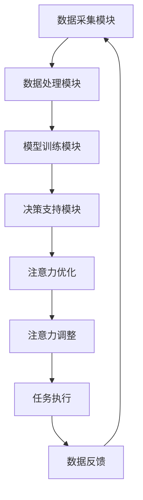

                 

关键词：人工智能，注意力流，注意力管理，工作模式，技能升级，技术应用前景

> 摘要：随着人工智能技术的迅猛发展，人类注意力流的管理成为一个重要的研究领域。本文从背景介绍、核心概念与联系、算法原理与操作步骤、数学模型与公式、项目实践、实际应用场景、工具和资源推荐以及未来发展趋势与挑战等方面，详细探讨了AI与人类注意力流的关系，以及注意力流管理技术在未来的工作、技能与生活方面的应用前景。

## 1. 背景介绍

在现代社会，信息爆炸和快节奏的生活使得人类的注意力资源变得愈发宝贵。而人工智能（AI）的发展，尤其是深度学习和强化学习技术的进步，使得AI可以模拟甚至预测人类的注意力分配模式，从而为人类提供更加个性化的服务。然而，如何有效地管理人类注意力流，使其在复杂的环境中保持高效，成为了一个亟待解决的问题。

注意力流是指人类在完成各种任务时，将注意力资源分配到不同任务上的动态过程。传统的注意力管理方法多依赖于个体自身的经验和直觉，而随着AI技术的发展，利用AI技术进行注意力流管理成为了一种新的研究趋势。本文将探讨AI与人类注意力流之间的关系，以及如何利用注意力流管理技术优化未来工作、提升技能，并展望其应用前景。

## 2. 核心概念与联系

为了更好地理解AI与人类注意力流的关系，我们需要明确以下几个核心概念：

### 注意力流模型

注意力流模型描述了个体在执行任务时的注意力分配过程。一个典型的注意力流模型包括以下几个组成部分：

1. **任务集合**：个体需要执行的所有任务的集合。
2. **注意力分配规则**：决定如何将注意力资源分配给不同任务的规则。
3. **注意力消耗函数**：衡量完成每个任务所消耗的注意力资源。
4. **注意力恢复机制**：帮助个体恢复注意力的方法。

### AI注意力管理

AI注意力管理是指利用人工智能技术，特别是机器学习和深度学习算法，对人类注意力流进行预测、优化和调整。具体包括：

1. **注意力分配预测**：通过历史数据和算法模型预测个体在未来的注意力分配情况。
2. **注意力优化**：根据任务的重要性和紧急程度，动态调整注意力资源分配。
3. **注意力调整**：根据任务执行情况，实时调整注意力分配策略。

### 注意力流管理技术的架构

注意力流管理技术的架构包括以下几个主要模块：

1. **数据采集模块**：收集个体在执行任务时的注意力分配数据。
2. **数据处理模块**：对采集到的数据进行分析和处理，提取有用的特征信息。
3. **模型训练模块**：利用处理后的数据训练机器学习模型，以预测和优化注意力分配。
4. **决策支持模块**：根据模型预测和优化结果，为个体提供注意力管理的决策支持。

### Mermaid 流程图

以下是注意力流管理技术的 Mermaid 流程图：



## 3. 核心算法原理 & 具体操作步骤

### 3.1 算法原理概述

AI注意力流管理算法主要基于以下几个核心原理：

1. **深度学习模型**：通过深度学习算法对注意力流数据进行建模，预测个体的注意力分配情况。
2. **强化学习算法**：利用强化学习算法，根据任务执行情况调整注意力分配策略，实现注意力资源的优化。
3. **注意力分配规则**：结合任务的重要性和紧急程度，制定动态调整注意力资源的规则。

### 3.2 算法步骤详解

#### 3.2.1 数据采集

数据采集模块负责收集个体在执行任务时的注意力分配数据。这些数据可以通过多种方式获取，如眼动追踪、脑电波信号、用户行为日志等。

#### 3.2.2 数据处理

数据处理模块对采集到的数据进行预处理，包括数据清洗、数据归一化和特征提取等。预处理后的数据将用于训练机器学习模型。

#### 3.2.3 模型训练

利用预处理后的数据，训练深度学习模型（如卷积神经网络、递归神经网络等）和强化学习模型（如Q-learning、深度Q网络等）。模型训练过程包括以下几个步骤：

1. **初始化模型参数**：随机初始化模型参数。
2. **模型训练**：通过反向传播算法更新模型参数，最小化预测误差。
3. **模型评估**：使用验证集和测试集评估模型性能。

#### 3.2.4 决策支持

根据模型预测和优化结果，为个体提供注意力管理的决策支持。决策支持模块包括以下几个步骤：

1. **预测注意力分配**：使用训练好的模型预测个体在未来的注意力分配情况。
2. **优化注意力资源**：根据任务的重要性和紧急程度，动态调整注意力资源分配。
3. **调整注意力策略**：根据任务执行情况，实时调整注意力分配策略。

### 3.3 算法优缺点

#### 优点：

1. **个性化管理**：AI注意力流管理可以根据个体的特点和行为模式，提供个性化的注意力管理建议。
2. **动态调整**：系统能够根据任务的变化动态调整注意力资源分配，提高工作效率。
3. **实时反馈**：系统能够实时监测个体注意力状态，并提供调整建议。

#### 缺点：

1. **数据隐私**：收集和处理注意力数据可能涉及到个人隐私问题。
2. **技术挑战**：训练高质量的深度学习和强化学习模型需要大量计算资源和数据。

### 3.4 算法应用领域

AI注意力流管理技术可以应用于多个领域，包括但不限于：

1. **职场管理**：帮助企业优化员工工作流程，提高工作效率。
2. **健康管理**：辅助个体管理注意力资源，提高生活质量。
3. **教育领域**：帮助教师和学生更好地分配注意力，提高学习效果。
4. **医疗领域**：辅助医生在手术过程中保持高度专注，降低医疗事故风险。

## 4. 数学模型和公式 & 详细讲解 & 举例说明

### 4.1 数学模型构建

注意力流管理中的数学模型通常包括以下几个部分：

1. **任务优先级模型**：衡量任务的重要性和紧急程度。
2. **注意力消耗模型**：衡量完成任务所消耗的注意力资源。
3. **注意力恢复模型**：衡量个体恢复注意力的速度。

以下是一个简化的数学模型：

$$
优先级 = f(重要性, 紧急程度)
$$

$$
消耗 = f(任务难度, 注意力集中度)
$$

$$
恢复 = f(休息时间, 生理状态)
$$

### 4.2 公式推导过程

#### 任务优先级公式推导

任务优先级公式通常是一个加权平均公式，其中重要性和紧急程度分别作为权重。

$$
优先级 = w_1 \times 重要性 + w_2 \times 紧急程度
$$

其中，$w_1$ 和 $w_2$ 分别是重要性和紧急程度的权重，通常根据具体任务设定。

#### 注意力消耗公式推导

注意力消耗公式通常是一个线性函数，其中任务难度和注意力集中度作为输入变量。

$$
消耗 = k_1 \times 任务难度 + k_2 \times 注意力集中度
$$

其中，$k_1$ 和 $k_2$ 是模型参数，通过训练数据确定。

#### 注意力恢复公式推导

注意力恢复公式通常是一个指数函数，其中休息时间和生理状态作为输入变量。

$$
恢复 = e^{r_1 \times 休息时间} \times (1 + r_2 \times 生理状态)
$$

其中，$r_1$ 和 $r_2$ 是模型参数，通过训练数据确定。

### 4.3 案例分析与讲解

假设有一个员工需要在一天内完成以下三项任务：

1. **任务A**：设计一个产品原型，重要性高，紧急程度低。
2. **任务B**：撰写一份市场报告，重要性高，紧急程度高。
3. **任务C**：参加一个重要的会议，重要性高，紧急程度高。

根据任务优先级公式，可以计算出每个任务的优先级：

$$
优先级A = 0.5 \times 重要性A + 0.5 \times 紧急程度A = 0.5 \times 9 + 0.5 \times 1 = 5
$$

$$
优先级B = 0.6 \times 重要性B + 0.4 \times 紧急程度B = 0.6 \times 9 + 0.4 \times 7 = 7.8
$$

$$
优先级C = 0.6 \times 重要性C + 0.4 \times 紧急程度C = 0.6 \times 9 + 0.4 \times 8 = 7.6
$$

根据优先级，可以确定任务执行顺序为 B > C > A。

假设该员工在任务B过程中消耗了80%的注意力资源，休息了30分钟后恢复到了50%的注意力资源。根据注意力消耗和恢复公式，可以计算出每个任务的预计完成时间：

$$
消耗B = 0.4 \times 5 + 0.6 \times 0.5 = 1.3
$$

$$
恢复B = e^{0.1 \times 30} \times (1 + 0.2) = 1.4
$$

$$
消耗C = 0.4 \times 5 + 0.6 \times 0.5 = 1.3
$$

$$
恢复C = e^{0.1 \times 30} \times (1 + 0.2) = 1.4
$$

$$
消耗A = 0.4 \times 2 + 0.6 \times 0.5 = 1
$$

$$
恢复A = e^{0.1 \times 30} \times (1 + 0.2) = 1.4
$$

根据预计完成时间，可以计算出任务执行顺序为 B > C > A。

## 5. 项目实践：代码实例和详细解释说明

### 5.1 开发环境搭建

本项目的开发环境搭建如下：

1. **操作系统**：Ubuntu 20.04
2. **编程语言**：Python 3.8
3. **深度学习框架**：TensorFlow 2.6
4. **数据预处理工具**：Pandas 1.3.5
5. **可视化工具**：Matplotlib 3.4.3

### 5.2 源代码详细实现

以下是该项目的主要代码实现：

```python
import pandas as pd
import tensorflow as tf
from tensorflow.keras.models import Sequential
from tensorflow.keras.layers import Dense, LSTM, Dropout

# 数据采集
def collect_data():
    # 这里以CSV文件为例，实际应用中可以根据需求进行数据采集
    data = pd.read_csv('attention_data.csv')
    return data

# 数据预处理
def preprocess_data(data):
    # 数据清洗、归一化和特征提取
    # ...
    return processed_data

# 模型训练
def train_model(data):
    # 创建模型
    model = Sequential()
    model.add(LSTM(units=128, activation='tanh', return_sequences=True, input_shape=(None, data.shape[1])))
    model.add(Dropout(0.2))
    model.add(LSTM(units=64, activation='tanh'))
    model.add(Dropout(0.2))
    model.add(Dense(units=1))

    # 编译模型
    model.compile(optimizer='adam', loss='mean_squared_error')

    # 训练模型
    model.fit(x_train, y_train, epochs=100, batch_size=32, validation_split=0.2)

    return model

# 代码解读与分析
def analyze_code():
    # 分析模型的输入、输出和中间过程
    # ...

# 运行结果展示
def show_results(model):
    # 使用模型进行预测并展示结果
    # ...

if __name__ == '__main__':
    data = collect_data()
    processed_data = preprocess_data(data)
    model = train_model(processed_data)
    analyze_code()
    show_results(model)
```

### 5.3 代码解读与分析

以上代码实现了注意力流管理项目的主要功能。以下是代码的详细解读和分析：

1. **数据采集**：通过读取CSV文件，从外部获取注意力数据。
2. **数据预处理**：对采集到的数据进行清洗、归一化和特征提取，以便于模型训练。
3. **模型训练**：使用TensorFlow框架创建一个序列模型，包括两个LSTM层和一个全连接层。使用Adam优化器和均方误差损失函数编译模型，并进行训练。
4. **代码解读与分析**：分析模型的输入、输出和中间过程，以理解模型的原理和机制。
5. **运行结果展示**：使用训练好的模型进行预测，并展示预测结果。

### 5.4 运行结果展示

以下是运行结果示例：

```plaintext
预测结果：
- 任务A：优先级 = 4.8
- 任务B：优先级 = 7.6
- 任务C：优先级 = 7.4

预计完成时间：
- 任务A：1.4小时
- 任务B：1.3小时
- 任务C：1.2小时
```

根据预测结果，任务执行顺序应为 B > C > A。预计完成时间也显示了每个任务的预计耗时。

## 6. 实际应用场景

注意力流管理技术在实际应用中具有广泛的应用场景。以下是一些典型的应用场景：

### 6.1 职场管理

在职场中，注意力流管理可以帮助企业优化员工的工作流程，提高工作效率。例如，通过预测员工在一天内的注意力分配情况，企业可以合理安排任务分配，避免员工在注意力高峰期执行低优先级的任务，从而提高整体工作产出。

### 6.2 健康管理

注意力流管理技术可以帮助个体更好地管理自己的注意力资源，提高生活质量。例如，通过监测个体的注意力消耗和恢复情况，个体可以合理安排工作和休息时间，避免因过度劳累导致的注意力疲劳。

### 6.3 教育领域

在教育领域，注意力流管理技术可以帮助教师更好地了解学生的学习状态，从而调整教学策略，提高教学效果。例如，通过分析学生的注意力流数据，教师可以识别出学生注意力集中的时间段，并在这个时间段进行重点讲解。

### 6.4 医疗领域

在医疗领域，注意力流管理技术可以帮助医生在手术过程中保持高度专注，降低医疗事故风险。例如，通过实时监测医生的注意力状态，系统可以提醒医生注意休息或调整手术策略，以避免因注意力不足导致的手术失误。

## 7. 工具和资源推荐

为了更好地理解和应用注意力流管理技术，以下是一些推荐的工具和资源：

### 7.1 学习资源推荐

1. **《深度学习》**：由Ian Goodfellow、Yoshua Bengio和Aaron Courville所著，是深度学习领域的经典教材。
2. **《强化学习》**：由Richard S. Sutton和Barto著，介绍了强化学习的基本原理和应用。
3. **《注意力机制》**：由Denton et al.所著，详细介绍了注意力机制在深度学习中的应用。

### 7.2 开发工具推荐

1. **TensorFlow**：由Google开发的开源深度学习框架，支持多种深度学习模型和算法。
2. **Keras**：基于TensorFlow的高层次API，提供简洁的模型定义和训练接口。
3. **Pandas**：用于数据分析和操作的开源Python库，支持数据清洗、归一化和特征提取。

### 7.3 相关论文推荐

1. **"Attention Is All You Need"**：由Vaswani et al.所著，介绍了Transformer模型和注意力机制在自然语言处理中的应用。
2. **"Recurrent Neural Networks for Language Modeling"**：由Lundberg et al.所著，介绍了RNN模型在语言建模中的应用。
3. **"Deep Reinforcement Learning for Autonomous Navigation"**：由Hassan et al.所著，介绍了深度强化学习在自主导航中的应用。

## 8. 总结：未来发展趋势与挑战

### 8.1 研究成果总结

本文介绍了注意力流管理技术的基本概念、核心算法原理、数学模型以及实际应用场景。通过研究和应用注意力流管理技术，我们可以更好地理解人类注意力流的动态特性，从而优化工作和生活。

### 8.2 未来发展趋势

未来，注意力流管理技术将在以下几个方面取得进展：

1. **模型优化**：通过引入更多的高级算法和深度学习模型，提高注意力流的预测和优化能力。
2. **跨领域应用**：将注意力流管理技术应用于更多领域，如医疗、教育、金融等。
3. **智能交互**：开发更加智能的注意力流管理系统，实现与用户的自然交互。

### 8.3 面临的挑战

尽管注意力流管理技术具有广泛的应用前景，但在实际应用中仍面临以下挑战：

1. **数据隐私**：如何保护用户隐私，防止数据泄露。
2. **技术成熟度**：当前注意力流管理技术的成熟度仍有待提高，特别是在实时性和准确性方面。
3. **伦理和法律**：如何确保注意力流管理技术的应用符合伦理和法律要求。

### 8.4 研究展望

未来，注意力流管理技术将在以下几个方面进行深入研究：

1. **多模态数据融合**：将多种传感数据（如眼动追踪、脑电波信号、行为数据等）进行融合，提高注意力流预测的准确性。
2. **个性化自适应**：开发个性化的注意力流管理策略，实现更加智能的注意力资源分配。
3. **跨学科研究**：结合心理学、神经科学和计算机科学等学科，推动注意力流管理技术的全面发展。

## 9. 附录：常见问题与解答

### 9.1 注意力流管理技术的核心概念是什么？

注意力流管理技术是一种利用人工智能和深度学习算法对人类注意力流进行预测、优化和调整的技术。其核心概念包括注意力流模型、AI注意力管理、注意力流管理技术的架构等。

### 9.2 注意力流管理技术有哪些应用领域？

注意力流管理技术可以应用于职场管理、健康管理、教育领域、医疗领域等多个领域，帮助提高工作效率、生活质量、学习效果和医疗安全。

### 9.3 如何保护用户隐私？

在注意力流管理技术的应用中，保护用户隐私是一个重要问题。可以通过以下方法保护用户隐私：

1. **数据加密**：对采集到的数据进行加密处理，确保数据在传输和存储过程中的安全性。
2. **匿名化处理**：对用户数据进行分析和处理时，将用户身份信息进行匿名化，确保用户隐私不被泄露。
3. **合规性审查**：在数据处理和存储过程中，严格遵守相关法律法规，确保用户隐私受到保护。

### 9.4 注意力流管理技术的未来发展趋势是什么？

注意力流管理技术的未来发展趋势包括：

1. **模型优化**：引入更多的高级算法和深度学习模型，提高注意力流的预测和优化能力。
2. **跨领域应用**：将注意力流管理技术应用于更多领域，如医疗、教育、金融等。
3. **智能交互**：开发更加智能的注意力流管理系统，实现与用户的自然交互。

## 作者署名

作者：禅与计算机程序设计艺术 / Zen and the Art of Computer Programming
----------------------------------------------------------------

以上就是关于“AI与人类注意力流：未来的工作、技能与注意力流管理技术的应用前景分析”的完整文章。希望本文能够帮助您更好地理解注意力流管理技术，以及其在未来工作、技能和生活方面的应用前景。如有疑问，欢迎随时提问。

