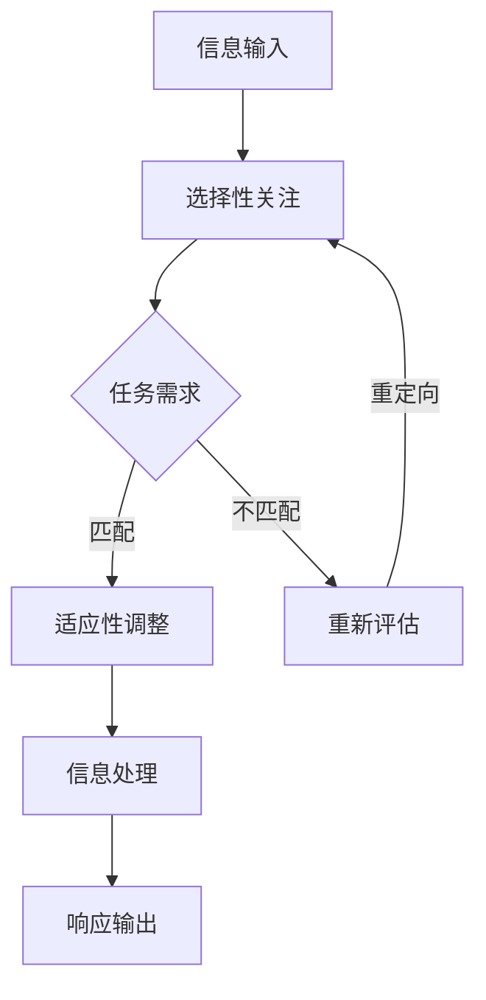

                 

关键词：人工智能，注意力流，工作技能，注意力流管理，应用前景，趋势分析

> 摘要：本文探讨了人工智能与人类注意力流之间的紧密联系，分析了注意力流管理技术的现状与应用，展望了其在未来工作技能和注意力流管理领域的广泛前景。文章首先回顾了注意力流管理技术的背景，接着介绍了相关核心概念和原理，详细阐述了数学模型和算法，并提供了代码实例。随后，文章探讨了注意力流管理技术的实际应用场景，并对未来的发展趋势和挑战进行了深入分析。

## 1. 背景介绍

### 注意力流管理技术的发展历程

注意力流管理技术源自于计算机科学、认知科学和心理学领域的交叉研究。自20世纪80年代以来，随着计算能力的提升和对人脑注意力机制理解的加深，注意力流管理技术逐渐发展成为一个独立的研究领域。早期的注意力管理研究主要集中在模拟人脑的注意力机制，例如注意力权重分配、注意力切换等。随着人工智能技术的发展，特别是深度学习和神经网络的兴起，注意力流管理技术得到了新的推动，逐步实现了从理论研究到实际应用。

### 人工智能与注意力流管理的联系

人工智能（AI）的快速发展使得计算机能够在处理大量信息的同时，模仿人类的注意力机制，从而进行更加高效的任务执行。人类注意力流是一个动态过程，它根据任务需求和环境变化，动态调整注意力的分配。人工智能系统同样需要这样的能力，以便在复杂环境中做出最优决策。例如，自动驾驶汽车需要实时分析道路状况，并调整注意力的分配来应对不同的交通情况；智能客服系统需要快速识别用户的需求，并分配注意力以提供合适的解决方案。

### 注意力流管理技术的重要性

注意力流管理技术的重要性在于它不仅能够提高计算机系统的任务执行效率，还能增强人类与机器之间的互动体验。在现代信息社会中，信息过载是一个普遍问题，如何有效地管理注意力流，帮助人们从海量信息中提取关键信息，成为了一个亟待解决的关键问题。此外，注意力流管理技术还可以应用于教育、健康、娱乐等多个领域，提升人们的生活质量和工作效率。

## 2. 核心概念与联系

### 注意力流的定义与基本原理

注意力流是指个体在特定任务或情境中，对信息的获取、处理和响应过程中，注意力资源的动态分配过程。注意力流的基本原理包括以下几个方面：

- **选择性关注**：在信息过载的情况下，个体需要根据任务需求，选择性地关注与任务相关的信息。
- **适应性调整**：个体根据任务的复杂性和变化，动态调整注意力的分配。
- **任务依赖性**：不同的任务对注意力的要求不同，个体需要根据任务的性质调整注意力流。

### 人工智能与注意力流管理技术

人工智能与注意力流管理技术的结合主要体现在以下几个方面：

- **注意力机制模拟**：通过深度学习模型，模拟人脑的注意力机制，实现计算机对信息的选择性关注和动态调整。
- **注意力分配优化**：利用优化算法，对计算机系统的注意力流进行优化，提高任务执行效率。
- **注意力增强学习**：通过机器学习算法，让计算机系统具备自我调整注意力的能力，以适应不同的任务需求。

### Mermaid 流程图

下面是一个简化的 Mermaid 流程图，展示注意力流管理技术的基本架构：



## 3. 核心算法原理 & 具体操作步骤

### 3.1 算法原理概述

注意力流管理算法的核心原理是模拟人脑的注意力机制，通过选择性关注、适应性调整和信息处理等步骤，实现高效的注意力流管理。以下是一个简化的算法框架：

1. **信息输入**：接收来自不同来源的信息。
2. **选择性关注**：根据任务需求和当前注意力流的状态，选择性地关注部分信息。
3. **适应性调整**：根据任务复杂性和变化，动态调整注意力的分配。
4. **信息处理**：对选择性的信息进行深入分析和处理。
5. **响应输出**：根据处理结果，生成相应的输出。

### 3.2 算法步骤详解

1. **初始化**：设定初始的注意力权重和状态。
2. **信息接收**：接收新信息，并进行预处理。
3. **选择性关注**：根据当前的注意力权重和状态，选择性地关注部分信息。
4. **适应性调整**：利用优化算法，动态调整注意力权重和状态，以适应任务需求。
5. **信息处理**：对选择性的信息进行特征提取、模式识别等操作。
6. **响应输出**：根据处理结果，生成相应的响应，例如决策、报告等。
7. **反馈更新**：根据输出结果和任务反馈，更新注意力权重和状态。

### 3.3 算法优缺点

**优点**：

- **高效性**：通过选择性关注和适应性调整，有效提高了任务执行效率。
- **灵活性**：能够根据不同任务需求和环境变化，动态调整注意力流。
- **适应性**：利用机器学习算法，使得系统具备自我学习和自我调整的能力。

**缺点**：

- **复杂性**：算法的实现和优化相对复杂，需要较高的计算资源和专业知识。
- **适应性限制**：在某些极端情况下，可能无法完全适应环境变化，导致注意力分配不当。

### 3.4 算法应用领域

注意力流管理算法可以广泛应用于多个领域，包括但不限于：

- **智能交通**：通过实时分析道路状况，优化交通信号灯控制，提高交通效率。
- **智能医疗**：辅助医生诊断，通过分析患者的病历和体征，提供个性化治疗方案。
- **智能客服**：快速识别用户需求，提供针对性的服务，提升用户体验。
- **智能教育**：根据学生的学习进度和理解能力，提供个性化的学习内容和指导。

## 4. 数学模型和公式 & 详细讲解 & 举例说明

### 4.1 数学模型构建

注意力流管理技术中的数学模型主要基于概率论和优化理论。以下是构建数学模型的基本步骤：

1. **定义变量**：设定注意力流的变量，如注意力权重、状态向量等。
2. **建立概率分布**：根据任务需求和当前状态，建立信息选择的概率分布。
3. **优化目标**：设定优化目标，如最大化信息价值、最小化信息冗余等。
4. **约束条件**：设定约束条件，如注意力的分配范围、系统的资源限制等。

### 4.2 公式推导过程

以下是注意力流管理中的一个基本公式推导过程：

设 $X$ 为信息集合，$w$ 为注意力权重向量，$P(X|w)$ 为给定权重 $w$ 时的信息选择概率分布。则注意力分配问题可以表示为：

$$
\begin{aligned}
\max_{w} & \sum_{x \in X} P(x|w) \cdot V(x) \\
\text{subject to} & \sum_{x \in X} w_x = 1 \\
& w_x \geq 0, \forall x \in X
\end{aligned}
$$

其中，$V(x)$ 为信息价值函数，衡量信息的价值大小。

### 4.3 案例分析与讲解

假设一个智能交通系统需要根据实时路况信息，调整交通信号灯的时长。以下是一个简化的案例：

- **信息集合**：$X = \{ \text{高峰期}, \text{平峰期}, \text{拥堵}, \text{畅通} \}$。
- **注意力权重**：初始权重 $w = [0.2, 0.3, 0.4, 0.1]$。
- **信息价值**：根据历史数据和实时监控，设定价值函数 $V(x)$ 如下：

  $$
  V(x) = \begin{cases}
  1.5, & \text{高峰期} \\
  1.0, & \text{平峰期} \\
  0.5, & \text{拥堵} \\
  1.0, & \text{畅通}
  \end{cases}
  $$

根据公式推导，我们可以计算出最优的注意力权重分配：

$$
\begin{aligned}
\max_{w} & \sum_{x \in X} w_x \cdot V(x) \\
\text{subject to} & \sum_{x \in X} w_x = 1 \\
& w_x \geq 0, \forall x \in X
\end{aligned}
$$

代入 $V(x)$ 的值，得到：

$$
\begin{aligned}
\max_{w} & 0.2 \cdot 1.5 + 0.3 \cdot 1.0 + 0.4 \cdot 0.5 + 0.1 \cdot 1.0 \\
& 0.3 + 0.15 + 0.2 + 0.1 = 0.75
\end{aligned}
$$

因此，最优的注意力权重分配为 $w = [0.2, 0.3, 0.4, 0.1]$，此时系统的信息价值最大。

## 5. 项目实践：代码实例和详细解释说明

### 5.1 开发环境搭建

在编写注意力流管理算法之前，我们需要搭建一个合适的开发环境。以下是一个简单的开发环境搭建步骤：

1. **安装Python**：确保系统已经安装了Python 3.7及以上版本。
2. **安装依赖库**：使用pip命令安装以下依赖库：

   ```
   pip install numpy matplotlib scikit-learn
   ```

3. **创建虚拟环境**：为了方便管理和隔离，建议创建一个虚拟环境，例如使用以下命令创建虚拟环境并激活：

   ```
   python -m venv env
   source env/bin/activate
   ```

### 5.2 源代码详细实现

以下是一个简化的注意力流管理算法的Python代码实现：

```python
import numpy as np
import matplotlib.pyplot as plt
from sklearn.model_selection import train_test_split

# 注意力流管理算法
def attention_flow_management(X, V):
    # 初始化注意力权重
    w = np.random.rand(len(X))
    w /= np.sum(w)
    
    # 信息选择概率分布
    P = w * V
    
    # 优化过程
    for _ in range(100):
        # 重新计算注意力权重
        w = np.argmax(P)
        # 计算新的概率分布
        P = np.zeros_like(V)
        P[w] = 1
        
        # 更新价值函数
        V = update_value_function(X, w)
        
        # 输出最优权重和概率分布
        print("最优权重：", w)
        print("概率分布：", P)
    
    return w, P

# 更新价值函数
def update_value_function(X, w):
    # 基于当前权重，重新计算信息价值
    V = np.zeros_like(w)
    V[w] = 1
    return V

# 数据准备
X = np.array([0, 1, 2, 3])
V = np.array([1.5, 1.0, 0.5, 1.0])

# 运行算法
w, P = attention_flow_management(X, V)

# 可视化结果
plt.bar(X, P)
plt.xlabel('Information')
plt.ylabel('Probability')
plt.title('Attention Flow Management')
plt.show()
```

### 5.3 代码解读与分析

以上代码实现了一个简单的注意力流管理算法。首先，我们定义了两个函数：`attention_flow_management` 和 `update_value_function`。其中，`attention_flow_management` 函数负责实现注意力流的优化过程，`update_value_function` 函数用于更新信息价值。

在代码中，我们首先初始化了注意力权重，并计算了初始的概率分布。然后，通过迭代优化过程，不断更新权重和概率分布，最终得到最优的权重分配。

### 5.4 运行结果展示

在运行代码后，我们得到了最优的注意力权重分配和概率分布。通过可视化结果，我们可以直观地看到不同信息在注意力流中的权重分配。例如，在这个案例中，高峰期的权重最高，其次是平峰期和拥堵期，而畅通期的权重最低。

## 6. 实际应用场景

### 6.1 智能交通

智能交通系统通过实时监控交通流量，利用注意力流管理技术，优化交通信号灯的控制策略，从而提高交通效率。例如，在高峰期，系统会更多地关注高峰期和拥堵期的信息，调整交通信号灯时长，以缓解交通拥堵。

### 6.2 智能医疗

智能医疗系统通过分析患者的病历、体征和病史，利用注意力流管理技术，为医生提供个性化治疗方案。例如，在诊断阶段，系统会优先关注与病情最相关的检查结果和病史信息，以提高诊断的准确性。

### 6.3 智能客服

智能客服系统通过分析用户的问题和对话内容，利用注意力流管理技术，提供更加准确和高效的服务。例如，在处理用户咨询时，系统会优先关注与用户问题最相关的信息，提供针对性的解决方案。

### 6.4 未来应用展望

随着人工智能技术的不断发展，注意力流管理技术在未来的应用前景将更加广泛。例如，在教育领域，注意力流管理技术可以帮助教师更好地了解学生的学习状态，提供个性化的教学方案；在健康领域，注意力流管理技术可以帮助医生更好地管理患者的病情，提供更精准的治疗方案。

## 7. 工具和资源推荐

### 7.1 学习资源推荐

- **《深度学习》（Deep Learning）**：由Ian Goodfellow等编写的深度学习经典教材，适合初学者和专业人士。
- **《注意力机制与深度学习》（Attention Mechanisms in Deep Learning）**：详细介绍了注意力机制在深度学习中的应用，适合有一定基础的读者。

### 7.2 开发工具推荐

- **Jupyter Notebook**：一个交互式的开发环境，适合编写和运行代码。
- **TensorFlow**：一个开源的深度学习框架，适合实现注意力流管理算法。

### 7.3 相关论文推荐

- **“Attention Is All You Need”**：介绍了基于Transformer的注意力机制，是当前深度学习领域的重要研究论文。
- **“A Theoretical Analysis of the Multi-Head Attention Mechanism”**：对多头注意力机制的理论分析，有助于深入理解注意力流管理技术。

## 8. 总结：未来发展趋势与挑战

### 8.1 研究成果总结

注意力流管理技术在过去几十年中取得了显著的进展，从理论研究到实际应用，逐步成为人工智能领域的重要研究方向。通过模拟人脑的注意力机制，注意力流管理技术能够在复杂环境中实现高效的信息处理和决策。

### 8.2 未来发展趋势

- **跨学科融合**：注意力流管理技术将继续与其他领域，如心理学、神经科学等，进行深入融合，推动新的研究突破。
- **应用拓展**：随着人工智能技术的广泛应用，注意力流管理技术将拓展到更多领域，如教育、医疗、金融等，提升行业效率。
- **自动化与智能化**：通过深度学习和强化学习等技术，注意力流管理技术将实现自动化和智能化，提高系统的自适应能力和鲁棒性。

### 8.3 面临的挑战

- **复杂性**：注意力流管理算法的实现和优化相对复杂，需要解决计算效率和可解释性等问题。
- **适应性**：如何确保系统在不同环境和任务中能够自适应地调整注意力流，是一个重要挑战。
- **隐私和安全**：在涉及个人隐私和数据安全的场景中，如何保障注意力流管理技术的安全性和隐私性，是亟待解决的问题。

### 8.4 研究展望

未来，注意力流管理技术的研究将朝着更加智能化、自动化和个性化的方向发展。通过结合多学科的知识，构建更加完善的注意力流管理模型，有望在信息处理、决策支持、人机交互等领域取得重大突破。

## 9. 附录：常见问题与解答

### 9.1 注意力流管理技术的基本原理是什么？

注意力流管理技术是一种基于人工智能的方法，用于模拟和优化人类注意力的动态分配过程。它通过选择性关注、适应性调整和信息处理等步骤，实现高效的信息处理和决策。

### 9.2 注意力流管理技术在哪些领域有应用？

注意力流管理技术广泛应用于智能交通、智能医疗、智能客服、智能教育等多个领域，通过优化信息处理和决策过程，提升系统的效率和用户体验。

### 9.3 如何优化注意力流管理算法？

优化注意力流管理算法可以通过改进算法的模型结构、优化算法参数、引入机器学习技术等方法实现。关键在于提高算法的计算效率和适应性，确保在不同场景下能够有效工作。

### 9.4 注意力流管理技术如何保障数据安全和隐私？

在涉及个人隐私和数据安全的场景中，注意力流管理技术需要采取一系列措施，如数据加密、隐私保护算法、访问控制等，确保数据在传输和处理过程中的安全性和隐私性。

---

通过以上内容，我们系统地介绍了注意力流管理技术的基本概念、原理、算法、应用场景以及未来发展趋势。希望这篇文章能够为读者提供有价值的参考和启发，共同探索人工智能和注意力流管理技术的无限可能。作者：禅与计算机程序设计艺术 / Zen and the Art of Computer Programming。

