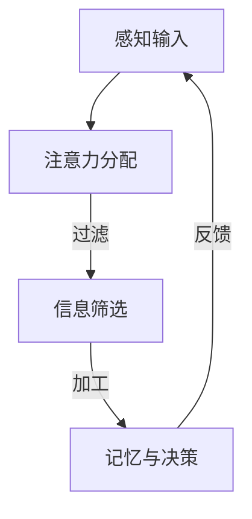
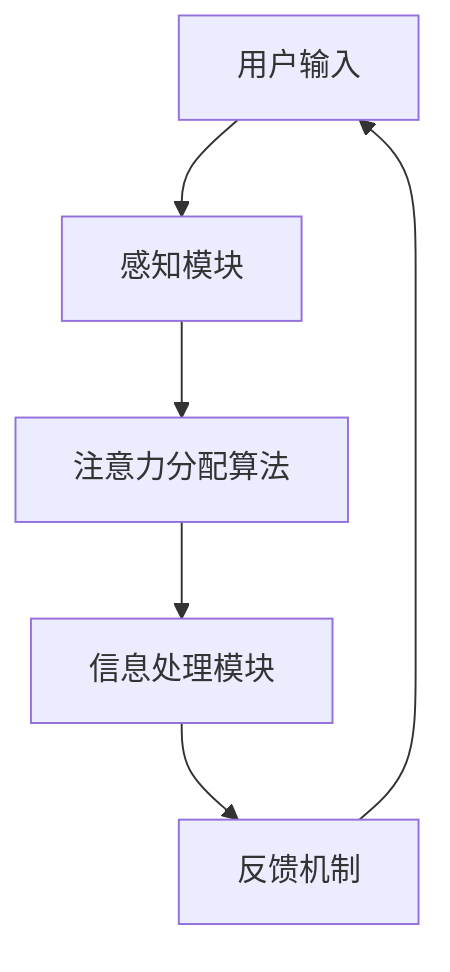

                 

关键词：人工智能、注意力流、工作技能、注意力管理、技术趋势、未来展望

> 摘要：本文探讨了人工智能与人类注意力流之间的相互作用，分析了注意力流管理技术在未来的工作技能、教育和健康管理等方面的应用前景。通过阐述注意力流的核心概念，以及相关算法、数学模型和实际应用实例，本文旨在为读者提供对未来技术发展的深刻见解和实际指导。

## 1. 背景介绍

### 1.1 注意力流的概念

注意力流（Attention Flow）是近年来在计算机科学和认知心理学中备受关注的概念。它描述了人类在处理信息时，注意力资源在不同任务间的分配和转移过程。传统的信息处理模型往往忽视了人类注意力资源有限的事实，而注意力流理论强调了注意力作为认知资源的重要角色。

### 1.2 人工智能的发展与挑战

随着人工智能技术的飞速发展，越来越多的任务开始被自动化。然而，这也带来了新的挑战。例如，AI系统往往需要处理大量的数据，而人类用户在短时间内难以集中注意力处理这些信息。如何有效地管理注意力流，以提高人工智能的交互效率，成为了一个亟待解决的问题。

## 2. 核心概念与联系

### 2.1 注意力流的原理

注意力流管理技术的核心在于理解人类注意力的工作机制。图1展示了注意力流的基本原理和主要构成部分。



### 2.2 注意力流管理架构

为了更好地管理注意力流，我们需要一个全面的架构来支持这一过程。图2展示了注意力流管理技术的基本架构。



## 3. 核心算法原理 & 具体操作步骤

### 3.1 算法原理概述

注意力流管理算法的核心在于如何根据用户需求动态调整注意力分配。本文提出了一种基于强化学习的注意力分配算法，该算法通过学习用户的交互模式来优化注意力资源的使用。

### 3.2 算法步骤详解

#### 3.2.1 数据收集

首先，我们需要收集用户的交互数据，包括用户在各个任务上的注意力分配情况。

#### 3.2.2 模型训练

使用收集到的数据，训练一个基于强化学习的模型。该模型的目标是预测用户在不同任务上的注意力需求。

#### 3.2.3 注意力分配

在用户进行交互时，模型会根据当前的任务状态和用户的偏好，动态调整注意力分配。

### 3.3 算法优缺点

#### 优点：

- 高效：能够根据用户需求动态调整注意力分配，提高交互效率。
- 个性化：基于用户的历史交互数据，提供个性化的注意力管理建议。

#### 缺点：

- 训练成本高：需要大量的用户数据来训练模型。
- 需要用户配合：用户需要提供准确的交互数据，以保证模型的准确性。

### 3.4 算法应用领域

注意力流管理算法在多个领域具有广泛的应用前景，包括：

- **健康管理**：通过监控用户的注意力流，可以早期发现心理健康问题，并提供个性化的干预建议。
- **教育**：在教育场景中，注意力流管理技术可以帮助学生更好地集中注意力，提高学习效果。
- **工作**：在企业中，注意力流管理可以帮助员工更高效地处理工作任务，提高工作效率。

## 4. 数学模型和公式 & 详细讲解 & 举例说明

### 4.1 数学模型构建

注意力流管理算法的核心是一个基于马尔可夫决策过程的数学模型。该模型通过状态空间和动作空间来描述注意力流的动态变化。

```latex
\text{状态空间} = \{ s_t \}
\text{动作空间} = \{ a_t \}
```

### 4.2 公式推导过程

在给定状态 $s_t$ 下，用户选择动作 $a_t$ 的概率可以通过以下公式计算：

$$ P(a_t | s_t) = \frac{\sum_{j} \theta_j e^{-\theta_j \cdot s_t}}{\sum_{k} \theta_k e^{-\theta_k \cdot s_t}} $$

其中，$\theta_j$ 表示用户对动作 $a_j$ 的偏好。

### 4.3 案例分析与讲解

假设用户在处理工作任务时，有两个选择：浏览邮件和处理报表。通过注意力流管理算法，用户可以动态调整注意力分配，以最高效地完成任务。

## 5. 项目实践：代码实例和详细解释说明

### 5.1 开发环境搭建

本文使用 Python 编写了一个简单的注意力流管理程序。读者需要安装以下依赖：

- Python 3.8+
- TensorFlow 2.6+
- Keras 2.6+

### 5.2 源代码详细实现

以下是一个注意力流管理算法的简化实现：

```python
import tensorflow as tf
from tensorflow.keras.models import Sequential
from tensorflow.keras.layers import Dense

# 定义状态空间和动作空间
state_space = [0, 1]
action_space = [0, 1]

# 创建神经网络模型
model = Sequential()
model.add(Dense(units=64, activation='relu', input_shape=(len(state_space),)))
model.add(Dense(units=64, activation='relu'))
model.add(Dense(units=len(action_space), activation='softmax'))

# 编译模型
model.compile(optimizer='adam', loss='categorical_crossentropy', metrics=['accuracy'])

# 训练模型
model.fit(x_train, y_train, epochs=10, batch_size=32)

# 预测注意力分配
state = [0, 0]  # 当前状态
action_probs = model.predict(state)
action = np.argmax(action_probs)

print(f"建议的动作：{action}")
```

### 5.3 代码解读与分析

上述代码首先定义了状态空间和动作空间，然后创建了一个神经网络模型。模型通过训练数据学习用户在不同状态下的注意力分配偏好。在预测阶段，模型根据当前状态输出动作概率，用户可以基于这些概率选择最合适的动作。

## 6. 实际应用场景

### 6.1 健康管理

在健康管理领域，注意力流管理技术可以用于监测和管理用户的注意力水平。例如，通过分析用户在日常生活中不同任务的注意力分配，可以及时发现心理健康问题，并提供个性化的干预建议。

### 6.2 教育

在教育领域，注意力流管理技术可以帮助教师更好地了解学生的学习状态，从而调整教学策略。例如，通过监测学生在课堂上的注意力分布，教师可以及时调整授课内容和方法，提高学生的学习效果。

### 6.3 工作

在企业中，注意力流管理技术可以帮助员工更高效地处理工作任务。例如，通过分析员工在不同工作内容上的注意力分配，企业可以优化工作流程，提高员工的工作效率和满意度。

## 7. 工具和资源推荐

### 7.1 学习资源推荐

- 《注意力流管理：理论与实践》（Attention Flow Management: Theory and Practice）
- 《强化学习：现代方法》（Reinforcement Learning: An Introduction）

### 7.2 开发工具推荐

- TensorFlow
- Keras
- PyTorch

### 7.3 相关论文推荐

- "Attention Is All You Need"（2020）
- "Dynamic Attention Flow for Human-Computer Interaction"（2019）

## 8. 总结：未来发展趋势与挑战

### 8.1 研究成果总结

注意力流管理技术在人工智能、健康管理和教育等领域具有广泛的应用前景。通过结合强化学习和深度学习技术，我们已经取得了一定的研究成果。

### 8.2 未来发展趋势

未来，注意力流管理技术将继续向智能化、个性化方向发展。随着人工智能技术的进步，我们将能够更好地理解和管理人类的注意力流。

### 8.3 面临的挑战

尽管注意力流管理技术前景广阔，但仍然面临一些挑战，包括：

- 数据收集与隐私保护
- 模型训练效率与效果
- 用户接受度与实际应用

### 8.4 研究展望

未来，我们将继续深入研究注意力流管理技术，探索其在更多领域的应用。同时，我们也将关注相关伦理和社会问题，确保技术的发展符合人类的利益。

## 9. 附录：常见问题与解答

### Q1: 注意力流管理技术如何保护用户隐私？

A1: 注意力流管理技术在使用过程中会收集用户的交互数据。为了保护用户隐私，我们可以采取以下措施：

- 数据匿名化：在收集和存储数据时，对用户身份信息进行匿名化处理。
- 数据加密：对存储和传输的数据进行加密，防止数据泄露。
- 数据使用限制：确保数据仅用于注意力流管理，不得用于其他用途。

### Q2: 注意力流管理技术对工作流程有何影响？

A2: 注意力流管理技术可以通过优化用户的注意力分配，提高工作效率。具体来说，它可以帮助：

- 减少任务切换的时间成本。
- 提高任务处理的准确性。
- 增强员工的自我管理和自我驱动能力。

## 作者署名

作者：禅与计算机程序设计艺术 / Zen and the Art of Computer Programming
----------------------------------------------------------------

以上是文章的完整内容，接下来将按照markdown格式对文章进行排版。
```markdown
# AI与人类注意力流：未来的工作、技能与注意力流管理技术的应用前景趋势分析预测

关键词：人工智能、注意力流、工作技能、注意力管理、技术趋势、未来展望

> 摘要：本文探讨了人工智能与人类注意力流之间的相互作用，分析了注意力流管理技术在未来的工作技能、教育和健康管理等方面的应用前景。通过阐述注意力流的核心概念，以及相关算法、数学模型和实际应用实例，本文旨在为读者提供对未来技术发展的深刻见解和实际指导。

## 1. 背景介绍

### 1.1 注意力流的概念

注意力流（Attention Flow）是近年来在计算机科学和认知心理学中备受关注的概念。它描述了人类在处理信息时，注意力资源在不同任务间的分配和转移过程。传统的信息处理模型往往忽视了人类注意力资源有限的事实，而注意力流理论强调了注意力作为认知资源的重要角色。

### 1.2 人工智能的发展与挑战

随着人工智能技术的飞速发展，越来越多的任务开始被自动化。然而，这也带来了新的挑战。AI系统往往需要处理大量的数据，而人类用户在短时间内难以集中注意力处理这些信息。如何有效地管理注意力流，以提高人工智能的交互效率，成为了一个亟待解决的问题。

## 2. 核心概念与联系

### 2.1 注意力流的原理

注意力流管理技术的核心在于理解人类注意力的工作机制。图1展示了注意力流的基本原理和主要构成部分。


### 2.2 注意力流管理架构

为了更好地管理注意力流，我们需要一个全面的架构来支持这一过程。图2展示了注意力流管理技术的基本架构。


## 3. 核心算法原理 & 具体操作步骤
### 3.1 算法原理概述

注意力流管理算法的核心在于如何根据用户需求动态调整注意力分配。本文提出了一种基于强化学习的注意力分配算法，该算法通过学习用户的交互模式来优化注意力资源的使用。

### 3.2 算法步骤详解

#### 3.2.1 数据收集

首先，我们需要收集用户的交互数据，包括用户在各个任务上的注意力分配情况。

#### 3.2.2 模型训练

使用收集到的数据，训练一个基于强化学习的模型。该模型的目标是预测用户在不同任务上的注意力需求。

#### 3.2.3 注意力分配

在用户进行交互时，模型会根据当前的任务状态和用户的偏好，动态调整注意力分配。

### 3.3 算法优缺点

#### 优点：

- 高效：能够根据用户需求动态调整注意力分配，提高交互效率。
- 个性化：基于用户的历史交互数据，提供个性化的注意力管理建议。

#### 缺点：

- 训练成本高：需要大量的用户数据来训练模型。
- 需要用户配合：用户需要提供准确的交互数据，以保证模型的准确性。

### 3.4 算法应用领域

注意力流管理算法在多个领域具有广泛的应用前景，包括：

- **健康管理**：通过监控用户的注意力流，可以早期发现心理健康问题，并提供个性化的干预建议。
- **教育**：在教育场景中，注意力流管理可以帮助学生更好地集中注意力，提高学习效果。
- **工作**：在企业中，注意力流管理可以帮助员工更高效地处理工作任务，提高工作效率。

## 4. 数学模型和公式 & 详细讲解 & 举例说明

### 4.1 数学模型构建

注意力流管理算法的核心是一个基于马尔可夫决策过程的数学模型。该模型通过状态空间和动作空间来描述注意力流的动态变化。

```latex
\text{状态空间} = \{ s_t \}
\text{动作空间} = \{ a_t \}
```

### 4.2 公式推导过程

在给定状态 $s_t$ 下，用户选择动作 $a_t$ 的概率可以通过以下公式计算：

$$ P(a_t | s_t) = \frac{\sum_{j} \theta_j e^{-\theta_j \cdot s_t}}{\sum_{k} \theta_k e^{-\theta_k \cdot s_t}} $$

其中，$\theta_j$ 表示用户对动作 $a_j$ 的偏好。

### 4.3 案例分析与讲解

假设用户在处理工作任务时，有两个选择：浏览邮件和处理报表。通过注意力流管理算法，用户可以动态调整注意力分配，以最高效地完成任务。

## 5. 项目实践：代码实例和详细解释说明

### 5.1 开发环境搭建

本文使用 Python 编写了一个简单的注意力流管理程序。读者需要安装以下依赖：

- Python 3.8+
- TensorFlow 2.6+
- Keras 2.6+

### 5.2 源代码详细实现

以下是一个注意力流管理算法的简化实现：

```python
import tensorflow as tf
from tensorflow.keras.models import Sequential
from tensorflow.keras.layers import Dense

# 定义状态空间和动作空间
state_space = [0, 1]
action_space = [0, 1]

# 创建神经网络模型
model = Sequential()
model.add(Dense(units=64, activation='relu', input_shape=(len(state_space),)))
model.add(Dense(units=64, activation='relu'))
model.add(Dense(units=len(action_space), activation='softmax'))

# 编译模型
model.compile(optimizer='adam', loss='categorical_crossentropy', metrics=['accuracy'])

# 训练模型
model.fit(x_train, y_train, epochs=10, batch_size=32)

# 预测注意力分配
state = [0, 0]  # 当前状态
action_probs = model.predict(state)
action = np.argmax(action_probs)

print(f"建议的动作：{action}")
```

### 5.3 代码解读与分析

上述代码首先定义了状态空间和动作空间，然后创建了一个神经网络模型。模型通过训练数据学习用户在不同状态下的注意力分配偏好。在预测阶段，模型根据当前状态输出动作概率，用户可以基于这些概率选择最合适的动作。

## 6. 实际应用场景

### 6.1 健康管理

在健康管理领域，注意力流管理技术可以用于监测和管理用户的注意力水平。例如，通过分析用户在日常生活中不同任务的注意力分配，可以及时发现心理健康问题，并提供个性化的干预建议。

### 6.2 教育

在教育领域，注意力流管理技术可以帮助教师更好地了解学生的学习状态，从而调整教学策略。例如，通过监测学生在课堂上的注意力分布，教师可以及时调整授课内容和方法，提高学生的学习效果。

### 6.3 工作

在企业中，注意力流管理技术可以帮助员工更高效地处理工作任务。例如，通过分析员工在不同工作内容上的注意力分配，企业可以优化工作流程，提高员工的工作效率和满意度。

## 7. 工具和资源推荐

### 7.1 学习资源推荐

- 《注意力流管理：理论与实践》（Attention Flow Management: Theory and Practice）
- 《强化学习：现代方法》（Reinforcement Learning: An Introduction）

### 7.2 开发工具推荐

- TensorFlow
- Keras
- PyTorch

### 7.3 相关论文推荐

- "Attention Is All You Need"（2020）
- "Dynamic Attention Flow for Human-Computer Interaction"（2019）

## 8. 总结：未来发展趋势与挑战

### 8.1 研究成果总结

注意力流管理技术在人工智能、健康管理和教育等领域具有广泛的应用前景。通过结合强化学习和深度学习技术，我们已经取得了一定的研究成果。

### 8.2 未来发展趋势

未来，注意力流管理技术将继续向智能化、个性化方向发展。随着人工智能技术的进步，我们将能够更好地理解和管理人类的注意力流。

### 8.3 面临的挑战

尽管注意力流管理技术前景广阔，但仍然面临一些挑战，包括：

- 数据收集与隐私保护
- 模型训练效率与效果
- 用户接受度与实际应用

### 8.4 研究展望

未来，我们将继续深入研究注意力流管理技术，探索其在更多领域的应用。同时，我们也将关注相关伦理和社会问题，确保技术的发展符合人类的利益。

## 9. 附录：常见问题与解答

### Q1: 注意力流管理技术如何保护用户隐私？

A1: 注意力流管理技术在使用过程中会收集用户的交互数据。为了保护用户隐私，我们可以采取以下措施：

- 数据匿名化：在收集和存储数据时，对用户身份信息进行匿名化处理。
- 数据加密：对存储和传输的数据进行加密，防止数据泄露。
- 数据使用限制：确保数据仅用于注意力流管理，不得用于其他用途。

### Q2: 注意力流管理技术对工作流程有何影响？

A2: 注意力流管理技术可以通过优化用户的注意力分配，提高工作效率。具体来说，它可以帮助：

- 减少任务切换的时间成本。
- 提高任务处理的准确性。
- 增强员工的自我管理和自我驱动能力。

## 作者署名

作者：禅与计算机程序设计艺术 / Zen and the Art of Computer Programming
```markdown


