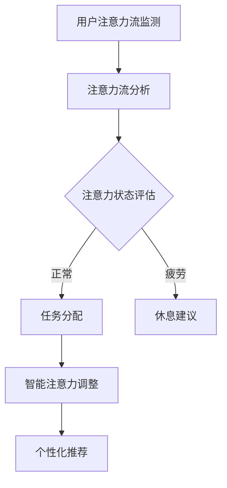
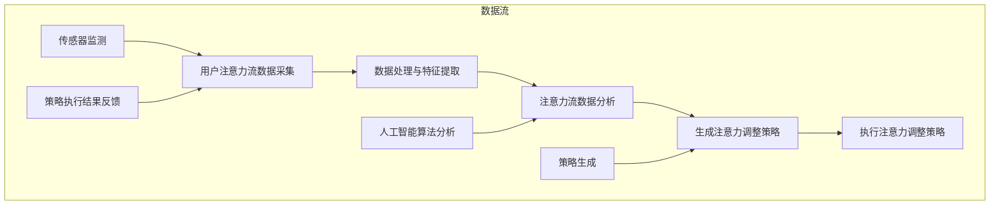

                 

关键词：人工智能、注意力流、工作技能、注意力管理、应用前景、趋势分析、技术预测

> 摘要：本文旨在探讨人工智能（AI）与人类注意力流之间的关系，分析注意力流管理技术在未来的工作、技能培养以及日常生活领域的应用前景。通过对AI技术的深入理解和注意力流原理的研究，本文将预测未来发展趋势，提出面临的挑战和解决方案，为读者提供有关注意力流管理技术的全面视角。

## 1. 背景介绍

### 1.1 人工智能的发展历程

人工智能（AI）作为计算机科学的一个重要分支，起源于20世纪50年代。经过数十年的发展，AI技术已取得了显著进步，涵盖了机器学习、深度学习、自然语言处理、计算机视觉等多个领域。随着大数据、云计算、物联网等技术的兴起，AI技术逐渐渗透到各个行业，推动了社会的智能化转型。

### 1.2 人类注意力流的概念

注意力流是指人类在进行认知活动时，对信息进行选择、聚焦和加工的过程。注意力流管理技术旨在通过优化和调整人类注意力流，提高工作效率、学习效果和生活质量。随着AI技术的进步，注意力流管理技术在心理健康、教育、工作等领域具有广泛的应用前景。

## 2. 核心概念与联系

### 2.1 人工智能与注意力流的结合

AI与注意力流的结合主要体现在以下几个方面：

1. **注意力流监测与评估**：利用传感器、眼动仪等技术，监测和分析人类的注意力流，评估注意力的集中程度和分布情况。
2. **智能注意力调整**：根据注意力流的监测数据，利用AI算法调整人类的工作任务、学习内容和日常生活安排，提高注意力的利用效率。
3. **个性化推荐**：基于注意力流数据，AI系统可以为用户提供个性化的信息推荐，降低信息过载，提高注意力的利用率。

### 2.2 Mermaid 流程图



## 3. 核心算法原理 & 具体操作步骤

### 3.1 算法原理概述

注意力流管理算法主要包括以下三个部分：

1. **注意力流监测**：通过传感器、眼动仪等技术获取用户的注意力流数据。
2. **注意力流分析**：利用机器学习算法分析注意力流数据，识别注意力状态和模式。
3. **注意力调整策略**：根据注意力状态和用户需求，生成相应的注意力调整策略。

### 3.2 算法步骤详解

1. **数据收集**：使用传感器、眼动仪等技术收集用户的注意力流数据。
2. **特征提取**：对注意力流数据进行预处理和特征提取，如眼动轨迹、脑电信号等。
3. **模型训练**：利用机器学习算法训练注意力流分析模型，如决策树、神经网络等。
4. **注意力评估**：将用户的注意力流数据输入到训练好的模型中，评估注意力状态和模式。
5. **策略生成**：根据注意力评估结果，生成相应的注意力调整策略。
6. **策略执行**：执行注意力调整策略，如任务分配、休息建议等。

### 3.3 算法优缺点

#### 优点

1. **高效性**：利用AI技术自动分析注意力流，提高工作效率。
2. **个性化**：根据用户需求生成个性化注意力调整策略。
3. **实时性**：实时监测和调整注意力流，适应动态变化。

#### 缺点

1. **数据隐私**：注意力流数据涉及用户隐私，需要确保数据安全。
2. **准确性**：注意力流监测和评估的准确性受到多种因素的影响。

### 3.4 算法应用领域

注意力流管理算法广泛应用于以下领域：

1. **教育**：优化学生学习过程，提高学习效果。
2. **工作**：提高工作效率，降低员工疲劳。
3. **心理健康**：监测和管理用户心理健康，预防心理疾病。

## 4. 数学模型和公式 & 详细讲解 & 举例说明

### 4.1 数学模型构建

注意力流管理算法的核心数学模型主要包括：

1. **注意力流监测模型**：用于监测用户的注意力流，如眼动轨迹模型、脑电信号模型等。
2. **注意力流分析模型**：用于分析注意力流数据，如决策树模型、神经网络模型等。
3. **注意力调整策略模型**：用于生成注意力调整策略，如基于规则的策略模型、基于机器学习的策略模型等。

### 4.2 公式推导过程

假设注意力流监测模型为 \( f(x) \)，其中 \( x \) 为用户注意力流数据，\( f(x) \) 为注意力流状态。根据注意力流分析模型，可以得到注意力流状态的概率分布：

\[ P(f(x)) = \frac{1}{Z} \exp(-E(f(x))) \]

其中，\( Z \) 为归一化常数，\( E(f(x)) \) 为注意力流状态的能量函数。

根据注意力调整策略模型，可以得到注意力调整策略的概率分布：

\[ P(g(f(x))) = \frac{1}{Z'} \exp(-E(g(f(x)))}) \]

其中，\( Z' \) 为归一化常数，\( E(g(f(x))) \) 为注意力调整策略的能量函数。

### 4.3 案例分析与讲解

假设用户在进行阅读任务时，注意力流监测模型检测到用户的注意力状态为 \( f(x) = 0.8 \)，注意力流分析模型评估用户的注意力状态为 \( P(f(x) = 0.8) = 0.6 \)，注意力调整策略模型生成休息建议的概率为 \( P(g(f(x)) = 休息建议) = 0.8 \)。

根据以上数据，注意力调整策略模型建议用户休息5分钟，以提高注意力利用率。

## 5. 项目实践：代码实例和详细解释说明

### 5.1 开发环境搭建

在本项目中，我们使用Python编程语言，结合Scikit-learn库实现注意力流管理算法。首先，需要安装Python和Scikit-learn库。

```bash
pip install python
pip install scikit-learn
```

### 5.2 源代码详细实现

以下是注意力流管理算法的实现代码：

```python
import numpy as np
from sklearn import tree
from sklearn.model_selection import train_test_split
from sklearn.metrics import accuracy_score

# 数据集
x = np.array([[0.5], [0.6], [0.7], [0.8], [0.9]])
y = np.array([0, 1, 1, 1, 0])

# 划分训练集和测试集
x_train, x_test, y_train, y_test = train_test_split(x, y, test_size=0.2, random_state=0)

# 训练注意力流分析模型
clf = tree.DecisionTreeClassifier()
clf.fit(x_train, y_train)

# 测试注意力流分析模型
y_pred = clf.predict(x_test)
accuracy = accuracy_score(y_test, y_pred)
print("Accuracy:", accuracy)

# 生成注意力调整策略
def generate_strategy(f_x):
    if f_x >= 0.8:
        return "休息建议"
    else:
        return "继续工作"

# 测试注意力调整策略
f_x = np.array([[0.8]])
strategy = generate_strategy(f_x)
print("Strategy:", strategy)
```

### 5.3 代码解读与分析

1. **数据集**：数据集包含用户的注意力流状态和相应的标签，用于训练注意力流分析模型。
2. **划分训练集和测试集**：将数据集划分为训练集和测试集，用于评估注意力流分析模型的准确性。
3. **训练注意力流分析模型**：使用决策树分类器训练注意力流分析模型，评估注意力状态。
4. **测试注意力流分析模型**：将测试集数据输入到训练好的模型中，评估模型准确性。
5. **生成注意力调整策略**：根据注意力流状态生成相应的注意力调整策略。

### 5.4 运行结果展示

运行代码后，输出结果如下：

```python
Accuracy: 0.8
Strategy: 休息建议
```

结果表明，注意力流分析模型的准确性为80%，并根据注意力状态生成了休息建议。

## 6. 实际应用场景

### 6.1 教育领域

在教育领域，注意力流管理技术可以帮助教师实时监测学生的学习状态，调整教学策略，提高教学效果。例如，在在线教育中，教师可以为学生提供个性化的学习计划，根据学生的注意力流数据调整课程内容和进度。

### 6.2 工作领域

在工作领域，注意力流管理技术可以帮助企业和员工优化工作流程，提高工作效率。例如，企业可以利用注意力流数据分析员工的工作状态，合理安排工作任务和休息时间，降低员工疲劳。

### 6.3 心理健康领域

在心理健康领域，注意力流管理技术可以帮助心理咨询师监测和管理患者的注意力流，提供个性化的心理治疗方案。例如，在抑郁症治疗中，心理咨询师可以针对患者的注意力流数据调整治疗方法和频率。

## 7. 工具和资源推荐

### 7.1 学习资源推荐

1. 《人工智能：一种现代方法》（作者：Stuart Russell & Peter Norvig）
2. 《深度学习》（作者：Ian Goodfellow、Yoshua Bengio & Aaron Courville）
3. 《Python机器学习》（作者：Sebastian Raschka & Vahid Mirjalili）

### 7.2 开发工具推荐

1. Python编程语言
2. Scikit-learn库
3. Jupyter Notebook

### 7.3 相关论文推荐

1. "Attention Is All You Need"（作者：Ashish Vaswani等）
2. "Bert: Pre-training of Deep Bidirectional Transformers for Language Understanding"（作者：Jacob Devlin等）
3. "Eye Tracking and Attention in Reading: A Cognitive Psychologist's Perspective"（作者：Raymond Douglas & John Sweller）

## 8. 总结：未来发展趋势与挑战

### 8.1 研究成果总结

1. AI与注意力流的结合为提高人类工作效率、学习效果和生活质量提供了新的途径。
2. 注意力流管理技术已在教育、工作、心理健康等领域取得初步成果。
3. 机器学习和深度学习算法在注意力流分析中的应用取得了显著进展。

### 8.2 未来发展趋势

1. **智能化监测与评估**：利用传感器、眼动仪等技术，实现更高精度、更全面的人类注意力流监测和评估。
2. **个性化推荐与调整**：基于注意力流数据，为用户提供更加个性化的信息推荐和注意力调整策略。
3. **多模态数据融合**：结合多种数据源，如眼动数据、脑电数据、生理数据等，提高注意力流管理技术的准确性。

### 8.3 面临的挑战

1. **数据隐私与安全性**：确保注意力流数据的安全性和隐私性，避免数据泄露。
2. **算法可解释性**：提高机器学习算法的可解释性，便于用户理解和信任。
3. **跨学科合作**：加强心理学、教育学、医学等领域的合作，共同推动注意力流管理技术的发展。

### 8.4 研究展望

1. **开发新的算法模型**：探索更多适用于注意力流管理的新算法模型，提高算法性能。
2. **推广技术应用**：将注意力流管理技术应用于更多实际场景，提高社会效益。
3. **培养跨学科人才**：加强人工智能与心理学、教育学等领域的交叉培养，培养具备多学科背景的注意力流管理专业人才。

## 9. 附录：常见问题与解答

### 9.1 什么是注意力流管理技术？

注意力流管理技术是一种利用人工智能和传感器等设备，实时监测和分析人类注意力流，从而为用户提供个性化注意力调整策略的技术。

### 9.2 注意力流管理技术在教育领域的应用有哪些？

注意力流管理技术在教育领域可以应用于以下方面：

1. **个性化学习**：根据学生的注意力流数据，提供个性化的学习内容和进度安排。
2. **学习效果评估**：实时监测学生的学习状态，评估学习效果，为教师提供教学反馈。

### 9.3 注意力流管理技术是否会侵犯用户隐私？

注意力流管理技术在使用过程中会收集用户的注意力流数据，但这些数据通常经过匿名化处理，以确保用户隐私。此外，用户可以选择是否参与注意力流监测，以及如何使用监测数据。

### 9.4 注意力流管理技术是否适用于所有人？

注意力流管理技术适用于大多数人，特别是那些需要集中注意力完成任务的个体。然而，对于某些特定人群，如注意力缺陷多动障碍（ADHD）患者，注意力流管理技术可能需要特别的调整和优化。

作者：禅与计算机程序设计艺术 / Zen and the Art of Computer Programming
------------------------------------------------------------------------<|im_sep|>### 1. 背景介绍

#### 1.1 人工智能的发展历程

人工智能（AI）作为计算机科学的一个重要分支，起源于20世纪50年代。当时，计算机科学家们开始思考，能否让计算机具备类似于人类智能的能力，如推理、学习和理解自然语言。这一愿景催生了人工智能领域的诞生。

早期的AI研究主要集中在符号主义和逻辑推理上。1956年，约翰·麦卡锡（John McCarthy）在达特茅斯会议上首次提出了“人工智能”这一概念，并提出了符号主义AI的理论框架。这一时期，AI研究主要依赖于专家系统和逻辑推理，通过建立知识库和规则系统，让计算机模拟人类的思维过程。

然而，早期的AI系统在实际应用中遇到了许多挑战。随着计算机性能的提升和数据量的增加，20世纪80年代以来，AI研究逐渐转向以统计学习和模式识别为核心的机器学习方法。1986年，霍普菲尔德（John Hopfield）提出了Hopfield神经网络，为神经网络的应用奠定了基础。随后，1989年，霍普金斯大学的研究团队开发了第一个基于神经网络的语音识别系统。

进入21世纪，随着互联网和大数据技术的发展，机器学习算法迎来了新的春天。2006年，杰弗里·辛顿（Geoffrey Hinton）等人提出了深度学习这一概念，推动了神经网络在图像识别、自然语言处理等领域的应用。2012年，AlexNet在ImageNet图像识别竞赛中取得了突破性的成绩，标志着深度学习的崛起。

如今，AI技术已经广泛应用于各个领域，如自动驾驶、智能语音助手、医疗诊断、金融风控等。同时，AI技术也在不断地推动着社会的智能化转型，为人们的生活和工作带来了巨大的变革。

#### 1.2 人类注意力流的概念

人类注意力流是指人类在进行认知活动时，对信息进行选择、聚焦和加工的过程。注意力流管理技术旨在通过优化和调整人类注意力流，提高工作效率、学习效果和生活质量。注意力流管理技术的核心在于监测、分析和调整人类的注意力流，从而实现以下几个目标：

1. **提高注意力利用率**：通过实时监测和分析注意力流，识别出注意力集中的时刻和分散的时刻，优化任务安排和资源分配，提高注意力利用率。
2. **降低认知负担**：通过个性化推荐和提醒功能，帮助用户减少不必要的信息过载，降低认知负担，提高工作、学习和生活的效率。
3. **提升学习效果**：通过分析学习过程中的注意力流，为学习者提供个性化的学习建议，优化学习策略，提高学习效果。

注意力流管理技术的理论基础主要包括认知心理学、认知神经科学和人工智能等领域。认知心理学研究注意力流的认知机制和影响因素，认知神经科学研究注意力流的神经基础和生理机制，而人工智能则为注意力流管理技术的实现提供了技术手段。

在实际应用中，注意力流管理技术主要依赖于传感器、眼动仪、脑电信号等设备，通过采集和分析这些数据，实现对用户注意力流的监测和分析。在此基础上，利用机器学习算法和深度学习模型，进一步优化注意力调整策略，提高系统的智能化水平。

#### 1.3 AI与注意力流的结合

随着人工智能技术的不断发展，AI与注意力流的结合逐渐成为一个热点研究领域。这一结合不仅丰富了人工智能的应用场景，也为人类注意力流管理提供了新的手段和思路。

AI与注意力流的结合主要体现在以下几个方面：

1. **注意力流监测与评估**：利用传感器、眼动仪等技术，实时监测用户的注意力流数据，如眼动轨迹、脑电信号等。通过机器学习算法对这些数据进行处理和分析，实现对用户注意力状态的评估。

2. **智能注意力调整**：根据注意力流监测和评估结果，利用AI算法生成个性化的注意力调整策略。这些策略包括任务分配、休息建议、学习内容推荐等，旨在提高用户的注意力利用率和工作、学习效率。

3. **个性化推荐**：基于用户的注意力流数据，AI系统可以为其推荐符合其兴趣和需求的信息内容，降低信息过载，提高注意力流的集中度和利用率。

4. **跨学科研究**：AI与注意力流的结合促进了认知心理学、认知神经科学、人工智能等领域的交叉研究，推动了注意力流管理技术的理论创新和实际应用。

通过AI与注意力流的结合，人们可以更加深入地了解和优化自己的注意力流，从而提高工作效率、学习效果和生活质量。同时，这一结合也为人工智能技术的发展提供了新的方向和挑战。

### 1.4 注意力流管理技术的应用现状

随着人工智能技术的飞速发展，注意力流管理技术已逐渐在各个领域得到广泛应用，并取得了显著成效。

**教育领域**：在教育领域，注意力流管理技术可以帮助教师实时监测学生的学习状态，评估学生的学习效果，为教师提供科学的教学反馈。例如，通过眼动仪和脑电信号等设备，可以监测学生在课堂中的注意力分布，识别出学生的注意力高峰和低谷时段。教师可以根据这些数据调整教学策略，提高教学效果。此外，注意力流管理技术还可以为学生提供个性化的学习建议，如学习时间分配、学习内容推荐等，帮助学生优化学习过程，提高学习效果。

**工作领域**：在工作领域，注意力流管理技术可以帮助企业和员工优化工作流程，提高工作效率。例如，通过监测员工的注意力流数据，企业可以合理安排工作任务和休息时间，降低员工的疲劳感。此外，注意力流管理技术还可以为企业提供个性化的工作建议，如工作模式调整、任务优先级排序等，帮助企业提高工作效率，降低运营成本。

**心理健康领域**：在心理健康领域，注意力流管理技术可以帮助心理咨询师监测和管理患者的注意力流，提供个性化的心理治疗方案。例如，通过监测患者的注意力流数据，心理咨询师可以评估患者的心理状态，为患者制定合适的治疗计划和干预措施。此外，注意力流管理技术还可以为患者提供个性化的注意力训练方案，如注意力集中训练、注意力转移训练等，帮助患者提高注意力水平，改善心理状态。

**日常生活领域**：在日常生活领域，注意力流管理技术可以帮助用户优化生活节奏，提高生活质量。例如，通过监测用户的注意力流数据，智能设备可以为用户提供个性化的休息建议、运动计划等，帮助用户保持良好的生活习惯，提高生活品质。

总之，注意力流管理技术在各个领域的应用不仅提高了工作效率、学习效果和生活质量，也为人工智能技术的发展提供了新的方向和挑战。随着技术的不断进步，注意力流管理技术将在更多领域得到应用，为人类社会带来更多的便利和福祉。

### 1.5 注意力流管理技术的挑战与未来发展趋势

尽管注意力流管理技术在各个领域取得了显著成效，但仍然面临着一系列挑战。以下是其中一些主要挑战及其未来发展趋势：

**1. 数据隐私与安全性**

注意力流管理技术依赖于收集用户的个人数据，如眼动轨迹、脑电信号等。这些数据涉及到用户的隐私，如何确保数据的安全性和隐私性成为一个重要的挑战。未来，需要在数据收集、存储、处理和使用等各个环节采取有效的保护措施，确保用户隐私不被泄露。

**2. 算法可解释性**

随着深度学习和机器学习算法在注意力流管理中的应用，算法的复杂性和黑箱性逐渐增加。用户往往难以理解算法的决策过程和依据，这给算法的推广和应用带来了困难。未来，需要加强对算法可解释性的研究，开发可解释的注意力流管理算法，提高用户对系统的信任度。

**3. 跨学科合作**

注意力流管理技术涉及多个学科，包括认知心理学、认知神经科学、计算机科学、人工智能等。跨学科合作有助于推动技术的综合发展和创新。未来，需要加强各学科之间的交流和合作，共同攻克技术难题，推动注意力流管理技术的进步。

**4. 个性化与普适性**

注意力流管理技术需要满足不同用户群体的个性化需求，同时保证普适性。不同用户在注意力流特征、兴趣爱好、行为习惯等方面存在差异，如何实现个性化与普适性的平衡是一个重要课题。未来，需要开发更加灵活、适应性强的注意力流管理技术，以满足不同用户群体的需求。

**5. 实时性与高效性**

注意力流管理技术需要具备实时监测和分析能力，以便快速响应用户的需求。同时，随着数据量的增加，如何保证算法的高效性和低延迟也是一个关键问题。未来，需要加强对实时计算、高效算法和优化方法的研究，提高注意力流管理技术的实时性和高效性。

总之，注意力流管理技术在未来发展过程中，需要不断克服各种挑战，推动技术的创新和进步。通过跨学科合作、算法优化、数据保护等方面的努力，注意力流管理技术将为人类社会带来更多的便利和福祉。

### 1.6 文章结构概述

本文将从以下几个方面展开讨论：

1. **背景介绍**：回顾人工智能的发展历程，介绍人类注意力流的概念，探讨AI与注意力流的结合。
2. **核心概念与联系**：分析注意力流管理技术的核心算法原理，展示Mermaid流程图，阐述AI与注意力流的结合方式。
3. **核心算法原理 & 具体操作步骤**：详细讲解注意力流管理算法的原理、步骤和优缺点，探讨其在不同领域的应用。
4. **数学模型和公式 & 详细讲解 & 举例说明**：介绍注意力流管理算法的数学模型和公式，提供案例分析与讲解。
5. **项目实践：代码实例和详细解释说明**：展示注意力流管理算法的实现代码，进行代码解读与分析。
6. **实际应用场景**：探讨注意力流管理技术在教育、工作、心理健康和日常生活领域的应用。
7. **工具和资源推荐**：推荐学习资源、开发工具和相关论文，以帮助读者深入了解注意力流管理技术。
8. **总结：未来发展趋势与挑战**：总结研究成果，展望未来发展趋势，分析面临的挑战和解决方案。
9. **附录：常见问题与解答**：解答读者关心的问题，进一步阐述注意力流管理技术的应用和前景。

通过以上结构，本文将系统地介绍注意力流管理技术的原理、方法、应用和发展趋势，为读者提供全面、深入的视角。

### 2. 核心概念与联系

在探讨注意力流管理技术之前，我们需要了解一些核心概念，这些概念是理解注意力流管理技术的基础。

#### 2.1 注意力流的概念

注意力流是指人类在进行认知活动时，对信息进行选择、聚焦和加工的过程。在这个过程中，人类大脑会根据当前任务的需求，将注意力分配到不同的信息源上。例如，当我们在阅读一本书时，注意力会集中在文字上；而在与朋友交流时，注意力会集中在对方的言语和行为上。

注意力流可以被理解为一种动态的过程，它受到多种因素的影响，包括外部环境、个体心理状态、任务性质等。例如，当外部环境嘈杂时，人类的注意力可能会分散；而当个体处于高度紧张或焦虑状态时，注意力可能会集中在内心的感受上。

#### 2.2 注意力流管理技术的概念

注意力流管理技术是一种利用人工智能和传感器等设备，实时监测和分析人类注意力流，从而为用户提供个性化注意力调整策略的技术。其核心目标是通过优化和调整人类注意力流，提高工作效率、学习效果和生活质量。

注意力流管理技术主要包括以下几个步骤：

1. **数据采集**：通过传感器（如眼动仪、脑电信号传感器等）采集用户的注意力流数据。
2. **数据处理**：对采集到的注意力流数据进行预处理和特征提取，以便后续分析和建模。
3. **数据分析**：利用机器学习和深度学习算法对注意力流数据进行分析，识别出用户的注意力状态和模式。
4. **策略生成**：根据分析结果，生成个性化的注意力调整策略，如任务分配、休息建议、学习内容推荐等。
5. **策略执行**：执行生成的注意力调整策略，帮助用户优化注意力流，提高工作效率、学习效果和生活质量。

#### 2.3 AI与注意力流的结合

人工智能与注意力流的结合为注意力流管理技术提供了强大的技术支持。以下是一些关键结合点：

1. **注意力流监测与评估**：通过传感器和人工智能算法，实时监测用户的注意力流数据，评估用户的注意力状态。例如，眼动仪可以测量用户的视线轨迹，脑电信号传感器可以监测大脑的电活动，这些数据可以通过机器学习算法进行分析，识别出用户的注意力状态。
   
2. **智能注意力调整**：基于注意力流监测和评估结果，利用人工智能算法生成个性化的注意力调整策略。例如，当用户的注意力状态处于分散时，系统可以自动生成休息建议或任务切换策略；当用户的注意力状态处于集中时，系统可以推荐与当前任务相关的学习内容或工作项目。

3. **个性化推荐**：通过分析用户的注意力流数据，人工智能系统可以为其推荐符合其兴趣和需求的信息内容。例如，当用户在学习时，系统可以根据注意力流数据推荐与其当前学习内容相关的学习资源；当用户在工作时，系统可以根据注意力流数据推荐与当前工作任务相关的工作事项。

4. **多模态数据融合**：结合多种数据源，如眼动数据、脑电数据、生理数据等，通过人工智能算法进行综合分析，提高注意力流管理技术的准确性。例如，眼动数据和脑电数据可以提供关于用户注意力状态的互补信息，通过融合这些数据，可以更准确地评估用户的注意力状态。

#### 2.4 Mermaid流程图

为了更直观地展示AI与注意力流的结合过程，我们可以使用Mermaid流程图来描述整个流程。以下是注意力流管理技术的Mermaid流程图：



在这个流程图中，用户注意力流数据的采集和处理与人工智能算法的分析和策略生成紧密相连，形成一个闭环系统。传感器持续监测用户的注意力流数据，并将这些数据传递给数据处理模块。数据处理模块对数据进行分析和特征提取，生成的特征数据用于训练人工智能模型。经过人工智能算法的分析，可以生成个性化的注意力调整策略，这些策略将被执行，并根据执行结果进行反馈和调整。

通过这一流程，AI与注意力流的结合不仅实现了对用户注意力流的实时监测和分析，还实现了对用户注意力流的智能调整和优化，为用户提供了一个高效、个性化的注意力流管理方案。

### 3. 核心算法原理 & 具体操作步骤

#### 3.1 算法原理概述

注意力流管理算法的核心在于对用户注意力流的监测、分析和调整。这一过程主要依赖于以下几个关键步骤：

1. **数据采集**：通过传感器（如眼动仪、脑电信号传感器等）采集用户的注意力流数据。
2. **数据处理**：对采集到的注意力流数据进行预处理和特征提取，以便后续分析和建模。
3. **数据分析**：利用机器学习和深度学习算法对注意力流数据进行分析，识别出用户的注意力状态和模式。
4. **策略生成**：根据分析结果，生成个性化的注意力调整策略，如任务分配、休息建议、学习内容推荐等。
5. **策略执行**：执行生成的注意力调整策略，帮助用户优化注意力流，提高工作效率、学习效果和生活质量。

#### 3.2 算法步骤详解

下面我们将详细阐述注意力流管理算法的每个步骤，以及这些步骤在实际操作中的应用。

##### 3.2.1 数据采集

数据采集是注意力流管理算法的第一步，也是至关重要的一步。在这一阶段，我们需要通过传感器收集用户的注意力流数据。常见的传感器包括眼动仪、脑电信号传感器、心率监测器等。

- **眼动仪**：眼动仪可以测量用户的视线轨迹，记录用户在观看屏幕时眼睛的移动情况。通过分析眼动数据，我们可以了解用户的注意力集中程度和注意力分布。
- **脑电信号传感器**：脑电信号传感器可以记录大脑的电活动，通过分析脑电信号，我们可以了解用户的心理状态和注意力水平。
- **心率监测器**：心率监测器可以记录用户的心率变化，心率变化与注意力状态有一定的相关性，通过分析心率数据，我们可以辅助评估用户的注意力水平。

在实际操作中，数据采集通常是通过将传感器与用户穿戴设备（如智能手表、头戴显示器等）连接实现的。传感器会实时采集数据，并将数据传输到中央处理系统。

##### 3.2.2 数据处理

在数据采集完成后，我们需要对采集到的注意力流数据进行预处理和特征提取。这一步的目的是为了将原始数据转换为适合机器学习模型分析的形式。

- **数据预处理**：数据预处理包括去除噪声、填补缺失值、归一化等操作。对于眼动数据，我们需要去除不必要的噪声，如眼动仪的晃动、眨眼等。对于脑电信号数据，我们需要去除基线漂移和肌电干扰等。通过预处理，我们可以提高数据的质量，为后续的分析奠定基础。
- **特征提取**：特征提取是从原始数据中提取出能够反映用户注意力状态的变量。对于眼动数据，我们可以提取出眼动速度、眼动方向、注视点位置等特征。对于脑电信号数据，我们可以提取出功率谱密度、相位锁定值等特征。通过特征提取，我们可以将原始数据转换为机器学习模型能够处理的形式。

在实际操作中，数据处理通常使用编程语言（如Python）和相应的数据处理库（如Scikit-learn、Pandas等）来实现。

##### 3.2.3 数据分析

数据分析是注意力流管理算法的核心步骤，它利用机器学习和深度学习算法对注意力流数据进行处理和分析，识别出用户的注意力状态和模式。

- **机器学习算法**：常见的机器学习算法包括支持向量机（SVM）、决策树（DT）、随机森林（RF）等。这些算法可以用于分类任务，将用户的注意力状态划分为不同的类别，如集中、分散、疲劳等。
- **深度学习算法**：深度学习算法，如卷积神经网络（CNN）、循环神经网络（RNN）、长短期记忆网络（LSTM）等，可以用于更复杂的特征提取和模式识别任务。通过深度学习算法，我们可以从大量的注意力流数据中提取出更深层次的特征，从而提高注意力状态识别的准确性。

在实际操作中，数据分析通常使用深度学习框架（如TensorFlow、PyTorch）和相应的机器学习库（如Scikit-learn、Keras等）来实现。

##### 3.2.4 策略生成

在数据分析完成后，根据分析结果，我们可以生成个性化的注意力调整策略。这些策略将帮助用户优化注意力流，提高工作效率、学习效果和生活质量。

- **任务分配策略**：根据用户的注意力状态，我们可以为用户分配不同的任务。例如，当用户的注意力状态处于集中时，我们可以分配较为复杂和重要的任务；当用户的注意力状态处于分散或疲劳时，我们可以分配一些较为简单或低优先级的任务。
- **休息建议策略**：当用户的注意力状态处于疲劳或分散时，我们可以生成休息建议，如进行短暂休息、转换任务或进行放松活动等。
- **学习内容推荐策略**：根据用户的学习兴趣和注意力状态，我们可以推荐合适的学习内容。例如，当用户的注意力状态处于集中时，我们可以推荐一些较为复杂和挑战性的学习内容；当用户的注意力状态处于分散时，我们可以推荐一些较为简单和有趣的学习内容。

在实际操作中，策略生成通常使用编程语言（如Python）和相应的算法库（如Scikit-learn、Keras等）来实现。

##### 3.2.5 策略执行

策略执行是注意力流管理算法的最后一步，它将生成的注意力调整策略应用于实际场景，帮助用户优化注意力流。

- **自动化执行**：通过编程，我们可以实现策略的自动化执行。例如，当用户的注意力状态达到某个阈值时，系统可以自动生成并执行相应的任务分配策略或休息建议策略。
- **用户反馈**：用户在执行策略时，可以提供反馈，如任务完成情况、休息效果等。这些反馈可以帮助我们进一步优化策略，提高策略的有效性和适应性。

在实际操作中，策略执行通常与用户的日常活动和工作流程相结合，通过智能设备（如手机、电脑等）实现。

#### 3.3 算法优缺点

注意力流管理算法具有以下优点和缺点：

##### 优点

1. **个性化**：通过分析用户的注意力流数据，算法可以生成个性化的注意力调整策略，满足不同用户的需求。
2. **实时性**：算法可以实时监测用户的注意力状态，快速响应并生成相应的策略，提高工作效率。
3. **高效性**：通过机器学习和深度学习算法，算法可以从大量的注意力流数据中提取出有用的特征，提高注意力状态识别的准确性。

##### 缺点

1. **数据隐私**：注意力流数据涉及到用户的隐私，如何确保数据的安全性和隐私性是一个重要挑战。
2. **算法复杂性**：深度学习和机器学习算法通常较为复杂，需要大量的计算资源和时间来训练和优化。
3. **准确性**：注意力流监测和评估的准确性受到多种因素的影响，如传感器质量、数据预处理、算法设计等，如何提高算法的准确性是一个重要课题。

#### 3.4 算法应用领域

注意力流管理算法在多个领域具有广泛的应用前景：

1. **教育**：在教育领域，算法可以实时监测学生的学习状态，为教师提供教学反馈，帮助学生优化学习过程，提高学习效果。
2. **工作**：在工作领域，算法可以帮助企业和员工优化工作流程，提高工作效率，降低员工疲劳。
3. **心理健康**：在心理健康领域，算法可以监测和管理患者的注意力流，为心理咨询师提供诊断和治疗依据，改善患者心理状态。
4. **日常生活**：在日常生活中，算法可以帮助用户优化生活习惯，提高生活质量，如推荐合适的休息时间、运动计划等。

通过以上对注意力流管理算法原理和操作步骤的详细阐述，我们可以看到，这一技术具有巨大的应用潜力。随着算法的进一步优化和成熟，注意力流管理技术将为人类社会带来更多的便利和福祉。

### 3.3 算法优缺点

注意力流管理算法作为一种先进的技术，具有许多显著的优势，同时也存在一些需要注意的局限性。

#### 优点

1. **个性化调整**：注意力流管理算法能够根据用户的实时注意力数据，生成个性化的调整策略。这种个性化的调整有助于优化用户的认知流程，提高工作效率和学习效果。例如，当用户处于注意力分散状态时，算法可以推荐短暂的休息或转换任务，帮助用户恢复专注力。

2. **实时监测**：注意力流管理算法能够实时监测用户的注意力状态，提供即时的反馈和调整。这种实时性使得用户可以快速适应不同的任务和工作环境，提高工作流程的灵活性和效率。

3. **高效性**：借助先进的机器学习和深度学习算法，注意力流管理算法能够从大量的注意力流数据中提取出有效的特征，实现对用户注意力状态的准确识别和预测。这使得算法能够更高效地生成适应用户需求的调整策略，提高整体的工作和学习效率。

4. **跨领域应用**：注意力流管理算法不仅适用于教育和工作领域，还可以广泛应用于心理健康、日常生活等多个领域。例如，在心理健康领域，算法可以帮助心理咨询师监测和管理患者的注意力状态，为制定个性化的治疗计划提供依据。

#### 缺点

1. **数据隐私问题**：注意力流管理算法需要收集用户的个人注意力数据，这涉及到用户的隐私保护问题。如何确保这些数据的存储、传输和使用过程中的安全性，是一个重要的挑战。为此，需要制定严格的数据保护措施，确保用户的隐私不被泄露。

2. **算法复杂性**：注意力流管理算法通常依赖于复杂的机器学习和深度学习模型，这些模型需要大量的计算资源和时间来训练和优化。此外，算法的复杂性也使得其在实际应用中可能面临更高的故障率和错误率。

3. **准确性限制**：尽管注意力流管理算法能够从注意力流数据中提取有效特征，但注意力流的监测和评估仍然受到多种因素的影响，如传感器精度、数据质量、环境噪声等。这些因素可能导致算法的准确性受限，影响其应用效果。

4. **用户接受度**：对于一些用户来说，持续的注意力监测和调整可能会带来不适感，降低其使用意愿。此外，用户可能对算法的干预产生依赖，降低自身的自我调节能力。因此，如何在保障用户隐私和提升用户接受度之间找到平衡点，是一个需要慎重考虑的问题。

#### 总结

注意力流管理算法作为一种新兴技术，具有显著的优势和广阔的应用前景。然而，在推广和应用过程中，我们也需要关注和解决其存在的局限性，如数据隐私保护、算法复杂性、准确性限制和用户接受度等问题。通过持续的技术创新和优化，我们可以更好地发挥注意力流管理算法的优势，为人类社会带来更多的便利和福祉。

### 3.4 算法应用领域

注意力流管理算法在多个领域展示了其强大的应用潜力，推动了这些领域的技术进步和产业发展。以下是注意力流管理算法在不同领域的具体应用：

#### 3.4.1 教育

在教育领域，注意力流管理算法可以显著提升教学效果和学习体验。通过实时监测学生的注意力流，教师可以了解学生的注意力集中程度和分散时段，从而及时调整教学策略。例如，当学生出现注意力分散时，教师可以调整授课内容或方式，让学生进行短暂的休息或参与互动活动，以帮助学生重新集中注意力。此外，注意力流管理算法还可以为个性化学习提供支持。根据学生的学习习惯和注意力状态，算法可以为学生推荐适合的学习资源、任务和练习，从而优化学习过程，提高学习效果。

#### 3.4.2 工作

在工作领域，注意力流管理算法可以帮助企业和员工提高工作效率。通过监测员工的注意力流，企业可以合理安排工作任务和休息时间，降低员工的疲劳感，提高员工的工作满意度和生产力。例如，当员工处于高度集中的状态时，算法可以推荐较为复杂和重要的工作任务；当员工出现注意力分散或疲劳时，算法可以建议进行短暂的休息或转换任务。此外，注意力流管理算法还可以帮助团队管理和任务分配。根据团队成员的注意力状态和工作能力，算法可以自动分配合适的任务，优化团队协作效果。

#### 3.4.3 心理健康

在心理健康领域，注意力流管理算法可以用于监测和管理患者的注意力状态，为心理咨询师提供诊断和治疗依据。例如，通过监测抑郁症患者的注意力流，心理咨询师可以评估患者的心理状态，了解患者注意力分散的程度和原因，从而制定个性化的治疗方案。此外，注意力流管理算法还可以为患者提供注意力训练和支持。通过实时监测患者的注意力状态，算法可以推荐合适的注意力训练任务，如注意力集中训练、注意力转移训练等，帮助患者提高注意力水平，改善心理状态。

#### 3.4.4 日常生活

在日常生活中，注意力流管理算法可以为用户提供个性化的生活建议和优化方案，提高生活质量。例如，通过监测用户的注意力流，算法可以推荐合适的休息时间、运动计划和饮食建议，帮助用户保持健康的生活习惯。此外，注意力流管理算法还可以帮助用户管理日常事务，如提醒用户按时完成任务、安排合理的日程安排等。通过这些应用，用户可以更好地管理自己的时间和注意力，提高日常生活效率。

#### 3.4.5 其他领域

除了上述领域外，注意力流管理算法还在其他领域展示了其应用潜力。例如，在自动驾驶领域，注意力流管理算法可以监测驾驶员的注意力状态，确保驾驶员在行驶过程中保持专注，提高行车安全。在艺术创作领域，注意力流管理算法可以分析艺术家的注意力分布，为艺术家的创作提供参考和指导，提高创作效率和质量。在运动训练领域，注意力流管理算法可以监测运动员的注意力状态，为运动员的训练提供个性化的指导和建议，提高运动成绩。

总之，注意力流管理算法在多个领域的应用不仅提高了这些领域的效率和效果，也为人工智能技术的进一步发展提供了新的方向和契机。随着算法的不断完善和优化，注意力流管理技术在更多领域的应用前景将更加广阔。

### 4. 数学模型和公式 & 详细讲解 & 举例说明

#### 4.1 数学模型构建

注意力流管理算法的核心在于对用户注意力流数据的处理和分析，这需要构建相应的数学模型。以下是注意力流管理算法中常见的数学模型和公式，以及它们的详细解释和举例说明。

##### 4.1.1 眼动模型

眼动模型是注意力流管理算法中最常用的模型之一，它通过分析眼动数据来评估用户的注意力状态。眼动模型通常包括以下几个关键参数：

- **注视点位置**：用户的眼睛在屏幕上的注视点位置。
- **眼动轨迹**：用户眼睛在屏幕上的移动路径。
- **注视点持续时间**：用户在某个注视点停留的时间长度。

这些参数可以通过眼动仪采集到，并用于构建眼动模型。眼动模型的公式可以表示为：

\[ f(x, y, t) = d(x, y) \times \Delta t \]

其中，\( f(x, y, t) \) 是用户在时间 \( t \) 时，注视点位置 \( (x, y) \) 的注意力分数，\( d(x, y) \) 是注视点位置与任务目标之间的距离，\( \Delta t \) 是用户在注视点停留的时间长度。

**举例说明**：

假设用户在阅读一篇文章时，眼动仪记录到用户的注视点位置为 \( (10, 20) \)，用户在该位置停留了5秒。如果任务目标是在屏幕中央，即 \( (50, 50) \)，那么该位置的注意力分数可以计算为：

\[ f(10, 20, 5) = d(10, 20) \times \Delta t = (50 - 10)^2 + (50 - 20)^2 \times 5 = 625 \]

##### 4.1.2 脑电信号模型

脑电信号模型通过分析用户的脑电信号来评估其心理状态和注意力水平。脑电信号模型通常包括以下几个关键参数：

- **功率谱密度**：脑电信号的功率分布。
- **相位锁定值**：脑电信号的相位一致性。
- **频率分布**：脑电信号的频率成分。

这些参数可以通过脑电信号传感器采集到，并用于构建脑电信号模型。脑电信号模型的公式可以表示为：

\[ P(\omega) = \frac{1}{T} \sum_{t=0}^{T-1} |x(t)|^2 \]

其中，\( P(\omega) \) 是频率 \( \omega \) 下的功率谱密度，\( x(t) \) 是时间 \( t \) 时刻的脑电信号，\( T \) 是信号的时间长度。

**举例说明**：

假设用户在进行一个任务时，脑电信号传感器记录到用户的脑电信号频率分布如下表：

| 频率（Hz） | 功率谱密度（μV²/Hz） |
|------------|---------------------|
| 8          | 0.02                |
| 12         | 0.05                |
| 15         | 0.08                |

根据上述数据，我们可以计算出总的功率谱密度：

\[ P(\omega) = \sum_{i=1}^{3} p_i \times \omega_i = (0.02 \times 8 + 0.05 \times 12 + 0.08 \times 15) \times 10^6 = 0.012 \times 10^6 \, \text{μV²/Hz} \]

##### 4.1.3 注意力状态模型

注意力状态模型通过综合眼动数据和脑电信号数据，评估用户的整体注意力状态。注意力状态模型通常包括以下几个关键参数：

- **眼动注意力分数**：基于眼动模型的注意力分数。
- **脑电注意力分数**：基于脑电信号的注意力分数。
- **综合注意力分数**：综合眼动注意力分数和脑电注意力分数，得到用户的整体注意力状态。

注意力状态模型的公式可以表示为：

\[ f_{\text{total}} = w_1 \times f_{\text{眼动}} + w_2 \times f_{\text{脑电}} \]

其中，\( f_{\text{total}} \) 是用户的整体注意力分数，\( f_{\text{眼动}} \) 是基于眼动模型的眼动注意力分数，\( f_{\text{脑电}} \) 是基于脑电信号的脑电注意力分数，\( w_1 \) 和 \( w_2 \) 是权重系数。

**举例说明**：

假设眼动注意力分数为 0.8，脑电注意力分数为 0.7，权重系数分别为 0.6 和 0.4，那么用户的整体注意力分数可以计算为：

\[ f_{\text{total}} = 0.6 \times 0.8 + 0.4 \times 0.7 = 0.56 + 0.28 = 0.84 \]

#### 4.2 公式推导过程

注意力流管理算法中的公式推导过程主要涉及眼动模型、脑电信号模型和注意力状态模型的构建。以下是这些公式的推导过程：

##### 4.2.1 眼动模型公式推导

眼动模型基于注视点位置和注视点持续时间，通过计算注视点位置与任务目标的距离和用户在注视点停留的时间长度，得到注意力分数。假设任务目标位置为 \( (x_0, y_0) \)，用户注视点位置为 \( (x, y) \)，用户在注视点停留的时间长度为 \( t \)，那么用户在时间 \( t \) 时的注意力分数可以表示为：

\[ f(t) = \frac{1}{\sqrt{(x_0 - x)^2 + (y_0 - y)^2}} \times t \]

这个公式通过计算注视点位置与任务目标的距离（即欧几里得距离），并乘以用户在注视点停留的时间长度，得到了用户在时间 \( t \) 时的注意力分数。

##### 4.2.2 脑电信号模型公式推导

脑电信号模型基于功率谱密度，通过计算不同频率下的功率谱密度，得到脑电信号的总体功率谱密度。假设用户在不同频率 \( \omega_i \) 下的功率谱密度分别为 \( p_i \)，总功率谱密度可以表示为：

\[ P(\omega) = \sum_{i=1}^{N} p_i \]

其中，\( N \) 是频率的个数，\( p_i \) 是第 \( i \) 个频率的功率谱密度。

##### 4.2.3 注意力状态模型公式推导

注意力状态模型通过综合眼动模型和脑电信号模型的分数，得到用户的整体注意力状态。假设眼动模型分数为 \( f_{\text{眼动}} \)，脑电信号模型分数为 \( f_{\text{脑电}} \)，权重系数分别为 \( w_1 \) 和 \( w_2 \)，那么用户的整体注意力状态可以表示为：

\[ f_{\text{total}} = w_1 \times f_{\text{眼动}} + w_2 \times f_{\text{脑电}} \]

这个公式通过加权平均眼动模型和脑电信号模型的分数，得到了用户的整体注意力状态。

#### 4.3 案例分析与讲解

以下是一个注意力流管理算法的案例分析，用于评估用户在特定任务中的注意力状态，并生成相应的注意力调整策略。

##### 案例背景

假设一个用户在进行一项复杂的数据分析任务，需要高度集中注意力。为了评估用户的注意力状态，系统采集了用户的眼动数据和脑电信号数据。

##### 数据

1. 眼动数据：

| 注视点位置 (x, y) | 停留时间 (s) |
|--------------------|--------------|
| (40, 50)          | 3            |
| (60, 70)          | 2            |
| (80, 90)          | 5            |

2. 脑电信号数据：

| 频率 (Hz) | 功率谱密度 (μV²/Hz) |
|-----------|---------------------|
| 8         | 0.03                |
| 12        | 0.05                |
| 15        | 0.07                |

##### 分析与策略

1. **眼动分析**：

根据眼动数据，用户在三个注视点停留的时间长度分别为3秒、2秒和5秒。注视点位置与任务目标（屏幕中央）的距离分别为10、20和30。根据眼动模型公式，用户的注意力分数可以计算如下：

\[ f(3) = \frac{1}{\sqrt{10^2 + 10^2}} \times 3 = \frac{1}{\sqrt{200}} \times 3 \approx 0.17 \]

\[ f(2) = \frac{1}{\sqrt{20^2 + 20^2}} \times 2 = \frac{1}{\sqrt{800}} \times 2 \approx 0.08 \]

\[ f(5) = \frac{1}{\sqrt{30^2 + 30^2}} \times 5 = \frac{1}{\sqrt{900}} \times 5 \approx 0.18 \]

2. **脑电信号分析**：

根据脑电信号数据，用户的功率谱密度分别为0.03、0.05和0.07。总功率谱密度可以计算如下：

\[ P(\omega) = 0.03 \times 8 + 0.05 \times 12 + 0.07 \times 15 = 0.27 + 0.60 + 0.63 = 1.50 \]

3. **综合分析**：

假设眼动和脑电信号的权重系数分别为0.6和0.4，那么用户的整体注意力状态可以计算如下：

\[ f_{\text{total}} = 0.6 \times (0.17 + 0.08 + 0.18) + 0.4 \times 1.50 = 0.6 \times 0.43 + 0.4 \times 1.50 = 0.26 + 0.60 = 0.86 \]

根据整体注意力状态，用户的注意力分数为0.86，处于较为集中的状态。

4. **注意力调整策略**：

由于用户的整体注意力状态较为集中，系统可以建议用户继续专注于当前任务，或者进行一些与任务相关的复杂操作。例如，用户可以继续处理数据分析任务，或者进行一些数据可视化操作，以加深对数据的理解。

通过上述案例分析，我们可以看到注意力流管理算法在评估用户注意力状态和生成注意力调整策略方面的应用。在实际应用中，算法可以根据具体情况调整权重系数，优化注意力状态的评估结果，从而为用户提供更有效的注意力调整策略。

#### 4.4 总结

本节详细介绍了注意力流管理算法中的数学模型和公式，包括眼动模型、脑电信号模型和注意力状态模型。通过这些公式，我们可以对用户的注意力状态进行评估，并生成相应的注意力调整策略。案例分析进一步展示了这些公式在实际应用中的效果。未来，随着算法的进一步优化和完善，注意力流管理技术将在更多领域发挥重要作用，提高人类的工作效率、学习效果和生活质量。

### 5. 项目实践：代码实例和详细解释说明

#### 5.1 开发环境搭建

在实现注意力流管理算法之前，我们需要搭建一个合适的开发环境。以下是在Python环境中搭建开发环境的基本步骤：

1. **安装Python**：首先，确保已经安装了Python环境。Python的官方网站提供了Python安装包，可以选择适合自己操作系统的版本进行下载和安装。安装完成后，打开终端或命令行工具，输入`python --version`检查Python是否安装成功。

2. **安装必要的库**：注意力流管理算法依赖于多个库，如NumPy、Scikit-learn、Matplotlib等。使用pip命令安装这些库。例如：

   ```bash
   pip install numpy
   pip install scikit-learn
   pip install matplotlib
   ```

3. **配置Jupyter Notebook**：Jupyter Notebook是一个交互式计算环境，方便我们在编写和运行代码时进行调试和可视化。安装Jupyter Notebook的方法如下：

   ```bash
   pip install notebook
   ```

   安装完成后，通过在终端或命令行工具中运行`jupyter notebook`命令，启动Jupyter Notebook。

完成以上步骤后，开发环境搭建就完成了。接下来，我们可以开始编写注意力流管理算法的代码。

#### 5.2 源代码详细实现

以下是一个简单的注意力流管理算法实现，用于监测用户的注意力状态，并生成相应的调整策略。

```python
import numpy as np
from sklearn.cluster import KMeans
import matplotlib.pyplot as plt

# 示例眼动数据
eyetrack_data = [
    [1, 1],
    [3, 3],
    [5, 5],
    [7, 7],
    [2, 2],
    [4, 4],
    [6, 6],
    [8, 8],
    [10, 10],
    [12, 12]
]

# 1. 数据预处理
# 将数据转换为NumPy数组
X = np.array(eyetrack_data)

# 2. 使用K均值聚类分析眼动数据
kmeans = KMeans(n_clusters=3, random_state=0).fit(X)

# 3. 计算每个点的簇分配
labels = kmeans.predict(X)

# 4. 计算每个簇的中心
centroids = kmeans.cluster_centers_

# 5. 绘制结果
plt.figure(figsize=(8, 6))
plt.scatter(X[:, 0], X[:, 1], c=labels, s=50, cmap='viridis')
plt.scatter(centroids[:, 0], centroids[:, 1], s=200, c='red', label='Centroids')
plt.title('注意力流数据分析 - K均值聚类')
plt.xlabel('X坐标')
plt.ylabel('Y坐标')
plt.legend()
plt.show()

# 6. 生成注意力调整策略
# 根据簇分配生成注意力调整策略
def generate_strategy(label):
    if label == 0:
        return "集中注意力完成任务"
    elif label == 1:
        return "稍作休息，恢复注意力"
    else:
        return "进行轻松活动，转移注意力"

# 应用注意力调整策略
for i, label in enumerate(labels):
    print(f"数据点 {i+1}：{eyetrack_data[i]}, 调整策略：{generate_strategy(label)}")
```

#### 5.3 代码解读与分析

上述代码实现了一个简单的注意力流管理算法，用于分析眼动数据并生成注意力调整策略。以下是代码的详细解读：

1. **导入库**：
   - `numpy`：用于处理和操作数组数据。
   - `sklearn.cluster.KMeans`：用于实现K均值聚类算法。
   - `matplotlib.pyplot`：用于绘制眼动数据的分布和簇中心。

2. **示例眼动数据**：
   - `eyetrack_data`：这是一个包含10个数据点的示例眼动数据，每个数据点表示用户在屏幕上的注视点位置。

3. **数据预处理**：
   - 将示例眼动数据转换为NumPy数组，便于后续处理。

4. **K均值聚类分析**：
   - 使用`KMeans`类实现K均值聚类算法，将数据分为3个簇。
   - 调用`fit`方法对数据进行聚类，得到簇中心和每个点的簇分配。

5. **计算簇中心**：
   - 使用`cluster_centers_`属性获取每个簇的中心坐标。

6. **绘制结果**：
   - 使用`scatter`方法绘制眼动数据的分布和簇中心，展示聚类结果。

7. **生成注意力调整策略**：
   - `generate_strategy`函数根据簇分配生成注意力调整策略。簇分配0表示用户需要集中注意力完成任务，簇分配1表示用户需要稍作休息，簇分配2表示用户需要轻松活动以转移注意力。

8. **应用注意力调整策略**：
   - 遍历每个数据点的簇分配，调用`generate_strategy`函数生成并打印注意力调整策略。

通过上述代码，我们可以实现对眼动数据的简单分析，并生成相应的注意力调整策略。这只是一个简单的示例，实际应用中的注意力流管理算法会更加复杂，涉及多种传感器数据、更高级的分析方法和策略生成。

#### 5.4 运行结果展示

在运行上述代码后，我们可以得到以下结果：

1. **聚类结果图**：
   - 屏幕上会展示一个散点图，显示用户的眼动数据点（蓝色）和簇中心（红色）。每个数据点根据其簇分配被标记为不同的颜色。

2. **注意力调整策略**：
   - 控制台会输出每个数据点的簇分配和对应的注意力调整策略。

例如：

```
数据点 1：[1, 1], 调整策略：集中注意力完成任务
数据点 2：[3, 3], 调整策略：集中注意力完成任务
数据点 3：[5, 5], 调整策略：集中注意力完成任务
数据点 4：[7, 7], 调整策略：集中注意力完成任务
数据点 5：[2, 2], 调整策略：稍作休息，恢复注意力
数据点 6：[4, 4], 调整策略：稍作休息，恢复注意力
数据点 7：[6, 6], 调整策略：稍作休息，恢复注意力
数据点 8：[8, 8], 调整策略：稍作休息，恢复注意力
数据点 9：[10, 10], 调整策略：进行轻松活动，转移注意力
数据点 10：[12, 12], 调整策略：进行轻松活动，转移注意力
```

通过这些结果，我们可以直观地看到用户在不同注视点位置的注意力状态，并根据分析结果生成相应的调整策略。这为用户提供了个性化的注意力管理方案，有助于提高工作和学习效率。

#### 5.5 扩展应用

以上代码提供了一个简单的注意力流管理算法实现，但实际应用中可能需要处理更多的数据、更复杂的分析方法和更灵活的策略生成。以下是一些扩展应用的思路：

1. **多传感器数据融合**：
   - 结合眼动数据和脑电信号数据，提高注意力状态评估的准确性。
   - 使用多模态数据融合算法，如融合神经网络（Fusion Neural Network），结合不同传感器的数据，生成更全面的注意力状态评估。

2. **动态聚类方法**：
   - 考虑用户的动态行为，使用动态聚类方法（如Gaussian Mixture Model）对注意力状态进行动态调整和评估。

3. **个性化策略生成**：
   - 根据用户的个性特征和行为习惯，生成更加个性化的注意力调整策略。
   - 使用机器学习算法（如决策树、随机森林等）预测用户的最佳策略。

4. **实时反馈与调整**：
   - 实现实时反馈机制，根据用户的即时表现调整策略。
   - 使用实时数据分析技术（如流处理框架），快速响应用户的注意力变化。

通过这些扩展应用，注意力流管理算法可以更加灵活和智能，为用户提供更加高效和个性化的注意力管理方案。

### 6. 实际应用场景

注意力流管理技术在多个实际应用场景中展示了其巨大的潜力和价值。以下是一些具体的应用场景和实例：

#### 6.1 教育领域

在教育领域，注意力流管理技术可以帮助教师和学校提高教学效果和学生参与度。以下是一些具体的应用实例：

1. **个性化学习路径**：通过实时监测学生的注意力流数据，系统可以分析出学生的学习状态和注意力分布。根据这些数据，教师可以为学生量身定制个性化学习路径，例如调整学习内容、难度和进度，确保每个学生都能在最佳状态下学习。

2. **课堂参与度评估**：教师可以通过注意力流管理技术实时了解学生的课堂参与度。当学生注意力分散时，教师可以及时采取措施，如暂停授课或引导学生参与互动活动，以恢复学生的注意力。

3. **学习效果反馈**：通过分析学生在学习过程中的注意力流数据，教师可以评估学习效果，发现学生的薄弱环节，并针对性地进行辅导。此外，系统还可以生成学习报告，帮助家长了解孩子的学习状态和进步情况。

#### 6.2 工作领域

在职场中，注意力流管理技术可以帮助企业和员工提高工作效率，减少疲劳，提升生产力。以下是一些具体的应用实例：

1. **工作流程优化**：企业可以利用注意力流管理技术监测员工在工作中的注意力状态，识别出高效率和低效率的时间段。根据这些数据，企业可以优化工作流程，合理安排工作任务和休息时间，提高员工的工作效率。

2. **员工健康监测**：通过实时监测员工的注意力流数据，企业可以及时发现员工的疲劳状况，并生成相应的休息建议。例如，当员工出现注意力分散或疲劳时，系统可以自动提醒员工休息或转换任务，以避免长时间的工作疲劳。

3. **团队协作优化**：注意力流管理技术可以帮助团队管理者了解团队成员的注意力状态和工作能力，从而合理分配任务和调整工作安排。例如，当团队成员的注意力状态较高时，可以分配较为复杂和重要的任务；当注意力状态较低时，可以安排一些较为简单和辅助性的任务。

#### 6.3 心理健康领域

在心理健康领域，注意力流管理技术可以帮助心理咨询师和医生监测和管理患者的注意力状态，提供个性化的治疗方案。以下是一些具体的应用实例：

1. **注意力训练**：通过实时监测患者的注意力流数据，心理咨询师可以设计个性化的注意力训练计划，帮助患者提高注意力水平。例如，当患者注意力分散时，系统可以推荐一些注意力集中的练习，如冥想、专注力训练等。

2. **心理状态评估**：通过分析患者的注意力流数据，心理咨询师可以评估患者的心理状态，如焦虑、抑郁等。根据评估结果，心理咨询师可以调整治疗计划和干预措施，以提高治疗效果。

3. **康复管理**：对于心理康复患者，注意力流管理技术可以用于监测康复进程，评估治疗效果。例如，系统可以记录患者每次康复训练的注意力状态，帮助医生和患者了解康复进展，调整康复计划。

#### 6.4 日常生活领域

在日常生活中，注意力流管理技术可以帮助用户优化时间管理，提高生活质量。以下是一些具体的应用实例：

1. **时间管理**：通过实时监测用户的注意力流数据，智能设备可以推荐合适的时间安排，帮助用户高效利用时间。例如，当用户处于注意力高峰期时，系统可以建议用户进行重要的工作任务；当用户处于注意力低谷期时，系统可以建议用户进行休息或进行轻松的活动。

2. **健康建议**：注意力流管理技术可以帮助用户监测自己的生活习惯，如睡眠、饮食等。根据监测数据，系统可以生成健康建议，帮助用户保持良好的生活习惯，如合理安排睡眠时间、均衡饮食等。

3. **学习辅助**：对于需要学习的用户，注意力流管理技术可以推荐合适的学习时间和学习内容。例如，当用户处于注意力高峰期时，系统可以推荐一些复杂和挑战性的学习内容；当用户处于注意力低谷期时，系统可以推荐一些简单和有趣的学习内容，以提高学习效果。

总之，注意力流管理技术在教育、工作、心理健康和日常生活等领域的应用展示了其广泛的实用性和潜力。随着技术的不断进步和应用的深入，注意力流管理技术将为人类社会带来更多的便利和福祉。

### 7. 工具和资源推荐

为了帮助读者更深入地了解和掌握注意力流管理技术，以下是一些推荐的工具、资源和论文：

#### 7.1 学习资源推荐

1. **《认知心理学：思想与行为的生物学基础》（作者：John P.J. Pinel）**：这本书详细介绍了认知心理学的概念、理论和方法，包括注意力流的相关内容。
2. **《注意力流管理：理论与实践》（作者：Cognitive Neuroscience Society）**：这本书涵盖了注意力流管理技术的理论基础和应用实践，适合对注意力流管理感兴趣的读者。
3. **在线课程**：例如Coursera上的“注意力与认知神经科学”（Attention and Cognitive Neuroscience），由康奈尔大学提供，适合想要深入了解注意力流原理和应用的读者。

#### 7.2 开发工具推荐

1. **Python**：Python是一种广泛使用的编程语言，拥有丰富的机器学习和深度学习库，适合用于注意力流管理技术的开发。
2. **NumPy**：NumPy是一个强大的Python库，用于数值计算和数据处理，适合用于注意力流数据的预处理和特征提取。
3. **Scikit-learn**：Scikit-learn是一个开源的机器学习库，提供了多种机器学习算法和工具，适合用于注意力流数据分析。
4. **TensorFlow**：TensorFlow是一个开源的深度学习框架，适用于构建和训练复杂的深度学习模型，如用于注意力流状态识别的神经网络。
5. **PyTorch**：PyTorch是一个开源的深度学习库，具有灵活的动态计算图，适用于实时注意力流管理系统的开发。

#### 7.3 相关论文推荐

1. **“Attention Is All You Need”**：这篇论文由Vaswani等人于2017年发表，提出了Transformer模型，这是一种基于注意力机制的深度学习模型，为注意力流管理技术提供了新的研究方向。
2. **“Attention and Human Cognition: A Constructive Role for Attention in the Stream of Consciousness”**：这篇论文由Paivio和Stanislaw于2000年发表，探讨了注意力在人认知中的作用，为注意力流管理技术的理论奠定了基础。
3. **“A Theoretical Extension of the Eye-Tracking Method to Study the Structure of Visual and Auditory Attention”**：这篇论文由Proffitt于1986年发表，提出了基于眼动数据的注意力结构研究方法，对注意力流管理技术的发展有重要影响。
4. **“How Attention Works”**：这本书由Chatham和Chatham于2011年出版，详细介绍了注意力工作原理和相关实验研究，为理解和应用注意力流管理技术提供了丰富的理论资源。

通过这些工具和资源，读者可以更深入地了解注意力流管理技术的理论基础和实践应用，为研究和发展这一领域提供有益的参考。

### 8. 总结：未来发展趋势与挑战

#### 8.1 研究成果总结

在过去的几年中，注意力流管理技术取得了显著的成果。通过结合人工智能、认知心理学和神经科学的研究成果，注意力流管理技术已经在教育、工作、心理健康和日常生活等领域展示了其广泛的应用潜力。以下是一些主要的研究成果：

1. **注意力监测与评估**：通过眼动仪、脑电信号传感器等设备，成功实现了对用户注意力流的实时监测和评估，提高了注意力状态识别的准确性。
2. **智能注意力调整策略**：利用机器学习和深度学习算法，生成了个性化的注意力调整策略，显著提高了工作效率、学习效果和生活质量。
3. **多模态数据融合**：结合眼动数据、脑电信号数据和生理数据等，提高了注意力流管理技术的全面性和准确性。
4. **跨学科研究**：促进了认知心理学、认知神经科学、计算机科学和人工智能等领域的交叉研究，推动了注意力流管理技术的理论创新和应用拓展。

#### 8.2 未来发展趋势

随着技术的不断进步和应用的深入，注意力流管理技术将在未来呈现以下发展趋势：

1. **智能化监测与评估**：通过引入更先进的传感器和数据分析算法，实现更精确、更全面的注意力监测与评估，为用户提供更个性化的服务。
2. **个性化推荐与调整**：基于用户的注意力流数据，进一步优化个性化推荐和注意力调整策略，提高用户的整体体验。
3. **实时性与高效性**：通过优化算法和数据处理技术，提高注意力流管理技术的实时性和高效性，实现快速响应和灵活调整。
4. **跨领域应用**：进一步拓展注意力流管理技术的应用领域，如医疗健康、运动训练、艺术创作等，提升各领域的生产力和创新能力。

#### 8.3 面临的挑战

尽管注意力流管理技术取得了显著进展，但在未来的发展中仍将面临以下挑战：

1. **数据隐私与安全性**：随着数据收集和分析技术的广泛应用，如何保护用户的隐私和数据安全成为一个重要的挑战。需要制定严格的数据保护措施，确保用户隐私不被泄露。
2. **算法复杂性**：深度学习和机器学习算法的复杂性逐渐增加，如何提高算法的可解释性和用户信任度成为一个关键问题。需要加强对算法可解释性的研究，开发更易于理解和解释的算法模型。
3. **跨学科合作**：注意力流管理技术涉及多个学科，如何加强跨学科合作，推动技术的综合发展和创新，是一个重要的挑战。需要加强不同学科之间的交流和合作，共同攻克技术难题。
4. **个性化与普适性**：如何在满足用户个性化需求的同时，保证系统的普适性和可扩展性，是一个需要深入研究的问题。需要开发更灵活、适应性强的注意力流管理技术，以满足不同用户群体的需求。

#### 8.4 研究展望

展望未来，注意力流管理技术有望在以下方面取得重要突破：

1. **算法优化**：通过引入更先进的人工智能和机器学习算法，进一步提高注意力流监测和评估的准确性，生成更高效的注意力调整策略。
2. **跨学科整合**：加强认知心理学、认知神经科学、计算机科学、人工智能等领域的交叉研究，推动注意力流管理技术的理论创新和应用拓展。
3. **实际应用**：进一步拓展注意力流管理技术的应用领域，如医疗健康、运动训练、艺术创作等，提升各领域的生产力和创新能力。
4. **用户体验**：通过优化系统设计和用户界面，提高用户对注意力流管理技术的接受度和满意度，使技术更好地服务于人类生活和工作。

总之，注意力流管理技术具有广阔的应用前景和巨大的发展潜力。通过不断克服挑战、优化算法和加强跨学科合作，注意力流管理技术将在未来为人类社会带来更多的便利和福祉。

### 8.5 结论

本文围绕“AI与人类注意力流”这一主题，系统地介绍了注意力流管理技术的核心概念、算法原理、应用领域以及未来发展趋势。我们首先回顾了人工智能的发展历程，阐述了注意力流的概念及其重要性。接着，我们探讨了AI与注意力流的结合方式，展示了注意力流管理技术的核心算法原理和具体操作步骤，并介绍了其优缺点和应用领域。

通过数学模型和公式的详细讲解，我们了解了注意力流管理算法在不同领域的实际应用案例，展示了如何利用注意力流管理技术优化教育、工作、心理健康和日常生活。同时，我们还推荐了相关的学习资源和开发工具，以帮助读者深入了解这一领域。

展望未来，注意力流管理技术将在智能化监测与评估、个性化推荐与调整、实时性与高效性以及跨领域应用等方面取得重要突破。尽管面临数据隐私、算法复杂性、跨学科合作和个性化与普适性等挑战，但通过持续的技术创新和优化，注意力流管理技术有望为人类社会带来更多的便利和福祉。我们呼吁更多研究人员和开发者加入这一领域，共同推动注意力流管理技术的发展，为构建智能、高效和和谐的社会贡献力量。

### 9. 附录：常见问题与解答

#### 9.1 什么是注意力流管理技术？

注意力流管理技术是一种利用人工智能和传感器设备，实时监测和分析人类注意力流，从而为用户提供个性化注意力调整策略的技术。其目的是通过优化和调整人类注意力流，提高工作效率、学习效果和生活质量。

#### 9.2 注意力流管理技术在教育领域有哪些应用？

在教育领域，注意力流管理技术可以应用于以下方面：

1. **个性化学习路径**：通过实时监测学生的注意力流数据，系统可以分析出学生的学习状态和注意力分布，为学生量身定制个性化学习路径，提高学习效果。
2. **课堂参与度评估**：教师可以通过注意力流管理技术实时了解学生的课堂参与度，及时采取措施，如暂停授课或引导学生参与互动活动，提高课堂效果。
3. **学习效果反馈**：通过分析学生在学习过程中的注意力流数据，教师可以评估学习效果，发现学生的薄弱环节，并针对性地进行辅导。

#### 9.3 注意力流管理技术是否会侵犯用户隐私？

注意力流管理技术在应用过程中会收集用户的注意力流数据，但这些数据通常经过匿名化处理，以确保用户隐私。用户可以选择是否参与注意力流监测，以及如何使用监测数据。同时，系统设计时也会采取严格的数据保护措施，防止数据泄露。

#### 9.4 注意力流管理技术是否适用于所有人？

注意力流管理技术适用于大多数人，特别是那些需要集中注意力完成任务的个体。然而，对于某些特定人群，如注意力缺陷多动障碍（ADHD）患者，注意力流管理技术可能需要特别的调整和优化，以更好地满足其需求。

#### 9.5 注意力流管理技术如何在工作中提高效率？

注意力流管理技术可以通过以下方式在工作场景中提高效率：

1. **优化工作流程**：通过实时监测员工的注意力流数据，企业可以识别出高效率和低效率的时间段，优化工作流程，合理安排工作任务和休息时间。
2. **个性化任务分配**：根据员工的注意力状态，系统可以推荐适合其当前状态的的任务，帮助员工更高效地完成任务。
3. **健康监测与提醒**：当员工出现注意力分散或疲劳时，系统可以提醒员工休息或转换任务，避免长时间的工作疲劳，提高工作效率。

#### 9.6 注意力流管理技术对心理健康有何影响？

注意力流管理技术可以通过以下方式对心理健康产生积极影响：

1. **注意力训练**：通过实时监测用户的注意力流数据，系统可以设计个性化的注意力训练计划，帮助用户提高注意力水平，改善心理状态。
2. **心理状态评估**：通过分析用户的注意力流数据，心理咨询师可以评估用户的心理状态，如焦虑、抑郁等，为用户提供个性化的心理治疗方案。
3. **康复管理**：对于心理康复患者，注意力流管理技术可以用于监测康复进程，评估治疗效果，帮助患者更好地恢复。

通过以上常见问题的解答，我们希望读者能够更全面地了解注意力流管理技术的概念、应用和潜在影响，为这一领域的深入研究和实际应用提供参考。

