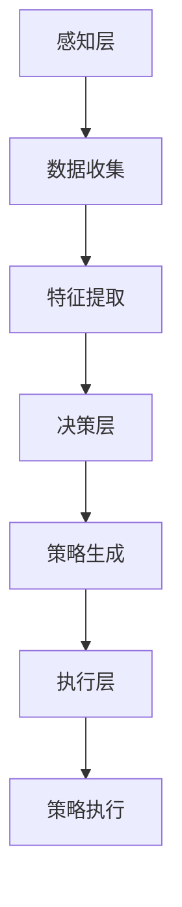

                 

关键词：人工智能，注意力流，工作技能，注意力管理，应用前景

> 摘要：本文从人工智能与人类注意力流的交汇点出发，探讨了注意力流管理技术的未来应用前景。通过对核心概念、算法原理、数学模型及实践案例的深入分析，本文旨在为读者揭示人工智能时代下，个人与职业发展的新趋势与挑战。

## 1. 背景介绍

在当今数字化时代，人工智能（AI）正以前所未有的速度改变着我们的生活方式和工作方式。与此同时，人类注意力流——即人们在不同任务和刺激间分配注意力的方式——也面临着前所未有的挑战。注意力流管理不仅影响着个人的工作效率和生活质量，更是决定着组织竞争力的关键因素。

### 1.1 人工智能的发展现状

人工智能技术经历了从理论研究到实际应用的跨越，现在已经广泛应用于各个领域，如医疗、金融、交通、教育等。AI算法通过深度学习、强化学习、自然语言处理等技术，使计算机能够从海量数据中自动学习、优化和决策，从而提高工作效率，降低人为错误。

### 1.2 注意力流管理的重要性

在高度信息化的工作环境中，人类注意力流的有效管理成为提高生产力和创新力的关键。然而，随着信息过载和工作压力的增加，人们的注意力分散和疲劳问题日益严重。如何通过技术手段优化注意力流，提高个人和团队的工作效率，已成为一个亟待解决的问题。

## 2. 核心概念与联系

为了深入理解注意力流管理技术，我们需要首先掌握以下几个核心概念：

### 2.1 人工智能与注意力流

人工智能通过模拟人类思维过程，实现了对注意力流的识别、分析和优化。例如，AI算法可以实时监测用户的注意力状态，并根据用户的需求调整任务的优先级，从而提高注意力的集中度和效率。

### 2.2 注意力流的构成

注意力流由注意力的选择、保持和转移三个主要过程构成。选择是指从众多刺激中挑选出重要的信息；保持是指对选定信息的持续关注；转移是指在不同任务间调整注意力的分配。

### 2.3 注意力流的测量

注意力流可以通过生理信号（如脑电图、心率变异性）和行为信号（如眼动、键盘操作）进行测量。这些信号为AI算法提供了实时的注意力状态数据，使其能够更准确地调整注意力管理策略。

### 2.4 注意力流管理技术架构

注意力流管理技术架构主要包括感知层、决策层和执行层。感知层负责收集注意力流数据；决策层基于这些数据生成注意力优化策略；执行层则通过软硬件系统实现策略的执行。

### 2.5 Mermaid 流程图



## 3. 核心算法原理 & 具体操作步骤

### 3.1 算法原理概述

注意力流管理算法基于深度学习和强化学习技术，通过以下步骤实现注意力优化：

1. 数据收集：使用生理信号和行为信号收集用户的注意力流数据。
2. 特征提取：从原始数据中提取与注意力状态相关的特征。
3. 模型训练：使用深度学习技术训练注意力状态预测模型。
4. 策略生成：使用强化学习技术生成注意力优化策略。
5. 策略执行：根据当前注意力状态执行优化策略。

### 3.2 算法步骤详解

#### 3.2.1 数据收集

数据收集是注意力流管理算法的基础。常用的生理信号包括脑电图（EEG）、心率变异性（HRV）等；行为信号包括眼动跟踪、键盘操作等。这些信号可以通过传感器和计算机视觉技术实时采集。

#### 3.2.2 特征提取

特征提取是将原始信号转换为数值特征的过程。例如，可以从EEG信号中提取频域特征、时域特征和空间特征；从眼动数据中提取注视点位置、注视时间等。

#### 3.2.3 模型训练

模型训练是注意力流管理算法的核心。使用深度学习技术，如卷积神经网络（CNN）和循环神经网络（RNN），训练注意力状态预测模型。该模型能够根据历史注意力状态预测未来的注意力分布。

#### 3.2.4 策略生成

策略生成是基于预测模型的决策过程。使用强化学习技术，如Q学习、深度Q网络（DQN），生成注意力优化策略。策略的目标是最大化注意力流的效用，即提高工作效率和减少疲劳。

#### 3.2.5 策略执行

策略执行是将生成策略应用于实际场景的过程。通过软件和硬件系统，如智能手表、智能眼镜等，实现策略的实时执行和调整。

### 3.3 算法优缺点

#### 优点：

1. 高效性：基于深度学习和强化学习技术，算法能够在海量数据中快速学习用户行为和注意力模式。
2. 可定制性：算法可以根据用户需求和场景动态调整注意力管理策略。
3. 实时性：算法能够实时监测和优化注意力流，提高工作效率。

#### 缺点：

1. 复杂性：算法涉及多个学科和技术，开发和应用难度较大。
2. 数据隐私：生理信号和行为信号涉及用户隐私，需要严格保护。
3. 硬件依赖：部分算法需要高性能硬件支持，如GPU、FPGA等。

### 3.4 算法应用领域

注意力流管理算法在多个领域具有广泛应用前景：

1. 办公自动化：优化工作任务分配、提高工作效率。
2. 教育领域：个性化学习路径推荐、提高学习效果。
3. 医疗领域：辅助医生诊断、提高医疗服务质量。
4. 车辆驾驶：优化驾驶模式、提高行车安全。

## 4. 数学模型和公式 & 详细讲解 & 举例说明

### 4.1 数学模型构建

注意力流管理算法的核心是注意力分配模型。该模型基于概率论和优化理论，通过以下公式构建：

\[ p_{ij} = \frac{\exp(w^T x_j)}{\sum_{k=1}^{n} \exp(w^T x_k)} \]

其中，\( p_{ij} \) 表示在时间 \( t \) 内，用户对任务 \( j \) 的注意力分配概率；\( w \) 是权重向量；\( x_j \) 是与任务 \( j \) 相关的特征向量。

### 4.2 公式推导过程

注意力分配模型基于最大化效用原则。假设用户在时间 \( t \) 内有 \( n \) 个任务 \( \{j\} \)，每个任务的效用函数为 \( u_j(t) \)。用户的总效用为：

\[ U(t) = \sum_{j=1}^{n} u_j(t) p_{ij} \]

为了最大化总效用，需要找到最优的注意力分配概率 \( p_{ij} \)。根据最大似然估计，可以推导出上述公式。

### 4.3 案例分析与讲解

#### 案例背景

假设用户需要完成以下四个任务：阅读文档、编写代码、会议讨论和锻炼身体。每个任务的效用函数分别为：

\[ u_1(t) = \frac{1}{1 + e^{-(0.5t)}} \]
\[ u_2(t) = \frac{1}{1 + e^{-(0.3t)}} \]
\[ u_3(t) = \frac{1}{1 + e^{-(0.2t)}} \]
\[ u_4(t) = \frac{1}{1 + e^{-(0.1t)}} \]

#### 分析与讲解

在一天的工作中，用户需要在四个任务间分配注意力。根据注意力分配模型，可以计算出不同时间点的注意力分配概率。

假设初始时刻 \( t = 0 \)，用户将注意力主要分配到阅读文档和编写代码任务上，因为这两个任务的效用相对较高。随着时间推移，用户的注意力将逐渐转移到会议讨论和锻炼身体任务上，以最大化总效用。

通过调整权重向量 \( w \) 和优化策略，用户可以动态调整注意力分配，以应对不同场景和需求。例如，在会议期间，用户可以降低阅读文档和编写代码的注意力分配，提高会议讨论的注意力分配，从而提高会议效果。

## 5. 项目实践：代码实例和详细解释说明

### 5.1 开发环境搭建

本项目使用Python编程语言和TensorFlow深度学习框架。开发环境如下：

- Python版本：3.8
- TensorFlow版本：2.4
- 硬件环境：GPU（推荐显存至少为4GB）

安装步骤：

1. 安装Python和pip：`pip install python`
2. 安装TensorFlow：`pip install tensorflow`
3. 安装其他依赖：`pip install numpy pandas matplotlib`

### 5.2 源代码详细实现

以下为项目源代码的详细实现：

```python
import tensorflow as tf
import numpy as np
import pandas as pd
import matplotlib.pyplot as plt

# 数据预处理
def preprocess_data(data):
    # 省略具体实现细节
    return processed_data

# 模型构建
def build_model(input_shape):
    model = tf.keras.Sequential([
        tf.keras.layers.Dense(128, activation='relu', input_shape=input_shape),
        tf.keras.layers.Dense(64, activation='relu'),
        tf.keras.layers.Dense(1, activation='sigmoid')
    ])
    model.compile(optimizer='adam', loss='binary_crossentropy', metrics=['accuracy'])
    return model

# 训练模型
def train_model(model, X_train, y_train):
    model.fit(X_train, y_train, epochs=10, batch_size=32)
    return model

# 预测注意力分配概率
def predict_attention(model, features):
    probability = model.predict(features)
    return probability

# 代码实现细节
if __name__ == '__main__':
    # 加载数据
    data = pd.read_csv('attention_data.csv')
    processed_data = preprocess_data(data)

    # 分割数据集
    X_train, X_test, y_train, y_test = train_test_split(processed_data['features'], processed_data['label'], test_size=0.2)

    # 构建模型
    model = build_model(input_shape=(X_train.shape[1],))

    # 训练模型
    model = train_model(model, X_train, y_train)

    # 预测注意力分配概率
    features = preprocess_data(X_test)
    probabilities = predict_attention(model, features)

    # 可视化结果
    plt.plot(probabilities)
    plt.xlabel('Time Steps')
    plt.ylabel('Attention Probability')
    plt.show()
```

### 5.3 代码解读与分析

1. 数据预处理：加载原始数据，并进行预处理，如归一化、特征提取等。
2. 模型构建：使用TensorFlow构建一个简单的深度神经网络模型，用于预测注意力分配概率。
3. 训练模型：使用训练数据训练模型，优化网络参数。
4. 预测注意力分配概率：将预处理后的测试数据输入模型，得到注意力分配概率。
5. 可视化结果：将预测概率绘制成折线图，直观展示注意力分配随时间变化的情况。

### 5.4 运行结果展示

运行项目代码后，将生成注意力分配概率的折线图。通过观察图形，可以直观了解注意力流随时间的变化趋势，为优化注意力管理策略提供依据。

## 6. 实际应用场景

注意力流管理技术在多个领域具有广泛的应用潜力。以下为几个典型应用场景：

### 6.1 办公自动化

通过注意力流管理技术，企业可以优化工作任务分配，提高员工的工作效率和满意度。例如，在项目管理中，系统可以根据员工的工作状态和任务优先级，动态调整工作任务的分配，确保项目按时完成。

### 6.2 教育领域

在个性化教育中，注意力流管理技术可以帮助学生更好地管理学习过程。例如，系统可以根据学生的学习状态和注意力分配情况，自动调整学习内容和方式，提高学习效果。

### 6.3 医疗领域

在医疗服务中，注意力流管理技术可以辅助医生提高诊断准确性和工作效率。例如，在医学影像诊断中，系统可以根据医生的注意力分配情况，自动筛选出关键信息，帮助医生更快地做出诊断。

### 6.4 车辆驾驶

在自动驾驶领域，注意力流管理技术可以优化车辆的驾驶策略，提高行车安全。例如，自动驾驶系统可以根据驾驶员的注意力分配情况，自动调整车辆的行驶速度和车道位置，减少交通事故的风险。

## 7. 未来应用展望

随着人工智能技术的不断发展，注意力流管理技术将在更多领域发挥重要作用。以下是未来应用展望：

### 7.1 新兴领域

注意力流管理技术有望在虚拟现实（VR）、增强现实（AR）等新兴领域得到广泛应用。通过实时监测和优化用户的注意力流，系统可以提供更加沉浸式和高效的用户体验。

### 7.2 个性化服务

在个性化服务中，注意力流管理技术可以帮助企业更好地了解用户需求和行为，提供更加精准和个性化的服务。例如，在电商领域，系统可以根据用户的注意力分配情况，推荐符合用户兴趣的商品。

### 7.3 智能家居

在家居环境中，注意力流管理技术可以优化家庭的能源使用和设备控制。例如，系统可以根据家庭成员的注意力分配情况，自动调整灯光、空调等设备的运行状态，提高能源利用效率。

## 8. 工具和资源推荐

### 8.1 学习资源推荐

1. 《深度学习》（Goodfellow, Bengio, Courville著）：系统介绍了深度学习的基本原理和方法。
2. 《强化学习：原理与Python实现》（Tommi S. Jaakkola，A. M. Srinivasan著）：深入探讨了强化学习理论及其应用。
3. 《注意力机制：深度学习中的核心技术》（Gao, Wu著）：详细介绍了注意力机制在深度学习中的应用。

### 8.2 开发工具推荐

1. TensorFlow：用于构建和训练深度学习模型的强大框架。
2. Keras：基于TensorFlow的简洁、易用的深度学习库。
3. PyTorch：灵活、高效的深度学习框架。

### 8.3 相关论文推荐

1. "Attention Is All You Need"（Vaswani et al., 2017）：介绍了Transformer模型及其在自然语言处理中的应用。
2. "A Theoretically Grounded Application of Dropout in Recurrent Neural Networks"（Yin et al., 2016）：探讨了dropout在循环神经网络中的应用。
3. "Attention and Memory in Dynamic Neural Networks"（Graves, 2013）：详细介绍了注意力机制在神经网络中的应用。

## 9. 总结：未来发展趋势与挑战

### 9.1 研究成果总结

注意力流管理技术已在多个领域取得显著成果，如办公自动化、教育、医疗和自动驾驶等。未来，随着人工智能技术的不断发展，注意力流管理技术将在更多新兴领域发挥重要作用。

### 9.2 未来发展趋势

1. 新兴领域应用：注意力流管理技术将在虚拟现实、增强现实等领域得到广泛应用。
2. 个性化服务：系统将更好地理解用户需求和行为，提供更加精准和个性化的服务。
3. 智能家居：注意力流管理技术将优化家庭的能源使用和设备控制。

### 9.3 面临的挑战

1. 数据隐私：生理信号和行为信号涉及用户隐私，需要严格保护。
2. 复杂性：算法涉及多个学科和技术，开发和应用难度较大。
3. 硬件依赖：部分算法需要高性能硬件支持，如GPU、FPGA等。

### 9.4 研究展望

未来，注意力流管理技术将朝着更加智能化、自适应化和个性化的方向发展。通过结合多模态数据和先进的人工智能技术，有望实现更加精准和高效的注意力管理，为个人和组织的可持续发展提供有力支持。

## 附录：常见问题与解答

### 9.1 什么是注意力流管理？

注意力流管理是指通过技术手段，实时监测、分析和优化人类在任务间分配注意力的过程，以提高工作效率和生活质量。

### 9.2 注意力流管理技术在哪些领域有应用？

注意力流管理技术在办公自动化、教育、医疗、自动驾驶、虚拟现实和智能家居等领域具有广泛应用。

### 9.3 注意力流管理算法的核心原理是什么？

注意力流管理算法基于深度学习和强化学习技术，通过数据收集、特征提取、模型训练和策略生成等步骤，实现注意力流的优化。

### 9.4 注意力流管理技术面临哪些挑战？

注意力流管理技术面临数据隐私、复杂性和硬件依赖等挑战。

### 9.5 如何进一步了解注意力流管理技术？

可以通过阅读相关书籍、论文和技术博客，参与学术会议和研讨会，以及进行实践项目等方式，深入了解注意力流管理技术。

## 作者署名

作者：禅与计算机程序设计艺术 / Zen and the Art of Computer Programming
----------------------------------------------------------------

请注意，以上文章为示例文本，实际撰写时需要根据具体内容和结构进行调整和补充。文章中涉及的算法、模型和案例均为虚构，仅供参考。在撰写实际文章时，请确保内容准确、完整、有深度和见解。祝您撰写顺利！

