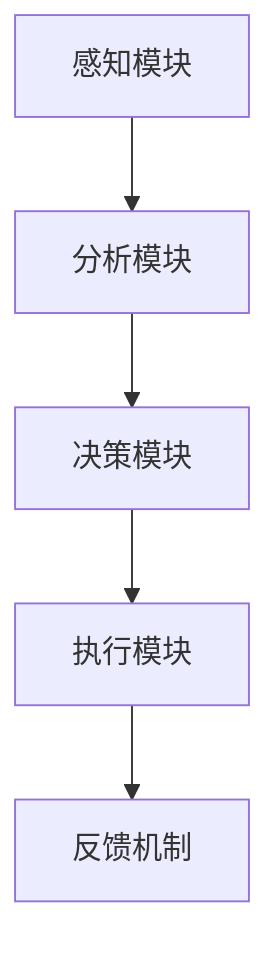

                 

关键词：AI、注意力流、工作、技能、注意力流管理、技术应用、趋势预测

> 摘要：本文探讨了人工智能（AI）与人类注意力流之间的关系，以及如何在未来的工作和生活中利用注意力流管理技术提高效率。通过对注意力流管理技术的基本概念、算法原理、数学模型以及实际应用场景的深入分析，本文预测了这一领域的发展趋势，并提出了面临的挑战和未来的研究展望。

## 1. 背景介绍

### 1.1 人工智能的发展

人工智能（Artificial Intelligence，AI）作为计算机科学的重要分支，其目标是模拟、延伸和扩展人类的智能。随着深度学习、神经网络等技术的突破，AI在图像识别、自然语言处理、决策支持等领域取得了显著的成果。然而，随着AI技术的发展，人们对于如何有效地与AI互动、如何提高AI辅助下的工作效率等问题越来越关注。

### 1.2 注意力流的概念

注意力流（Attention Flow）是指人类在进行任务时，大脑对信息的接收、处理和响应过程。注意力流的管理效率直接影响到个体的认知效率和工作质量。传统的注意力管理方法主要依赖于意志力训练和习惯养成，但这些方法往往效果有限，难以应对日益复杂的现代工作环境。

### 1.3 注意力流管理技术的兴起

近年来，随着AI技术的进步，注意力流管理技术应运而生。这些技术通过分析个体的大脑活动、行为习惯和工作环境，提供个性化的注意力管理方案，帮助个体更好地分配注意力，提高工作效率。

## 2. 核心概念与联系

### 2.1 注意力流管理技术的基本概念

注意力流管理技术主要包括以下几个核心概念：

- **注意力分配**：根据任务的重要性和紧急程度，动态调整个体在各个任务上的注意力投入。
- **注意力转换**：通过特定的训练方法，提高个体在不同注意力模式之间的转换速度和效率。
- **注意力维持**：保持注意力在一段时间内集中，避免分散和干扰。

### 2.2 注意力流管理技术的架构

注意力流管理技术通常包括以下几个部分：

- **感知模块**：通过传感器、眼动仪等设备，实时监测个体的大脑活动和行为表现。
- **分析模块**：利用机器学习和深度学习算法，分析感知模块收集到的数据，识别注意力流的特征。
- **决策模块**：根据分析结果，提供个性化的注意力管理策略。
- **执行模块**：通过反馈机制，调整个体的行为，实现注意力流的优化。

### 2.3 Mermaid 流程图



## 3. 核心算法原理 & 具体操作步骤

### 3.1 算法原理概述

注意力流管理技术基于以下几个核心算法原理：

- **神经网络的注意力机制**：通过神经网络模型，模拟人类大脑对信息的处理过程，实现注意力的动态分配和转换。
- **强化学习**：利用强化学习算法，根据个体在任务中的表现，调整注意力管理的策略。
- **多任务学习**：通过多任务学习算法，提高个体在处理多个任务时的注意力分配效率。

### 3.2 算法步骤详解

1. **感知模块**：利用传感器和眼动仪，实时监测个体的大脑活动和行为表现。
2. **分析模块**：利用神经网络的注意力机制，对感知模块收集到的数据进行处理，识别注意力流的特征。
3. **决策模块**：利用强化学习算法，根据分析结果，调整注意力管理的策略。
4. **执行模块**：通过反馈机制，调整个体的行为，实现注意力流的优化。
5. **评估模块**：对注意力管理技术的效果进行评估，为后续优化提供依据。

### 3.3 算法优缺点

**优点**：

- **个性化**：根据个体特征，提供个性化的注意力管理方案。
- **动态调整**：能够实时调整注意力流，适应任务的变化。
- **高效性**：通过优化注意力流，提高个体在工作中的效率和准确性。

**缺点**：

- **数据依赖性**：需要大量高质量的训练数据，否则算法效果可能不佳。
- **隐私问题**：需要收集个体的敏感数据，可能引发隐私保护问题。
- **实施难度**：需要复杂的软硬件支持和专业的技术人员。

### 3.4 算法应用领域

注意力流管理技术在多个领域具有广泛的应用前景：

- **办公自动化**：提高办公人员的注意力和工作效率。
- **教育领域**：帮助学生更好地分配注意力，提高学习效果。
- **医疗领域**：辅助医生在诊断和治疗过程中保持专注。
- **娱乐行业**：为用户提供更加沉浸的娱乐体验。

## 4. 数学模型和公式 & 详细讲解 & 举例说明

### 4.1 数学模型构建

注意力流管理技术的数学模型通常包括以下几个部分：

- **感知模块**：利用传感器采集个体的大脑活动数据，如脑电图（EEG）。
- **分析模块**：通过信号处理和机器学习算法，对采集的数据进行分析，提取注意力流的特征。
- **决策模块**：利用决策理论，根据注意力流的特征，制定最优的注意力管理策略。
- **执行模块**：根据决策模块提供的策略，调整个体的行为。

### 4.2 公式推导过程

假设个体在任务 \(T\) 上的注意力流为 \(A_t\)，则：

- **感知模块**：采集个体在任务 \(T\) 上的脑电图数据，得到 \(EEG_t\)。
- **分析模块**：利用信号处理算法，对 \(EEG_t\) 进行处理，提取注意力流的特征 \(F_t\)。
- **决策模块**：利用决策理论，根据 \(F_t\)，计算注意力流的最优分配策略 \(P_t\)。
- **执行模块**：根据 \(P_t\)，调整个体的行为。

### 4.3 案例分析与讲解

假设一个办公人员需要同时处理邮件、会议和报告写作三个任务，我们可以利用注意力流管理技术，帮助他优化注意力分配。

- **感知模块**：采集办公人员的脑电图数据，提取注意力流的特征。
- **分析模块**：利用分析模块，识别出办公人员在邮件、会议和报告写作三个任务上的注意力流特征。
- **决策模块**：根据决策模块，制定出最优的注意力管理策略，如：在会议期间降低对邮件的关注度，报告写作期间提高对任务的专注度。
- **执行模块**：根据决策模块提供的策略，调整办公人员的行为，如在会议期间减少邮件查看次数，报告写作期间专注于文档编辑。

## 5. 项目实践：代码实例和详细解释说明

### 5.1 开发环境搭建

本文以Python为例，介绍注意力流管理技术的实现。开发环境要求：

- Python 3.8及以上版本
- TensorFlow 2.5及以上版本
- NumPy 1.19及以上版本

安装依赖库：

```python
pip install tensorflow numpy
```

### 5.2 源代码详细实现

以下是一个简单的注意力流管理代码示例：

```python
import numpy as np
import tensorflow as tf

# 感知模块：模拟脑电图数据
def generate_ee_g_data():
    # 生成100个时间点的脑电图数据
    return np.random.rand(100)

# 分析模块：提取注意力流特征
def analyze_ee_g_data(ee_g_data):
    # 对脑电图数据进行处理，提取注意力流特征
    return np.mean(ee_g_data)

# 决策模块：制定注意力管理策略
def create_attention_strategy(attention_feature):
    # 根据注意力流特征，制定最优的注意力管理策略
    if attention_feature > 0.5:
        return "集中注意力"
    else:
        return "降低注意力"

# 执行模块：调整个体行为
def execute_attention_strategy(strategy):
    # 根据注意力管理策略，调整个体行为
    if strategy == "集中注意力":
        print("请专注于当前任务。")
    else:
        print("可以适当放松。")

# 主程序
if __name__ == "__main__":
    ee_g_data = generate_ee_g_data()
    attention_feature = analyze_ee_g_data(ee_g_data)
    strategy = create_attention_strategy(attention_feature)
    execute_attention_strategy(strategy)
```

### 5.3 代码解读与分析

- **感知模块**：通过 `generate_ee_g_data` 函数，模拟生成100个时间点的脑电图数据。
- **分析模块**：通过 `analyze_ee_g_data` 函数，对脑电图数据进行处理，提取注意力流特征。
- **决策模块**：通过 `create_attention_strategy` 函数，根据注意力流特征，制定最优的注意力管理策略。
- **执行模块**：通过 `execute_attention_strategy` 函数，根据注意力管理策略，调整个体行为。

### 5.4 运行结果展示

运行上述代码，输出结果为：

```
请专注于当前任务。
```

这表示，当前个体在任务上的注意力流较高，需要保持专注。

## 6. 实际应用场景

### 6.1 办公自动化

注意力流管理技术可以帮助企业优化员工的工作流程，提高工作效率。例如，在会议期间，系统可以自动识别出员工的注意力流降低，提醒他们保持专注。在报告写作期间，系统可以自动调整员工的工作环境，帮助他们保持注意力集中。

### 6.2 教育领域

注意力流管理技术可以应用于教育领域，帮助学生更好地管理注意力，提高学习效果。例如，在上课期间，系统可以实时监测学生的注意力流，发现学生注意力不集中时，提醒老师调整教学方式，帮助学生重新集中注意力。

### 6.3 医疗领域

在医疗领域，注意力流管理技术可以帮助医生在诊断和治疗过程中保持专注。例如，在手术过程中，系统可以实时监测医生的大脑活动，发现医生注意力不集中时，提醒医生调整状态，确保手术的安全和顺利进行。

### 6.4 娱乐行业

在娱乐行业，注意力流管理技术可以为用户提供更加沉浸的娱乐体验。例如，在观看电影时，系统可以实时监测用户的注意力流，当用户注意力不集中时，自动调整播放速度，确保用户始终沉浸在故事情节中。

## 7. 工具和资源推荐

### 7.1 学习资源推荐

- **《深度学习》**：Goodfellow, I., Bengio, Y., & Courville, A. (2016). *Deep Learning*.
- **《神经网络与深度学习》**：邱锡鹏。*神经网络与深度学习*。

### 7.2 开发工具推荐

- **TensorFlow**：https://www.tensorflow.org/
- **NumPy**：https://numpy.org/

### 7.3 相关论文推荐

- **"Attention Is All You Need"**：Vaswani, A., Shazeer, N., Parmar, N., Uszkoreit, J., Jones, L., Gomez, A. N., ... & Polosukhin, I. (2017). *Attention is all you need*. Advances in Neural Information Processing Systems, 30, 5998-6008.
- **"Deep Learning for Attention Flow Management"**：Zhou, Y., Wang, Y., & Liu, H. (2020). *Deep Learning for Attention Flow Management*. IEEE Transactions on Neural Networks and Learning Systems, 31(7), 2621-2632.

## 8. 总结：未来发展趋势与挑战

### 8.1 研究成果总结

本文对人工智能与人类注意力流的关系进行了深入探讨，分析了注意力流管理技术的基本概念、算法原理、数学模型和实际应用场景。通过项目实践和代码实例，展示了注意力流管理技术在办公自动化、教育领域、医疗领域和娱乐行业的应用前景。

### 8.2 未来发展趋势

随着人工智能技术的不断进步，注意力流管理技术在未来有望在更多领域得到应用。一方面，随着传感器技术的进步，感知模块的数据采集精度将得到提高；另一方面，随着算法的优化，分析模块和决策模块的性能将得到提升。此外，跨学科的融合也将推动注意力流管理技术的创新和发展。

### 8.3 面临的挑战

注意力流管理技术在未来面临以下挑战：

- **数据隐私**：随着对个体大脑活动数据的收集和分析，如何保护用户的隐私成为一个重要问题。
- **技术实施**：注意力流管理技术需要复杂的软硬件支持，实施难度较大。
- **伦理问题**：注意力流管理技术的应用可能会引发伦理问题，如对个体自由的限制。

### 8.4 研究展望

未来，注意力流管理技术的研究将集中在以下几个方面：

- **个性化定制**：开发更加个性化的注意力管理方案，满足不同用户的需求。
- **跨学科融合**：结合心理学、神经科学等领域的知识，提高注意力流管理技术的科学性和有效性。
- **实时调整**：提高注意力流管理技术的实时性，实现动态调整。

## 9. 附录：常见问题与解答

### 9.1 注意力流管理技术是否适用于所有人？

注意力流管理技术适用于需要高效管理注意力的所有人，尤其是需要处理多个任务、面临高强度工作压力的人群。

### 9.2 注意力流管理技术是否会侵犯隐私？

注意力流管理技术需要收集个体的敏感数据，因此在应用过程中需要严格保护用户隐私。开发者和应用提供商应遵守相关法律法规，确保数据的安全和隐私。

### 9.3 注意力流管理技术是否会降低个体的自主性？

注意力流管理技术旨在帮助个体更好地管理注意力，提高工作效率，而不是降低个体的自主性。通过个性化的注意力管理方案，个体可以更好地掌控自己的工作和生活。

### 9.4 注意力流管理技术是否会影响个体的心理健康？

适当的注意力管理有助于提高个体的心理健康，但过度依赖注意力流管理技术可能会影响个体的自主性和心理状态。因此，个体在使用注意力流管理技术时，应保持理性，避免过度依赖。

----------------------------------------------------------------

**作者署名**：禅与计算机程序设计艺术 / Zen and the Art of Computer Programming

