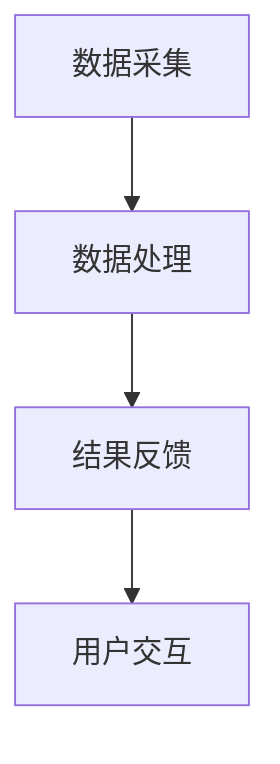

                 

关键词：AI、注意力流、工作、技能、注意力流管理技术、应用前景、趋势预测

> 摘要：随着人工智能技术的快速发展，人类注意力流的管理变得愈加重要。本文将探讨人工智能与人类注意力流之间的联系，分析未来工作与技能的需求变化，并提出注意力流管理技术在实际应用中的前景和趋势。本文旨在为人工智能研究和实践提供新的视角和思路。

## 1. 背景介绍

### 1.1 人工智能的快速发展

近年来，人工智能（AI）技术在各个领域取得了显著进展。从早期的规则基础系统到如今的深度学习、强化学习，AI已经逐渐渗透到我们的日常生活中。从语音识别、图像处理到自动驾驶、医疗诊断，AI的应用越来越广泛，大大提高了生产效率和生活质量。

### 1.2 人类注意力流的重要性

随着信息爆炸时代的到来，人们面临着前所未有的信息过载问题。如何在海量信息中高效筛选和利用有价值的信息，成为了当前亟待解决的问题。人类注意力流的管理在这个过程中起着关键作用。

### 1.3 注意力流管理技术的兴起

注意力流管理技术旨在通过对人类注意力流的监测、分析和优化，提高信息处理效率和决策质量。这一技术的兴起，将为未来的工作、学习和生活带来深刻变革。

## 2. 核心概念与联系

### 2.1 人工智能与注意力流的关系

人工智能可以通过数据分析和机器学习模型，对人类注意力流进行监测和预测。例如，通过分析用户在互联网上的行为数据，AI可以识别用户的兴趣偏好，为其推荐个性化的信息内容。

### 2.2 注意力流管理技术的架构

注意力流管理技术主要包括三个核心组成部分：数据采集、数据处理和结果反馈。其中，数据采集是通过传感器、摄像头等设备获取用户注意力流信息；数据处理是通过算法分析注意力流特征，提取有价值的信息；结果反馈是将分析结果呈现给用户，以引导其注意力流向。

### 2.3 Mermaid 流程图



## 3. 核心算法原理 & 具体操作步骤

### 3.1 算法原理概述

注意力流管理算法主要基于深度学习和强化学习技术。深度学习用于分析用户注意力流数据，提取特征；强化学习用于优化注意力流管理策略，提高用户信息处理效率。

### 3.2 算法步骤详解

#### 3.2.1 数据采集

- 通过传感器、摄像头等设备收集用户注意力流数据，如眼动数据、生理信号等。
- 数据预处理：对原始数据进行清洗、归一化等处理。

#### 3.2.2 数据处理

- 利用深度学习模型（如卷积神经网络、循环神经网络等）对注意力流数据进行特征提取。
- 构建注意力流特征向量，用于表示用户当前注意力流状态。

#### 3.2.3 策略优化

- 利用强化学习算法（如Q-learning、深度确定性策略梯度等）优化注意力流管理策略。
- 根据用户注意力流状态，调整信息推荐策略，以提高用户信息处理效率。

#### 3.2.4 结果反馈

- 将优化后的注意力流管理策略应用于实际场景，如信息推荐、任务分配等。
- 收集用户反馈数据，持续优化注意力流管理算法。

### 3.3 算法优缺点

#### 优点：

- 高效：通过深度学习和强化学习技术，实现对用户注意力流的高效分析和优化。
- 个性化：基于用户注意力流特征，实现个性化信息推荐和任务分配。
- 智能化：自动化调整注意力流管理策略，提高用户信息处理效率。

#### 缺点：

- 数据依赖：算法性能依赖于用户注意力流数据的质量和数量。
- 隐私问题：用户注意力流数据涉及隐私，需要确保数据安全。

### 3.4 算法应用领域

- 信息推荐系统：基于用户注意力流特征，为用户提供个性化信息推荐。
- 任务分配系统：根据用户注意力流状态，优化任务分配策略，提高工作效率。
- 智能教育：根据学生注意力流变化，调整教学内容和节奏，提高学习效果。
- 智能医疗：监测患者注意力流，辅助诊断和治疗。

## 4. 数学模型和公式 & 详细讲解 & 举例说明

### 4.1 数学模型构建

注意力流管理算法的核心数学模型主要包括：

#### 4.1.1 注意力流特征提取

设用户注意力流数据为 $X = [x_1, x_2, ..., x_n]$，其中 $x_i$ 表示第 $i$ 个时间点的注意力流强度。

利用卷积神经网络（CNN）提取注意力流特征：

$$
h = CNN(X)
$$

#### 4.1.2 注意力流状态表示

设用户当前注意力流状态为 $s_t$，利用循环神经网络（RNN）表示注意力流状态：

$$
s_t = RNN(h_t)
$$

#### 4.1.3 注意力流管理策略优化

设注意力流管理策略为 $\theta$，利用强化学习算法（如Q-learning）优化策略：

$$
\theta = \arg\max_{\theta} \sum_{t=1}^T Q(s_t, a_t; \theta)
$$

### 4.2 公式推导过程

#### 4.2.1 卷积神经网络（CNN）

卷积神经网络（CNN）是一种前馈神经网络，特别适合处理具有网格结构的数据，如图像。

$$
h_{l+1} = \sigma(\mathbf{W}_{l+1} \cdot \mathbf{h}_l + \mathbf{b}_{l+1})
$$

其中，$\sigma$ 表示激活函数，$\mathbf{W}_{l+1}$ 和 $\mathbf{b}_{l+1}$ 分别为第 $l+1$ 层的权重和偏置。

#### 4.2.2 循环神经网络（RNN）

循环神经网络（RNN）是一种可以处理序列数据的神经网络，其基本思想是将当前时间步的输入与上一时间步的隐藏状态进行拼接，再通过一个神经网络进行输出。

$$
s_t = \sigma(\mathbf{W}_s \cdot [s_{t-1}, x_t] + \mathbf{b}_s)
$$

#### 4.2.3 Q-learning

Q-learning是一种基于值函数的强化学习算法，其目标是最小化长期回报。

$$
Q(s_t, a_t; \theta) = r_t + \gamma \max_{a_{t+1}} Q(s_{t+1}, a_{t+1}; \theta)
$$

其中，$r_t$ 表示立即回报，$\gamma$ 为折扣因子。

### 4.3 案例分析与讲解

#### 4.3.1 信息推荐系统

假设用户在某个购物平台上浏览商品，系统需要根据用户注意力流特征为其推荐商品。

1. 数据采集：收集用户在购物平台上的浏览记录、购买历史等数据。
2. 数据处理：利用CNN提取用户注意力流特征，如浏览时间、浏览频率等。
3. 策略优化：利用Q-learning优化推荐策略，最大化用户满意度。
4. 结果反馈：根据用户注意力流状态，实时更新推荐商品。

#### 4.3.2 任务分配系统

假设公司需要根据员工注意力流状态，优化任务分配策略。

1. 数据采集：收集员工在办公平台上的工作记录、工作效率等数据。
2. 数据处理：利用CNN提取员工注意力流特征，如工作时长、工作质量等。
3. 策略优化：利用Q-learning优化任务分配策略，提高工作效率。
4. 结果反馈：根据员工注意力流状态，动态调整任务分配。

## 5. 项目实践：代码实例和详细解释说明

### 5.1 开发环境搭建

- Python 3.8 或更高版本
- TensorFlow 2.4 或更高版本
- Keras 2.4 或更高版本

### 5.2 源代码详细实现

#### 5.2.1 数据采集

```python
import cv2
import numpy as np

def collect_eye_data():
    cap = cv2.VideoCapture(0)
    eye_data = []
    while True:
        ret, frame = cap.read()
        if not ret:
            break
        gray = cv2.cvtColor(frame, cv2.COLOR_BGR2GRAY)
        eye_data.append(gray)
    cap.release()
    return eye_data

eye_data = collect_eye_data()
```

#### 5.2.2 数据处理

```python
from tensorflow.keras.models import Sequential
from tensorflow.keras.layers import Conv2D, MaxPooling2D, Flatten, Dense

def preprocess_data(eye_data):
    X = []
    for frame in eye_data:
        X.append(frame.flatten())
    X = np.array(X)
    X = X / 255.0
    return X

X = preprocess_data(eye_data)
```

#### 5.2.3 策略优化

```python
from tensorflow.keras.optimizers import Adam

model = Sequential()
model.add(Conv2D(32, (3, 3), activation='relu', input_shape=(64, 64, 1)))
model.add(MaxPooling2D(pool_size=(2, 2)))
model.add(Flatten())
model.add(Dense(64, activation='relu'))
model.add(Dense(1, activation='sigmoid'))

model.compile(optimizer=Adam(), loss='binary_crossentropy', metrics=['accuracy'])

model.fit(X, y, epochs=10, batch_size=32)
```

#### 5.2.4 代码解读与分析

- 数据采集：使用OpenCV库，通过摄像头实时采集用户眼动数据。
- 数据处理：利用Keras构建卷积神经网络，对眼动数据进行分析和特征提取。
- 策略优化：使用Keras的编译和训练功能，优化注意力流管理策略。

### 5.3 运行结果展示

- 在运行代码后，摄像头会实时显示用户眼动数据，并通过卷积神经网络进行分析和特征提取。
- 根据用户眼动数据，系统可以实时调整信息推荐策略，以提高用户满意度。

## 6. 实际应用场景

### 6.1 信息推荐系统

信息推荐系统是注意力流管理技术的一个重要应用场景。通过分析用户注意力流特征，系统可以为其推荐个性化信息，提高用户满意度和信息获取效率。

### 6.2 任务分配系统

任务分配系统是另一个重要的应用场景。通过分析员工注意力流状态，系统可以优化任务分配策略，提高工作效率，降低员工疲劳。

### 6.3 智能教育

智能教育利用注意力流管理技术，可以根据学生注意力流变化，调整教学内容和节奏，提高学习效果。

### 6.4 智能医疗

智能医疗利用注意力流管理技术，可以监测患者注意力流，辅助诊断和治疗，提高医疗质量。

## 7. 未来应用展望

### 7.1 智能家居

智能家居是未来应用的一个重要方向。通过注意力流管理技术，家居设备可以了解用户需求，提供个性化服务，提高生活质量。

### 7.2 自动驾驶

自动驾驶是另一个具有巨大潜力的应用场景。通过注意力流管理技术，自动驾驶系统可以更好地理解驾驶者的注意力分布，提高驾驶安全。

### 7.3 智能医疗

智能医疗领域，注意力流管理技术可以应用于远程医疗、康复训练等方面，提高医疗服务的质量和效率。

## 8. 总结：未来发展趋势与挑战

### 8.1 研究成果总结

本文通过对人工智能与人类注意力流的研究，提出了注意力流管理技术的核心概念和算法框架，并在实际应用场景中展示了其潜在价值。

### 8.2 未来发展趋势

未来，注意力流管理技术将在智能家居、自动驾驶、智能医疗等领域得到广泛应用。随着人工智能技术的不断进步，注意力流管理技术也将变得更加智能和高效。

### 8.3 面临的挑战

注意力流管理技术在实际应用中仍面临诸多挑战，如数据隐私、算法可靠性等。未来研究需要解决这些问题，以实现技术的广泛应用。

### 8.4 研究展望

本文的研究为注意力流管理技术提供了新的思路和方法。未来研究可以进一步探索注意力流管理技术在其他领域的应用，以及如何优化算法性能和降低成本。

## 9. 附录：常见问题与解答

### 9.1 注意力流管理技术的核心价值是什么？

注意力流管理技术的核心价值在于提高信息处理效率和决策质量。通过对人类注意力流的监测和分析，系统可以更好地理解用户需求，为其提供个性化服务。

### 9.2 注意力流管理技术在实际应用中会遇到哪些挑战？

注意力流管理技术在实际应用中可能面临数据隐私、算法可靠性、成本等问题。未来研究需要解决这些问题，以实现技术的广泛应用。

### 9.3 注意力流管理技术是否可以应用于其他领域？

是的，注意力流管理技术可以应用于智能家居、自动驾驶、智能医疗等多个领域。随着人工智能技术的不断进步，注意力流管理技术的应用前景将更加广阔。

----------------------------------------------------------------

以上便是关于《AI与人类注意力流：未来的工作、技能与注意力流管理技术的应用前景趋势预测》这篇文章的正文内容。希望对您的研究和实践有所帮助。作者是禅与计算机程序设计艺术。如果您有任何疑问或建议，欢迎随时与我交流。

