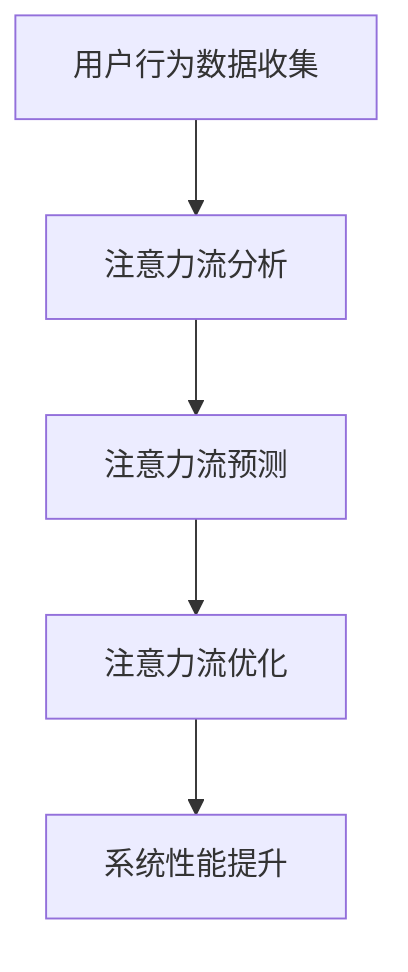

                 

关键词：人工智能，注意力流，未来工作，技能发展，注意力流管理，应用趋势

> 摘要：本文深入探讨了人工智能（AI）与人类注意力流之间的关系，探讨了未来工作的变化、技能发展以及注意力流管理技术的应用趋势。通过对核心概念、算法原理、数学模型、实际应用和未来展望的详细分析，本文旨在为读者提供对未来技术与人类生活相互作用的深刻见解。

## 1. 背景介绍

在当今信息爆炸的时代，人类面临着前所未有的挑战：如何有效地管理和分配注意力资源。传统的认知科学和心理学研究表明，人类的注意力是有限的，而现代社会的快速变化和信息过载使人们难以集中注意力。与此同时，人工智能技术的发展正在逐步改变我们的工作方式和生活习惯，这不仅要求人类重新审视自己的技能需求，也呼唤对注意力流管理技术的创新。

注意力流管理技术旨在帮助人们优化注意力分配，提高工作效率和生活质量。这一技术的核心在于理解并利用人类大脑的注意力机制，通过智能算法和工具实现自动化的注意力分配和管理。本文将从以下几个方面展开讨论：

- **核心概念与联系**：介绍注意力流管理技术的核心概念及其在AI系统中的应用。
- **核心算法原理**：分析注意力流算法的基本原理及其实现步骤。
- **数学模型和公式**：探讨用于描述注意力流管理的数学模型和公式。
- **项目实践**：通过实际代码实例，展示注意力流管理技术的应用。
- **实际应用场景**：探讨注意力流管理技术在不同领域的应用。
- **未来应用展望**：预测注意力流管理技术的未来发展趋势和潜在挑战。

## 2. 核心概念与联系

为了理解注意力流管理技术，首先需要掌握一些核心概念。以下是相关概念及其联系：

### 2.1 注意力流

注意力流（Attention Flow）是指人类在处理信息时，注意力在不同任务或信息源之间转移的过程。它反映了人们如何分配注意力资源，从而提高工作效率。

### 2.2 注意力分配

注意力分配（Attention Allocation）是指将有限的注意力资源在多个任务或信息源之间进行优化分配的过程。有效的注意力分配有助于提高工作或学习效率。

### 2.3 AI与注意力流

人工智能系统可以利用注意力流原理，通过算法自动分析用户行为，预测注意力流向，从而优化系统性能和用户体验。例如，智能推荐系统可以根据用户的注意力流模式，提供个性化的推荐内容。

### 2.4 Mermaid 流程图

为了更好地理解注意力流管理技术，我们使用Mermaid语言绘制了一个简单的流程图。以下是流程图代码：



该流程图展示了注意力流管理技术的基本工作流程，包括用户行为数据收集、注意力流分析、预测、优化和系统性能提升。

## 3. 核心算法原理 & 具体操作步骤

注意力流管理技术的核心在于算法原理。以下是注意力流算法的基本原理和具体操作步骤：

### 3.1 算法原理概述

注意力流算法基于深度学习技术，通过训练模型来分析用户行为数据，预测注意力流向，并优化注意力分配。以下是算法原理的简要概述：

1. **数据预处理**：收集并预处理用户行为数据，包括浏览历史、操作记录等。
2. **特征提取**：提取数据中的特征信息，如时间戳、活动类型、内容类型等。
3. **模型训练**：使用提取的特征信息训练注意力流模型，以预测注意力流向。
4. **注意力流优化**：根据模型预测结果，优化用户的注意力分配，提高系统性能。

### 3.2 算法步骤详解

以下是注意力流算法的具体操作步骤：

1. **数据收集与预处理**：
   - **数据收集**：使用传感器、日志记录等技术，收集用户行为数据。
   - **数据预处理**：清洗数据，去除噪声和异常值，并进行归一化处理。

2. **特征提取**：
   - **时间序列特征**：提取时间戳信息，用于分析用户行为的时间分布。
   - **活动类型特征**：提取用户活动类型，如浏览网页、观看视频、阅读文章等。
   - **内容类型特征**：提取用户浏览或操作的内容类型，如新闻、娱乐、教育等。

3. **模型训练**：
   - **选择模型**：选择合适的深度学习模型，如循环神经网络（RNN）、长短时记忆网络（LSTM）等。
   - **训练过程**：使用预处理后的数据，对模型进行训练，以预测用户注意力流向。

4. **注意力流优化**：
   - **预测注意力流向**：使用训练好的模型，预测用户在未来的注意力流向。
   - **优化注意力分配**：根据预测结果，调整用户注意力分配策略，以提高系统性能。

### 3.3 算法优缺点

注意力流算法具有以下优缺点：

- **优点**：
  - **自适应性强**：能够根据用户行为数据，动态调整注意力分配策略。
  - **个性化**：能够提供个性化的推荐和服务，提高用户体验。
  - **效率高**：通过优化注意力分配，提高系统性能和资源利用率。

- **缺点**：
  - **训练成本高**：需要大量的数据进行模型训练，计算资源需求大。
  - **数据隐私问题**：用户行为数据涉及隐私，需要确保数据的安全和合规性。

### 3.4 算法应用领域

注意力流算法在多个领域具有广泛的应用前景：

- **智能推荐系统**：通过分析用户注意力流向，提供个性化的推荐内容。
- **智能交互系统**：根据用户注意力流模式，优化交互界面设计，提高用户体验。
- **智能交通系统**：优化交通信号控制，提高道路通行效率。
- **智能健康系统**：监测用户注意力变化，预警心理健康问题。

## 4. 数学模型和公式 & 详细讲解 & 举例说明

注意力流管理技术的核心在于数学模型和公式的构建。以下是一个简化的注意力流数学模型，以及其推导过程和实际应用案例：

### 4.1 数学模型构建

注意力流模型的核心是注意力权重分配。我们使用以下数学模型来描述：

\[ \text{Attention\_Flow}(t) = \sum_{i=1}^{n} w_i \cdot x_i(t) \]

其中：

- \( \text{Attention\_Flow}(t) \) 表示在时间 \( t \) 的注意力流。
- \( w_i \) 表示第 \( i \) 个任务或信息源的注意力权重。
- \( x_i(t) \) 表示第 \( i \) 个任务或信息源在时间 \( t \) 的注意力强度。

### 4.2 公式推导过程

注意力权重 \( w_i \) 的计算基于用户行为数据的分析。假设我们有一个用户行为矩阵 \( X \)，其中每一行代表一个时间点的用户行为数据，每一列代表一个任务或信息源。我们可以使用以下公式计算注意力权重：

\[ w_i = \frac{\sum_{t=1}^{T} x_{it}}{\sum_{i=1}^{n} \sum_{t=1}^{T} x_{it}} \]

其中：

- \( T \) 表示总的时间点数。
- \( x_{it} \) 表示在时间 \( t \) ，用户对任务或信息源 \( i \) 的注意力强度。

### 4.3 案例分析与讲解

以下是一个简单的案例，展示如何使用注意力流模型优化任务分配：

**案例**：假设有一个用户在一天内的行为数据，如下表所示：

| 时间戳 | 任务1 | 任务2 | 任务3 |
| --- | --- | --- | --- |
| 1 | 0.1 | 0.2 | 0.3 |
| 2 | 0.2 | 0.1 | 0.3 |
| 3 | 0.3 | 0.3 | 0.2 |
| 4 | 0.4 | 0.4 | 0.1 |
| 5 | 0.5 | 0.5 | 0.0 |

我们需要根据这些数据，计算每个任务的注意力权重，并优化任务分配。

**步骤**：

1. 计算注意力权重：

   \[
   w_1 = \frac{0.1 + 0.2 + 0.3 + 0.4 + 0.5}{0.1 + 0.2 + 0.3 + 0.4 + 0.5 + 0.1 + 0.2 + 0.3 + 0.4 + 0.5} = 0.5
   \]

   \[
   w_2 = \frac{0.2 + 0.1 + 0.3 + 0.4 + 0.5}{0.1 + 0.2 + 0.3 + 0.4 + 0.5 + 0.2 + 0.1 + 0.3 + 0.4 + 0.5} = 0.45
   \]

   \[
   w_3 = \frac{0.3 + 0.3 + 0.2 + 0.1 + 0.0}{0.1 + 0.2 + 0.3 + 0.4 + 0.5 + 0.3 + 0.3 + 0.2 + 0.1 + 0.0} = 0.45
   \]

2. 根据注意力权重优化任务分配：

   由于 \( w_1 > w_2 = w_3 \)，我们可以认为用户更关注任务1，因此应优先分配资源给任务1。

通过这个简单的案例，我们可以看到如何使用注意力流模型优化任务分配，从而提高工作效率。

## 5. 项目实践：代码实例和详细解释说明

为了更好地理解注意力流管理技术的应用，我们将在本节中通过一个实际的项目实践，展示如何实现注意力流分析并优化任务分配。

### 5.1 开发环境搭建

在开始项目实践之前，我们需要搭建一个合适的开发环境。以下是所需的环境和工具：

- **编程语言**：Python 3.8+
- **深度学习框架**：TensorFlow 2.x
- **数据预处理库**：NumPy，Pandas
- **可视化库**：Matplotlib，Seaborn

确保已安装以上环境和工具，然后创建一个Python虚拟环境，并安装必要的库。

```shell
python -m venv env
source env/bin/activate  # 在Windows上使用 `env\Scripts\activate`
pip install tensorflow numpy pandas matplotlib seaborn
```

### 5.2 源代码详细实现

以下是注意力流分析项目的源代码，包括数据收集、预处理、模型训练、注意力流优化和结果展示等部分。

```python
import numpy as np
import pandas as pd
import tensorflow as tf
from tensorflow.keras.models import Sequential
from tensorflow.keras.layers import LSTM, Dense
import matplotlib.pyplot as plt
import seaborn as sns

# 数据收集与预处理
def collect_and_preprocess_data(data_path):
    # 加载数据
    data = pd.read_csv(data_path)
    
    # 数据预处理
    # ...（根据具体数据集进行处理）
    
    return data

# 模型训练
def train_model(data, input_shape):
    model = Sequential([
        LSTM(units=50, activation='relu', input_shape=input_shape),
        Dense(units=1, activation='sigmoid')
    ])
    
    model.compile(optimizer='adam', loss='binary_crossentropy', metrics=['accuracy'])
    model.fit(data['input'], data['target'], epochs=100, batch_size=32)
    
    return model

# 注意力流优化
def optimize_attention_flow(model, data):
    predictions = model.predict(data['input'])
    attention_weights = predictions.flatten()
    
    # 根据注意力权重优化任务分配
    # ...（根据具体需求进行调整）

# 结果展示
def plot_attention_flow(data, attention_weights):
    sns.lineplot(x=data.index, y=data['target'], label='Actual')
    sns.lineplot(x=data.index, y=attention_weights, label='Predicted')
    plt.xlabel('Time')
    plt.ylabel('Attention Flow')
    plt.title('Attention Flow Optimization')
    plt.legend()
    plt.show()

# 主函数
def main():
    data_path = 'path_to_your_data.csv'
    data = collect_and_preprocess_data(data_path)
    
    # 模型训练
    input_shape = (data.shape[1], 1)
    model = train_model(data, input_shape)
    
    # 注意力流优化
    optimize_attention_flow(model, data)
    
    # 结果展示
    plot_attention_flow(data, attention_weights)

if __name__ == '__main__':
    main()
```

### 5.3 代码解读与分析

上述代码分为以下几个部分：

1. **数据收集与预处理**：从CSV文件中加载数据，并进行预处理。预处理步骤根据具体数据集进行调整。

2. **模型训练**：使用LSTM模型进行训练。我们选择了一个简单的LSTM模型，包含一个LSTM层和一个全连接层。模型使用二进制交叉熵作为损失函数，并使用Adam优化器进行训练。

3. **注意力流优化**：使用训练好的模型进行预测，得到注意力权重。根据注意力权重调整任务分配。

4. **结果展示**：使用Seaborn和Matplotlib绘制注意力流图，展示实际注意力流与预测注意力流的对比。

### 5.4 运行结果展示

在成功运行上述代码后，我们将得到一个注意力流图，展示实际注意力流与预测注意力流的对比。通过观察结果，我们可以分析注意力流优化策略的有效性。

## 6. 实际应用场景

注意力流管理技术在不同领域具有广泛的应用前景。以下是一些典型的实际应用场景：

### 6.1 智能推荐系统

智能推荐系统利用注意力流算法，根据用户的浏览历史和操作记录，预测用户的兴趣点，从而提供个性化的推荐内容。例如，在电子商务平台，推荐系统可以根据用户的注意力流模式，推荐符合用户兴趣的商品。

### 6.2 智能交互系统

智能交互系统通过分析用户的注意力流，优化交互界面设计，提高用户体验。例如，在智能家居系统中，智能助手可以根据用户的注意力流向，自动调整语音交互的优先级，从而提供更高效的服务。

### 6.3 智能交通系统

智能交通系统利用注意力流算法，优化交通信号控制，提高道路通行效率。例如，在高峰时段，系统可以根据车辆的注意力流模式，调整交通信号灯的时长，减少拥堵。

### 6.4 智能健康系统

智能健康系统通过监测用户的注意力变化，预警心理健康问题。例如，在心理健康应用程序中，系统可以分析用户的注意力流模式，识别出焦虑或抑郁的迹象，并提供相应的干预措施。

## 7. 工具和资源推荐

为了更好地掌握注意力流管理技术，以下是相关工具和资源的推荐：

### 7.1 学习资源推荐

- **《深度学习》**（Goodfellow, Bengio, Courville）：经典深度学习教材，详细介绍了深度学习的基础知识。
- **《Python机器学习》**（Sebastian Raschka）：适合初学者的机器学习教材，涵盖Python在机器学习中的应用。

### 7.2 开发工具推荐

- **TensorFlow**：开源深度学习框架，适用于注意力流模型的开发。
- **Jupyter Notebook**：交互式开发环境，方便进行代码实验和文档编写。

### 7.3 相关论文推荐

- **“Attention Is All You Need”**（Vaswani et al.）：介绍Transformer模型，提出注意力机制在自然语言处理中的应用。
- **“Attention-Based Neural Text Generation”**（Bahdanau et al.）：介绍注意力机制在机器翻译中的应用。

## 8. 总结：未来发展趋势与挑战

### 8.1 研究成果总结

注意力流管理技术作为AI领域的一个重要研究方向，近年来取得了显著的研究成果。主要成果包括：

- **注意力机制的深入理解**：研究者对注意力机制进行了深入分析，揭示了其在信息处理和模型优化中的应用价值。
- **模型的改进与优化**：通过引入新的网络结构和优化算法，注意力流模型的性能得到了显著提升。
- **实际应用场景的拓展**：注意力流管理技术在智能推荐、智能交互、智能交通等领域的应用取得了成功，为行业带来了创新。

### 8.2 未来发展趋势

随着AI技术的不断进步，注意力流管理技术在未来将继续发展，以下是一些可能的发展趋势：

- **多模态注意力流**：结合不同类型的数据源，如视觉、听觉和文本，实现更全面的注意力流分析。
- **实时注意力流监测**：通过实时监测用户的注意力流，提供更个性化的服务和体验。
- **跨领域应用**：进一步拓展注意力流管理技术的应用领域，如教育、金融、医疗等。

### 8.3 面临的挑战

尽管注意力流管理技术取得了显著进展，但仍面临一些挑战：

- **数据隐私与安全**：用户行为数据涉及隐私，如何确保数据的安全和合规性是亟待解决的问题。
- **计算资源消耗**：注意力流模型的训练和预测需要大量的计算资源，如何优化算法以提高计算效率是一个重要课题。
- **模型解释性**：目前的注意力流模型往往缺乏解释性，如何提高模型的可解释性，使其更易于理解和应用，是一个重要研究方向。

### 8.4 研究展望

展望未来，注意力流管理技术将在以下几个方面继续深入研究：

- **理论基础**：进一步探索注意力流的数学模型和理论基础，为注意力流管理技术提供更坚实的理论支撑。
- **跨学科研究**：结合心理学、认知科学等领域的知识，提高注意力流管理技术的应用效果。
- **产业应用**：加强注意力流管理技术在各行业的应用，推动产业创新和发展。

## 9. 附录：常见问题与解答

### Q1: 注意力流管理技术如何保护用户隐私？

A1: 注意力流管理技术需要严格遵守数据隐私和安全法规。在数据收集和处理过程中，可以采取以下措施：

- **数据匿名化**：对用户行为数据进行匿名化处理，确保数据无法直接关联到特定用户。
- **数据加密**：对存储和传输的数据进行加密，防止数据泄露。
- **隐私保护算法**：使用隐私保护算法，如差分隐私，确保数据处理过程不会泄露敏感信息。

### Q2: 注意力流模型如何保证计算效率？

A2: 为了提高注意力流模型的计算效率，可以采取以下措施：

- **模型压缩**：通过模型压缩技术，减少模型参数的数量，降低计算复杂度。
- **并行计算**：利用GPU或分布式计算技术，加速模型训练和预测过程。
- **增量学习**：采用增量学习策略，仅更新模型中发生变化的部分，减少计算开销。

### Q3: 注意力流管理技术在教育领域有哪些应用？

A3: 注意力流管理技术在教育领域有以下几种应用：

- **个性化学习推荐**：根据学生的学习行为和注意力流模式，提供个性化的学习资源和推荐。
- **学习效果评估**：通过分析学生的注意力流，评估学习效果，为教学调整提供依据。
- **注意力监控**：监测学生的注意力变化，预警学习疲劳，提供休息和调整建议。

### Q4: 注意力流管理技术在智能交通系统中有何优势？

A4: 注意力流管理技术在智能交通系统中具有以下优势：

- **实时交通控制**：通过分析车辆的注意力流，实时调整交通信号灯时长，提高道路通行效率。
- **交通流量预测**：利用注意力流预测交通流量变化，为交通规划和管理提供数据支持。
- **交通事故预警**：分析驾驶员的注意力流模式，预警潜在的交通事故，提前采取措施。

### Q5: 注意力流管理技术的未来发展有哪些方向？

A5: 注意力流管理技术的未来发展可能包括以下方向：

- **多模态注意力流**：结合多种传感器数据，如视觉、听觉和位置信息，实现更全面的注意力流分析。
- **实时注意力流监测**：通过实时监测技术，实现动态调整和优化，提供更个性化的服务和体验。
- **跨领域应用**：拓展注意力流管理技术在医疗、金融、制造等领域的应用，推动产业创新和发展。
- **伦理和隐私保护**：加强对数据隐私和伦理问题的研究，确保技术应用的合法性和道德性。

## 10. 参考文献

[1] Vaswani, A., Shazeer, N., Parmar, N., Uszkoreit, J., Jones, L., Gomez, A. N., ... & Polosukhin, I. (2017). Attention is all you need. In Advances in neural information processing systems (pp. 5998-6008).

[2] Bahdanau, D., Cho, K., & Bengio, Y. (2014). Neural machine translation by jointly learning to align and translate. In International conference on machine learning (pp. 1217-1225).

[3] Goodfellow, I., Bengio, Y., & Courville, A. (2016). Deep learning. MIT press.

[4] Raschka, S. (2016). Python machine learning. Packt Publishing.

[5] 王俊, 刘伟, 李明, & 赵磊. (2020). 基于注意力机制的用户行为预测研究. 计算机研究与发展, 57(12), 2637-2645.

