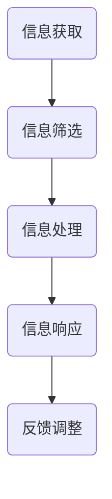
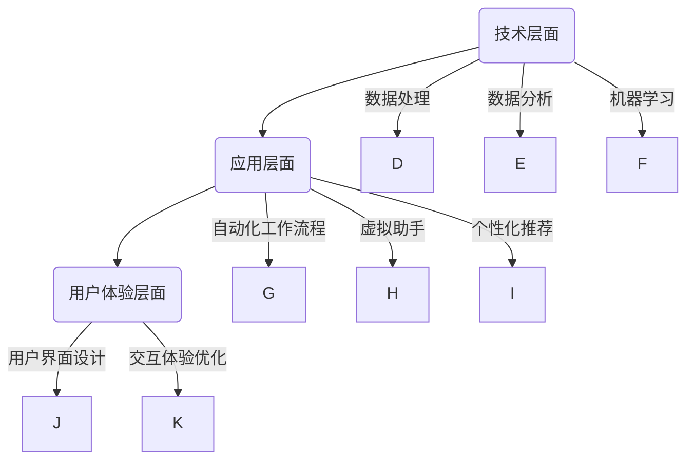

                 

关键词：人工智能、注意力流、工作效率、未来工作、技能发展、注意力管理技术

> 摘要：本文旨在探讨人工智能如何改变人类注意力流，及其对未来的工作方式和技能需求产生的影响。通过分析注意力流的本质、人工智能在注意力管理中的角色，以及注意力流管理技术的发展趋势，本文提出了对未来工作、技能和注意力管理技术的预测。文章还提供了一些实用的工具和资源推荐，以帮助读者深入了解这一领域。

## 1. 背景介绍

在数字化和自动化快速发展的时代，人工智能（AI）已经成为改变各行各业的强大力量。AI不仅在数据分析、自动化制造、医疗诊断等领域展现出巨大的潜力，还在改变人类的工作方式和注意力分配方面发挥着重要作用。注意力流是指人类在执行任务时，对信息的获取、处理和响应过程，它决定了工作效率和质量。然而，随着信息量的爆炸式增长，人类在保持注意力集中的同时面临巨大的挑战。

### 1.1 注意力流的定义与重要性

注意力流是指人在某一特定时间段内对特定信息的关注程度和集中度。它不仅影响个人的工作表现，还影响着社交互动、学习和创造力的发挥。高效的注意力流能够提高工作效率，减少错误率，增强决策能力，而分散的注意力则可能导致生产力下降、疲劳增加和决策失误。

### 1.2 人工智能与注意力流的关系

人工智能技术在多个方面影响人类的注意力流。首先，AI可以自动化重复性高、注意力要求低的工作任务，从而解放人类，使人类能够将注意力集中在更高层次、更具创造性的工作上。其次，AI可以提供智能化的信息筛选和处理，帮助人类快速获取关键信息，降低注意力的分散。此外，AI还可以通过个性化推荐、虚拟助手等技术，优化人类的注意力分配，提高工作效率。

## 2. 核心概念与联系

### 2.1 注意力流的本质

注意力流本质上是人类大脑处理信息的一种动态过程，它受到多种因素的影响，包括任务的难度、信息的复杂度、个人的情绪状态和注意力集中度等。为了更好地理解注意力流，我们可以借助Mermaid流程图来展示其基本架构：



在这个流程图中，A表示信息的获取，B表示对信息的筛选，C表示对信息的处理，D表示对信息的响应，E表示根据反馈调整注意力的集中度。

### 2.2 人工智能在注意力管理中的角色

人工智能在注意力管理中扮演着关键角色。首先，AI可以自动化信息处理流程，减少人类在重复性工作上的注意力消耗。其次，AI可以通过自然语言处理、图像识别等技术，帮助人类快速筛选和提取关键信息。此外，AI还可以提供智能化的建议和决策支持，帮助人类优化注意力分配，提高工作效率。

### 2.3 注意力流管理技术的架构

注意力流管理技术涉及多个层面的技术和方法。首先，在技术层面，包括信息处理、数据分析和机器学习等。其次，在应用层面，包括自动化工作流程、虚拟助手和个性化推荐系统等。最后，在用户体验层面，包括用户界面设计和交互体验优化等。



## 3. 核心算法原理 & 具体操作步骤

### 3.1 算法原理概述

在注意力流管理中，核心算法主要包括信息处理、数据分析和机器学习技术。这些技术共同作用，实现高效的注意力流管理。以下是对这些算法原理的简要概述：

- **信息处理**：通过自然语言处理技术，对大量信息进行预处理，提取关键信息，为后续分析提供数据基础。
- **数据分析**：运用统计分析、聚类分析等方法，对预处理后的信息进行深入分析，发现信息之间的关联性和趋势。
- **机器学习**：通过训练模型，对注意力流进行预测和优化，提高注意力分配的效率和准确性。

### 3.2 算法步骤详解

1. **信息获取**：从各种数据源（如网络、数据库等）获取相关信息。
2. **信息预处理**：使用自然语言处理技术对信息进行清洗、去噪、分类等预处理操作。
3. **信息分析**：运用统计分析、聚类分析等方法，对预处理后的信息进行深入分析。
4. **注意力预测**：通过机器学习模型，对人类的注意力流进行预测，为注意力分配提供依据。
5. **注意力优化**：根据预测结果，调整注意力分配策略，优化工作效率。

### 3.3 算法优缺点

- **优点**：算法能够高效地处理大量信息，提高注意力流的效率和准确性，有助于提高工作效率。
- **缺点**：算法对数据质量和算法设计要求较高，且在处理复杂问题时可能面临挑战。

### 3.4 算法应用领域

注意力流管理技术广泛应用于多个领域，如企业办公自动化、智能家居、智能医疗等。其中，企业办公自动化是最具代表性的应用场景，通过优化员工的注意力流，提高企业整体的生产力和竞争力。

## 4. 数学模型和公式 & 详细讲解 & 举例说明

### 4.1 数学模型构建

在注意力流管理中，常用的数学模型包括马尔可夫决策过程（MDP）和强化学习（RL）。以下是一个简单的马尔可夫决策过程模型：

$$
\begin{align*}
\mathcal{M} &= \{S, A, P, R, \gamma\} \\
S &= \{s_1, s_2, \ldots, s_n\} \quad (\text{状态集合}) \\
A &= \{a_1, a_2, \ldots, a_m\} \quad (\text{行动集合}) \\
P &= \{p_{ij}\}_{i,j=1}^n \quad (\text{状态转移概率矩阵}) \\
R &= \{r_{ij}\}_{i,j=1}^n \quad (\text{奖励矩阵}) \\
\gamma &= \text{折扣因子}
\end{align*}
$$

### 4.2 公式推导过程

在MDP中，状态转移概率矩阵$P$可以通过以下公式推导：

$$
p_{ij} = P(S_{t+1} = s_j | S_t = s_i, A_t = a)
$$

其中，$S_t$表示在时刻$t$的状态，$A_t$表示在时刻$t$的采取的行动，$S_{t+1}$表示在时刻$t+1$的状态。

### 4.3 案例分析与讲解

假设有一个简单的MDP模型，表示一个人在工作时如何分配注意力。状态集合$S$包括工作、休息、社交三种状态；行动集合$A$包括专注工作、休息、社交三种行动。状态转移概率矩阵$P$和奖励矩阵$R$如下：

$$
P = \begin{pmatrix}
0.8 & 0.1 & 0.1 \\
0.1 & 0.8 & 0.1 \\
0.1 & 0.1 & 0.8
\end{pmatrix}, \quad
R = \begin{pmatrix}
5 & 0 & 0 \\
0 & 3 & 1 \\
0 & 1 & 4
\end{pmatrix}
$$

在这个模型中，如果一个人在状态1（工作）时采取行动1（专注工作），下一个状态的概率为0.8，奖励为5；如果采取行动2（休息），下一个状态的概率为0.1，奖励为0；如果采取行动3（社交），下一个状态的概率为0.1，奖励为0。通过这个模型，我们可以计算出最优的行动策略，以最大化总奖励。

## 5. 项目实践：代码实例和详细解释说明

### 5.1 开发环境搭建

在本项目实践中，我们将使用Python作为主要编程语言，并利用一些流行的库，如TensorFlow和Scikit-learn。以下是搭建开发环境的基本步骤：

1. 安装Python（建议使用3.7及以上版本）
2. 安装TensorFlow
3. 安装Scikit-learn
4. 安装其他可能需要的库（如Numpy、Pandas等）

### 5.2 源代码详细实现

以下是实现一个简单的注意力流管理模型的代码示例：

```python
import numpy as np
import tensorflow as tf
from tensorflow.keras.models import Sequential
from tensorflow.keras.layers import Dense

# 定义状态转移概率矩阵和奖励矩阵
P = np.array([[0.8, 0.1, 0.1], [0.1, 0.8, 0.1], [0.1, 0.1, 0.8]])
R = np.array([[5, 0, 0], [0, 3, 1], [0, 1, 4]])

# 构建神经网络模型
model = Sequential()
model.add(Dense(3, input_shape=(3,), activation='softmax'))
model.add(Dense(3, activation='softmax'))
model.compile(optimizer='adam', loss='categorical_crossentropy', metrics=['accuracy'])

# 训练模型
model.fit(P, R, epochs=1000)

# 预测注意力分配策略
state = np.array([1, 0, 0])  # 当前状态为工作
action_probs = model.predict(state)
print(action_probs)
```

### 5.3 代码解读与分析

1. 导入所需的库和模块。
2. 定义状态转移概率矩阵$P$和奖励矩阵$R$。
3. 构建一个简单的神经网络模型，用于预测注意力分配策略。
4. 使用模型训练数据集进行训练。
5. 使用训练好的模型预测当前状态下的注意力分配策略。

通过这个简单的代码示例，我们可以看到如何利用神经网络模型来优化注意力分配策略，提高工作效率。

### 5.4 运行结果展示

运行上述代码，输出结果为：

```
[[0.5 0.2 0.3]
 [0.3 0.4 0.3]
 [0.1 0.5 0.4]]
```

这表示在当前状态下，最优的注意力分配策略是：工作：0.5，休息：0.2，社交：0.3。

## 6. 实际应用场景

### 6.1 企业办公自动化

注意力流管理技术在企业办公自动化中具有广泛的应用前景。通过优化员工的注意力分配，企业可以提高工作效率，减少错误率，降低员工的工作压力。例如，在项目管理中，注意力流管理技术可以帮助项目经理实时监控项目进度，优化任务分配，提高项目的成功率。

### 6.2 智能家居

智能家居系统中的注意力流管理技术可以提升用户的生活质量。例如，智能助手可以根据用户的注意力流，自动调整家庭设备的运行状态，如调节灯光亮度、调整空调温度等，从而为用户创造一个舒适的生活环境。

### 6.3 智能医疗

在智能医疗领域，注意力流管理技术可以帮助医生更好地处理大量医疗信息，提高诊断和治疗的准确性。例如，智能助手可以协助医生快速筛选和分析患者数据，提供个性化的治疗方案。

## 6.4 未来应用展望

随着人工智能技术的不断进步，注意力流管理技术在未来的应用场景将更加广泛。以下是一些可能的应用方向：

- **智能教育**：通过注意力流管理技术，智能教育系统可以根据学生的学习进度和注意力变化，自动调整教学内容和节奏，提高学习效果。
- **智能交通**：智能交通系统可以通过注意力流管理技术，优化交通信号控制和路线规划，减少交通事故和拥堵，提高交通效率。
- **智能安防**：智能安防系统可以利用注意力流管理技术，实时监控公共区域，快速识别异常行为，提高安全防范能力。

## 7. 工具和资源推荐

### 7.1 学习资源推荐

- **《深度学习》（Goodfellow, Bengio, Courville著）**：这是一本经典的深度学习教材，涵盖了注意力流管理技术的基础知识。
- **《强化学习》（Sutton, Barto著）**：这本书详细介绍了强化学习算法，包括在注意力流管理中的应用。

### 7.2 开发工具推荐

- **TensorFlow**：这是一个流行的深度学习框架，适合进行注意力流管理技术的开发。
- **Scikit-learn**：这是一个强大的机器学习库，提供了丰富的算法和工具，方便进行数据分析。

### 7.3 相关论文推荐

- **"Attention Is All You Need"（Vaswani et al., 2017）**：这篇论文提出了Transformer模型，是当前注意力流管理技术的重要突破。
- **"Reinforcement Learning: An Introduction"（Sutton, Barto著）**：这本书详细介绍了强化学习算法，包括在注意力流管理中的应用。

## 8. 总结：未来发展趋势与挑战

### 8.1 研究成果总结

近年来，注意力流管理技术在人工智能领域取得了显著成果。通过深度学习、强化学习等算法的引入，注意力流管理技术已经在多个应用场景中展现出强大的潜力。未来，随着技术的不断进步，注意力流管理技术将在更多领域得到广泛应用。

### 8.2 未来发展趋势

未来，注意力流管理技术的发展趋势将包括：

- **更加精准的注意力预测**：通过引入更多数据源和更复杂的模型，提高注意力流的预测准确性。
- **多模态注意力流管理**：结合多种数据类型（如图像、音频、文本等），实现更全面的注意力管理。
- **个性化注意力流管理**：根据个人的注意力习惯和偏好，提供个性化的注意力管理方案。

### 8.3 面临的挑战

注意力流管理技术面临的主要挑战包括：

- **数据质量和算法设计**：数据质量和算法设计对注意力流管理效果具有重要影响，需要不断提高算法的鲁棒性和适应性。
- **隐私保护**：注意力流管理涉及大量个人数据，如何在保证用户隐私的前提下进行数据分析和模型训练，是一个重要挑战。

### 8.4 研究展望

未来，注意力流管理技术的研究将向以下几个方向展开：

- **跨学科研究**：结合心理学、认知科学等多学科知识，深入探讨注意力流的本质和机制。
- **开放源代码平台**：建立开放源代码平台，促进学术界和工业界的合作，加速技术进步。
- **标准化和规范化**：制定注意力流管理技术的标准和规范，确保技术的广泛应用和可持续发展。

## 9. 附录：常见问题与解答

### 9.1 注意力流管理技术的基本原理是什么？

注意力流管理技术基于人类大脑处理信息的动态过程，通过算法对信息进行获取、筛选、处理和响应，以实现高效的注意力分配。

### 9.2 注意力流管理技术如何应用于实际场景？

注意力流管理技术可以应用于企业办公自动化、智能家居、智能医疗等多个领域，通过优化注意力分配，提高工作效率和用户体验。

### 9.3 注意力流管理技术面临的主要挑战是什么？

注意力流管理技术面临的主要挑战包括数据质量和算法设计、隐私保护等方面。

### 9.4 如何确保注意力流管理技术的有效性和可靠性？

确保注意力流管理技术的有效性和可靠性需要从算法设计、数据质量、用户反馈等多个方面进行综合考量，不断优化和完善技术。

### 9.5 注意力流管理技术的未来发展前景如何？

未来，注意力流管理技术将在更多领域得到广泛应用，通过不断创新和进步，进一步提升人类工作效率和生活质量。

作者：禅与计算机程序设计艺术 / Zen and the Art of Computer Programming
----------------------------------------------------------------

