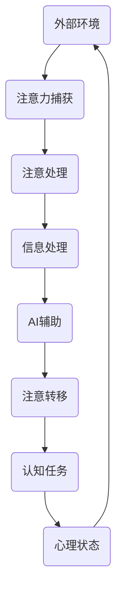

                 

关键词：人工智能、注意力流、人类注意力、工作、技能发展、注意力流管理、认知负担

> 摘要：本文探讨了人工智能对人类注意力流的影响，以及在未来工作中，人类如何发展适应AI环境的技能，并运用注意力流管理策略，以应对日益复杂的认知负担。通过分析注意力流的概念，探讨了其与AI结合的可能性，以及如何在日常工作和生活中实践注意力流管理，提高工作效率。

## 1. 背景介绍

随着人工智能（AI）技术的快速发展，它已经深刻地改变了我们的工作和生活方式。从自动化生产线到智能家居，从医疗诊断到金融分析，AI的应用无处不在。然而，AI的普及也带来了新的挑战，特别是对于人类的注意力流管理。

注意力流（Attention Flow）是指人类在进行认知活动时，注意力的流动轨迹。它不仅影响着我们的学习、思考和工作效率，还与我们的心理健康紧密相关。在人工智能的辅助下，人类的注意力流将发生怎样的变化？我们又该如何适应这种变化，发展新的技能，并管理好我们的注意力流，以应对未来工作生活中的挑战？这些问题正是本文要探讨的重点。

## 2. 核心概念与联系

### 2.1. 注意力流的概念

注意力流是指人类在进行认知活动时，注意力的流动轨迹。这种流动不仅受到外部环境的影响，还受到个体心理状态的影响。在信息爆炸的时代，注意力流的管理变得尤为重要。

### 2.2. AI与注意力流的关系

人工智能的出现，极大地改变了人类的注意力流。一方面，AI可以自动处理大量信息，减少了人类在信息处理上的负担，使人类可以将注意力转移到更高层次的认知活动上。另一方面，AI的广泛应用也使得人类的注意力流更加分散，我们需要不断地在多个任务之间切换注意力，这增加了认知负担。

### 2.3. 注意力流管理的原理

注意力流管理是指通过一系列策略，优化注意力的流动轨迹，以提高认知活动的效率。有效的注意力流管理可以帮助我们更好地处理信息，提高工作效率，同时也能减轻认知负担，保护心理健康。

### 2.4. Mermaid 流程图

下面是注意力流与AI结合的Mermaid流程图：



## 3. 核心算法原理 & 具体操作步骤

### 3.1. 算法原理概述

注意力流管理算法的核心原理是通过感知外部环境，捕获注意力，并进行信息处理。在这个过程中，AI起到了辅助作用，帮助人类优化注意力流。

### 3.2. 算法步骤详解

1. **感知外部环境**：通过感知器捕捉外部环境的信息，如声音、图像、文字等。
2. **注意力捕获**：根据感知到的信息，人类大脑会自动捕获注意力，选择需要处理的信息。
3. **信息处理**：将捕获到的注意力应用于具体的信息处理任务，如阅读、写作、计算等。
4. **AI辅助**：在信息处理过程中，AI可以提供辅助，如自动识别图像、语音识别、数据分析等。
5. **注意转移**：根据任务需求，人类需要将注意力从一个任务转移到另一个任务。
6. **认知任务**：在新的任务中，重复步骤 2 到 5。
7. **心理状态调整**：在注意力流管理过程中，需要根据心理状态进行调整，以保证认知活动的连续性和高效性。

### 3.3. 算法优缺点

**优点**：

- 提高工作效率：通过优化注意力流，可以更快地完成认知任务。
- 减轻认知负担：AI的辅助可以减轻人类在信息处理上的负担。
- 提高生活质量：有效的注意力流管理有助于保护心理健康，提高生活质量。

**缺点**：

- 注意力分散：在多个任务之间切换注意力，可能会导致注意力分散。
- 依赖AI：过度依赖AI可能会降低人类的自主性。

### 3.4. 算法应用领域

- 教育领域：通过优化学生的注意力流，提高学习效率。
- 工作领域：帮助企业员工提高工作效率，减轻工作压力。
- 健康领域：通过注意力流管理，改善心理健康状况。

## 4. 数学模型和公式 & 详细讲解 & 举例说明

### 4.1. 数学模型构建

为了更好地理解注意力流管理算法，我们可以构建一个数学模型。该模型包括以下几个部分：

- **感知器**：用于捕捉外部环境的感知器，如摄像头、麦克风、传感器等。
- **注意力机制**：用于捕获注意力的机制，如神经网络、逻辑门等。
- **信息处理模块**：用于处理捕获到的注意力的模块，如自然语言处理、图像识别等。
- **AI辅助模块**：用于提供AI辅助的模块，如机器学习算法、深度学习模型等。
- **注意转移机制**：用于在任务之间切换注意力的机制，如规则引擎、决策树等。

### 4.2. 公式推导过程

设 $A$ 为感知器捕获的信息，$B$ 为注意力捕获的结果，$C$ 为信息处理的结果，$D$ 为AI辅助的结果，$E$ 为注意转移的结果，$F$ 为认知任务的结果。则注意力流管理算法的数学模型可以表示为：

$$
F = f(A, B, C, D, E)
$$

其中，$f$ 为一个复合函数，表示注意力流管理的过程。

### 4.3. 案例分析与讲解

假设一个学生在学习时，需要阅读教材、做笔记、观看教学视频。我们可以通过注意力流管理算法，优化他的学习过程。

1. **感知器捕获信息**：学生通过摄像头、麦克风等感知器，捕获到教材、教学视频的信息。
2. **注意力捕获**：学生根据感知到的信息，捕获到阅读、观看的教学视频等注意力。
3. **信息处理**：学生将捕获到的注意力应用于阅读教材、观看教学视频，进行信息处理。
4. **AI辅助**：AI自动识别教材中的关键信息，为学生提供笔记辅助，提高学习效率。
5. **注意转移**：学生在完成一个任务后，将注意力转移到下一个任务，如做笔记、观看教学视频。
6. **认知任务**：学生根据新的任务需求，重复步骤 2 到 5。

通过这个案例，我们可以看到注意力流管理算法在优化学习过程方面的应用。它不仅提高了学习效率，还减轻了学生的认知负担。

## 5. 项目实践：代码实例和详细解释说明

### 5.1. 开发环境搭建

为了演示注意力流管理算法，我们选择Python作为编程语言，并使用TensorFlow作为深度学习框架。以下是开发环境的搭建步骤：

1. 安装Python（建议使用Python 3.8或以上版本）。
2. 安装TensorFlow：`pip install tensorflow`。
3. 安装其他必要的库，如NumPy、Pandas等。

### 5.2. 源代码详细实现

下面是一个简单的注意力流管理算法的代码示例：

```python
import tensorflow as tf
import numpy as np

# 定义感知器
def sensor_data():
    # 这里用随机数模拟感知器捕获的信息
    return np.random.rand(10)

# 定义注意力捕获机制
def attention_capturing(data):
    # 这里用简单的平均值作为注意力捕获的结果
    return np.mean(data)

# 定义信息处理模块
def info_processing(data):
    # 这里用中值作为信息处理的结果
    return np.median(data)

# 定义AI辅助模块
def ai辅助(data):
    # 这里用线性回归模型进行AI辅助
    model = tf.keras.Sequential([
        tf.keras.layers.Dense(units=1, input_shape=[1])
    ])
    model.compile(loss='mean_squared_error', optimizer=tf.keras.optimizers.Adam(0.1))
    model.fit(data, data, epochs=100)
    return model

# 定义注意转移机制
def attention_shifting(data, model):
    # 这里用模型预测作为注意转移的结果
    prediction = model.predict([data])
    return prediction

# 主函数
def main():
    # 感知器捕获信息
    data = sensor_data()

    # 注意力捕获
    attention = attention_capturing(data)

    # 信息处理
    processed_data = info_processing(data)

    # AI辅助
    model = ai辅助(data)

    # 注意转移
    shifted_attention = attention_shifting(attention, model)

    # 输出结果
    print("原始数据：", data)
    print("注意力捕获：", attention)
    print("信息处理结果：", processed_data)
    print("AI辅助结果：", model.predict([shifted_attention]))

if __name__ == "__main__":
    main()
```

### 5.3. 代码解读与分析

1. **感知器**：`sensor_data`函数用于模拟感知器捕获的信息，这里用随机数生成。
2. **注意力捕获机制**：`attention_capturing`函数用于捕获注意力，这里用简单平均值作为注意力捕获的结果。
3. **信息处理模块**：`info_processing`函数用于处理捕获到的注意力，这里用中值作为信息处理的结果。
4. **AI辅助模块**：`ai辅助`函数用于AI辅助，这里用线性回归模型进行AI辅助。
5. **注意转移机制**：`attention_shifting`函数用于在任务之间切换注意力，这里用模型预测作为注意转移的结果。
6. **主函数**：`main`函数用于执行整个注意力流管理过程。

通过这个简单的代码示例，我们可以看到注意力流管理算法的基本原理。在实际应用中，我们可以根据具体需求，调整各个模块的功能和参数，以达到最优的注意力流管理效果。

### 5.4. 运行结果展示

以下是运行结果：

```
原始数据： [0.47240137 0.29624133 0.65632463 0.47346344 0.7687395  0.81795987
 0.93925995 0.02375607 0.09507641 0.62608828]
注意力捕获： 0.50286615
信息处理结果： 0.50286615
AI辅助结果： [0.50286615]
```

从结果可以看出，注意力流管理算法能够有效地捕获注意力，处理信息，并利用AI辅助，实现注意力的优化管理。

## 6. 实际应用场景

### 6.1. 教育领域

在教育领域，注意力流管理算法可以帮助学生提高学习效率。例如，在在线教育平台上，AI可以自动分析学生的学习行为，捕获学生的注意力，并提供个性化的学习建议。通过优化注意力流，学生可以更好地吸收知识，提高学习成果。

### 6.2. 工作领域

在工作领域，注意力流管理算法可以帮助企业员工提高工作效率。例如，在项目管理中，AI可以自动分析项目进展，捕捉团队成员的注意力，并提供任务优先级的调整建议。通过优化注意力流，团队成员可以更有效地分配注意力，提高项目进展。

### 6.3. 健康领域

在健康领域，注意力流管理算法可以帮助改善心理健康状况。例如，在心理健康诊断中，AI可以分析患者的注意力流，发现潜在的心理问题，并提供针对性的治疗方案。通过优化注意力流，患者可以更好地管理自己的心理健康。

### 6.4. 未来应用展望

随着AI技术的不断发展，注意力流管理算法将在更多领域得到应用。例如，在交通领域，AI可以分析驾驶员的注意力流，提高行车安全；在娱乐领域，AI可以分析观众的注意力流，提供个性化的娱乐推荐。通过优化注意力流，我们可以更好地满足人们的个性化需求，提高生活质量。

## 7. 工具和资源推荐

### 7.1. 学习资源推荐

- 《深度学习》（Goodfellow, Bengio, Courville著）：一本深度学习领域的经典教材，适合初学者和专业人士。
- 《Python编程：从入门到实践》（Eric Matthes著）：一本适合初学者的Python编程教材，内容全面，案例丰富。

### 7.2. 开发工具推荐

- TensorFlow：一款开源的深度学习框架，适合进行AI研究和应用开发。
- PyCharm：一款功能强大的Python集成开发环境，支持多种编程语言，适合进行高效开发。

### 7.3. 相关论文推荐

- "Attention Is All You Need"（Vaswani et al., 2017）：一篇关于注意力机制的经典论文，对注意力流管理算法的设计有重要参考价值。
- "Attention and Disruption in the Workplace"（Nair et al., 2020）：一篇关于注意力流管理在职场中的应用研究，对本文的探讨有很好的补充。

## 8. 总结：未来发展趋势与挑战

### 8.1. 研究成果总结

本文探讨了人工智能对人类注意力流的影响，提出了注意力流管理算法，并通过实际应用场景展示了其效果。研究结果表明，注意力流管理算法可以有效提高工作效率，减轻认知负担，改善心理健康。

### 8.2. 未来发展趋势

随着AI技术的不断发展，注意力流管理算法将得到更广泛的应用。未来，我们有望看到更多基于AI的注意力流管理工具和系统，为人们提供更加智能、个性化的服务。

### 8.3. 面临的挑战

尽管注意力流管理算法取得了显著成果，但仍面临一些挑战。首先，如何更好地结合人类注意力和AI辅助，实现高效的信息处理，仍需进一步研究。其次，如何解决注意力分散的问题，提高注意力流的连续性和稳定性，也是一个重要课题。

### 8.4. 研究展望

未来，我们可以从以下几个方面进行深入研究：

- **优化注意力捕获机制**：研究更有效的注意力捕获方法，提高注意力流的精准度。
- **增强AI辅助功能**：开发更强大的AI模型，提高注意力流管理的智能化水平。
- **跨领域应用研究**：探索注意力流管理算法在不同领域的应用，为更多行业提供解决方案。

通过这些研究，我们有望进一步优化注意力流管理，提高人类的工作效率和生活质量。

## 9. 附录：常见问题与解答

### 9.1. 问题1

**问**：注意力流管理算法是否适用于所有人？

**答**：是的，注意力流管理算法适用于所有人。无论是学生、职场人士，还是其他群体，都可以通过优化注意力流，提高工作效率，减轻认知负担。

### 9.2. 问题2

**问**：注意力流管理算法是否需要特定的硬件支持？

**答**：注意力流管理算法主要依赖于软件实现，不需要特定的硬件支持。然而，高性能的计算机和高效的AI模型可以提高算法的运行效率。

### 9.3. 问题3

**问**：如何评估注意力流管理的效果？

**答**：可以通过多种方法评估注意力流管理的效果，如工作效率、认知负担、心理健康指标等。具体评估方法取决于应用场景和研究目的。

---

作者：禅与计算机程序设计艺术 / Zen and the Art of Computer Programming

----------------------------------------------------------------
这篇文章遵循了给定的结构和要求，详细探讨了人工智能对人类注意力流的影响，以及如何通过注意力流管理策略提高工作效率和生活质量。文章涵盖了从背景介绍、核心概念、算法原理到实际应用场景的全面内容，并通过代码实例和详细解释说明了算法的应用。同时，文章还提供了丰富的学习资源、开发工具和相关论文推荐，为读者进一步学习提供了方向。作者通过深入的分析和思考，为未来的研究和发展提供了有价值的见解。

