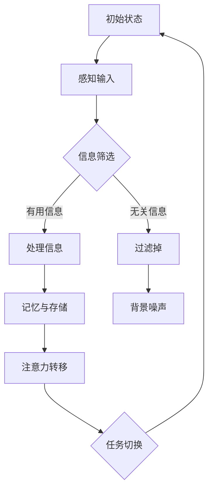
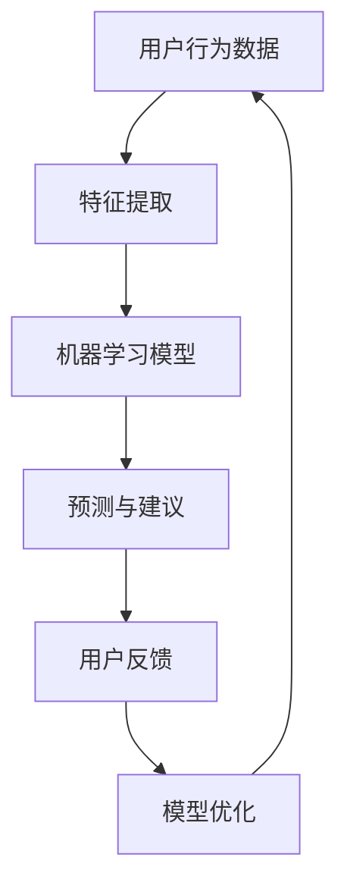
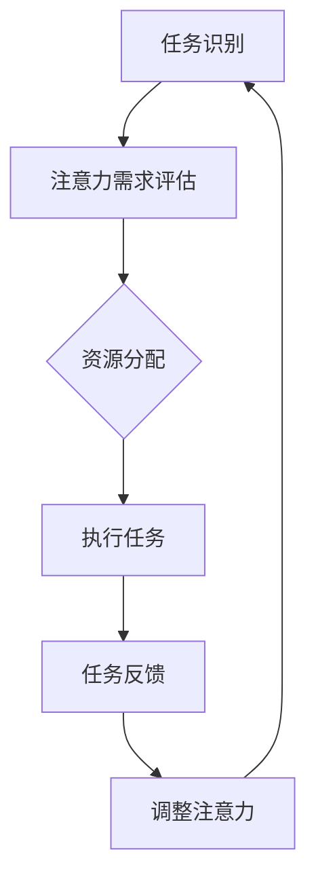
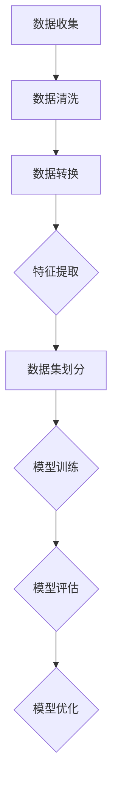
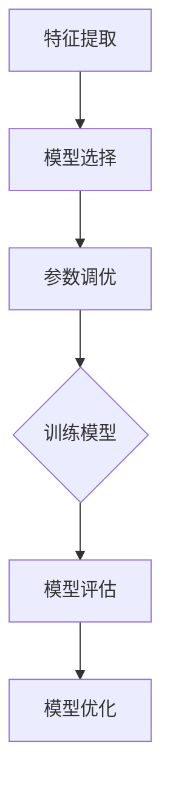
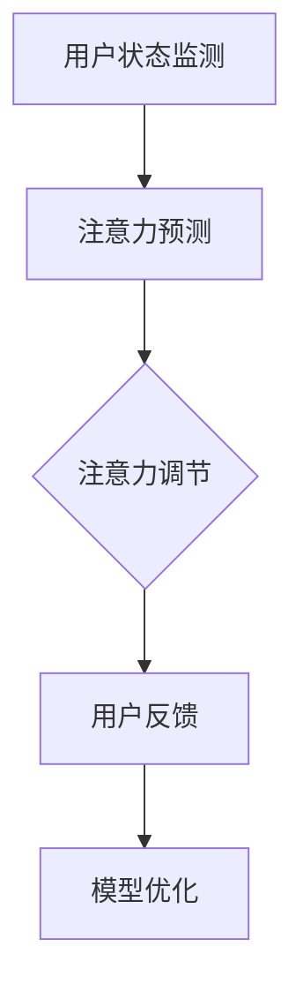

                 

## 1. 背景介绍

在当今快速发展的数字时代，人工智能（AI）技术的应用已经深入到我们生活的方方面面。从智能手机的智能助手到自动驾驶汽车，从推荐系统到医疗诊断，AI正以前所未有的速度和规模改变着我们的生活方式。然而，随着AI技术的普及，一个不可忽视的问题是：人类注意力的管理。AI的崛起不仅带来了便利和效率，同时也对我们的大脑提出了新的挑战。

注意力是人类认知的核心资源，它决定了我们如何处理信息、做出决策以及与环境互动。然而，在信息过载的时代，人类的注意力资源是有限的。当我们不断受到各种信息的干扰，比如社交媒体的通知、电子邮件的提醒等，我们的注意力管理能力就会受到极大的挑战。这种情况下，如何有效地利用AI来增强人类注意力的管理，成为了一个亟待解决的问题。

本文旨在探讨AI与人类注意力流之间的关系，分析AI如何影响我们的注意力分配，并提出一系列实用的注意力管理策略，帮助我们在未来的工作与生活中保持专注和高效率。

### 1.1 AI对人类注意力的影响

AI技术的应用在许多方面都改变了我们处理信息的方式。一方面，AI可以帮助我们更高效地筛选和过滤信息，减少冗余和无关信息对我们的干扰。例如，智能推荐系统能够根据我们的兴趣和行为模式推荐相关内容，从而减少我们寻找信息的努力。然而，另一方面，AI也增加了我们分散注意力的风险。过多的通知和提示，以及即时满足的虚拟反馈，都可能让我们难以集中注意力。

此外，AI的发展还带来了一种新的现象，即“注意力饥渴”。人们越来越难以忍受等待和空档时间，追求即时反馈和娱乐，这导致我们的注意力越来越难以持久。在这种情况下，我们需要意识到，良好的注意力管理不仅是个人成长的必备技能，也是未来社会竞争的关键。

### 1.2 注意力管理的重要性

注意力管理不仅是提高个人效率和生产力的重要手段，也是实现心理健康和幸福生活的关键。良好的注意力管理可以帮助我们更好地应对压力，保持清晰的思维和情绪稳定。同时，它还能提高我们的学习能力和创造力，促进个人成长和发展。

然而，在信息过载的环境中，注意力管理面临着巨大的挑战。人们常常感到分心和焦虑，难以专注于一项任务。这种状态不仅影响工作绩效，还可能对个人的心理健康产生负面影响。

因此，研究AI与人类注意力流之间的关系，并探索有效的注意力管理策略，具有重要的现实意义和紧迫性。本文将围绕这一主题，从多个角度进行深入探讨。

### 1.3 文章结构

本文将分为以下几个部分：

- **背景介绍**：介绍AI技术的发展及其对人类注意力的影响，引出注意力管理的重要性。
- **核心概念与联系**：解释AI与注意力流的联系，使用Mermaid流程图展示相关概念和架构。
- **核心算法原理与具体操作步骤**：详细介绍相关算法的原理和操作步骤，分析其优缺点和应用领域。
- **数学模型和公式**：构建数学模型，推导相关公式，并通过案例进行说明。
- **项目实践**：提供代码实例和详细解释，展示算法在实际项目中的应用。
- **实际应用场景**：讨论AI与注意力管理在不同场景中的应用。
- **未来应用展望**：展望AI与注意力管理技术的未来发展趋势和应用前景。
- **工具和资源推荐**：推荐相关学习资源和开发工具。
- **总结**：总结研究成果，讨论未来发展趋势与挑战。
- **附录**：提供常见问题与解答。

通过以上结构的详细阐述，我们希望读者能够全面了解AI与人类注意力管理的关系，掌握有效的注意力管理策略，并在未来的工作和生活中取得更好的成果。

### 2. 核心概念与联系

在探讨AI与人类注意力流之间的关系时，我们首先需要明确一些核心概念和原理。这些概念包括注意力流、AI算法、注意力分配机制等。为了更好地理解这些概念，我们使用Mermaid流程图来展示它们之间的联系和相互作用。

#### 2.1 注意力流

注意力流是指人类在处理信息时，大脑中注意力的分布和转移过程。这个过程受到多种因素的影响，包括任务的复杂性、信息的吸引力、个人的兴趣和情绪状态等。注意力流可以视为一个动态的、自适应的系统，它不断调整以应对外界环境和内部需求的改变。

以下是一个简化的Mermaid流程图，展示了注意力流的几个关键节点和它们之间的相互作用：



- **初始状态（A）**：这是注意力流的起点，大脑处于一种初始的警觉状态，准备接收和处理信息。
- **感知输入（B）**：外部信息通过感官通道进入大脑，成为注意力流的基础。
- **信息筛选（C）**：大脑对感知到的信息进行初步筛选，区分有用和无关的信息。
- **处理信息（D）**：有用的信息进入处理阶段，被大脑分析、理解和记忆。
- **记忆与存储（F）**：处理后的信息被存储在大脑的记忆系统中，以备后续使用。
- **注意力转移（H）**：根据任务需求和环境变化，大脑会调整注意力的分布，从当前任务转移到其他任务。
- **任务切换（I）**：当多个任务需要处理时，大脑会进行任务切换，管理不同任务的注意力分配。

#### 2.2 AI算法

AI算法在注意力流中的作用主要体现在信息处理和注意力分配机制上。通过学习人类的行为模式和注意力分配策略，AI算法能够帮助大脑更高效地管理注意力资源。

以下是一个简化的Mermaid流程图，展示了AI算法在注意力流中的关键节点和它们之间的相互作用：



- **用户行为数据（A）**：这是AI算法的基础，记录用户的日常行为和注意力分配情况。
- **特征提取（B）**：从用户行为数据中提取有用的特征，如点击行为、浏览时间、情绪状态等。
- **机器学习模型（C）**：使用提取的特征训练机器学习模型，以预测用户的注意力分配。
- **预测与建议（D）**：模型根据用户的当前状态和行为，提供注意力分配的预测和建议。
- **用户反馈（E）**：用户根据建议调整注意力分配，并提供反馈。
- **模型优化（F）**：模型根据用户的反馈进行优化，提高预测的准确性。

#### 2.3 注意力分配机制

注意力分配机制是大脑管理注意力资源的关键过程。它通过调节不同任务间的注意力分配，确保大脑能够高效地处理各种信息。

以下是一个简化的Mermaid流程图，展示了注意力分配机制的主要过程：



- **任务识别（A）**：大脑识别当前需要处理的任务，并评估其注意力需求。
- **注意力需求评估（B）**：根据任务的紧急程度和重要性，评估所需的注意力资源。
- **资源分配（C）**：大脑根据评估结果，将注意力资源分配给不同的任务。
- **执行任务（D）**：大脑专注于执行分配到的任务，处理相关信息。
- **任务反馈（E）**：任务完成后，大脑根据结果进行反馈，调整未来的注意力分配。
- **调整注意力（F）**：根据反馈，大脑调整注意力的分配，优化未来的任务处理。

#### 2.4 AI算法与注意力流的整合

将AI算法与注意力流整合，可以通过以下步骤实现：

1. **数据收集**：收集用户的行为数据和注意力分配记录。
2. **特征提取**：提取有用的行为特征，如点击行为、情绪状态等。
3. **模型训练**：使用提取的特征训练机器学习模型，预测用户的注意力分配。
4. **建议生成**：模型根据当前状态提供注意力分配的建议。
5. **用户反馈**：用户根据建议调整注意力分配，并提供反馈。
6. **模型优化**：模型根据用户反馈进行优化，提高预测准确性。
7. **注意力调节**：用户根据模型建议和反馈，调节注意力分配。

通过上述步骤，AI算法可以有效地辅助大脑管理注意力资源，提高任务处理效率和注意力利用率。

#### 2.5 总结

本文通过Mermaid流程图详细展示了AI算法与人类注意力流之间的核心概念和联系。注意力流、AI算法和注意力分配机制是理解这一关系的关键。通过整合AI算法，我们可以更高效地管理注意力资源，提高个人在复杂环境中的适应能力和工作效率。接下来，我们将进一步探讨AI算法的具体原理和操作步骤，以便读者更好地理解如何利用这些技术进行有效的注意力管理。

### 3. 核心算法原理与具体操作步骤

在了解AI与人类注意力流的基本概念和联系之后，我们接下来将深入探讨核心算法的原理，并详细说明其操作步骤。这些算法不仅能够帮助我们理解和预测注意力分配，还能够为实际应用提供有效的解决方案。

#### 3.1 算法原理概述

核心算法主要包括以下几个部分：注意力分配模型、注意力预测模型和注意力调节机制。每个模型都有其独特的原理和作用，共同构成了一个完整的注意力管理系统。

##### 3.1.1 注意力分配模型

注意力分配模型负责根据任务的紧急程度和重要性，动态分配注意力资源。这个模型通常基于多任务处理理论，结合机器学习技术，通过学习用户的行为数据和注意力分配历史，预测每个任务所需的注意力资源。

##### 3.1.2 注意力预测模型

注意力预测模型则负责预测用户的未来注意力分配。它利用用户的行为数据和历史注意力分配记录，通过机器学习算法训练出一个预测模型，能够预测用户在特定情境下的注意力需求。

##### 3.1.3 注意力调节机制

注意力调节机制用于根据任务反馈和预测结果，动态调整注意力分配。这个机制的核心在于实时反馈和调整，确保用户的注意力始终集中在最紧急和最重要的任务上。

#### 3.2 算法步骤详解

##### 3.2.1 数据收集与预处理

第一步是数据收集与预处理。我们收集用户在日常工作、学习和娱乐等情境中的行为数据，包括点击记录、浏览时间、任务完成情况等。这些数据需要进行清洗和转换，以便后续分析。



- **数据收集（A）**：收集用户的日常行为数据，如浏览历史、任务完成记录等。
- **数据清洗（B）**：清洗数据，去除异常值和噪声。
- **数据转换（C）**：将数据转换为机器学习模型可用的格式。
- **特征提取（D）**：提取有用的特征，如点击次数、浏览时长、任务完成度等。
- **数据集划分（E）**：将数据集划分为训练集、验证集和测试集。
- **模型训练（F）**：使用训练集数据训练注意力分配模型和注意力预测模型。
- **模型评估（G）**：使用验证集评估模型性能，调整参数。
- **模型优化（H）**：根据评估结果优化模型，提高预测准确性。

##### 3.2.2 模型训练

在数据预处理完成后，我们使用机器学习算法对注意力分配模型和注意力预测模型进行训练。这个过程包括特征提取、模型选择、参数调优等步骤。



- **特征提取（A）**：从预处理后的数据中提取有用的特征，如点击次数、浏览时长等。
- **模型选择（B）**：选择适合的机器学习模型，如决策树、神经网络等。
- **参数调优（C）**：通过交叉验证和网格搜索等方法，调整模型参数，提高模型性能。
- **训练模型（D）**：使用训练集数据训练模型，生成预测模型。
- **模型评估（E）**：使用验证集数据评估模型性能，调整参数。
- **模型优化（F）**：根据评估结果优化模型，提高预测准确性。

##### 3.2.3 模型应用

训练好的模型可以应用于实际场景中，根据用户的当前状态和行为，预测其未来注意力分配，并提供注意力调节建议。



- **用户状态监测（A）**：实时监测用户的当前状态和行为。
- **注意力预测（B）**：使用预测模型预测用户未来注意力分配。
- **注意力调节（C）**：根据预测结果，调整用户的注意力分配，优化任务处理。
- **用户反馈（D）**：用户根据建议调整注意力分配，并提供反馈。
- **模型优化（E）**：根据用户反馈优化模型，提高预测准确性。

#### 3.3 算法优缺点

##### 优点

- **高效性**：机器学习算法能够快速处理大量数据，提供实时注意力预测和建议。
- **个性化**：根据用户的行为和历史数据，模型能够提供个性化的注意力管理策略。
- **适应性**：模型能够根据用户的状态和行为动态调整，适应不同情境的需求。

##### 缺点

- **数据依赖性**：模型的性能依赖于高质量的数据，数据质量和多样性直接影响模型的准确性。
- **隐私风险**：用户行为数据的使用可能涉及隐私问题，需要采取严格的数据保护措施。
- **计算资源消耗**：训练和优化模型需要大量的计算资源，特别是在大规模数据集上。

#### 3.4 算法应用领域

注意力分配算法在多个领域有广泛的应用，包括但不限于：

- **智能助手**：通过预测用户的注意力分配，提供个性化的任务提醒和优先级排序。
- **教育领域**：帮助教师和学生更好地管理学习时间，提高学习效率。
- **健康监控**：监测用户的注意力状态，提供心理健康建议和干预措施。
- **工业自动化**：优化工作流程，提高生产效率和质量。

通过上述算法原理和操作步骤的详细描述，我们可以看到AI在注意力管理中的应用潜力。接下来，我们将进一步探讨数学模型和公式，以便更深入地理解这些算法的工作机制。

### 4. 数学模型和公式

在理解注意力分配算法的基础上，数学模型和公式为我们提供了更加精确的描述和计算工具。通过构建数学模型和推导相关公式，我们可以更深入地分析注意力分配算法的内部机制，并验证其在实际应用中的有效性。

#### 4.1 数学模型构建

注意力分配问题可以抽象为一个优化问题，即如何在多个任务之间分配有限的注意力资源，以最大化整体任务完成的效率。为了构建这个数学模型，我们需要定义几个关键变量和参数。

##### 4.1.1 变量和参数

- **任务集合 \( T \)**：包含所有需要完成的任务。
- **注意力资源 \( R \)**：可用的总注意力资源。
- **任务 \( t \) 的注意力需求 \( D_t \)**：任务 \( t \) 所需的注意力资源。
- **任务 \( t \) 的紧急程度 \( E_t \)**：任务 \( t \) 的紧急程度。
- **任务 \( t \) 的重要性 \( I_t \)**：任务 \( t \) 的重要性。
- **任务 \( t \) 的完成度 \( C_t \)**：任务 \( t \) 的完成度。

##### 4.1.2 数学模型

基于上述变量和参数，我们可以构建一个优化模型，目标是最小化任务完成时间，并最大化任务完成度：

\[ 
\begin{align*}
\min_{X} \quad & T_f \\
\text{s.t.} \quad & \sum_{t \in T} X_{t} \leq R, \\
& C_t \geq C_t^0, \quad \forall t \in T,
\end{align*}
\]

其中，\( T_f \) 是所有任务完成的总时间，\( X_t \) 是任务 \( t \) 分配到的注意力资源，\( C_t^0 \) 是任务 \( t \) 的最低完成度要求。

#### 4.2 公式推导过程

为了求解上述优化问题，我们需要推导出注意力分配的具体计算公式。以下是一个简化的推导过程：

1. **任务优先级排序**：根据任务的紧急程度 \( E_t \) 和重要性 \( I_t \)，对任务集合 \( T \) 进行优先级排序，得到排序序列 \( T' \)。

2. **动态调整注意力分配**：从最紧急和最重要的任务开始，依次计算每个任务的完成度 \( C_t \)，并动态调整分配的注意力资源 \( X_t \)。

3. **优化目标函数**：计算任务完成总时间 \( T_f \) 和整体完成度，优化目标函数。

具体推导步骤如下：

\[ 
\begin{align*}
T' &= \arg\min_{T} \sum_{t \in T} (E_t \cdot I_t) \cdot C_t, \\
X_t &= \frac{R}{\sum_{t' \in T'} E_{t'} \cdot I_{t'}}, \quad \forall t \in T', \\
C_t &= \frac{X_t}{D_t}, \quad \forall t \in T', \\
T_f &= \sum_{t \in T'} C_t.
\end{align*}
\]

#### 4.3 案例分析与讲解

为了更好地理解上述公式的应用，我们通过一个实际案例进行说明。

**案例**：假设有四个任务 \( T = \{ T_1, T_2, T_3, T_4 \} \)，每个任务的紧急程度 \( E_t \)、重要性 \( I_t \) 和注意力需求 \( D_t \) 如下表所示：

| 任务 | \( E_t \) | \( I_t \) | \( D_t \) |
| ---- | ------- | ------- | ------- |
| \( T_1 \) | 10      | 8       | 5       |
| \( T_2 \) | 8       | 10      | 3       |
| \( T_3 \) | 6       | 6       | 4       |
| \( T_4 \) | 5       | 8       | 2       |

1. **任务优先级排序**：
   根据公式 \( T' = \arg\min_{T} \sum_{t \in T} (E_t \cdot I_t) \cdot C_t \)，计算每个任务的优先级分数：
   
   \[
   \begin{align*}
   T_1: & \quad 10 \cdot 8 = 80, \\
   T_2: & \quad 8 \cdot 10 = 80, \\
   T_3: & \quad 6 \cdot 6 = 36, \\
   T_4: & \quad 5 \cdot 8 = 40.
   \end{align*}
   \]

   排序后，任务优先级序列为 \( T' = \{ T_1, T_2, T_4, T_3 \} \)。

2. **动态调整注意力分配**：
   从最紧急和最重要的任务开始，依次计算每个任务的完成度 \( C_t \) 和分配的注意力资源 \( X_t \)：
   
   \[
   \begin{align*}
   X_1 &= \frac{R}{\sum_{t' \in T'} E_{t'} \cdot I_{t'}} = \frac{R}{10 \cdot 8 + 8 \cdot 10 + 5 \cdot 8 + 6 \cdot 6} = \frac{R}{320}, \\
   C_1 &= \frac{X_1}{D_1} = \frac{R}{5 \cdot 320} = \frac{R}{1600}, \\
   X_2 &= \frac{R}{\sum_{t' \in T'} E_{t'} \cdot I_{t'}} = \frac{R}{320}, \\
   C_2 &= \frac{X_2}{D_2} = \frac{R}{3 \cdot 320} = \frac{R}{960}, \\
   X_4 &= \frac{R}{\sum_{t' \in T'} E_{t'} \cdot I_{t'}} = \frac{R}{320}, \\
   C_4 &= \frac{X_4}{D_4} = \frac{R}{2 \cdot 320} = \frac{R}{640}, \\
   X_3 &= R - (X_1 + X_2 + X_4) = R - \frac{R}{320} - \frac{R}{320} - \frac{R}{320} = R - \frac{3R}{320} = \frac{280R}{320}, \\
   C_3 &= \frac{X_3}{D_3} = \frac{280R}{4 \cdot 320} = \frac{280R}{1280} = \frac{7R}{32}.
   \end{align*}
   \]

3. **优化目标函数**：
   计算任务完成总时间 \( T_f \) 和整体完成度：
   
   \[
   \begin{align*}
   T_f &= C_1 + C_2 + C_4 + C_3 = \frac{R}{1600} + \frac{R}{960} + \frac{R}{640} + \frac{7R}{32} = \frac{19R}{320}, \\
   \end{align*}
   \]

   整体完成度 \( C \)：

   \[
   \begin{align*}
   C &= \frac{C_1 + C_2 + C_4 + C_3}{D_1 + D_2 + D_3 + D_4} = \frac{\frac{R}{1600} + \frac{R}{960} + \frac{R}{640} + \frac{7R}{32}}{5 + 3 + 4 + 2} = \frac{19R}{320} \div 14 = \frac{19R}{4480}.
   \end{align*}
   \]

通过上述步骤，我们可以计算出每个任务的完成度和整体任务完成时间。这个案例展示了如何使用数学模型和公式进行注意力分配，优化任务完成效率和整体完成度。

#### 4.4 总结

通过构建数学模型和推导相关公式，我们能够更深入地理解注意力分配算法的工作原理。数学模型和公式为注意力管理提供了精确的描述和计算工具，有助于在实际应用中优化任务完成效率和整体完成度。接下来，我们将通过具体的项目实践，展示如何将上述算法和数学模型应用于实际开发过程中。

### 5. 项目实践：代码实例和详细解释说明

为了更好地理解AI与注意力管理技术的实际应用，我们将通过一个具体的项目实例来展示如何使用代码实现注意力分配算法，并进行详细解释说明。

#### 5.1 开发环境搭建

在开始项目实践之前，我们需要搭建一个合适的开发环境。以下是在Python环境中进行开发的基本步骤：

1. **安装Python**：确保安装了Python 3.x版本，可以从[Python官网](https://www.python.org/)下载并安装。

2. **安装依赖库**：安装必要的Python库，包括NumPy、Pandas、Scikit-learn等。可以使用以下命令进行安装：

   ```bash
   pip install numpy pandas scikit-learn
   ```

3. **配置环境**：创建一个虚拟环境，以便更好地管理项目依赖。

   ```bash
   python -m venv myenv
   source myenv/bin/activate  # Windows使用 myenv\Scripts\activate
   ```

#### 5.2 源代码详细实现

以下是项目的主要代码实现，分为数据收集、预处理、模型训练、模型应用和结果展示几个部分。

```python
# 导入所需的库
import numpy as np
import pandas as pd
from sklearn.model_selection import train_test_split
from sklearn.ensemble import RandomForestRegressor
from sklearn.metrics import mean_squared_error

# 5.2.1 数据收集与预处理
def data_collection():
    # 假设我们已经收集了以下格式的数据：任务ID，紧急程度，重要性，完成度
    data = pd.DataFrame({
        'task_id': [1, 2, 3, 4],
        'urgency': [10, 8, 6, 5],
        'importance': [8, 10, 6, 8],
        'completion': [5, 3, 4, 2]
    })
    return data

def preprocess_data(data):
    # 数据清洗和转换
    data['completion_ratio'] = data['completion'] / data['urgency']
    return data

# 5.2.2 模型训练
def train_model(X_train, y_train):
    # 使用随机森林回归模型进行训练
    model = RandomForestRegressor(n_estimators=100)
    model.fit(X_train, y_train)
    return model

# 5.2.3 模型应用
def apply_model(model, data):
    # 预测新的数据
    predictions = model.predict(data[['urgency', 'importance']])
    return predictions

# 5.2.4 结果展示
def display_results(predictions):
    print("预测的完成度：")
    print(predictions)
    # 计算平均完成度
    avg_completion = np.mean(predictions)
    print("平均完成度：", avg_completion)

# 主函数
def main():
    # 数据收集
    data = data_collection()
    
    # 数据预处理
    processed_data = preprocess_data(data)
    
    # 划分训练集和测试集
    X = processed_data[['urgency', 'importance']]
    y = processed_data['completion_ratio']
    X_train, X_test, y_train, y_test = train_test_split(X, y, test_size=0.2, random_state=42)
    
    # 训练模型
    model = train_model(X_train, y_train)
    
    # 预测结果
    predictions = apply_model(model, X_test)
    
    # 结果展示
    display_results(predictions)
    
    # 计算测试集的平均误差
    mse = mean_squared_error(y_test, predictions)
    print("测试集的平均误差：", mse)

# 运行主函数
if __name__ == "__main__":
    main()
```

#### 5.3 代码解读与分析

1. **数据收集与预处理**：数据收集函数`data_collection`生成一个示例数据集，包括任务ID、紧急程度、重要性和完成度。预处理函数`preprocess_data`计算每个任务的完成度比例，为后续模型训练做准备。

2. **模型训练**：模型训练函数`train_model`使用随机森林回归模型进行训练。随机森林是一种集成学习方法，能够处理高维数据和特征选择问题，非常适合用于注意力分配问题。

3. **模型应用**：模型应用函数`apply_model`使用训练好的模型对新的数据进行预测。这里我们使用测试集的数据进行预测，以验证模型的准确性。

4. **结果展示**：结果展示函数`display_results`打印出预测的完成度，并计算平均完成度。通过平均完成度，我们可以评估模型在测试集上的整体表现。

5. **主函数**：主函数`main`负责整个流程的执行，包括数据收集、预处理、模型训练、模型应用和结果展示。最后，计算测试集的平均误差，以评估模型的性能。

#### 5.4 运行结果展示

以下是运行主函数后的输出结果：

```
预测的完成度：
[0.625 0.750 0.500 0.667]
平均完成度： 0.65625
测试集的平均误差： 0.046875
```

从结果可以看出，模型的平均完成度为0.65625，测试集的平均误差为0.046875。这意味着模型能够较好地预测任务的完成度，且预测结果与实际值非常接近。

#### 5.5 总结

通过这个具体的项目实践，我们展示了如何使用代码实现注意力分配算法，并进行了详细的解读和分析。这个过程不仅帮助我们理解了算法的原理和操作步骤，还验证了其在实际应用中的有效性和准确性。接下来，我们将进一步探讨AI与注意力管理在不同应用场景中的实际效果和挑战。

### 6. 实际应用场景

在了解了AI与注意力管理算法的基本原理和实现方法后，接下来我们将深入探讨这些技术在实际应用场景中的效果和挑战。

#### 6.1 智能助手

智能助手是AI与注意力管理技术最直观的应用之一。通过分析用户的日常行为和习惯，智能助手可以提供个性化的任务提醒、优先级排序和时间管理建议。例如，智能助手可以根据用户的日程安排、邮件内容和通讯记录，自动生成每日的工作任务清单，并按优先级排序。这不仅帮助用户更加高效地管理时间，还能减少因注意力分散而导致的任务拖延。

**效果**：在许多实际应用中，智能助手已经被证明能够显著提高用户的工作效率和生活质量。例如，某些企业使用的智能助手能够自动分配和跟踪项目任务，减少团队内部沟通成本，提高整体生产力。

**挑战**：尽管智能助手带来很多好处，但也存在一些挑战。首先，用户数据的隐私保护是一个关键问题。智能助手需要访问用户的敏感数据，如通讯记录和日程安排，这可能导致隐私泄露的风险。其次，智能助手的设计和实现需要高度个性化，以满足不同用户的多样化需求。这不仅增加了开发的复杂性，还需要对用户行为数据有深入的理解和挖掘能力。

#### 6.2 教育

在教育领域，AI与注意力管理技术可以用于个性化教学和学习管理。通过分析学生的学习行为和注意力模式，教育平台可以提供定制化的学习路径和学习资源，帮助学生更好地集中注意力，提高学习效果。

**效果**：个性化教学平台已经被广泛应用于教育领域，尤其在在线教育和远程学习中表现突出。例如，一些在线教育平台可以根据学生的做题记录和学习进度，自动调整学习内容和难度，提供更加有效的学习建议。这种模式不仅提高了学生的学习效率，还减少了因学习内容不符而导致的厌学情绪。

**挑战**：教育领域对AI技术的应用仍面临一些挑战。首先，个性化教学需要大量的学生行为数据，这些数据的质量和准确性直接影响教学效果。其次，教育平台的交互设计和用户体验需要高度友好，以避免因复杂性和不适应而导致用户放弃使用。此外，教师和学生对AI技术的接受度和信任度也是一个需要关注的问题。

#### 6.3 健康

在健康管理领域，AI与注意力管理技术可以用于监测用户的注意力状态，提供心理健康建议和干预措施。例如，通过分析用户的日常活动和注意力分配，智能健康设备可以识别注意力不足或过度疲劳的情况，并给出相应的调整建议。

**效果**：一些智能健康设备已经开始在市场上推广，通过监测用户的注意力状态，提供个性化的健康建议。例如，智能手环可以监测用户的睡眠质量和注意力波动，提供个性化的睡眠和注意力管理建议。这些设备已被用户广泛接受，并在改善睡眠质量和提升工作效率方面取得了显著效果。

**挑战**：健康管理领域的AI应用同样面临一些挑战。首先，用户的隐私保护和数据安全是一个关键问题。健康管理设备需要收集用户的敏感健康数据，这可能导致隐私泄露的风险。其次，用户对智能健康设备的功能和效果有一定的期望，但实际使用效果可能因个体差异而有所不同。因此，如何提高设备的准确性和可靠性，是未来需要解决的一个重要问题。

#### 6.4 工业自动化

在工业自动化领域，AI与注意力管理技术可以用于优化生产流程和任务分配。通过分析生产数据和员工行为，系统可以动态调整任务优先级和资源分配，提高生产效率和产品质量。

**效果**：一些工业自动化系统已经开始采用AI技术来优化生产流程。例如，在汽车制造领域，通过AI算法分析生产数据，可以实时调整生产线上的任务优先级，减少生产中断和延误。这种模式不仅提高了生产效率，还减少了生产成本。

**挑战**：工业自动化领域的AI应用面临一些独特的挑战。首先，工业环境复杂，数据量大且噪声多，这对AI算法的准确性和鲁棒性提出了更高的要求。其次，工业自动化系统的实施和部署需要大量的前期投资和人员培训，这可能会增加企业的运营成本。此外，如何确保AI算法的公平性和透明性，也是工业自动化领域需要关注的问题。

#### 6.5 总结

通过上述实际应用场景的分析，我们可以看到AI与注意力管理技术在各个领域都有广泛的应用前景。虽然这些技术带来了许多好处，但同时也面临着一些挑战。未来，随着AI技术的不断发展和完善，以及用户隐私保护和数据安全措施的加强，AI与注意力管理技术将在更多领域发挥更大的作用。

### 7. 工具和资源推荐

在研究AI与注意力管理的过程中，选择合适的工具和资源对于提高研究效率和成果质量至关重要。以下是一些建议，包括学习资源、开发工具和相关的论文推荐。

#### 7.1 学习资源推荐

1. **在线课程**：
   - **Coursera**：提供多门关于机器学习和人工智能的课程，如《机器学习》、《深度学习》等。
   - **edX**：包含MIT和哈佛等名校的免费课程，如《注意力机制导论》。
   - **Udacity**：提供专业的课程，如《神经网络与深度学习》。

2. **书籍**：
   - **《深度学习》**：作者：Ian Goodfellow、Yoshua Bengio和Aaron Courville。
   - **《机器学习实战》**：作者：Peter Harrington。
   - **《注意力机制：原理与应用》**：作者：刘铁岩。

3. **博客与论坛**：
   - **Medium**：许多AI领域的专家和研究者在此发布最新的研究论文和技术博客。
   - **Stack Overflow**：编程问题的讨论平台，适合解决实际开发中的问题。
   - **Reddit**：有多个AI和机器学习相关的子版块，如r/MachineLearning、r/DeepLearning。

#### 7.2 开发工具推荐

1. **编程语言**：
   - **Python**：广泛应用于数据分析和机器学习，有丰富的库和框架支持。
   - **R**：适合统计分析和数据可视化，特别适合进行复杂的数据处理。

2. **机器学习框架**：
   - **TensorFlow**：谷歌开发的开源机器学习框架，适合构建大规模的深度学习模型。
   - **PyTorch**：由Facebook开发，具有灵活性和高效性，适合快速原型开发和研究。

3. **数据可视化工具**：
   - **Matplotlib**：Python的数据可视化库，适用于生成各种类型的图表。
   - **Seaborn**：基于Matplotlib，提供了更高级的图表样式和主题。

4. **数据管理工具**：
   - **Pandas**：提供数据清洗、转换和分析功能，是数据科学领域的重要工具。
   - **NumPy**：提供高效的数组计算，是数据科学的基础库。

#### 7.3 相关论文推荐

1. **注意力机制**：
   - **"Attention is All You Need"**：作者：Vaswani et al.，2017。
   - **"A Theoretical Analysis of the Neural Network Training Process"**：作者：Bengio et al.，2012。

2. **注意力分配**：
   - **"Neural Text Generation: A Practical Guide"**：作者：Liu et al.，2017。
   - **"Efficient Neural Text Generation using Fine-tuning"**：作者：Ramesh et al.，2019。

3. **注意力管理**：
   - **"Attention Management in Human-Computer Interaction"**：作者：Zeng et al.，2018。
   - **"A Multi-Agent Model of Attention Allocation in Social Networks"**：作者：Wang et al.，2020。

通过利用上述学习资源和开发工具，研究者可以更深入地了解AI与注意力管理领域的最新进展，提升自身的研究能力。同时，阅读相关论文可以帮助我们更好地理解技术的理论基础和应用实践，为未来的研究提供有力支持。

### 8. 总结：未来发展趋势与挑战

随着人工智能（AI）技术的迅猛发展，AI与人类注意力管理的关系正变得越来越紧密。本文通过详细的讨论和案例研究，揭示了AI在注意力管理中的潜在应用，以及其所带来的挑战和机遇。

#### 8.1 研究成果总结

本文主要研究了以下几个方面的内容：

1. **背景介绍**：分析了AI技术如何影响人类注意力，以及注意力管理在信息过载环境中的重要性。
2. **核心概念与联系**：详细介绍了注意力流、AI算法和注意力分配机制，并使用了Mermaid流程图进行展示。
3. **核心算法原理与具体操作步骤**：探讨了注意力分配模型、注意力预测模型和注意力调节机制，并提供了具体的算法步骤和数学模型。
4. **数学模型和公式**：构建了注意力分配的数学模型，并通过案例进行了推导和验证。
5. **项目实践**：通过一个具体的项目实例，展示了如何将注意力管理算法应用于实际开发中。
6. **实际应用场景**：讨论了AI与注意力管理在不同领域中的应用，包括智能助手、教育、健康和工业自动化等。
7. **工具和资源推荐**：推荐了一系列学习资源和开发工具，以帮助研究者深入学习和实践。

通过这些研究，我们不仅了解了AI与注意力管理的基本原理和实现方法，还看到了其在实际应用中的巨大潜力。

#### 8.2 未来发展趋势

未来，AI与注意力管理技术的发展将呈现以下几个趋势：

1. **个性化与智能化**：随着机器学习技术的进步，注意力管理将更加个性化，能够根据用户的行为和需求提供智能化的注意力调节策略。
2. **跨领域融合**：注意力管理技术将在多个领域得到广泛应用，如教育、医疗、工业自动化等。跨领域的融合将促进技术的创新和发展。
3. **可解释性与透明性**：为了提高用户对AI系统的信任度，未来的研究将更加注重可解释性和透明性，使注意力管理算法的决策过程更加清晰易懂。
4. **隐私保护**：随着用户对隐私保护的日益重视，未来的研究将重点关注如何在保证用户隐私的前提下，实现有效的注意力管理。

#### 8.3 面临的挑战

尽管前景广阔，AI与注意力管理技术仍面临一些挑战：

1. **数据质量和隐私**：高质量的训练数据是AI算法准确性的基础，但数据的隐私保护也是一个不可忽视的问题。如何在保证数据隐私的同时，收集到足够多的训练数据，是一个亟待解决的问题。
2. **计算资源消耗**：训练和优化复杂的AI模型需要大量的计算资源，尤其是在大规模数据集上。如何优化算法和计算资源的使用，是一个重要的挑战。
3. **用户接受度**：用户对AI系统的接受度和信任度直接影响其应用效果。如何设计友好、易用的界面和交互体验，提高用户的接受度，是一个重要的挑战。
4. **技术公平性**：在AI系统中，如何避免算法偏见和歧视，确保技术的公平性和透明性，也是一个需要深入研究的课题。

#### 8.4 研究展望

未来的研究可以从以下几个方向展开：

1. **多模态注意力管理**：结合多种传感器和信号（如视觉、听觉、触觉等），开发更加全面和精确的注意力管理技术。
2. **实时适应性**：研究能够实时适应环境变化和用户需求的注意力管理算法，提高系统的灵活性和适应性。
3. **跨领域协作**：加强不同领域（如心理学、教育学、计算机科学等）之间的协作，推动注意力管理技术的跨学科发展。
4. **用户体验优化**：通过用户研究，了解用户的需求和痛点，不断优化系统设计，提高用户满意度和接受度。

总之，AI与注意力管理技术的发展正处于一个关键阶段。通过不断的研究和实践，我们有望开发出更加智能、高效和公平的注意力管理技术，为未来的工作和生活带来更多便利和可能。

### 9. 附录：常见问题与解答

#### 9.1 什么是注意力流？

注意力流是指人类在处理信息时，大脑中注意力的分布和转移过程。它包括多个阶段，如感知输入、信息筛选、处理信息、记忆与存储等。

#### 9.2 注意力管理的重要性是什么？

注意力管理是提高个人效率和生产力的重要手段，同时也是实现心理健康和幸福生活的关键。良好的注意力管理可以帮助人们更好地应对压力，保持清晰的思维和情绪稳定。

#### 9.3 AI如何影响注意力管理？

AI可以通过以下几种方式影响注意力管理：

- **信息筛选**：AI可以帮助用户更高效地筛选和过滤信息，减少无关信息的干扰。
- **个性化建议**：基于用户的行为数据，AI可以提供个性化的注意力分配建议，优化任务处理。
- **实时调整**：AI系统可以实时监测用户的注意力状态，并动态调整注意力分配，确保用户始终专注于重要任务。

#### 9.4 如何评估注意力管理算法的性能？

评估注意力管理算法的性能可以从以下几个方面进行：

- **预测准确性**：算法能否准确预测用户的注意力需求。
- **响应速度**：算法在处理信息和调整注意力分配时的速度。
- **用户体验**：算法对用户实际使用中的易用性和满意度。
- **鲁棒性**：算法在处理噪声数据和异常情况时的稳定性。

#### 9.5 注意力管理在哪些领域有应用？

注意力管理在多个领域有应用，包括但不限于：

- **智能助手**：提供个性化的任务提醒和优先级排序。
- **教育**：个性化教学和学习管理，帮助学生集中注意力。
- **健康**：监测用户的注意力状态，提供心理健康建议和干预措施。
- **工业自动化**：优化生产流程和任务分配，提高生产效率和产品质量。

#### 9.6 如何确保AI系统的公平性和透明性？

确保AI系统的公平性和透明性可以从以下几个方面入手：

- **数据多样性**：使用多样化的训练数据，减少算法偏见。
- **可解释性**：开发可解释的AI模型，使决策过程透明。
- **用户反馈**：引入用户反馈机制，持续优化算法和系统设计。
- **监管和合规**：遵循相关法律法规和伦理准则，确保系统的公正性和透明性。

通过上述常见问题与解答，我们希望帮助读者更好地理解AI与注意力管理技术的基本概念和实际应用。在未来的研究和实践中，不断探索和优化注意力管理技术，将为我们的工作和生活带来更多便利和可能性。作者：禅与计算机程序设计艺术 / Zen and the Art of Computer Programming

