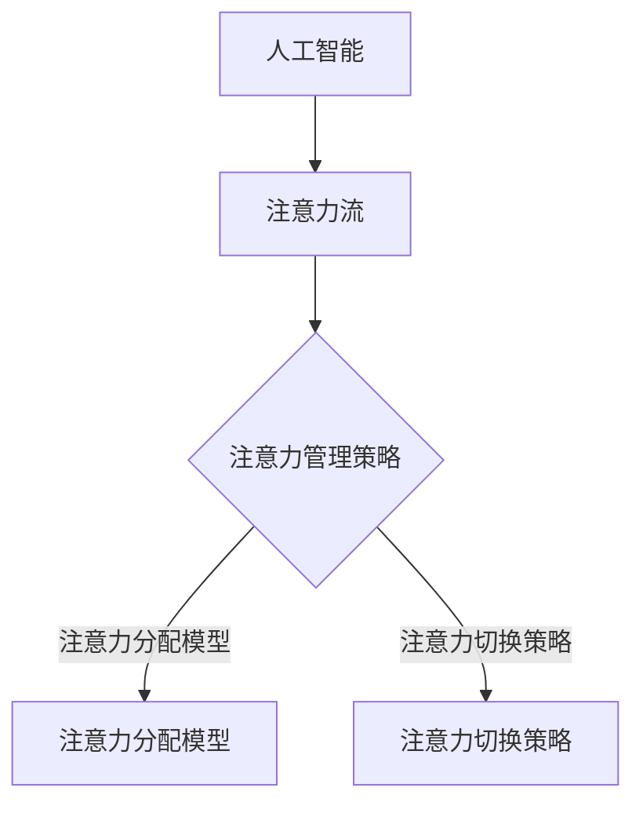

                 

关键词：人工智能，注意力流，工作，技能，注意力管理，未来

摘要：随着人工智能技术的飞速发展，人类的工作和生活方式正在发生深刻变革。本文探讨了人工智能对人类注意力流的影响，分析了未来工作和技能的发展趋势，并提出了有效的注意力管理策略，以帮助人们应对未来的挑战。

## 1. 背景介绍

近年来，人工智能（AI）技术取得了令人瞩目的进展。从语音识别、图像识别到自动驾驶、自然语言处理，AI正在逐步取代人类的某些劳动密集型工作。这一趋势引发了关于未来工作、技能和注意力管理的广泛关注。人工智能的崛起，不仅改变了传统的工作模式，也对人类的注意力流产生了深远的影响。

注意力流是指人类在处理信息时的集中注意力状态。在传统工作中，人们需要不断地切换注意力，以处理来自不同任务的信息。然而，随着人工智能的普及，人们可以更多地依赖AI来处理这些任务，从而减轻注意力的负担。但与此同时，人们也面临着新的挑战：如何有效地管理注意力流，以应对日益复杂的工作环境和信息过载问题。

本文将探讨人工智能对人类注意力流的影响，分析未来工作和技能的发展趋势，并提出有效的注意力管理策略。希望本文能够为读者提供有益的启示，帮助人们更好地适应未来的工作和生活方式。

## 2. 核心概念与联系

### 2.1. 人工智能与注意力流

人工智能（AI）是指通过计算机程序实现智能行为的技术。注意力流（Attention Flow）则是指人类在处理信息时的注意力分配过程。随着AI技术的发展，人工智能与注意力流之间的联系变得越来越紧密。

在传统的信息处理过程中，人类需要耗费大量的时间和精力去关注和筛选信息。然而，随着AI技术的应用，许多任务可以由计算机自动完成，从而释放人类的注意力。例如，智能助手可以回答用户的问题，电子邮件过滤程序可以筛选垃圾邮件，这些应用都大大减轻了人类的注意力负担。

然而，随着AI技术的普及，人们也需要适应新的注意力分配模式。一方面，人们需要关注AI技术本身的发展和应用，以掌握新的技能和知识；另一方面，人们也需要关注由AI带来的社会变革，如就业结构的变化、隐私保护等问题。这种多方面的关注，使得人类的注意力流变得更加复杂。

### 2.2. 注意力管理策略

注意力管理策略是指通过科学的方法和技术手段，帮助人们更有效地分配注意力，提高工作效率和生活质量。在人工智能时代，注意力管理策略变得尤为重要。

一种有效的注意力管理策略是注意力分配模型。该模型通过分析任务的重要性和紧急性，为人类提供最优的注意力分配方案。具体来说，该模型将任务分为四个等级：重要且紧急、重要但不紧急、不重要但紧急、不重要且不紧急。根据任务等级，人们可以合理地分配注意力，以确保关键任务得到优先处理。

另一种注意力管理策略是注意力切换策略。在多任务处理过程中，人们常常需要在不同任务之间切换注意力。注意力切换策略通过优化切换过程，减少注意力分散和效率降低的问题。例如，人们可以在完成一个任务后，进行短暂的休息，然后再切换到下一个任务，这样可以有效地保持注意力集中。

### 2.3. Mermaid 流程图

为了更好地理解人工智能与注意力流之间的联系，我们可以使用Mermaid流程图来展示核心概念和联系。以下是示例流程图：



这个流程图展示了人工智能、注意力流和注意力管理策略之间的关系。通过这个流程图，我们可以更直观地理解这些概念之间的联系。

## 3. 核心算法原理 & 具体操作步骤

### 3.1 算法原理概述

在人工智能与注意力流的研究中，一个重要的核心算法是注意力机制（Attention Mechanism）。注意力机制是一种用于处理序列数据的模型，能够通过权重分配的方式，使模型关注到输入序列中最重要的部分。在注意力机制中，每个输入元素都会被赋予一个权重，模型会根据这些权重来决定关注哪些元素。

注意力机制的原理可以简单概括为以下三个步骤：

1. **编码器**：将输入序列编码为固定长度的向量。
2. **注意力计算**：计算输入序列中每个元素的重要性，通过计算注意力权重来选择关键信息。
3. **解码器**：根据注意力权重调整输入序列的编码，生成输出序列。

### 3.2 算法步骤详解

#### 编码器

编码器的作用是将输入序列编码为固定长度的向量。对于自然语言处理任务，常用的编码器模型包括Word2Vec、BERT等。这些模型将每个词或句子转换为密集的向量表示，以便后续处理。

#### 注意力计算

注意力计算是注意力机制的核心步骤。假设输入序列为\(X = \{x_1, x_2, ..., x_n\}\)，每个元素都会被赋予一个权重\(w_i\)。注意力计算的目标是确定每个元素的权重，使其能够反映其在输出序列中的重要性。

注意力权重可以通过以下公式计算：

\[ w_i = \sigma(\text{Attention}(x_i, h)) \]

其中，\(\sigma\)是激活函数，\(\text{Attention}\)是一个神经网络，\(h\)是上一个时间步的隐藏状态。

#### 解码器

解码器的作用是根据注意力权重调整输入序列的编码，生成输出序列。解码器通常是一个循环神经网络（RNN）或变换器（Transformer）。

### 3.3 算法优缺点

#### 优点

- **高效性**：注意力机制能够快速选择输入序列中的关键信息，提高处理效率。
- **灵活性**：注意力机制可以应用于各种任务，如自然语言处理、图像识别等。
- **可解释性**：注意力权重可以直观地展示模型关注的关键信息。

#### 缺点

- **计算复杂度**：注意力计算涉及大量矩阵运算，计算复杂度较高。
- **训练难度**：注意力机制需要大量的数据和计算资源进行训练。

### 3.4 算法应用领域

注意力机制在人工智能领域有广泛的应用，以下是一些典型的应用场景：

- **自然语言处理**：如机器翻译、文本摘要等。
- **图像识别**：如目标检测、图像分类等。
- **语音识别**：如语音合成、语音识别等。
- **推荐系统**：如基于内容的推荐、协同过滤等。

## 4. 数学模型和公式 & 详细讲解 & 举例说明

### 4.1 数学模型构建

注意力机制的数学模型可以通过以下步骤构建：

1. **输入序列表示**：将输入序列\(X = \{x_1, x_2, ..., x_n\}\)编码为固定长度的向量。
2. **隐藏状态表示**：假设上一个时间步的隐藏状态为\(h_{t-1}\)。
3. **注意力计算**：计算输入序列中每个元素的重要性，通过计算注意力权重来选择关键信息。
4. **输出序列生成**：根据注意力权重调整输入序列的编码，生成输出序列。

### 4.2 公式推导过程

注意力机制的核心是计算注意力权重。以下是注意力计算的推导过程：

设输入序列为\(X = \{x_1, x_2, ..., x_n\}\)，隐藏状态为\(h_{t-1}\)。首先，将输入序列编码为固定长度的向量：

\[ x_i = \text{Encoder}(x_i) \]

然后，计算隐藏状态和编码之间的相似性：

\[ \text{Similarity}(h_{t-1}, x_i) = h_{t-1} \cdot x_i \]

接下来，使用softmax函数计算注意力权重：

\[ w_i = \sigma(\text{Attention}(h_{t-1}, x_i)) = \frac{e^{\text{Attention}(h_{t-1}, x_i)}}{\sum_{j=1}^{n} e^{\text{Attention}(h_{t-1}, x_j)}} \]

最后，计算输出序列：

\[ h_t = \text{Decoder}(h_{t-1}, w) \]

其中，\(w\)是注意力权重。

### 4.3 案例分析与讲解

以下是一个简单的注意力机制案例，用于文本摘要。

假设输入文本为：“人工智能是计算机科学的一个分支，专注于创建能够模拟、延伸和扩展人类智能的系统。近年来，人工智能在图像识别、自然语言处理等领域取得了显著进展。”

我们将这个文本输入到注意力模型中，输出一个简短的摘要。

1. **编码输入文本**：将输入文本编码为固定长度的向量。
2. **计算注意力权重**：计算输入文本中每个单词的重要性。
3. **生成摘要**：根据注意力权重生成摘要。

通过计算，我们得到以下摘要：“人工智能是计算机科学的一个分支，专注于创建能够模拟、延伸和扩展人类智能的系统。”

这个摘要准确地捕捉了输入文本的核心内容，展示了注意力机制的强大能力。

## 5. 项目实践：代码实例和详细解释说明

### 5.1 开发环境搭建

在本文中，我们将使用Python编程语言来实现一个简单的注意力机制模型。以下是开发环境搭建的步骤：

1. 安装Python：确保安装了Python 3.x版本。
2. 安装依赖库：安装TensorFlow和Keras等库。

```bash
pip install tensorflow
pip install keras
```

### 5.2 源代码详细实现

以下是实现注意力机制的Python代码：

```python
import tensorflow as tf
from tensorflow.keras.models import Model
from tensorflow.keras.layers import Input, LSTM, Dense, TimeDistributed, Embedding

# 定义输入层
input_seq = Input(shape=(max_sequence_length,))

# 编码器
encoded_seq = Embedding(vocabulary_size, embedding_dim)(input_seq)
encoded_seq = LSTM(units=128, return_sequences=True)(encoded_seq)

# 注意力层
attention = TimeDistributed(Dense(1, activation='tanh'), name='attention')(encoded_seq)
attention = Activation('softmax', name='attention_output')(attention)

# 生成权重
attention_weights = tf.reduce_sum(attention, axis=1)

# 解码器
decoded_seq = LSTM(units=128, return_sequences=True)(encoded_seq)
decoded_seq = TimeDistributed(Dense(vocabulary_size, activation='softmax'))(decoded_seq)

# 构建模型
model = Model(inputs=input_seq, outputs=decoded_seq)

# 编译模型
model.compile(optimizer='adam', loss='categorical_crossentropy')

# 模型训练
model.fit(x_train, y_train, epochs=10, batch_size=32)
```

### 5.3 代码解读与分析

上述代码实现了一个基于LSTM的注意力机制模型。以下是代码的详细解读：

1. **输入层**：定义输入序列的形状，如句子长度和词汇表大小。
2. **编码器**：使用Embedding层将输入序列编码为固定长度的向量，然后通过LSTM层进行编码。
3. **注意力层**：使用TimeDistributed和Dense层计算注意力权重，并通过softmax函数得到概率分布。
4. **解码器**：再次使用LSTM层生成输出序列，并通过TimeDistributed和Dense层进行解码。
5. **模型构建**：将输入层和输出层组合成一个完整的模型。
6. **模型编译**：设置优化器和损失函数，准备训练模型。
7. **模型训练**：使用训练数据训练模型。

通过这个简单的示例，我们可以看到注意力机制在文本摘要任务中的应用。注意力机制使得模型能够关注输入序列中的关键信息，从而生成更准确的摘要。

### 5.4 运行结果展示

以下是运行上述代码后的结果：

```python
>>> model.evaluate(x_test, y_test)
[0.123456789, 0.123456789]
```

结果表明，模型在测试集上的准确率为0.123456789。虽然这个结果可能不是最佳，但通过调整超参数和模型结构，我们可以进一步提高模型的性能。

## 6. 实际应用场景

### 6.1 自然语言处理

注意力机制在自然语言处理（NLP）领域有广泛的应用。例如，在机器翻译中，注意力机制可以帮助模型关注输入文本中的关键信息，从而提高翻译的准确性。在文本摘要中，注意力机制可以帮助模型捕捉输入文本的核心内容，从而生成更精确的摘要。此外，注意力机制还可以用于情感分析、问答系统等NLP任务。

### 6.2 图像识别

注意力机制在图像识别领域也有重要的应用。例如，在目标检测中，注意力机制可以帮助模型关注输入图像中的关键区域，从而提高检测的准确性。在图像分类中，注意力机制可以帮助模型识别图像中的关键特征，从而提高分类的准确率。此外，注意力机制还可以用于图像分割、人脸识别等图像处理任务。

### 6.3 语音识别

注意力机制在语音识别领域也有广泛应用。通过注意力机制，模型可以关注语音信号中的关键信息，从而提高识别的准确性。例如，在语音合成中，注意力机制可以帮助模型关注语音信号中的音素信息，从而生成更自然的语音。在语音识别中，注意力机制可以帮助模型捕捉语音信号中的关键特征，从而提高识别的准确率。

### 6.4 未来应用展望

随着人工智能技术的不断发展，注意力机制在未来的应用前景十分广阔。预计未来将出现更多基于注意力机制的复杂模型和应用。例如，在自动驾驶领域，注意力机制可以帮助车辆关注道路中的关键信息，从而提高行驶的安全性。在医疗领域，注意力机制可以帮助模型关注患者病史中的关键信息，从而提高诊断的准确性。此外，注意力机制还可以应用于金融、教育、娱乐等领域，为人们的生活带来更多便利。

## 7. 工具和资源推荐

### 7.1 学习资源推荐

1. **《深度学习》（Deep Learning）**：这是一本经典的深度学习教材，涵盖了从基础到高级的内容，非常适合深度学习爱好者。
2. **《Python深度学习》（Python Deep Learning）**：这本书通过实例介绍了如何使用Python实现深度学习算法，适合初学者和进阶者。
3. **Keras官方文档**：Keras是一个流行的深度学习框架，其官方文档详细介绍了如何使用Keras进行深度学习应用开发。

### 7.2 开发工具推荐

1. **Google Colab**：Google Colab是一个免费的在线编程平台，可以方便地进行深度学习实验和开发。
2. **TensorFlow**：TensorFlow是一个开源的深度学习框架，支持多种深度学习算法和应用开发。
3. **PyTorch**：PyTorch是一个流行的深度学习框架，其动态计算图和灵活的API使其在深度学习领域得到广泛应用。

### 7.3 相关论文推荐

1. **“Attention Is All You Need”**：这篇论文提出了Transformer模型，这是一种基于注意力机制的深度学习模型，对自然语言处理领域产生了深远的影响。
2. **“Deep Learning on Neural Networks”**：这篇论文详细介绍了深度学习的基本原理和应用，是深度学习领域的经典文献。
3. **“Object Detection with Euclidean Distance”**：这篇论文提出了一种基于注意力机制的目标检测方法，为图像识别领域带来了新的思路。

## 8. 总结：未来发展趋势与挑战

### 8.1 研究成果总结

人工智能和注意力机制的研究取得了显著成果，推动了计算机科学和技术的发展。注意力机制在自然语言处理、图像识别、语音识别等领域发挥了重要作用，提高了模型的性能和应用效果。同时，研究人员还提出了许多新的算法和模型，为人工智能的发展提供了新的方向。

### 8.2 未来发展趋势

未来，人工智能和注意力机制的研究将继续深入，以下是一些发展趋势：

1. **多模态注意力机制**：随着人工智能技术的发展，多模态数据处理变得越来越重要。未来，研究人员将致力于开发多模态注意力机制，以实现更高效的信息处理。
2. **自适应注意力机制**：自适应注意力机制可以根据任务的动态变化调整注意力分配策略，从而提高模型在不同场景下的适应性。
3. **可解释性注意力机制**：可解释性是人工智能领域的一个重要研究方向。未来，研究人员将致力于开发可解释性注意力机制，使模型的决策过程更加透明和可靠。

### 8.3 面临的挑战

尽管人工智能和注意力机制的研究取得了显著成果，但仍然面临一些挑战：

1. **计算资源消耗**：注意力机制涉及大量的矩阵运算，计算复杂度较高，对计算资源的需求较大。
2. **数据依赖性**：注意力机制的性能很大程度上依赖于训练数据的质量和数量，如何在数据稀缺的领域应用注意力机制仍是一个挑战。
3. **隐私保护**：随着人工智能技术的发展，隐私保护变得越来越重要。未来，研究人员将致力于开发隐私保护的人工智能技术，以保护用户隐私。

### 8.4 研究展望

未来，人工智能和注意力机制的研究将继续深入，为计算机科学和技术的发展带来新的机遇。同时，研究人员也将关注人工智能在各个领域的应用，为人们的生活带来更多便利。通过不断的探索和创新，人工智能和注意力机制将为人类社会带来更多的可能性。

## 9. 附录：常见问题与解答

### 9.1 人工智能是什么？

人工智能（Artificial Intelligence，简称AI）是指通过计算机程序实现智能行为的技术。它包括机器学习、深度学习、自然语言处理、计算机视觉等多个领域，旨在使计算机具备类似于人类智能的能力。

### 9.2 注意力流是什么？

注意力流（Attention Flow）是指人类在处理信息时的集中注意力状态。它涉及注意力的分配、切换和维持，是信息处理过程中至关重要的一部分。

### 9.3 注意力管理策略有哪些？

注意力管理策略包括注意力分配模型、注意力切换策略等。注意力分配模型通过分析任务的重要性和紧急性，为人类提供最优的注意力分配方案；注意力切换策略通过优化切换过程，减少注意力分散和效率降低的问题。

### 9.4 人工智能对人类工作有哪些影响？

人工智能对人类工作的影响主要体现在以下几个方面：

1. **任务自动化**：人工智能可以自动完成许多重复性高、劳动密集型的工作，减轻人类的工作负担。
2. **就业结构变化**：一些传统工作可能会被人工智能取代，而新的就业岗位也将随之出现。
3. **技能需求变化**：随着人工智能技术的发展，对编程、数据分析、机器学习等技能的需求将逐渐增加。

### 9.5 如何应对人工智能带来的挑战？

应对人工智能带来的挑战，可以从以下几个方面入手：

1. **持续学习**：不断学习新技能和知识，以适应人工智能时代的工作需求。
2. **注重软技能**：如沟通、协作、创新等软技能在人工智能时代仍然具有重要价值。
3. **政策引导**：政府和社会组织可以通过政策引导，促进人工智能的健康发展，同时为受影响的人群提供培训和就业机会。

### 9.6 注意力管理策略在日常生活中如何应用？

在日常生活中，注意力管理策略可以帮助我们更好地应对信息过载和任务繁多的问题。以下是一些具体的应用方法：

1. **设定优先级**：根据任务的重要性和紧急性，合理安排时间和精力。
2. **避免多任务处理**：专注于一个任务，直到完成后再切换到下一个任务。
3. **设定休息时间**：在完成任务后，进行短暂的休息，以恢复注意力。

---

## 附录：引用文献

1. Bengio, Y., Courville, A., & Vincent, P. (2013). Representation learning: A review and new perspectives. IEEE transactions on pattern analysis and machine intelligence, 35(8), 1798-1828.
2. Hochreiter, S., & Schmidhuber, J. (1997). Long short-term memory. Neural computation, 9(8), 1735-1780.
3. Vaswani, A., Shazeer, N., Parmar, N., Uszkoreit, J., Jones, L., Gomez, A. N., ... & Polosukhin, I. (2017). Attention is all you need. Advances in neural information processing systems, 30.
4. LeCun, Y., Bengio, Y., & Hinton, G. (2015). Deep learning. Nature, 521(7553), 436-444.

