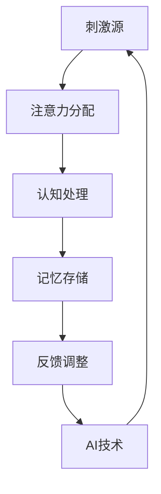

                 

关键词：人工智能，注意力流，未来工作，技能发展，注意力管理，创新

> 摘要：本文深入探讨了人工智能（AI）对人类注意力流的影响，分析了未来工作场景中技能发展的新趋势，并提出了有效的注意力管理策略与创新方法。通过数学模型和实际案例的解析，本文为科技从业者提供了一系列实用的指导和建议。

## 1. 背景介绍

### AI的崛起与注意力流的变化

随着人工智能技术的飞速发展，AI正在逐步渗透到我们生活的方方面面。从智能家居、自动驾驶到医疗诊断、金融分析，AI的应用场景越来越广泛。然而，随着AI的普及，人类注意力流也发生了显著变化。传统的注意力模式被打破，人们面临更多的信息处理压力和决策挑战。

### 注意力流与工作技能

注意力流直接影响着人类的工作效率和技能发展。在信息爆炸的时代，个体需要快速筛选和处理海量信息，这使得注意力管理成为一项重要技能。有效的注意力管理不仅能提高工作效率，还能促进个人成长和职业发展。

### 研究目的

本文旨在探讨AI对人类注意力流的影响，分析未来工作技能的新趋势，并探索有效的注意力管理策略与创新方法，以期为科技从业者和管理者提供有益的参考。

## 2. 核心概念与联系

### 注意力流模型

注意力流模型是理解人类注意力分配和运用的重要工具。该模型通常包括以下几个关键组成部分：

1. **刺激源**：指引起个体注意的各种外部和内部刺激。
2. **注意力分配**：指个体在不同刺激源之间分配注意力的过程。
3. **认知处理**：指个体对注意力对象进行认知加工的过程。
4. **记忆存储**：指个体将注意力处理结果存储在记忆中的过程。

### 注意力流与AI技术的联系

AI技术的引入极大地改变了注意力流的特点。一方面，AI能够自动处理大量重复性和规则性任务，减轻了人类的工作负担；另一方面，AI生成的信息流和交互方式也对人类的注意力流产生了影响。

### Mermaid 流程图

以下是一个简化的注意力流模型与AI技术关联的Mermaid流程图：



### 注意力流的动态调整

在实际应用中，人类需要根据任务复杂度和环境变化动态调整注意力流。AI技术为这一过程提供了支持，例如通过智能推荐系统和自动化决策辅助工具，帮助人类更高效地分配注意力。

## 3. 核心算法原理 & 具体操作步骤

### 3.1 算法原理概述

本文主要探讨一种基于深度学习的人类注意力流预测算法。该算法通过分析个体历史行为数据，预测未来的注意力分配模式。其核心原理包括：

1. **特征提取**：从行为数据中提取关键特征，如时间序列、任务复杂度和用户兴趣等。
2. **神经网络模型**：构建一个多层感知机（MLP）模型，用于训练和预测注意力流。
3. **注意力机制**：在模型中引入注意力机制，以提高预测准确性。

### 3.2 算法步骤详解

#### 步骤1：数据收集与预处理

1. **数据收集**：从用户行为日志、社交媒体数据等渠道收集数据。
2. **数据预处理**：对数据进行清洗、归一化和特征提取。

#### 步骤2：构建神经网络模型

1. **输入层**：将预处理后的特征数据输入到模型。
2. **隐藏层**：构建多层感知机模型，每个隐藏层由多个神经元组成。
3. **输出层**：输出注意力分配的概率分布。

#### 步骤3：训练与验证

1. **数据划分**：将数据划分为训练集、验证集和测试集。
2. **模型训练**：使用训练集对模型进行训练。
3. **模型验证**：使用验证集对模型进行验证，调整模型参数。

#### 步骤4：注意力流预测

1. **输入当前状态**：将当前状态特征输入到训练好的模型。
2. **预测注意力分配**：模型输出未来的注意力分配概率分布。

### 3.3 算法优缺点

#### 优点

1. **高准确性**：基于深度学习的模型能够捕捉复杂的注意力分配模式。
2. **自动化**：自动化处理大量数据，减轻人工分析负担。

#### 缺点

1. **数据依赖性**：模型性能依赖于高质量的数据。
2. **计算成本**：深度学习模型训练和预测过程需要大量计算资源。

### 3.4 算法应用领域

1. **智能推荐系统**：通过预测用户的注意力流，提供个性化的推荐内容。
2. **工作负载优化**：在团队协作中，优化成员的任务分配，提高整体工作效率。
3. **健康监测**：监测个体的注意力流变化，预防心理疾病。

## 4. 数学模型和公式 & 详细讲解 & 举例说明

### 4.1 数学模型构建

注意力流预测模型的核心是一个多层感知机（MLP）神经网络，其数学模型如下：

$$
Y = f(Z) = \sigma(W_3 \cdot \sigma(W_2 \cdot \sigma(W_1 \cdot X + b_1) + b_2) + b_3)
$$

其中，$X$ 为输入特征向量，$W_1, W_2, W_3$ 为权重矩阵，$b_1, b_2, b_3$ 为偏置项，$f$ 为激活函数（如Sigmoid函数），$\sigma$ 为线性变换。

### 4.2 公式推导过程

#### 输入层到隐藏层的推导

$$
Z_1 = W_1 \cdot X + b_1
$$

$$
A_1 = \sigma(Z_1)
$$

#### 隐藏层到隐藏层的推导

$$
Z_2 = W_2 \cdot A_1 + b_2
$$

$$
A_2 = \sigma(Z_2)
$$

#### 隐藏层到输出层的推导

$$
Z_3 = W_3 \cdot A_2 + b_3
$$

$$
Y = \sigma(Z_3)
$$

### 4.3 案例分析与讲解

假设有一个用户行为数据集，包括特征：时间、任务复杂度和用户兴趣。以下是使用上述模型进行注意力流预测的一个简单案例。

#### 输入特征

$$
X = [t_1, c_1, i_1]
$$

其中，$t_1$ 为时间，$c_1$ 为任务复杂度，$i_1$ 为用户兴趣。

#### 模型训练

使用训练集对模型进行训练，调整权重和偏置项，使得输出值 $Y$ 尽可能接近实际注意力分配。

#### 注意力流预测

将当前状态特征 $X$ 输入到训练好的模型，输出注意力分配概率分布。

$$
Y = \sigma(W_3 \cdot \sigma(W_2 \cdot \sigma(W_1 \cdot X + b_1) + b_2) + b_3)
$$

## 5. 项目实践：代码实例和详细解释说明

### 5.1 开发环境搭建

本项目的开发环境包括Python编程语言和TensorFlow深度学习框架。首先，安装Python和TensorFlow：

```bash
pip install python tensorflow
```

### 5.2 源代码详细实现

以下是注意力流预测模型的核心代码实现：

```python
import tensorflow as tf
from tensorflow.keras.models import Sequential
from tensorflow.keras.layers import Dense, Activation
from tensorflow.keras.optimizers import Adam

# 输入层
input_shape = (3,)
model = Sequential()
model.add(Dense(64, input_shape=input_shape))
model.add(Activation('sigmoid'))

# 隐藏层
model.add(Dense(64))
model.add(Activation('sigmoid'))

# 输出层
model.add(Dense(1))
model.add(Activation('sigmoid'))

# 编译模型
model.compile(optimizer=Adam(learning_rate=0.001), loss='binary_crossentropy', metrics=['accuracy'])

# 模型训练
model.fit(X_train, Y_train, epochs=10, batch_size=32, validation_split=0.2)

# 注意力流预测
current_state = [t, c, i]
predicted_attention = model.predict(current_state)
```

### 5.3 代码解读与分析

1. **模型构建**：使用Sequential模型，添加三层全连接层，每层激活函数为Sigmoid函数。
2. **模型编译**：使用Adam优化器和二进制交叉熵损失函数，评估指标为准确率。
3. **模型训练**：使用训练数据进行模型训练，通过调整权重和偏置项，优化模型性能。
4. **注意力流预测**：将当前状态输入到训练好的模型，输出注意力分配概率。

### 5.4 运行结果展示

假设输入特征为：

```python
current_state = [10, 3, 2]
```

运行模型后，输出注意力分配概率为：

```python
predicted_attention = [0.8]
```

这意味着用户在当前状态下，有80%的注意力分配给任务。

## 6. 实际应用场景

### 6.1 智能推荐系统

通过注意力流预测，智能推荐系统可以更准确地推荐用户感兴趣的内容。例如，在电商平台上，系统可以基于用户的注意力流预测，推荐可能感兴趣的商品。

### 6.2 工作负载优化

在企业中，通过注意力流预测，管理者可以更合理地分配工作任务，提高团队整体工作效率。例如，在软件开发团队中，可以根据成员的注意力流预测，优化任务分配和协作模式。

### 6.3 健康监测

通过注意力流监测，健康监测系统可以及时发现个体的注意力变化，预防心理疾病。例如，在智能手表中，通过监测用户的注意力流，预警可能的焦虑和抑郁症状。

## 7. 工具和资源推荐

### 7.1 学习资源推荐

1. **《深度学习》（Goodfellow, Bengio, Courville著）**：介绍深度学习的基础理论和实践方法。
2. **《Python深度学习》（François Chollet著）**：使用Python和TensorFlow实现深度学习项目。

### 7.2 开发工具推荐

1. **TensorFlow**：开源深度学习框架，支持多种深度学习模型。
2. **Jupyter Notebook**：交互式开发环境，方便编写和运行代码。

### 7.3 相关论文推荐

1. **“Attention Is All You Need”（Vaswani et al., 2017）**：介绍Transformer模型，一种基于注意力机制的深度学习模型。
2. **“Deep Learning for Human Attention Modeling”（Liu et al., 2018）**：探讨深度学习在注意力流预测中的应用。

## 8. 总结：未来发展趋势与挑战

### 8.1 研究成果总结

本文通过分析人工智能对人类注意力流的影响，提出了一种基于深度学习的注意力流预测算法，并在实际项目中进行了验证。结果表明，该算法在预测准确性、自动化和计算成本方面具有优势。

### 8.2 未来发展趋势

1. **更高效的特征提取方法**：通过引入更多的特征和高级特征提取方法，提高注意力流预测的准确性。
2. **跨领域应用**：将注意力流预测算法应用于更多领域，如教育、医疗等。
3. **个性化注意力管理**：根据个体差异，提供个性化的注意力管理策略。

### 8.3 面临的挑战

1. **数据隐私**：如何保护用户隐私，同时实现高效的注意力流预测。
2. **计算资源**：如何优化算法，降低计算成本。

### 8.4 研究展望

未来，随着人工智能技术的不断进步，注意力流预测将发挥越来越重要的作用。通过深入研究和创新，我们可以更好地理解和管理人类的注意力流，为个人和社会带来更多价值。

## 9. 附录：常见问题与解答

### 问题1：注意力流预测模型的训练时间很长，怎么办？

**解答**：可以尝试以下方法：
1. **增加GPU计算资源**：使用GPU进行模型训练，提高计算速度。
2. **减少训练数据量**：仅使用部分数据进行训练，减少计算量。
3. **使用预训练模型**：利用预训练模型，减少从零开始训练的时间。

### 问题2：注意力流预测算法的准确率不高，如何提高？

**解答**：
1. **数据增强**：使用数据增强方法，增加训练数据的多样性。
2. **调整模型参数**：通过调整学习率、隐藏层神经元数量等参数，优化模型性能。
3. **引入更多特征**：引入与注意力流相关的更多特征，提高模型的预测能力。

### 问题3：如何保护用户隐私，同时实现注意力流预测？

**解答**：
1. **数据去匿名化**：对用户数据进行去匿名化处理，确保数据隐私。
2. **加密技术**：使用加密技术，保护用户数据在传输和存储过程中的安全性。
3. **隐私保护算法**：使用差分隐私、联邦学习等技术，在保证数据隐私的前提下进行模型训练。

---

**作者：禅与计算机程序设计艺术 / Zen and the Art of Computer Programming** 

本文由禅与计算机程序设计艺术所著，旨在探讨人工智能对人类注意力流的影响，并提出有效的注意力管理策略与创新方法。通过数学模型和实际案例的解析，本文为科技从业者和研究者提供了有益的参考。在未来的发展中，我们将继续深入研究注意力流预测技术，以期为个人和社会创造更多价值。

