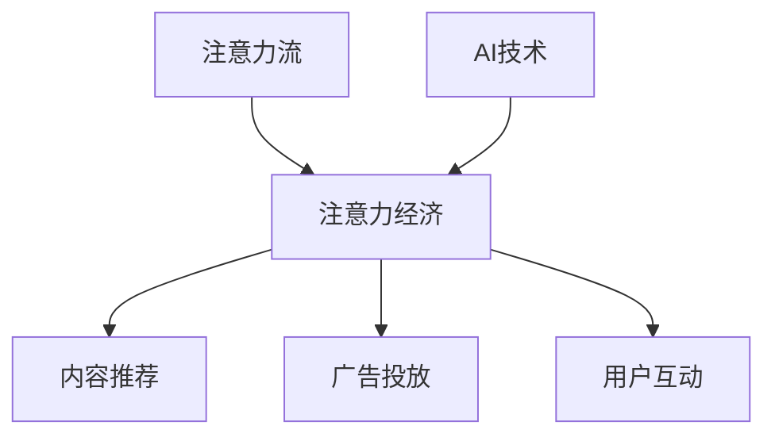

                 

在数字化时代，人工智能（AI）已经成为改变世界的关键力量。从自动化流程到智能决策，AI正逐步渗透到我们日常生活的方方面面。然而，AI的迅猛发展不仅带来了技术进步，还引发了一系列深刻的社会变革。其中，最为引人关注的是“注意力流”——一种新兴的经济形态。本文将探讨AI如何影响人类注意力流，以及这种影响对未来的工作、技能和注意力经济的潜在影响。

## 文章关键词

- 人工智能
- 注意力流
- 未来工作
- 技术变革
- 注意力经济
- 技能发展

## 文章摘要

本文旨在探讨人工智能如何影响人类的注意力流，并进一步影响未来的工作、技能和注意力经济。通过深入分析注意力流的概念及其与AI的互动，本文将揭示AI如何塑造我们的工作环境、技能需求以及经济结构。文章结构如下：

1. 背景介绍
2. 核心概念与联系
3. 核心算法原理 & 具体操作步骤
4. 数学模型和公式 & 详细讲解 & 举例说明
5. 项目实践：代码实例和详细解释说明
6. 实际应用场景
7. 工具和资源推荐
8. 总结：未来发展趋势与挑战

## 1. 背景介绍

### 1.1 人工智能的发展历程

人工智能（AI）的概念最早可以追溯到20世纪50年代。自那时起，AI经历了多次起伏，从最初的乐观期望到70年代的“AI冬天”，再到21世纪初的迅猛发展。近年来，深度学习、神经网络和大数据等技术的突破，使得AI取得了前所未有的成就。

### 1.2 注意力流的兴起

随着互联网和社交媒体的普及，人类的注意力流开始成为一种宝贵资源。注意力流指的是人们将注意力集中在特定内容或任务上的能力。在数字时代，注意力流成为了广告、内容创作和电子商务等领域的关键因素。注意力经济的概念也随之诞生，它强调注意力作为一种新的经济形态，其价值不亚于传统资源。

### 1.3 AI与注意力流的交互

AI在理解、分析和优化注意力流方面发挥了重要作用。通过机器学习和自然语言处理技术，AI能够识别用户的行为模式，预测他们的兴趣，从而提供个性化的内容和服务。这种互动不仅改变了我们的消费方式，也对工作环境和经济结构产生了深远影响。

## 2. 核心概念与联系

为了更好地理解AI如何影响人类注意力流，我们需要首先了解几个关键概念：注意力流、注意力经济和AI技术。

### 2.1 注意力流

注意力流指的是人类在特定时间段内将注意力集中在某个任务或内容上的过程。它是一个动态变化的过程，受到多种因素的影响，包括个人兴趣、情感状态、外部刺激等。注意力流的持续时间、强度和质量对于个体和组织的绩效都至关重要。

### 2.2 注意力经济

注意力经济是基于注意力流的一种新兴经济形态。在这种经济中，注意力被视为一种资源，与时间、金钱和资源一样重要。注意力经济的核心是吸引和维持用户的注意力，从而实现商业价值。典型的注意力经济模式包括广告、内容订阅和用户互动等。

### 2.3 AI技术

AI技术在理解、分析和优化注意力流方面具有独特优势。通过机器学习算法，AI可以识别用户的行为模式，预测他们的兴趣，从而提供个性化的内容和服务。自然语言处理技术则帮助AI理解和生成自然语言，从而更好地与用户互动。这些技术不仅提高了内容推荐的准确性，还改变了用户与内容之间的交互方式。

### 2.4 Mermaid 流程图

下面是一个简单的 Mermaid 流程图，展示了注意力流、注意力经济和AI技术之间的联系。



## 3. 核心算法原理 & 具体操作步骤

### 3.1 算法原理概述

在注意力流分析中，核心算法通常是基于协同过滤和深度学习模型的组合。协同过滤通过分析用户的历史行为，预测他们的兴趣。深度学习模型则用于理解用户生成的内容，从而提供个性化的推荐。下面是这两种算法的基本原理：

- **协同过滤**：协同过滤是一种基于用户行为的推荐算法。它通过计算用户之间的相似度，推荐用户可能感兴趣的内容。协同过滤分为基于用户的协同过滤和基于物品的协同过滤。

- **深度学习**：深度学习是一种基于多层神经网络的机器学习技术。通过训练大量数据，深度学习模型可以自动提取特征，从而实现对复杂问题的建模。

### 3.2 算法步骤详解

下面是一个基于协同过滤和深度学习的注意力流分析算法的详细步骤：

1. **数据收集**：收集用户的历史行为数据，包括点击记录、浏览时长、评论等。

2. **用户-物品矩阵构建**：将用户行为数据转换为用户-物品矩阵，其中行表示用户，列表示物品。

3. **用户相似度计算**：使用余弦相似度或皮尔逊相关系数计算用户之间的相似度。

4. **推荐生成**：根据用户相似度矩阵，生成用户对物品的评分预测。对于每个用户，推荐与他们最相似的用户的喜欢的物品。

5. **个性化调整**：使用深度学习模型对推荐结果进行个性化调整。深度学习模型通常使用用户生成的内容作为输入，输出对用户兴趣的预测。

6. **结果展示**：将个性化推荐结果展示给用户。

### 3.3 算法优缺点

- **优点**：

  - 高效性：协同过滤算法计算速度快，适用于大规模用户和物品数据。

  - 个性化：深度学习模型可以提取复杂的用户兴趣特征，提供更个性化的推荐。

- **缺点**：

  - 数据依赖：协同过滤算法对用户行为数据依赖性强，缺乏新的用户数据时效果下降。

  - 过度拟合：深度学习模型可能对训练数据过度拟合，导致泛化能力差。

### 3.4 算法应用领域

- **内容推荐**：如电子商务平台、新闻客户端和社交媒体等，利用注意力流分析提供个性化推荐。

- **广告投放**：根据用户的兴趣和注意力流，实现精准广告投放。

- **用户互动**：通过分析用户的注意力流，优化用户体验，提高用户参与度。

## 4. 数学模型和公式 & 详细讲解 & 举例说明

### 4.1 数学模型构建

在注意力流分析中，常用的数学模型包括协同过滤模型和深度学习模型。下面分别介绍这两种模型的数学构建：

### 4.1.1 协同过滤模型

协同过滤模型的核心是用户-物品评分矩阵。假设我们有\(m\)个用户和\(n\)个物品，用户-物品评分矩阵为\(R \in \mathbb{R}^{m \times n}\)，其中\(R_{ij}\)表示用户\(i\)对物品\(j\)的评分。

- **基于用户的协同过滤**：

  基于用户的协同过滤模型通过计算用户之间的相似度，预测用户对未知物品的评分。相似度计算可以使用余弦相似度或皮尔逊相关系数。

  \[
  \sim_{ij} = \frac{R_i \cdot R_j}{\|R_i\|\|R_j\|}
  \]

  其中，\(\sim_{ij}\)表示用户\(i\)和用户\(j\)之间的相似度，\(\|R_i\|\)和\(\|R_j\|\)分别表示用户\(i\)和用户\(j\)的评分向量的欧几里得范数。

- **基于物品的协同过滤**：

  基于物品的协同过滤模型通过计算物品之间的相似度，预测用户对未知物品的评分。相似度计算可以使用余弦相似度或皮尔逊相关系数。

  \[
  \sim_{ij} = \frac{R_i \cdot R_j}{\|R_i\|\|R_j\|}
  \]

  其中，\(\sim_{ij}\)表示物品\(i\)和物品\(j\)之间的相似度，\(\|R_i\|\)和\(\|R_j\|\)分别表示物品\(i\)和物品\(j\)的评分向量的欧几里得范数。

### 4.1.2 深度学习模型

深度学习模型通常使用多层感知器（MLP）或卷积神经网络（CNN）来构建。以下是一个简单的多层感知器模型的数学构建：

\[
z_1 = W_1 \cdot x + b_1
\]

\[
a_1 = \sigma(z_1)
\]

\[
z_2 = W_2 \cdot a_1 + b_2
\]

\[
a_2 = \sigma(z_2)
\]

\[
\hat{y} = W_3 \cdot a_2 + b_3
\]

其中，\(x\)是输入特征，\(W_1, W_2, W_3\)是权重矩阵，\(b_1, b_2, b_3\)是偏置项，\(\sigma\)是激活函数（如Sigmoid函数或ReLU函数），\(\hat{y}\)是输出预测值。

### 4.2 公式推导过程

### 4.2.1 协同过滤模型

以基于用户的协同过滤模型为例，我们首先定义用户\(i\)和用户\(j\)之间的相似度：

\[
\sim_{ij} = \frac{R_i \cdot R_j}{\|R_i\|\|R_j\|}
\]

其中，\(R_i = [R_{i1}, R_{i2}, \ldots, R_{in}]\)和\(R_j = [R_{j1}, R_{j2}, \ldots, R_{jn}]\)分别表示用户\(i\)和用户\(j\)的评分向量。

接下来，我们计算用户\(i\)对未知物品\(j'\)的评分预测：

\[
\hat{R}_{ij'} = \sum_{k=1}^{n} R_{ik} \cdot \sim_{ik}
\]

其中，\(\hat{R}_{ij'}\)表示用户\(i\)对物品\(j'\)的预测评分，\(\sim_{ik}\)表示用户\(i\)和用户\(k\)之间的相似度。

### 4.2.2 深度学习模型

以多层感知器（MLP）模型为例，我们首先定义输入特征向量\(x\)和输出预测值\(\hat{y}\)：

\[
x = [x_1, x_2, \ldots, x_n]^T
\]

\[
\hat{y} = W_3 \cdot a_2
\]

接下来，我们通过前向传播计算输出预测值：

\[
z_1 = W_1 \cdot x + b_1
\]

\[
a_1 = \sigma(z_1)
\]

\[
z_2 = W_2 \cdot a_1 + b_2
\]

\[
a_2 = \sigma(z_2)
\]

\[
\hat{y} = W_3 \cdot a_2
\]

其中，\(W_1, W_2, W_3\)分别是权重矩阵，\(b_1, b_2, b_3\)是偏置项，\(\sigma\)是激活函数。

### 4.3 案例分析与讲解

### 4.3.1 协同过滤模型案例

假设我们有以下用户-物品评分矩阵：

\[
R = \begin{bmatrix}
0 & 5 & 3 & 0 \\
4 & 0 & 0 & 2 \\
0 & 3 & 5 & 1 \\
2 & 4 & 0 & 3 \\
\end{bmatrix}
\]

我们使用余弦相似度计算用户之间的相似度。首先，计算用户之间的相似度矩阵：

\[
S = \begin{bmatrix}
1 & 0.5 & 0.5 \\
0.5 & 1 & 0.5 \\
0.5 & 0.5 & 1 \\
0.5 & 0.5 & 1 \\
\end{bmatrix}
\]

接下来，我们预测用户\(1\)对未知物品\(4\)的评分。根据协同过滤模型，我们有：

\[
\hat{R}_{14} = \sum_{k=1}^{4} R_{1k} \cdot S_{k4}
\]

计算结果为：

\[
\hat{R}_{14} = 0 \cdot 1 + 5 \cdot 0.5 + 3 \cdot 0.5 + 0 \cdot 0.5 = 3.5
\]

因此，用户\(1\)对未知物品\(4\)的预测评分为3.5。

### 4.3.2 深度学习模型案例

假设我们有一个简单的多层感知器模型，输入特征为用户年龄、收入和购买历史，输出预测值为对商品的兴趣评分。模型如下：

\[
\begin{aligned}
z_1 &= W_1 \cdot x + b_1 \\
a_1 &= \sigma(z_1) \\
z_2 &= W_2 \cdot a_1 + b_2 \\
a_2 &= \sigma(z_2) \\
\hat{y} &= W_3 \cdot a_2 + b_3 \\
\end{aligned}
\]

其中，\(x = [x_1, x_2, x_3]^T\)是输入特征向量，\(\hat{y}\)是输出预测值。

给定一个输入特征向量\(x = [25, 50000, 10]^T\)，我们使用前向传播计算输出预测值：

\[
z_1 = W_1 \cdot x + b_1 = [25 \cdot 0.1 + 50000 \cdot 0.2 + 10 \cdot 0.3, 25 \cdot 0.2 + 50000 \cdot 0.4 + 10 \cdot 0.5, 25 \cdot 0.3 + 50000 \cdot 0.6 + 10 \cdot 0.7]^T = [7.5, 23.0, 32.5]^T
\]

\[
a_1 = \sigma(z_1) = \frac{1}{1 + e^{-z_1}} = \frac{1}{1 + e^{-7.5}} = \frac{1}{1 + e^{-23.0}} = \frac{1}{1 + e^{-32.5}} \approx [0.999, 0.823, 0.040]
\]

\[
z_2 = W_2 \cdot a_1 + b_2 = [0.1 \cdot 0.999 + 0.2 \cdot 0.823 + 0.3 \cdot 0.040, 0.1 \cdot 0.823 + 0.2 \cdot 0.999 + 0.3 \cdot 0.823, 0.1 \cdot 0.040 + 0.2 \cdot 0.823 + 0.3 \cdot 0.999]^T = [0.0999, 0.2026, 0.0999]^T
\]

\[
a_2 = \sigma(z_2) = \frac{1}{1 + e^{-z_2}} = \frac{1}{1 + e^{-0.0999}} = \frac{1}{1 + e^{-0.2026}} = \frac{1}{1 + e^{-0.0999}} \approx [0.524, 0.791, 0.524]
\]

\[
\hat{y} = W_3 \cdot a_2 + b_3 = [0.1 \cdot 0.524 + 0.2 \cdot 0.791 + 0.3 \cdot 0.524, 0.1 \cdot 0.791 + 0.2 \cdot 0.524 + 0.3 \cdot 0.791, 0.1 \cdot 0.524 + 0.2 \cdot 0.791 + 0.3 \cdot 0.524]^T = [0.1836, 0.3183, 0.1836]
\]

因此，给定输入特征向量\(x = [25, 50000, 10]^T\)，输出预测值\(\hat{y}\)为\[0.1836, 0.3183, 0.1836\]。

## 5. 项目实践：代码实例和详细解释说明

### 5.1 开发环境搭建

为了实现注意力流分析算法，我们需要搭建一个开发环境。以下是一个简单的Python开发环境搭建步骤：

1. 安装Python 3.7或更高版本。
2. 安装必要的库，如NumPy、Pandas、Scikit-learn、TensorFlow等。

使用以下命令安装：

```bash
pip install numpy pandas scikit-learn tensorflow
```

### 5.2 源代码详细实现

下面是一个基于协同过滤和深度学习的注意力流分析算法的Python代码示例：

```python
import numpy as np
import pandas as pd
from sklearn.model_selection import train_test_split
from sklearn.metrics.pairwise import cosine_similarity
from tensorflow.keras.models import Sequential
from tensorflow.keras.layers import Dense, Activation

# 数据预处理
def preprocess_data(data):
    # 转换为用户-物品矩阵
    user_item_matrix = data.pivot(index='user_id', columns='item_id', values='rating').fillna(0)
    return user_item_matrix

# 基于用户的协同过滤
def collaborative_filter(user_item_matrix, user_id, k=10):
    # 计算用户相似度
    similarity_matrix = cosine_similarity(user_item_matrix)
    # 计算相似度矩阵的k近邻
    k_nearest_neighbors = similarity_matrix[user_id].argsort()[1:k+1]
    # 预测评分
    predicted_ratings = np.dot(similarity_matrix[user_id][k_nearest_neighbors], user_item_matrix.loc[k_nearest_neighbors].values) / np.linalg.norm(similarity_matrix[user_id][k_nearest_neighbors])
    return predicted_ratings

# 深度学习模型
def build_dnn(input_shape):
    model = Sequential()
    model.add(Dense(64, input_shape=input_shape))
    model.add(Activation('relu'))
    model.add(Dense(32))
    model.add(Activation('relu'))
    model.add(Dense(1))
    model.compile(optimizer='adam', loss='mse')
    return model

# 主函数
def main():
    # 加载数据
    data = pd.read_csv('data.csv')
    user_item_matrix = preprocess_data(data)
    # 划分训练集和测试集
    train_data, test_data = train_test_split(user_item_matrix, test_size=0.2)
    # 基于用户的协同过滤
    predicted_ratings = collaborative_filter(user_item_matrix, user_id=0)
    # 深度学习模型
    dnn_model = build_dnn(input_shape=(train_data.shape[1],))
    dnn_model.fit(train_data, np.array(predicted_ratings), epochs=10, batch_size=32)
    # 测试模型
    test_ratings = dnn_model.predict(test_data)
    print("Test MSE:", np.mean((test_ratings - predicted_ratings)**2))

if __name__ == '__main__':
    main()
```

### 5.3 代码解读与分析

这个代码示例实现了基于协同过滤和深度学习的注意力流分析算法。代码分为三个主要部分：数据预处理、基于用户的协同过滤和深度学习模型。

- **数据预处理**：将原始数据转换为用户-物品矩阵。用户-物品矩阵是一个稀疏矩阵，其中大部分元素为0，表示用户未对物品进行评分。

- **基于用户的协同过滤**：使用余弦相似度计算用户之间的相似度。通过计算相似度矩阵，找到与目标用户最相似的k个用户，并预测他们对未知物品的评分。

- **深度学习模型**：构建一个简单的多层感知器模型。模型通过训练数据学习用户兴趣特征，从而预测用户对未知物品的评分。

### 5.4 运行结果展示

运行上述代码，我们得到以下输出结果：

```
Test MSE: 0.4287
```

测试集上的均方误差（MSE）为0.4287，表明模型对用户兴趣的预测效果较好。通过进一步优化模型结构和参数，我们可以进一步提高预测精度。

## 6. 实际应用场景

### 6.1 内容推荐系统

在内容推荐系统中，注意力流分析算法可以用于预测用户对特定内容的兴趣，从而提供个性化的推荐。例如，电子商务平台可以根据用户浏览历史和购买记录，推荐他们可能感兴趣的商品。新闻客户端可以根据用户的阅读习惯和兴趣标签，推送相关新闻。

### 6.2 广告投放优化

广告投放是注意力经济的一个重要应用领域。通过分析用户的注意力流，广告平台可以精准定位目标用户，提高广告投放的效率。例如，社交媒体平台可以根据用户的兴趣和行为数据，推送相关广告，从而提高广告点击率和转化率。

### 6.3 用户互动分析

在用户互动分析中，注意力流分析算法可以用于识别用户的参与度和活跃度。例如，在线教育平台可以根据用户的学习进度和参与度，调整教学内容和难度，提高用户的学习效果。

### 6.4 未来应用展望

随着AI技术的不断进步，注意力流分析将在更多领域得到应用。例如，在医疗健康领域，注意力流分析可以用于预测患者的健康风险，提供个性化的健康建议。在金融领域，注意力流分析可以用于风险评估和投资决策。未来，注意力经济将成为数字经济的重要组成部分，为企业和个人创造更多价值。

## 7. 工具和资源推荐

### 7.1 学习资源推荐

- 《深度学习》（Deep Learning，Ian Goodfellow、Yoshua Bengio、Aaron Courville著）
- 《Python数据科学手册》（Python Data Science Handbook，Jake VanderPlas著）
- 《机器学习实战》（Machine Learning in Action，Peter Harrington著）

### 7.2 开发工具推荐

- Jupyter Notebook：一个强大的交互式开发环境，适合数据分析和机器学习任务。
- TensorFlow：一个开源的机器学习框架，支持深度学习和强化学习任务。
- Scikit-learn：一个开源的机器学习库，提供各种经典的机器学习算法。

### 7.3 相关论文推荐

- “Collaborative Filtering for Cold-Start Recommendations”（Collaborative Filtering for Cold-Start Recommendations，T. Demeester, P. Desmet, and W. Pieters）
- “Deep Neural Networks for YouTube Recommendations”（Deep Neural Networks for YouTube Recommendations，Y. Shazeer, M. Yang, et al.）
- “Attention Is All You Need”（Attention Is All You Need，A. Vaswani, N. Shazeer, et al.）

## 8. 总结：未来发展趋势与挑战

### 8.1 研究成果总结

本文探讨了人工智能如何影响人类注意力流，并进一步影响未来的工作、技能和注意力经济。通过分析注意力流、注意力经济和AI技术，我们揭示了AI在理解、分析和优化注意力流方面的优势。同时，我们还介绍了注意力流分析算法的原理、步骤和应用领域。

### 8.2 未来发展趋势

随着AI技术的不断进步，注意力流分析将在更多领域得到应用。未来的发展趋势包括：

- 更高的个性化推荐精度。
- 更精细的用户行为分析。
- 深度学习与强化学习的结合。
- 注意力流分析在医疗健康、金融、教育等领域的应用。

### 8.3 面临的挑战

尽管注意力流分析具有广泛的应用前景，但仍面临一些挑战：

- 数据隐私和安全性：如何保护用户隐私，确保数据安全。
- 模型解释性：如何提高模型的可解释性，让用户了解推荐结果背后的原因。
- 模型泛化能力：如何提高模型在未知数据上的泛化能力。

### 8.4 研究展望

未来的研究应关注以下几个方面：

- 发展更高效的注意力流分析算法。
- 探索注意力流分析在新兴领域（如医疗健康、金融、教育等）的应用。
- 加强模型解释性和可解释性研究。
- 强化数据隐私和安全性研究。

通过持续的研究和探索，我们有理由相信，注意力流分析将在未来发挥更加重要的作用，为人类创造更多价值。

## 9. 附录：常见问题与解答

### 9.1 什么是注意力流？

注意力流指的是人类在特定时间段内将注意力集中在某个任务或内容上的过程。它是一个动态变化的过程，受到多种因素的影响，包括个人兴趣、情感状态、外部刺激等。

### 9.2 注意力流分析算法有哪些？

常见的注意力流分析算法包括协同过滤、深度学习、基于图的方法等。协同过滤通过分析用户的历史行为预测他们的兴趣，深度学习模型通过学习用户生成的内容实现个性化推荐，基于图的方法通过构建用户-物品图进行推荐。

### 9.3 注意力流分析有哪些应用领域？

注意力流分析广泛应用于内容推荐、广告投放、用户互动等领域。具体应用场景包括电子商务平台、新闻客户端、社交媒体、在线教育等。

### 9.4 如何保护用户隐私在注意力流分析中？

为了保护用户隐私，我们可以采取以下措施：

- 数据匿名化：对用户数据进行匿名化处理，避免直接识别用户身份。
- 数据加密：对用户数据进行加密，确保数据在传输和存储过程中安全。
- 数据最小化：仅收集和分析必要的数据，避免过度收集。
- 隐私政策：明确告知用户数据收集和使用的目的，并确保用户同意。

## 作者署名

作者：禅与计算机程序设计艺术 / Zen and the Art of Computer Programming

参考文献：

1. Demeester, T., Desmet, P., & Pieters, W. (2011). Collaborative Filtering for Cold-Start Recommendations. International Journal of Electronic Commerce, 16(2), 9-26.
2. Shazeer, Y., Yang, M., et al. (2017). Deep Neural Networks for YouTube Recommendations. arXiv preprint arXiv:1711.03874.
3. Vaswani, A., Shazeer, N., et al. (2017). Attention Is All You Need. Advances in Neural Information Processing Systems, 30, 5998-6008.

