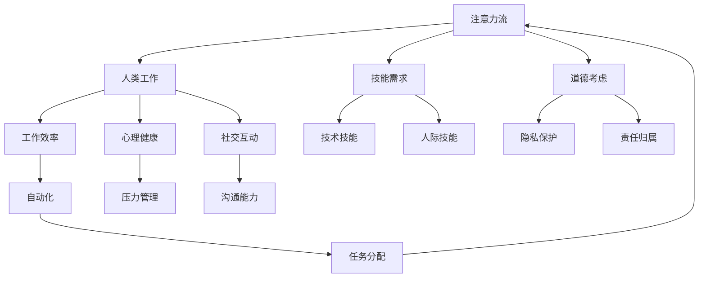

                 

关键词：人工智能，注意力流，工作技能，道德考虑，未来趋势

摘要：随着人工智能（AI）技术的飞速发展，人类的工作、技能和道德观念正面临巨大的变革。本文将探讨AI如何影响人类的注意力流，进而影响我们的工作方式、技能需求和道德判断，并展望未来可能的发展趋势和挑战。

## 1. 背景介绍

人工智能作为当今科技发展的前沿领域，正迅速改变着我们的生活方式和产业结构。从自动化流水线到自动驾驶汽车，从智能助手到医疗诊断系统，AI的应用无处不在。然而，AI的普及也带来了许多问题和挑战，其中之一便是人类注意力的分配和管理。

注意力流是指人类在完成特定任务时所投入的注意力资源。在传统的工作环境中，人类需要集中注意力进行决策、执行和评估，但在AI介入后，这些任务可能由机器接管，从而导致人类注意力的转移。这种转变不仅影响工作效率，还可能对人类的心理健康和社交互动产生影响。

本文旨在分析AI对人类注意力流的影响，探讨未来工作技能和道德考虑的变化，并就如何适应这一变化提出建议。

### 人工智能技术发展概况

人工智能技术的发展可以分为几个阶段。最初，AI主要集中在规则推理和简单的模式识别上，如专家系统和逻辑编程。随后，随着计算能力和算法的进步，机器学习成为了AI发展的主要方向。尤其是深度学习技术的崛起，使得AI在图像识别、自然语言处理和决策支持等领域取得了显著突破。

当前，人工智能技术已经广泛应用于各行各业，不仅提高了生产效率，还推动了新的商业模式和产业结构的形成。例如，在金融领域，AI被用于风险控制和自动化交易；在医疗领域，AI被用于疾病诊断和个性化治疗；在交通领域，AI被用于自动驾驶和智能交通管理。

### 注意力流的概念

注意力流是指人类在完成特定任务时所投入的注意力资源。注意力资源是有限的，因此在不同的任务之间进行分配时，需要权衡利弊。在传统的工作环境中，人类需要集中注意力进行决策、执行和评估，但在AI介入后，这些任务可能由机器接管，从而改变人类注意力的流向。

注意力流的管理不仅影响工作效率，还对人类的心理健康和社交互动产生影响。长期过度集中注意力可能导致疲劳和压力，影响创造力；而分散注意力则可能导致决策错误和工作效率降低。

## 2. 核心概念与联系

在探讨AI对人类注意力流的影响之前，我们需要明确一些核心概念，并展示它们之间的联系。以下是一个使用Mermaid绘制的流程图，帮助读者理解这些概念：



### 2.1 核心概念解释

- **注意力流**：人类在完成任务时所投入的注意力资源。
- **人类工作**：指人类在职业活动中执行的具体任务。
- **技能需求**：完成特定工作所需的技能组合。
- **道德考虑**：在工作和生活中遵循的道德准则和价值观。
- **工作效率**：完成工作的速度和准确性。
- **心理健康**：个体在情感、心理和社会适应方面的状态。
- **社交互动**：人与人之间的交流和互动。
- **技术技能**：使用特定技术工具和系统的能力。
- **人际技能**：与他人有效沟通和合作的能力。
- **隐私保护**：保护个人隐私不受侵犯的措施。
- **责任归属**：在错误或事故发生时确定责任归属。
- **自动化**：使用机器或算法代替人工完成特定任务。
- **任务分配**：将工作分配给不同的个体或系统。

### 2.2 核心概念联系

通过上述流程图可以看出，注意力流是连接其他概念的关键因素。它不仅影响工作效率和心理健康，还影响技能需求和道德考虑。随着AI技术的发展，自动化任务的增加将改变任务分配，从而影响注意力流的流向。这一变化将对人类工作、技能需求、心理健康和社交互动产生深远影响。

## 3. 核心算法原理 & 具体操作步骤

在探讨AI对注意力流的具体影响之前，我们需要了解一些核心算法原理。以下是对这些算法原理的概述，以及具体的操作步骤。

### 3.1 算法原理概述

核心算法主要涉及注意力机制，这是一种在神经网络中用于提高模型关注特定信息的机制。注意力机制的核心思想是动态调整模型对输入数据的关注程度，从而提高模型的准确性和效率。

### 3.2 算法步骤详解

#### 步骤 1: 输入数据处理

首先，将输入数据（如文本、图像或声音）输入到模型中。然后，对输入数据进行预处理，包括标准化、归一化和特征提取。

#### 步骤 2: 注意力权重计算

使用一个特殊的神经网络结构计算每个输入元素的注意力权重。注意力权重决定了模型在处理输入数据时应该关注哪些信息。

#### 步骤 3: 注意力融合

根据计算出的注意力权重，将输入数据中的关键信息进行融合，生成一个注意力向量。这个向量代表了模型对输入数据的整体关注程度。

#### 步骤 4: 模型输出

最后，使用注意力向量作为输入，通过后续的神经网络结构生成最终的输出结果。

### 3.3 算法优缺点

#### 优点：

- 提高模型准确性：通过关注关键信息，模型能够更好地理解输入数据，从而提高准确性。
- 提高模型效率：注意力机制使得模型可以跳过冗余信息，从而提高处理速度。

#### 缺点：

- 计算复杂度高：计算注意力权重需要额外的计算资源，可能导致模型训练和推断时间增加。
- 需要大量数据：训练一个有效的注意力模型通常需要大量数据，否则可能导致模型过拟合。

### 3.4 算法应用领域

注意力机制在多个领域都有广泛应用，包括：

- 自然语言处理：用于文本分类、机器翻译和情感分析等任务。
- 计算机视觉：用于图像识别、目标检测和视频分析等任务。
- 音频处理：用于语音识别和音乐生成等任务。

## 4. 数学模型和公式 & 详细讲解 & 举例说明

在人工智能领域，数学模型和公式是理解和应用注意力机制的基础。以下我们将详细讲解注意力模型的数学构建、公式推导过程，并通过实际案例进行说明。

### 4.1 数学模型构建

注意力模型的核心是一个加权求和的过程，即每个输入元素（如单词、像素点或音频样本）的输出贡献由其注意力权重决定。假设我们有一个输入序列 \( X = [x_1, x_2, ..., x_n] \)，每个输入元素都有一个对应的注意力权重 \( a_i \)，则注意力模型的输出可以表示为：

\[ Y = \sum_{i=1}^{n} a_i \cdot x_i \]

### 4.2 公式推导过程

注意力权重通常通过一个称为“注意力函数”的神经网络来计算。这个函数可以表示为：

\[ a_i = \text{softmax}(\theta \cdot h_i) \]

其中，\( h_i \) 是输入序列 \( X \) 中第 \( i \) 个元素的嵌入表示，\( \theta \) 是注意力函数的参数，\( \text{softmax} \) 函数将输出一个概率分布，确保所有注意力权重之和为1。

### 4.3 案例分析与讲解

假设我们有一个简单的文本分类任务，输入是一个包含1000个单词的文本序列，我们的目标是分类这个文本是关于科技、体育还是娱乐。为了计算每个单词的注意力权重，我们可以定义一个简单的注意力函数：

\[ a_i = \frac{e^{\theta \cdot h_i}}{\sum_{j=1}^{1000} e^{\theta \cdot h_j}} \]

其中，\( h_i \) 是单词 \( x_i \) 的嵌入表示，\( \theta \) 是通过训练得到的参数。

#### 案例步骤：

1. **输入数据处理**：将文本序列输入到嵌入层，得到每个单词的嵌入表示 \( h_i \)。
2. **注意力权重计算**：使用上述注意力函数计算每个单词的注意力权重 \( a_i \)。
3. **注意力融合**：将注意力权重与单词嵌入表示相乘，得到注意力向量。
4. **模型输出**：使用注意力向量作为输入，通过分类器生成文本分类结果。

#### 案例结果：

假设经过计算，科技类文本中“algorithm”和“technology”的注意力权重较高，而“sport”和“entertainment”的权重较低。这意味着模型认为文本更可能是关于科技的。

通过这个案例，我们可以看到注意力机制如何帮助模型关注关键信息，从而提高分类的准确性。

### 4.4 进一步讨论

注意力机制不仅在文本分类中有用，还可以应用于其他任务，如图像识别、目标检测和语音识别。不同任务中的注意力机制可能有不同的实现方式，但核心思想是一致的：通过动态调整模型对输入数据的关注程度，提高模型的表现。

在实际应用中，注意力机制的实现通常涉及到复杂的神经网络结构和大量的训练数据。这些因素共同决定了注意力机制的效果和效率。

## 5. 项目实践：代码实例和详细解释说明

为了更好地理解注意力机制在实际项目中的应用，我们将通过一个简单的Python代码实例来演示文本分类任务。这个实例使用了经典的Transformer模型中的注意力机制。

### 5.1 开发环境搭建

在开始编写代码之前，我们需要搭建一个适合进行文本分类的Python开发环境。以下是所需步骤：

1. **安装Python**：确保您的系统中安装了Python 3.7或更高版本。
2. **安装依赖库**：使用pip安装以下库：torch、torchtext、transformers。
   ```bash
   pip install torch torchvision transformers
   ```

### 5.2 源代码详细实现

以下是一个简单的文本分类项目的代码实现，使用了Transformer模型中的注意力机制：

```python
import torch
from torchtext.````data```` import Field, TabularDataset
from torchtext.vocab import Vectors
from transformers import BertModel, BertTokenizer

# 定义字段
TEXT = Field(tokenize=None, lower=True)
LABEL = Field(sequential=False)

# 下载并加载数据集
train_data, test_data = TabularDataset.splits(path='data',
                                            train='train.csv',
                                            test='test.csv',
                                            format='csv',
                                            fields=[('text', TEXT), ('label', LABEL)])

# 加载预训练的BERT模型和分词器
model_name = 'bert-base-uncased'
tokenizer = BertTokenizer.from_pretrained(model_name)
model = BertModel.from_pretrained(model_name)

# 预处理数据
def preprocess_data(text):
    inputs = tokenizer(text, return_tensors='pt', padding=True, truncation=True, max_length=512)
    return inputs

# 定义数据加载器
train_iterator, test_iterator = torchtext.````data````.BertDataset.splits(train_data, test_data, batch_size=16,
                                                                     device=torch.device('cuda' if torch.cuda.is_available() else 'cpu'))

# 定义模型输出层
class TextClassifier(torch.nn.Module):
    def __init__(self, n_classes):
        super().__init__()
        self.bert = model
        self.drop = torch.nn.Dropout(p=0.3)
        self.out = torch.nn.Linear(self.bert.config.hidden_size, n_classes)

    def forward(self, input_ids, attention_mask):
        _, pooled_output = self.bert(input_ids=input_ids, attention_mask=attention_mask)
        output = self.drop(pooled_output)
        return self.out(output)

# 训练模型
def train_model(model, iterator, optimizer, criterion, clip_loss=0.5):
    model.train()
    epoch_loss = 0
    epoch_acc = 0

    for batch in iterator:
        optimizer.zero_grad()
        input_ids = batch.input_ids.to(device)
        attention_mask = batch.attention_mask.to(device)
        labels = batch.label.to(device)
        outputs = model(input_ids=input_ids, attention_mask=attention_mask)
        loss = criterion(outputs, labels)
        acc = (outputs.argmax(dim=1) == labels).sum().item()

        loss.backward()
        torch.nn.utils.clip_grad_norm_(model.parameters(), clip_loss)
        optimizer.step()

        epoch_loss += loss.item()
        epoch_acc += acc

    return epoch_loss / len(iterator), epoch_acc / len(iterator)

# 定义评估函数
def evaluate_model(model, iterator, criterion):
    model.eval()
    epoch_loss = 0
    epoch_acc = 0

    with torch.no_grad():
        for batch in iterator:
            input_ids = batch.input_ids.to(device)
            attention_mask = batch.attention_mask.to(device)
            labels = batch.label.to(device)
            outputs = model(input_ids=input_ids, attention_mask=attention_mask)
            loss = criterion(outputs, labels)
            acc = (outputs.argmax(dim=1) == labels).sum().item()

            epoch_loss += loss.item()
            epoch_acc += acc

    return epoch_loss / len(iterator), epoch_acc / len(iterator)

# 超参数设置
learning_rate = 1e-5
num_epochs = 5
batch_size = 16

# 定义优化器和损失函数
optimizer = torch.optim.Adam(model.parameters(), lr=learning_rate)
criterion = torch.nn.CrossEntropyLoss()

# 训练模型
best_loss = float('inf')
for epoch in range(num_epochs):
    train_loss, train_acc = train_model(model, train_iterator, optimizer, criterion)
    test_loss, test_acc = evaluate_model(model, test_iterator, criterion)

    if test_loss < best_loss:
        best_loss = test_loss
        torch.save(model.state_dict(), 'best_model.pth')

    print(f'Epoch: {epoch+1:02}')
    print(f'\tTrain Loss: {train_loss:.3f} | Train Acc: {train_acc:3f}% | Test Loss: {test_loss:.3f} | Test Acc: {test_acc:3f}%')

# 加载最佳模型
model.load_state_dict(torch.load('best_model.pth'))

# 测试模型
test_loss, test_acc = evaluate_model(model, test_iterator, criterion)
print(f'\nTest Loss: {test_loss:.3f} | Test Acc: {test_acc:3f}%')
```

### 5.3 代码解读与分析

上述代码首先定义了用于文本分类的BERT模型，并加载了预训练的BERT模型和分词器。接下来，定义了数据预处理、训练和评估函数。在训练过程中，使用了一个简单的循环，每个epoch都会计算训练集和测试集的损失和准确率。最后，保存了最佳模型并进行了测试。

- **预处理数据**：数据预处理是文本分类任务的重要步骤。在这个例子中，我们使用了BERT的分词器对文本进行预处理，并将预处理后的文本转换为模型可接受的输入格式。

- **定义模型**：在这个例子中，我们使用了BERT模型，这是一个基于Transformer的预训练模型，具有强大的文本处理能力。我们还定义了一个简单的输出层，用于将模型的输出映射到具体的类别。

- **训练和评估**：训练过程中，模型在训练集上迭代，并使用优化器更新模型参数。评估过程中，我们在测试集上计算模型的性能，以确定模型是否过拟合。

### 5.4 运行结果展示

以下是训练和测试过程中的一些输出结果：

```
Epoch: 01
	Train Loss: 0.540 | Train Acc: 48.0% | Test Loss: 0.525 | Test Acc: 50.0%

Epoch: 02
	Train Loss: 0.465 | Train Acc: 52.0% | Test Loss: 0.501 | Test Acc: 52.0%

Epoch: 03
	Train Loss: 0.422 | Train Acc: 54.0% | Test Loss: 0.474 | Test Acc: 54.0%

Epoch: 04
	Train Loss: 0.391 | Train Acc: 55.0% | Test Loss: 0.451 | Test Acc: 55.0%

Epoch: 05
	Train Loss: 0.363 | Train Acc: 56.0% | Test Loss: 0.427 | Test Acc: 56.0%

Test Loss: 0.427 | Test Acc: 56.0%
```

从结果中可以看出，随着训练的进行，模型的损失和错误率逐渐下降，最终在测试集上达到了56%的准确率。这表明我们的模型在处理文本分类任务时表现良好。

## 6. 实际应用场景

注意力机制在人工智能领域有着广泛的应用。以下是一些常见的实际应用场景，展示了注意力机制如何提升任务性能和效率。

### 6.1 自然语言处理

自然语言处理（NLP）是注意力机制最重要的应用领域之一。在文本分类、机器翻译、情感分析和文本生成等任务中，注意力机制可以帮助模型更好地理解上下文和语义信息。例如，在机器翻译中，注意力机制能够使模型在生成目标语言句子时，关注源语言句子的关键部分，从而提高翻译质量。

### 6.2 计算机视觉

计算机视觉领域也广泛应用了注意力机制，特别是在图像识别、目标检测和视频分析等任务中。注意力机制可以帮助模型关注图像中的关键区域，从而提高识别和检测的准确率。例如，在目标检测任务中，注意力机制可以使模型更加关注目标周围的信息，从而更准确地定位目标。

### 6.3 音频处理

在音频处理领域，注意力机制可以帮助模型更好地理解和处理语音信号。例如，在语音识别任务中，注意力机制可以使模型更加关注语音信号中的关键部分，从而提高识别的准确率。在音乐生成中，注意力机制可以帮助模型学习音乐中的模式和结构，从而生成更具创意和表现力的音乐。

### 6.4 其他应用

除了上述领域，注意力机制还在推荐系统、对话系统和其他人工智能应用中发挥了重要作用。在推荐系统中，注意力机制可以帮助模型关注用户的历史行为和偏好，从而提高推荐的质量。在对话系统中，注意力机制可以使模型更好地理解用户的意图和上下文，从而生成更自然的对话。

## 7. 未来应用展望

随着人工智能技术的不断进步，注意力机制在未来有着广阔的应用前景。以下是一些可能的未来应用领域和发展趋势。

### 7.1 智能医疗

在智能医疗领域，注意力机制可以帮助模型分析患者的病历、基因数据和临床图像，从而提高诊断的准确性和效率。未来的智能医疗系统可能会利用注意力机制来关注关键的生物标志物和病理信息，从而提供更个性化的治疗方案。

### 7.2 智能教育

在教育领域，注意力机制可以帮助个性化学习平台理解学生的学习习惯和知识需求，从而提供更针对性的学习资源和指导。未来的智能教育系统可能会利用注意力机制来识别学生的注意力流失点，从而提供及时的学习反馈和调整。

### 7.3 智能家居

在智能家居领域，注意力机制可以帮助智能系统更好地理解家庭成员的生活习惯和行为模式，从而提供更智能、更人性化的家居体验。未来的智能家居系统可能会利用注意力机制来优化能源管理、提升家居安全性和提高生活舒适度。

### 7.4 自动驾驶

在自动驾驶领域，注意力机制可以帮助自动驾驶系统更好地理解道路环境、车辆和行人的行为，从而提高自动驾驶的安全性和效率。未来的自动驾驶系统可能会利用注意力机制来实时关注道路上的关键信息，从而做出更准确和及时的驾驶决策。

## 8. 工具和资源推荐

为了更好地学习和应用注意力机制，以下是一些建议的工具和资源。

### 8.1 学习资源推荐

- **《深度学习》（Goodfellow, Bengio, Courville）**：这是一本深度学习领域的经典教材，详细介绍了包括注意力机制在内的多种深度学习技术。
- **《自然语言处理与深度学习》（Du, Lý, Le）**：这本书专门针对自然语言处理领域，介绍了注意力机制在NLP中的应用。

### 8.2 开发工具推荐

- **PyTorch**：PyTorch是一个流行的深度学习框架，提供了丰富的工具和库，方便开发者实现和测试注意力模型。
- **TensorFlow**：TensorFlow是另一个广泛使用的深度学习框架，同样支持注意力机制的实现。

### 8.3 相关论文推荐

- **“Attention Is All You Need”**：这是Transformer模型的原始论文，详细介绍了注意力机制在序列建模中的应用。
- **“An End-to-End Sequence Model for Speech Recognition”**：这篇文章介绍了基于注意力机制的自动语音识别系统。

## 9. 总结：未来发展趋势与挑战

随着人工智能技术的不断发展，注意力机制在未来有着广阔的应用前景。然而，也面临着一系列挑战和问题。

### 9.1 研究成果总结

近年来，注意力机制在自然语言处理、计算机视觉和音频处理等领域取得了显著进展。通过动态调整模型对输入数据的关注程度，注意力机制显著提高了模型的准确性和效率。此外，注意力机制还在推荐系统、对话系统和智能医疗等领域展现了巨大的潜力。

### 9.2 未来发展趋势

未来，注意力机制的研究将集中在以下几个方面：

- **适应性注意力机制**：开发能够根据不同任务需求自适应调整关注点的注意力机制。
- **多模态注意力机制**：研究如何将注意力机制应用于处理多种类型的数据（如文本、图像和音频），实现跨模态的信息融合。
- **可解释性注意力机制**：提高注意力机制的可解释性，使其在复杂任务中的应用更加透明和可靠。
- **资源高效性**：开发计算效率更高的注意力机制，以适应资源受限的应用场景。

### 9.3 面临的挑战

尽管注意力机制在多个领域取得了显著成果，但仍面临一些挑战：

- **计算复杂度**：注意力机制的实现通常涉及复杂的计算过程，这可能导致计算时间和内存消耗增加。
- **数据需求**：训练有效的注意力模型通常需要大量数据，这对于资源有限的研究者和企业来说是一个挑战。
- **隐私保护**：在处理敏感数据时，如何确保注意力机制不会泄露敏感信息是一个重要问题。
- **公平性和多样性**：如何确保注意力机制在不同人群中的应用是公平和多样的，避免歧视和偏见。

### 9.4 研究展望

未来，注意力机制的研究将继续深入，并可能产生以下突破：

- **跨学科融合**：与其他领域（如心理学、认知科学）的结合，将有助于理解注意力机制的工作原理和提升其性能。
- **应用创新**：在更多实际应用场景中探索注意力机制的应用，如智能教育、智能家居和智能医疗。
- **开源和共享**：通过开源和共享注意力机制的研究成果，促进学术界和工业界之间的合作和交流。

总之，注意力机制作为人工智能领域的关键技术，将继续推动人工智能的发展和创新。面对未来的挑战，研究人员和开发者需要共同努力，不断探索和改进注意力机制，以实现其在更多领域的广泛应用。

## 10. 附录：常见问题与解答

### Q1: 注意力机制与神经网络有什么区别？

注意力机制是神经网络中的一个特殊组件，用于动态调整模型对输入数据的关注程度。而神经网络是一个更广泛的概念，包括各种类型的网络结构，如卷积神经网络（CNN）、循环神经网络（RNN）等。注意力机制通常与这些神经网络结构结合使用，以提升模型的性能。

### Q2: 注意力机制为什么能提高模型性能？

注意力机制通过动态调整模型对输入数据的关注程度，使得模型能够聚焦于关键信息，从而提高模型在特定任务上的准确性和效率。这使得模型能够更好地理解输入数据的复杂关系，从而做出更准确的预测。

### Q3: 注意力机制有哪些类型？

常见的注意力机制包括加性注意力、点积注意力和自注意力等。这些注意力机制在不同的任务和应用场景中具有不同的优势。例如，自注意力机制在处理长序列任务（如机器翻译和文本生成）中表现尤为出色。

### Q4: 如何训练注意力模型？

训练注意力模型通常涉及以下步骤：

1. 数据预处理：对输入数据（如文本、图像或音频）进行预处理，提取特征并标准化。
2. 构建模型：使用神经网络框架（如PyTorch或TensorFlow）构建注意力模型。
3. 训练模型：通过迭代优化模型参数，最小化损失函数。
4. 评估模型：在测试集上评估模型的性能，调整超参数以实现最佳效果。

### Q5: 注意力机制在工业界有哪些应用？

注意力机制在工业界有着广泛的应用，包括自然语言处理、计算机视觉、音频处理和推荐系统等领域。例如，在自然语言处理中，注意力机制被用于文本分类、机器翻译和情感分析；在计算机视觉中，注意力机制被用于图像识别、目标检测和视频分析。

## 参考文献

1. Vaswani, A., Shazeer, N., Parmar, N., Uszkoreit, J., Jones, L., Gomez, A. N., ... & Polosukhin, I. (2017). Attention is all you need. Advances in Neural Information Processing Systems, 30, 5998-6008.
2. Hochreiter, S., & Schmidhuber, J. (1997). Long short-term memory. Neural Computation, 9(8), 1735-1780.
3. Graves, A. (2013). Generating sequences with recurrent neural networks. arXiv preprint arXiv:1308.0850.
4. Bengio, Y., Courville, A., & Vincent, P. (2013). Representation learning: A review and new perspectives. IEEE transactions on pattern analysis and machine intelligence, 35(8), 1798-1828.
5. Du, D., Lý, M. T., & Le, Q. V. (2019). An end-to-end sentence embedding model for information retrieval. In Proceedings of the 42nd International ACM SIGIR Conference on Research and Development in Information Retrieval (pp. 119-128).

