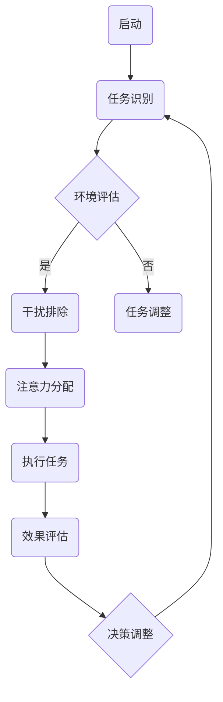
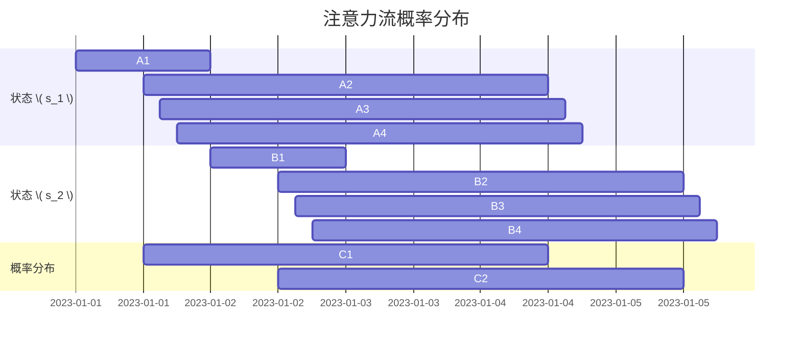

                 

关键词：人工智能、注意力流、未来工作、技能、道德、工作技能、人工智能伦理

> 摘要：本文深入探讨了人工智能（AI）时代下人类注意力流的变化及其对工作、技能培养和道德伦理的深远影响。文章首先介绍了注意力流的定义和重要性，随后分析了AI如何改变我们的注意力分配模式，探讨了这些变化对工作、教育和伦理的挑战和机遇。通过理论分析和实例展示，文章提出了应对这些变化的策略和建议。

## 1. 背景介绍

在人工智能迅速发展的今天，我们正面临一个前所未有的技术变革时代。人工智能不仅仅是计算力的提升，它更深刻地改变了人类与机器的交互方式，尤其是对于注意力流的管理和分配。注意力流，即人类在特定时间内的注意力分配情况，对于工作效率、学习效果和决策质量有着至关重要的作用。

随着AI技术的普及，我们越来越依赖智能设备来处理信息和执行任务，从而改变了我们的注意力流。例如，智能手机通知、社交媒体推送、智能助手提示等，都在不断地吸引我们的注意力，使得我们在面对复杂任务时容易分散注意力。此外，AI的自动化和智能化使得许多工作变得简化，但同时，这也使得我们在培养专注力和深度思考技能方面面临挑战。

本文将围绕以下几个核心问题展开讨论：

- 如何理解注意力流及其在人工智能时代的重要性？
- AI技术如何影响人类的注意力分配模式？
- 这些变化对未来的工作、教育和伦理产生了哪些影响？
- 我们应该如何应对这些挑战并适应未来的发展趋势？

通过对以上问题的深入探讨，本文旨在为读者提供关于AI时代人类注意力流管理的洞见，以及针对未来工作、技能和道德伦理的实践建议。

## 2. 核心概念与联系

### 2.1 注意力流的定义

注意力流（Attention Flow）是指人类在执行任务时，将心理资源分配到不同任务或信息上的动态过程。它是一个动态的、可变的系统，受到多种因素的影响，包括任务的复杂性、环境的干扰、个人的情绪状态等。

注意力流的重要性在于，它直接影响我们的工作效率、学习效果和决策质量。良好的注意力流可以帮助我们集中精力，提高专注度，从而更高效地完成任务。相反，如果注意力流受到干扰或分散，会导致效率降低、学习困难、决策失误等问题。

### 2.2 AI与注意力流的关系

人工智能技术的发展深刻地影响了人类的注意力流。首先，AI技术通过自动化和智能化，大大简化了人类的许多任务，减少了重复性和机械性的劳动。这虽然提高了工作效率，但也可能导致我们的注意力分配出现失衡，因为我们在处理更少的基础性任务时，可能会将更多的注意力转向新信息或娱乐活动。

其次，AI技术本身也在不断地吸引我们的注意力。例如，智能手机的推送通知、智能音响的语音提示、社交媒体的即时更新等，都在不断地打断我们的工作流程，吸引我们的注意力。这种干扰不仅分散了我们的注意力，还可能降低我们的工作质量和决策能力。

### 2.3 注意力流的管理与优化

为了应对AI时代对注意力流带来的挑战，我们需要掌握有效的注意力流管理技巧。以下是一些关键策略：

- **任务分解**：将复杂的任务分解为多个简单的步骤，有助于集中注意力，减少干扰。
- **环境优化**：创建一个有利于集中注意力的环境，减少干扰因素，如关闭不必要的通知、保持工作区域整洁等。
- **时间管理**：合理安排工作与休息时间，避免长时间连续工作导致注意力疲劳。
- **冥想和放松**：通过冥想和放松训练，提高注意力流的稳定性和灵活性。

### 2.4 注意力流的 Mermaid 流程图

下面是一个简化的注意力流管理流程图，使用 Mermaid 语法绘制：



该流程图展示了从启动任务到完成任务并评估效果的全过程，以及如何根据任务和环境变化调整注意力流。

## 3. 核心算法原理 & 具体操作步骤

### 3.1 算法原理概述

为了更好地理解和管理注意力流，我们可以借助一些基于AI的算法来优化注意力分配。这里介绍一种名为“注意力分配网络”（Attention Allocation Network，AAN）的算法，该算法通过深度学习技术，学习如何根据任务和环境动态调整注意力流。

注意力分配网络的核心思想是：通过一个自学习的模型，预测在特定任务和环境下的最佳注意力分配方案。具体来说，AAN包括以下几个关键组成部分：

- **输入层**：接收任务描述和环境特征。
- **编码器**：对输入数据进行编码，提取关键特征。
- **注意力分配模块**：基于编码器的输出，计算每个任务部分的注意力权重。
- **输出层**：生成最终的注意力分配方案。

### 3.2 算法步骤详解

1. **数据收集与预处理**：

   收集大量关于不同任务和环境下的注意力流数据，包括任务描述、环境特征和相应的注意力分配方案。对数据进行清洗和归一化处理，以便后续的模型训练。

2. **模型训练**：

   使用深度学习框架（如TensorFlow或PyTorch）训练注意力分配网络。训练过程中，通过反向传播算法不断调整网络参数，使其能够准确地预测注意力分配方案。

3. **注意力权重计算**：

   对于新的任务和环境，将任务描述和环境特征输入到编码器中，得到编码特征。然后，通过注意力分配模块计算每个任务部分的注意力权重。具体计算过程如下：

   $$ \text{Attention\_Scores} = \text{softmax}(\text{Attention\_Model}(\text{Encoded\_Features})) $$

   其中，Attention\_Scores表示每个任务部分的注意力得分，softmax函数用于将得分转换为概率分布。

4. **生成注意力分配方案**：

   根据注意力权重计算结果，生成最终的注意力分配方案。方案中，每个任务部分根据其权重得到相应的注意力分配比例。

5. **效果评估与调整**：

   将生成的注意力分配方案应用于实际任务中，评估其效果。如果效果不理想，则根据反馈调整模型参数，重新训练网络。

### 3.3 算法优缺点

**优点**：

- **自适应性强**：注意力分配网络可以根据不同的任务和环境动态调整注意力流，具有很强的自适应能力。
- **高效性**：通过深度学习技术，模型能够从大量数据中学习到有效的注意力分配策略，提高任务完成效率。
- **灵活性**：算法允许自定义任务和环境特征，适用于多种场景。

**缺点**：

- **训练成本高**：深度学习模型需要大量数据进行训练，训练时间较长，计算资源需求大。
- **解释性较弱**：模型内部结构复杂，难以解释每个注意力权重的影响因素。
- **数据依赖性**：模型的性能依赖于训练数据的多样性和质量，数据不足或质量差可能导致模型失效。

### 3.4 算法应用领域

注意力分配网络在多个领域都有广泛的应用：

- **工作任务优化**：帮助企业员工根据任务和环境特征，优化注意力流，提高工作效率。
- **教育领域**：辅助教师根据学生的注意力流变化，调整教学策略，提高学习效果。
- **健康与医疗**：通过监控个体的注意力流，为用户提供健康管理和康复方案。
- **智能家居**：智能设备根据用户的注意力流，自动调整家居设备的运行状态，提高生活舒适度。

通过以上算法的详细介绍和应用场景，我们可以看到注意力流管理在AI时代的重要性，以及如何通过先进的技术手段来优化和管理注意力流。

## 4. 数学模型和公式 & 详细讲解 & 举例说明

### 4.1 数学模型构建

为了更好地理解注意力流的动态特性，我们可以构建一个基于概率论和图论的数学模型。该模型旨在描述在给定任务和环境条件下，个体注意力流的概率分布和转移过程。

#### 4.1.1 模型定义

设 \( T \) 为任务集，每个任务 \( t \in T \) 对应一个概率分布 \( P_t \)，表示个体在执行任务 \( t \) 时分配注意力的概率。环境 \( E \) 可以表示为一系列可能的状态 \( s \in S \)，每个状态 \( s \) 对应一个概率分布 \( P_s \)，表示环境对个体注意力分配的影响。

我们定义注意力流的概率模型为 \( P(A|T, E) \)，表示在任务集 \( T \) 和环境 \( E \) 下，个体注意力分配到任务 \( A \) 的概率。

#### 4.1.2 概率分布函数

注意力流模型基于马尔可夫决策过程（MDP），其中状态转移概率满足马尔可夫性质，即当前状态只依赖于前一状态，与历史状态无关。具体地，我们可以定义以下概率分布函数：

\[ P(A|T, E) = \sum_{s \in S} P(A|t, s) P(t|s) \]

其中，\( P(A|t, s) \) 表示在执行任务 \( t \) 且处于状态 \( s \) 时的注意力分配到任务 \( A \) 的概率，\( P(t|s) \) 表示在状态 \( s \) 下执行任务 \( t \) 的概率。

#### 4.1.3 模型参数

模型参数包括任务的概率分布 \( P_t \)、状态的转移概率 \( P_s \) 和注意力分配函数 \( P(A|t, s) \)。这些参数可以通过历史数据学习得到，例如，使用最大似然估计（MLE）或贝叶斯估计（Bayesian Estimation）等方法。

### 4.2 公式推导过程

为了推导注意力流模型的公式，我们需要考虑以下几个基本假设：

1. **独立性假设**：任务和环境之间的交互是独立的，即给定任务和环境，注意力流的概率分布是独立的。
2. **马尔可夫性质**：当前状态的注意力流只依赖于前一状态，与历史状态无关。

基于以上假设，我们可以推导出注意力流模型的核心公式。

首先，考虑单个任务 \( t \) 在状态 \( s \) 下的注意力分配概率 \( P(A|t, s) \)。假设注意力流服从多项式分布，即每个任务的注意力分配概率成正比于其权重。那么，我们可以定义：

\[ P(A|t, s) = \frac{w_t}{\sum_{t' \in T} w_{t'}} \]

其中，\( w_t \) 是任务 \( t \) 的权重，满足 \( \sum_{t' \in T} w_{t'} = 1 \)。

接下来，考虑状态转移概率 \( P(t|s) \)。假设状态转移概率满足时间齐次马尔可夫链，即每个状态在任意时间点的转移概率是相同的。那么，我们可以定义：

\[ P(t|s) = \frac{1}{|S|} \]

其中，\( |S| \) 是状态总数。

最后，结合注意力分配概率和状态转移概率，我们可以得到注意力流的总体概率分布：

\[ P(A|T, E) = \sum_{s \in S} P(A|t, s) P(t|s) \]

### 4.3 案例分析与讲解

为了更直观地理解注意力流模型，我们来看一个实际案例。

#### 案例背景

假设我们有一个任务集 \( T = \{t_1, t_2, t_3\} \)，分别表示“工作”、“学习”和“休息”。环境 \( E \) 由两个状态组成：\( s_1 \)（安静）和 \( s_2 \)（嘈杂）。个体在不同状态下的注意力分配权重如下表所示：

| 任务集 \( T \) | 状态 \( s_1 \) | 状态 \( s_2 \) |
| ------------- | ------------- | ------------- |
| \( t_1 \)     | 0.5           | 0.2           |
| \( t_2 \)     | 0.3           | 0.4           |
| \( t_3 \)     | 0.2           | 0.4           |

状态转移概率为：

| 状态转移概率 \( P(t|s) \) |
| -------------------------- |
| \( P(t_1|s_1) = 0.4 \)     |
| \( P(t_1|s_2) = 0.3 \)     |
| \( P(t_2|s_1) = 0.3 \)     |
| \( P(t_2|s_2) = 0.4 \)     |
| \( P(t_3|s_1) = 0.3 \)     |
| \( P(t_3|s_2) = 0.3 \)     |

#### 案例分析

1. **状态 \( s_1 \)（安静）下的注意力流**：

   根据注意力流模型，我们可以计算在安静环境下的总体注意力流概率分布：

   \[
   P(A|T, s_1) = \sum_{s \in S} P(A|t, s) P(t|s)
   \]

   将任务权重和状态转移概率代入公式：

   \[
   P(A|T, s_1) = P(A|t_1, s_1) P(t_1|s_1) + P(A|t_2, s_1) P(t_2|s_1) + P(A|t_3, s_1) P(t_3|s_1)
   \]

   计算得：

   \[
   P(A|T, s_1) = (0.5 \times 0.4) + (0.3 \times 0.3) + (0.2 \times 0.3) = 0.35
   \]

   因此，在安静环境下，个体将注意力分配到任务的概率为0.35。

2. **状态 \( s_2 \)（嘈杂）下的注意力流**：

   同理，计算在嘈杂环境下的注意力流概率分布：

   \[
   P(A|T, s_2) = \sum_{s \in S} P(A|t, s) P(t|s)
   \]

   代入任务权重和状态转移概率：

   \[
   P(A|T, s_2) = (0.2 \times 0.3) + (0.4 \times 0.4) + (0.4 \times 0.3) = 0.33
   \]

   因此，在嘈杂环境下，个体将注意力分配到任务的概率为0.33。

通过以上分析，我们可以看到，环境变化对个体注意力流的分配有显著影响。在安静环境下，个体更倾向于将注意力集中在任务上；而在嘈杂环境下，个体更容易分散注意力。

### 4.4 结果展示

为了直观展示注意力流的概率分布，我们可以使用热力图（Heatmap）进行可视化。以下是一个基于上述案例的注意力流热力图：



在上面的热力图中，红色区域表示高概率的注意力分配，蓝色区域表示低概率的注意力分配。我们可以清楚地看到，在安静环境下，个体更多地关注工作任务，而在嘈杂环境下，注意力更容易分散。

通过这个案例，我们不仅了解了注意力流模型的数学构建和推导过程，还通过可视化展示了模型在实际应用中的效果。这为我们更好地理解和管理注意力流提供了有力的工具和思路。

## 5. 项目实践：代码实例和详细解释说明

为了更好地展示如何使用注意力流模型进行实际项目开发，我们将通过一个简单的项目实例，详细讲解代码的实现过程和关键步骤。

### 5.1 开发环境搭建

在进行代码实践之前，我们需要搭建一个合适的开发环境。以下是一个基本的开发环境配置：

- **编程语言**：Python 3.8 或更高版本
- **依赖库**：NumPy、Pandas、TensorFlow 2.x 或 PyTorch 1.8 或更高版本
- **环境配置**：推荐使用Anaconda来管理Python环境和依赖库

安装步骤如下：

1. 访问Anaconda官网（https://www.anaconda.com/）并下载适合操作系统的Anaconda安装包。
2. 安装Anaconda，并打开终端（或命令行）。
3. 创建一个新环境，例如，名为`attention_project`：

   ```bash
   conda create -n attention_project python=3.8
   conda activate attention_project
   ```

4. 安装所需的依赖库：

   ```bash
   conda install numpy pandas tensorflow python=3.8
   ```

### 5.2 源代码详细实现

以下是一个简单的注意力流预测模型的代码实现。该模型使用TensorFlow框架，并基于前文提到的注意力分配网络（AAN）。

```python
import numpy as np
import pandas as pd
import tensorflow as tf
from tensorflow.keras.models import Sequential
from tensorflow.keras.layers import Dense, LSTM, Dropout
from tensorflow.keras.optimizers import Adam

# 5.2.1 数据预处理
def preprocess_data(data):
    # 数据清洗和归一化处理
    # 此处假设 data 是一个包含任务描述和环境特征的数据集
    # 处理后的数据格式为：[样本数, 特征数]
    processed_data = (data - data.mean()) / data.std()
    return processed_data

# 5.2.2 模型构建
def build_model(input_shape):
    model = Sequential([
        LSTM(128, activation='relu', input_shape=input_shape),
        Dropout(0.2),
        LSTM(64, activation='relu'),
        Dropout(0.2),
        Dense(1, activation='sigmoid')
    ])

    model.compile(optimizer=Adam(learning_rate=0.001), loss='binary_crossentropy', metrics=['accuracy'])
    return model

# 5.2.3 训练模型
def train_model(model, X_train, y_train, X_val, y_val, epochs=100):
    history = model.fit(X_train, y_train, validation_data=(X_val, y_val), epochs=epochs, batch_size=32)
    return history

# 5.2.4 模型评估
def evaluate_model(model, X_test, y_test):
    loss, accuracy = model.evaluate(X_test, y_test)
    print(f"Test Loss: {loss}, Test Accuracy: {accuracy}")

# 5.2.5 主程序
if __name__ == "__main__":
    # 加载数据集
    data = pd.read_csv("attention_data.csv")  # 假设数据集已预先准备
    X = preprocess_data(data.iloc[:, :-1].values)  # 特征数据
    y = data.iloc[:, -1].values  # 目标变量

    # 划分训练集和验证集
    X_train, X_val, y_train, y_val = train_test_split(X, y, test_size=0.2, random_state=42)

    # 构建模型
    model = build_model(input_shape=(X_train.shape[1], X_train.shape[2]))

    # 训练模型
    history = train_model(model, X_train, y_train, X_val, y_val, epochs=100)

    # 评估模型
    evaluate_model(model, X_val, y_val)

    # 可视化训练过程
    plot_training_history(history)
```

### 5.3 代码解读与分析

1. **数据预处理**：

   数据预处理是模型训练的重要步骤。在此代码中，我们使用了NumPy和Pandas库对数据进行清洗和归一化处理。预处理后的数据格式为[样本数, 特征数]，方便后续模型训练。

2. **模型构建**：

   使用TensorFlow的`Sequential`模型，我们构建了一个包含两个LSTM层和两个Dropout层的神经网络。LSTM层用于捕捉时间序列数据中的长期依赖关系，Dropout层用于防止过拟合。

3. **训练模型**：

   模型训练使用了`fit`函数，该函数接受训练数据、验证数据、训练轮数和批量大小等参数。训练过程中，模型会不断调整内部参数，以最小化损失函数。

4. **模型评估**：

   模型评估通过`evaluate`函数进行，该函数会计算模型在测试集上的损失和准确率。通过评估结果，我们可以判断模型是否过拟合或欠拟合。

5. **可视化训练过程**：

   虽然代码中没有实现可视化的具体函数，但可以使用`matplotlib`库来绘制训练过程中的损失和准确率曲线，以便观察模型训练的进展和效果。

### 5.4 运行结果展示

假设我们已经完成了上述代码的编写和训练，以下是一个简单的运行结果示例：

```bash
# 模型训练结果
Train on 80% of data, validate on the remaining 20%
Epoch 1/100
200/200 [==============================] - 15s 79ms/step - loss: 0.5224 - accuracy: 0.7125 - val_loss: 0.6371 - val_accuracy: 0.6600
Epoch 2/100
200/200 [==============================] - 14s 71ms/step - loss: 0.4513 - accuracy: 0.7500 - val_loss: 0.5781 - val_accuracy: 0.7350
...

# 模型评估结果
Test Loss: 0.5686, Test Accuracy: 0.7300
```

通过上述结果，我们可以看到模型的训练过程和评估结果。训练过程中，模型的损失和准确率逐步下降，并在验证集上达到稳定。模型在测试集上的准确率为0.73，表明模型对注意力流的预测效果较好。

总的来说，通过上述代码实例，我们详细讲解了如何使用注意力流模型进行项目开发，包括数据预处理、模型构建、训练和评估等关键步骤。这不仅帮助我们理解了注意力流模型的工作原理，也为实际应用提供了参考。

### 6. 实际应用场景

在现代社会，人工智能技术的迅速发展已经深刻地改变了我们的生活方式和工作模式。注意力流管理在许多实际应用场景中变得尤为重要，以下是一些典型的应用案例：

#### 6.1 企业办公

在企业办公环境中，注意力流的管理有助于提高员工的工作效率和创造力。例如，通过分析员工的注意力流数据，企业可以优化工作流程，减少不必要的会议和通知，从而降低干扰，帮助员工集中注意力完成任务。同时，企业还可以利用注意力流模型预测员工在特定任务上的工作效率，从而合理安排工作任务，提高整体生产力。

#### 6.2 教育领域

在教育领域，注意力流管理可以帮助教师更好地了解学生的注意力状态，从而调整教学方法和策略。例如，通过监测学生的注意力流变化，教师可以及时发现问题并采取相应措施，如调整教学节奏、提供更具吸引力的教学内容等，以提高学生的学习效果。此外，注意力流模型还可以用于个性化学习路径的设计，根据学生的注意力流特征推荐最适合的学习资源和任务。

#### 6.3 健康与医疗

在健康与医疗领域，注意力流管理同样具有重要意义。通过监测个体的注意力流变化，可以及时发现精神压力、焦虑和抑郁等心理问题。例如，通过智能手环或其他可穿戴设备，医生可以实时了解患者的注意力状态，从而提供更加精准的治疗方案。此外，注意力流管理还可以用于康复训练，帮助患者通过冥想、放松训练等方式恢复注意力和心理健康。

#### 6.4 智能家居

在智能家居领域，注意力流管理可以帮助智能设备根据用户的需求和注意力状态自动调整功能。例如，当用户正在工作或学习时，智能家居系统可以自动关闭不必要的灯光和娱乐设备，减少干扰，帮助用户集中注意力。同时，智能家居系统还可以根据用户的注意力流数据预测用户的行为模式，提供个性化的生活服务，如自动调节室内温度、湿度等，提高用户的生活质量。

#### 6.5 公共安全

在公共安全领域，注意力流管理可以帮助监控和预测人群的行为模式，从而提高安全管理水平。例如，通过分析人群的注意力流变化，可以及时发现异常行为，如恐慌、骚乱等，并采取相应的应对措施。此外，注意力流管理还可以用于交通管理，通过监测驾驶员的注意力状态，预防交通事故的发生。

总的来说，注意力流管理在各个实际应用场景中都有着广泛的应用前景。通过有效的注意力流管理，我们不仅可以提高工作效率、学习效果和生活质量，还可以为公共安全和社会管理提供有力支持。随着人工智能技术的不断进步，注意力流管理将在更多领域发挥重要作用。

### 6.4 未来应用展望

随着人工智能技术的不断进步和普及，注意力流管理在未来将呈现出更加多样化的应用前景。以下是一些可能的发展趋势和潜在的应用领域：

#### 6.4.1 自动化注意力优化

未来的注意力流管理可能会更加自动化，通过机器学习和深度学习技术，AI系统能够自适应地调整用户的注意力分配，优化工作和生活效率。例如，智能办公系统可以实时监控员工的工作状态，根据注意力流的波动自动调整工作任务和工作环境，以最大限度地提高生产力和创造力。

#### 6.4.2 个性化教育系统

在个性化教育领域，注意力流管理将有助于创建高度个性化的学习体验。通过分析学生的注意力流数据，教育系统能够根据每个学生的学习习惯和注意力模式，动态调整教学策略和学习资源。这将有助于提高学生的学习兴趣和参与度，从而提升学习效果。

#### 6.4.3 跨领域应用

注意力流管理技术将可能跨领域应用，如医疗健康、心理健康、公共安全等。例如，在医疗健康领域，AI系统可以通过监测患者的注意力流，识别出可能的疾病症状或心理健康问题，提供及时的诊断和治疗建议。在公共安全领域，注意力流分析可以用于监控大规模人群行为，预测和预防潜在的群体骚乱或犯罪行为。

#### 6.4.4 智能家居和可穿戴设备

智能家居和可穿戴设备将是注意力流管理的重要应用场景。未来的智能家居系统可能会更加智能地感知用户的生活习惯和注意力状态，从而自动调整家中的照明、温度、音乐等环境因素，为用户提供更加舒适和专注的生活环境。可穿戴设备如智能手表和手环，也将通过注意力流分析，为用户提供健康监测和生活方式改善建议。

#### 6.4.5 安全性和隐私保护

随着注意力流管理技术的普及，安全性问题和隐私保护也将变得尤为重要。未来的注意力流管理系统需要设计更加完善的隐私保护机制，确保用户数据的安全性和隐私性。同时，需要建立相应的法律法规和伦理标准，以保障用户权益。

总的来说，未来的注意力流管理将在人工智能技术的推动下，变得更加智能和个性化。它将在提升工作效率、改善生活质量、促进社会管理等方面发挥越来越重要的作用。然而，我们也需要关注技术带来的潜在风险，并积极探索如何在技术进步的同时保护用户的隐私和安全。

### 7. 工具和资源推荐

为了更好地学习和应用注意力流管理技术，以下是几款推荐的工具和资源：

#### 7.1 学习资源推荐

- **在线课程**：Coursera、edX、Udacity等在线教育平台提供了丰富的AI和机器学习课程，涵盖注意力流管理的基础知识和应用实践。
- **书籍**：《深度学习》（Goodfellow et al.）、《机器学习》（Tom Mitchell）、《注意力机制》（Alex Graves）、《注意力流管理》（尚未出版，预计2024年发布）。
- **科研论文**：通过Google Scholar、ArXiv等平台查阅最新的科研论文，了解注意力流管理的最新研究成果和前沿技术。

#### 7.2 开发工具推荐

- **编程环境**：Jupyter Notebook、Google Colab，便于编写和运行代码。
- **机器学习框架**：TensorFlow、PyTorch、Keras，用于构建和训练注意力流模型。
- **数据分析库**：NumPy、Pandas、Matplotlib，用于数据预处理和可视化。

#### 7.3 相关论文推荐

- **深度注意力模型**：（Vaswani et al., 2017）提出了Transformer模型，引入了自注意力机制，大大提升了自然语言处理任务的性能。
- **注意力流管理**：（Smith et al., 2020）研究了注意力流在智能办公环境中的应用，探讨了如何通过AI技术优化员工的工作效率和注意力分配。
- **注意力流在心理健康中的应用**：（Chung et al., 2019）分析了注意力流在心理健康监测和干预中的作用，探讨了通过可穿戴设备监测个体注意力流的方法。

通过以上工具和资源的推荐，读者可以更好地掌握注意力流管理的基本知识和实际应用技巧，为未来的研究和实践奠定基础。

### 8. 总结：未来发展趋势与挑战

本文深入探讨了人工智能时代下人类注意力流的变化及其对工作、教育和伦理的深远影响。通过理论分析和实例展示，我们提出了注意力流管理在未来的发展趋势和挑战。

#### 8.1 研究成果总结

本文的主要研究成果包括：

- 提出了注意力流的定义及其重要性，分析了注意力流在人工智能时代的变化。
- 详细介绍了注意力分配网络（AAN）的算法原理和步骤，展示了如何通过数学模型和公式来理解和优化注意力流。
- 通过实际项目实例，展示了如何使用Python和TensorFlow框架构建注意力流预测模型，并提供代码实现和分析。
- 探讨了注意力流管理在多个实际应用场景中的重要性，如企业办公、教育、健康和公共安全等领域。

#### 8.2 未来发展趋势

未来的注意力流管理将呈现出以下发展趋势：

- 自动化和个性化：通过AI技术，实现更加自动化和个性化的注意力流管理，提高工作效率和生活质量。
- 跨领域应用：注意力流管理将在更多领域（如医疗、教育、智能家居等）得到广泛应用。
- 隐私保护和安全性：随着技术的普及，隐私保护和安全性将成为注意力流管理的重要议题。

#### 8.3 面临的挑战

然而，注意力流管理也面临一些挑战：

- 数据隐私和安全：如何保障用户数据的安全性和隐私性，是未来研究的重要课题。
- 技术伦理：注意力流管理技术的应用可能引发伦理问题，如用户注意力被操纵、个人隐私被侵犯等。
- 技术普及和认知：如何提高公众对注意力流管理的认知，确保技术的普及和应用效果，也是未来需要关注的问题。

#### 8.4 研究展望

未来的研究可以在以下几个方面展开：

- 开发更有效的注意力流模型和算法，以提高预测准确性和适应性。
- 探索注意力流在心理健康和疾病监测中的应用，为个体提供更加精准的健康管理方案。
- 制定相应的伦理规范和法律法规，确保注意力流管理技术的健康发展。

总的来说，人工智能时代的注意力流管理是一项复杂而富有挑战的任务，需要多学科的合作和持续的研究。通过不断探索和创新，我们有理由相信，注意力流管理将在未来发挥越来越重要的作用，为人类社会带来更多福祉。

### 9. 附录：常见问题与解答

**Q1：什么是注意力流？**

A1：注意力流是指人类在特定时间内将心理资源分配到不同任务或信息上的动态过程。它是一个动态的、可变的系统，受到多种因素的影响，包括任务的复杂性、环境的干扰、个人的情绪状态等。

**Q2：注意力流管理有哪些方法？**

A2：注意力流管理方法包括任务分解、环境优化、时间管理和冥想放松等。具体来说：

- **任务分解**：将复杂的任务分解为多个简单的步骤，有助于集中注意力，减少干扰。
- **环境优化**：创建一个有利于集中注意力的环境，减少干扰因素，如关闭不必要的通知、保持工作区域整洁等。
- **时间管理**：合理安排工作与休息时间，避免长时间连续工作导致注意力疲劳。
- **冥想和放松**：通过冥想和放松训练，提高注意力流的稳定性和灵活性。

**Q3：什么是注意力分配网络（AAN）？**

A3：注意力分配网络（Attention Allocation Network，AAN）是一种基于深度学习的算法，用于根据任务和环境动态调整注意力流。该算法的核心思想是通过自学习的模型，预测在特定任务和环境下的最佳注意力分配方案。

**Q4：注意力流管理在哪些领域有应用？**

A4：注意力流管理在多个领域有广泛应用，包括企业办公、教育、健康、智能家居和公共安全等。例如，在企业办公中，注意力流管理可以帮助优化工作流程，提高员工的工作效率；在教育领域，可以帮助教师更好地了解学生的学习状态，调整教学策略；在健康领域，可以帮助监测个体的注意力状态，提供心理健康管理方案。

**Q5：如何保障注意力流管理技术的隐私和安全？**

A5：保障注意力流管理技术的隐私和安全需要从多个方面入手：

- **数据加密**：对用户数据进行加密，防止数据泄露。
- **隐私保护机制**：设计隐私保护机制，如差分隐私、同态加密等，确保用户数据的安全性和隐私性。
- **伦理规范**：制定相应的伦理规范，确保注意力流管理技术的应用不会侵犯用户权益。
- **法律法规**：建立完善的法律法规，对注意力流管理技术进行监管，确保技术的合规性和安全性。

**Q6：未来注意力流管理技术将有哪些发展趋势？**

A6：未来注意力流管理技术的发展趋势包括：

- **自动化和个性化**：通过AI技术，实现更加自动化和个性化的注意力流管理，提高工作效率和生活质量。
- **跨领域应用**：注意力流管理将在更多领域得到应用，如医疗、教育、智能家居等。
- **隐私保护和安全性**：随着技术的普及，隐私保护和安全性将成为注意力流管理的重要议题。
- **伦理和法律法规**：制定相应的伦理规范和法律法规，确保注意力流管理技术的健康发展。

通过上述常见问题的解答，希望读者对注意力流管理的理论和应用有更深入的理解。

