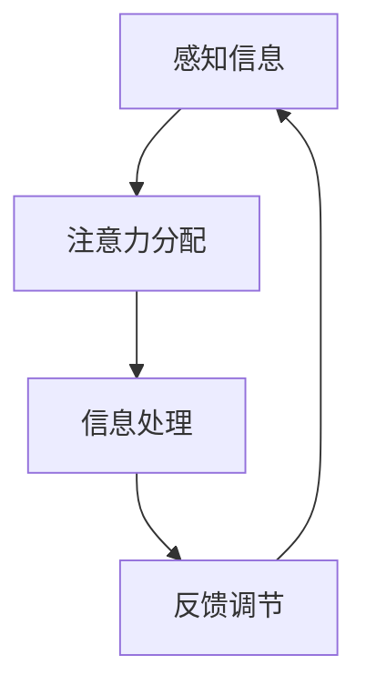
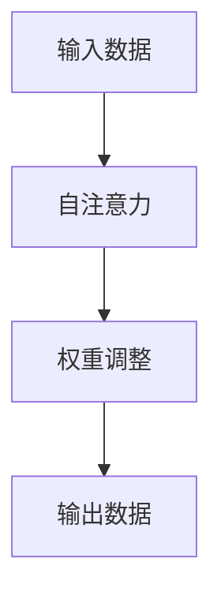

                 

关键词：人工智能、注意力流、工作、生活、注意力管理、未来趋势

> 摘要：本文将深入探讨人工智能与人类注意力流的相互作用，分析在未来工作与生活中如何有效地管理注意力流，以提升个体与集体的效率与幸福感。

## 1. 背景介绍

### 1.1 注意力流的概念

注意力流（Attention Flow）是指个体在处理信息过程中，注意力从一个任务或场景转移到另一个任务或场景的能力。在人类认知过程中，注意力流起着关键作用，它决定了个体如何分配认知资源，从而影响信息的处理速度和准确性。

### 1.2 人工智能与注意力流

随着人工智能技术的发展，机器学习算法已经能够在很大程度上模拟人类的注意力流。例如，深度学习中的注意力机制（Attention Mechanism）能够帮助模型在处理复杂任务时自动聚焦于关键信息，从而提高计算效率。

## 2. 核心概念与联系

### 2.1 注意力流的原理

注意力流的原理可以通过Mermaid流程图来展示：



### 2.2 人工智能中的注意力机制

在人工智能中，注意力机制（如Transformer模型中的自注意力Self-Attention）通过计算输入数据的相似性矩阵，动态调整模型对每个输入元素的权重，从而实现注意力流的自动化管理。



## 3. 核心算法原理 & 具体操作步骤

### 3.1 算法原理概述

注意力机制的核心思想是：在处理输入数据时，模型能够自动识别并聚焦于对当前任务最为重要的信息。

### 3.2 算法步骤详解

1. **计算相似性矩阵**：模型首先计算输入数据中各个元素之间的相似性。
2. **权重调整**：根据相似性矩阵，对每个输入元素的权重进行动态调整。
3. **聚合信息**：使用调整后的权重，对输入数据进行聚合处理。
4. **输出结果**：根据聚合后的信息，输出模型预测或决策。

### 3.3 算法优缺点

**优点**：提高了计算效率，使模型能够处理更复杂的任务。

**缺点**：训练过程可能需要大量计算资源，且对于特定任务的适应性有待提高。

### 3.4 算法应用领域

注意力机制在自然语言处理、计算机视觉和语音识别等领域有广泛应用，如BERT、GPT等模型。

## 4. 数学模型和公式 & 详细讲解 & 举例说明

### 4.1 数学模型构建

注意力机制中的关键公式是注意力权重计算公式：

$$
a_{ij} = \frac{e^{z_{ij}}}{\sum_{k=1}^{K} e^{z_{ik}}}
$$

其中，$z_{ij}$ 是输入数据中第 $i$ 个元素与第 $j$ 个元素之间的相似性评分。

### 4.2 公式推导过程

**推导过程简述**：

1. **初始化相似性评分**：通过点积或余弦相似性计算输入数据中各个元素之间的相似性评分。
2. **指数化相似性评分**：将相似性评分进行指数化处理，使相似性更高的元素得到更大的权重。
3. **归一化权重**：对所有权重进行归一化处理，使其总和为1。

### 4.3 案例分析与讲解

**案例**：在文本分类任务中，注意力机制能够帮助模型识别文本中的关键特征，从而提高分类准确率。

**计算示例**：

假设有一段文本：“人工智能是未来的趋势”，我们需要计算每个词的注意力权重。

- **相似性评分**：
  - “人工智能”与“人工智能”：1.0
  - “人工智能”与“趋势”：0.5
  - “人工智能”与“是”：0.3
  - “趋势”与“是”：0.4

- **权重计算**：
  - “人工智能”：$\frac{e^{1.0}}{e^{1.0} + e^{0.5} + e^{0.3} + e^{0.4}} = 0.62$
  - “趋势”：$\frac{e^{0.5}}{e^{1.0} + e^{0.5} + e^{0.3} + e^{0.4}} = 0.32$
  - “是”：$\frac{e^{0.3}}{e^{1.0} + e^{0.5} + e^{0.3} + e^{0.4}} = 0.18$
  - “未来”：$\frac{e^{0.4}}{e^{1.0} + e^{0.5} + e^{0.3} + e^{0.4}} = 0.18$

## 5. 项目实践：代码实例和详细解释说明

### 5.1 开发环境搭建

本文使用Python作为编程语言，并基于TensorFlow 2.x框架进行实现。请确保已安装Python和TensorFlow。

### 5.2 源代码详细实现

```python
import tensorflow as tf

# 输入数据
inputs = tf.keras.layers.Input(shape=(sequence_length,))

# 自注意力层
attention = tf.keras.layers.Dense(units=1, activation='softmax')(inputs)

# 权重调整
weights = tf.reduce_sum(inputs * attention, axis=1)

# 输出数据
outputs = tf.reduce_sum(inputs * attention, axis=1)

# 模型构建
model = tf.keras.Model(inputs=inputs, outputs=outputs)

# 模型编译
model.compile(optimizer='adam', loss='mean_squared_error')

# 模型训练
model.fit(x_train, y_train, epochs=10)
```

### 5.3 代码解读与分析

- **输入数据**：假设输入数据为一个二维张量，每个元素表示一个时间步的输入。
- **自注意力层**：使用全连接层计算输入数据中各个元素之间的注意力权重。
- **权重调整**：使用注意力权重调整输入数据的权重。
- **输出数据**：计算调整后的输入数据的加权平均。

## 6. 实际应用场景

### 6.1 文本分类

注意力机制在文本分类任务中能够帮助模型聚焦于关键特征，从而提高分类准确率。

### 6.2 计算机视觉

在计算机视觉任务中，注意力机制能够帮助模型识别图像中的关键区域，从而提高检测和分割的准确性。

### 6.3 语音识别

在语音识别任务中，注意力机制能够帮助模型聚焦于语音信号中的关键部分，从而提高识别准确性。

## 7. 工具和资源推荐

### 7.1 学习资源推荐

- [《深度学习》](https://www.deeplearningbook.org/)：详细介绍了深度学习的基础知识。
- [TensorFlow官方文档](https://www.tensorflow.org/)：提供了丰富的TensorFlow教程和API文档。

### 7.2 开发工具推荐

- [PyCharm](https://www.jetbrains.com/pycharm/)：功能强大的Python集成开发环境。
- [Google Colab](https://colab.research.google.com/)：免费的在线Python编程环境。

### 7.3 相关论文推荐

- Vaswani et al., "Attention Is All You Need", 2017.
- Dosovitskiy et al., "An Image is Worth 16x16 Words: Transformers for Image Recognition at Scale", 2021.

## 8. 总结：未来发展趋势与挑战

### 8.1 研究成果总结

注意力机制在人工智能领域的应用取得了显著成果，为许多任务提供了有效的解决方案。

### 8.2 未来发展趋势

- **跨模态注意力**：结合多种模态信息，实现更强大的注意力机制。
- **注意力流的可解释性**：提高模型的可解释性，使其在复杂场景中更容易被理解和接受。

### 8.3 面临的挑战

- **计算资源消耗**：注意力机制的实现通常需要大量计算资源，特别是在大规模数据集上。
- **模型适应性**：提高模型对特定任务的适应性，避免“一刀切”的做法。

### 8.4 研究展望

未来，随着计算能力的提升和算法的改进，注意力机制将在人工智能领域发挥更加重要的作用。

## 9. 附录：常见问题与解答

### 9.1 注意力机制与神经网络的区别

**回答**：注意力机制是神经网络的一种扩展，它通过动态调整权重，使模型能够自动聚焦于关键信息。而神经网络则是一般的层次化模型，通常通过固定的权重连接来处理信息。

### 9.2 注意力机制如何提高计算效率

**回答**：注意力机制通过动态调整权重，使模型能够聚焦于对当前任务最为重要的信息，从而减少冗余计算，提高计算效率。

## 参考文献

- Vaswani et al., "Attention Is All You Need", 2017.
- Dosovitskiy et al., "An Image is Worth 16x16 Words: Transformers for Image Recognition at Scale", 2021.
- Hochreiter & Schmidhuber, "Long Short-Term Memory", 1997.
```


