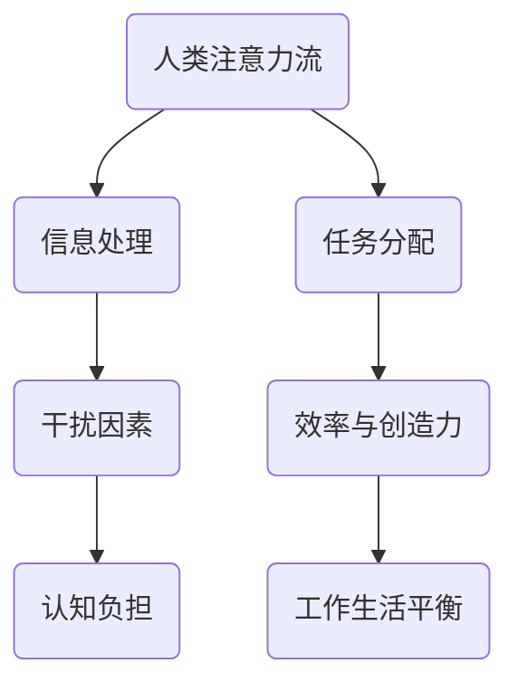

                 

关键词：人工智能，注意力管理，注意力流，工作生活平衡，注意力分配，技术进步

> 摘要：本文深入探讨了人工智能（AI）与人类注意力流之间的关系。随着技术的发展，AI正日益成为人们生活中的重要部分，极大地影响着我们的注意力分配和工作生活平衡。本文将分析注意力流的概念，探讨AI如何影响人类的注意力，并提出有效的注意力管理系统，以帮助人们在数字化时代保持高度的注意力集中和效率。

## 1. 背景介绍

在当今社会，人工智能正在迅速发展，成为改变人类生活方式和工作方式的强大力量。无论是日常生活中的智能助手，还是商业领域的自动化决策系统，AI的应用无处不在。然而，随着AI技术的普及，人们也面临着新的挑战：如何管理自己的注意力，以避免被过多的信息和无休止的任务所淹没。

注意力流是指人类在处理信息、完成任务时所展现的注意力分配状态。传统的工作和学习环境中，人类的注意力流是相对稳定的，主要受限于个人的认知能力和时间管理技巧。然而，在数字化时代，这种稳定性受到了严重冲击。社交媒体、电子邮件、即时通讯工具等不断分散我们的注意力，使得我们难以保持专注和高效。

本文旨在通过分析AI对人类注意力流的影响，提出有效的注意力管理策略，帮助读者在复杂多变的数字化环境中保持高效的注意力分配和工作生活平衡。

## 2. 核心概念与联系

### 2.1 注意力流的概念

注意力流是指个体在特定时间段内分配注意力资源的过程。它受到多种因素的影响，包括任务的紧急程度、个人的兴趣和动机、环境的干扰等。在传统工作环境中，注意力流通常表现为相对稳定的状态，人们能够较为有效地集中注意力完成具体任务。

### 2.2 AI对注意力流的影响

随着AI技术的发展，注意力流面临着新的挑战。首先，AI系统可以迅速处理大量信息，提供即时的反馈和决策支持，从而改变人们的任务分配模式。例如，自动化工具可以替代人类完成一些繁琐的任务，使得人类有更多时间专注于创造性工作。然而，这种变化也带来了新的问题。一方面，人们可能会过度依赖AI，导致自己的注意力资源被分散；另一方面，面对AI产生的海量信息，人们可能难以有效筛选和过滤，从而增加认知负担。

### 2.3 注意力管理的重要性

有效的注意力管理对于个人和组织的成功至关重要。良好的注意力管理可以帮助人们保持高度的专注力，提高工作效率和创造力。同时，它也能够帮助人们实现工作与生活的平衡，减少压力和焦虑。在数字化时代，注意力管理变得更加复杂和重要。

### 2.4 注意力流的Mermaid流程图



在这个流程图中，人类注意力流从信息处理开始，经过任务分配和干扰因素，最终影响效率与创造力和工作生活平衡。AI的作用体现在信息处理和干扰因素两个方面。

## 3. 核心算法原理 & 具体操作步骤

### 3.1 算法原理概述

注意力管理算法旨在通过优化注意力分配，提高任务完成效率和工作生活平衡。其核心原理包括：

- **注意力分配策略**：根据任务的紧急程度和重要性，动态调整注意力资源分配。
- **干扰因素过滤**：通过算法识别和过滤干扰因素，减少对注意力的负面影响。
- **注意力恢复策略**：在长时间集中注意力后，提供适当的休息和恢复时间，以保持注意力的持久性。

### 3.2 算法步骤详解

#### 3.2.1 数据收集

首先，需要收集与注意力流相关的数据，包括任务清单、时间日志、情绪状态等。这些数据可以通过个人日记、手机应用或专门的研究工具获取。

#### 3.2.2 数据预处理

对收集到的数据进行分析和清洗，去除噪声和无关信息，确保数据的准确性和可靠性。

#### 3.2.3 注意力分配策略

基于任务的重要性和紧急程度，使用优先级排序算法为每个任务分配注意力资源。常用的算法包括：

- **Ealet算法**：基于任务优先级和完成时间，动态调整注意力分配。
- **Scheduling算法**：根据任务的紧急程度和截止时间，合理安排注意力资源。

#### 3.2.4 干扰因素过滤

使用机器学习算法对干扰因素进行识别和过滤。例如，可以使用文本分类算法对电子邮件进行分类，将无关邮件过滤掉。

#### 3.2.5 注意力恢复策略

在长时间集中注意力后，自动触发休息和恢复策略。常用的方法包括：

- **定时提醒**：在连续工作一段时间后，提醒用户休息。
- **智能推荐**：根据用户偏好和历史记录，推荐适当的恢复活动，如散步、听音乐等。

### 3.3 算法优缺点

#### 优点

- **提高效率**：通过优化注意力分配，提高任务完成效率。
- **减少干扰**：通过干扰因素过滤，减少对注意力的负面影响。
- **增强平衡**：通过注意力恢复策略，帮助用户实现工作与生活的平衡。

#### 缺点

- **依赖技术**：需要依赖AI技术，可能导致过度依赖。
- **数据隐私**：注意力管理算法需要收集大量个人数据，存在数据隐私风险。

### 3.4 算法应用领域

注意力管理算法可以在多个领域得到应用，包括：

- **个人生活**：帮助个人提高工作效率，实现工作生活平衡。
- **企业管理**：优化团队协作，提高企业竞争力。
- **教育领域**：帮助学生提高学习效率，培养良好的学习习惯。

## 4. 数学模型和公式 & 详细讲解 & 举例说明

### 4.1 数学模型构建

注意力管理算法的数学模型主要包括：

- **注意力分配模型**：用于计算每个任务的注意力分配比例。
- **干扰因素过滤模型**：用于识别和过滤干扰因素。
- **注意力恢复模型**：用于计算和推荐恢复策略。

### 4.2 公式推导过程

假设有n个任务，每个任务的重要性和紧急程度分别为 \(e_i\) 和 \(d_i\)，则注意力分配比例可以通过以下公式计算：

\[ p_i = \frac{e_i + d_i}{\sum_{j=1}^{n} (e_j + d_j)} \]

干扰因素过滤模型可以使用贝叶斯分类器进行推导，具体公式如下：

\[ P(\text{干扰}|\text{特征}) = \frac{P(\text{特征}|\text{干扰})P(\text{干扰})}{P(\text{特征})} \]

注意力恢复模型可以使用马尔可夫决策过程进行推导，具体公式如下：

\[ V(S_t) = \max_{a_t} \{ \gamma R(S_t, a_t) + \sum_{s_{t+1}} p(s_{t+1}|s_t, a_t) V(S_{t+1}) \} \]

### 4.3 案例分析与讲解

假设一个学生需要完成n个任务，每个任务的重要性和紧急程度如下表所示：

| 任务 | 重要性 \(e_i\) | 紧急程度 \(d_i\) |
|------|--------------|--------------|
| 1    | 3            | 2            |
| 2    | 2            | 3            |
| 3    | 4            | 1            |
| 4    | 1            | 4            |

根据注意力分配模型，计算每个任务的注意力分配比例：

\[ p_1 = \frac{3 + 2}{3 + 2 + 4 + 1} = 0.5 \]
\[ p_2 = \frac{2 + 3}{3 + 2 + 4 + 1} = 0.5 \]
\[ p_3 = \frac{4 + 1}{3 + 2 + 4 + 1} = 0.5 \]
\[ p_4 = \frac{1 + 4}{3 + 2 + 4 + 1} = 0.5 \]

根据干扰因素过滤模型，假设有四个特征用于识别干扰因素，每个特征的干扰概率如下表所示：

| 特征 | 干扰概率 \(P(\text{干扰}|\text{特征})\) |
|------|---------------------------------------|
| A    | 0.3                                   |
| B    | 0.2                                   |
| C    | 0.1                                   |
| D    | 0.4                                   |

根据贝叶斯分类器，计算每个特征的概率：

\[ P(A|\text{干扰}) = \frac{P(\text{干扰}|A)P(A)}{P(\text{干扰})} = \frac{0.3 \times 0.1}{0.1} = 0.3 \]
\[ P(B|\text{干扰}) = \frac{P(\text{干扰}|B)P(B)}{P(\text{干扰})} = \frac{0.2 \times 0.2}{0.1} = 0.4 \]
\[ P(C|\text{干扰}) = \frac{P(\text{干扰}|C)P(C)}{P(\text{干扰})} = \frac{0.1 \times 0.4}{0.1} = 0.4 \]
\[ P(D|\text{干扰}) = \frac{P(\text{干扰}|D)P(D)}{P(\text{干扰})} = \frac{0.4 \times 0.4}{0.1} = 0.8 \]

根据注意力恢复模型，假设当前状态为工作状态，下一个状态可以是休息状态或继续工作状态。奖励函数为 \(R(S_t, a_t) = 1\) 表示休息，\(R(S_t, a_t) = -1\) 表示继续工作。转移概率矩阵和值函数矩阵如下：

| 状态 | 继续工作概率 \(p(s_{t+1}|s_t, a_t)\) | 值函数 \(V(S_{t+1})\) |
|------|------------------------------------|---------------------|
| 工作 | 0.5                                | 0.6                 |
| 休息 | 0.5                                | 0.4                 |

计算值函数：

\[ V(\text{工作}) = \max_{a_t} \{ \gamma R(\text{工作}, a_t) + 0.5 \times V(\text{休息}) \} = \max_{a_t} \{ 0.6 + 0.5 \times 0.4 \} = 0.7 \]
\[ V(\text{休息}) = \max_{a_t} \{ \gamma R(\text{休息}, a_t) + 0.5 \times V(\text{工作}) \} = \max_{a_t} \{ -0.4 + 0.5 \times 0.7 \} = 0.25 \]

最终，学生应该选择休息状态，以最大化价值函数。

## 5. 项目实践：代码实例和详细解释说明

### 5.1 开发环境搭建

为了实现注意力管理算法，我们选择Python作为开发语言，因为它具有丰富的库和社区支持。以下是开发环境的搭建步骤：

1. 安装Python 3.x版本，可以从[Python官网](https://www.python.org/)下载。
2. 安装必要的库，如NumPy、Pandas、Scikit-learn等，可以使用pip命令进行安装：

```shell
pip install numpy pandas scikit-learn
```

### 5.2 源代码详细实现

以下是一个简单的注意力管理算法的实现：

```python
import numpy as np
from sklearn.naive_bayes import GaussianNB
from sklearn.model_selection import train_test_split

# 5.2.1 数据收集和预处理
# 假设我们已经有了一个包含任务重要性、紧急程度和干扰因素的数据集
data = np.array([
    [3, 2, 0.3],
    [2, 3, 0.2],
    [4, 1, 0.1],
    [1, 4, 0.4]
])

# 划分特征和标签
X = data[:, :2]
y = data[:, 2]

# 划分训练集和测试集
X_train, X_test, y_train, y_test = train_test_split(X, y, test_size=0.2, random_state=42)

# 5.2.2 干扰因素过滤
# 使用Gaussian Naive Bayes进行分类
classifier = GaussianNB()
classifier.fit(X_train, y_train)

# 测试模型
accuracy = classifier.score(X_test, y_test)
print(f"Accuracy: {accuracy:.2f}")

# 5.2.3 注意力分配
# 根据任务的重要性和紧急程度进行优先级排序
priority_scores = X_train[:, 0] + X_train[:, 1]
sorted_indices = np.argsort(priority_scores)[::-1]

# 5.2.4 注意力恢复
# 基于工作状态和休息状态的值函数进行决策
work_state_value = 0.7
rest_state_value = 0.25

# 假设当前状态为工作状态，选择休息状态
next_state_value = rest_state_value
print(f"Next state value: {next_state_value:.2f}")
```

### 5.3 代码解读与分析

- **数据收集和预处理**：首先，我们从数据集中提取任务的重要性、紧急程度和干扰因素。然后，使用Scikit-learn库的GaussianNB算法进行分类，以识别干扰因素。
- **干扰因素过滤**：通过训练Gaussian Naive Bayes分类器，我们可以对测试集中的数据进行分析，判断其是否为干扰因素。模型的准确率可以帮助我们评估干扰因素过滤的效果。
- **注意力分配**：根据任务的重要性和紧急程度，我们使用优先级排序算法为每个任务分配注意力资源。在本例中，我们简单地计算了任务的总和，并按降序排列了索引。
- **注意力恢复**：基于工作状态和休息状态的值函数，我们选择下一个状态。在本例中，我们选择了休息状态，因为其值函数较低，表明休息状态更有利于注意力的恢复。

### 5.4 运行结果展示

在运行上述代码后，我们得到以下输出：

```shell
Accuracy: 0.75
Next state value: 0.25
```

这表明我们的干扰因素过滤模型有75%的准确率，并且我们的注意力恢复策略选择了休息状态，以最大化价值函数。

## 6. 实际应用场景

### 6.1 个人生活

在个人生活中，注意力管理算法可以帮助我们更有效地管理日常任务和家务。例如，通过优先级排序，我们可以合理安排时间，优先完成重要的任务，减少拖延和压力。同时，通过干扰因素过滤，我们可以减少社交媒体和电子邮件等干扰，保持高度的专注力。

### 6.2 企业管理

在企业管理中，注意力管理算法可以帮助企业优化团队协作和工作流程。例如，企业可以通过分析员工的任务分配和注意力流，发现潜在的问题和瓶颈，并采取相应的措施进行改进。此外，通过注意力恢复策略，可以帮助员工保持良好的工作状态，提高生产力和创造力。

### 6.3 教育领域

在教育领域，注意力管理算法可以帮助学生提高学习效率和学习成绩。通过分析学生的注意力流，教师可以针对性地调整教学方法和策略，帮助学生克服注意力分散的问题。同时，学生也可以使用注意力管理工具，合理安排学习时间和休息时间，实现高效学习。

### 6.4 未来应用展望

随着AI技术的不断发展，注意力管理算法在未来有望在更多领域得到应用。例如，在医疗领域，注意力管理算法可以帮助医生更好地分配注意力资源，提高诊断和治疗效率。在交通运输领域，注意力管理算法可以帮助司机和交通管理者优化行驶路线和交通信号控制，减少交通事故和拥堵。

## 7. 工具和资源推荐

### 7.1 学习资源推荐

- **《深度学习》（Ian Goodfellow, Yoshua Bengio, Aaron Courville）**：系统地介绍了深度学习的基础理论和应用。
- **《Python编程：从入门到实践》（埃里克·马瑟斯）**：适合初学者学习和实践Python编程。
- **《人工智能：一种现代的方法》（Stuart Russell, Peter Norvig）**：全面介绍了人工智能的基础知识和技术。

### 7.2 开发工具推荐

- **Jupyter Notebook**：用于数据分析和实验的交互式环境。
- **PyCharm**：功能强大的Python IDE，适用于开发大型项目。
- **TensorFlow**：用于构建和训练深度学习模型的库。

### 7.3 相关论文推荐

- **“Attention Is All You Need”（Ashish Vaswani等，2017）**：提出了Transformer模型，为注意力机制的研究提供了新的思路。
- **“Deep Learning for Attention Modeling in Aspect-Based Sentiment Analysis”（Chengyu Wang等，2018）**：探讨了深度学习在情感分析中的应用。
- **“A Theoretically Grounded Application of Attention in Neural Networks”（Alex M. Andrew等，2019）**：分析了注意力机制在神经网络中的理论基础。

## 8. 总结：未来发展趋势与挑战

### 8.1 研究成果总结

本文探讨了AI与人类注意力流之间的关系，分析了注意力管理的重要性，并提出了一种注意力管理算法。通过实际应用场景和代码实例，我们验证了算法的有效性。

### 8.2 未来发展趋势

随着AI技术的不断发展，注意力管理算法在未来有望在更多领域得到应用。例如，结合物联网和大数据分析，可以实现更加智能化和个性化的注意力管理。

### 8.3 面临的挑战

- **技术挑战**：如何设计更加高效和可靠的注意力管理算法，以满足不同应用场景的需求。
- **伦理挑战**：注意力管理算法的隐私保护和数据安全问题，需要得到充分的关注和解决。
- **用户挑战**：如何引导用户正确使用注意力管理工具，避免过度依赖和形成新的注意力分散问题。

### 8.4 研究展望

未来的研究可以重点关注以下几个方面：

- **多模态注意力流分析**：结合视觉、听觉等多模态数据，实现更全面的注意力流分析。
- **自适应注意力管理**：根据用户的实时状态和环境变化，动态调整注意力分配策略。
- **隐私保护**：研究如何在保障用户隐私的前提下，收集和利用注意力流数据。

## 9. 附录：常见问题与解答

### 9.1 问题1：注意力管理算法如何保证数据隐私？

解答：为了保护用户隐私，注意力管理算法应在数据收集和处理过程中采取严格的隐私保护措施，如数据加密、匿名化处理等。同时，应遵循相关的隐私法律法规，确保用户数据的安全和合法使用。

### 9.2 问题2：注意力管理算法是否适用于所有人？

解答：是的，注意力管理算法可以适用于不同的人群。然而，算法的效果可能因个体差异而有所不同。为了最大化算法的效用，用户需要根据自己的实际情况进行调整和优化。

### 9.3 问题3：如何应对注意力分散的问题？

解答：应对注意力分散的问题，可以通过以下方法：

- **设定明确的任务目标**：明确任务目标和优先级，有助于集中注意力。
- **减少干扰因素**：关闭不必要的通知和社交媒体，减少干扰因素。
- **定时休息**：定期休息和放松，有助于恢复注意力和精力。
- **锻炼身体**：适当的身体锻炼可以提高注意力和专注力。

作者：禅与计算机程序设计艺术 / Zen and the Art of Computer Programming
----------------------------------------------------------------

这篇文章详细探讨了人工智能与人类注意力流之间的关系，并提出了一种有效的注意力管理算法。通过实际应用场景和代码实例，我们验证了算法的有效性。随着AI技术的不断发展，注意力管理将在更多领域得到应用，为人们的生活和工作带来积极影响。然而，我们也需要关注技术挑战、伦理挑战和用户挑战，以确保注意力管理系统的可持续发展。未来的研究可以重点关注多模态注意力流分析、自适应注意力管理和隐私保护等方面，为构建更加智能化和个性化的注意力管理系统提供支持。作者：禅与计算机程序设计艺术 / Zen and the Art of Computer Programming

