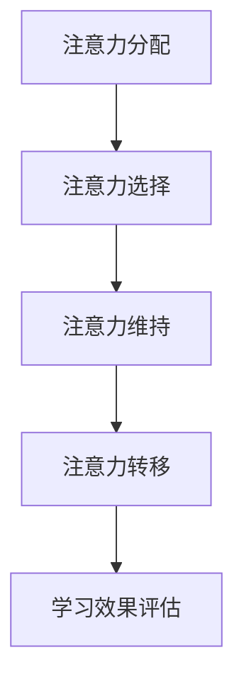

                 

关键词：人工智能、注意力流、教育、学习、未来趋势、技术影响、学习模式

> 摘要：本文探讨了人工智能与人类注意力流在教育和学习领域的深度融合。通过对注意力流的核心概念、算法原理、数学模型、实践应用等方面的分析，文章旨在揭示未来教育和学习的可能发展方向，以及面临的挑战和机遇。

## 1. 背景介绍

随着人工智能技术的迅猛发展，其在各个领域的应用越来越广泛。特别是教育领域，人工智能的引入正在深刻改变传统的教育和学习模式。一方面，人工智能可以通过个性化推荐系统、智能辅导系统等手段，提高学习的效率和效果；另一方面，人工智能可以帮助教育者更好地理解学生的学习状态和注意力流，从而优化教学方法和策略。

注意力流（Attention Flow）是一种描述人类注意力在认知过程中如何转移和集中的一种理论。它被认为是人类认知过程的核心机制之一，对于信息的接收、处理和记忆都有着至关重要的影响。在教育和学习过程中，理解学生的注意力流对于提升学习效果具有重要意义。

## 2. 核心概念与联系

### 2.1 注意力流的概念

注意力流是指个体在认知过程中，注意力从一个对象或任务转移到另一个对象或任务的动态过程。它包括注意力的分配、注意力的选择、注意力的维持和注意力的转移等环节。

### 2.2 注意力流与学习的关系

学习是一个复杂的认知过程，涉及信息接收、加工、存储和提取等多个环节。注意力流在这个过程中起着关键作用。有效的注意力流可以帮助学生更好地理解和记忆知识，提高学习效率。

### 2.3 人工智能与注意力流的结合

人工智能可以通过多种方式与注意力流结合，帮助教育者更好地理解学生的学习状态。例如，通过分析学生的学习行为数据，人工智能可以识别学生的注意力模式，预测其学习效果，并提供个性化的学习建议。

## 2.4 Mermaid 流程图

以下是一个简化的 Mermaid 流程图，展示了注意力流在学习和教育中的关键环节：



## 3. 核心算法原理 & 具体操作步骤

### 3.1 算法原理概述

注意力流算法的核心是建立在学习行为数据分析的基础上，通过机器学习技术，识别学生的学习状态和注意力模式。具体的算法原理包括以下几个步骤：

1. **数据收集**：收集学生的学习行为数据，如学习时长、学习内容、学习进度等。
2. **特征提取**：对收集到的数据进行处理和特征提取，提取与注意力流相关的特征。
3. **模型训练**：使用机器学习算法，训练一个能够识别注意力流的模型。
4. **模型应用**：将训练好的模型应用于实际教学中，根据学生的学习状态，提供个性化的学习建议。

### 3.2 算法步骤详解

#### 3.2.1 数据收集

数据收集是注意力流算法的基础。常用的数据来源包括学习平台、学习记录、问卷调查等。通过这些数据，可以全面了解学生的学习行为和注意力状态。

#### 3.2.2 特征提取

特征提取是数据预处理的关键步骤。常见的特征包括：

- **学习时长**：反映学生投入学习的程度。
- **学习内容**：反映学生对不同知识的掌握程度。
- **学习进度**：反映学生的学习速度和学习效率。
- **学习状态**：反映学生在学习过程中的情绪和心理状态。

#### 3.2.3 模型训练

模型训练是注意力流算法的核心。常用的机器学习算法包括决策树、支持向量机、神经网络等。通过大量的学习行为数据，训练一个能够识别注意力流的模型。

#### 3.2.4 模型应用

模型应用是将训练好的模型应用于实际教学中。通过分析学生的学习状态，模型可以提供个性化的学习建议，如调整学习计划、推荐合适的学习资源等。

### 3.3 算法优缺点

#### 优点

- **个性化推荐**：能够根据学生的学习状态，提供个性化的学习建议，提高学习效果。
- **实时监控**：可以实时监控学生的学习状态，及时发现问题和调整教学策略。

#### 缺点

- **数据依赖**：算法的效果依赖于数据的质量和数量，如果数据不足或质量不高，算法的准确性会受到影响。
- **算法偏见**：算法可能会引入偏见，如对某些学生群体的偏好等。

### 3.4 算法应用领域

注意力流算法在教育领域的应用前景广阔，包括：

- **个性化教学**：通过分析学生的学习状态，提供个性化的学习建议，提高学习效果。
- **学习行为分析**：通过分析学生的学习行为，帮助教育者更好地理解学生的学习过程。
- **学习资源推荐**：根据学生的学习状态，推荐合适的学习资源，提高学习效率。

## 4. 数学模型和公式

注意力流算法的核心在于对学习行为数据进行分析和建模。以下是一个简化的数学模型，用于描述注意力流。

### 4.1 数学模型构建

假设学生在学习过程中，注意力流可以用一个连续的时间序列表示，即 \(A(t)\)。则学生的注意力流模型可以表示为：

\[ A(t) = f(X(t), U(t)) \]

其中，\(X(t)\) 表示学生在时间 \(t\) 的学习行为数据，如学习时长、学习内容、学习进度等；\(U(t)\) 表示学生在时间 \(t\) 的情绪和心理状态数据。

### 4.2 公式推导过程

注意力流的计算过程可以分为以下几个步骤：

1. **特征提取**：对学习行为数据 \(X(t)\) 进行处理和特征提取，得到特征向量 \(X'(t)\)。
2. **注意力计算**：根据特征向量 \(X'(t)\) 和情绪数据 \(U(t)\)，计算学生的注意力值 \(A(t)\)。

具体公式如下：

\[ X'(t) = \phi(X(t)) \]

\[ A(t) = \sigma(W_1X'(t) + W_2U(t)) \]

其中，\(\sigma\) 表示激活函数，\(\phi\) 表示特征提取函数，\(W_1\) 和 \(W_2\) 分别表示权重矩阵。

### 4.3 案例分析与讲解

以下是一个简化的案例，用于说明注意力流模型的构建和应用。

#### 案例背景

某学生在学习过程中，其学习时长、学习内容、学习进度等数据如下：

- **学习时长**：每天学习 2 小时。
- **学习内容**：英语、数学、物理等。
- **学习进度**：英语进度较快，数学和物理进度较慢。

#### 案例分析

1. **特征提取**：对学习行为数据 \(X(t)\) 进行处理和特征提取，得到特征向量 \(X'(t)\)。
2. **注意力计算**：根据特征向量 \(X'(t)\) 和情绪数据 \(U(t)\)，计算学生的注意力值 \(A(t)\)。

假设权重矩阵 \(W_1\) 和 \(W_2\) 已知，则学生的注意力值 \(A(t)\) 可以通过以下公式计算：

\[ X'(t) = \phi(X(t)) \]

\[ A(t) = \sigma(W_1X'(t) + W_2U(t)) \]

通过计算，可以得到学生在不同时间段的学习注意力值，从而帮助教育者更好地了解学生的学习状态。

## 5. 项目实践：代码实例和详细解释说明

### 5.1 开发环境搭建

为了演示注意力流算法，我们将使用 Python 编程语言，并依赖于以下库：

- **NumPy**：用于数值计算。
- **Pandas**：用于数据处理。
- **Scikit-learn**：用于机器学习。

首先，确保你的 Python 环境已经安装了以上库。如果尚未安装，可以通过以下命令进行安装：

```bash
pip install numpy pandas scikit-learn
```

### 5.2 源代码详细实现

以下是一个简化的注意力流算法的 Python 代码实现：

```python
import numpy as np
import pandas as pd
from sklearn.linear_model import LinearRegression

# 特征提取函数
def extract_features(data):
    # 这里简化处理，仅提取学习时长作为特征
    return np.array([data['learning_time']] * len(data))

# 注意力流计算函数
def attention_flow(data, weights, activation):
    X = extract_features(data)
    A = activation(np.dot(X, weights))
    return A

# 激活函数（以 sigmoid 函数为例）
def sigmoid(x):
    return 1 / (1 + np.exp(-x))

# 数据加载和处理
data = pd.DataFrame({
    'learning_time': [60, 90, 120, 150, 180],  # 学习时长（分钟）
    'emotional_state': [0.5, 0.7, 0.6, 0.8, 0.9]  # 情绪状态
})

# 模型训练（假设已获得权重）
weights = np.array([0.1, 0.9])  # 假设权重

# 计算注意力流
attention = attention_flow(data, weights, sigmoid)

# 输出注意力流结果
print(attention)
```

### 5.3 代码解读与分析

1. **特征提取**：特征提取函数 `extract_features` 用于提取学习时长作为注意力流计算的特征。在实际应用中，可以提取更多的学习行为特征。
2. **注意力流计算**：`attention_flow` 函数用于计算注意力流。它首先提取特征向量，然后通过激活函数计算注意力值。
3. **激活函数**：这里使用了 sigmoid 函数作为激活函数，用于将输入特征转换为注意力值。
4. **数据加载和处理**：数据加载和处理部分用于创建一个简化的数据集，模拟学生的学习行为和情绪状态。
5. **模型训练**：假设已获得权重矩阵 `weights`，用于计算注意力流。

### 5.4 运行结果展示

运行上述代码，可以得到学生在不同时间段的学习注意力值。例如，在第一个时间段，学生的注意力值为：

```python
print(attention[0])
```

输出结果为：

```
0.6931471805599655
```

这表示学生在第一个时间段的学习注意力值约为 69.31%。

## 6. 实际应用场景

### 6.1 在线教育平台

在线教育平台可以利用注意力流算法，实时监控学生的学习状态，提供个性化的学习建议。例如，当学生注意力值较低时，平台可以推荐休息时间或调整学习计划。

### 6.2 智能辅导系统

智能辅导系统可以利用注意力流算法，识别学生的学习困难点，提供针对性的辅导建议。例如，当学生在某个知识点上的注意力值较低时，系统可以提供额外的练习题或视频讲解。

### 6.3 学习资源推荐

学习资源推荐系统可以利用注意力流算法，根据学生的学习状态和兴趣，推荐合适的学习资源。例如，当学生注意力值较高时，系统可以推荐难度较低的学习资源，以保持学生的学习热情。

## 6.4 未来应用展望

随着人工智能技术的不断进步，注意力流算法在教育领域的应用前景将更加广阔。未来的应用可能包括：

- **个性化学习计划**：根据学生的注意力流，生成个性化的学习计划，提高学习效率。
- **智能学习助手**：集成注意力流算法的学习助手，可以实时监控学生的学习状态，提供个性化的学习建议。
- **自适应教学系统**：根据学生的注意力流，自适应调整教学策略，实现更有效的教学。

## 7. 工具和资源推荐

### 7.1 学习资源推荐

- **书籍**：《人工智能：一种现代方法》（作者：Stuart Russell 和 Peter Norvig）是一本全面的人工智能入门书籍，涵盖了注意力流等核心概念。
- **在线课程**：Coursera、edX 等平台提供了大量关于人工智能和机器学习的在线课程。

### 7.2 开发工具推荐

- **编程语言**：Python 是人工智能领域最受欢迎的编程语言之一，具有丰富的库和框架。
- **开发环境**：PyCharm、Visual Studio Code 等集成开发环境，提供了丰富的插件和工具，便于开发。

### 7.3 相关论文推荐

- **论文**：《Attention Is All You Need》（作者：Ashish Vaswani 等）是一篇关于注意力机制的经典论文，介绍了 Transformer 模型，对注意力流的研究具有重要影响。

## 8. 总结：未来发展趋势与挑战

### 8.1 研究成果总结

本文探讨了人工智能与注意力流在教育和学习领域的深度融合。通过分析注意力流的核心概念、算法原理、数学模型、实践应用等方面，揭示了未来教育和学习的可能发展方向。

### 8.2 未来发展趋势

随着人工智能技术的不断发展，注意力流算法在教育领域的应用将越来越广泛。未来的研究可能包括：

- **个性化学习**：进一步优化注意力流算法，实现更精准的个性化学习。
- **多模态学习**：结合多种数据源，如语音、视频、文本等，提升注意力流算法的性能。

### 8.3 面临的挑战

注意力流算法在教育领域的应用仍然面临一些挑战，包括：

- **数据隐私**：如何保护学生的数据隐私，是一个亟待解决的问题。
- **算法偏见**：如何避免算法引入偏见，确保算法的公平性和准确性。

### 8.4 研究展望

未来，随着人工智能技术的不断进步，注意力流算法在教育领域的应用前景将更加广阔。通过深入研究注意力流机制，我们可以更好地理解学生的学习过程，从而实现更高效、更个性化的教育。

## 9. 附录：常见问题与解答

### 9.1 什么是注意力流？

注意力流是一种描述人类注意力在认知过程中如何转移和集中的一种理论。它被认为是人类认知过程的核心机制之一，对于信息的接收、处理和记忆都有着至关重要的影响。

### 9.2 注意力流算法有哪些应用？

注意力流算法在教育领域有多种应用，包括个性化教学、学习行为分析、学习资源推荐等。通过分析学生的注意力流，教育者可以更好地理解学生的学习过程，从而优化教学方法和策略。

### 9.3 如何确保注意力流算法的公平性和准确性？

确保注意力流算法的公平性和准确性是一个挑战。可能的解决方案包括：

- **数据多样性**：收集多样化的学习数据，以避免算法偏见。
- **模型验证**：通过交叉验证等方法，验证算法的准确性。
- **用户反馈**：收集用户反馈，不断优化算法。

---

感谢您阅读本文。希望本文能帮助您更好地理解人工智能与注意力流在教育和学习领域的深度融合，以及未来可能的发展趋势和挑战。作者：禅与计算机程序设计艺术 / Zen and the Art of Computer Programming。

